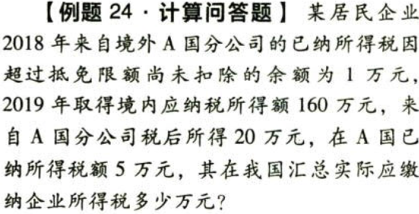
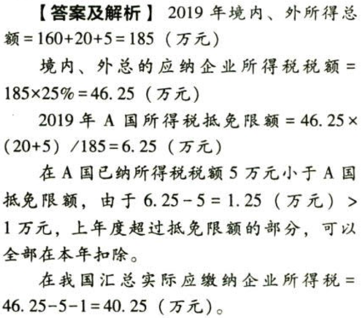

国际税收税务管理实务.实际抵免境外税额的计算

## 0.1. 实际抵免境外税额的计算:star: :star: 

在计算实际应抵免的境外已缴纳和间接负担的所得税税额时，企业在境外一国（地区）当年缴纳和间接负担的符合规定的所得税税额低于所计算的该国（地区）抵免限额的，应以该项税额作为境外所得税抵免额从企业应纳税总额中据实抵免；超过抵免限额的，当年应以抵免限额作为境外所得税抵免额进行抵免，超过抵免限额的余额允许从次年起在连续`五个纳税年度`内，用每年度抵免限额抵免当年应抵税额后的余额进行抵补。

企业当年境外一国（地区）可抵免税额中既有属于当年已直接缴纳或间接负担的境外所得税额，又有以前年度结转的未逾期可抵免税额时，应`首先抵免`当年己`直接缴纳或间接负担的`境外所得税额后，抵免限额有余额的，可`再抵免`以前年度`结转的`未逾期可抵免税额，仍抵免不足的，继续向以后年度结转。

