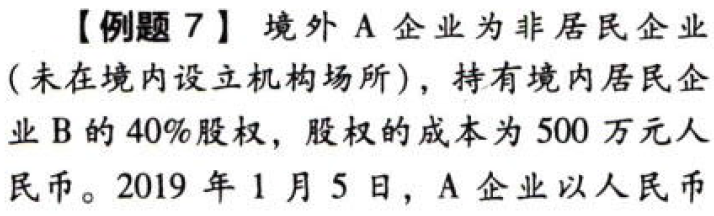
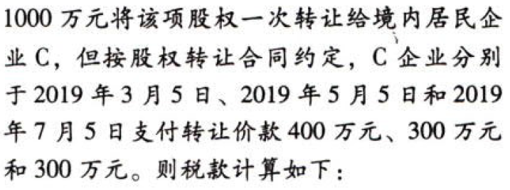
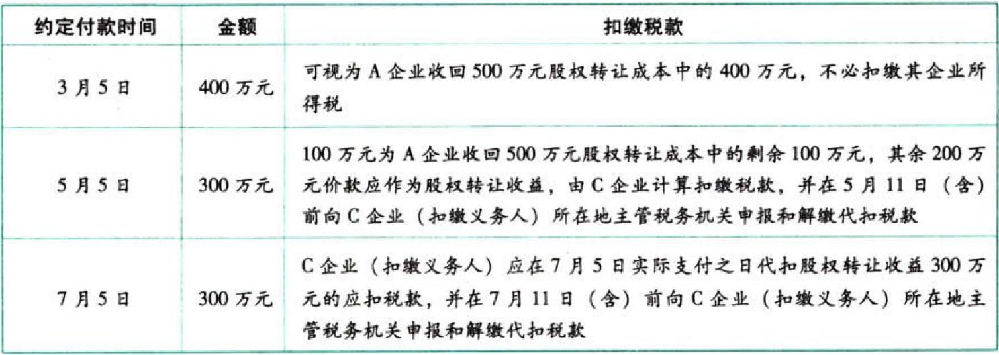

国际税收税务管理实务.扣缴税款要求

### 0.0.1. 扣缴税款要求

#### 0.0.1.1. 委托代理

支付人自行委托代理人或指定其他第三方代为支付相关款项，或者因担保合同或法律规定等原因由第三方保证人或担保人支付相关款项的，仍由委托人、指定人或被保证人、被担保人承担扣缴义务。

#### 0.0.1.2. 扣缴义务时间

##### 0.0.1.2.1. 一般规定

扣缴义务人应在向非居民企业实际支付时从支付款项中扣除税款并自扣缴义务发生之日起`7日`内向扣缴义务人所在地主管税务机关申报和解缴代扣税款。

##### 0.0.1.2.2. 特殊规定

滞后支付和特殊项目的扣缴义务时间的确定：

###### 0.0.1.2.2.1. （1）中国境内企业（以下简称“企业”）和非居民企业签订与利息、租金、特许权使用费等所得有关的合同或协议

①如果未按照合同或协议约定的日期支付规定所得款项，或者变更或修改合同或协议延期支付，但已`计入`企业当期`成本、费用`，并在企业所得税年度纳税申报中作`税前扣除`的，应在企业所得税年度纳税申报时按照《企业所得税法》有关规定`代扣代缴`企业所得税

按照实际支付、合同约定支付与影响成本费用`孰先`的原则代扣代缴所得税。对于一次性计入成本费用的，影响企业所得税年度成本利润的延期支付，在所得税年度申报时扣缴企业所得税

②如果企业到期未支付的规定所得款项，不是一次性计入当期成本、费用，而是计入相应资产原价或企业筹办费，在该类资产投入使用或开始生产经营后分期摊入成本、费用，`分年度`在企业所得税前扣除的，应在企业`计入相关资产的年度`纳税申报时就上述所得金额代扣代缴企业所得税

滞后计入资产原价或筹办费分次影响成本费用的，不能分次扣税，而要在`计入相关资产的年度`纳税申报时`整体扣税`

###### 0.0.1.2.2.2. （2）非居民企业取得应源泉扣缴的所得为股息、红利等权益性投资收益的

相关应纳税款扣缴义务发生之日为股息、红利等权益性投资收益`实际支付`之日

非居民企业该类所得应纳税款扣缴义务发生之日是实际支付之日，不是作出利润分配决定之日

###### 0.0.1.2.2.3. （3）非居民企业采取分期收款方式取得应源泉扣缴所得税的同一项转让财产所得的

其分期收取的款项可先视为收回以前投资财产的成本，待`成本全部收回`后，再计算并`扣缴`应扣税款

分期取得转让财产所得，先扣成本后扣税

#### 0.0.1.3. 资料

扣缴义务人在申报和解缴应扣税款时，应填报`《中华人民共和国扣缴企业所得税报告表》`。

扣缴义务人可以在申报和解缴应扣税款前报送有关申报资料；已经报送的，在申报时不再重复报送。

主管税务机关可以要求纳税人、扣缴义务人和其他知晓情况的相关方提供与应扣缴税款有关的合同和其他相关资料。扣缴义务人应当设立代扣代缴税款账簿和合同资料档案，准确记录非居民企业所得税扣缴情况。

#### 0.0.1.4. 应扣未扣

应扣未扣税款的，纳税人（非居民企业）的自行申报。

##### 0.0.1.4.3. （1）纳税人（非居民企业）未被扣缴应扣税款时，有自行申报的义务

扣缴义务人未依法扣缴或者无法履行扣缴义务的，取得所得的非居民企业应当按照《企业所得税法》第三十九条规定，向所得发生地主管税务机关申报缴纳未扣缴税款，并填报《中华人民共和国扣缴企业所得税报告表》

##### 0.0.1.4.4. （2）非居民企业被限期自行申报的举措

扣缴义务人未依法扣缴或者无法履行扣缴义务的，由纳税人（非居民企业）在所得发生地申报缴纳，但非居民企业（纳税人）没有按照规定申报缴纳的，税务机关可以责令限期缴纳，非居民企业应当按照税务机关确定的期限申报缴纳税款；非居民企业在税务机关责令限期缴纳前自行申报缴纳税款的，视为己按期缴纳税款，不加收滞纳金，不实施惩罚性措施

##### 0.0.1.4.5. （3）同一项所得多个发生地的申报纳税

非居民企业取得的同一项所得在境内存在多个所得发生地，涉及多个主管税务机关的，在按照《企业所得税法》第三十九条规定自行申报缴纳未扣缴税款时，可以选择一地办理规定的取报缴税事宜。受理申报地主管税务机关应在受理申报后`5个工作日`内，向扣缴义务人所在地和同一项所得其他发生地主管税务机关发送`《非居民企业税务事项联络函》`，告知非居民企业涉税事项，不需要纳税人多处申报

#### 0.0.1.5. 扣缴非居民企业应纳税款的相关法律责任和举措

##### 0.0.1.5.6. （1）应扣未扣的补扣与追缴

按照《企业所得税法》第三十七条规定应当扣缴的税款，扣缴义务人应扣未扣的，由扣缴义务人所在地主管税务机关依照`《中华人民共和国行政处罚法》`第二十三条规定责令扣缴义务人补扣税款，并依法追究拍缴义务人责任；需要向纳税人追缴税款的，由所得发生地主管税务机关依法执行。扣缴义务人所在地与所得发生地不一致的，负责追缴税款的所得发生地主管税务机关应通过扣缴义务人所在地主管税务机关核实有关情况；扣缴义务人所在地主管税务机关应当自确定应纳税款未依法扣缴之日起`5个工作日`内，向所得发生地主管税务机关发送`《非居民企业税务事项联络函》`，告知非居民企业涉税事项

##### 0.0.1.5.7. （2）追缴措施

主管税务机关在按照有关规定追缴非居民企业应纳税款时，可以采取以下措施：

①`责令`该非居民企业限期申报缴纳应纳税款

②收集、查实该非居民企业在中国境内`其他`收入项目及其支付人的相关信息，并向该其他项目支付人发出`《税务事项通知书》`，从该非居民企业其他收入项目款项中依照法定程序追缴欠缴税款及应缴的游纳金

其他项目支付人所在地与未扣税所得发生地不一致的，其他项目支付人所在地主管税务机关应给予配合和协助

##### 0.0.1.5.8. （3）对扣缴义务人的处理

###### 0.0.1.5.8.4. 第一类——已扣未缴

按照规定应当源泉扣缴税款的款项已经由扣缴义务人实际支付，但未在规定的期限内解缴应扣税款，并具有以下情形之一的，应作为`税款已扣但未解缴`情形，按照有关法律、行政法规规定处理：

①扣缴义务人已明确告知收款人已代扣税款的

②已在财务会计处理中单独列示应扣税款的

③已在其纳税申报中单独扣除或开始单独摊销扣除应扣税款的

④其他证据证明已代扣税款的

对已扣未缴行为，由税务机关追缴其少缴税款、滞纳金；逾期仍未缴纳的强制追缴并处少缴税款50%以上至5倍以下的罚款

###### 0.0.1.5.8.5. 第二类——应扣未扣

除上款规定情形外，按规定应该源泉如缴的税款未在规定的期限内解缴入库的，均作为应扣未扣税款情形，按照有关法律、行政法规规定处理

对应扣未扣行为，责令限期改正（补扣税款或税务机关向纳税人追缴），处以应扣未扣税款50%以上至3倍以下罚款

#### 0.0.1.6. 扣缴义务人所在地主管税务机关为扣缴义务人所得税主管税务机关

对企业所得税法实施条例规定的不同所得，所得发生地主管税务机关按以下原则确定：

（1）不动产转让所得，为不动产所在地税务机关。

（2）权益性投资资产转让所得，为被投资企业的所得税主管税务机关。

（3）股息、红利等权益性投资所得，为分配所得企业的所得税主管税务机关。

（4）利息所得、租金所得、特许权使用费所得，为负担、支付所得的单位或个人的所得税主管税务机关。
