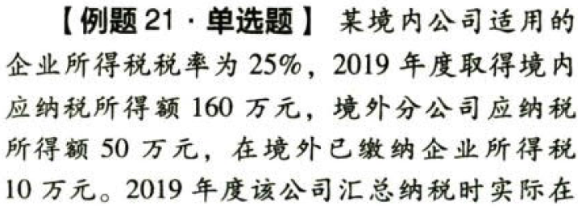
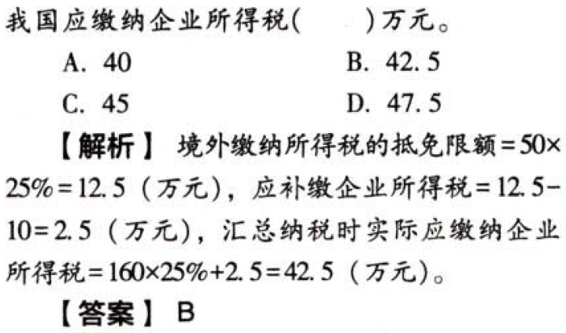
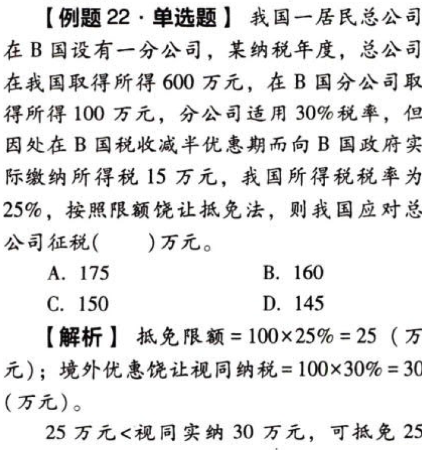
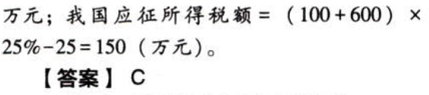
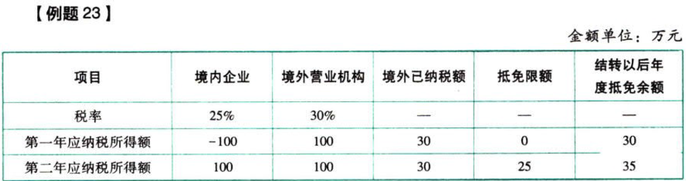
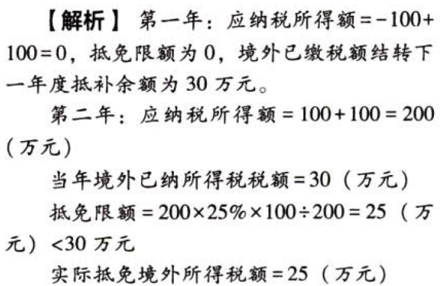
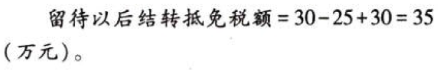

国际税收税务管理实务.抵免限额的计算

## 0.1. 抵免限额的计算:star: :star: :star: 

### 0.1.1. 分国不分项

分国不分项原则下，境外所得税税额抵免限额公式：

```
抵免限额＝来源于某国（地区）的应纳税所得额×境内、境外所得按我国税法计算的应纳税总额÷境内、境外应纳税所得总额
```
公式中的所得是税前所得（含税所得）。考试时要注意区分境外分回所得是税前所得还是税后所得，如果分回的是税后所得，在单层抵免的条件下可选用以下两种方法还原成税前所得：①分回的税后所得/(1－境外所得税税率)

②境外己纳税额＋分回的税后所得

该公式可以简化成：

```
抵免限额＝来源于某国（地区）的应纳税所得额×我国税率
```
关于上述公式中的税率，一般为法定税率25%。但是以境内、境外全部生产经营活动有关的研究开发费用总额、总收入、销售收入总额、高新技术产品（服务）收入等指标申请并经认定的`高新技术企业`，其来源于境外的所得可以享受高新技术企业所得税优惠政策，即对其来源于境外所得可以按照15%的优惠税率缴纳企业所得税，在计算境外抵免限额时，可按照15%的优惠税率计算境内外应纳税总额。









### 0.1.2. 境内、外所得之间的亏损弥补

企业按照税法的有关规定计算的当期境内、境外应纳税所得总额小于零的，应以零计算当期境内、境外应纳税所得总额，其当期境外所得税的抵免限额也为零。【？？】

若企业境内所得为亏损，境外所得为盈利，且企业已使用同期境外盈利全部或部分弥补了境内亏损，则境内已用境外盈利弥补的亏损不得再用以后年度境内盈利重复弥补。由此，在计算境外所得抵免限额时，形成当期境内、外应纳税所得总额小于零的，应以零计算当期境内、外应纳税所得总额，其当期境外所得税的抵免限额也为零。上述境外盈利在境外已纳的可予抵免但未能抵免的税额可以在以后5个纳税年度内进行结转抵免。

分国不分项原则下，如果企业境内为亏损，境外盈利分别来自多个国家，则弥补境内亏损时，企业可以自行选择弥补境内亏损的境外所得来源国家（地区）顺序。






