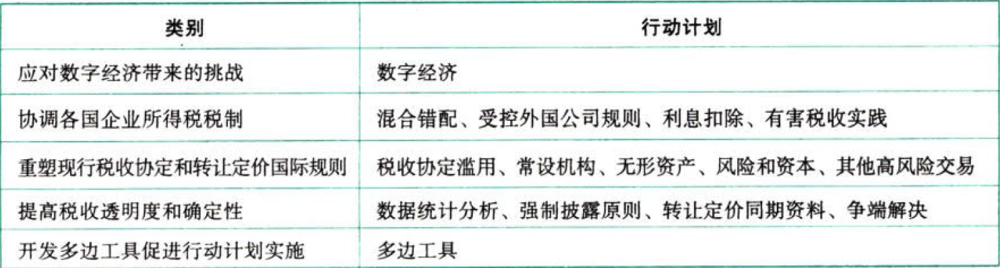

国际税收税务管理实务.税基侵蚀和利润转移项目

## 0.1. 税基侵蚀和利润转移项目:star: :star: 

税基侵蚀和利润转移项目是由二十国集团（以下简称“G20”）领导人背书，并委托经济合作与发展组织（以下简称“OECD”）推进的国际税改项目，是G20框架下各国携手打击国际逃避税，共同建立有利于全球经济增长的国际税收规则体系和行政合作机制的重要举措。

2013年6月，OECD发布`《税基侵蚀和利润转移行动计划》`（以下简称“BEPS行动计划”）。

### 0.1.1. 税基侵蚀和利润转移行动计划

#### 0.1.1.1. BEPS十五项行动计划的分类

#### 0.1.1.2. BEPS十五项行动计划的实质——税收要与实质经济活动和价值创造相匹配

当前，全球利润至少50%以上涉及`国际交易`，特别是企业集团跨境关联交易数额巨大。所有这些交易都可以在现有规则体系下进行`避税筹划`。筹划的结果是税收权益与实质经济活动的错配，经济活动发生地没有留下应有的利润，也没有获得应有的税收。生产要素的跨境配置受到扭曲，税收公平面临挑战，国际税收秩序受到严重威胁。因此，国际社会必须携手改革现有国际税收规则体系，以适应快速发展的经济全球化趋势。

### 0.1.2. 税基侵蚀和利润转移项目成果

2015年10月，OECD发布了BEPS行动计划全部15项产出成果，包括13份最终报告和1份解释性声明。15项行动计划成果的顺利完成，标志着BEPS行动计划步入成果转化、`具体实施`的新阶段。

### 0.1.3. 税基侵蚀和利润转移项目的影响

此项工作的重点是消除双重不征税。
