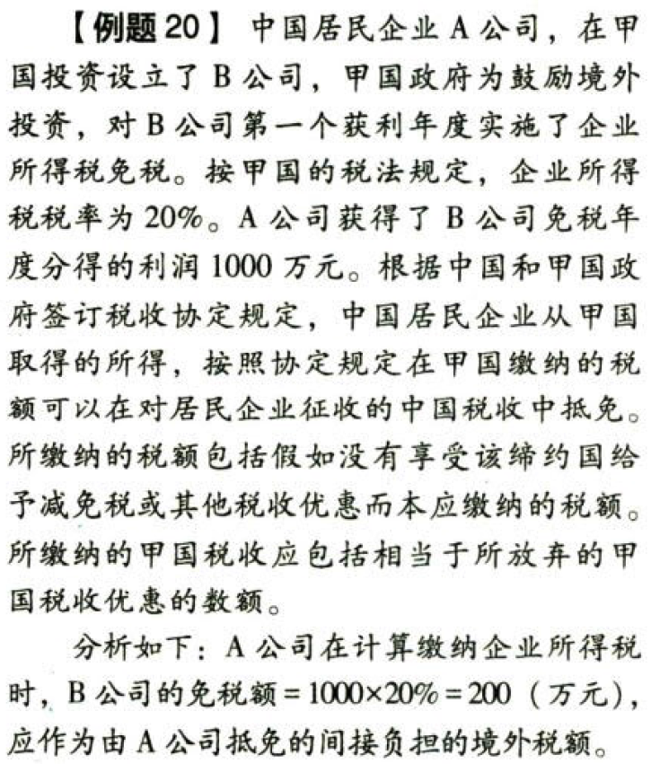

国际税收税务管理实务.税收饶让抵免的应纳税额的确定

## 0.1. 税收饶让抵免的应纳税额的确定:star: :star: 

居民企业从与我国政府订立税收协定（或安排）的国家（地区）取得的所得，按照该国（地区）税收法律享受了免税或减税待遇，且该免税或减税的数额按照税收协定规定应视同已缴税额在中国的应纳税额中抵免的，该免税或减税数额可作为企业实际缴纳的境外所得税额用于办理税收抵免。【视同实际缴纳税额】

税收饶让抵免应区别下列情况进行计算：

### 0.1.1. 税收协定规定定率饶让抵免

```
饶让抵免税额＝按该定率计算的应纳境外所得税额－实际缴纳的境外所得税额的数额
```
### 0.1.2. 税收协定规定列举一国税收优惠额给予饶让抵免

```
饶让抵免税额＝按协定国家（地区）税收法律规定税率计算的应纳所得税额－实际缴纳税额
```
即实际税收优惠额

### 0.1.3. 境外所得采用我国税法规定的简易办法计算抵免额

不适用饶让抵免


