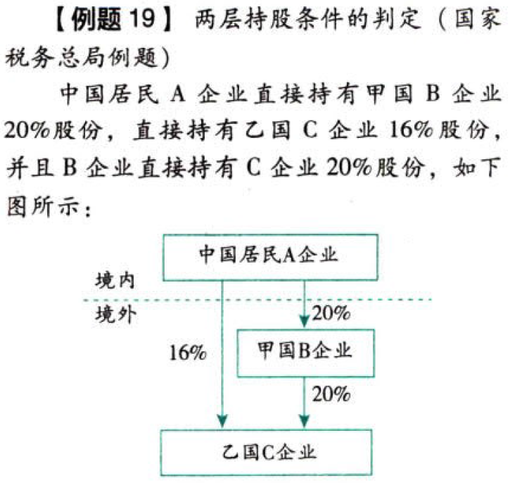
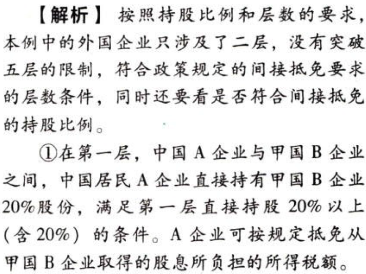
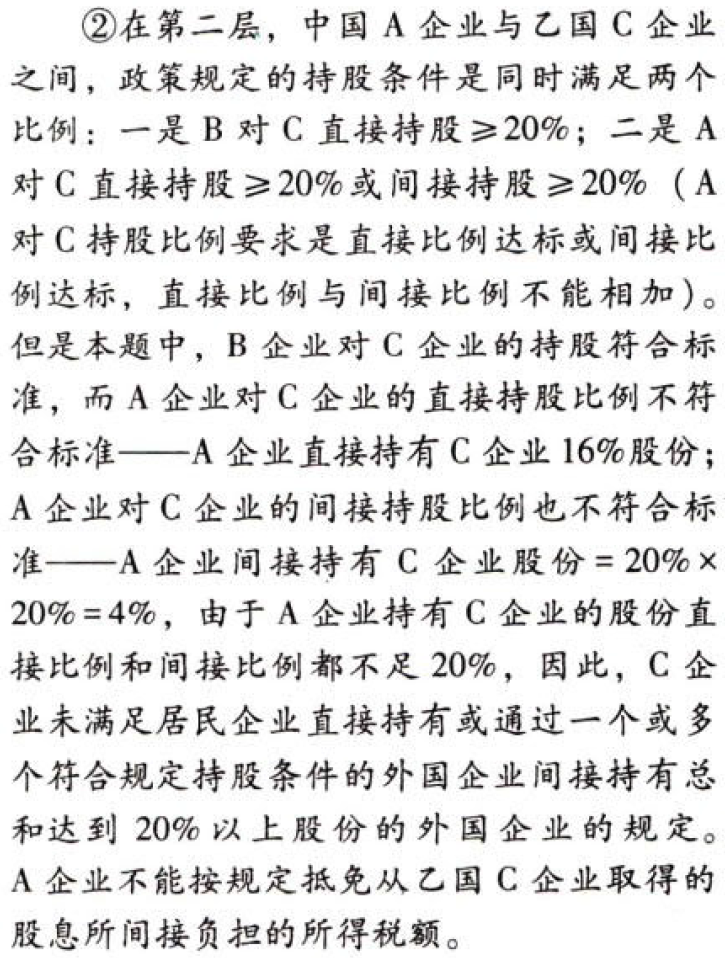

国际税收税务管理实务.适用间接抵免时对外国企业持股比例的计算——比例和层数要求（易考）

### 0.0.1. 适用间接抵免时对外国企业持股比例的计算——比例和层数要求:star: :star: :star: （易考）

自2017年1月1日起，企业A在境外取得的股息所得，在按规定计算该企业境外股息所得的可抵免所得税额和抵免限额时，由该企业直接或者间接持有20%以上股份的外国企业，限于按照规定持股方式确定的`五层外国企业`。

第一层：企业A`直接持有20%以上股份`的外国企业；

第二层至第五层：同时满足：

（1）单一上一层外国企业(直接母公司)直接持有20%以上股份；

（2）［由企业A直接持有20%以上股份or由企业A通过(一个或多个符合规定持股方式的外国企业)间接持有总和达到20%以上股份］的外国企业。

各层企业直接持股、间接持股、为计算居民企业间接持股总和比例的每一个单一持股，均应达到20%的持股比例。

【注意】(直接+间接)达到20%比例的，不算数。

适用间接抵免的持股条件和层数，直接影响企业境外所得已纳所得税额是否能够抵扣，是影响税额计算的重要政策。考生务必掌握。

