土地增值税

# 1. 纳税义务人和征税范围

## 1.1. 纳税义务人

土地增值税的纳税义务人是转让`国有土地使用权`、`地上建筑物及其附着物`并`取得收入`的单位和个人。包括内外资企业、行政事业单位、中外籍个人等。

## 1.2. 征税范围:star: :star: :star: 

土地增值税的基本征税范围：

（1）转让`国有土地使用权`；

（2）地上建筑物及其附着物连同国有土地使用权`一并`转让；

（3）`存量房地产`买卖。

土地用的锐的征税范围具有“国有”“转让”两个关键特征，其征税范围`不包括`土地使用权`出让`。

转让国有土地使用权，征收土地增值税；转让集体所有制土地，应先在有关部门办理（或补办）土地征用或出让手续，使之变为国家所有才可转让，并纳入土地增值税的征税范围。集体土地的自行转让是一种违法行为。

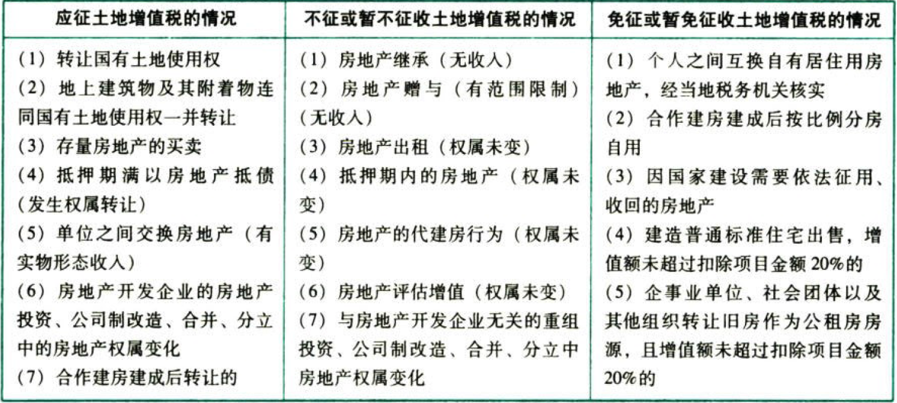

# 2. 税率:star: :star: 

土地增值税采用`四级超率累进税率`。超率累进税率累进依据为相对数，而超额累进税率的累进依据为绝对数；本税种的累进依据＝增值额/扣除项目金额＝利/本。

| 级数 | 增值额/扣除项目金额 | 税率 | 速算扣除系数 |
|------|---------------------|------|--------------|
| 1    | 0%～50%             | 30%  | 0%           |
| 2    | 50%～100%           | 40%  | 5%           |
| 3    | 100%～200%          | 50%  | 15%          |
| 4    | 200%↑               | 60%  | 35%          |

（记忆土地增值税的税率表，考试时经常不提供该税率表）

# 3. 应税收入与扣除项目:star: :star: :star: 

## 3.3. 应税收入

纳税人转让房地产取得的应税收入，包括转让房地产取得的全部价款及有关的经济收益。包括货币收入、实物收入和其他收入。非货币收入要折合成货币金额计入收入总额。

适用增值税一般计税方法的纳税人，其转让房地产的土地增值税应税收入不含增值税销项税额；适用简易计税方法的纳税人，其转让房地产的土地增值税应税收入不含增值税应纳税额。

房地产开发企业在营改增后进行房地产开发项目土地增值税`清算`时，按以下方法确定应税收入：

```
土地增值税应税收入＝营改增前转让房地产取得的收入＋营改增后转让房地产取得的不含增值税收入
```
## 3.4. 扣除项目的确定

准予从转让收入额中减除的扣除项目及适用情况如下：

### 3.4.1. 地钱

```
地钱＝取得土地使用权所支付的金额
```
包括`地价款`和取得土地使用权时按国家统一规定缴纳的`有关费用`。

### 3.4.2. 房钱

```
房钱＝房地产开发成本
```
包括土地征用及拆迁补偿费（土地征用费、耕地占用税等）、前期工程费、建筑安装工程费、基础设施费、公共配套设施费、开发间接费用等。

### 3.4.3. 费用

```
费用＝房地产开发费用
```
与房地产开发项目有关的`销售费用`、`管理费用`和`财务费用`。

（1）纳税人能够按`转让房地产项目`计算分摊利息支出并能提供金融机构贷款证明的：

```
允许扣除的房地产开发费用＝利息（不包括加息、罚息）＋(地钱＋房钱)×5%以内
```
（利息最高不能超过按商业银行同类同期`贷款利率`计算的金额）

（2）纳税人不能按`转让房地产项目`计算分摊利息支出或不能提供金融机构贷款证明的（包含全部使用自有资金没有利息支出的情况）：

```
允许扣除的房地产开发费用＝(地钱＋房钱)×10%以内
```
【言外之意】(销售费用+管理费用)＝(地钱＋房钱)×5%≥财务费用(利息)

房地产开发企业既向金融机构借款，又有其他借款的，其房地产开发费用计算扣除时不能同时适用上述（1）、（2）项所述两种办法。

### 3.4.4. 税金

```
税金＝与转让房地产有关的税金
```
包括转让房地产时缴纳的营业税（“营改增”前发生）、城建税、印花税（非房地产开发企业）。教育费附加和地方教育附加视同税金扣除。

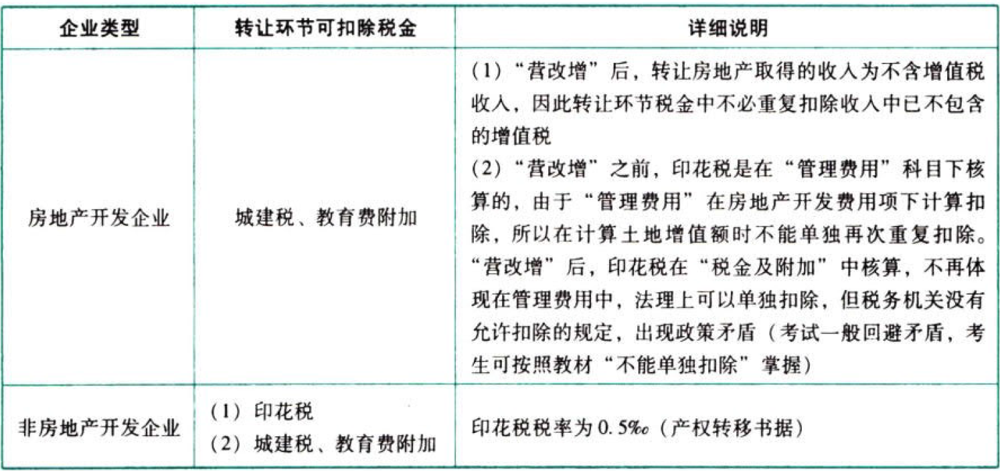

### 3.4.5. 其他

财政部规定的其他扣除项目（适用房地产开发企业的新建房转让）

```
房地产开发企业转让新建房加计扣除＝(地钱＋房钱)×20%
```
此项加计扣除仅对房地产开发企业转让新建房有效，非房地产开发企业没有此项政策；

取得土地使用权后未经开发就转让的，不得加计扣除。

### 3.4.6. 估价

```
估价＝旧房及建筑物的评估价格
＝重置成本价×成新度折扣率
```
“旧房及建筑物的评估价格”是指转让已使用过的房屋及建筑物时，由政府批准设立的`房地产评估机构`评定的重置成本价乘以成新度折扣率后的价格。评估价格须经当地税务机关确认。

如某企业转让一幢使用过多年的办公楼，经当地税务机关认定的重置成本价为12000万元，成新度折扣率为70%，则该办公楼评估价格＝12000×70%=8400（万元）。

### 3.4.7. 票价

纳税人转让旧房及建筑物，凡不能取得评估价格，但能提供`购房发票`的，经当地税务部门确认，可接`发票所载金额`并从购买年度起至转让年度止`每年加计5%`计算`扣除`。计算扣除项目时“每年”按购房发票所载日期起至售房发票开具之日止，每满12个月计一年；超过一年，未满12个月但超过6个月的，可以视同为一年。

```
票价＝发票所载金额×［1＋5%×(持有时间＋6个月)/12个月)］
```
纳税人购房时缴纳的契税凡能提供`契税完税凭证`的，准予作为“与转让房地产有关的税金”予以`扣除`，但不作为加计5%的基数。

### 3.4.8. 核定征收

对于转让旧房及建筑物，既没有评估价格，又不能提供购房发票的，税务机关可以根据《税收征管法》第三十五条的规定，实行`核定征收`。

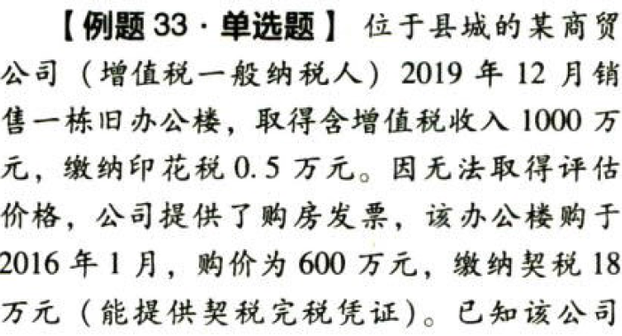

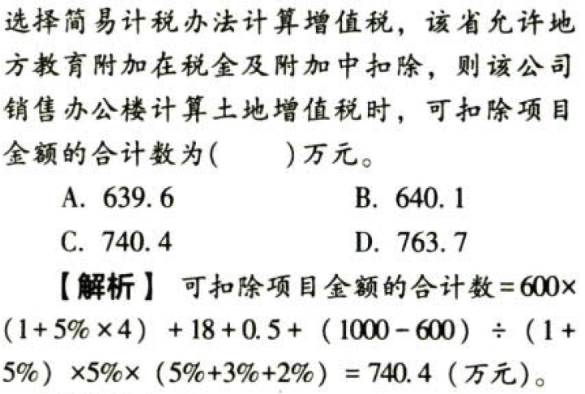

### 3.4.9. 无据不扣

对取得土地使用权时未支付地价款或不能提供已支付的地价款凭据的，`不允许扣除`取得土地使用权时所支付的金额。

纳税人转让旧房及建筑物时，因计算纳税需要对房地产进行评估所支付的`评估费`可以作为计算土地培值税的`扣除`金额，但是因纳税人隐瞒、虚报房地产成交价格等按照评估价格计税时发生的评估费，不允许在计算土地增值税时扣除。（教材未收录）

## 3.5. 适用情形

新建房转让：取得土地使用权所支付的金额＋房地产开发成本＋房地产开发费用＋与转让房地产有关的税金＋财政部规定的其他扣除项目(房地产开发企业专用)

存量房转让：取得土地使用权所支付的金额＋旧房及建筑物的评估价格＋与转让房地产有关的税金

### 3.5.10. 房地产开发企业转让新建房可扣除项目

```
可扣除项目＝地钱＋房钱＋费用＋税金＋其他
```
契税被包含在地钱中，不再单独扣除。

### 3.5.11. 非房地产开发企业转让新建房可扣除项目

```
可扣除项目＝地钱＋房钱＋费用＋税金
```
契税被包含在地钱中，不再单独扣除。

### 3.5.12. 各类企业转让存量房

```
可扣除项目＝地钱＋估价＋税金
```
契税被包含在估价中，不再单独扣除。

```
可扣除项目＝地钱＋票价＋税金＋`契税`
```
契税是税金的一部分，予以扣除。但契税不作为票价中加计5%的基数。

### 3.5.13. 各类企业单纯转让未经开发的土地

```
可扣除项目＝地钱＋税金
```
契税被包含在地钱中，不再单独扣除。

# 4. 土地增值税应纳税额的计算

## 4.6. 增值额的确定

### 4.6.14. 方法一：收入－支出

```
增值额＝土地增值税应税收入－可扣除项目
```
### 4.6.15. 方法二：使用评估价格

纳税人有下列情形之一的，按照房地产评估价格计算征收：

（1）隐瞒、虚报房地产成交价格的；

（2）提供扣除项目金额不实的；

（3）转让房地产的成交价格低于房地产评估价格，又无正当理由的。

房地产评估价格是由政府批准设立的房地产评估机构根据相同地段、同类房地产进行综合评定的价格。不是由税务机关进行评估的。

评估价格可评估`收入`或`成本`。

## 4.7. 应纳税额的计算方法:star: :star: :star: 

### 4.7.16. 计算土地增值税的步骤和公式

```
增值额＝转让房地产收入（不含增值税）－扣除项目金额
(税率, 速算扣除系数)＝f四级税率表（增值额/扣除项目金额）
应纳税额＝增值额×税率－扣除项目金额×速算扣除系数
```
### 4.7.17. 土地增值税计算的命题规律

关于土地增值税计算的命题，已经经历了从传统”步骤型”到“配比型”的变化。在2004年之前，土地增值税的计算大多只是考核房地产开发企业计算土地增值税的步骤和扣除项目金额的确定。2004年把土地增值税的计算与企业所得税综合在一起，开始考核土地增值税的简单计算及其与营业税（目前已经改征增值税）、印花税、企业所得税的关系。2007年和2008年，土地增值税的计算考核已完工程与未完工程、已完己售工程与已完未售工程的配比分摊计税的规则。土地增值税计算的复杂性有所增加。

土地增值税在计算企业所得税时可以在税前扫除。


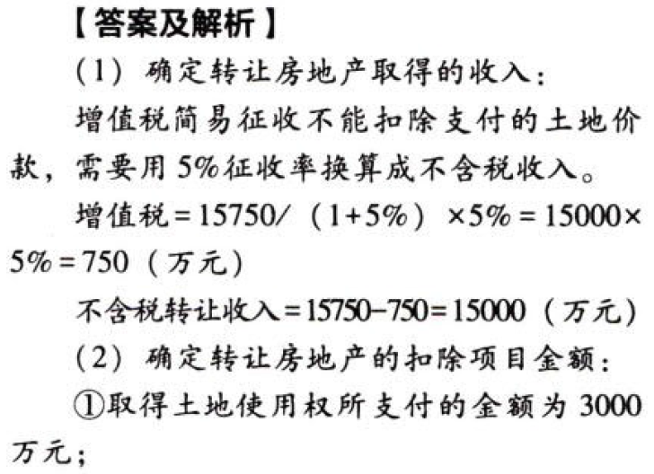

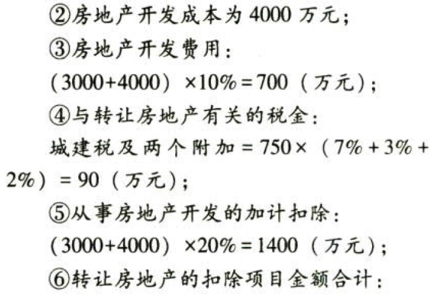

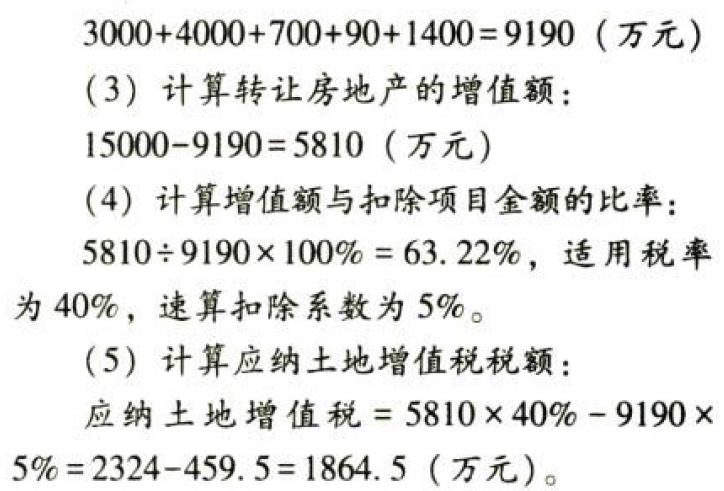

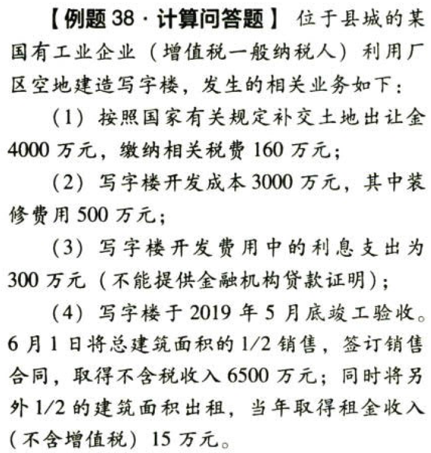

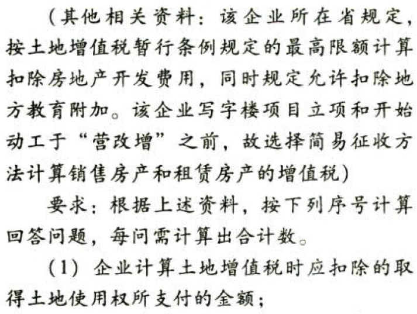

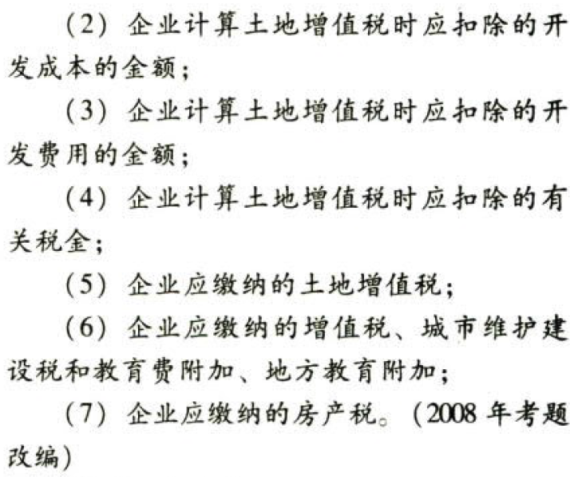

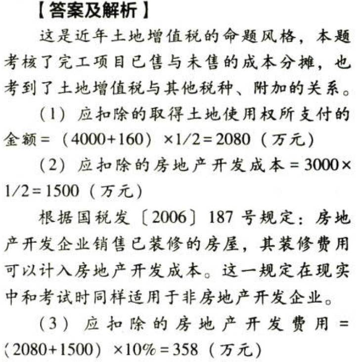

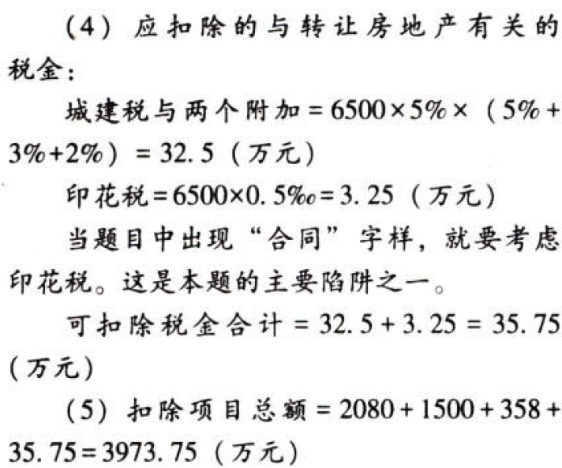

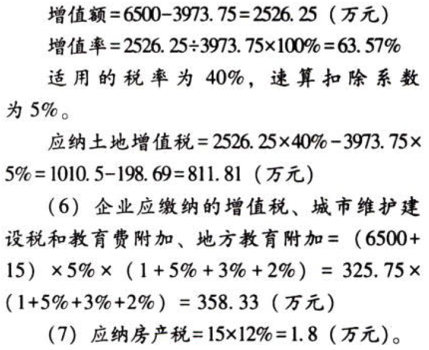

# 5. 房地产开发企业土地增值税清算:star: :star: :star: 

## 5.8. 清算单位

（1）土地用值税以国家有关部门审批的`房地产开发项目`为单位进行清算，对于分期开发的项目，以`分期项目`为单位消算

（2）开发项目中同时包含`普通住宅`和`非普通住宅`的，应`分别计算`增值额

## 5.9. 清算条件

### 5.9.18. 纳税人应进行土地增值税清算的三种情况

（1）房地产开发项目`全部`竣工、完成销售的

（2）`整体转让`未竣工决算房地产开发项目的

（3）直接转让`土地使用权`的

### 5.9.19. 主管税务机关可要求纳税人进行土地增值税消算的四种情况

（1）巳`竣工验收`的房地产开发项目，`已转让`的房地产建筑面积占整个项目可售建筑面积的比例在`85%`以上，或该比例虽未超过85%，但剩余的可售建筑面积已经出租或自用的

（2）取得销售（预售）许可证满`3年`，仍未销售完毕的

（3）纳税人申请`注销`税务登记但未办理土地增值税清算手续的

（4）省税务机关规定的其他情况

### 5.9.20. 非直接销售和自用房地产的收入确定

房地产开发企业将开发产品用于职工福利、奖励、对外投资、分红、偿债、换取非货币性资产等，发生所有权转移时`视同销售`房地产。

房地产开发企业用建造的房地产安置回迁户的，安置用房`视同销售`处理。

收入按下列方法和顺序确认：

（1）按本企业在`同一地区`、`同一年度`销售的`同类房地产`的`平均价格`确定

（2）由主管税务机关参照当地当年、同类房地产的`市场价格`或`评估价值`确定

房地产开发企业将开发的部分房地产转为企业自用或用于出租等商业用途时，产权未发生转移的：`不征收`土地地值税，在税款清算时`不列收入`，`不扣除`相应的成本和费用。

### 5.9.21. 扣除项目规定

#### 5.9.21.1. 可据实扣除的项目

（1）房地产开发企业开发建造的与清算项目`配套`的居委会和派出所用房、会所、停车场（库）、物业管理场所、变电站、热力站、水厂、文体场馆、学校、幼儿园、托儿所、医院、邮电通信等`公共设施`：①建成后产权属于`全体业主`所有的，其成本、费用可以扣除；②建成后`无偿`移交给政府、公用事业单位用于`非营利性`社会公共事业的，其成本、费用可以扣除；③建成后有偿转让的，应计算收入，并准予扣除成本、费用

（2）房地产开发企业销售已装修的房屋，其`装修费用`可以计入房地产开发`成本`

（3）房地产开发企业在工程竣工验收后，根据合同约定，扣留建筑安装施工企业一定比例的工程款，作为开发项目的`质量保证金`，在计算土地增值税时，建筑安装施工企业就质量保证金对房地产开发企业开具发票的，按`发票`所载金额予以`扣除`

（4）房地产开发企业为取得土地使用权所支付的`契税`，应视同“按国家统一规定缴纳的有关费用”，计入“取得`土地使用权`所支付的金额”中`扣除`

（5）房地产开发企业支付给回迁户的`补差价款`，计入拆迁补偿费；回迁户支付给房地产开发企业的补差价款，应抵减本项目拆迁补偿费

（6）`货币安置拆迁`的，房地产开发企业凭合法有效`凭据`计入拆迁补偿费

#### 5.9.21.2. 可核定扣除的项目

前期工程费、建筑安装工程费、基础设施费、开发间接费用的`凭证或资料`不符合清算要求或不实的

#### 5.9.21.3. 不可扣除的项目

（1）除另有规定外，扣除取得土地使用权所支付的金额、房地产开发成本、费用及与转让房地产有关税金，须提供`合法有效凭证`；不能提供合法有效凭证的，不予扣除

（2）房地产开发企业的`预提费用`，除另有规定外，不得扣除

（3）房地产开发企业在工程竣工验收后，根据合同约定，扣留建筑安装施工企业一定比例的工程款，作为开发项目的质量保证金，建筑安装施工企业就质量保证金`未`对房地产开发企业开具`发票`的，扣留的质保金，`不得`扣除

（4）房地产开发企业逾期开发缴纳的`土地闲置费`不得扣除

## 5.10. 土地增值税的核定征收

### 5.10.22. 五种情形

税务机关可以参照与房地产开发企业开发规模和收入水平相近的当地企业的土地增值税税负情况，接不低于`预征率`的征收率`核定`征收土地增值税的五种情形：

（1）依照法律、行政法规的规定应当设置但`未设置账簿`的

（2）擅自`销毁`账簿或者`拒不提供`纳税资料的

（3）虽设置账簿，但账目`混乱`或者成本资料、收入凭证、费用凭证`残缺不全`，难以确定转让收入或扣除项目金额的

（4）符合土地增值税清算条件，未按照规定的期限办理清算手续，经税务机关责令限期清算，`逾期`仍不清算的

（5）申报的计税依据明显`偏低`，又无正当理由的

税务机关核定的计税价格或收入不含增值税

### 5.10.23. 核定征收率的规定

为了规范核定工作，核定征收率原则上不得低于`5%`，各`省`级税务机关要结合本地实际，区分不同房地产类型`制定`核定征收率

## 5.11. 清算后再转让房地产

在土地增值税清算时未转让的房地产，清算后销售或有偿转让的，纳税人应按规定进行土地增值税的纳税申报，扣除项目金额按清算时的单位建筑面积成本费用乘以销售或转让面积计算

```
单位建筑面积成本费用＝清算时的扣除项目总金额÷消算的总建筑面积
```
## 5.12. 清算后应补税与滞纳金

纳税人按规定预缴土地增值税后，清算补缴的土地增值税，在主管税务机关规定的期限内补缴的，不加收滞纳金

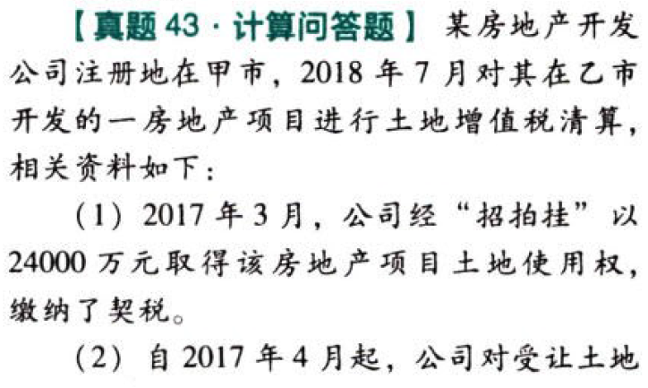

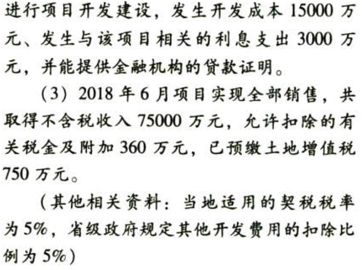

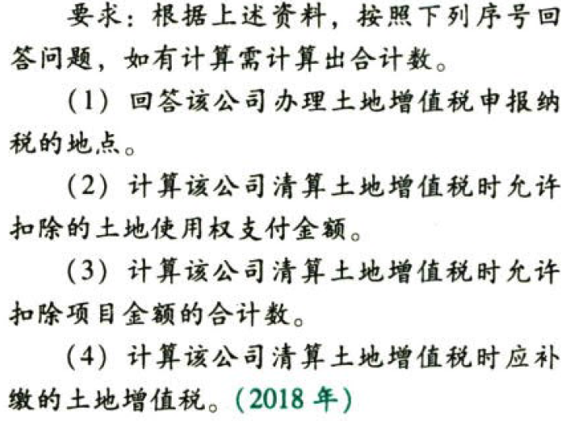

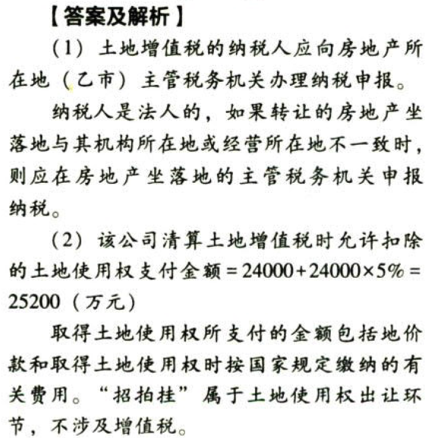

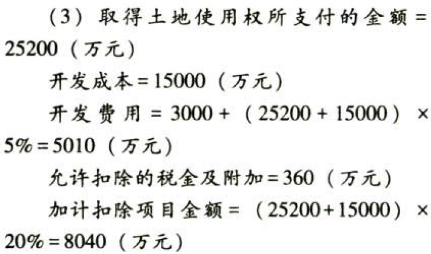

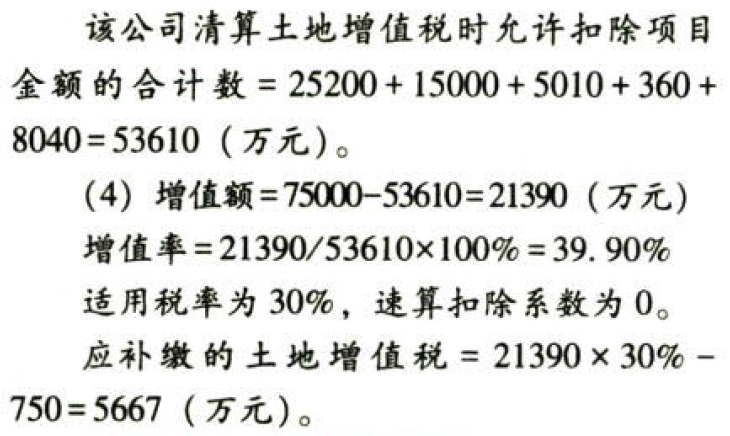

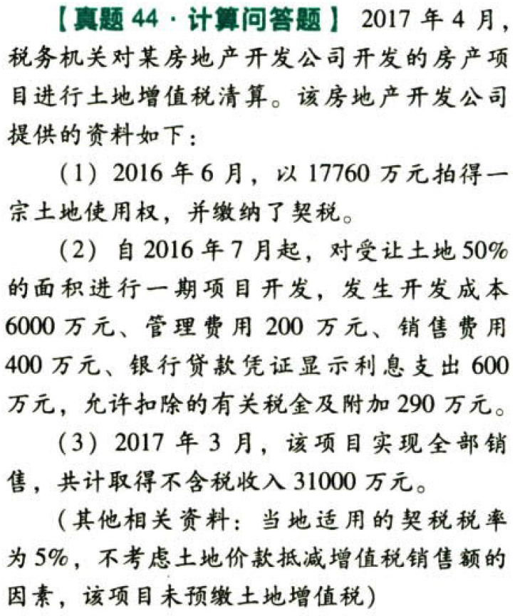

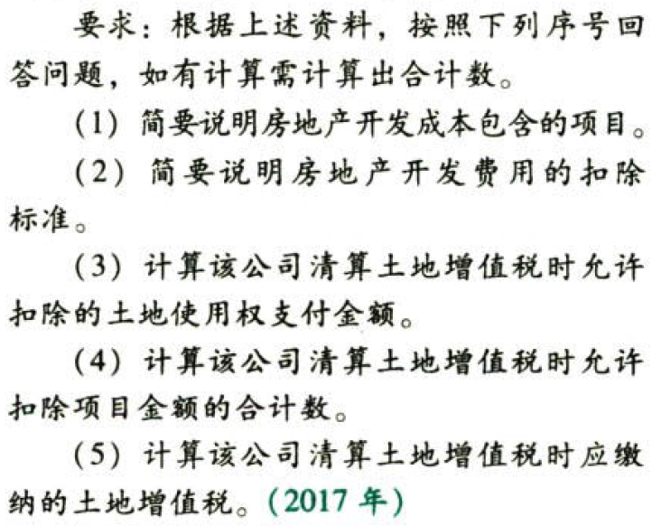

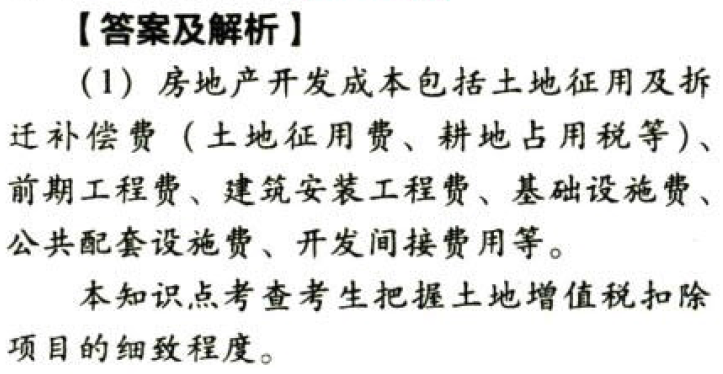

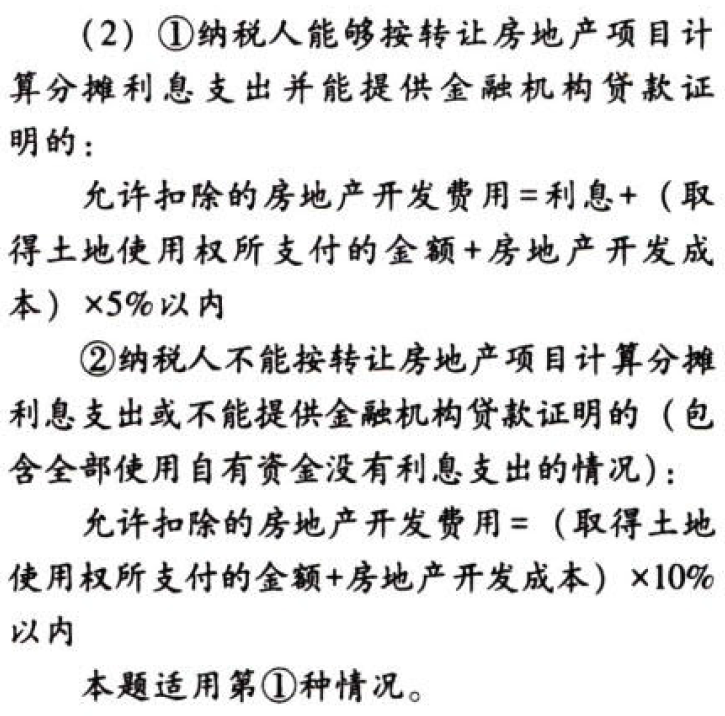

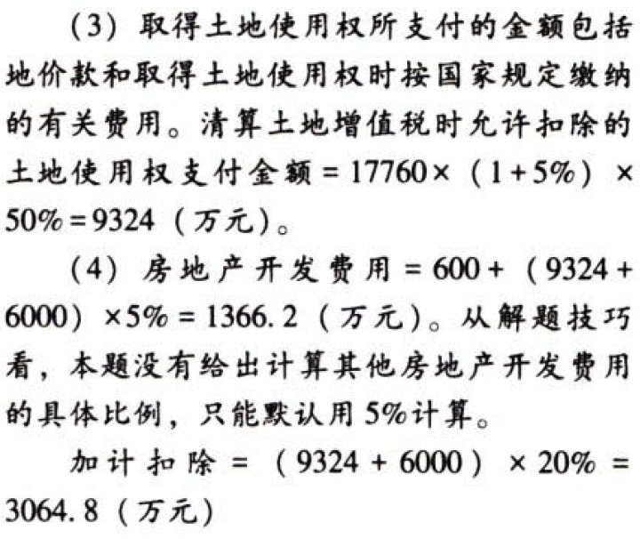

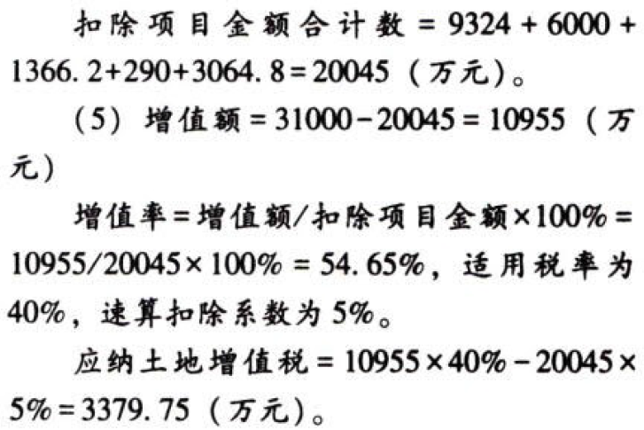

# 6. 土地增值税的税收优惠

（1）建造`普通标准住宅`出售，增值额未超过扣除项目金额`20%`的，`免征`土地增值税。

2005年6月1日起，普通标准住宅应同时满足：住宅小区建筑`容积率在1.0以上`；单套建筑面积在`120平方米`以下；实际`成交价格`低于同级别土地上`住房平均交易价格1.2倍`以下。各`省`、自治区、直辖市要根据实际情况，制定本地区享受优惠政策普通住房的`具体标准`。允许单套建筑面积和价格标准适当浮动，但向上浮动的比例不得超过`上述标准的20%`。

纳税人建造普通标准住宅出售，增值额超过扣除项目金额20%的，应就其`全部增值额`按规定计税。

（2）因国家建设需要依法征用、收回的房地产，免征土地增值税。

（3）因城市实施规划、国家建设的需要而搬迁，由纳税人自行转让原房地产的，免征土地增值税。

（4）对企事业单位、社会团体以及其他组织转让旧房作为`公租房房源`，且增值额未超过扣除项目金额`20%`的，免征土地增值税。

# 7. 征收管理

## 7.13. 预征率的确定

预征率的确定要科学合理，除保障性住房外，东部地区省份预征率不得低于`2%`，中部地区和东北地区省份不得低于`1.5%`，西部地区省份不得低于`1%`。

## 7.14. 纳税申报及纳税地点

纳税人应在转让房地产`合同`签订后`7日`内，向房地产所在地主管税务机关办理纳税申报，并向税务机关提交相关合同等资料。纳税人转让的房地产坐落在两个或两个以上地区的，应向房地产所在地分别申报纳税。

纳税人因经常发生房地产转让而难以在每次转让后申报，是指房地产开发企业开发建造的房地产、因分次转让而频繁发生纳税义务、难以在每次转让后申报纳税的情况，土地增值税可`按月`或按各`省`、自治区、直辖市和计划单列市税务局`规定`的期限申报缴纳。纳税人选择定期申报方式的，应向纳税所在地的税务机关`备案`。定期申报方式确定后，`一年`之内不得变更。

# 8. 总结

End。
