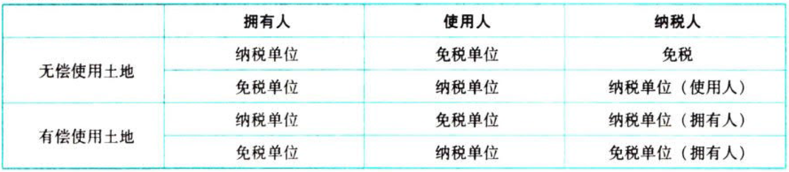
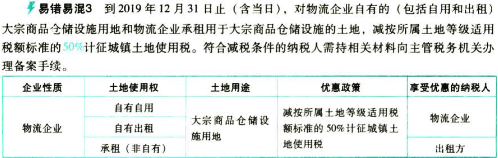

城镇土地使用税

# 1. 纳税义务人与征税范围

## 1.1. 纳税义务人:star: 

城镇土地使用税是以开征区域内的国家所有和集体所有的土地为征税对象，对拥有`土地使用权`的单位和个人征收的一种税。

### 1.1.1. 一般规定

在城市、县城、建制镇、工矿区范围内`使用土地`的单位和个人为纳税义务人。

所称单位，包括国有企业、集体企业、私营企业、股份制企业、外商投资企业、外国企业及其他企业和事业单位、社会团体、国家机关、军队及其他单位。

所称个人，包括个体工商户及其他个人。

### 1.1.2. 具体规定

拥有土地使用权的单位和个人为纳税义务人

拥有土地使用权的单位和个人不在土地所在地的，其土地的实际使用人或代管人为纳税义务人

土地使用权未确定或权属纠纷未解决的，其实际使用人为纳税义务人

土地使用权共有的，共有各方都是纳税义务人，由共有各方分别纳税

在城镇土地使用税征税范围内，承租集体所有建设用地的，由直接从集体经济组织承租土地的单位和个人，缴纳城镇土地使用税

## 1.2. 征税范围:star: 

和房产税一样，城镇土地使用税有开征区域的规定。城镇土地使用税的征税范围，包括在城市、县城、建制镇和工矿区内的国家所有和集体所有的土地。建立在城市、县城、建制镇和工矿区以外的工矿企业则不需要缴纳城镇土地使用税。对城市、县城、建制镇和工矿区的具体征税范围的确定，由省、自治区、直辅市人民政府具体划定。考生对这部分内容可与房产税相关内容对比记忆。

城镇土地使用税纳税人的具体分类，有些规定和房产税相关规定一致或相似，考生也应对比记忆，以应对考试可能出现的客观题。

## 1.3. 税率:star: :star: 

城镇土地使用税采用定额税率。每平方米土地的城镇土地使用税年税额标准规定如下：

大城市1.5元至30元；中等城市1.2元至24元；小城市0.9元至18元；县城、建制镇、工矿区0.6元至12元。

每个幅度税额的差距规定为20倍。

经济落后地区城镇土地使用税的适用税额标准可适当降低，但降低额不得超过上述规定最低税额标准的30%。经济发达地区的适用税额标准可以适当提高，但须报财政部批准。

## 1.4. 计税依据:star: :star: 

城镇土地使用税以纳税义务人实际占用的土地面积为计税依据。

（1）凡由省、自治区、直辖市人民政府确定的单位组织测定土地面积的，以测定的面积为准

（2）尚未组织测量，但纳税人持有政府部门核发的土地使用证书的，以证书确认的土地面积为准

（3）尚未核发土地使用证书的，应由纳税人申报土地面积，据以纳税，等到核发土地使用证以后再作调整

（4）对在城镇土地使用税征税范围内单独建造的地下建筑用地，按规定征收城镇土地使用税。其中，已取得地下土地使用权证的，按土地使用权证确认的土地面积计算应征税款；未取得地下土地使用权证或地下土地使用权证上未标明土地面积的，按地下建筑垂直投影面积计算应征税款。对上述地下建筑用地暂按应征税款的50%征收城镇土地使用税

## 1.5. 应纳税额:star: :star: 

```
全年应纳税额＝实际占用土地面积（平方米）×使用税额
```
## 1.6. 纳税期限:star: :star: 

城镇土地使用税规定的纳税期限是按年计算、分期缴纳的征收办法，具体纳税期限内由省、自治区、直辖市人民政府确定。

在计算应缴纳的税额时，要注意计算缴纳的是年税额还是季度税额或者月税额

# 2. 税收优惠:star: :star: :star: 

## 2.7. 法定税收优惠

（1）国家机关、人民团体、军队`自用`的土地

（2）由同家财政部门拨付事业经费的单位`自用`的土地

（3）宗教寺庙、公园、名胜古迹`自用`的土地

（4）市政街道、广场、绿化地带等`公共`用地

（5）直接用于`农、林、牧、渔业`的生产用地

（6）经批准开山填海`整治`的土地和改造的废弃土地，从使用的月份起免缴城镇土地使用税`5年～10年`

（7）`非营利性`医疗机构、疾病控制机构和妇幼保健机构等`卫生机构自用`的土地

（8）企业办的`学校`、`医院`、`托儿所`、`幼儿园`，其用地能与企业其他用地明确`区分`的





自2018年10月1日至2020年12月31日，对按照去产能和调结构政策要求停产停业、关闭的企业，自停产停业次月起，免征城镇土地使用税。企业享受免税政策的期限累计不得超过两年。

自2019年1月1日至2021年12月31日，对国家级、省级科技企业孵化器、大学科技园和国家备案众创空间自用以及无偿或通过出租等方式提供给在孵对象使用的土地，免征城镇土地使用税。

自2019年1月1日至2021年12月31日，对城市公交站场、道路客运站场、城市轨道交通系统运营用地，免征城镇土地使用税。（新增）

为支持居民供热采暖，自2019年1月1日至2020年12月31日，“三北”地区向居民供热收取采暖费的供热企业，为居民供热所使用的土地免征城镇土地使用税；对供热企业其他土地，应当按照规定征收城镇土地使用税。（新增）

## 2.8. 省、自治区、直辖市税务局确定减免城镇土地使用税的优惠

（1）个人所有的居住房屋及院落用地。

（2）房产管理部门在房租调整改革前经租的居民住房用地。

（3）免税单位职工家属的宿舍用地。

（4）集体和个人办的各类学校、医院、托儿所、幼儿园用地。

# 3. 征收管理

## 3.9. 纳税地点和征收机构:star: 

城镇土地使用税的纳税地点为土地所在地，由土地所在地的税务机关负责征收。

城镇土地使用税的属地性强。有两种情况需要注意：一是对纳税人使用的土地不属于同一省、自治区、直辖市管辖范围内的，由纳税人分别向土地所在地的税务机关申报缴纳城镇土地使用税；二是对在同一省、自治区、直辖市管辖范围内的，纳税人跨地区使用的土地，由各省、自治区、直辖市税务局确定纳税地点。

## 3.10. 纳税义务发生时间:star: :star: :star: 

纳税人占用土地，一般是从次月起发生城镇土地使用税的纳税义务，只有新征用耕地是在批准征用之日起满一年时开始缴纳城镇土地使用税。具体归纳如下：

| 情形                                                           | 纳税义务发生时间                                                                                                                   |
|----------------------------------------------------------------|------------------------------------------------------------------------------------------------------------------------------------|
| 购置新建商品房                                                 | 房屋交付使用之次月起                                                                                                               |
| 购置存量房                                                     | 办理房屋权属转移、变更登记手续，房地产权属登记机关签发房屋权属证书之次月起                                                         |
| 出租、出借房产                                                 | 交付出租、出借房产之次月起                                                                                                         |
| 以出让或转让方式有偿取得土他使用权                             | 应由受让方从合同约定交付土地时间的次月起缴纳城镇土地使用税：合同未约定交付土地时间的，由受让方从合同签订的次月起缴纳城镇土地使用税 |
| 新征用的耕地                                                   | 批准征用之日起满1年时                                                                                                              |
| 新征用的非耕地                                                 | 批准征用次月起                                                                                                                     |
| 纳税人因土地的权利状态发生变化而依法终止城镇土地使用税纳税义务 | 其应纳税款的计算应截止到土地的权利状态发生变化的当月末（与房产税相同）                                                             |

# 4. 总结

End。
