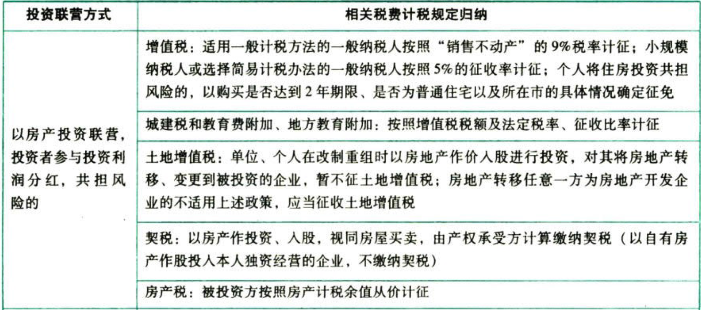
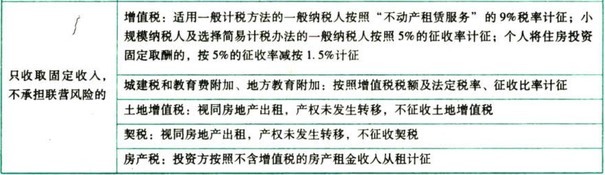

房产税

# 1. 纳税义务人与征税范围:star: :star: 

带来了收益的房子，应该征税。

## 1.1. 纳税人

### 1.1.1. 基本规定

房产税的纳税义务人是指征税范围内的房屋产权所有人。具体包括经营管理单位、集体单位和个人、房产承典人、房产代管人或使用人

### 1.1.2. 具体规定

（1）产权属于国家所有的，由经营管理单位纳税；产权属于集体和个人所有的，由集体单位和个人纳税

（2）产权出典的，由承典人纳税

（3）产权所有人、承典人不在房屋所在地，或产权未确定及租典纠纷来解决的，囱房产代管人或使用人纳税

（4）纳税单位和个人无租使用房管部门、免税单位、纳税单位的房产，由`使用人`代为缴纳房产税

## 1.2. 征税范围

（1）征税对象范围：房产税的征税对象是房产，即有屋面和围护结构（有墙或两边有柱），能够遮风避雨，可供人们在其中生产、学习、工作、娱乐、居住或储藏物资的场所

房产不等于建筑物。判断某一建筑物是否征收房产税要用`房产的特征`来衡量。如加油站罩棚、露天游泳池都不属于房产，不征收房产税

（2）开征区域范围：城市、县城、建制镇、工矿区

城市、县城、建制镇和工矿区以外的`农村房产`未纳入房产税的征税范围

# 2. 税率、计税依据和应纳税额的计算

## 2.3. 计税依据和应纳税额计算的一般规定:star: :star: :star: 

### 2.3.3. 从价计征

计税依据为按照`应税房产原值`一次减除10%～30%的扣除（损耗价值）后的余值。

10%～30%的具体扣除比例由省、自治区、直辖市人民政府确定。

应税房产原值以会计账簿记录为基础，但无论会计上如何核算，房产原值均应包含地价，包括为取得土地使用权支付的价款、开发土地发生的成本费用等。宗地容积率低于0.5的，按房产建筑面积的2倍计算土地面积并据此确定计入房产原值的地价。其次，一些不可移动的房屋附属设施（如中央空调、智能化楼宇设施等），无论会计上是否单独核算，均应并入计征房产税的房产原值中。

独立的地下建筑物为工业用途的，以`房屋原价×50%～60%`作为应税房产原值。

独立的地下建筑物为商业及其他用途的，以`房屋原价×70%～80%`作为应税房产原值。

```
年应纳税额＝计税余值×年税率
＝应税房产原值×［1－原值减除比例］×年税率
＝房屋原价×［100%(非地下)||50%～60%(地下工业)||70%～80%(地下商业)］×［1－10%～30%］×1.2%
```
### 2.3.4. 从租计征

计税依据为`租金收入`（包括实物收入和货币收入，不包括增值税）。

以劳务或其他形式为报酬抵付房租收入的，按当地`同类`房产租金水平确定。

出租的地下建筑，按出租地上房屋建筑的有关规定计税。

```
应纳税额＝租金收入×12%
应纳税额＝租金收入×4%(个人出租住房)
```
## 2.4. 计税依据和应纳税额计算的特殊规定

### 2.4.5. 对投资联营的房产应纳房产税的规定

对以房产投资联营，投资者参与投资利润分红，共担风险的，由`被投资方`按`房产余值`作为计税依据计征房产税；对只收取固定收入，不承担联营风险的，由`出租方`按`租金`收入计征房产税。





### 2.4.6. 对融资租赁房屋应纳房产税的规定

融资租赁房屋是一种`变相的分期付款购买固定资产`的形式，根据财税〔2009）128号文件的规定，融资租赁的房产，由承租人自融资租赁`合同约定开始日的次月`起依照房产余值缴纳房产税。合同未约定开始日的，由承租人自`合同签订的次月`起依照房产余值缴纳房产税。

### 2.4.7. 关于房屋附属设备和配套设施的计税规定

为了维持和增加房屋的使用功能或使房屋满足设计要求，凡以房屋为载体，不可随意移动的附属设备和配套设施，如给排水、采暖、消防、中央空调、电气及智能化楼宇设备等，无论在会计核算中是否单独记账与核算，都应计人房产原值，计征房产税。

对于更换房屋附属设备和配套设施的，在将其价值计入房产原值时，可扣减原来相应设备和设施的价值；对附属设备和配套设施中易损坏、需要经常更换的零配件，更新后不再计入房产原值，原零配件的原值也不扣除。

### 2.4.8. 业主共有的经营性房产

对居民住宅区内业主共有的经营性房产，由实际经营（包括自营和出租）的`代管人或使用人`缴纳房产税。其中自营的，依照房产原值减除10%-30%后的余值计征，没有房产原值或不能将业主共有房产与其他房产的原值准确划分开的，由房产所在地税务机关参照同类房产`核定`房产原值；出租的，依照租金收入计征。

### 2.4.9. 免收租金期限

对出租房产，租赁双方签订的租赁合同约定有免收租金期限的，免收租金期间由`产权所有人`按照`房产余值`缴纳房产税。

# 3. 税收优惠:star: :star: 

（1）国家机关、人民团体、军队自用的房产免征房产税。但对这些单位的出租房产以及非自身业务使用的生产、营业用房，不属于免税范围。

自用的房产，是指这些单位本身的办公用房和公务用房。对于其所属的附属工厂、商店、招待所等不属于公务、办公的用房，应照章征税。

（2）由国家财政部门拨付事业经费的单位（实行全额或差额预算管理的事业单位）所有的，本身业务范围内使用的房产免征房产税。

（3）宗教寺庙、公团、名胜古迹自用的房产免征房产税。但宗教寺庙、公园、名胜古迹中附设的营业单位，如影剧院、饮食部、茶社、照相馆等所使用的房产及出租的房产，不属于免税范围，应照章纳税。

（4））个人所有`非营业用`的房产免征房产税。对个人拥有的营业用房或者出租的房产，不属于免税房产，应照章纳税。

（5）经财政部批准免税的其他房产：

非营利性医疗机构、疾病控制机构和妇幼保健机构等卫生机构自用房产，免征房产税。

按政府规定价格出租的公有住房和廉租住房，包括企业和自收自支事业单位向职工出租的单位自有住房，房管部门向居民出租的公有住房，落实私房政策中带户发还产权并以政府规定租金标准向居民出租的私有住房等，暂免征收房产税。

经营公租房的租金收入，免征房产税。

自2019年1月1日至2021年12月31日，对农产品批发市场、农贸市场（包括自有和承租，下同）专门用于经营农产品的房产、土地，暂免征收房产税、城镇土地使用税。对同时经营其他产品的农产品批发市场和农贸市场使用的房产、土地，按其他产品与农产品交易场地面积的比例确定征免房产税、城镇土地使用税。

自2019年1月1日至2020年12月31日，对向居民供热收取采暖费的供热企业，为居民供热所使用的厂房及土地免征房产税、城镇土地使用税；对供热企业其他广房及土地，应当按照规定征收房产税、城镇土地使用税。

自2018年10月1日至2020年12月31日，对按照去产能和调结构政策要求停产停业、关闭的企业，自停产停业次月起，免征房产税、城镇土地使用税。企业享受免税政策的期限累计不得超过两年。

自2019年1月1日至2021年12月31日，对国家级、省级科技企业孵化器、大学科技园和国家备案众创空间自用以及无偿或通过出租等方式提供给在孵对象使用的房产、土地，免征房产税和城镇土地使用税。

自2019年1月1日至2021年12月31日，对高校学生公寓免征房产税。

# 4. 征收管理

## 4.5. 纳税义务发生时间:star: :star: :star: 

纳税人将原有房产用于生产经营，从生产经营`之月`起辙纳房产税。

纳税人自行新建房屋用于生产经营，从建成之次月起缴纳房产税。

纳税人委托施工企业建设的房屋，从办理验收手续之次月起缴纳房产税。

纳税人购置新建商品房，自房屋交付使用之次月起缴纳房产税。

纳税人购置存量房，自办理房屋权属转移、变更登记手续，房地产权属登记机关签发房屋权属证书之次月起缴纳房产税。

纳税人出租、出借房产，自交付出租、出借房产之次月起缴纳房产税。

房地产开发企业自用、出租、出借本企业建造的商品房，自房屋使用或交付之次月起缴纳房产税。

纳税人因房产的实物或权利状态发生变化，而依法终止房产税纳税义务的，其应纳税款的计算应截止到房产的实物或权利状态发生变化的当月末。

## 4.6. 纳税期限和纳税地点:star: 

房产税实行`按年计算`、`分期缴纳`的征收办法，具体纳税期限由`省`、自治区、直辖市人民政府确定。房产税在房产所在地缴纳。对房产不在同一地方的纳税人，应按`房产的坐落地点`分别向房产所在地的税务机关纳税。【同城镇土地使用税】

# 5. 总结

End。
