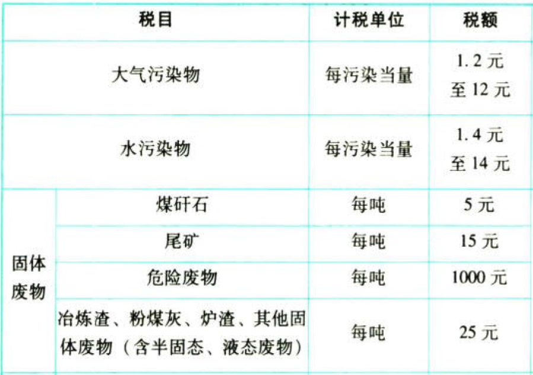
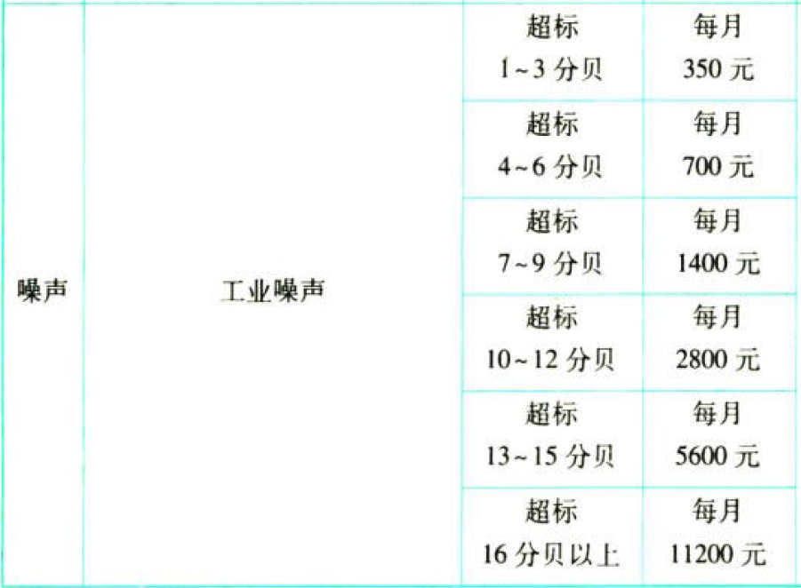
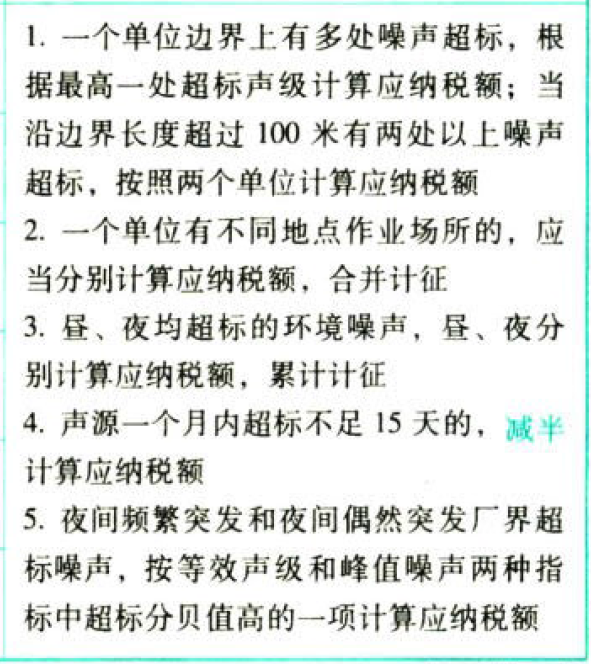
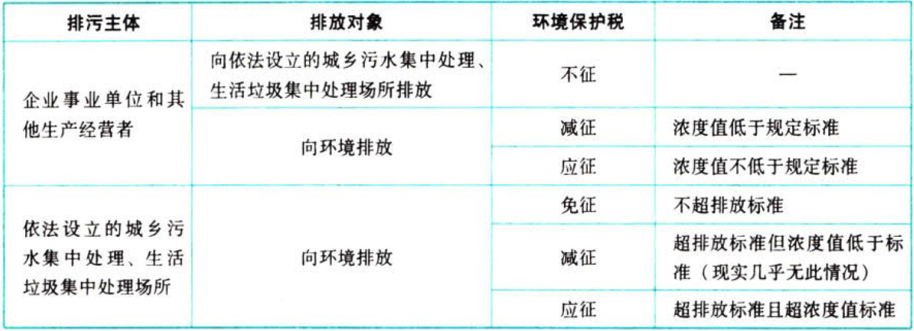

环境保护税法

为了保护和改善环境，减少污染物排放，推进生态文明建设，第12届全同人民代表大会常务委员会第25次议会议于2016年12月25日通过了《中华人民共和国环境保护税法》，这是我国第四部经过立法机关正式立法的税收实体法。环境保护税作为“费改税”开征的税种，自2018年1月1日起施行。

# 1. 纳税义务人:star: 

在中华人民共和国`领域`和中华人民共和国管辖的其他`海域`，`直接`向环境排放`应税污染物`的`企业事业单位`和其他`生产经营者`为环境保护税的纳税人，应当依法缴纳环境保护税。

有下列情形之一的，`不属于`自接向环搅排放污染物，`不缴纳`相应污染物的环境保护税：

（1）企业事业单位和其他生产经营者向依法设立的污水`集中处理`、生活垃圾`集中处理`场所排放应税污染物的。

（2）企业事业单位和其他生产经营者在符合国家和地方环境保护`标准`的设施、场所`贮存`或者`处置`固体废物的。

依法设立的城乡污水集中处理、生活垃圾集中处理场所超过国家和地方规定的排放标准向环境排放应税污染物的，应当缴纳环挽保护税。

所称应税污染物，是指《环境保护税税目税额表》《应税污染物和当量值表》规定的`大气污染物`、`水污染物`、`固体废物`和`噪声`。

# 2. 税目、税额:star: :star: :star: 

环境保护税的税目、税额，依照环境保护税法所附`《环境保护税税目税额表》`执行。







应税大气污染物和水污染物的具体`适用税额`的确定和调整，由`省`、自治区、直辖市人民政府统筹考虑本地区环境承载能力、污染物排放现状和经济社会生态发展目标要求，在《环境保护税税目税额表》规定的税额幅度内`提出`，报同级人民代表大会常务委员会`决定`，并报全国人民代表大会常务委员会和国务院`备案`。

# 3. 计税依据:star: :star: 

## 3.1. 计税依据确定的基本方法

### 3.1.1. 大气污染物、水污染物

计税依据：

```
污染当量＝该污染物的排放量/该污染物的污染当量值
```
污染当量，是指根据污染物或者污染排放活动对环境的有害程度以及处理的技术经济性，衡量不同污染物对环境污染的综合性指标或者计量单位。同一介质相同污染当量的不同污染物，其污染程度基本相当

每一`排放口`或者没有排放口的应税`大气污染物`：按照污染当量数从大到小排序，对`前三项`污染物征收环搅保护税

每一`排放口`的应税`水污染物`：按照《环境保护税法》所附`《应税污染物和当量值表》`，区分`第一类`水污染物和`其他类`水污染物，按照污染当最数从大到小排序，对`第一类`水污杂物按照`前5项`征收环境保护税，对`其他类`水污染物按照`前3项`征收环境保护税

`省`、自治区、直辖市人民政府根据本地区污染物减排的特殊需要，可以`增加`同一排放口征收环境保护税的应税污染物`项目数`，不仅局限于前三项或前五项，但需报同级人民代表大会常务委员会`决定`，并报全国人民代表大会常务委员会和国务院`备案`。

### 3.1.2. 固体废物

计税依据：

```
排放量＝当期固体废物的产生量－当期固体废物的综合利用量－当期固体废物的贮存量－当期退废物的处置量
```
固体废物的贮存量、处置量，是指在符合国家和地方环境保护`标准`的设施、场所贮存或者处置的团体废物数量

固体废物的综合利用量，是指按照国务院发展改革、工业和信息化主管部门关于资源综合利用要求以及国家和地方环境保护标准进行综合利用的固体废物数量

纳税人有下列情形之一的，以其当期应税固体废物的`产生量`作为固体废物的排放量：

（1）`非法`倾倒应税固体废物

（2）进行`虚假`纳税申报

### 3.1.3. 噪声

```
计税依据＝实际产生的工业噪声－国家规定的工业噪声排放标准限值
```
## 3.2. 应税大气污染物、水污染物、固体废物的排放量和噪声分贝数的确定方法

应税大气污染物、水污染物、固体废物的排放量和噪声的分贝数，按照下列方法和顺序计算：

（1）纳税人安装使用符合国家规定和监测规范的污染物`自动监测设备`的，按照污染物自动监测数据计算。

（2）纳税人未安装使用污染物自动监测设备的，按照`监测机构`出具的符合国家有关规定和监测规范的监测数据计算。

（3）因排放污染物种类多等原因不具备监测条件的，按照国务院环境保护主管部门规定的`排污系数`、`物料衡算方法`计算。

（4）不能按照上述第（1）至第（3）项规定的方法计算的，按照省、内治区、直辖市人民政府环境保护主管部门规定的`抽样测算`的方法核定计算。

# 4. 应纳税额的计算:star: 

## 4.3. 应税大气污染物

```
应纳税额＝污换当量数×适用税额
污染当量数＝排放量/污染当量值
```
## 4.4. 应税水污染物

```
应纳税额＝污染当量数×适用税额
```
适用监测数据法的水污染物（包括第一类水污染物和第二类水污染物）：

```
污染当量数＝排放量/污染当量值
```
适用抽样测算法的情形，纳税人按照环境保护税法所附《禽畜养殖业、小型企业和第三产业水污染物当量值》表所规定的当量值计算污染当量数：

（1）规模化禽畜养殖业排放的水污染物

```
污染当量数＝月均存栏量/污染当量值
```
（2）小型企业和第三产业排放的水污染物

```
污染当量数＝污水排放量（吨）/污染当量值（吨）
```
（3）医院排放的水污染物

```
①污染当量数＝医院床位数/污染当量值
②污染当量数＝污水排放量/污染当量值
```
## 4.5. 应税固体废物

```
应纳税额＝固体废物排放量×适用税额
固体废物排放量＝当期固体废物的产生量－当期固体废物的综合利用量－当期固体废物的贮存量－当期固体废物的处置量
```
## 4.6. 应税噪声

```
应纳税额＝超标分贝数对应的具体适用税额
超标分贝数＝产生噪声分贝数－排放标准限值
```
# 5. 税收减免

## 5.7. 下列情形，暂予免征环境保护税：

（1）`农业`生产（不包括规模化养殖）排放应税污染物的；

（2）机动车、铁路机车、非道路移动机械、船舶和航空器等`流动污染源`排放应税污染物的；

（3）依法设立的城乡污水`集中处理`、生活垃圾`集中处理`场所排放相应应税污染物，不超过国家和地方规定的排放`标准`的；

（4）纳税人`综合利用`的固体废物，符合国家和地方环境保护`标准`的；

（5）`国务院批准`免税的其他情形，由国务院报全国人民代表大会常务委员会`备案`。

## 5.8. 低浓度减税

纳税人排放应税大气污染物或者水污染物的浓度值低于国家和地方规定的污染物排放标准`30%`的，`减按75%`征收环境保护税。纳税人排放应税大气污染物或者水污染物的浓度值低于国家和地方规定的污染物排放标准`50%`的，`减按50%`征收环境保护税。



# 6. 征收管理:star: :star: :star: 

`县`级以上地方人民政府应当建立税务机关、环境保护主管部门和其他相关单位`分工协作`工作机制，加强环境保护税征收管理，保障税款及时足额入库。

纳税义务发生时间为纳税人`排放`应税污染物的`当日`。纳税人应当向应税污染物`排放地`的税务机关申报缴纳环境保护税。

环境保护税`按月计算`、`按季申报`缴纳。不能接固定期限计算缴纳的，可以`按次`申报缴纳。

纳税人申报缴纳时，应当向税务机关`报送`所排放应税污染物的种类、数量，大气污染物、水污染物的浓度值，以及税务机关根据实际需要要求纳税人报送的其他纳税`资料`。

纳税人按季申报缴纳的，应当自季度终了之日起`15日`内，向税务机关办理纳税申报并缴纳税款。纳税人按次申报缴纳的，应当自纳税义务发生之日起`15日`内，向税务机关办理纳税申报并缴纳税款。

`税务机关`发现纳税人的纳税申报数据资料异常或者纳税人未按照规定期限办理纳税申报的，可以`提请`环境保护主管部门进行`复核`，环境保护主管部门应当自收到税务机关的数据资料之日起`15日`内向税务机关出具复核意见。税务机关应当按照环境保护主管部门复核的数据资料调整纳税人的应纳税额。

直接向环境排放应税污染物的企业事业单位和其他生产经营者，除依照环境保护税法规定缴纳环境保护税外，应当对所造成的损害依法承担责任。即`纳税不能免除污染责任`。

# 7. 总结

End。
