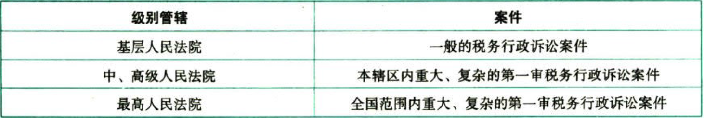
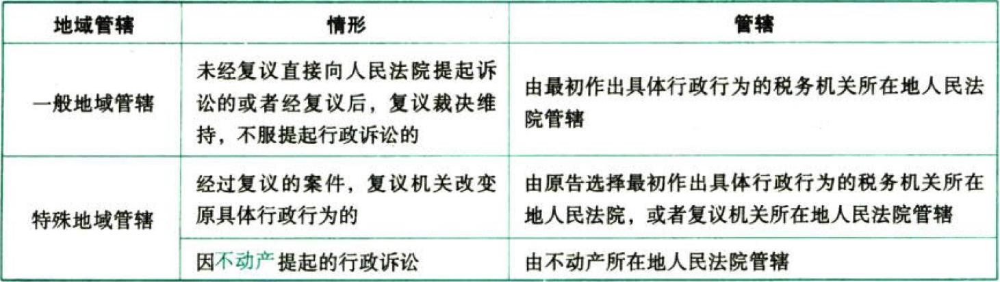

税务行政法制

# 1. 税务行政处罚

税务行政处罚是指公民、法人或者其他组织有违反税收征收管理秩序的违法行为，尚未构成犯罪，依法应当承担行政责任的，由`税务机关`给予的`行政处罚`。

## 1.1. 税务行政处罚的原则

（1）法定原则；

（2）公正、公开原则；

（3）以事实为依据原则；

（4）过罚相当原则；

（5）处罚与教育相结合原则；

（6）监督、制约原则。

## 1.2. 税务行政处罚的设定和种类

### 1.2.1. 税务行政处罚的设定:star: :star: 

| 部门                     | 设定形式 | 限定                                                                                                                                                                                                                         |
|--------------------------|----------|------------------------------------------------------------------------------------------------------------------------------------------------------------------------------------------------------------------------------|
| 全国人大及其常委会       | 法律     | 无                                                                                                                                                                                                                           |
| 国务院                   | 行政法规 | 限制人身自由除外                                                                                                                                                                                                             |
| 国家税务总局             | 规章     | 对非经营活动中的违法行为，设定罚款不得越过1000元 对经营活动中的违法行为，有违法所得的，设定罚款不得超过违法所得的3倍，且最高不得超过30000元；没有违法所得的，设定罚款最高不得超过10000元；超过限额的，应当报`国务院`批准 |
| 税务局及以下级别税务机关 | 不可设定 | 只能对上述级别的处罚具体化。属于执行税收法律、法规、规章的行为，不是对税务行政处罚的设定                                                                                                                                     |

省、自治区、直辖市和计划单列市税务局及其以下各级税务机关制定的税收法律、法规、规章以外的规范性文件，在税收法律、法规、规章规定给予行政处罚的行为、种类和幅度的范围内作出具体规定，是一种`执行`税收法律、法规、规章的`行为`，不是对税务行政处罚的设定。因此，这类规范性文件与行政处罚法规定的处罚设定原则并不矛盾，是有效的，是可以执行的。

### 1.2.2. 税务行政处罚的种类:star: 

现行的税务行政处罚种类主要有三种：（1）`罚款`。（2）`没收`财物和违法所得。（3）`停止`出口退税权。

## 1.3. 税务行政处罚的主体与管辖:star: :star: 

### 1.3.3. 税务行政处罚的实施主体

（1）税务行政处罚的实施主体主要是`县`以上的`税务机关`

（2）各级税务机关的内设机构、派出机构不具处罚主体资格，不能以自己的名义实施税务行政处罚

（3）`税务所`可以实施罚款额在`2000元以下`的税务行政处罚。这是`《税收征管法》`对税务所的`特别授权`

### 1.3.4. 税务行政处罚的管辖

税务行政处罚实行`行为发生地`原则，由当事人税收违法行为发生地的县（市、孩〉以上税务机关管辖。

## 1.4. 税务行政处罚的简易程序

### 1.4.5. 基本特征

税务行政处罚的简易程序是指税务机关及其执法人员对于公民、法人或者其他组织违反税收征收管理秩序的行为，`当场作出`税务行政处罚`决定`的行政处罚程序

### 1.4.6. 适用条件

（1）案情简单、事实清楚、违法后果比较轻微且有法定依据应当给予处罚的违法行为

（2）给予的处罚较轻，仅适用于对公民处以`50元以下`和对法人或者其他组织处以`1000以下`罚款的违法案件

简易处罚程序的特点是当场作出处罚决定，但不一定当场交罚款。简易处罚程序的金额不可能涉及听证程序，但可以涉及税务行政复议、诉讼程序。

自2017年11月1日起，税务机关依法对公民、法人或者其他组织当场作出行政处罚决定的，使用修订后的`《税务行政处罚决定书（简易）》`，不再另行填写《陈述申辩笔录》和《税务文书送达回证》。进一步简化了简易处罚流程。

## 1.5. 税务行政处罚的一般程序

税务行政处罚的一般程序包括`立案`、`调查取证`（有的案件要举行听证）、`审查`、`决定`、`执行`程序。

### 1.5.7. 听证环节

听证是指税务机关在对当事人某些违法行为作出处罚决定之前，接照一定形式听取`调查人员`和`当事人`意见的程序。

### 1.5.8. 税务行政处罚听证的范围

对公民作出`2000元以上`或者对法人或者其他组织作出`10000元以上`罚款的案件。

## 1.6. 税务行政处罚权力清单:star: :star: 

“权力清单”就是明确权力该做什么，做到“法无授权不可为”。只有理清权力的边界，杜绝不作为、乱作为或以权谋私等乱象，才可能使权力得到有效监督，才能持续推进依法治税。

### 1.6.9. 账簿、凭证管理类

| 违规行为                                                                                                                                                                                                                                                                                                         | 处罚权力标准                                                                                                                  |
|------------------------------------------------------------------------------------------------------------------------------------------------------------------------------------------------------------------------------------------------------------------------------------------------------------------|-------------------------------------------------------------------------------------------------------------------------------|
| 未按规定设置、保管`账簿`资料，报送财务、会计制度办法核算软件，安装使用税控装置的（包括纳税人来按照规定设置、保管账簿或者保管记账凭证和有关资料的；纳税人未按照规定将财务、会计制度或者财务、会计处理办法和会计核算软件报送税务机关备查的；纳税人来按照规定安装、使用税控装置，或者损毁或者擅自改动税控装置的） | 税务机关责令其限期改正，可以处2000元以下的罚款： 情节严重的，处2000元以上10000元以下的罚款                                    |
| 扣缴义务人来按照规定设置、保管`代扣代缴`、`代收代缴`税款账簿或者保管代扣代缴、代收代缴税款记账凭证及有关资料的                                                                                                                                                                                               | 税务机关责令其限期改正，可以处2000元以下的罚款 情节严重的，处2000元以上5000元以下的罚款                                     |
| 非法印制、转借、倒卖、变造或者伪造`完税凭证`的                                                                                                                                                                                                                                                                 | 税务机关责令其改正，处2000元以上10000元以下的罚款 情节严重的，处10000元以上50000元以下的罚款 构成犯罪的，依法追究刑事责任 |

### 1.6.10. 纳税申报类

| 违规行为                                                                                                                                                                                 | 处罚权力标准                                                                                   |
|------------------------------------------------------------------------------------------------------------------------------------------------------------------------------------------|------------------------------------------------------------------------------------------------|
| 未按规定期限办理`纳税申报`和报送纳税资料的（包括纳税人来校照规定的期限办理纳税申报初级送纳税资料的；扣缴义务人来按照规定的期限向税务机关报送代扣代缴、代收代缴税款报告表和有关资料的） | 税务机关责令其限期改正，可以处2000元以下的罚款： 情节严重的，可以处2000元以上10000元以下的罚款 |
| 纳税人、扣缴义务人编造`虚假`计税依据的                                                                                                                                                 | 税务机关责令其限期改正，并处50000元以下的罚款                                                  |

### 1.6.11. 税务检查类

| 违规行为                                                                                                                                                                                                                                                                                         | 处罚权力标准                                                                                              |
|--------------------------------------------------------------------------------------------------------------------------------------------------------------------------------------------------------------------------------------------------------------------------------------------------|-----------------------------------------------------------------------------------------------------------|
| 纳税人、相缴义务人逃避、拒绝或者以其他方式`阻挠税务机关检查`（包括提供虚假资料，不如实反映情况，或者拒绝提供有关资料的；拒绝或者阻止税务机关记录、录音、录像、照相和复制与案件有关的情况和资料的；在检查期间，纳税人、扣缴义务人转移、隐匿、销毁有关资料的；有不依法接受税务检查的其他情形的） | 税务机关责令其改正，可以处10000元以下的罚款 情节严重的，处10000元以上50000元以下的罚款                  |
| 纳税人、扣缴义务人的`开户银行`或者其他金融机构拒绝接受税务机关依法检查纳税人、扣缴义务人存款账户，或者拒绝执行税务机关作出的冻结存款或者扣缴税款的决定，或者在接到税务机关的书面通知后帮助纳税人、扣缴义务人转移存款，造成税款流失的                                                           | 税务机关处10万元以上50万元以下的罚款，对直接负责的主管人员和其他直接责任人员处1000元以上10000元以下的罚款 |
| 税务机关依照《税收征管法》第五十四条第（五）项的规定到车站、码头、机场、邮政企业及其分支机构检查纳税人有关情况时，有关单位拒绝的                                                                                                                                                                 | 税务机关责令其改正，可以处10000元以下的罚款 情节严重的，处10000元以上50000元以下的罚款                  |

## 1.7. 税务行政处罚的执行:star: :star: 

### 1.7.12. 税务行政处罚决定后的履行

税务机关依法作出行政处罚决定后，当事人应当在行政处罚决定规定的期限内，予以履行。当事人在法定期限内不申请复议又不起诉，并且在规定期限内又不履行的，税务机关可以依法强制执行或申请法院强制执行。

### 1.7.13. 罚款缴纳期限及逾期处理规定

税务机关对当事人作出罚款行政处罚决定的，当事人应当在收到行政处罚决定书之日起`15日`内缴纳罚款，到期不缴纳的，税务机关可以对当事人每日按`罚款数额的3%`加处罚款

## 1.8. 税务行政处罚裁量权行使规则

税务行政处罚裁量权，是指税务机关根据法律、法规和规章的规定，综合考虑税收违法行为的事实、性质、情节及社会危害程度，选择处罚种类和幅度并作出处罚决定的权力。

### 1.8.14. 行使税务行政处罚裁量权应当遵循的原则

1.合法原则。

2.合理原则。

3.公平公正原则。

4.公开原则。

5.程序正当原则。

6.信赖保护原则。

7.处罚与教育相结合原则。

### 1.8.15. 行政处罚裁量基准制定

税务行政处罚裁量基准，是税务机关为规范行使行政处罚裁量权而制定的细化量化标准。税务行政处罚裁量基准，应当包括违法行为、处罚依据、裁量阶次、适用条件和具体标准等内容。

税务行政处罚裁量基准应当在法定范围内制定，并符合以下要求：

（1）法律、法规、规章规定可予以行政处罚的，应当明确是否予以行政处罚的适用条件和具体标准。

（2）法律、法规、规章规定可以选择行政处罚种类的，应当明确不同种类行政处罚的适用条件和具体标准。

（3）法律、法规、规章规定行政处罚幅度的，应当根据违法事实、性质、情节、社会危害程度等因素确定适用条件和具体标准。

（4）法律、法规、规章规定可以单处也可以并处行政处罚的，应当明确单处或者并处行政处罚的适用条件和具体标准。

制定税务行政处罚裁量基准，参照下列程序进行：

（1）确认行政处罚裁量依据。

（2）整理、分析行政处罚典型案例，为细化量化税务行政处罚裁量权提供参考。

（3）细化最化税务行政处罚裁量权，拟定税务行政处罚裁量基准。

税务行政处罚裁量基准应当以规范性文件形式发布，并结合税收行政执法实际及时修订。

### 1.8.16. 行政处罚裁量规则适用

法律、法规、规章规定可以给予行政处罚，当事人首次违反且情节轻微，并在税务机关发现前主动改正的或者在税务机关责令限期改正的期限内改正的，不予行政处罚。

税务机关应当责令当事人改正或者限期改正违法行为的，除法律、法规、规章另有规定外，责令限期改正的期限一般不超过`30日`。

对当事人的同一个税收违法行为不得给予两次以上罚款的行政处罚。当事人同一个税收违法行为违反不同行政处罚规定且均应处以罚款的，应当选择适用处罚较重的条款。

当事人有下列情形之一的，不予行政处罚：

（1）违法行为轻微并及时纠正，没有造成危害后果的。

（2）不满十四周岁的人有违法行为的。

（3）精神病人在不能辨认或者不能控制自己行为时有违法行为的。

（4）其他法律规定不予行政处罚的。

当事人有下列情形之一的，应当依法从轻或者减轻行政处罚：

（1）主动消除或者减轻违法行为危害后果的。

（2）受他人胁迫有违法行为的。

（3）配合税务机关查处违法行为有立功表现的。

（4）其他依法应当从轻或者减轻行政处罚的。

违反税收法律、行政法规应当给予行政处罚的行为在五年内未被发现的，不再给予行政处罚。

行使税务行政处罚裁量权应当依法履行告知义务。在作出行政处罚决定前，应当告知当事人作出行政处罚决定的事实、理由、依据及拟处理结果，并告知当事人依法享有的权利。

税务机关行使税务行政处罚裁量权涉及法定回避情形的，应当依法告知当事人享有申请回避的权利。税务人员存在法定回避情形的，应当自行回避或者由税务机关决定回避。

当事人有权进行陈述和申辩。税务机关应当克分听取当事人的意见，对其提出的事实、理由或者证据进行复核，陈述申辩事由成立的，税务机关应当采纳；不采纳的，应予说明理由。税务机关不得因当事人的申辩而加重处罚。

税务机关对公民作出2000元以上罚款或者对法人或者其他组织作出10000元以上罚款的行政处罚决定之前，应当告知当事人有要求举行听证的权利；当事人要求听证的，税务机关应当组织听证。

对情节复杂、争议较大、处罚较重、影响较广或者拟减轻处罚等税务行政处罚案件，应当经过集体审议决定。

税务机关按照一般程序实施行政处罚，应当在执法文书中对事实认定、法律适用、基准适用等说明理由。省税务机关应当积极探索建立案例指导制度，通过案例指导规范税务行政处罚裁量权。

# 2. 税务行政复议

## 2.9. 税务行政复议机构和人员

各级行政复议机关负责法制工作的机构（以下简称“行政复议机构”）依法办理行政复议事项。

各级行政复议机关可以成立行政复议委员会，研究重大、疑难案件，提出处理建议。

行政复议委员会可以邀请本机关以外的具有相关专业知识的人员参加。

行政复议工作人员应当具备与履行行政复议职责相适应的品行、专业知识和业务能力，并取得《行政复议法实施条例》规定的资格。

税务机关中初次从事行政复议的人员，应当通过国家统一法律职业资格考试取得法律职业资格。

## 2.10. 税务行政复议的受案范围:star: :star: 

| 受案范围                         | 税务机关的具体行政行为                                                                                                                                                                                                                                      |
|----------------------------------|-------------------------------------------------------------------------------------------------------------------------------------------------------------------------------------------------------------------------------------------------------------|
| 征税行为:star: :star: :star:                   | （1）确认纳税主体、征税对象、征税范阁、减税、免税、退税、抵扣税款、适用税率、计税依据、纳税环节、纳税期限、纳税地点和税款征收方式等具体行政行为 （2）征收税款、加收滞纳金 （3）扣缴义务人、受税务机关委托的单位和个人作出的代初代缴、代收代缴、代征行为 |
| 行政许可、行政审批行为           | 略                                                                                                                                                                                                                                                          |
| 发票管理行为                     | 包括发售、收缴、代开发票等                                                                                                                                                                                                                                  |
| 税收保全措施                     | （1）书面通知开户银行或者其他金融机构冻结纳税人的金额相当于应纳税款的存款 （2）扣押、查封价值相当于应纳税款的商品、货物或者其他财产                                                                                                                       |
| 强制执行措施                     | （1）书面通知开户银行或者其他金融机构从当事人存款中扣缴税款 （2）依法拍卖或变卖所扣押、查封价值相当于应纳税款的商品、货物或者其他财产以抵缴税款                                                                                                           |
| 行政处罚行为                     | （1）罚款 （2）没收财物和违法所得 （3）停止出口退税权                                                                                                                                                                                                   |
| 不依法履行职责的行为             | （1）颁发税务登记 （2）开具、出具完税凭证、外出经营活动税收管理证明 （3）行政赔偿 （4）行政奖励 （5）其他不依法履行职责的行为                                                                                                                               |
| 资格认定行为                     | 略                                                                                                                                                                                                                                                          |
| 不依法确认纳税担保行为           | 略                                                                                                                                                                                                                                                          |
| 政府信息公开工作中的具体行政行为 | 略                                                                                                                                                                                                                                                          |
| 纳税信用等级评定行为             | 略                                                                                                                                                                                                                                                          |
| 通知出入境管理机关阻止出境行为   | 略                                                                                                                                                                                                                                                          |
| 其他具体行政行为                 | 略                                                                                                                                                                                                                                                          |

（1）注意税务行政复议与税务行政诉讼的关系，在税务行政复议受案范围中，解决征税问题的争议，税务行政复议是税务行政诉讼的必经前置程序；解决征税问题之外的争议，税务行政复议不是税务行政诉讼的必经前置程序。

（2）在税务行政复议之前是否有前置程序呢？是否需要先缴纳税款、滞纳金和罚款才能提请行政复议？

【解答】首先，按照现行《征管法》的规定，征税问题的争议，儒要先缴纳税款和滞纳金才能进入复议程序，这也是程序优于实体原则的体现。

其次，罚款问题的争议，还要区分为对罚款决定的争议和对逾期不缴纳罚款加处罚款决定的争议。对罚款决定的争议，没有先缴纳罚款再申请复议的政策要求，但是对税务机关作出逾期不缴纳罚款加处罚款的决定不服的争议，应当先缴纳罚款和加处罚款，再申请行政复议。

（3）申请人认为税务机关的具体行政行为所依据的下列规定不合法，对具体行政行为申请行政复议时，可以一并向行政复议机关提出对有关规定的审查申请；申请人对具体行政行为提出行政复议申请时不知道该具体行政行为所依据的规定的，可以在行政复议机关作出行政复议决定以前提出对该规定的审查申请：（1）国家税务总局和国务院其他部门的规定。（2）其他各级税务机关的规定。（3）地方各级人民政府的规定。（4）地方人民政府工作部门的规定。

前款中的规定不包括规章。

## 2.11. 税务行政复议管辖:star: :star: 

我国税务行政复议管辖的基本制度是实行由上一级税务机关管辖的一级复议制度。

| 情形                                                           | 基本规定                                                                                                                         |
|----------------------------------------------------------------|----------------------------------------------------------------------------------------------------------------------------------|
| 对各级税务局的具体行政行为不服的                               | 向其上一级税务局申请行政复议                                                                                                     |
| 对计划单列市税务局的具体行政行为不服的                         | 向国家税务总局申请行政复议                                                                                                       |
| 对税务所（分局）、各级税务局的稽查局的具体行政行为不服的       | 向其所属税务局申请行政复议局                                                                                                     |
| 对国家税务总局的具体行政行为不服的                             | 向国家税务总局申请行政复议。对行政复议决定不服，申请人可以向人民法院提起行政诉讼，也可以向国务院申请裁决。国务院的裁决为最终裁决 |
| 对两个以上税务机关以共同的名义作出的具体行政行为不服的         | 向共同上一级税务机关申请行政复议                                                                                                 |
| 对税务机关与其他行政机关以共同的名义作出的具体行政行为不服的   | 向其共同上一级行政机关申请行政复议                                                                                               |
| 对被撤销的税务机关在撤销以前所作出的具体行政行为不服的         | 向继续行使其职权的税务机关的上一级税务机关申请行政复议                                                                           |
| 对税务机关作出逾期不缴纳罚款加处罚款的决定不服的               | 向作出行政处罚决定的税务机关申请行政复议                                                                                         |
| 对已处罚款和加处罚款都不服的                                   | 一并向作出行政处罚决定的税务机关的上一级税务机关申请行政复议                                                                     |
| 申请人向具体行政行为发生地的县级地方人民政府提交行政复议申请的 | 由接受申请的县级地方人民政府依照《行政复议法》第十五条、第十八条的规定予以转送                                                   |

对纳税人不服省级税务机关作出的具体税务行政行为，已向国家税务总局申请复议，但对复议决定不服的，只能向人民法院起诉，而不能向国务院申请裁决。

## 2.12. 税务行政复议申请人和被申请人

### 2.12.17. 税务行政复议的申请人规定:star: 

| 情形                                                                                                                                             | 申请人或代表                                                                                                                                 |
|--------------------------------------------------------------------------------------------------------------------------------------------------|----------------------------------------------------------------------------------------------------------------------------------------------|
| 合伙企业申请行政复议的                                                                                                                           | 以核准登记的企业为申请人，由执行合伙事务的合伙人代表该企业参加行政复议                                                                       |
| 其他合伙组织申请行政复议的                                                                                                                       | 由合伙人共同申请行政复议                                                                                                                     |
| 上述以外的不具备法人资格的其他组织申请行政复议的                                                                                                 | 由该组织的主要负责人代表该组织参加行政复议；没有主要负责人的，由共同推选的其他成员代表该组织参加行政复议                                     |
| 股份制企业的股东大会、股东代表大会、董事会认为税务具体行政行为侵犯企业合法权益的                                                                 | 可以以企业的名义申请行政复议                                                                                                                 |
| 有权申请行政复议的公民死亡的                                                                                                                     | 其近亲属可以串请行政复议                                                                                                                     |
| 有权申请行政复议的公民为无行为能力人或者限制行为能力人                                                                                           | 其法定代理人可以代理申请行政复议                                                                                                             |
| 有权申请行政复议的法人或者其他组织发生合并、分立或终止的                                                                                         | 承受其权利义务的法人或者其他组织可以申请行政复议                                                                                             |
| 申请人以外的公民、法人或者其他组织与被审查的具体行政行为有利害关系的                                                                             | 可以向行政复议机关申请作为第三人参加行政复议 行政复议机关可以通知其作为第三人参加行政复议 第三人不参加行政复议，不影响行政复议案件的审理 |
| 非具体行政行为的行政管理相对人，但其权利直接被该具体行政行为所剥夺、限制或者被赋予义务的公民、法人或其他组织，在行政管理相对人没有申请行政复议时 | 非具体行政行为的行政管理相对人可以单独申请行政复议                                                                                           |

代表与代理的限制规定：

（1）复议代表的规定：同一行政复议案件申请人超过5人的，应当推选1至5名代表参加行政复议

（2）复议代理的规定：

①申请人、第三人可以委托1至2名代理人参加行政复议

②申请人、第三人委托代理人的，应当向行政复议机构提交授权委托书

③授权委托书应当载明委托事项、权限和期限

④公民在特殊情况下无法书面委托的，可以口头委托。口头委托的，行政复议机构应当核实并记录在卷

⑤申请人、第三人解除或变更委托的，应当书面告知行政复议机构

### 2.12.18. 税务行政复议的被申请人规定:star: 

| 行政行为的作出                                                                                     | 被申请人                                     |
|----------------------------------------------------------------------------------------------------|----------------------------------------------|
| 申请人对具体行政行为不服申请行政复议的                                                             | 作出该具体行政行为的税务机关                 |
| 申请人对扣缴义务人的扣缴税款行为不服的                                                             | 主管该扣缴义务人的税务机关                   |
| 对税务机关委托的单位和个人的代征行为不服的                                                         | 委托税务机关                                 |
| 税务机关与法律、法规授权的组织以共同的名义作出具体行政行为的                                       | 税务机关和法律、法规授权的组织为共同被申请人 |
| 税务机关与其他组织以共同名义作出具体行政行为的                                                     | 税务机关                                     |
| 税务机关依照法律、法规和规章规定，经上级税务机关批准作出具体行政行为的                             | 批准机关                                     |
| 申请人对经重大税务案件审理程序作出的决定不服的                                                     | 审理委员会所在税务机关                       |
| 税务机关设立的派出机构、内设机构或者其他组织，未经法律、法规役权，以自己名义对外作出具体行政行为的 | 税务机关                                     |

被申请人不得委托本机关以外人员参加行政复议。

## 2.13. 税务行政复议申请:star: :star: 

（1）申请复议的时限——得知税务机关作出具体行政行为之日起60日之内。

（2）复议与诉讼的次序问题：

①对征税行为的争议——复议是诉讼的必经前置程序；

②对其他行为的争议——复议不是诉讼的必经前置程序。

（3）行政复议申请方式——可以书面申请或口头申请。

申请人书面申请行政复议的，可以采取当面递交、邮寄或者传真等方式提出行政复议申请。有条件的行政复议机关可以接受以电子邮件形式提出的行政复议申请。

申请人口头申请行政复议的，行政复议机构应当依照规定当场制作行政复议申请笔录，交申请人核对或者向申请人宣读，并由审请人确认。

（4）行政复议和行政诉讼不能同时进行。

申请人向行政复议机关申请行政复议，行政复议机关已经受理的，在法定行政复议期限内申请人不得向人民法院提起行政诉讼；申请人向人民法院提起行政诉讼，人民法院已经依法受理的，不得申请行政复议。

## 2.14. 税务行政复议曼理:star: 

这部分有两个易考点：一是应当受理行政复议的情况；二是行政复议期间具体行政行为不停止执行，但是有停止执行的特例。

### 2.14.19. 应当受理的

行政复议申请符合下列规定的，行政复议机关应当受理：

（1）属于税务行政复议规则规定的行政复议范围；

（2）在法定申请期限内提出；

（3）有明确的申请人和符合规定的被申请人；

（4）申请人与具体行政行为有利害关系；

（5）有具体的行政复议请求和理由；

（6）属于收到行政复议申请的行政复议机关的职责范围；

（7）其他行政复议机关尚未受理同一行政复议申请，人民法院尚未受理同一主体就同一事实提起的行政诉讼；

（8）符合税务行政复议申请中规定的条件。

### 2.14.20. 可以停止执行的

行政复议期间具体行政行为不停止执行；但是有下列情形之一的，可以停止执行：

（1）被申请人认为需要停止执行的；

（2）行政复议机关认为需要停止执行的；

（3）申请人申请停止执行，行政复议机关认为其要求合理，决定停止执行的；

（4）法律规定停止执行的。

## 2.15. 税务行政复议审查和决定

### 2.15.21. 税务行政复议的决定——维持、撤销、变更

（1）具体行政行为认定事实清楚，证据确凿，适用依据正确，程序合法，内容适当的，决定维持。

（2）被申请人不履行法定职责的，决定其在一定期限内履行。

（3）具体行政行为有下列情形之一的，决定撤销、变更或者确认该具体行政行为违法；决定撤销或者确认该具体行政行为违法的，可以责令被申请人在一定期限内重新作出具体行政行为：

①主要事实不清、证据不足的。

②适用依据错误的。

③违反法定程序的。

④超越职权或者滥用职权的。

⑤具体行政行为明显不当的。

（4）有下列情形之一的，行政复议机关可以决定变更：

①认定事实清楚，证据确凿，程序合法，但是明显不当或者适用依据错误的。

②认定事实不清，证据不足，但是经行政复议机关审理查明事实清楚，证据确凿的。

### 2.15.22. 税务行政复议决定的时限

行政复议机关应当自受理申请之日起60日内作出行政复议决定。情况复杂，不能在规定期限内作出行政复议决定的，经行政复议机关负责人批准，可以适当延期，并告知申请人和被申请人；但是延期不得超过30日。

### 2.15.23. 税务行政复议的中止与终止

行政复议期间，有下列倩影之一的，行政复议中止：

（1）作为申请人的公民死亡，其近亲属尚未确定是否参加行政复议的

（2）作为申请人的公民丧失多加行政复议的能力，尚未确定法定代理人参加行政复议的

（3）作为申请人的法人或者其他组织终止，尚未确定权利义务承受人的

（4）作为申请人的公民下落不明或者被宣告失踪的

（5）申请人、被申请人因不可抗力，不能参加行政复议的

（6）行政复议机关因不可抗力原因暂时不能履行工作职责的

（7）案件涉及法律适用问题，需要有权机关作出解释或者确认的

（8）案件审理需要以其他案件的审理结果为依据，而其他案件尚未审结的

（9）其他需要中止行政复议的情形

税务行政复议的中止，意味着行政复议中止的原因消除以后，应当及时恢复行政复议案件的审理。

行政复议期间，有下列情形之一的，行政复议终止：

（1）申请人要求撤回行政复议申请，行政复议机构准予撤回的

（2）作为申请人的公民死亡，没有近亲属，或者其近亲属放弃行政复议权利的

（3）作为申请人的法人或者其他组织终止，其权利义务的承受人放弃行政复议权利的

（4）申请人与被申请人依照规定，经行政复议机构准许达成和解的

（5）行政复议申请受理以后，发现其他行政复议机关已经先于本机关受理，或者人民法院已经受理的

税务行政复议的终止，意味着该项复议无法恢复。

依照行政复议中止情形的第（1）（2）（3）项规定中止行政复议，满60日行政复议中止的原因未消除的，行政复议终止。

## 2.16. 税务行政复议和解与调解

### 2.16.24. 可以达成和解或调解的四个方面

对下列行政复议事项，按照自愿、合法的原则，申请人和被申请人在行政复议机关作出行政复议决定以前可以达成和解，行政复议机关也可以调解：

（1）行使自由裁量权作出的具体行政行为，如行政处罚、核定税额、确定应税所得率等；（2）

行政赔偿；

（3）行政奖励；

（4）存在其他合理性问题的具体行政行为。

存在自由裁量和弹性处理规则的争议可以采用和解或调解的处理方式，但是法定事项只能采用申请人撤回或复议机关决定的方式解决争议。

### 2.16.25. 书面和解协议

申请人和被申请人达成和解的，应当向行政复议机构提交书面和解协议。和解内容不损害社会公共利益和他人合法权益的，行政复议机构应当准许。

### 2.16.26. 不得再次复议

经行政复议机构准许和解终止行政复议的，申请人不得以同一事实和理由再次申请行政复议。

# 3. 税务行政诉讼

## 3.17. 税务行政诉讼的概念

税务行政诉讼的被告必须是税务机关或经法律、法规授权的行使税务行政管理权的组织，而不是其他行政机关或组织。税务行政诉讼解决的争议发生在税务行政管理过程中。因税款征纳发生的争议，行政复议是行政诉讼的必经前置程序。

按照新修订的《行政诉讼法上被诉行政机关负责人应当出庭应诉。不能出庭的，应当委托行政机关相应的工作人员出庭。

人民法院审理行政案件，对行政行为是否合法进行审查。人民法院审理行政案件，依法实行合议、回避、公开审判和两审终审制度。当事人在行政诉讼中的法律地位平等。各民族公民都有用本民族语言、文字进行行政诉讼的权利。人民检察院有权对行政诉讼实行法律监督。

## 3.18. 税务行政诉讼的原则

税务行政诉讼的原则包括：

（1）人民法院特定主管原则；

（2）合法性审查原则；

（3）不适用调解原则；

（4）起诉不停止执行原则；

（5）税务机关负举证责任原则；

（6）由税务机关负责赔偿的原则。

## 3.19. 税务行政诉讼的管辖

税务行政诉讼管辖是指人民法院受理第一审税务案件的职权分工。税务行政诉讼的管辖分为级别管辖、地域管辖和裁定管辖。

### 3.19.27. 级别管辖

是指上下级人民法院之间受理第一审税务行政案件的分工和权限。

### 3.19.28. 地域管辖

是指同级人民法院之间受理第一审行政案件的分工和权限，分一般地域管辖和特殊地域管辖两种情况。

两个以上人民法院都有管辖权的案件，原告可以选择其中一个人民法院提起诉讼。原告向两个以上有管辖权的人民法院提起诉讼的，由最先立案的人民法院管辙。

### 3.19.29. 裁定管辖

是指人民法院依法自行裁定的管辖，包括移送管辖、指定管辖及管辖权的转移三种情况。

（1）移送管辖是指人民法院将已经受理的案件，移送给有管辖权的人民法院审理。

（2）指定管辖是指上级人民法院以裁定的方式，指定某下一级人民法院管辖某一案件。

（3）管辖权的转移。根据新《行政诉讼法》第24条的规定，上级人民法院有权审理下级人民法院管辖的第一审行政案件。下级人民法院对其管辖的第一审行政案件，认为需要由上级人民法院审理或者指定管辖的，可以报请上级人民法院决定。

## 3.20. 税务行政诉讼的受案范围

税务行政诉讼的受案范围与税务行政复议受案范围基本一致。

## 3.21. 税务行政诉讼的起诉和受理:star: :star: 

有复议前置程序的，起诉期限是当事人接到复议决定书之日起15日内；不需要复议前置程序的，起诉期限是当事人接到通知或者知道之日起15日内；因税务机关来告知当事人诉权和起诉期限致使当事人逾期向人民法院起诉的，在不得超过2年的整体时间段内，起诉期限是当事人实际知道诉权或者起诉期限之日起15日内。

## 3.22. 税费行政诉讼的审理和判决:star: :star: 

人民法院审理行政案件实行合议、回避、公开审判和两审终审的审判制度。

重大税务案件的范围：重大税务行政处罚案件，根据《重大税收违法案件督办管理暂行办法》督办的案件，应司法、监察机关要求出具认定意见的案件，拟移送公安机关处理的案件，审理委员会成员单位认为案情重大、复杂、需要审理的案件，其他需要审理委员会审理的案件。

人民法院对受理的税务行政案件，经过调查、收集证据、开庭审理之后，分别作出如下判决：

（1）维持判决。

（2）撤销判决。

（3）履行判决。

（4）变更判决。

# 4. 总结

End。
