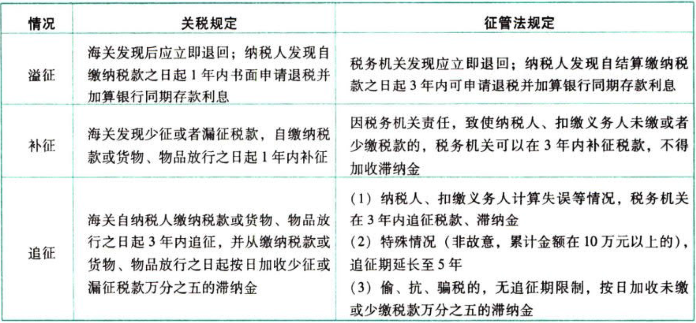

税收征收管理法.税款的退还和追征制度

### 0.0.1. 税款的退还和追征制度:star: :star: 

纳税人超过应纳税额缴纳的税款，税务机关发现后应当立即退还；纳税人自结算缴纳税款之日起3年内发现的，可以向税务机关要求退还多缴的税款并加算银行同期存款利息。

因税务机关责任，致使纳税人、扣缴义务人未缴或者少缴税款的，税务机关在3年内可要求纳税人、扣缴义务人补缴税款，但不得加收滞纳金。因纳税人、扣缴义务人计算等失误，未缴或者少缴税款的，税务机关在3年内可以追征税款、滞纳金；有特殊情况的追征期可延至5年。对偷税、抗税、骗税的，税务机关追征其未缴或少缴的税款、滞纳金或者所骗取的税款，不受上述期限限制。

