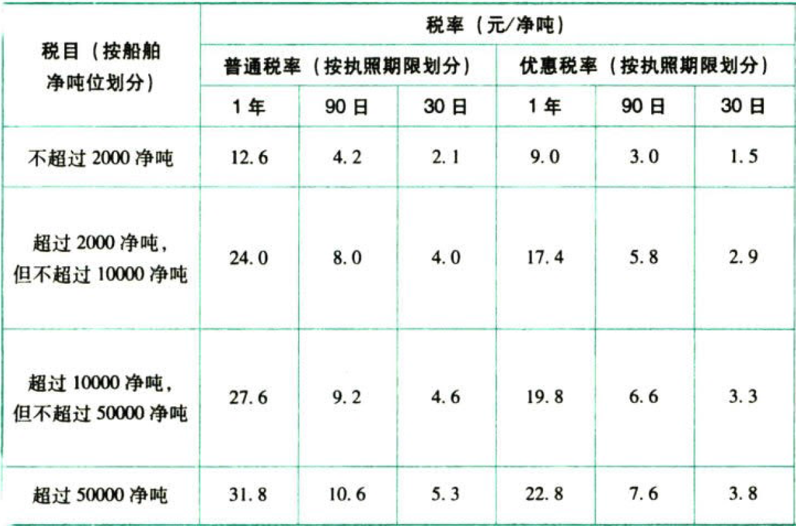

船舶吨税法

船舶吨税简称吨税，是对自境外港口进入中华人民共和国境内港口的船舶，因享受了我国的航道和导航设施而付出的代价。

# 1. 征税范围、税率

## 1.1. 征税范围

自中华人民共和国`境外港口`进入`境内港口`的船舶（以下称“应税船舶”），应当缴纳船舶吨税。

## 1.2. 税率

船舶吨税按船舶`净吨位`和执照标明的`停留期限`确定`税额标准`，按照30日、90日、1年的三类期限具体划分普通税率和优惠税率。

适用`优惠税率`的船舶包括：

（1）中华人民共和国国籍的应税船舶；

（2）船籍国（地区）与中华人民共和国签订含有相互给予船舶税费最惠国待遇条款的条约或者协定的应税船舶

除了适用优惠税率的船舶之外的其他应税船，适用`普通税率`。

吨税税目税率表如下：



`拖船`按照发动机功率`每千瓦折合净吨位0.67吨`。

无法提供净吨位证明文件的`游艇`，按照发动机功率`每千瓦折合净吨位0.05吨`。

# 2. 应纳税额的计算

吨税按照船舶净吨位和吨税执照期限征收。净吨位，是指由船籍国（地区）政府签发或者授权签发的船舶吨位证明书上标明的净吨位。计算公式：

```
应纳税额＝船舶净吨位×定额税率（元／净吨）
```
应税船舶负责人缴纳吨税或者提供担保后，海关按照其申领的执照期限填发`吨税执照`。

应税船舶在进入港口办理入境手续时，应当向海关申报纳税领取吨税执照，或者交验吨税执照（或者申请核验吨税执照电子信息）。应税船舶在离开港口办理出境手续时，应当交验吨税执照（或者申请核验吨税执照电子信息）。

应税船舶负责人申领吨税执照时，应当向海关提供下列文件：

（1）船舶国籍证书或者海事部门签发的船舶`国籍证书`收存证明；

（2）船舶`吨位证明`。

# 3. 税收优惠:star: 

## 3.3. 直接优惠

下列船舶免征吨税：

（1）应纳税额在人民币`50元`以下的船舶；

（2）向境外以购买、受赠、继承等方式取得船舶所有权的`初次进口到港`的空载船舶；

（3）吨税执照期满后`24小时内不上下客货`的船舶；

（4）`非机动船舶`（不包括非机动驳船）；

（5）捕捞、养殖渔船；

（6）监难、防疫隔离、修理、改造、终止运营或者拆解，并`不上下客货`的船舶；

（7）军队、武装警察部队专用或者征用的船蚓；

（8）警用船舶；

（9）依照法律规定应当予以免税的外国驻华`使领馆`、罔际组织驻华代表机构及其有关人员的船舶；

（10）国务院规定的其他船舶。

符合上述第5～9项的优惠规定的船舶，应当提供海事部门、植业船舶管理部门等部门、机构出具的具有法律效力的证明文件或者使用关系证明文件，申明免税的依据和理由。

`拖船`和`非机动驳船`分别按相同净吨位船舶税率的`50%计征`税款。

## 3.4. 延期优惠

在`吨税执照期限`内，应税船舶发生下列情形之一的，海关按照实际发生的天数批注延长吨税执照期限：

（1）避难、防疫隔离、修理、改造，并不上下客货。

（2）军队、武装警察部队征用。

符合延期优惠规定的船舶，应当提供海事部门、渔业船舶管理部门等部门、机构出具的具有法律效力的证明文件或者使用关系证明文件，申明延长吨税执照期限的依据和理由。

# 4. 征收管理:star: 

## 4.5. 征收机关

吨税由`海关`负责征收。海关征收吨税应当制发`缴款凭证`。

## 4.6. 纳税期限

吨税纳税义务发生时间为应税船舶`进入港口`的当日。

应税船舶在吨税执照期满后尚未离开港口的，应当申领新的吨税执照，自上一次执照期满的次日起续缴吨税。

应税船舶负责人应当自海关填发吨税缴款凭证之日起`15日`内缴清税款。未按期缴清税款的，自滞纳税款之日起至缴清税款之日止，按日加收滞纳税款`万分之五`的税款滞纳金。

## 4.7. 纳税担保

应税船舶到达港口前，经海关核准先行申报并办结出入境手续的，应税船舶负责人应当向海关提供与其依法履行吨税缴纳义务相适应的担保；应税船舶到达港口后，依照规定向海关申报纳税。

下列财产、权利可以用于担保：

（1）人民币、可自由兑换货币；

（2）汇票、本票、支票、债券、存单；

（3）银行、非银行金融机构的保函；

（4）海关依法认可的其他财产、权利。

## 4.8. 领取吨税执照后船舶变化的处理

应税船舶在吨税执照期限内，因修理、改造导致净吨位变化的，吨税执照继续有效。应税船舶办理出入境手续时，应当提供船舶经过修理、改造的证明文件。

应税船舶在吨税执照期限内，因税目税率调整或者船籍改变而导致适用税率变化的，吨税执照继续有效。

## 4.9. 执照毁损或遗失

吨税执照在期满前毁损或者遗失的，应当向原发照海关书面申请核发吨税执照副本，不再补税。

# 5. 总结

End。
