资源税法

# 1. 纳税义务人

在中华人民共和国`领域`和中华人民共和国管辖的其他`海域`开发`应税资源`的单位和个人，为资源税的纳税人。

2011年11月1日前已依法订立中外合作开采陆上、海上石油资源合同的，在该合同有效期内，继续依照国家有关规定缴纳矿区使用费，不缴纳资源税；合同期满后，依法缴纳资源税。

缴纳资源税的资源开采地点是中华人民共和国领域和中华人民共和国管辖的其他海域，这会带来资源税进口不征，出口不退的规则。

资源产品有应税与非应税的区别。

资源税有视同销售的规定，且资源税视同销售的行为与消费税视同销售行为基本一致。

开采海洋油气资源已经“费改税”，资源税取代了矿区使用费。

# 2. 税目、税率

## 2.1. 税目:star: :star: :star: 

资源税的税目包括`能源`矿产、`金属`矿产、`非金属`矿产、`水气`矿产和`盐`5大类，在5个税目下面又设有若干子目。目前所列的税目有164个，涵盖了所有已经发现的矿种和盐。

部分应税资源的征税对象规定为`原矿`，部分应税资源的征税对象规定为`选矿`产品，还有一部分应税资源的征税对象规定为`原矿或选矿`产品。

### 2.1.1. 资源税税目税率表

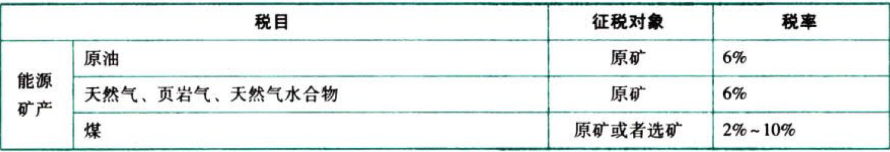

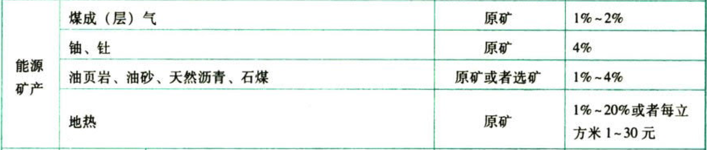

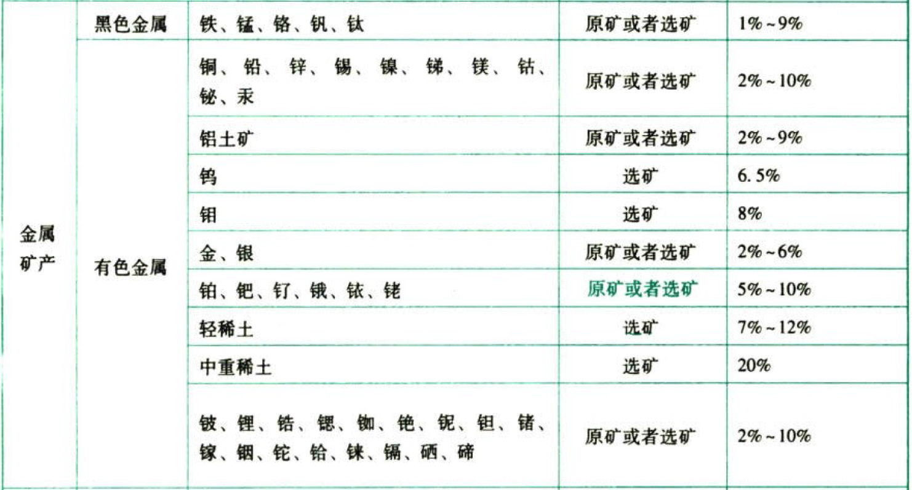

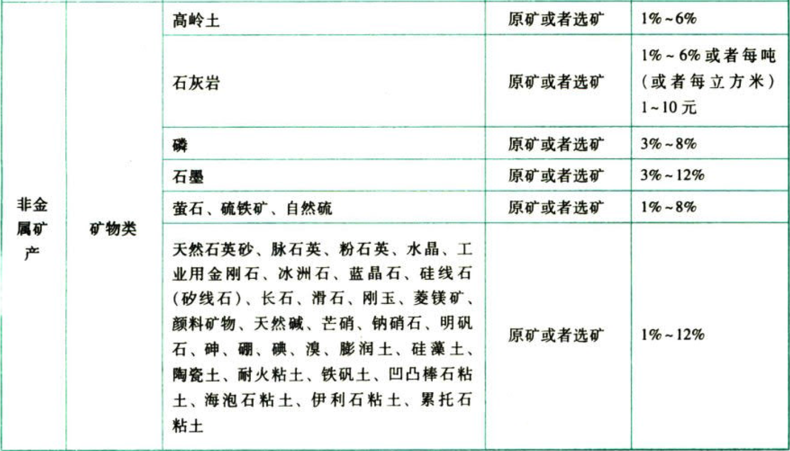


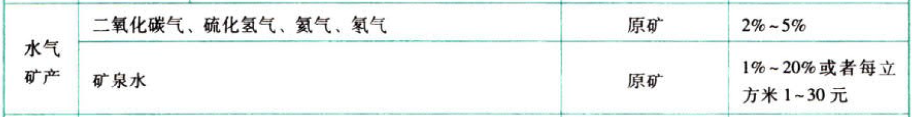

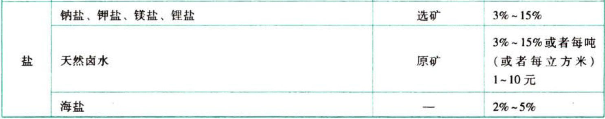

### 2.1.2. 资源税征税范围的易考点：

#### 2.1.2.1. 原油

包括`天然原油`，不包括`人造石油`。

#### 2.1.2.2. 天然气

包括`专门`开采或与原油`同时`开采的天然气。

煤炭开采企业因安全生产需要抽采的`煤成（层）气`免征资源税。

#### 2.1.2.3. 煤炭

包括`原煤`和以未税原煤（自采原煤）加工的`洗选煤`。

不包括已税原煤加工的洗选煤、其他煤炭制品。

## 2.2. 税率:star: :star: 

资源税采取`从价定率`或者`从量定额`的办法计征。具体来说，资源税按不同的资源品目分别实行固定税率和幅度税率。

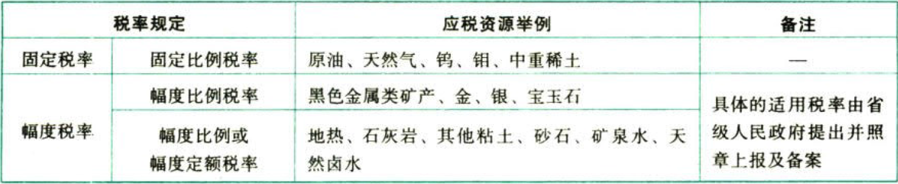

同一征税对象（资源品目）的原矿和选矿的适用税率应分别制定。

资源税主要采用比例税率从价计征，部分应税资源的税率形式适用幅度比例税率或幅度定额税率，在幅度内具体税率的选择权不在中央而在地方（省级政府提出，同级人大常委会决定，并报全国人民代表大会常务委员会和国务院备案）。

纳税人开采或者生产不同税目应税产品的，应当`分别核算`不同税目应税产品的销售额或者销售数量；未分别核算或者不能准确提供不同税目应税产品的销售额或者销售数量的，`从高`适用税率。

# 3. 计税依据:star: :star: :star: 

资源税的计税依据为应税产品的`销售额或销售量`，各税目的征税对象有的仅以原矿为征税对象，有的仅以选矿为征税对象，还有的可以原矿或选矿为征税对象。

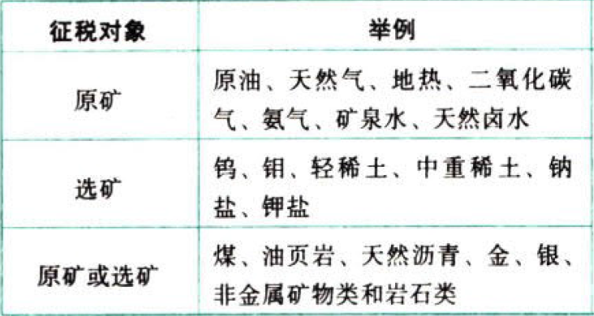

实行从价计征的：

```
应纳税额＝应税资源产品的销售额×适用税率
```
实行从量计征的：

```
应纳税额＝应税资源产品的销售数量×适用税率
```
## 3.3. 从价定率征收的计税依据:star: :star: :star: 

### 3.3.3. 销售额的基本规定

实行从价定率征收资源税的销售额，包括纳税人销售应税产品向购买方收取的全部价款和价外费用，不包括增值税销项税额。

### 3.3.4. 运杂费用的扣减

对`同时符合`以下条件的运杂费用，纳税人在计算应税产品计税销售额时，可予以`扣减`：

（1）包含在应税产品销售收入中；

（2）属于纳税人销售应税产品环节发生的运杂费用，具体是指运送应税产品从坑口或者洗选（加工）地到车站、码头或者购买方指定地点的运杂费用；

（3）取得相关运杂费用发票或者其他合法有效凭据；

（4）将运杂费用与计税销售额分别进行核算。

纳税人扣减的运杂费用明显偏高导致应税产品价格偏低且无正当理由的，主管税务机关可以合理调整计税价格。

### 3.3.5. 原矿销售额与选矿（精矿）销售额的换算或折算

#### 3.3.5.4. 对原矿销售额与选矿（精矿）销售额进行换算或折算的基本规定

为公平原矿与精矿之间的税负，对同一种应税产品，征税对象为精矿的，纳税人销售原矿时，应将原矿销售额换算为精矿销售额缴纳资源税；征税对象为原矿的，纳税人销售自采原矿加工的精矿，应将精矿销售额折算为原矿销售额缴纳资源税。

资源税的税目税率表展示出相当多的应税资源是以选矿（精矿）为征税对象的，按照选矿（精矿）规定了税率，也有一些应税资源以原矿为征税对象，按照原矿规定了税率。由于纳税人在销售应税资源时可能销售的是原矿，也可能销售的是经筛选或洗选后的精矿，所以，当销售的矿产品的加工程度与征税对象规定不匹配时，需要对销售额进行换算或折算，以体现计税的准确与公平税负。

原矿和选矿（精矿）的销售额或者销售量应当分别核算，未分别核算的，从高确定计税销售额或者销售数量。

#### 3.3.5.5. 对原矿销售额与选矿（精矿）销售额进行换算或折算的方法

原矿销售额与精矿销售额的换算或折算，其换算比或折算率原则上应通过原矿售价、精矿售价初选矿比计算，也可通过原矿销售额、加工环节平均成本和利润计算。

换算比或折算事应按简便可行、公平合理的原则，由`省`级财税部门确定，并报财政部、国家院务总局`备案`。

### 3.3.6. 特殊情形下销售额的确定

（1）纳税人以人民币以外的货币结算销售额的，应当折合成人民币计算。其销售额的人民币折合率可以选择销售额发生的`当天或者当月1日`的人民币汇率中间价。纳税人应在事先确定采用何种折合率计算方法，确定后`1年`内不得变更。

（2）纳税人开采应税产品由其关联单位对外销售的，按其关联单位的销售额征收资源税。

（3）纳税人既有对外销售应税产品，又有将应税产品用于除连续生产应税产品以外的其他方面的（包括用于非生产项目和生产非应税产品），则自用的这部分应税产品按照纳税人对外销售应税产品的平均价格计算销售额征收资源税。但是，自用于连续生产应税产品的，不缴纳资源税。

（4）纳税人将其开采的应税产品直接出口的，按其`离岸价格`（不含增值税）计算销售额征收资源税。

（5）资源税的“税不重征”规则

纳税人用已纳资源税的应税产品进一步加工应税产品销售的，不再缴纳资源税。纳税人以自采未税产品和外购已税产品混合销售或者混合加工为应税产品销售的，应当准确核算已税产品的购进金额，在计算混合销售或混合加工后的应税产品销售额时，准予扣减已单独核算的已税产品的购进金额；未分别核算的，一并计算缴纳资源税。己税产品购进金额当期不足扣减的可结转下期扣减。

外购原矿或者精矿形态的已税产品与本产品征税对象不同的，在计算应税产品计税销售额时，应对混合销售额或者外购已税产品的购进金额进行换算或者折算。

纳税人核算并扣减当期外购已税产品购进金额，应依据外购己税产品的增值税发票、海关进口增值税专用缴款书或者其他合法有效凭据。

## 3.4. 从量定额征收的计税依据:star: :star: :star: 

课税数量确定的几种基本情况：

| 情形                                                             | 课税数量                                             |
|------------------------------------------------------------------|------------------------------------------------------|
| 各种应税产品，凡直接对外销售的                                   | 实际销售数量                                         |
| 各种应税产品，凡资产自用的（包括用于非生产项目和生产费应税产品） | 视同销售的自用数量                                   |
| 纳税人不能准确提供应税产品销售数量或移送使用数量的               | 应税产品的产量或主管税务机关确定的折算比换算成的数量 |

## 3.5. 视同销售的情形

计税销售额或者销售数量，包括应税产品实际销售和视同销售两部分。应当征收资源税的视同销售的自产自用产品，包括用于非生产项目和生产非应税产品两类。视同销售具体包括以下情形：

（1）纳税人以自采原矿直接加工为非应税产品的，视同原矿销售；

（2）纳税人以自采原矿洗选（加工）后的选矿（精矿）连续生产非应税产品的，视同选矿（精矿）销售；

（3）以应税产品投资、分配、抵债、赠与、以物易物等，视同应税产品销售。

# 4. 应纳税额的计算:star: :star: :star: 

## 4.6. 从价定率应纳税额的计算

```
应纳税额＝计税销售额×适用税率
```
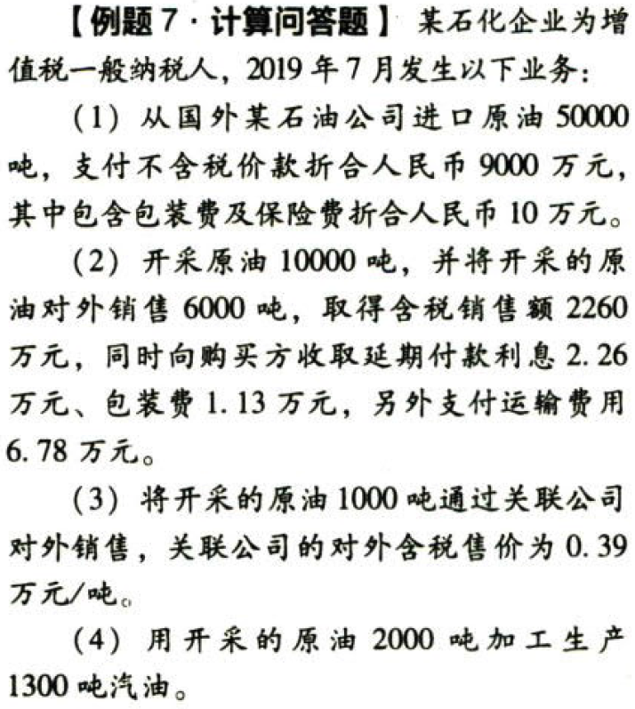

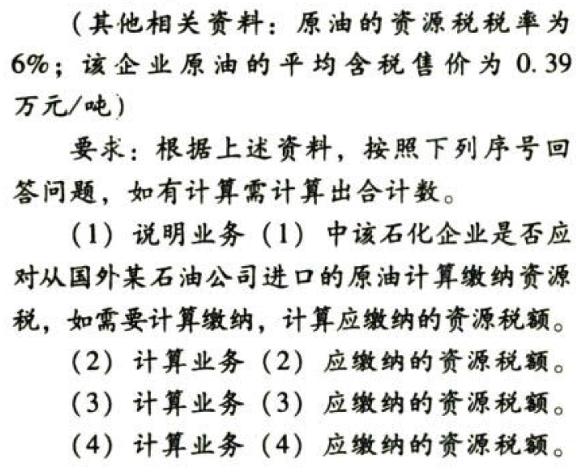

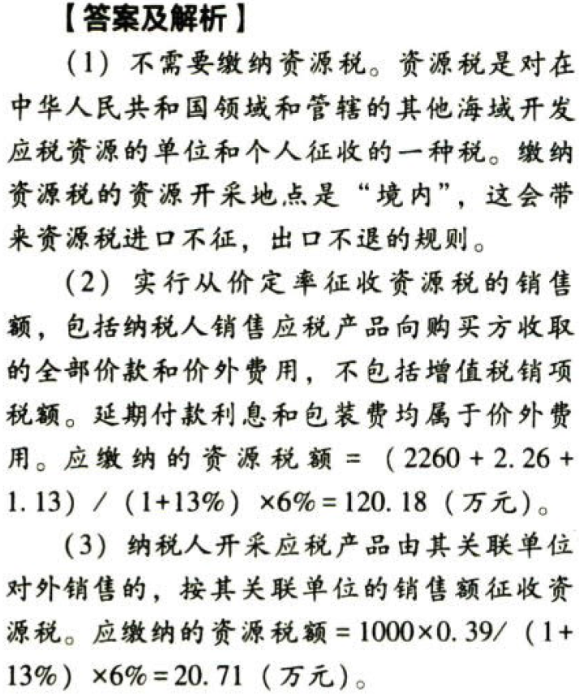

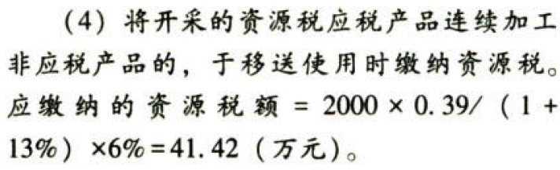

资源税应纳税额的计算关键是要确定从价计征的销售额和从量计征的课税数量。从以往考试出题情况看，往往把资源税应纳税额的计算与税收优惠混合在一起考核，所以考生在应纳税额计算过程中还要特别注意有无减征、免征规定。

资源税具有`单一环节一次课征`的特点，只在开采后出厂销售或移送自用环节纳税，其他批发、零售环节不再纳税。

凡是需要同时计算资源税和增值税的矿产品，在计算增值税时，2019年4月1日起，大多适用`13%的基本税率`，但是`天然气适用9%的低税率`。

在计算所得税税前扣除金额时，由于资源税是价内税，记入税金及附加科目，在计算企业所得税应纳税所得额时可以扣除。而增值税是价外税，实际缴纳的增值税不在企业所得税前可扣除税金的范围之内。

## 4.7. 从量定额应纳税额的计算

```
应纳税额＝课税数量×适用的单位税额
```
## 4.8. 煤炭资源税的计算方法

```
原煤应纳税额＝原煤销售额×适用税率
洗选煤应纳税额＝洗选煤销售额×折算率×适用税率
```
教材中关于煤炭资源税的计税方法仍沿用的是资源税法实施前的规则，这些计算方法在则年8月31日前都是有效的，9月之后是否有变化，教材上市时还没有明确政策。本部分的内容按照教材体现。

### 4.8.7. 原煤的计税依据及税额计算

纳税人开采原煤直接对外销售的，以原煤销售额作为应税煤炭销售额计算缴纳资源税。原煤销售额中不包含从坑口到车站、码头或购买方指定地点的运输费用、建设基金以及随运销产生的装卸、仓储、港杂等费用（与煤价分别核算并取得相应凭据）。

纳税人将其开采的原煤，自用于连续生产洗选煤的，在原煤移送使用环节不缴纳资源税；自用于其他方面的，视同销售原煤，计算缴纳资源税。

### 4.8.8. 洗选煤折算率计算公式

（1）纳税人将其开采的原煤加工为洗选煤销售的，以洗选煤销售额乘以折算率作为应税煤炭销售额计算缴纳资源税。洗选煤销售额中包括洗选副产品的销售额，但不包含从洗选煤厂到车站、码头或购买方指定地点的运输费用、建设基金以及随运销产生的装部、仓储、港杂等费用（与煤价分别核算并取得相应凭据）。

洗选煤折算率可通过洗选煤销售额扣除洗选环节成本、利润计算，也可通过洗选煤市场价格与其所用同类原煤市场价格的差额及综合回收率计算。

折算率由省、自治区、直辖市财税部门或其授权地市级财税部门确定。

洗选煤折算率计算公式一如下：

```
洗选煤折算率＝(洗选煤平均销售额－洗选环节平均成本－洗选环节平均利润)/洗选煤平均销售额×100%
```
洗选煤平均销售额、洗选环节平均成本、洗选环节平均利润可按照上年当地行业平均水平测算确定。

洗选煤折算率计算公式二如下：

```
折算率＝(原煤平均销售额/洗选煤平均销售额×综合回收率)×100%
综合回收率＝洗选煤数量/入洗前原煤数量×100%
```
原煤平均销售额、洗选煤平均销售额可按照上年当地行业平均水平测算确定。

（2）纳税人同时销售（包括视同销售）应税原煤和洗选煤的，应当分别核算原煤和洗选煤的销售额；未分别核算或者不能准确提供原煤和洗选煤销售额的，一并视同销售。

原煤与洗选煤的计税依据存在差异。

```
洗选煤的计税依据＝洗选煤销售额×折算率
```
煤炭资源税从价定率计税的销售额，与增值税计税的销售额存在不一致。不一致主要体现在计算资源税时，自采未税原煤加工洗选煤的销售额需要用规定的折算率进行折算，增值税则不需要折算。

### 4.8.9. 视同销售

纳税人将其开采的原煤自用于连续生产洗选煤的，在原煤移送使用环节不缴纳资源税；自用于其他方面的，视同销售原煤。

纳税人将其开采的原煤加工为洗选煤自用的，视同销售洗选煤。

### 4.8.10. 销售额的扣减

纳税人将自采原煤与外购原煤（包括煤肝石）进行混合后销售的，应当准确核算外购原煤的数量、单价及运费，在确认计税依据时可以扣减外购相应原煤的购进金额。

```
计税依据＝当期混合原煤销售额－当期用于混售的外购原煤的购进金额
外购原煤的购进金额＝外购原煤的购进数量×单价
```
纳税人将自采原煤连续加工的洗选煤与外购洗选煤进行混合后销售的，比照上述有关规定计算缴纳资源税。

纳税人以自采原煤和外购原煤混合加工洗选煤的，应当准确核算外购原煤的数量、单价及运费，在确认计税依据时可以扣减外购相应原煤的购进金额。

```
计税依据＝当期洗选煤销售额×折算率－当期用于混洗混售的外购原煤的购进金额
外购原煤的购进金额＝外购原煤的购进数量×单价
```
纳税人核算并扣减当期外购已税产品购进金额，应依据外购已税产品的增值税发票、海关进口增值税专用缴款书或者其他合法有效凭据。

# 5. 减税、免税项目:star: :star: 

## 5.9. 法定减免

### 5.9.11. 原油、天然气优惠政策

免税：开采原油以及在油田范围内运输原油过程中用于加热的原油、天然气。

减税：

（1）从`低丰度`油气田开采的原油、天然气，减征20%资源税

（2）`高`含硫天然气、`三`次采油和从`深`水油气田开采的原油、天然气，减征30%资源税

（3）`高`凝油、`稠`油减征40%资源税

（4）自2018年4月1日至2021年3月31日，对页岩气资源税（按6%的规定税率）减征30%

为便于征管，对开采稠油、高凝油、高含硫天然气、低丰度油气资游、及三次采油的陆上油气田企业，根据以前年度符合上述减税规定的原油、天然气销售额占其原油、天然气总销售额的比例，确定资源税综合减征率和实际征收率，计算资源税应纳税额。计算公式为：

```
综合减征率＝∑（减税项目销售额×减征幅度×6%）÷总销售额
实际征收率＝6%－综合减征率
应纳税额＝总销售额×实际征收率
```
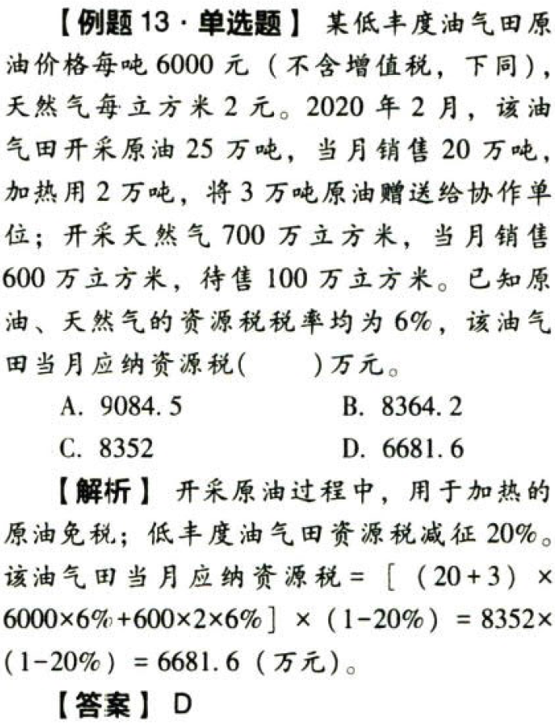

### 5.9.12. 除原油、天然气外应税资源优惠政策

（1）煤炭开采企业因安全生产需要抽采的`煤成（层）气`免征资源税；

（2）从`衰竭期`矿山开采的矿产品，减征`30%`资源税。

## 5.10. 国务院规定

根据国民经济和社会发展需要，`国务院`对有利于促进资惊节约集约利用、保护环境等情形可以`规定`免征或者减征资源税，报全国人民代表大会常务委员会`备案`。

## 5.11. 省级决定

有下列情形之一的，`省`、自治区、直辖市可以决定免征或者减征资源税：

（1）纳税人开采或者生产应税产品过程中，因意外事故或者自然灾害等原因遭受`重大损失`；

（2）纳税人开采`共伴生矿、低品位矿、尾矿`。

前款规定的免征或者减征资源税的具体办法，由`省`、自治区、直辖市人民政府`提出`，报同级人民代表大会常务委员会`决定`，并报全国人民代表大会常务委员会和国务院`备案`。

# 6. 征收管理

## 6.12. 纳税义务发生时间:star: 

纳税人销售应税产品，纳税义务发生时间为收迄销售款或者取得索取销售款凭据的当日；自用应税产品的，纳税义务发生时间为移送应税产品的当日。

资源税纳税义务发生时间的规定与`增值税`、`消费税`规定大致相同，其中一处不同在于资源税进口不征，所以没有进口环节纳税义务发生时间的规定。

## 6.13. 纳税期限

资源税`按月`或者`按季`申报缴纳；不能按固定期限计算缴纳的，可以`按次`申报缴纳。

纳税人按月或者按季申报缴纳的，应当自月度或者季度终了之日起`15日`内，向税务机关办理纳税申报并缴纳税款。

## 6.14. 纳税环节和纳税地点:star: :star: 

### 6.14.13. 资源税纳税环节（教材收录的是资源税法实施前的规定）

| 纳税人行为                           | 纳税环节                 |
|--------------------------------------|--------------------------|
| 开采应税产品销售或自用               | 销售或自用环节           |
| 以自采原矿加工精矿产品               | 精矿销售或自用时         |
| 以自采原矿加工金锭                   | 金锭销售或自用时         |
| 销售自采原矿及其加工的金精矿、粗金   | 销售时                   |
| 以应税产品投资分配抵债赠与以物易物等 | 视同销售，在所有权转移时 |

### 6.14.14. 资源税的纳税地点

纳税人应当向应税产品的`开采地`或`生产地`缴纳资源税。

# 7. 水资源税改革试点实施办法:star: 

为全面贯彻落实党的十九大精神，推进资源全面节约和循环利用，推动形成绿色发展方式和生活方式，财政部、税务总局、水利部2017年11月24日发布`《扩大水资源税改革试点实施办法》`（以下简称《试点实施办法》），自2017年12月1日起，北京、天津、山西、山东、河南、四川、陕西、宁夏、内蒙古9个省区市纳入水资源税改革试点，由征收水资源费改为征收水资源税。

## 7.15. 纳税义务人

除规定情形外，水资源税的纳税人为`直接取用地表水、地下水`的单位和个人，包括直接从江、河、湖泊（含水库）和地下取用水资源的单位和个人。

## 7.16. 税率

除中央直属和跨省（区、市）水力发电取用水外，由试点省份省级人民政府统筹考虑本地区水资源状况、经济社会发展水平和水资源节约保护要求，在《试点实施办法》所附《试点省份水资源税最低平均税额表》规定的最低平均税额基础上，分类确定具体适用税额。

为发挥水资源税调控作用，按不同取用水性质实行差别税额：

（1）`地下水`税额要高于`地表水`。

（2）`超采区`地下水税额要高于`非超采区`，`严重超采地区`的地下水税额要`大幅高于`非超采地区。

（3）对超计划或超定额用水`加征1～3倍`，对`特种行业从高`征税，对超过规定限额的`农业`生产取用水、`农村`生活集中式饮水工程取用水`从低`征税。

## 7.17. 应纳税额的计算

水资源税实行`从量计征`。对一般取用水按照实际`取用水量`征税，对采矿和工程建设疏干排水按照`排水量`征税；对水力发电和火力发电贯流式（不含循环式）冷却取用水按照实际`发电量`征税。

疏干排水是指在采矿和工程建设过程中破坏地下水层、发生地下涌水的活动。

火力发电贯流式冷却取用水，是指火力发电企业从江河、湖泊（含水库）等水源取水，并对机组冷却后将水直接排入水源的取用水方式。火力发电循环式冷却取用水，是指火力发电企业从江河、湖泊（含水库）、地下等水源取水并引入自建冷却水塔，对机组冷却后返回冷却水塔循环利用的取用水方式。

## 7.18. 税收减免

下列情形，予以免征或者减征水资源税：

（1）规定限额内的`农业`生产取用水，免征水资源税。

（2）取用`污水处理`再生水，免征水资源税。

（3）除接入城镇公共供水管网以外，`军队`、`武警`部队通过其他方式取用水的，免征水资源税。

（4）抽水`蓄能发电`取用水，免征水资源税。

（5）`采油`排水经分离净化后在封闭管道`回注`的，免征水资源税。

（6）财政部、税务总局规定的其他免征或者减征水资源税情形。

下列情形，不缴纳水资源税：

（1）`农村`集体经济组织及其成员从本集体经济组织的`水塘`、`水库`中取用水的。

（2）`家庭`生活和零星散养、圈养畜禽饮用等少量取用水的。

（3）水利工程管理单位为`配置`或者`调度`水资源取水的。

（4）为保障矿并等地下工程`施工安全`和`生产安全`必须进行`临时应急`取用（排）水的。

（5）为消除对`公共安全`或者`公共利益`的危害`临时应急`取水的。

（6）为`农业抗旱`和`维护生态与环境`必须`临时应急`取水的。

## 7.19. 征收管理

为加强税收征管、提高征管效率，《试点实施办法》确定了“税务征管、水利核量、自主申报、信息共享”的征管模式，即税务机关依法征收管理；水行政主管部门负责核定取用水量；纳税人依法办理纳税申报；税务机关与水行政主管部门建立涉税信息共享平台和工作配合机制，定期交换征税和取用水信息资料。

水资源税的纳税义务发生时间为纳税人取用水资源的当日。除农业生产取用水外，水资源税`按季`或者`按月`征收，由主管税务机关根据实际情况确定。对超过规定限额的农业生产取用水水资源税可`按年`征收。不能按固定期限计算纳税的，可以`按次`申报纳税。纳税人应当自纳税期满或者纳税义务发生之日起`15日`内申报纳税。

水资源税由`生产经营所在地`的主管税务机关征收管理，跨省（区、市）调度的水资源调入区域所在地的税务机关征收水资源税。在试点省份内取用水，其纳税地点需要调整的，由省级财政、税务部门决定。

# 8. 总结

End。
