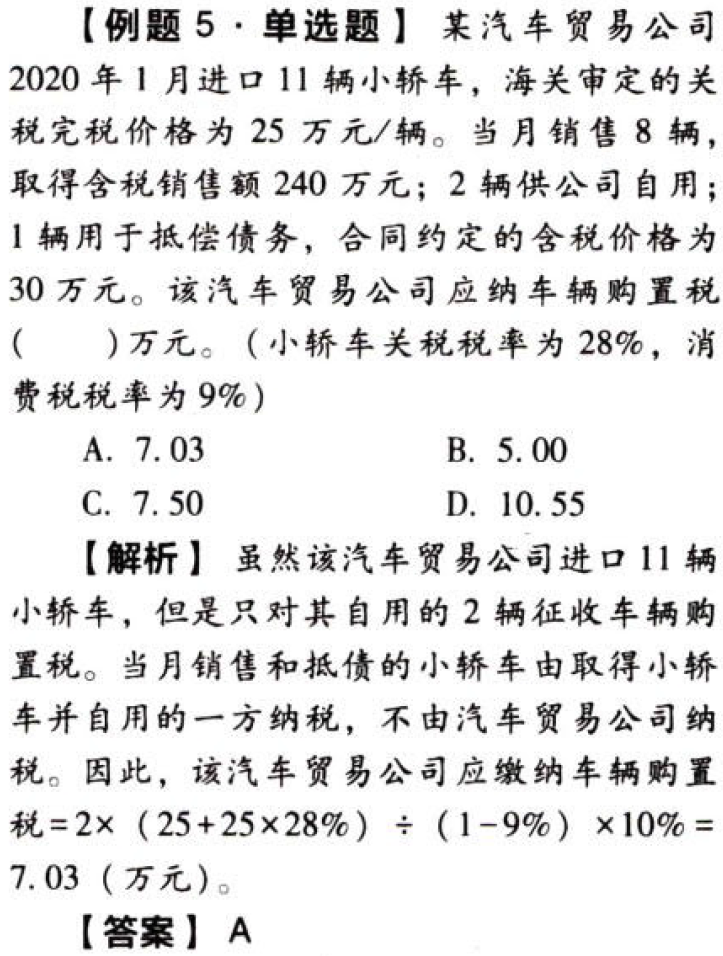
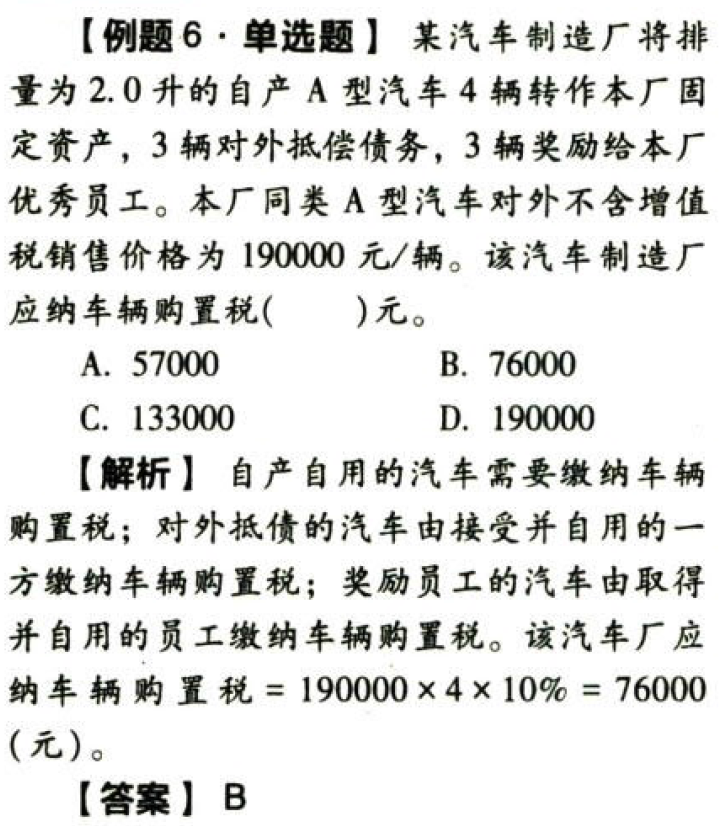
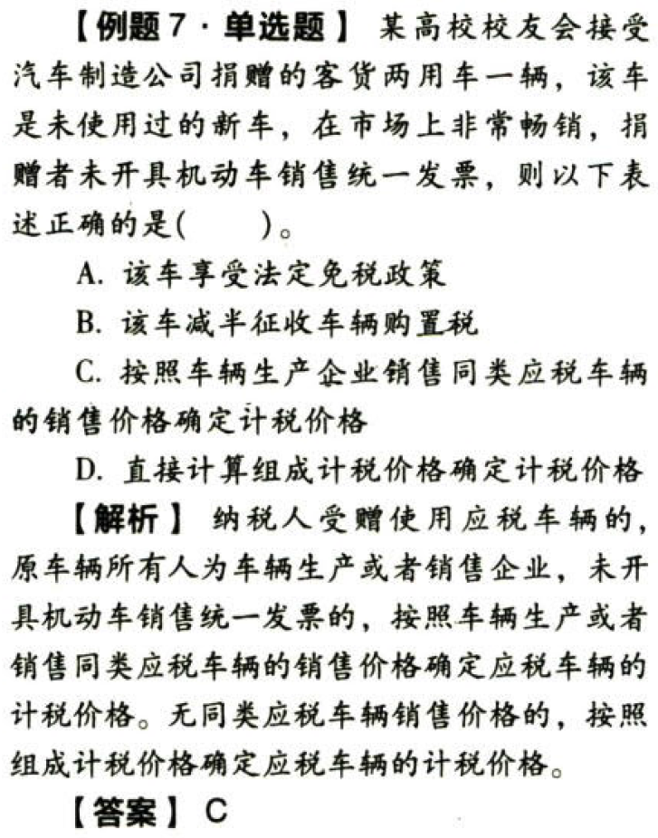

车辆购置税法

# 1. 纳税义务人与征税范围

## 1.1. 纳税义务人:star: :star: 

车辆购置税的纳税人是指在中华人民共和国境内购置汽车、汽车挂车、有轨电车、排气量超过150毫升的摩托车的单位和个人。其中购置是指以购买、进口、自产、受赠、获奖或者其他方式取得并`自用`应税车辆的行为。

已经办理免税、减税手续的车辆因转让、改变用途等原因不再属于免税、减税范围的，发生转让行为的，受让人为车辆购置税纳税人；未发生转让行为的，车辆所有人为车辆购置税纳税人。

## 1.2. 征税范围:star: :star: 

以列举的车辆为征税对象：汽车、汽车挂车、有轨电车、排气量超过150毫升的摩托车。

不属于应税范围的车辆：地铁、轻轨等城市轨道交通车辆，装载机、平地机、挖掘机、推土机等轮式专用机械车，以及起重机（吊车）、叉车、电动摩托车、排气量150毫升（含）以下的摩托车。

# 2. 税率与计税依据:star: :star: :star: 

我国车辆购置税实行统一比例税率（指一个税种只设计一个比例税率），`税率为10%`。

车辆购置税实行`从价定率`、`价外征收`的方法计算应纳税额，`应税车辆的价格即计税价格`就成为车辆购置税的计税依据。但是由于应税车辆的来源不同，计税价格的组成也就不一样，车辆购置税计税依据的构成也就不同。

## 2.3. （1）纳税人购买自用应税车辆

《车辆购置税法》实施后，纳税人购买自用应税车辆的计税价格，依据纳税人购买应税车辆时取得`发票上载明的价格`确定。如果题目给出的是含增值税价格，则：

```
计税价格＝实际支付给销售者的含增值税价款/(1＋增值税税率或征收率)
```
## 2.4. （2）纳税人进口自用应税车辆

```
组成计税价格＝关税完税价格＋关税＋消费税
＝(关税完税价格＋关税)/(1－消费税税率)
```
纳税人进口应税车辆自用的，自进口自用方纳税；如果进口车辆用于销售、抵债、以物易物等方面，不属于进口自用应税车辆的行为，不征收车辆购置税。

纳税人进口自用应税车辆，是指纳税人直接从境外进口或者委托代理，进口自用的应税车辆，不是指购买别的单位进口的车辆，即不包括在境内购买的进口车辆。在境内购买自用的进口车辆与进口自用车辆的计税依据是不同的。

## 2.5. （3）纳税人自产自用应税车辆

计税价格按照纳税人生产的同类应税车辆的销售价格确定，不包括增值税税款。同类应税车辆，即车辆配置序列号相同的车辆。

没有同类应税车辆销售价格的，按照组成计税价格确定：

```
组成计税价格＝成本×(1＋成本利润率)＋消费税
```
上述公式中的`成本利润率`，由国家税务总局各`省`、自治区、直辖市和计划单列市税务局`确定`。

## 2.6. （4）纳税人以受赠、获奖或其他方式取得自用应税车辆

纳税人以受赠、获奖或者其他方式取得自用应税车辆的计税价格，按照`购置应税车辆时`相关凭证载明的价格确定，不包增值税税款；无法提供相关凭证的，参照同类应税车辆市场平均交易价格确定其计税价格。

原车辆所有人为车辆生产或者销售企业，未开具机动车销售统一发票的，按照车辆生产或者销售同类应税车辆的销售价格确定应税车辆的计税价格。无同类应税车辆销售价格的，按照组成计税价格确定应税车辆的计税价销

纳税人申报的应税车辆计税价格`明显偏低`，又无正当理由的。由税务机关依照《中华人民共和国税收征收管理法》的规定`核定`其应纳税额。

# 3. 应纳税额的计算:star: :star: :star: 

## 3.7. 购买自用应税车辆应纳税额的计算

车辆装饰费是否缴纳车辆购置税？

按照2019年7月国家税务总局网站及12366的举例说明：小张买的小汽车，其实际销售价格为20万元（不含增值税），此外做装饰花了5万元，这5万元的装饰费不是车辆购置税计税价格的组成部分，不用缴纳车辆购置税。如果没有做装饰，45店将20万元的实际销售价格分解为车辆价格15万元、装饰费5万元，分别开具机动车销售统一发票和普通发票（或者不开发票），这5万元不是真正意义上的装饰费，而是实际销售价格的组成部分，应予缴税。这种分解应税车辆实际销售价格分别开票或者不开票的行为，是违反《中华人民共和国发票管理办法》的违法行为。

## 3.8. 进口自用应税车辆应纳税额的计算



## 3.9. 自产自用应税车辆应纳税额的计算



## 3.10. 其他自用应税车辆应纳税额的计算



# 4. 税收优惠:star: :star: 

（1）依照法律规定应当予以免税的外国驻华`使馆`、领事馆和国际组织驻华机构及其有关人员`自用车辆`免税

（2）`中国人民解放军`和`中国人民武装警察部队`列入`装备订货计划`的车辆免税

（3）悬挂`应急救援`专用号牌的国家综合性消防救援车辆免税

（4）设有固定装置的`非运输专用作业车辆`免税

（5）城市公交企业购置的`公共汽电车辆`免税

（6）根据国民经济和社会发展的需要，国务院规定并报全国人民代表大会常务委员会备案的其他免征车辆购置税的车辆：

-   回国服务的在外留学人员用`现汇`购买1辆个人`自用`国产小汽车

-   长期来华`定居专家`进口1辆自用小汽车

-   `防汛`部门和`森林消防`部门用于指挥、检查、调度、报汛（警）、联络的自指定厂家生产的设有固定装置的指定型号的车辆

-   “母亲健康快车”`项目`专用车辆

-   北京2022年`冬奥会`和`冬残奥会`组织委员会新购置车辆

-   `新能源汽车`

-   原`公安`现役部队和原`武警`黄金、森林、水电部队改制后换发地方机动车牌证的车辆（公安消防、武警森林部队执行灭火救撞任务的车辆除外）

（7）自2018年7月1日至2021年6月30日，对购置`挂车减半征收`车辆购置税

# 5. 征收管理:star: 

## 5.11. 纳税申报

车辆购置税实行`一车一申报`制度，但免税车辆转让或改变用途还需`重新申报`。例如：城市公交企业为新购置的公共汽电车辆办理免税手续后，因车辆转让、改变用途等导致免税条件消失的，纳税人应当到税务机关重新办理申报纳税手续（应纳税额不得为负数）

```
应纳税额＝初次办理纳税申报时确定的计税价格×(1－使用年限×10%)×10%－已纳税额
```
使用年限的计算方法是，自纳税人初次办理纳税申报之日起，至不再属于免税、减税范围的情形发生之日止。使用年限`取整`计算，不满一年的不计算在内

免征车辆购置税的新能源汽车，后续转让、交易时不再补缴车辆购置税

纳税人办理纳税申报时应当如实填报《车辆购货税纳税申报表》，同时提供车辆合格证明和车辆相关价格凭证

车辆合格证明为整车出厂合格证或者车辆电子信息单

车辆相关价格凭证，境内购置车辆为机动车销售统一发票或其他有效凭证，进口自用车辆为《海关进口关税专用缴款书》或者海关进出口货物征免税证明；属于应征消费税车辆的还包括《海关进口消费税专用缴款书》。提供这些凭证的目的是为了准确确定计税依据

## 5.12. 纳税环节

车辆购置税是对应税车辆的`购置使用`行为课征，征收环节单一，实行`一次课征`制度。征税环节为`使用环节`（最终消费环节）。具体而言，年辆购置税是在应税车辆`上牌登记注册前`的使用环节征收

## 5.13. 纳税地点

纳税人购置应税车辆，应当向`车辆登记地`的主管税务机关申报纳税；购置不需办理车辆登记的应税车辆，应当向`纳税人所在地`的主管税务机关申报纳税。车辆登记注册地是指车辆的上牌落籍地或落户地

## 5.14. 纳税期限

车辆购置税的纳税义务发生时间为纳税人`购置应税车辆的当日`。纳税人应当自纳税义务发生之日起`60日`内申报缴纳车辆购置税。具体而言：纳税人购买自用的应税车辆，自购买之日起`60日`内申报纳税；进口自用的应税车辆，应当自进口之日起`60日`内申报纳税；自产、受赠、获奖和以其他方式取得并自用的应税车辆，应当自取得之日起`60日`内申报纳税

纳税义务发生时间，按照下列情形确定：

（1）购买自用应税车辆的为购买之日，即车辆相关价格凭证的`开具`日期

（2）进口自用应税车辆的为进口之日，即《海关进口增值税专用缴款书》或者其他有效凭证的`开具`日期

（3）自产、受赠、获奖或者以其他方式取得并自用应税车辆的为`取得`之日，即合同、法律文书或者其他有效凭证的`生效`或者`开具`日期

## 5.15. 退税制度

已征车辆购置税的车辆退回车辆生产或销售企业，纳税人申请退还车辆购置税的，应退税额计算公式如下：

```
应退税额＝已纳税额×(1－使用年限×10%)（应退税额不得为负数）
```
使用年限的计算方法是，自纳税人缴纳税款之日起，至申请退税之日止

已缴纳车辆购置税的车辆，可能退税的情形：

（1）`退车`退税——车辆退回生产企业或者销售企业的

（2）`误征`退税——符合免税条件但已征税的

（3）其他原因退貌——其他依据法律法规规定应予追税的情形

# 6. 总结

End。
