C20企业内部控制审计

# 1. 内部控制审计的概念

根据《企业内部控制基本规范》（财会［2008］7号），企业内部控制的目标（五个目标）和要素（五个要素）如下图所示。同时，特别要求大家精准掌握内部控制目标和要素的具体内容以及在图中的“空间画面”。

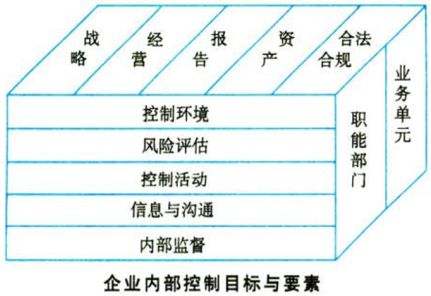

企业内部控制目标和要素（五目标、五要素）不同于审计准则中内部控制目标和要素（三目标、五要素，教材7.4），请严格区分并掌握各自内容。

## 1.1. ［考点一］内部控制的定义、目标及目标分类:star: :star: 

根据《企业内部控制基本规程》，内部控制定义、目标及目标分类，归纳如下表。

### 1.1.1. 内部控制定义

### 1.1.2. 内部控制目标

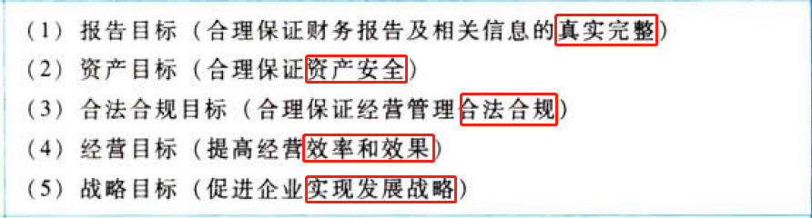

### 1.1.3. 财务报告内部控制（报告目标、资产目标相关的部分）

### 1.1.4. 非财务报告内部控制（与合法合规目标、经营目标和战略目标相关的部分）

## 1.2. ［考点二］内部控制审计的定义:star: :star: :star: 

### 1.2.5. 内部控制审计与整合审计

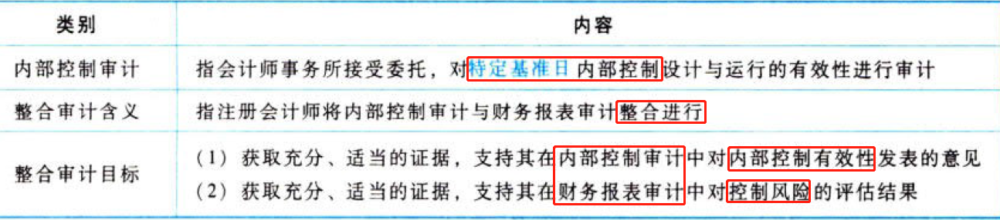

### 1.2.6. 内部控制审计与财务报表审计

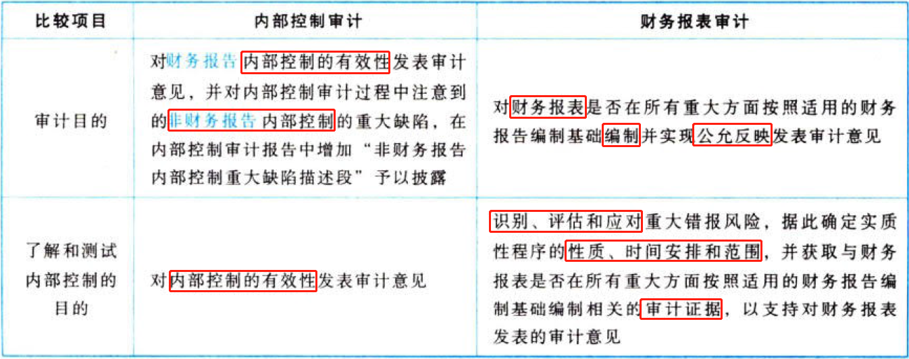

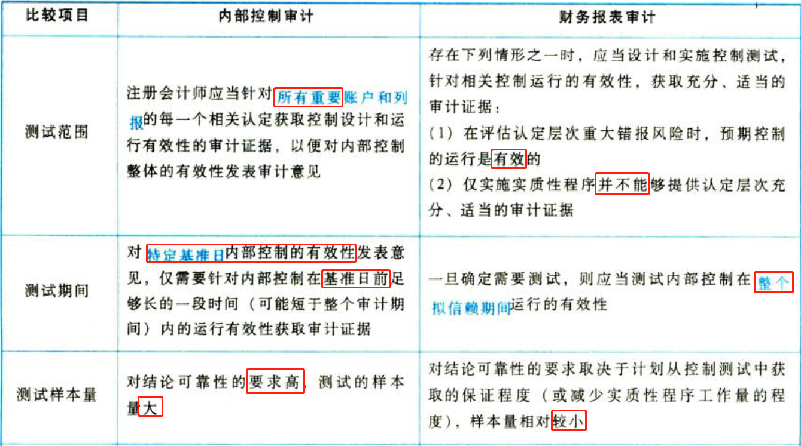

## 1.3. ［考点三］内部控制审计的范围:star: :star: :star: 

“内部控制审计的范围”和“审计意见涵盖的范罔”是完全不同的概念。内部控制审计的范围严格限定为财务报告内部控制审计。审计意见涵盖的范围针对的是特定基准日（时间范围）的财务报告内部控制（空间范围）设计与运行的有效性，言外之意，注册会计师不对非财务报告内部控制的有效性发表审计意见。但是，针对内部控制审计过程中注意到的非财务报告内部控制的重大缺陷，在内部控制审计报告中增加“非财务报告内部控制重大缺陷描述段”予以披露。

财务报告内部控制分为企业层面的内部控制和业务流程、应用系统或交易层面的内部控制，归纳如下表。

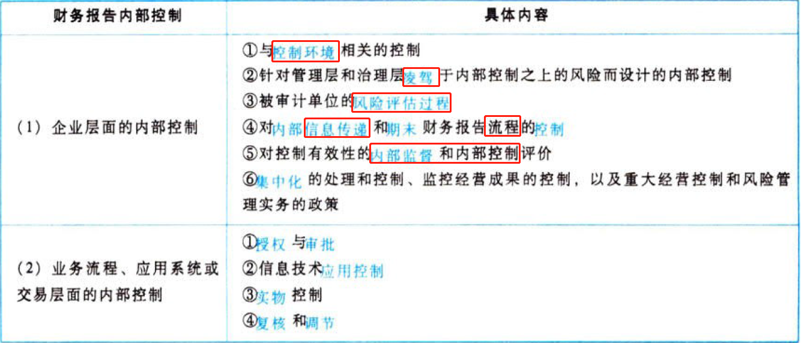

## 1.4. ［考点四］内部控制审计基准日:star: :star: :star: 

对内部控制审计基准日的理解请按照以下三个角度“层层递进”的分析和理解，归纳如下袭。

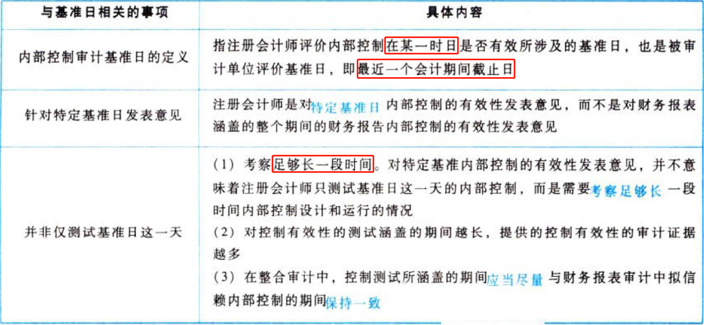

# 2. 计划审计工作

## 2.5. ［考点一］计划审计工作时应当考虑的事顶:star: :star: 

注册会计师在计划审计工作时应当评价的事项包括以下八个方面，归纳如下表。

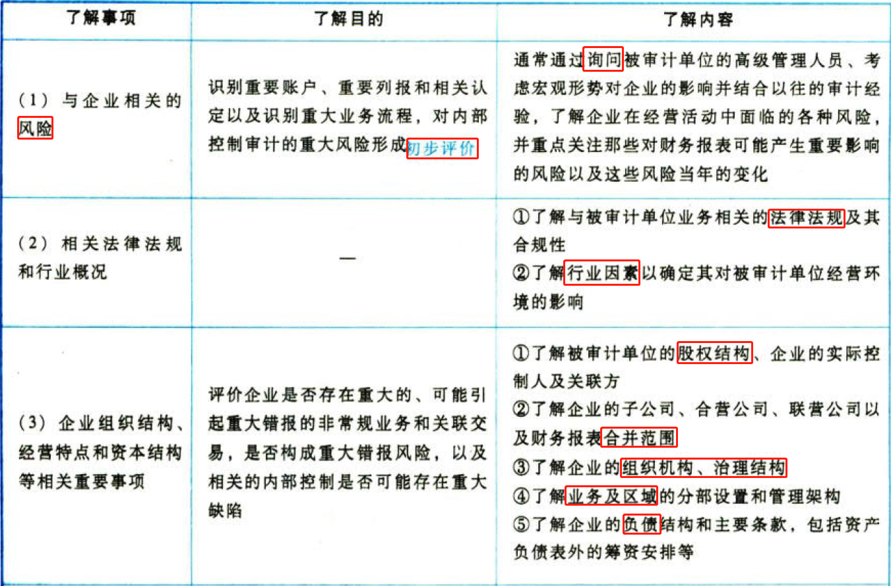

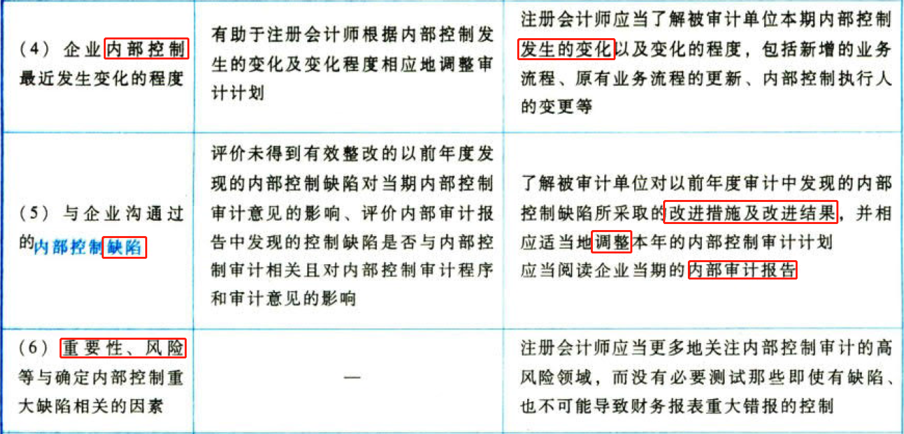

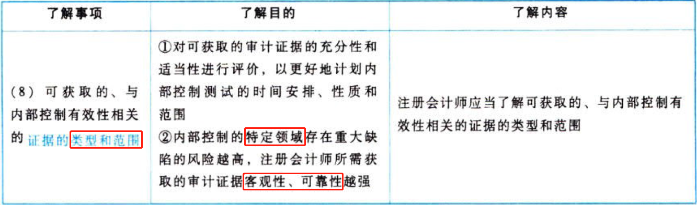

## 2.6. ［考点二］总体审计策略和具体审计计划:star: 

审计计划包括总体审计策略和具体审计计划两个层次，归纳如下表。

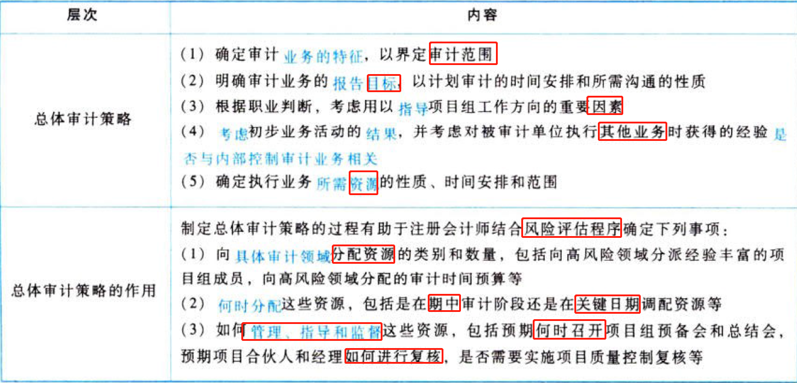

# 3. 自上而下的方法

## 3.7. ［考点一］自上而下的方法的步骤:star: :star: 

### 3.7.7. 工作思路

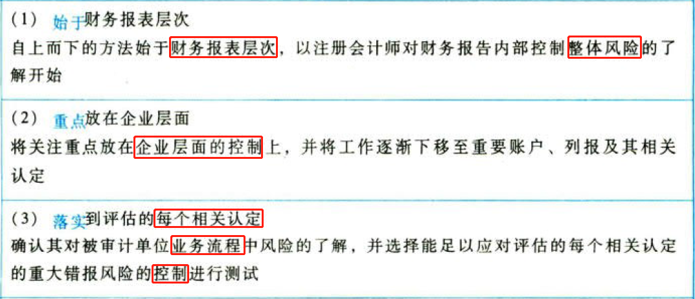

### 3.7.8. 工作步骤

## 3.8. ［考点二］识别、了解和测试企业层面控制:star: :star: 

### 3.8.9. 企业层面控制的内涵

（1）企业层面控制的含义。

企业层面的控制通常为应对企业财务报表整体层面的风险而设计，或作为其他控制运行的“基础设施”，通常在比业务流程更高的层面上乃至整个企业范围内运行，其作用比较广泛，通常不局限于某个具体认定。

（2）业务流程、应用系统或交易层面控制的特点。

业务流程、应用系统或交易层面的控制为应对交易和账户余额认定的重大错报风险而设计，通常在业务流程内的交易或账户余额层面上运行，其作用通常能够对应到具体某类交易和账户余额的具体认定。

### 3.8.10. 企业层面控制对其他控制及其测试的影响

（1）某些企业层面控制，例如某些与控制环境相关的控制，对重大错报是否能够被及时防止或发现的可能性有重要影响，虽然这种影响是间接的，但这些控制可能影响注册会计师拟测试的其他控制及其对其他控制所执行程序的性质、时间安排和范围。

（2）某些企业层面控制能够监督其他控制的有效性。管理层设计这些控制可能是为了识别其他控制可能出现的失效情况。但是，这些控制本身并非精确到足以及时防止或发现相关认定的重大错报。当这些控制运行有效时，注册会计师可以减少原本拟对其他控制的有效性进行的测试。

（3）某些企业层面控制本身能精确到足以及时防止或发现一个或多个相关认定中存在的重大错报。如果一项企业层面控制足以应对已评估的重大错报风险，注册会计师可能可以不必测试与该风险相关的其他控制。

一般而言，注册会计师可以分析某个控制是否有足够的精确度以及时防止或发现财务报表重大错报，并且考虑以下因素：

①内部控制对应的重要账户及列报的性质；

②对某些比较稳定或具备预期内在关系的账户，管理层实施的分析对发现财务报表重大错报具有足够的精确度；

③管理层分析的细化程度。

## 3.9. ［考点三］识别重要账户、列报及其相关认定:star: :star: :star: 

### 3.9.11. 重要账户或列报的含义

如果某账户或列报可能存在一个错报，该错报单独或连同其他错报将导致财务报表发生重大错报，则该账户或列报为重要账户或列报。

### 3.9.12. 评价重要账户或列报

#### 3.9.12.1. 评价角度

#### 3.9.12.2. 定量评价

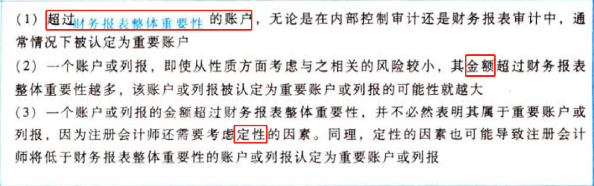

#### 3.9.12.3. 定性评价

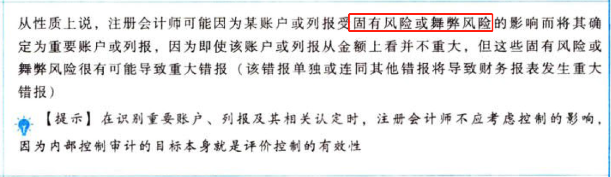

#### 3.9.12.4. 综合考虑所有可获得的信息

#### 3.9.12.5. 根据以前年度审计中了解的情况评价

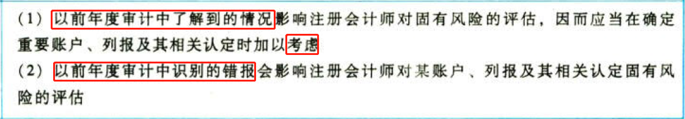

## 3.10. ［考点四］了解潜在错报的来源并识别相应的控制:star: :star: 

### 3.10.13. 了解潜在错报的来源

注册会计师应当实现下列目标，以进一步了解潜在错报的来源，并为选择拟测试的控制奠定基础：

（1）了解与相关认定有关的交易的处理流程，包括这些交易如何生成、批准、处理及记录；

（2）验证注册会计师识别出的业务流程中可能发生重大错报（包括由于舞弊导致的错报）的环节；

（3）识别被审计单位用于应对这些错报或潜在错报的控制；

（4）识别被审计单位用于及时防止或发现并纠正未经授权的、导致重大错报的资产取得、使用或处置的控制。

注册会计师应当亲自执行能够实现上述目标的程序，或对提供直接帮助的人员的工作进行督导。

### 3.10.14. 实施穿行测试

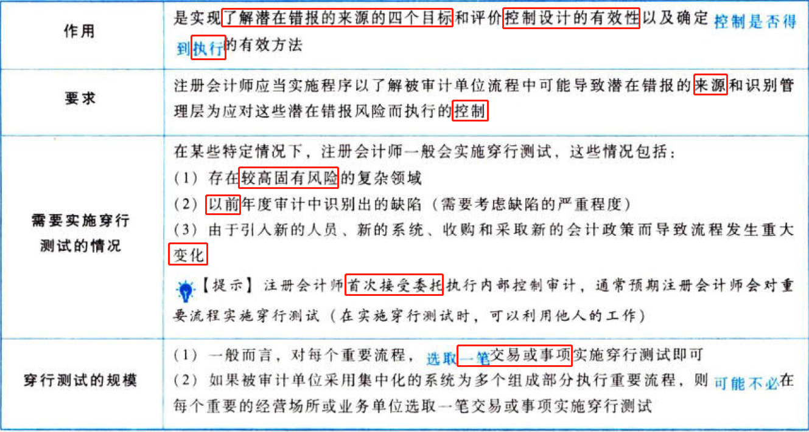

## 3.11. ［考点五］选择拟测试的控制:star: :star: :star: 

### 3.11.15. 选择拟测试控制的基本要求

（1）注册会计师应当针对每一相关认定获取控制有效性的审计证据，以便对内部控制整体的有效性发表意见，但没有责任对单项控制的有效性发表意见。

（2）注册会计师应当对被审计单位的控制是否足以应对评估的每个相关认定的错报风险形成结论。因此，注册会计师应当选择对形成这一评价结论具有重要影响的控制进行测试。

（3）对特定的相关认定而言，可能有多项控制用以应对评估的错报风险；反之，一项控制也可能应对评估的多项相关认定的错报风险。注册会计师没有必要测试与某项相关认定有关的所有控制。

（4）在确定是否测试某项控制时，注册会计师应当考虑该项控制单独或连同其他控制，是否足以应对评估的某项相关认定的错报风险，而不论该项控制的分类和名称如何。

### 3.11.16. 选择拟测试的控制的考虑因素

（1）选择关键控制测试。

注册会计师在选取拟测试的控制时，通常不会选取整个流程中的所有控制，而是选择关键控制，即能够为一个或多个重要账户或列报的一个或多个相关认定提供最有效果或最有效率的证据的控制。每个重要账户、认定和/或重大错报风险至少应当有一个对应的关键控制。

（2）可能不必测试所有流程、应用系统或交易的控制。

①在采用自上而下的方法执行内部控制审计时，如果识别并选取了能够充分应对重大错报风险的控制，则不需要再测试针对同样认定的其他控制。

②注册会计师在考虑是否有必要测试业务流程、应用系统或交易层面的控制之前，首先要考虑测试那些与重要账户的认定相关的企业层面控制的有效性。如果企业层面控制是有效的且得到精确执行，能够及时防止或发现并纠正影响一个或多个认定的重大错报，注册会计师可能不必就所有流程、交易或应用层面的控制的运行有效性获取审计证据。

（3）选择能够以最有效的方式予以测试的控制。

①注册会计师应当选择测试那些对形成内部控制审计意见有重大影响的控制。对于与所有重要账户和列报相关的所有相关认定，注册会计师都需要取得关于控制设计和运行是否有效的证据。

②如果存在多个控制均应对相关认定的重大错报风险，注册会计师通常会选择那个（些）能够以最有效的方式予以测试的控制。

（4）管理层执行内部控制自我评价时选择测试的控制可能多于注册会计师测试的控制。

①企业管理层在执行内部控制自我评价时选择测试的控制，可能多于注册会计师认为为了评价内部控制的有效性有必要测试的控制。

②管理层执行内部控制自我评价时选择测试控制的决定，不影响注册会计师的控制测试决策，注册会计师只需要测试那些对形成内部控制审计意见有重大影响的控制。

# 4. 测试控制的有效性

## 4.12. ［考点一］内部控制的有效性:star: 

### 4.12.17. 测试控制设计的有效性

注册会计师应当测试控制设计的有效性。如果某项控制由拥有有效执行控制所需的授权和专业胜任能力的人员按规定的程序和要求执行，能够实现控制目标，从而有效地防止或发现并纠正可能导致财务报表发生重大错报的错误或舞弊，则表明该项控制的设计是有效的。

### 4.12.18. 测试控制运行的有效性

注册会计师应当测试控制运行的有效性。如果某项控制正在按照设计运行、执行人员拥有有效执行控制所需的授权利专业胜任能力，能够实现控制目标，则表明该项控制的运行是有效的。

### 4.12.19. 获取控制运行有效性的审计证据

注册会计师获取的有关控制运行有效性的审计证据包括：

（1）控制在所审计期间的相关时点是如何运行的；

（2）控制是否得到一贯执行；

（3）控制由谁或以何种方式执行。

## 4.13. ［考点二］与控制相关的风险:star: 

### 4.13.20. 与控制相关的风险的内涵

与控制相关的风险包括一项控制可能无效的风险，以及如果该控制无效，可能导致重大缺陷的风险。与控制相关的风险越高，注册会计师需要获取的审计证据就越多。

### 4.13.21. 与某项控制相关的风险的影响因素

（1）该项控制拟防止或发现并纠正的错报的性质和重要程度；

（2）相关账户、列报及其认定的固有风险；

（3）交易的数量和性质是否发生变化，进而可能对该项控制设计或运行的有效性产生不利影响；

（4）相关账户或列报是否曾经出现错报；

（5）企业层面控制（特别是监督其他控制的控制）的有效性；

（6）该项控制的性质及其执行频率；

（7）该项控制对其他控制（如控制环境或信息技术一般控制）有效性的依赖程度；

（8）执行该项控制或监督该项控制执行的人员的专业胜任能力，以及其中的关键人员是否发生变化；

（9）该项控制是人工控制还是自动化控制；

（10）该项控制的复杂程度，以及在运行过程中依赖判断的程度。

### 4.13.22. 在连续审计中，还包括的影响与控制相关的风险的因素

（1）以前审计所执行的审计程序的性质、时间安排和范围；

（2）以前审计控制测试的结果；

（3）自上次审计以来控制或流程是否发生变化。

## 4.14. ［考点三］测试控制有效性的程序的性质:star: 

注册会计师测试控制有效性的程序包括以下四种，归纳如下表。

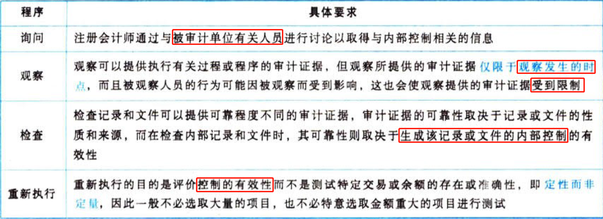

## 4.15. ［考点四］控制测试的时间安排:star: :star: :star: 

### 4.15.23. 总体要求

（1）对控制有效性的测试涵盖的期间越长，提供的控制有效性的审计证据越多。

（2）对于内部控制审计业务，注册会计师应当获取内部控制在基准日之前一段足够长的期间内有效运行的审计证据。

（3）在整合审计中，注册会计师控制测试所涵盖的期间内尽量与财务报表审计中拟信赖内部控制的期间保持一致。对控制有效性测试的实施时间越接近基准日，提供的控制有效性的审计证据越有力。

### 4.15.24. 确定测试时间

（1）为了获取充分、适当的审计证据，注册会计师应当在下列两个因素之间作出平衡，以确定测试的时间：

①尽量在接近基准日实施测试；

②实施的测试需要涵盖足够长的期间。

（2）整合审计中的测试时间。

在整合审计中测试控制在整个会计年度的运行有效性时，注册会计师可以进行期中测试，然后对剩余期间实施前推测试，或将样本分成两部分，一部分在期中测试，剩余部分在临近年来的期间测试。

### 4.15.25. 控制相关的风险影响控制测试的时间选择

（1）可以实施期中测试的情形。

与所测试的控制相关的风险越低，注册会计师需要对该控制获取的审计证据就越少，可能对该控制实施期中测试就可以为其运行有效性提供充分、适当的审计证据。

（2）应当选择更接近基准日的测试时间。

如果与所测试的控制相关的风险越高，需要在取的证据就越多，注册会计师应当取得一部分更接近基准日的证据。

### 4.15.26. 是否需要测试被取代的控制

（1）不再需要测试被取代的控制。

如果注册会计师认为新的控制能够满足控制的相关目标，而且新控制已运行足够长的时间，足以使注册会计师通过实施控制测试评价其设计和运行的有效性，则注册会计师不再需要测试被取代的控制的设计和运行有效性。

（2）适当地测试被取代的控制。

如果被取代的控制的运行有效性对注册会计师执行财务报表审计时的控制风险评估具有重要影响，注册会计师应当适当地测试这些披取代的控制的设计和运行的有效性。

### 4.15.27. 证实剩余期间控制的运行情况

（1）总体要求。

如果巳获取有关控制在期中运行有效性的审计证据，注册会计师应当确定还需要获取哪些补充审计证据，以证实剩余期间控制的运行情况。

（2）所需补充审计证据的影响因素。

在将期中测试结果前推至基准日时，注册会计师应当考虑下列因素以确定需获取的补充审计证据：

①基准日之前测试的特定控制，包括与控制相关的风险、控制的性质和测试的结果；

②期中获取的有关审计证据的充分性和适当性；

③剩余期间的长短；

④期中测试之后，内部控制发生重大变化的可能性；

⑤注册会计师基于对控制的依赖程度拟减少进一步实质性程序的程度（仅适用于整合审计）；

⑥控制环境。

### 4.15.28. 自动化控制

（1）是否需要对自动化控制实施前推测试。

自动化控制一旦被证明其运行有效，通常不会发生运行故障或质量下降的情况，前提是存在适当且持续有效的信息技术一般控制。

①如果信息技术一般控制有效且关键的自动化控制未发生任何变化，注册会计师队不需要对该自动化控制实施前推测试。

②如果注册会计师在期中对重要的信息技术一般控制实施了测试，则通常还需要对其实施前推程序。

（2）需要在接近基准日的期间测试。

①如果注册会计师认为一个或一个以上重要的倩息技术一般控制无效，注册会计师需要评估其对总体信息技术环境以及对任何依赖这些信息技术一般控制的自动化控制的持续有效性的影响。

②如果重要的信息技术一般控制无效，且无法获得其他替代证据以证实关键的自动化控制自其上次被测试后未发生变化，注册会计师在执行内部控制审计时，通常就需要获取有关该自动化控制在接近基准日的期间内是否有效运行的证据。

## 4.16. ［考点五］控制测试的范围:star: :star: 

### 4.16.29. 总体要求

（1）注册会计师在测试控制的运行有效性时，应当在考虑与控制相关的风险的基础上，确定测试的范围（样本规模）。

（2）注册会计师确定的测试范围，应当足以使其能够在取充分、适当的审计证据，为基准日内部控制是否不存在重大缺陷提供合理保证。

### 4.16.30. 测试人工控制的最小样本规模

在测试人工控制时，如果采用检查或重新执行程序，注册会计师测试的最小样本规模区间参见下表。

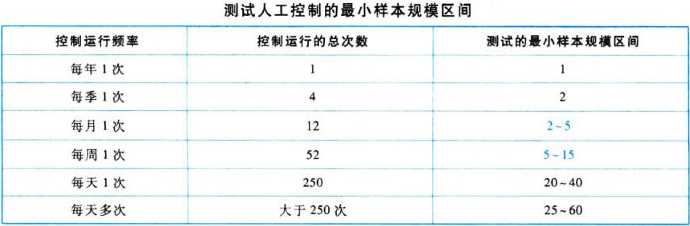

在运用上表时，注册会计师应当注意下列事项：

（1）测试的最小样本规模是指所需测试的控制运行次数；

（2）注册会计师应当根据与控制相关的风险，基于最小样本规模区间确定具体的样本规模；

（3）上表假设控制的运行偏差率预期为零。如果预期偏差率不为零，注册会计师应当扩大样本规模；

（4）如果注册会计师不能确定控制运行的频率，但是知道控制运行的总次数，仍可根据“控制运行的总次数”一列确定测试的最小样本规模。

### 4.16.31. 对自动化控制的考虑

除非系统（包括系统使用的表格、文档或其他永久性数据）发生变动，注册会计师通常不需要增加自动化控制的测试范围。

### 4.16.32. 发现偏差时的处理

（1）发现控制偏差的考虑。

如果发现控制偏差，注册会计师应当确定对下列事项的影响：

①与所测试控制相关的风险的评估；

②需要获取的审计证据；

③控制运行有效性的结论。

（2）考虑偏差的性质。

如果发现的控制偏差是系统性偏差或人为有意造成的偏差，注册会计师应当考虑舞弊的可能迹象以及对审计方案的影响。

（3）考虑偏差是否构成控制缺陷时涉及的因素。

在评价控制测试中所发现的某项控制偏差是否为控制缺陷时，注册会计师可以考虑的因素包括：

①该偏差是如何被发现的。例如，如果某控制偏差是被另外一项控制所发现的，则可能意味着被审计单位存在有效的检查性控制。

②该偏差是与某一特定的地点、流程或应用系统相关，还是对被审计单位有广泛影响。

③就被审计单位的内部政策而言，该控制出现偏差的严重程度。例如，某项控制在执行上晚于被审计单位政策要求的时间，但仍在编制财务报表之前得以执行，还是该项控制根本没有得以执行。

④与控制运行频率相比，偏差发生的频率大小。

（4）针对发现的偏差的应对措施。

①由于有效的内部控制不能为实现控制目标提供绝对保证，单项控制并非一定要毫无偏差地运行，才被认为有效。

②如果发现控制偏差，注册会计师应当考虑偏差的原因及性质，并考虑采用扩大样本规模等适当的应对措施以判断该偏差是否对总体不具有代表性。

例如，对每日发生多次的控制，如果初始样本规模为25个，当测试发现一项控制偏差，且该偏差不是系统性偏差时，注册会计师可以扩大样本规模进行测试。如果测试后再次发现偏差，则注册会计师可以得出该控制无效的结论。如果扩大样本规模没有再次发现偏差，则注册会计师可以得出控制有效的结论。

# 5. 企业层面控制的测试

## 5.17. ［考点一］与控制环境相关的控制:star: 

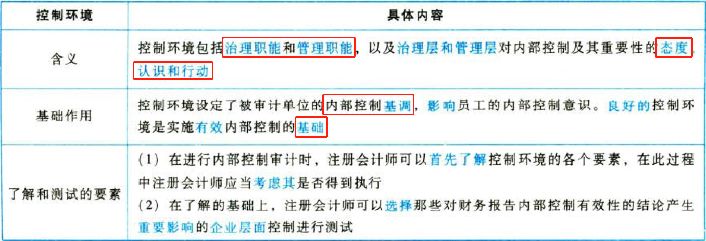

## 5.18. ［考点二］针对凌驾风险而设计的控制:star: 

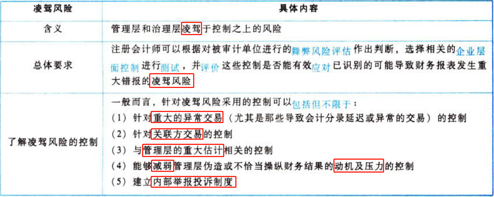

## 5.19. ［考点三］被审计单位的风险评估过程:star: 

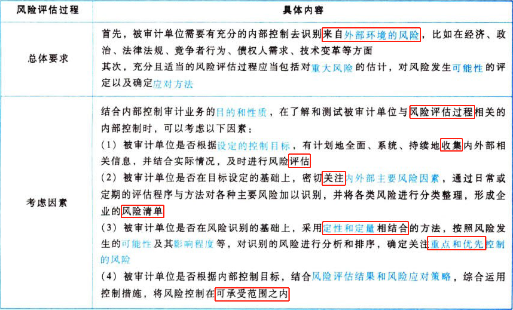

## 5.20. ［考点四］期末财务报告流程的控制:star: 

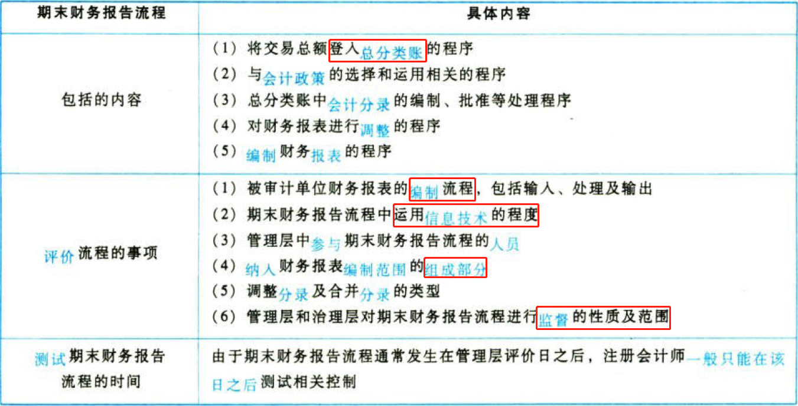

## 5.21. ［考点五］对控制的监督和内部控制评价:star: 

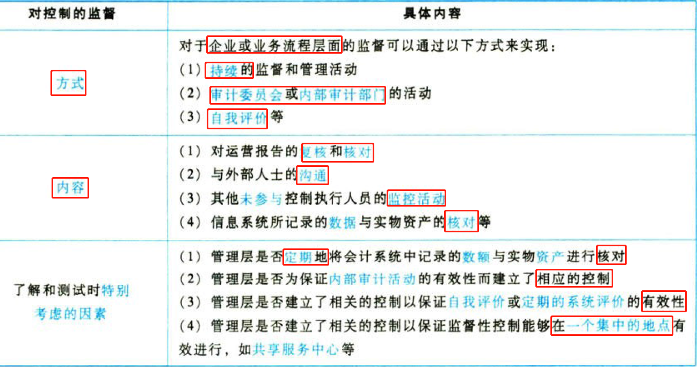

## 5.22. ［考点六］集中化的处理和控制（包捂其事的服务环摘）:star: 

### 5.22.33. 集中化的处理

（1）集中化的处理可以改进控制环境。

集中化的处理可以视作一种企业内部的“外包”安排，以取得规模效益并通过将某些或全部的财务报告过程与负责经营的管理层分离以改进控制环境。

（2）集中化的处理可能有助于降低财务报表错报的风险。

由于采用集中化管理可以降低各个下属单位或分部负责人对该单位或分部财务报表的影响，并且可能会使财务报表相关的内部控制更为有效，所以集中化的财务管理可能有助于降低财务报表错报的风险。

### 5.22.34. 共享服务中心

共享服务中心是集中化的处理和控制的一种表现形式，例如，被审计单位可能会设立共享服务中心，并向被审计单位内部的其他下属单位或分部提供日常的会计处理及财务报表编制服务。

### 5.22.35. 对共享服务中心执行审计程序

（1）了解服务对象以及服务范围。

注册会计师在对共享服务中心执行审计程序时，可以先了解共享服务中心的服务对象以及服务范围，并分析其服务对象的重大财务报表错报风险。

（2）降低错报风险。

针对服务对象的重大财务报表错报风险，注册会计师可以分析被审计单位是否有相关的内部控制用以降低其下属单位或分部财务报表发生重大错报的风险。

（3）测试特定服务对象的控制。

一般而言，特定服务对象单位与财务报表相关的风险越大，注册会计师在进行内控测试过程中可能更需要到共享服务中心或其服务对象单位测试与特应服务对象单位相关的内部控制。

（4）测试共享服务中心的内部控制的时间。

由于共享服务中心的内部控制的影响较大，注册会计师可以考虑在内部控制审计工作初期就开始分析其内部控制的性质、对被审计单位的影响等，并且考虑在较早的阶段执行对共享服务中心内部控制的有效性测试，以确定其对进一步审计程序性质、时间安排以及范围的影响。

（5）关注共享服务中心信息技术系统。

一般而言，在对共享服务中心的内部控制进行了解或测试时，注册会计师还可以关注共享服务中心与财务报表相关的信息技术系统，特别是系统的复杂程度、使用的软件等因素，以选择合适的内部控制进行测试，其中包括集中处理环境下的信息技术一般控制是否有效。

# 6. 业务流程、应用系统、交易层面的控制的测试

## 6.23. ［考点］识别和了解相关控制:star: :star: 

注册会计师识别和了解的相关控制包括预防性控制和检查性控制。

### 6.23.36. 预防性控制

### 6.23.37. 检查性控制

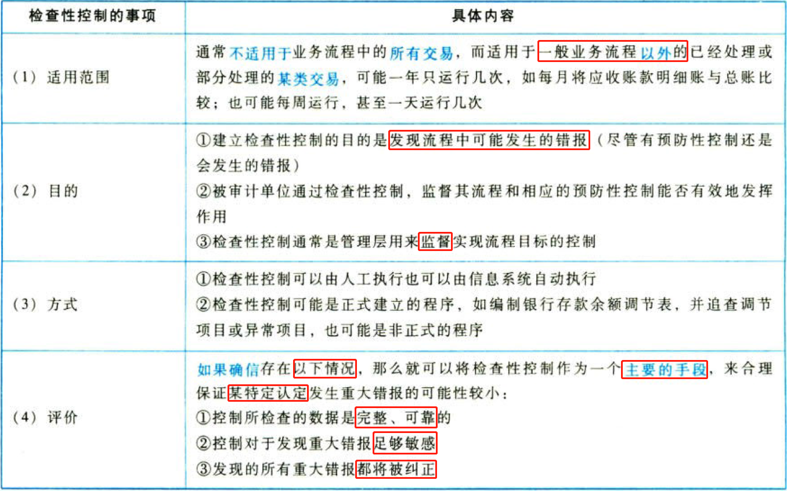

# 7. 信息系统控制的测试

## 7.24. ［考点一］信息技术一般控制测试:star: 

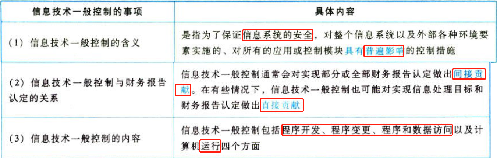

## 7.25. ［考点二］信息技术应用控制测试:star: 

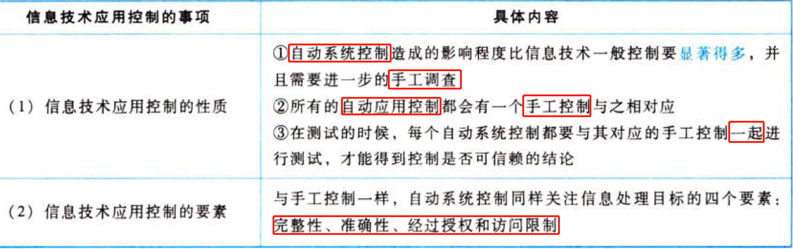

# 8. 内部控制缺陷评价

## 8.26. ［考点一］控制缺陷的分类:star: 

### 8.26.38. 内部控制缺陷按其成因分类

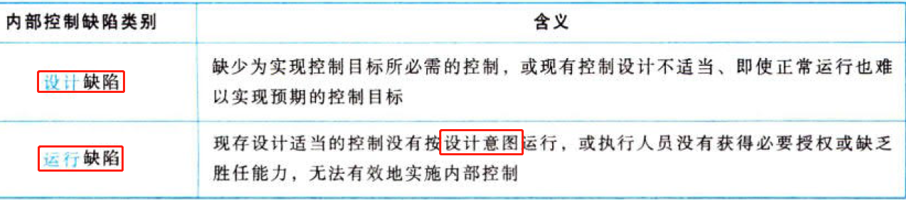

### 8.26.39. 内部控制缺陷按其严重程度分类

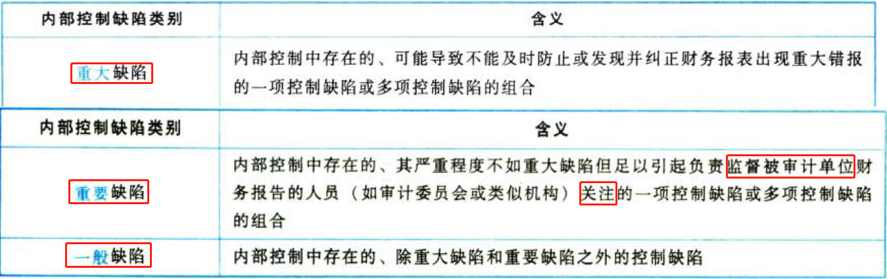

## 8.27. ［考点二］评价控制缺陷的严重程度:star: :star: 

评价控制缺陷的严重程度时应当考虑的影响因素、评价控制缺陷是否可能导致账户或列报发生错报考虑的风险因素、影响控制缺陷导致潜在错报的金额大小的因素、控制缺陷组合是否构成重大缺陷以及评价补偿性控制，归纳如下表。

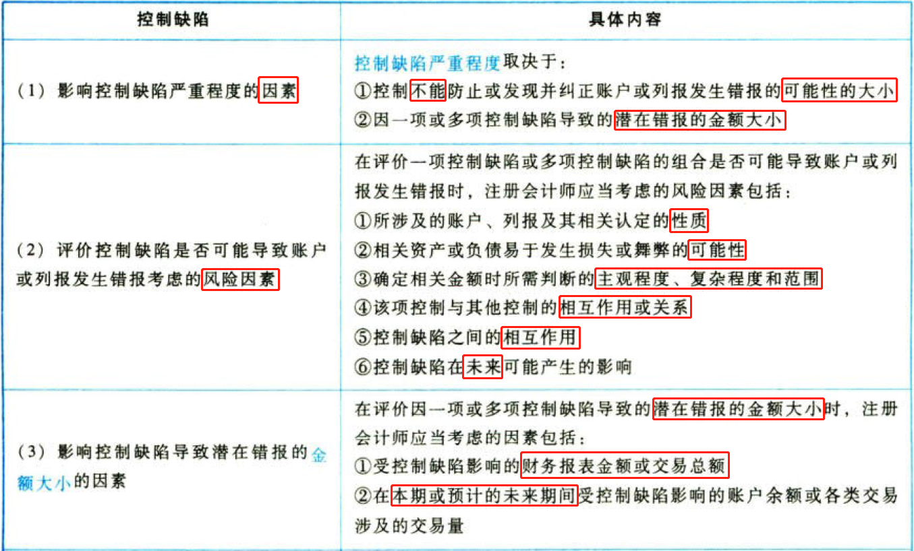

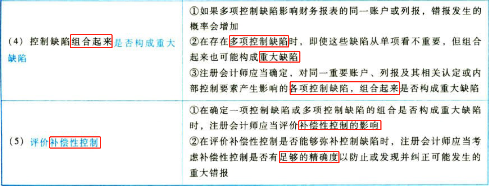

控制缺陷的严重程度与错报是否发生无关，而取决于控制不能防止或发现并纠正成本的可能性的大小。

## 8.28. ［考点三］内部控制缺陷整改:star: :star: :star: 

### 8.28.40. 总体要求

如果被审计单位在基准日前对存在缺陷的控制进行了整改，整改后的控制需要运行足够长的时间，才能使注册会计师得出其是否有效的审计结论。

### 8.28.41. 对整改后控制运行的时间的考虑

（1）注册会计师应当根据控制的性质和与控制相关的风险，合理运用职业判断，确定整改后控制运行的最短期间（或整改后控制的最少运行次数）以及最少测试数量。

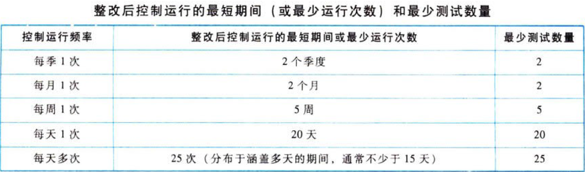

（2）如果被审计单位在基准日前对存在重大缺陷的内部控制进行了整改，但新控制尚没有运行足够长的时间，注册会计师应当将其视为内部控制在基准日存在重大缺陷。

# 9. 出具审计报告

## 9.29. ［考点一］无保留意见的内部控制审计报告:star: :star: 

### 9.29.42. 适用情况

如果符合下列所有条件，注册会计师应当对内部控制出具无保留意见的内部控制审计报告：

（1）在基准日，被审计单位按照适用的内部控制标准的要求，在所有重大方面保持了有效的内部控制。

（2）注册会计师已经按照《企业内部控制审计指引》的要求计划和实施审计工作，在审计过程中未受到限制。

### 9.29.43. 内部控制审计报告要素及举例

（1）无保留意见内部控制审计报告要素。

①标题；

②收件人；

③引言段；

④企业对内部控制的责任段；

⑤注册会计师的责任段；

⑥内部控制固有局限性的说明段；

⑦财务报告内部控制审计意见段；

⑧非财务报告内部控制重大缺陷描述段；

⑨注册会计师的签名和盖章；

⑩会计师事务所的名称、地址及盖章：

⑪报告日期。

（2）[无保留意见内部控制审计报告举例](../../../../CPA6in1/CPA6in1/4审计/无保留意见内部控制审计报告举例.md)。

## 9.30. ［考点二］非无保留意见的内部控制审计报告:star: :star: :star: 

### 9.30.44. 内部控制存在重大缺陷时的处理

（1）发表否定意见。

①如果认为内部控制存在一项或多项重大缺陷，除非审计范围受到限制，注册会计师应当对内部控制发表否定意见。

②否定意见的内部控制审计报告还应当包括重大缺陷的定义、重大缺陷的性质及其对内部控制的影响程度。

（2）企业内部控制评价报告中是否包含重大缺陷。

①如果重大缺陷尚未包含在企业内部控制评价报告中，注册会计师应当在内部控制审计报告中说明重大缺陷已经识别、但没有包含在企业内部控制评价报告中。

②如果企业内部控制评价报传中包含了重大缺陷，但注册会计师认为这些重大缺陷未在所有重大方面得到公允反映，注册会计师应当在内部控制审计报告中说明这一结论，并公允表达有关重大缺陷的必要信息。此外，注册会计师还应当就这些情况以书面形式与治理层沟通。

（3）财务报表审计中不应依赖重大缺陷的控制。

①如果拟对内部控制的有效性发表否定意见，在财务报表审计中，注册会计师不应依赖存在重大缺陷的控制。然而，需要实施实质性程序确定与该控制相关的账户是否存在重大错报。如果实施实质性程序的结果表明该账户不存在重大错报，注册会计师可以对财务报表发表无保留意见。在这种情况下，注册会计师应当确定该意见对财务报表审计意见的影响，并在内部控制审计报告中予以说明。

②如果对财务报表发表的审计意见未受影响，注册会计师应当在内部控制审计报告的导致否定意见的事项段中增加以下类似说明：“在xx公司xx年财务报表审计中，我们已经考虑了上述重大缺陷对审计程序的性质、时间安排和范围的影响。本报告并未对我们在xx年x月x日对x公司xx年财务报表出具的审计报告产生影响。”

③如果对财务报表发表的审计意见受到影响，注册会计师应当在内部控制审计报告的导致否定意见的事项段中增加以下类似说明：“在xx公司xx年财务报表审计中，我们已经考虑了上述重大缺陷对审计程序的性质、时间安排和范围的影响。”

### 9.30.45. 审计范围受到限制时的处理

（1）审计范围受到限制。

注册会计师只有实施了必要的审计程序，才能对内部控制的有效性发表意见。如果审计范围受到限制，注册会计师应当解除业务约定或出具无法表示意见的内部控制审计报告。

（2）考虑相关豁免规定。

①不构成审计范围受到限制。如果法律法规的相关豁免规定允许被审计单位不将某些实体纳入内部控制的评价范围，注册会计师可以不将这些实体纳入内部控制审计的范围。这种情况不构成审计范围受到限制，但注册会计师应当在内部控制审计报告中增加强调事项段或者在注册会计师的责任段中，就这些实体未被纳入评价范围和内部控制审计范围这一情况，作出与被审计单位类似的恰当陈述。

②豁免权的陈述不恰当。如果认为被审计单位有关该项豁免的陈述不恰当，注册会计师应当提请其作出适当修改。如果被审计单位未作出恰当修改，注册会计师应当在内部控制审计报告的强调事项段中说明被审计单位的陈述需要修改的理由。

（3）发表无法表示意见。

在出具无法表示意见的内部控制审计报告时，注册会计师应当在内部控制审计报告中指明审计范围受到限制，无法对内部控制的有效性发表意见，并单设段落说明无法表示意见的实质性理由。注册会计师不应在内部控制审计报告中指明所执行的程序，也不应描述内部控制审计的特征，以避免对无法表示意见的误解。如果在已执行的有限程序中发现内部控制存在重大缺陷，注册会计师应当在内部控制审计报告中对重大缺陷做出详细说明。

【注意】在出具无法表示意见的内部控制审计报告时，之前执行的有限程序不能提及，执行的有限程序发现的内部控制存在的重大缺陷要提及。

## 9.31. ［考点三］强调事项、非财务报告内部控制重大缺陷:star: :star: :star: 

### 9.31.46. 强调事项

（1）总体要求。

如果认为内部控制虽然不存在重大缺陷，但仍有一项或多项重大事项需要提请内部控制审计报告使用者注意，注册会计师应当在内部控制审计报告中增加强调事项段予以说明。

（2）增加强调事项段的情形。

①如果确定企业内部控制评价报告对要素的列报不完整或不恰当，注册会计师应当在内部控制审计报告中增加强调事项段，说明这一情况并解释得出该结论的理由。

②如果注册会计师知悉在基准日并不存在、但在期后期间发生的事项，且这类期后事项对内部控制有重大影响，注册会计师应当在内部控制审计报告中增加强调事项段，描述该事项及其影响，或提醒内部控制审计报告使用者关注企业内部控制评价报告中披露的该事项及其影响。

（3）强调事项段举例。

### 9.31.47. 非财务报告内部控制重大缺陷

（1）注册会计师应当以书面形式与企业董事会和经理层沟通其审计过程中注意到的非财务报告内部控制的重大缺陷，提醒企业加以改进。

（2）在内部控制审计报告中增加非财务报告内部控制重大缺陷描述段，对重大缺陷的性质及其对实现相关控制目标的影响程度进行披露，提示内部控制审计报告使用者注意相关风险，但无需对其发表审计意见。

【阶段总结】本意九节内容共同构成了一套完整的内部控制审计流程。本章第一节的内容具有特别重要的意义，要求大家建立企业内部控制概念（即五目标和五要素）、内部控制审计的概念，特别是审计意见所指的时点和要求涵盖的审计范围；同时还需要大家明确内部控制审计与财务报表审计的对比要点。

# 10. 总结

End。
