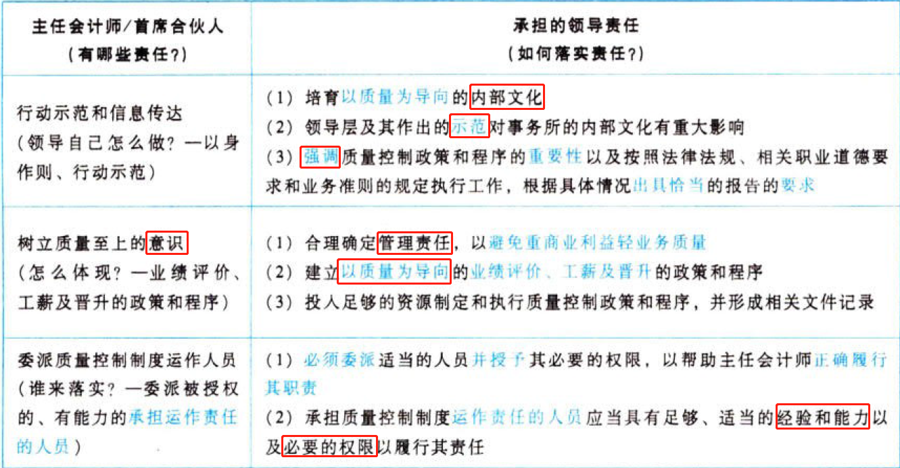
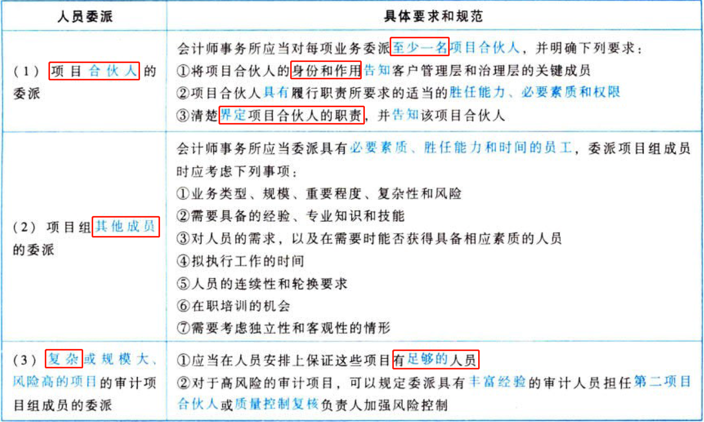
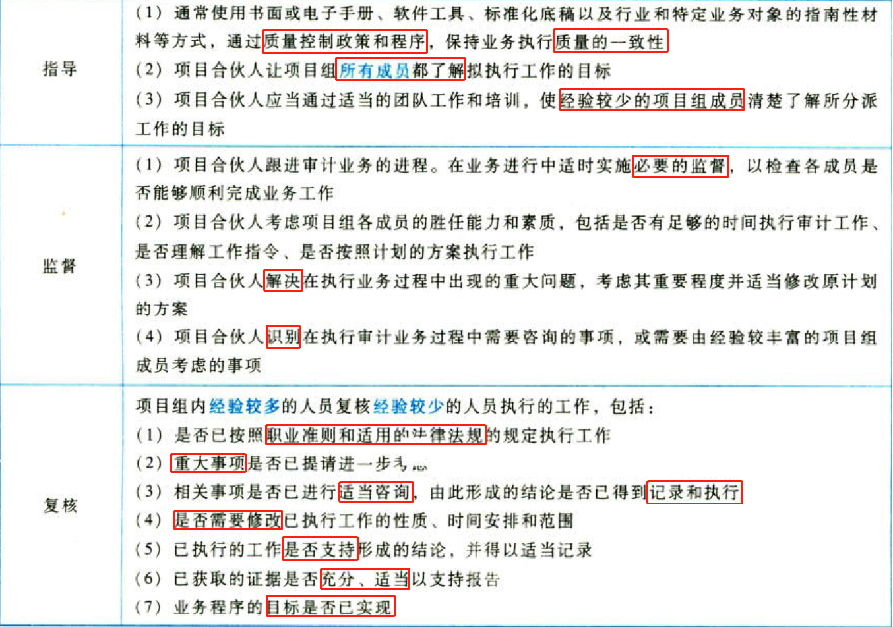
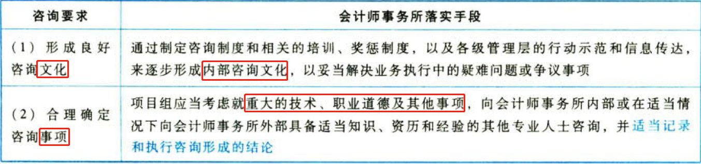
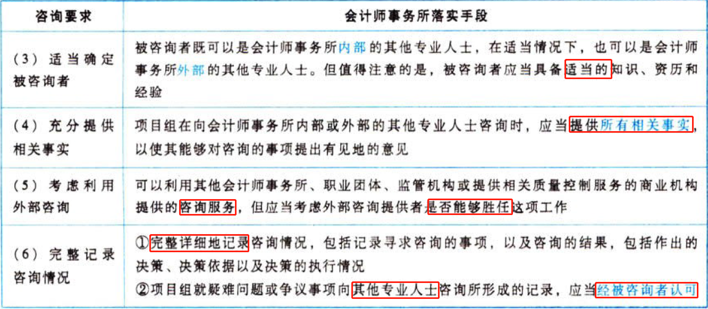
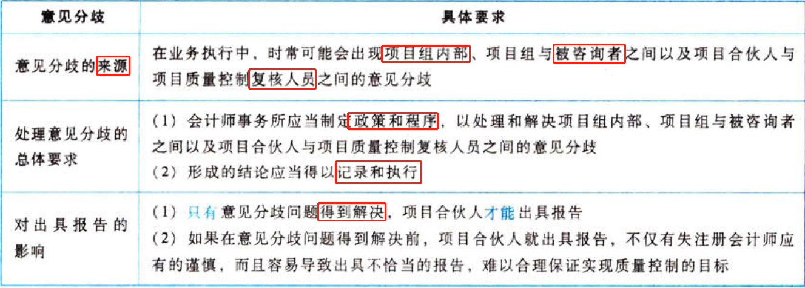

C21会计师事务所业务质量控制

# 1. 质量控制制度的目标和对业务质量承担的领导责任

## 1.1. ［考点］领导责任:star: :star: 

会计师事务所主任会计师（有限责任会计师事务所）或首席合伙人（合伙会计师事务所）对质量控制制度承担最终责任。具体要求，归纳如下表。

对“质量控制制度”承担最终责任的只有一个人，即主任会计师（有限责任会计师事务所）或首席合伙人（合伙会计师事务所）。

# 2. 相关职业道德要求

## 2.2. ［考点］相关职业道德要求:star: :star: 

从考试角度，职业道德要求主要体现在“独立性”问题上。大家可以避开“繁文缚节”的规定，重点抓住“独立性”要求。

### 2.2.1. 满足独立性的总体要求

会计师事务所应当制定政策和程序，以合理保证会计师事务所及其人员，包括雇用的专家和其他需要满足独立性要求的人员，保持相关职业道德要求规定的独立性。

### 2.2.2. 满足独立性的具体要求

（1）项目合伙人向会计师事务所提供与客户委托业务相关的信息，以便会计师事务所能够评价这些信息对保持独立性的总体影响。

（2）会计师事务所人员及时向会计师事务所报告对独立性产生不利影响的情况和关系，以便会计师事务所采取适当行动。

（3）会计师事务所收集相关信息，并向适当人员传达。

### 2.2.3. 针对获知违反独立性的应对措施

（1）会计师事务所人员将注意到的、违反独立性要求的情况立即告知会计师事务所。

（2）会计师事务所将识别出的违反独立性政策和程序的情况，立即传达给需要与会计师事务所共同处理这些情况的项目合伙人，需要采取适当行动的会计师事务所和网络内部的其他相关人员以及受独立性要求约束的人员。

（3）项目合伙人、会计师事务所和网络内部的其他相关人员以及受独立性约束的其他人员，在必要时立即向会计师事务所报告他们为解决有关问题所采取的行动，以使会计师事务所能够决定是否应当采取进一步的行动。

### 2.2.4. 获取书面确认函

（1）会计师事务所应当每年至少一次向所有需要按照相关职业道德要求保持独立性的人员获取其遵守独立性政策和程序的书面确认函。当有其他会计师事务所参与执行部分业务时，会计师事务所也可以考虑向其获取有关独立性的书面确认函。

（2）书面确认函既可以是纸质的，也可以是电子形式的。

### 2.2.5. 防范关系密切产生的不利影响

长期由同一个高级人员执行某项鉴证业务可能造成的亲密关系对独立性会产生不利影响，为此，会计师事务所应当制定下列政策和程序，以防范可能对独立性产生不利影响：

（1）明确标准，以确定长期委派同一名合伙人或高级员工执行某项鉴证业务时，是否需要采取防范措施，将因密切关系产生的不利影响降至可接受的水平。

（2）对所有上市实体财务报表窜计业务，按照相关职业道德要求和法律法规的规定，在规定期限届满时轮换合伙人、项目质量控制复核人员，以及受轮换要求约束的其他人员。

# 3. 客户关系和具体业务的接受与保持

## 3.3. ［考点］客户关系和具体业务的接受与保持:star: :star: 

在审计实务工作中，关于“客户关系和具体业务接受与保持的政策和程序”内容很多，但从考试的角度，大家掌握总体要求的“三个要点”即可。

会计师事务所应当制定有关客户关系和具体业务接受与保持的政策和程序，以合理保证只有在下列情况下，才能接受或保持客户关系和具体业务：

（1）能够胜任该项业务，并具有执行该项业务必要的素质、时间和资源。

（2）能够遵守相关职业道德要求。

（3）巳考虑客户的诚信，没有信息表明客户缺乏诚信。

# 4. 人力资源

## 4.4. ［考点一］人力资源管理的要素:star: 

人力资洒、管理的核心是人员数量是否足够，人员素质是否达到会计师事务所质量控制制度标准。因此，会计师事务所应当从以下七个方面强化人事管理：

（1）招聘。

（2）业绩评价。

（3）人员素质和胜任能力，包括完成所分派任务的时间是否足够。

（4）职业发展。

（5）晋升。

（6）薪酬。

（7）人员需求预测。

## 4.5. ［考点二］会计师事务所提高人员素质和胜任能力的途径:star: 

会计师事务所应当从以下五个环节提高事务所的人员素质和胜任能力：

（1）职业教育。

（2）持续职业发展，包括培训。

（3）工作经验。

（4）由经验更丰富的员工（如项目组的其他成员）提供辅导。

（5）针对受独立性要求约束的人员进行的独立性教育。

## 4.6. ［考点三］项目组人员委派:star: 

会计师事务所的项目组人员委派要求，归纳如下表。

# 5. 业务执行

## 5.7. ［考点一］指导、监督与复核:star: 

会计师事务所针对业务项目需要抓好指导、监督和复核三个环节的工作，具体要求，归纳如下表。

## 5.8. ［考点二］咨询要求:star: :star: :star: 

会计师事务所应当建立政策和程序，以合理保证：

（1）就疑难问题或争议事项进行适当咨询；

（2）能够获取充分的资源进行适当咨询；

（3）咨询的性质和范围以及咨询形成的结论得以记录，并经过咨询者和被咨询者的认可；

（4）咨询形成的结论得到执行。

会计师事务所咨询的具体要求，归纳如下表。

## 5.9. ［考点三］意见分歧:star: :star: :star: 

会计师事务所应当制定政策和程序，处理和解决意见分歧，具体要求归纳如下表。

## 5.10. ［考点四］项目质量控制复核:star: :star: :star: 

### 5.10.6. 项目质量控制复核的定义

项目质量控制复核是指会计师事务所挑选不参与该业务的人员，在出具报告前，对项目组作出的重大判断和在准备报告时形成的结论作出客观评价的过程。

项目质量控制复核并不减轻项目合伙人的责任，更不能替代项目合伙人的责任。

### 5.10.7. 项目质量控制复核对象的确定

会计师事务所制定的项目质量控制复核政策和程序应当包括下列要求：

（1）对所有上市实体财务报表审计实施项目质量控制复核。

（2）明确标准，据此评价所有其他的历史财务信息审计和审阅、其他鉴证及相关服务业务，以确定是否应当实施项目质量控制复核。

（3）对所有符合标准的业务实施项目质量控制复核。

确定项目质量控制复核的对象是否正确，抓住三点：上市实体、涉及公众利益范围较大的实体以及高风险的业务，缺少任何一个，都是不对的。

### 5.10.8. 项目质量控制复核的方法

（1）与项目合伙人进行讨论。

（2）复核财务报表或其他业务对象信息及报告，尤其考虑报告是否适当。

（3）选取与项目组作出重大判断及形成结论有关的工作底稿进行复核。

（4）复核有关处理和解决重大疑难问题或争议事项形成的工作底稿。

（5）复核重大事项概要等。

### 5.10.9. 项目质量控制复核的范围

针对上市实体财务报表审计，会计师事务所应当制定政策和程序，要求实施的项目质量控制复核包括对下列事项的考虑：

（1）项目组就具体业务对会计师事务所独立性作出的评价。

（2）项目组是否己就涉及意见分歧的事项，或者其他疑难问题就争议事项进行适当咨询，以及咨询得出的结论。

（3）选取的用于复核的业务工作底稿，是否反映项目组针对重大判断执行的工作，以及是否支持得出的结论。

在对上市实体财务报表审计以外的其他业务实施项目质量控制复核时，项目质量控制复核人员可根据情况考虑上述部分或全部事项。

公众利益实体的范围大于上市实体；上市实体的范围大于上市公司。

### 5.10.10. 项目质量控制复核的时间

项目质量控制复核人员应当在业务过程中的适当阶段及时实施复核，以使重大事项在出具报告前得到满意解诀。

### 5.10.11. 项目质量控制复核人员的资格标准

会计师事务所应当制定政策和程序，明确被委派的项目质量控制复核人员应符合下列要求：

（1）履行职责需要的技术资格，包括必要的经验和权限。

（2）在不损害其客现性的前提下，提供业务咨询的程度。

### 5.10.12. 项目质量控制复核人员的客观性

项目质量控制复核人员应符合下列规定：

（1）如果可行，不由项目合伙人挑选。

（2）在复核期间不以其他方式参与该业务。

（3）不代替项目组进行决策。

（4）不存在可能损害复核人员客观性的其他情形。

### 5.10.13. 项目质量控制复核人员的权威性

项目质量控制复核人员需要具备履行职责所需的充分、适当的技术专长、经验和权限。特别是，项目质量控制复核人员履行职责，不应受到项目合伙人职级的影响。

### 5.10.14. 项目质量控制复核人员所能承担的总体复核工作量

当一名复核人员在一定时间内承担过多的项目质量控制复核任务时，可能对实现项目质量控制复核目标产生不利影响，会计师事务所相关政策和程序需要对此予以考虑。

### 5.10.15. 对属于公众利益实体的被审计单位的特别要求

《中国注册会计师职业道德守则第4号——审计和审阅业务对独立性的要求》规定，如果被审计单位属于公众利益实体，相关关键审计合伙人任职时间不得超过五年，在任期结束后的两年内，不得为该被审计单位的审计业务实施质量控制复核。

### 5.10.16. 项目质量控制复核的记录

会计师事务所应当制定政策和程序，要求记录项目质量控制复核情况，包括：

（1）有关项目质量控制复核的政策所要求的程序己得到执行。

（2）项目质量控制复核在出具报告前业已完成。

（3）复核人员没有发现任何尚未解决的事项，使其认为项目组作出的重大判断及形成的结论不适当。

### 5.10.17. 持续改进项目质量控制复核

会计师事务所可以考虑采取以下措施，持续改进项目质量控制复核：

（1）开发广泛应用的项目质量控制复核培训课程，使项目质量控制复核人员在如何履行职责方面接受充分培训，并使项目组了解项目质量控制复核人员如何履行职责及其对项目组的期望，以及在项目质量控制复核过程中咨询的可能类型。

（2）根据会计师事务所的相关政策和程序，对项目质量控制复核人员的工作进行考核。

（3）定期召开项目质量控制复核人员会议，讨论如何加强复核工作，并在设计培训课程及相关政策和程序时考虑相关意见和建议。

（4）汇编形成项目质量控制复核问题案例，以帮助项问质量控制复核人员向项目组提出适合具体情况的问题，评价项目组在具体业务中作出的重大判断和结论。

## 5.11. ［考点五］业务工作底稿:star: :star: :star: 

### 5.11.18. 业务工作底稿的归档期限

鉴证业务工作底稿的归档期限为业务报告日后60日内。

### 5.11.19. 业务工作底稿的管理要求

（1）安全保管业务工作底稿并对业务工作底稿保密。

（2）保证业务工作底稿的完整性。

（3）便于使用和检索业务工作底稿。

（4）按照规定的期限保存业务工作底稿。

### 5.11.20. 业务工作底稿的保密

除特定情况外，会计师事务所应当对业务工作底稿包含的信息予以保密。这些特定情况包括：

（1）取得客户的授权。会计师事务所及其人员对客户的信息负有保密的义务，如果未经客户的许可，除下述的第（2）、（3）两种情况外，不得泄露客户的信息给他人或利用客户信息谋取私利，否则将承担相应的法律后果。

（2）根据法律法规的规定，会计师事务所为法律诉讼准备文件或提供证据，以及向监管机构报告发现的违反法规行为。

（3）接受注册会计师协会和监管机构依法进行的质量检查。

### 5.11.21. 业务工作底稿的完整性、使用与检索

无论业务工作底稿存在于纸质、电子还是其他介质，会计师事务所都应当针对业务工作底稿设计和实施适当的控制，以实现下列目的：

（1）使业务工作底稿清晰地显示其生成、修改及复核的时间和人员。

（2）在业务的所有阶段，尤其是在项目组成员共享信息或通过互联网将信息传递给其他人员时，保护信息的完整性。

（3）防止未经授权改动业务工作底稿。

（4）仅允许项目组和其他经授权的人员为适当履行职责而接触业务工作底稿。

### 5.11.22. 对原纸质记录经电子扫描后的业务工作底稿的控制

对于原纸质记录经电子扫描后存入业务档案，会计师事务所应当实施适当的控制程序，以保证：

（1）生成与原纸质记录的形式和内容完全相同的扫描复制件，包括人工签名、交叉索引和有关注释。

（2）将扫描复制件，包括必要时对扫描复制件的索引和签字，归整到业务档案中。

（3）能够检索和打印扫描复制件。

会计师事务所应当保留已扫描的原纸质记录。

### 5.11.23. 业务工作底稿的保存期限

对鉴证业务，包括历史财务信息审计和审阅业务、其他鉴证业务，会计师事务所应当自业务报告日起，对业务工作底稿至少保存10年。如果法律法规有更高的要求，还应保存更长的时间。

### 5.11.24. 业务工作底稿的所有权

业务工作底稿的所有权属于会计师事务所。

# 6. 监控

## 6.12. ［考点］监控:star: :star: :star: 

### 6.12.25. 监控的目的

会计师事务所应当制定监控政策和程序，实施监控的目的是为了评价：

（1）遵守职业准则和法律法规的情况。

（2）质量控制制度设计是否适当，运行是否有效。

（3）质量控制政策和程序应用是否得当，以便会计师事务所和项目合伙人能够根据具体情况出具恰当的业务报告。

### 6.12.26. 监控人员

（1）实施监控的人员应当具有专业胜任能力。

（2）会计师事务所可以委派主任会计师、副主任会计师或具有足够、适当经验和权限的其他人员履行监控责任。

### 6.12.27. 监控内容

对会计师事务所质量控制制度实施监控的内容，包括：

（1）质量控制制度设计的适当性。

（2）质量控制制度运行的有效性。

### 6.12.28. 实施检查

（1）检查的周期。

会计师事务所应当周期性地选取已完成的业务进行检查，周期最长不得超过三年。在每个周期内，应对每个项目合伙人的业务至少选取一项进行检查。

（2）检查的组织方式。

会计师事务所确定周期性检查的组织方式应当考虑以下因素：

①会计师事务所的规模。

②分支机构的数量及分布。

③前期实施监控程序的结果。

④人员和分支机构的权限。

⑤会计师事务所业务和组织结构的性质及复杂程度。

⑥与特定客户和业务相关的风险。

（3）确定检查的时间、人员与范围。

①会计师事务所在选取单项业务进行检查时，可以不事先告知相关项目组。

②参与业务执行或项目质量控制复核的人员不应承担该项业务的检查工作。

③会计师事务所可以考虑外部独立检查的范围或结论，但这些检查并不能替代臼身的内部监控。

### 6.12.29. 监控结果的处理

（1）确定所发现的缺陷的影响与性质。

①该缺陷并不必然表明质量控制制度不足以合理保证会计师事务所遵守职业准则和适用的法律法规的规定，以及会计师事务所和项目合伙人出具适合具体情况的报告。

②该缺陷是系统性的、反复出现的或其他需要及时纠正的重大缺陷。

（2）适时将缺陷及补救措施告知相关人员。

会计师事务所应当将实施监控程序发现的缺陷及建议采取的适当补救措施，告知相关项目合伙人及其他适当人员。

（3）提出补救措施。

会计师事务所在评价各种缺陷后，应当提出下列补救措施：

①采取与某项业务或某个成员相关的适当补救措施。

②将监控发现的缺陷告知负责培训和职业发展的人员。

③改进质量控制政策和程序。

④对违反会计师事务所政策和程序的人员，尤其是对反复违规的人员实施惩戒。

（4）监控结果表明出具的报告不适当时的处理。

如果实施监控程序的结果表明出具的报告可能不适当，或在执行业务过程中遗漏了应有的程序，会计师事务所应当确定采取适当的进一步行动，以遵守职业准则和适用的法律法规的规定。同时，会计师事务所应考虑征询法律意见。

（5）定期告知监控结果。

会计师事务所应当每年至少一次将质量控制制度的监控结果，传达给项目合伙人及会计师事务所内部的其他适当人员，以便会计师事务所及其相关人员能够在其职责范围内及时采取适当的行动。

传达的信息应当包括下列内容：

①对已实施的监控程序的描述。

②实施监控程序得出的结论。

③如果相关，对系统性的、重复出现的缺陷或其他需要及时纠正的重大缺陷的描述。

检查是监控的一部分，对检查的报告要求是至少每三年一次，而监控中还包括其他的工作，对监控的报告要求是每年至少一次，注意区分。

### 6.12.30. 监控的记录

会计师事务所应当适当记录下列监控事项：

（1）制定的监控程序，包括选取已完成的业务进行检查的程序。

（2）对监控程序实施情况的评价。

（3）识别出的缺陷，对其影响的评价，是否采取行动及采取何种行动的依据。

### 6.12.31. 投诉和指控

（1）合理保证能够适当处理投诉和指控。

会计师事务所应当制定政策和程序，以合理保证能够适当处理下列事项：

①投诉和指控会计师事务所执行的工作未能遵守职业准则和适用的法律法规的规定。

②指控未能遵守会计师事务所质量控制制度。

（2）设立投诉和指控渠道。

①如果投诉和指控人要求对其身份保密，会计师事务所应当予以保密，未经本人许可，不得披露其姓名。

②如果收到匿名的投诉和指控，会计师事务所应当以适当的方式向全体人员表明，与实名的投诉和指控相比，匿名的投诉和指控更难调查和反馈，鼓励用实名投诉和指控。

③会计师事务所还应当表明所有的投诉和指控都将得到记录、调查并会将结果反馈给投诉和指控人。反馈调查结果通常采取书面形式。

（3）调查、记录投诉和指控事项。

①会计师事务所应当委派本所内部不参与该项业务的具有足够、适当经验和权限的人员负责对调查的监督。必要时，聘请法律专家参与调查工作。

②会计师事务所通常委派有关负责人，专门负责确定需要进行何种调查，以及由谁进行调查。调查的方式包括内部询问、征求法律意见、更全面地复核业务底稿和与本所员工座谈等。所需要的调查技能可能涉及鉴证和会计、法律或其他专业等方面的知识和经验。

（4）采取适当的行动。

如果调查结果表明质量控制政策和程序在设计或运行方面存在缺陷，或者存在违反质量控制制度的情况，会计师事务所应当采取适当行动。

［阶段总结］根据《会计师事务所质量控制准则第5101号——会计师事务所对执行财务报表审计和审阅、其他鉴证和相关服务业务实施的质量控制》的要求，会计师事务所应当按照对业务质量承担的领导责任、相关职业道德要求、客户关系和具体业务的接受与保持、人力资源、业务执行和监控六个要素建立会计师事务所的业务质量控制制度。虽然仅用一章介绍，但是为会计师事务所如何建立和执行质量控制提供了一套完整的标准体系。

# 7. 总结

End。
