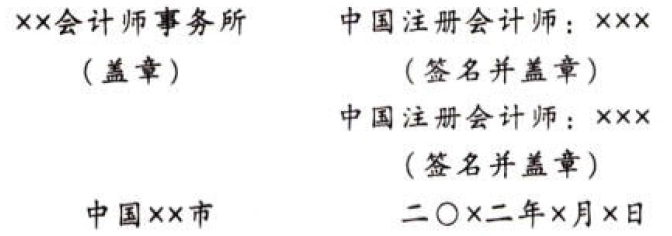

［例11］“对应数据”导致保留意见情形（详见敬材参考格式19-7）

审计报告

ABC股份有限公司全体股东：

# 1. 一、保留意见

我们审计了ABC股份有限公司（以下简称“ABC公司”）财务报表，包括20x1年12月31日的资产负债表，20x1年度的利润表、现金流量表、股东权益变动表以及相关财务报表附注。

我们认为，除“形成保留意见的基础”部分所述事项产生的影响外，后附的财务报表在所有重大方面按照企业会计准则的规定编制，公允反映了ABC公司20x1年12月31日的财务状况，以及20x1年度的经营成果和现金流量。

# 2. 二、形成保留意见的基础

如财务报表附注X所述，ABC公司未按照企业会计准则的规定对房屋建筑物和机器设备计提折。这项决定是管理层在上一会计年度开始时作出的，导致我们对该年度财务报表发表了保留意见。如果按照、房屋建筑物5%和机器设备20%的年折旧率计提折旧，20x1年度和20x0年度的当年亏损将分别增加×元和×元，20x1年末和20x0年末的房屋建筑物和机器设备的净值将因累计折旧而减少×元和×元，并且20x1年末和20x0年末的累计亏损将分别增加×元和×元。

我们按照中国注册会计师审计准则的规定执行了审计工作。审计报告的“注册会计师对财务报表审计的责任”部分进一步阐述了我们在这些准则下的责任。按照中国注册会计师职业道德守则，我们独立于ABC公司，并且履行了职业道德方面的其他责任。我们相信，我们获取的审计证据是充分、适当的，为发表保留意见提供了基础。

# 3. 三、管理层和治理层对财务报表的责任（略）

# 4. 四、注册会计师对财务报表审计的责任（略）

