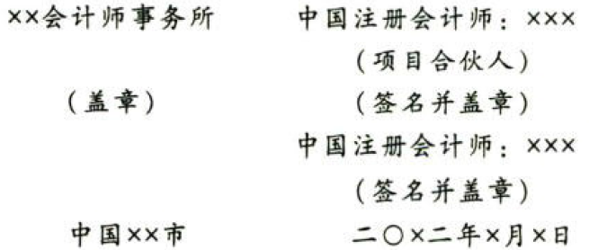

［例8］由于财务报表存在重大错报而发表保留意见的审计报告（教材参考格式19-4）

审计报告

ABC股份有限公司全体股东：

# 1. 一、保留意见

我们审计了ABC股份有限公司（以下简称“ABC公司”）财务报表，包括20x1年12月31日的资产负债表，20x1年度的利润表、现金流量表、股东权益变动表以及相关财务报表附注。

我们认为，除“形成保留意见的基础”部分所述事项产生的影响外，后附的财务报表在所有重大方面按照企业会计准则的规定编制，公允反映了ABC公司20x1年12月31日的财务状况以及20x1年度的经营成果和现金流量。

# 2. 二、形成保留意见的基础

ABC公司20x1年12月31日资产负债表中存货的列示金额为×元。管理层根据成本对存货进行计量，而没有根据成本与可变现净位孰低的原则进行计量，这不符合企业会计准则的规定。ABC公司的会计记录显示，如果管理层以成本与可变现净值孰低来计量存货，存货列示金额将减少x元。相应地，资产减值损失将增加x元，所得税、净利润和股东权益将分别减少x元、x元和x元。

我们按照中国注册会计师审计准则的规定执行了审计工作。审计报告的“注册会计师对财务报表审计的责任”部分进一步阐述了我们在这些准则下的责任。按照中国注册会计师职业道德守则，我们独立于ABC公司，并且履行了职业道德方面的其他责任。我们相信，我们获取的审计证据是充分、适当的，为发表保留意见提供了基础。

# 3. 三、关键审计事项（如适用）

关键审计事项是我们根据职业判断，认为对本期财务报表审计录为重要的事项。这些事项是在对财务报表整体进行审计并形成审计意见的背景下进行处理的，我们不对这些事项提供单独的意见。除“形成保留意见的基础”部分所述事项外，我们确定下列事项是需要在审计报告中沟通的关键审计事项。（请链接［例2］）

（具体事项，此处略）

# 4. 四、管理层和治理层对财务报求的责任（略）

# 5. 五、注册会计师对财务报表审计的责任（略）

