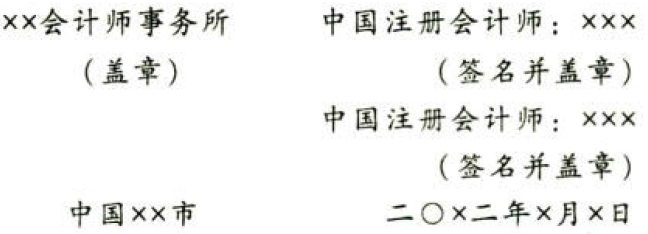

［例9］由于注册会计师无法针对财务报表多个要素获取充分、适当的审计证据而发表无法表示意见的审计报告（教材参考格式19-5）。

审计报告

ABC股份有限公司全体股东：

# 1. 一、无法表示意见

我们接受委托，审计ABC股份有限公司（以下简称“ABC公司”）财务报表，包括20x1年12月31日的资产负债表，20x1年度的利润表、现金流量表、脏东权益变动表以及相关财务报表附注。

我们不对后附的ABC公司财务报表发表审计意见。由于“形成无法表示意见的基础”部分所述事项的重要性，我们无法获取充分、适当的审计证据以作为对财务报表发表审计意见的基础。

# 2. 二、形成无法表示意见的基础

我们于20x2年1月接受ABC公司的审计委托，因而未能对ABC公司20x1年初会金额×元的存货和年未金额为×元的存货实施监盘程序。此外，我们也元法实施替代审计程序获取充分、适当的审计证据。并且，ABC公司于20x1年9月采用新的应收账款电算化系统，由于存在系统缺陷导致应收账款出现大量错误。截至报告日，管理层仍在纠正系统缺陷并更正错误，我们也无法实施替代审计程序，以对截至20x1年12月31日的应收账款总额×元获取充分、适当的审计证据。因此，我们无法确定是否有必要对存货、应收账款以及财务报表其他项目作出调整，也无法确定应调整的金额。

# 3. 三、管理层和治理层对财务报求的责任（略）

# 4. 四、注册会计师对财务报表审计的责任

我们的责任是按照中国注册会计师审计准则的规定，对ABC公司的财务报表执行审计工作，以出具审计报告。但由于“形成无法表示意见的基础”部分所述的事项，我们无法获取充分、适当的审计证据以作为发表审计意见的基础。

按照中国注册会计师职业道德守则，我们独立于ABC公司，并履行了职业道德方面的其他责任。

