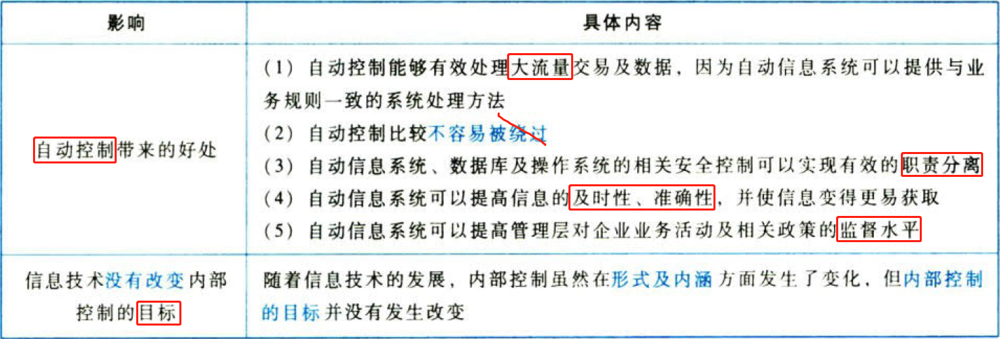
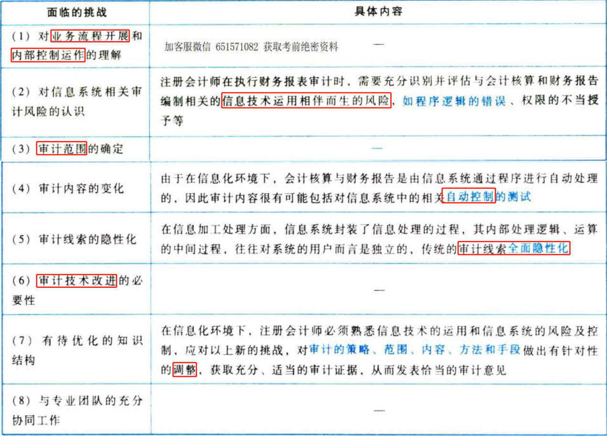
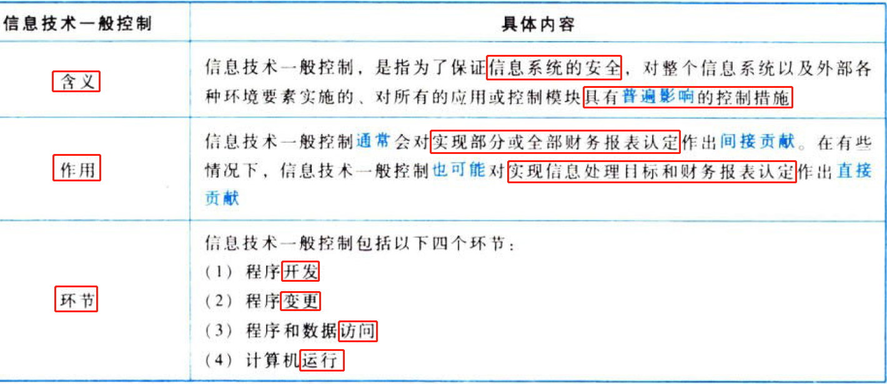
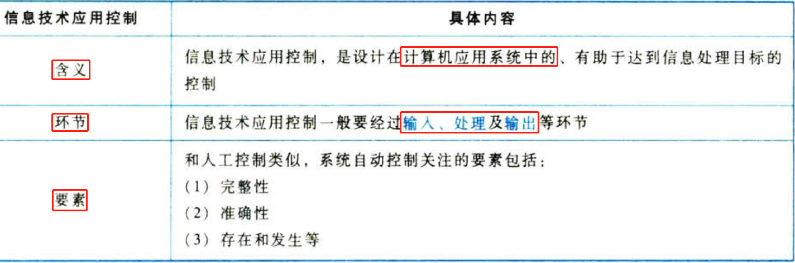
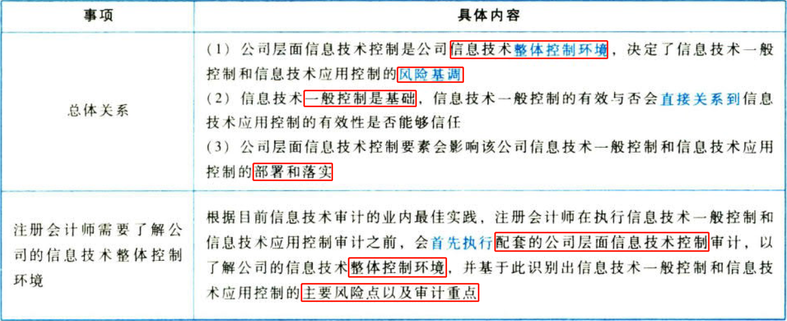
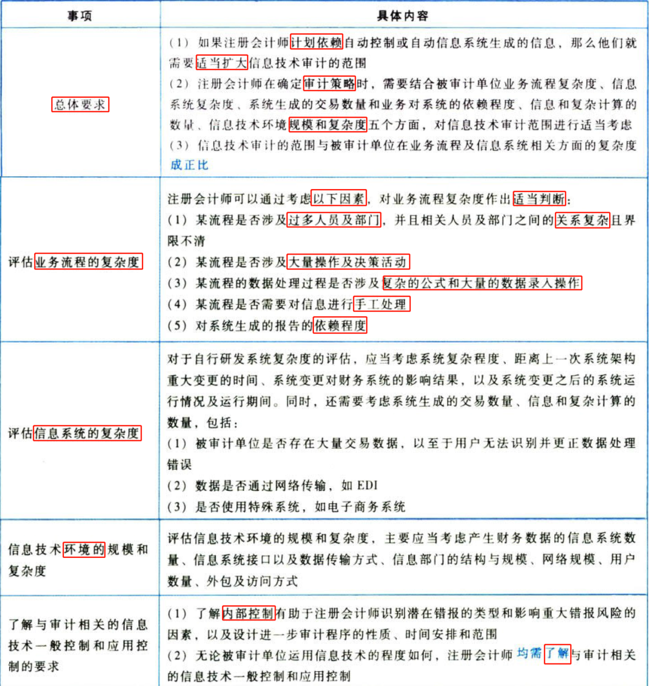
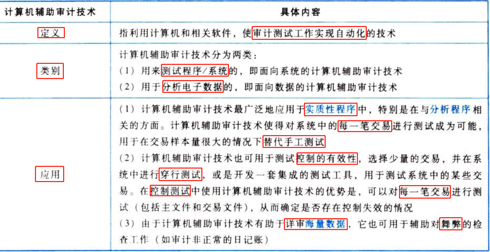
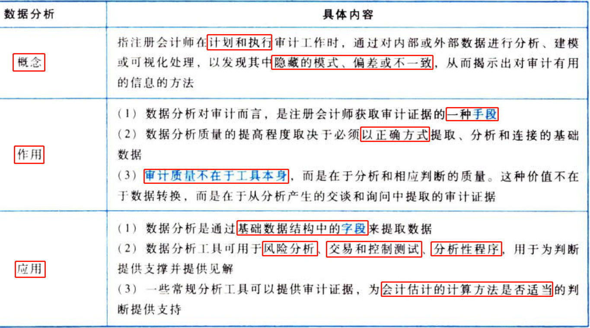

C05信息技术对审计的影响

# 1. 信息技术对企业财务报告和内部控制的影响

## 1.1. ［考点一］信息技术对企业内部控制的影响:star: :star: 

信息技术对企业内部控制的影响，归纳如下表。

## 1.2. ［考点二］信息技术产生的风险:star: 

信息技术在改进被审计单位内部控制的同时，也产生了特定的风险：

（1）信息系统或相关系统程序可能会对数据进行错误处理，也可能会去处理那些本身就错误的数据；

（2）自动信息系统、数据库及操作系统的相关安全控制如果无效，会增加对数据信息非授权访问的风险，这种风险可能导致系统对非授权交易及虚假交易请求的拒绝处理功能遭到破坏，系统程序、系统内的数据遭到不适当的改变、系统对交易进行不适当的记录，以及信息技术人员获得超过其职责范围的过大系统权限等；

（3）数据丢失风险或数据无法访问风险，如系统瘫痪；

（4）不适当的人工干预，或人为绕过自动控制。

## 1.3. ［考点三］注册会计师在信息化环境下面临的挑战:star: 

# 2. 信息技术中的一般控制和应用控制测试

## 2.4. ［考点一］信息技术一般控制:star: :star: 

## 2.5. ［考点二］信息技术应用控制:star: :star: 

## 2.6. ［考点三］公司层面信息技术控制:star: 

常见的公司层面信息技术控制包括但不限于：

（1）信息技术规划的制定；

（2）信息技术年度计划的制定；

（3）信息技术内部审计机制的建立；

（4）信息技术外包管理；

（5）信息技术预算管理；

（6）信息安全和风险管理；

（7）信息技术应急预案的制定；

（8）信息系统架构和信息技术复杂性。

## 2.7. ［考点四］信息技术一般控制、应用控制与公司层面控制三者之间的关系:star: :star: 

# 3. 信息技术对审计过程的影响

## 3.8. ［考点一］信息技术对审计的影响:star: :star: :star: 

## 3.9. ［考点二］信息技术审计范围的确定:star: :star: 

信息技术环境复杂并不一定注意味着信息系统是复杂的，反之亦然。

## 3.10. ［考点三］信息技术一般控制对控制风险的影响:star: 

（1）信息技术一般控制对应用控制的有效性具有普遍性影响。

无效的一般控制增加了应用控制不能防止或发现并纠正认定层次重大错报的可能性，即使这些应用控制本身得到了有效设计。

（2）如果一般控制有效，注册会计师可以更多地信赖应用控制，测试这些控制的运行有效性，并将控制风险评估为低于“最高”水平。

（3）考虑到公司层面信息技术控制是公司的整体控制环境，决定了信息技术的风险基准，因此，注册会计师通常优先评估公司层面信息技术控制和信息技术一般控制的有效性。

## 3.11. ［考点四］信息技术应用控制对控制风险和实质性程序的影响:star: 

（1）在评估应用控制对控制风险和实质性程序的影响时，注册会计师需要将控制与具体的审计目标相联系。

（2）如果针对某一具体审计目标，注册会计师能够识别出有效的应用控制，在通过测试确定其运行有效后，注册会计师能够减少实质性程序。

# 4. 计算机辅助审计技术和电子表格的运用

## 4.12. ［考点］计算机辅助审计技术:star: :star: 

# 5. 数据分析

［考点］数据分析的概念和作用:star: 

# 6. 不同信息技术环境下的问题（略）

# 7. 总结

End。
