C17其他特殊项目的审计

# 1. 审计会计估计

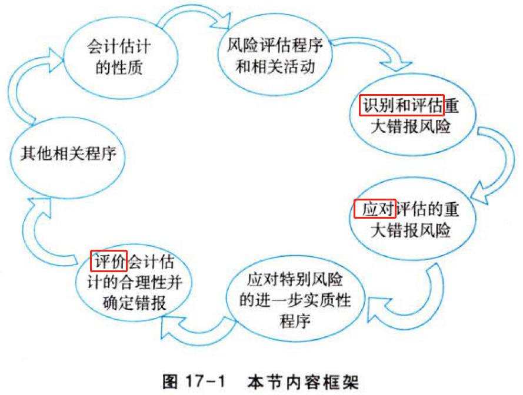

## 1.1. ［考点一］会计估计的性质:star: 

这里的“会计估计的结果”时间节点与被审计单位管理层在财务报表日作出会计估计时间节点是完全不同的两个概念，需要“严加”区分，因为这里是“硬核”考点，也是“丢分”考点。

## 1.2. ［考点二］凤险评估程序和相关活动:star: :star: :star: 

注册会计师应当针对会计估计实施风险评估程序和相关活动，以识别和评估会计估计重大错报风险，如图17-2所示。

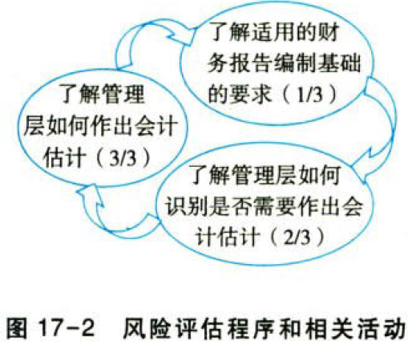

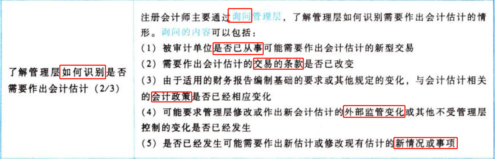

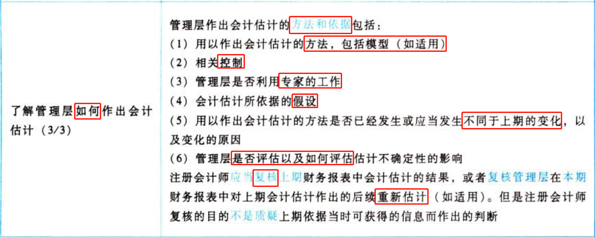

这里的“复核”不是应对会计估计重大错报风险的程序，而是评估会计估计重大错报风险的程序。

## 1.3. ［考点三］识别和评估重大错报风险:star: :star: :star: 

注册会计师应当从估计不确定性的程度（第一方面）和高度估计不确定性（第二方面）两个方面识别和评估与会计估计相关的重大错报风险，其中，高度估计不确定性的会计估计的示例是重点内容。

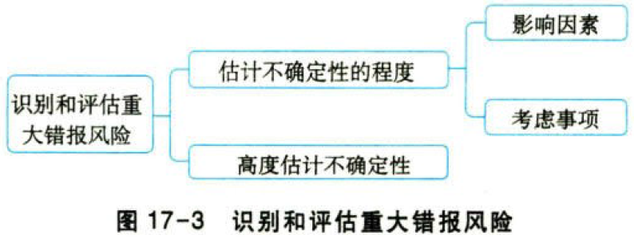

### 1.3.1. 估计不确定性的程度

（1）与会计估计相关的估计不确定性的程度受下列因素的影响：

①会计估计对判断的依赖程度；

②会计估计对假设变化的敏感性；

③是否存在可以降低估计不确定性的经认可的计量技术；

④预测期的长度和从过去事项得出的数据对预测未来事项的相关性；

⑤是否能够从外部来源获得可靠数据；

⑥会计估计依据可观察到的或不可观察到的输入数据的程度。

与会计估计相关的估计不确定性程度，可能影响会计估计对管理层偏向的敏感性。

（2）考虑的事项。

在评估重大错报风险时，注册会计师考虑的事项也可能包括：

①会计估计的实际的或预期的重要程度；

②会计估计的记录金额（即管理层的点估计）与注册会计师预期应记录金额的差异；

③管理层在作出会计估计时是否利用专家工作；

④对上期会计估计进行复核的结果。

### 1.3.2. 具有高度估计不确定性的会计估计

可能存在高度估计不确定性的会计估计的举例如下：

（1）高度依赖判断的会计估计；

（2）未采用经认可的计量技术计算的会计估计；

（3）注册会计师对上期财务报表中类似会计估计进行复核的结果表明最初会计估计与实际结果之间存在很大差异，在这种情况下管理层作出的会计估计；

（4）采用高度专业化的、由被审计单位自主开发的模型，或在缺乏可观察到的输入数据的情况下作出的公允价值会计估计。

离度估计不确定性会计估计的举例需要大家“严防死守”或者“死记硬背”，属于“高频率”考点。

## 1.4. ［考点四］应对评估的重大错报风险:star: :star: :star: 

### 1.4.3. 应确定的内容

基于评估的重大错报风险，注册会计师应当确定：

（1）管理层是否恰当运用与会计估计相关的适用的财务报告编制基础的规定；

（2）作出会计估计的方法是否恰当，并得到一贯运用，以及会计估计或作出会计估计的方法不同于上期的变化是否适合于具体情况。

### 1.4.4. 应对程序

注册会计师应对评估的与会计估计相关的重大错报风险时，应考虑会计估计的性质，并实施下列一项或多项程序：

（1）确定截至审计报告日发生的事项是否提供有关会计估计的审计证据

（2）测试管理层如何作出会计估计以及会计估计所依据的数据

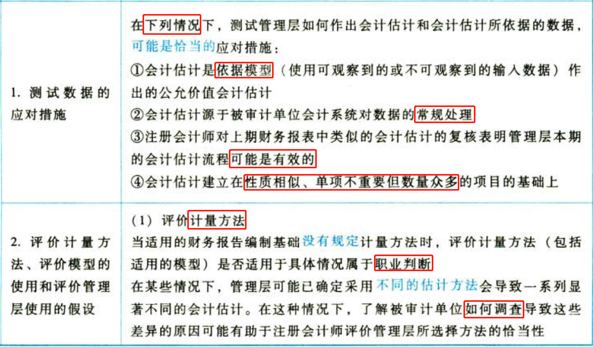

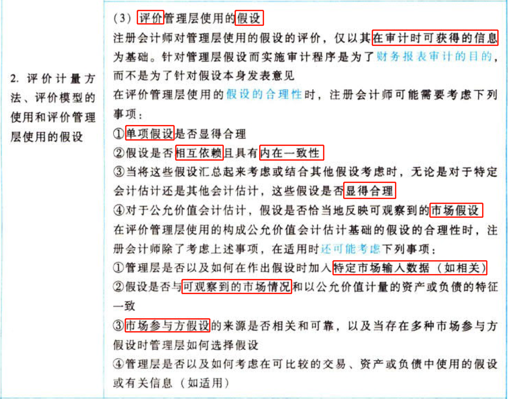

（3）测试与管理层如何作出会计估计相关的控制的运行有效性，并实施恰当的实质性程序

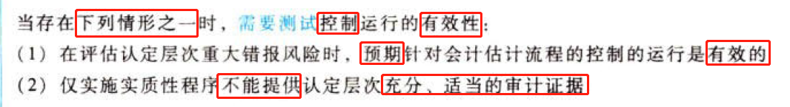

（4）作出注册会计师的点估计或区间估计，以评价管理层的点估计。

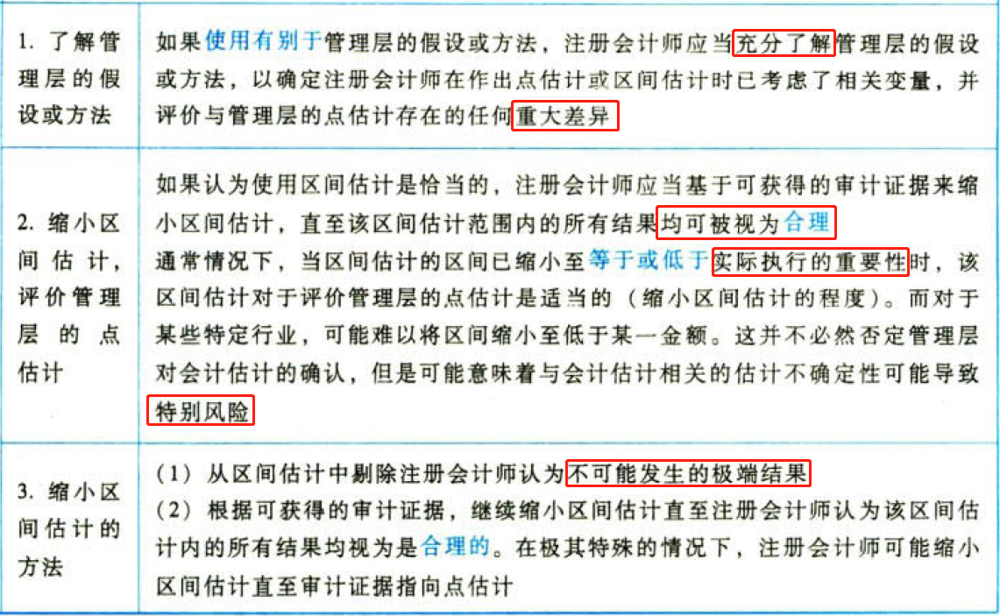

## 1.5. ［考点五］实施进一步审计程序以应对特别风险:star: :star: 

### 1.5.5. 评价因素

### 1.5.6. 应对审计程序

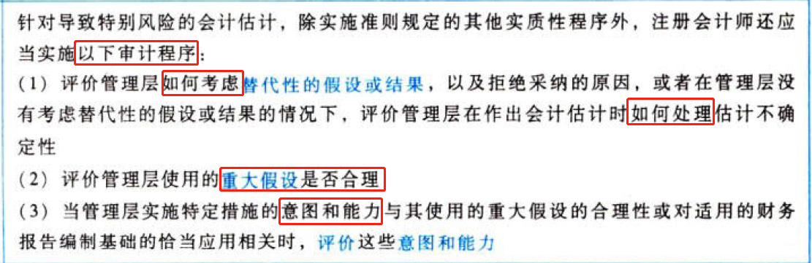

### 1.5.7. 作出区间估计的情形

### 1.5.8. 考虑确认和计量的标准

## 1.6. ［考点六］评价会计估计的合理性并确定错报:star: :star: :star: 

### 1.6.9. 利用点估计或区间估计评估错报

（1）当审计证据支持点估计时，注册会计师的点估计与管理层的点估计之间的差异构成错报。

（2）当注册会计师认为使用其区间估计能够获取充分、适当的审计证据时，则在注册会计师区间估计之外的管理层的点估计得不到审计证据的支持。在这种情况下，错报不小于管理层的点估计与注册会计师区间估计之间的最小差异。

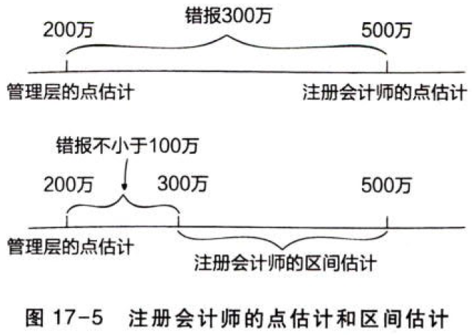

### 1.6.10. 导致会计估计错报的因素

一项错报，无论是由于舞弊还是错误导致，当与会计估计相关时，可能是由于下列因素导致的：

（1）毋庸置疑地存在错报（事实错报）；

（2）由注册会计师认为管理层对会计估计作出的判断不合理，或认为管理层对会计政策的选择或运用不恰当而产生的差异（判断错报）；

（3）注册会计师对总体中错报的最佳估计，包括自审计样本中识别出的错报推断出总体中的错报（推断错报）。

## 1.7. ［考点七］其他相关审计程序:star: :star: :star: 

### 1.7.11. 关注与会计估计相关的披露

注册会计师应当获取充分、适当的审计证据，以确定与会计估计相关的财务报表披露是否符合适用的财务报告编制基础的规定。

对导致特别风险的会计估计，注册会计师还应当评价在适用的财务报告编制基础下，财务报表对估计不确定性的披露的充分性。

### 1.7.12. 识别可能存在管理层偏向的迹象

注册会计师应当复核管理层在作出会讨估计时的判断和决策，以识别是否可能存在管理层偏向的迹象。与会计估计相关的、可能存在管理层偏向迹象的例子包括：

（1）管理层主观地认为环境已经发生变化，并相应地改变会计估计或估计方法。

（2）针对公允价值会计估计，被审计单位的自有假设与可观察到的市场假设不一致，但仍使用被审计单位的自有假设。

（3）管理层选择或作出重大假设以产生有利于管理层目标的点估计。

（4）选择带有乐观或悲观倾向的点估计。

根据《中国注册会计师审计准则问题解答第11号——会计估计》，管理层偏向迹象情形可能包括：

（1）管理层主观地认为环境已经发生变化，并相应地改变会计估计或估计方法；或者环境已经发生交化，但管理层并未根据变化对会计估计或估计方法作出相应的改变；或者会计估计或估计方法频繁变更，但似乎并非由所处环境的变化所致。

（2）管理层选择或作出重大假设以产生有利于管理层目标的点估计。

（3）会计估计所依赖的假设存在内在的不一致，如对成本费用增长率的预期与收入培长率的预期显著不同。

（4）管理层的主观判断或采用的假设与市场、宏观环境、行业数据或历史信息不一致，从而显示管理层的主观判断或采用的假设带有明显偏向。例如，针对公允价值会计估计，如采被审计单位使用模型作出会计估计，在管理层使用的假设与可观察到的市场假设存在重大不一致的情况下，管理层仍使用其自有假设。再如，被审计单位所处行业整体产能过剩，被审计单位在经营过程中发生连续亏损，固定资产使用率明显低于设计使用率，但管理层在对固定资产进行减值测试时，仍然采用比较乐观的经营预测，且该经营预测未能如实反映被审计单位的经营状况和经营环境。

（5）以前年度财务报表确认和披露的重大会计估计与后期实际结果之间存在重大差异，并且各项差异的方向一致（例如，各项差异同为增加利润）或者差异的方向与管理层目标一致（例如，管理层当年度的目标是增加利润，或减少税负）。

（6）变更会计估计后被审计单位的财务成果或财务状况将发生显著的变化，例如，扭亏为盈、达到再融资要求等。

（7）选择带有乐观或悲观倾向的点估计。管理层的经营理念和风格也可能导致管理层偏向，注册会计师注意到被审计单位在编制财务报表时表现出明显的过于激进或过于保守的倾向，这可能使得管理层作出的会计估计也表现为过于激进（例如，管理层在考虑商誉减值时，对于产生商誉的资产组或资产组组合的未来现金流量过于乐观）或过于保守（例如，坏账准备的计提比例过高）。

（8）管理层试图通过对专家的选择以及对专家工作的干涉，从而影响专家对特定会计估计的工作结果，这也可能表明存在管理层偏向。例如，管理层在选择专家时，刻意避开相关领域内信誉和胜任能力较好的专家，转而聘用该领域胜任能力不足，或信誉一般的专家，以便可以更加容易地影响相关专家的工作结果。再如，管理层可能在选择专家时已经向相关专家透露了其对特定事项的预期结果，从而只选择愿意满足管理层预期结果的专家（购买意见）对相关会计估计进行评估。

在某些情况下，注册会计师可能很容易识别出管理层偏向，但在另外一些情况下，注册会计师可能只有在对不同类型或所有会计估计的汇总数加以考虑时，或者对连续几个期间进行观察时，才能识别出管理层偏向。即使某些形式的管理层偏向为主观决策所固有，在作出这些决策时，管理层可能无意误导财务报表使用者。但是当存在有意误导时，管理层偏向具有欺诈性质。注册会计师应当复核管理层在作出会计估计时的判断和决策，以识别可能存在管理层偏向的迹象。

### 1.7.13. 获取书面声明

（1）有关财务报表中确认或披露的会计估计的书面声明可能包括下列内容：

①计量流程（包括管理层在根据适用的财务报告编制基础作出会计估计时使用的相关假设和模型）的恰当性，以及流程的一贯运用；

②假设恰当地反映了管理层代表被审计单位执行特定措施的意图和能力（当这些意图和能力与会计估计和披露相关时）；

③在适用的财务报告编制基础下与会计估计相关的披露的完整性和适当性；

④不存在需要对财务报表中会计估计和披露作出调整的期后事项。

（2）针对未在财务报表中确认或披露的会计估计的书面声明可能包括：

①管理层用于确定不满足适用的财务报告编制基础规定的确认或披露标准的依据的恰当性；

②针对未在财务报表中以公允价值计量或披露的会计估计，管理层用于推翻适用的财务报告编制基础规定的与使用公允价值相关的假定的依据的恰当性。

# 2. 关联方的审计

## 2.8. ［考点一］风险评估程序和相关工作:star: :star: :star: 

注册会计师应当针对关联方实施风险评估程序和相关工作，以识别和评估关联方关系及其交易相关的重大错报风险，如图17-7所示。

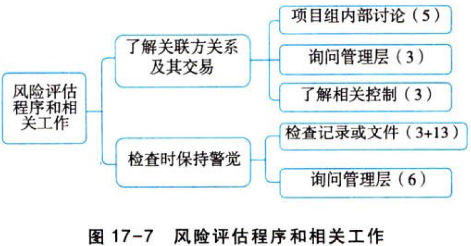

### 2.8.14. 了解关联方关系及其交易

#### 2.8.14.1. 项目组内部讨论

#### 2.8.14.2. 询问管理层

#### 2.8.14.3. 了解与关联方关系及其交易相关的控制

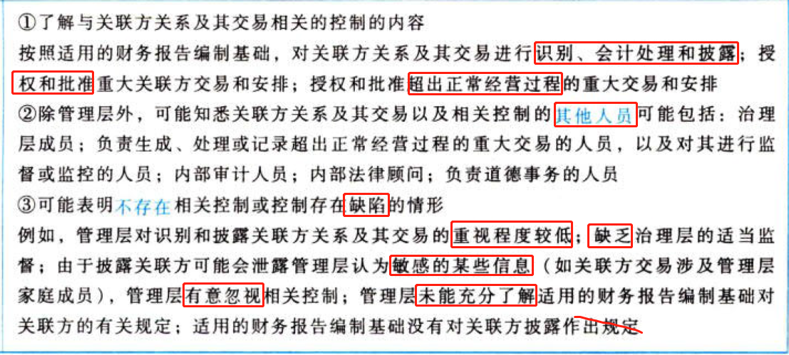

### 2.8.15. 在检查时保持警觉

#### 2.8.15.4. 检查记录或文件

注册会计师应当检查以及可以检查的记录或文件，归纳如下表。

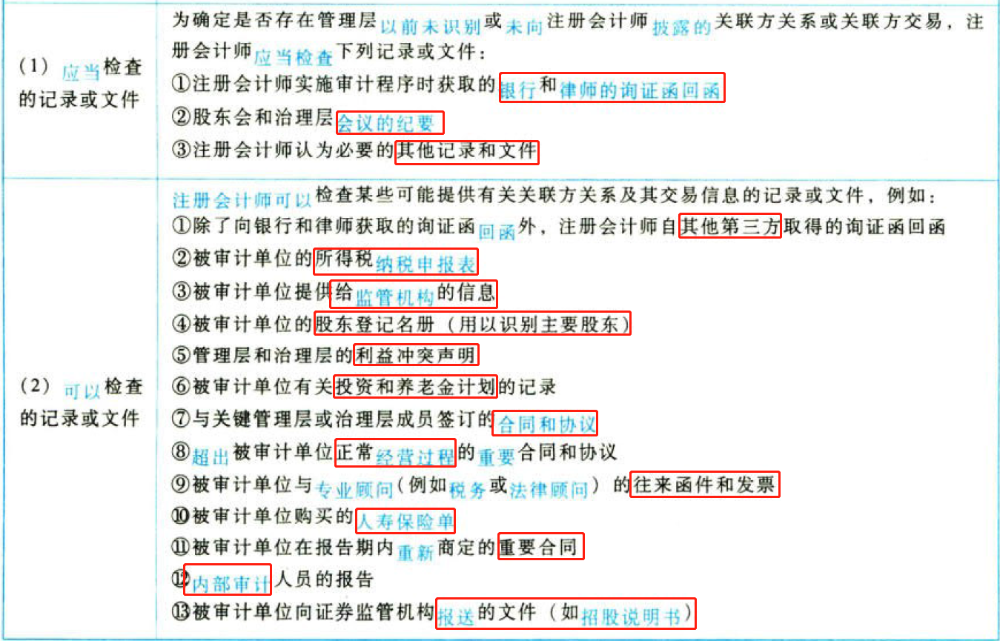

#### 2.8.15.5. 询问管理层

如果识别出超出正常经营过程的重大交易，注册会计师应当向管理层询问这些交易的性质以及是否涉及关联方。超出正常经营过程的交易的例子可能包括：

（1）复杂的股权交易，如公司重组或收购；

（2）与处于公司法制不健全的国家或地区的境外实体之间的交易；

（3）对外提供厂房租赁或管理服务，而没有收取对价；

（4）具有异常大领折扣或退货的销售业务；

（5）循环交易，如售后回购交易；

（6）在合同期限届满之前变更条款的交易。

## 2.9. ［考点二］识别和评估重大错报风险:star: :star: 

注册会计师识别和评估关联方关系及其交易的重大错报风险的要求及考虑因素，归纳如下表。

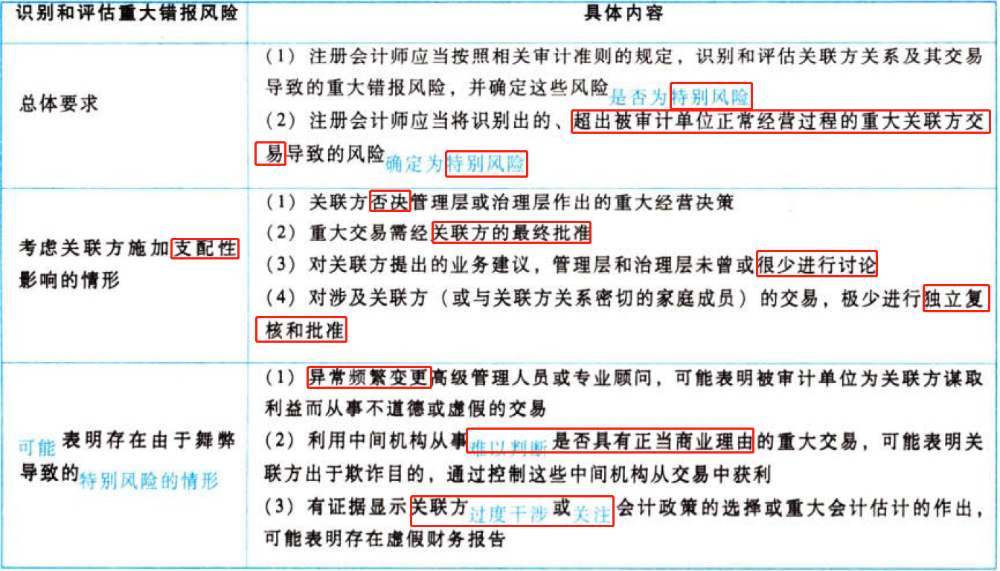

超出正常经营过程的重大关联方交易导致的风险就是特别风除，作为“结论”或者“真理”记住。

## 2.10. ［考点三］针对重大错报风险的应对措施:star: :star: :star: 

### 2.10.16. 识别出管理层以前未识别出或未披露的关联方关系或重大关联方交易时的应对措施

如果识别出管理层以前来识别出或未向注册会计师披露的关联方关系或重大关联方交易，注册会计师应当：

（1）立即将相关倩息向项目组其他成员通报；

（2）在适用的财务报告编制基础对关联方作出规定的情况下，要求管理层识别与新识别出的关联方之间发生的所有交易，以便注册会计师作出进一步评价，并询问与关联方关系及其交易相关的控制为何未能识别或披露该关联方关系或交易；

（3）对新识别出的关联方或重大关联方交易实施恰当的实质性程序；

（4）重新考虑可能存在管理层以前未识别出或未向注册会计师披露的其他关联方或重大关联方交易的风险，如有必要，实施追加的审计程序；

（5）如果管理层不披露关联方关系或交易看似是有意的，因而显示可能存在由于舞弊导致的重大错报风险，评价这一情况对审计的影响。注册会计师因此还可能考虑是否有必要重新评价管理层对询问的答复以及管理层声明的可靠性。

这里的“应对措施”需要大家记住“关键词”，属于“恒考点”。

### 2.10.17. 识别出超出正常经营过程的重大关联方交易的应对措施

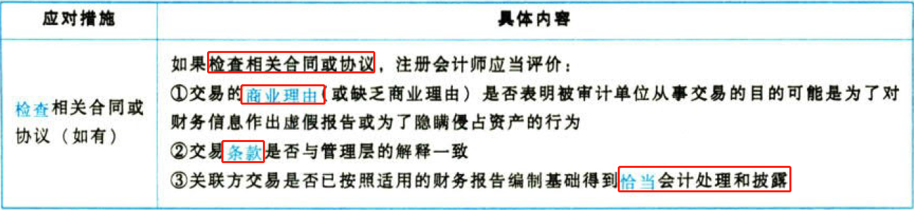

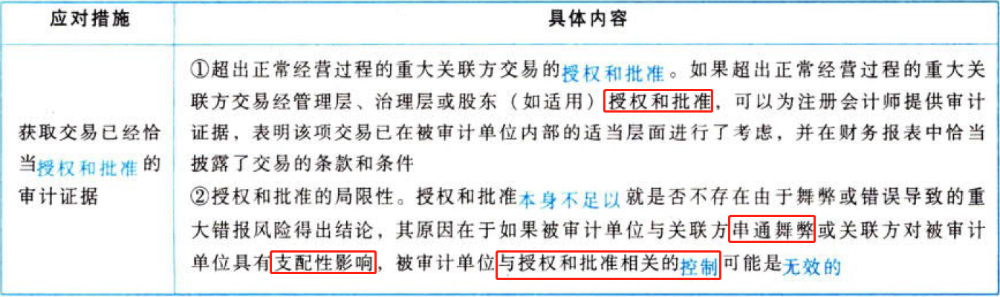

## 2.11. ［考点四］评价会计处理和披露:star: 

### 2.11.18. 形成审计意见时评价的内容

（1）识别出的关联方关系及其交易是否已按照适用的财务报告编制基础得到恰当会计处理和披露。

（2）关联方关系及其交易是否导致财务报表未实现公允反映。

### 2.11.19. 评价错报或交易的金额和性质

（1）《中国注册会计师审计准则第1251号——评价审计过程中识别出的错报》要求注册会计师在评价错报是否重大时，考虑错报的金额和性质以及错报发生的特定情况。

（2）对财务报表使用者而言，某项交易的重要程度，可能不仅取决于所记录的交易金额，还取决于其他特定的相关因素，如关联方关系的性质。

### 2.11.20. 评价披露的可理解性

（1）注册会计师按照适用的财务报告编制基础的规定评价被审计单位对关联方关系及其交易的披露，需要考虑被审计单位是否己对关联方关系及其交易进行了恰当汇总和列报，以使披露具有可理解性。

（2）当存在下列情形之一时，表明管理层对关联方交易的披露可能不具有可理解性，包括：

①关联方交易的商业理由以及交易对财务报表的影响披露不清楚，或存在错报；

②未适当披露为理解关联方交易所必需的关键条款、条件或其他要素。

## 2.12. ［考点五］真他相关审计程序:star: :star: :star: 

对关联方关系及其交易的其他审计程序主要包括在取书面声明和与治理层沟通，归纳如下表。

### 2.12.21. 获取书面声明

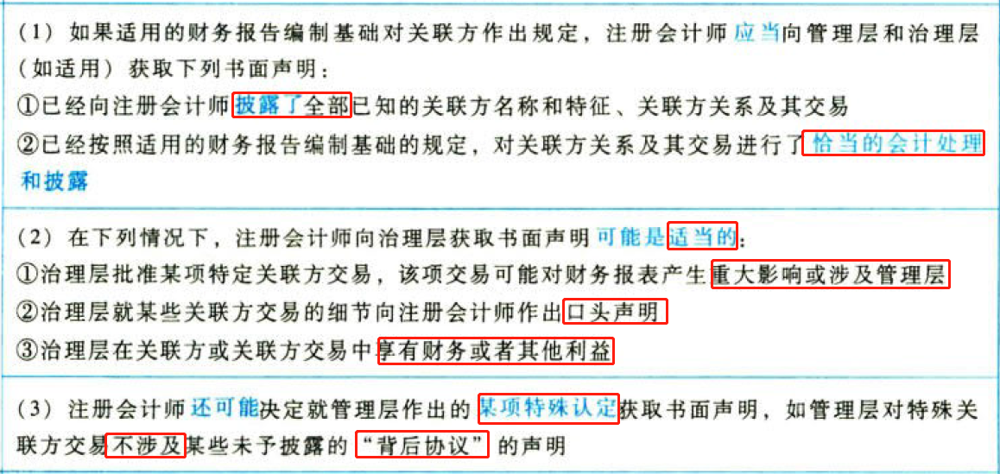

### 2.12.22. 与治理层的沟通

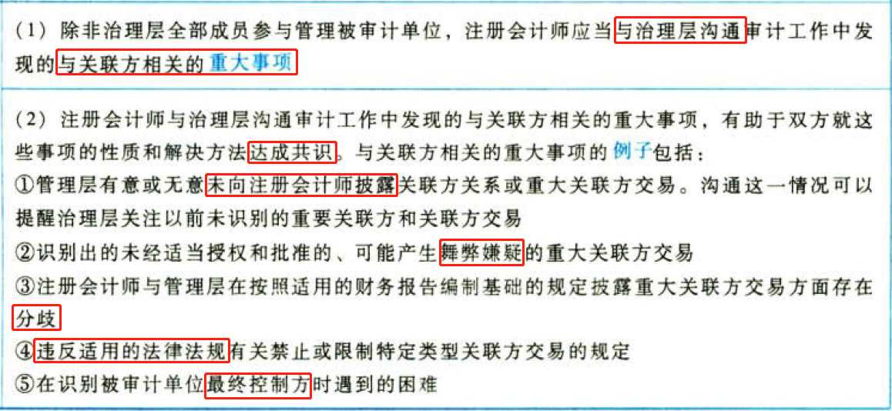

# 3. 考虑持续经营假设

## 3.13. ［考点一］对持续经营假设的责任:star: 

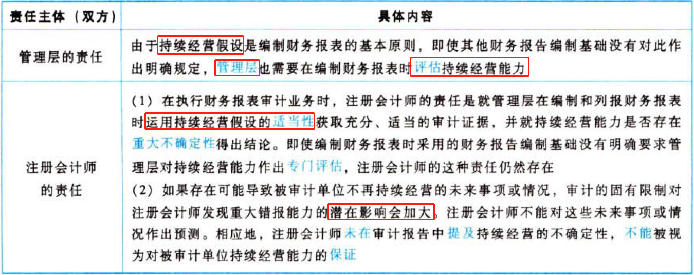

## 3.14. ［考点二］风险评估程序和相关活动:star: 

注册会计师应当识别财务、经营和其他方面存在的可能导致对持续经营假设产生重大疑虑的事项或情况，归纳如下表。

### 3.14.23. 财务方面

### 3.14.24. 经营方面

### 3.14.25. 其他方面

“存在重大疑虑的事项或情况”与“存在重大不确定性”是完全不同的两个概念：注册会计师通过识别和评估被审计单位在财务方面、经营方面和其他方面存在的重大疑虑的事项或情况，来评价被审计单位将续经营假设是否存在重大不确定性。

## 3.15. ［考点三］评价管理层对持续经营能力作出的评估:star: :star: 

注册会计师应当评价管理层对持续经营能力作出的评估，归纳如下表。

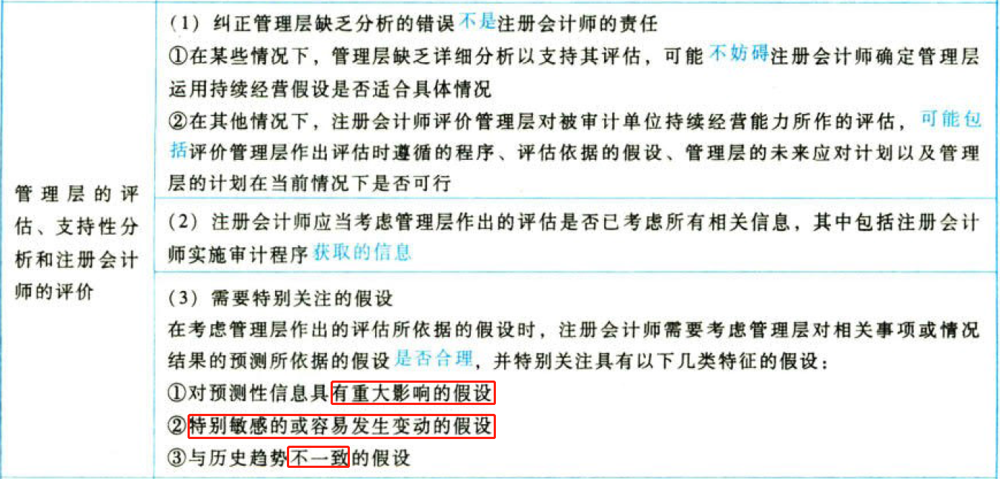

## 3.16. ［考点四］识别出事项或情况时实施追加的审计程序:star: :star: 

注册会计师识别出可能导致对持续经营能力产生重大疑虑的事项或情况，应当实施追加的审计程序的要求和内容，归纳如下表。

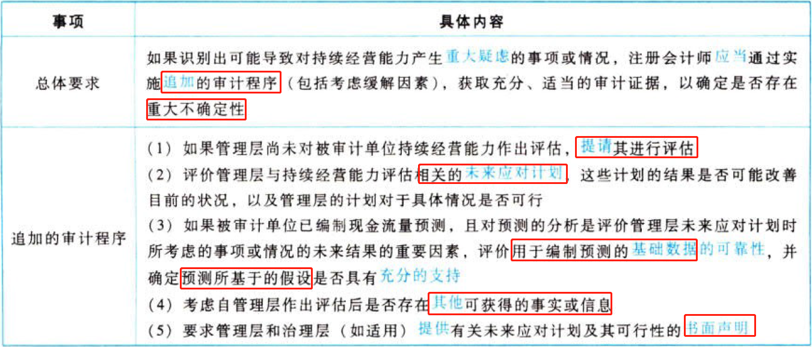

## 3.17. ［考点五］审计结论:star: :star: :star: 

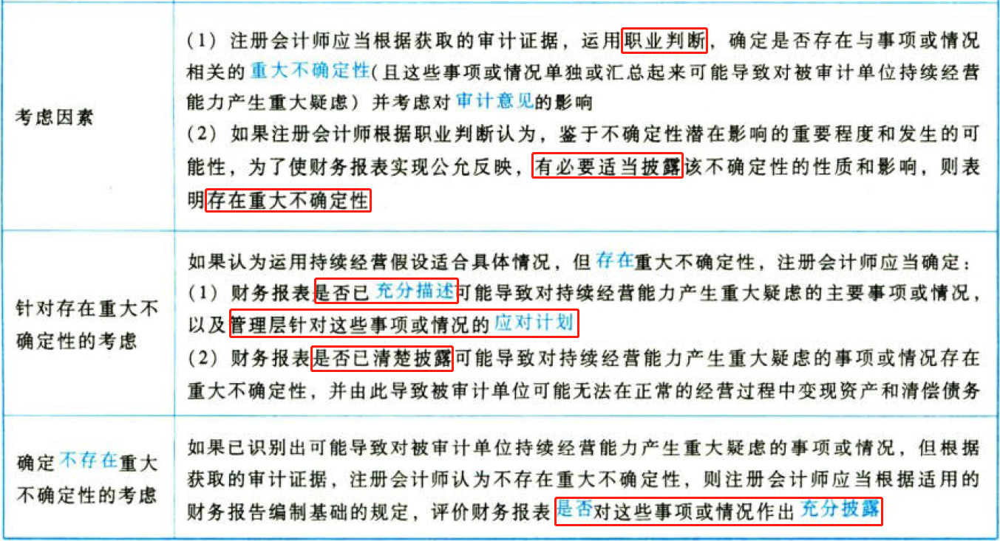

## 3.18. ［考点六］对审计报告的影响:star: :star: :star: 

### 3.18.26. 持续经营假设适当，但存在重大不确定性

#### 3.18.26.6. 无保留意见审计报告

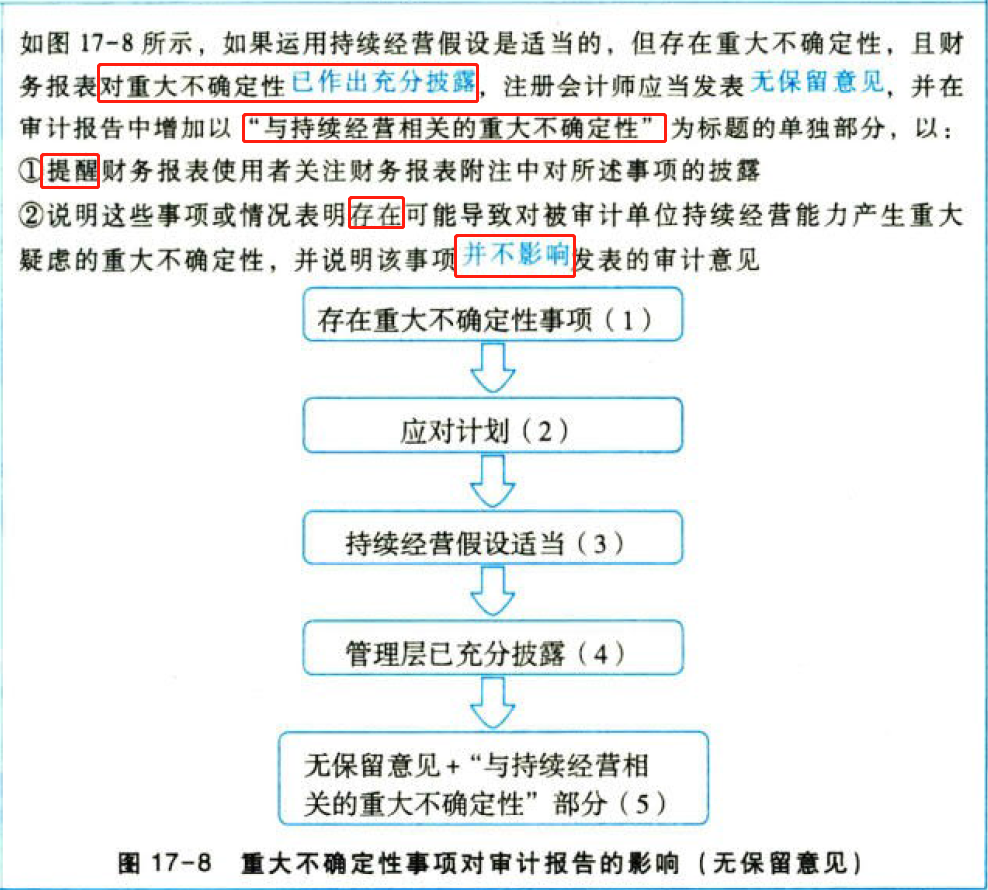

#### 3.18.26.7. 无法表示意见审计报告

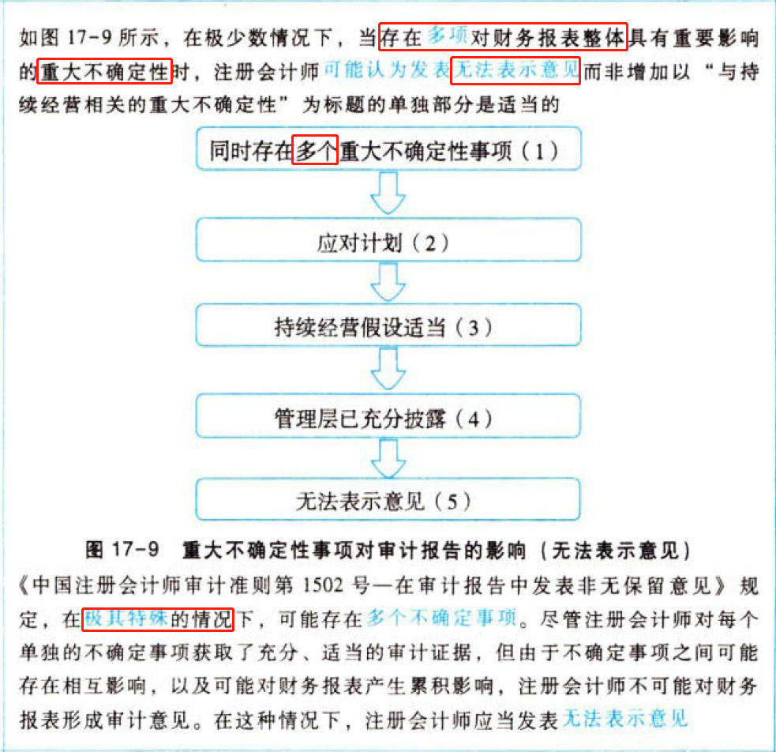

#### 3.18.26.8. 保留意见或否定意见审计报告

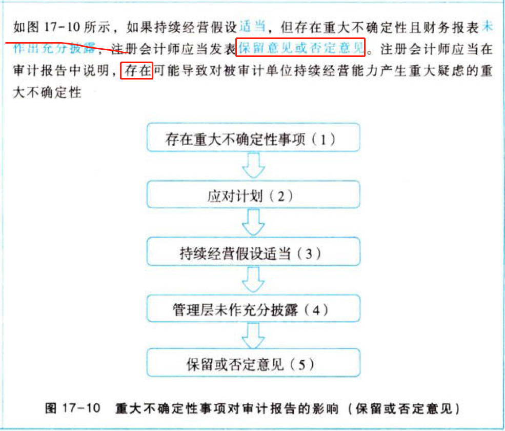

### 3.18.27. 持续经营假设不适当

#### 3.18.27.9. 否定意见审计报告

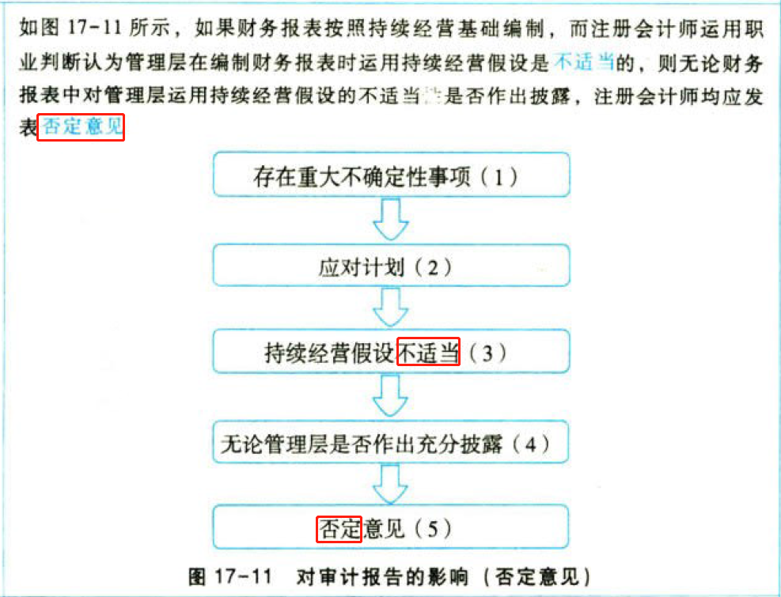

#### 3.18.27.10. 采用替代基础编制财务报表，发表无保留意见

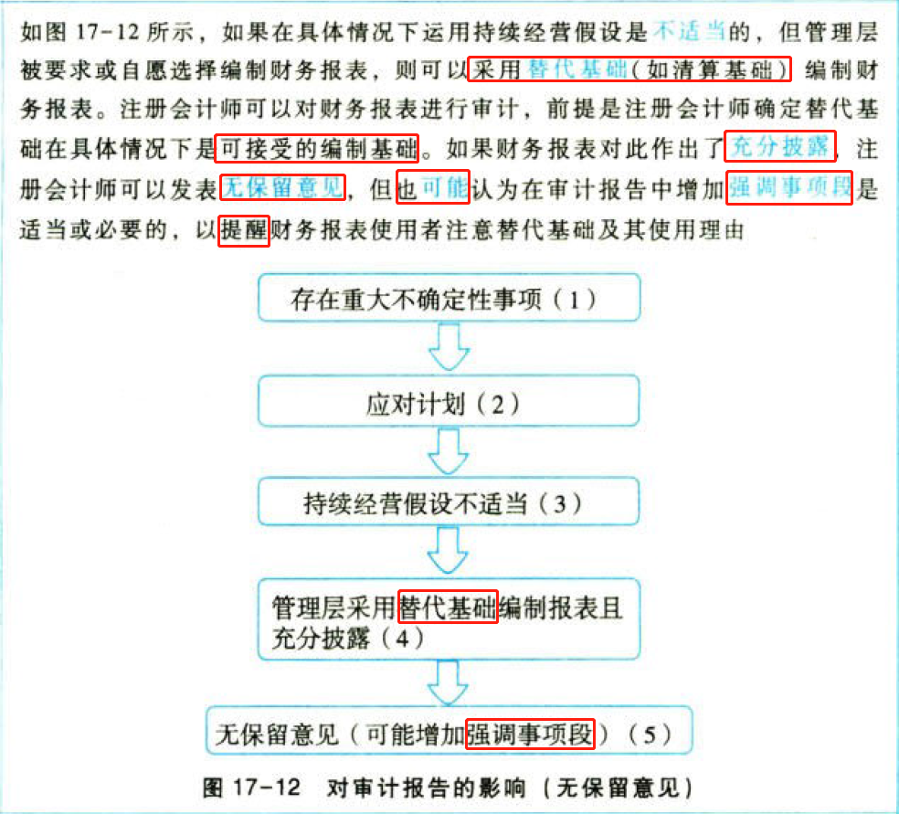

### 3.18.28. 严重拖延对财务报表的批准

## 3.19. ［考点七］与治理层沟通:star: :star: 

注册会计师应当与治理层就识别出的可能导致对被审计单位持续经营能力产生重大疑虑的事项或情况进行沟通，除非治理层全部成员参与管理被审计单位。

与治理层的沟通应当包括下列方面：

（1）这些事项或情况是否构成重大不确定性；

（2）管理层在编制财务报表时运用持续经营假设是否造当；

（3）财务报表中的相关披露是否充分；

（4）对审计报告的影响（如适用）。

# 4. 首次接受委托时对期初余额的审计

## 4.20. ［考点一］期初余额的含义:star: 

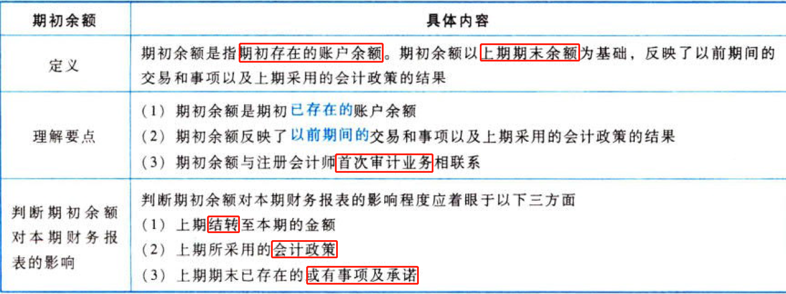

## 4.21. ［考点二］期初余额的审计目标:star: :star: 

（1）确定期初余额是否含有对本期财务报表产生重大影响的错报。

（2）确定期初余额反映的恰当的会计政策是否在本期财务报表中得到一贯运用，或会计政策的变更是否已按照适用的财务报告编制基础作出恰当的会计处理和充分的列报与披露。

## 4.22. ［考点三］期初余额的审计程序:star: :star: :star: 

### 4.22.29. 总体要求

为达到期初余额的审计目标，注册会计师应当阅读被审计单位最近期间的财务报表和相关披露，以及前任注册会计师出具的审计报告（如有），在取与期初余额相关的信息。

### 4.22.30. 影响期初余额的审计程序性质和范围的事项

注册会计师对期初余额需要实施的审计程序的性质和范围取决于下列事项：

（1）被审计单位运用的会计政策；

（2）账户余额、各类交易和披露的性质以及本期财务报表存在的重大错报风险；

（3）期初余额相对于本期财务报表的重要程度；

（4）上期财务报表是否经过审计，如果经过审计，前任注册会计师的意见是否为非无保留意见。

### 4.22.31. 对期初余额实施的审计程序

（1）确定上期期末余额是否已正确结转至本期，或在适当的情况下己作出重新表述。

（2）确定期初余额是否反映对恰当会计政策的运用。

（3）实施一项或多项审计程序。

①如果上期财务报表已经审计，查阅前任注册会计师的审计工作底稿，以获取有关期初余额的审计证据。包括以下工作：

a.查阅前任注册会计师的工作底稿。包括查阅前任注册会计师工作底稿中的所有重要审计领域；考虑前任注册会叶师是否已实施审计程序，收集充分、适当的审计证据，以支持资产负债表重要账户期初余额；复核前任注册会计师建议的调整分录和未更正错报汇总表，并评价其对当期审计的影响。

b.考虑前任注册会计师的独立性和专业胜任能力。

c与前任注册会计师沟通时的考虑。

②评价本期实施的审计程序是否提供了有关期初余额的审计证据。

③实施其他专门的审计程序，以获取有关期初余额的审计证据。

### 4.22.32. 实施其他专门审计程序

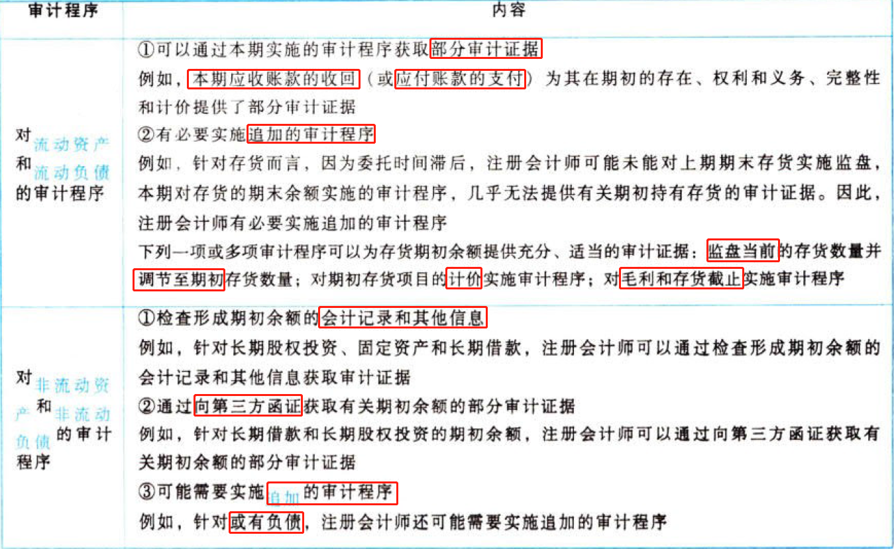

## 4.23. ［考点四］审计结论和审计报告:star: :star: 

### 4.23.33. 审计后不能获取充分、适当的审计证据

如果无法获取有关期初余额的充分、适当的审计证据，注册会计师应当在审计报告中发表下列类型之一的非无保留意见：

（1）发表适合具体情况的保留意见或无法表示意见；

（2）除非法律法规禁止，对经营成果和现金流量（如相关）发表保留意见或无法表示意见，而对财务状况发表无保留意见。

### 4.23.34. 期初余额存在对本期财务报表产生重大影响的错报的处理

（1）注册会计师应当告知管理层；

（2）如果上期财务报表由前任注册会计师审计，注册会计师还应当提请管理层告知前任注册会计师；

（3）如果错报的影响未能得到正确的会计处理和恰当的列报，注册会计师应当对财务报表发表保留意见或否定意见。

### 4.23.35. 会计政策变更对审计报告的影响

如果认为按照适用的财务报告编制基础与期初余额相关的会计政策未能在本期得到一贯运用，或者会计政策的变更未能得到恰当的会计处理或适当的列报与披露，注册会计师应当对财务报表发表保留意见或否定意见。

### 4.23.36. 前任注册会计师对上期财务报表发表了非无保留意见

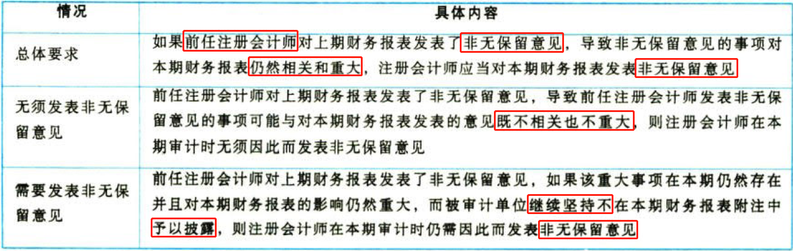

［阶段总结］本编的五个章节均为特殊项目的审计。“特殊项目”是相对于《审计》教材第三编各类交易和账户余额审计而言的，虽然这些特殊项目不直接构成财务报表的“表内”项目，但均与财务报褒项目相关联。

针对特殊项目，注册会计师依然应当按照第二编审计测试流程，对财务报表重大错报风险可能产生影响的特殊事项进行“识别、评估和应对”，特别是在风险应对的审计程序中，有的需要提请被审计单位调整财务报表某些具体项目的金额（比如第十三章的舞弊事项、第十七章的会计估计），有的同时需要提请被审计单位在财务报表附注中进行披露（比如第十三章的违反法律法规行为的事项、第十七章的关联方关系及其交易）。注册会计师通过对特殊项目实施审计形成的结论很可能需要对财务报表项目进行重新确认、计量和列报。

# 5. 总结

End。
