C18完成审计工作

# 1. 完成审计工作概述

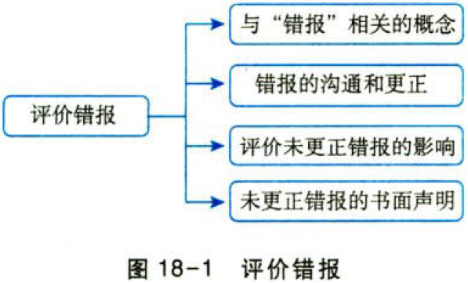

## 1.1. ［考点一］与“成本”相关的概念:star: :star: 

（1）错报的定义。

错报，是指某一财务报表项目的金额、分类或列报，与按照适用的财务报告编制基础应当列示的金额、分类或列报之间存在的差异；或根据注册会计师的判断，为使财务报表在所有重大方面实现公允反映，需要对金额、分类或列报作出的必要调整（链接教材2.3）。

（2）错报的类别（链接教材2.3）。

为了帮助注册会计师评价审计过程中累积的错报的影响以及与管理层和治理层沟通错报事项，将错报的三种类别及注册会计师的应对措施汇总如下表。

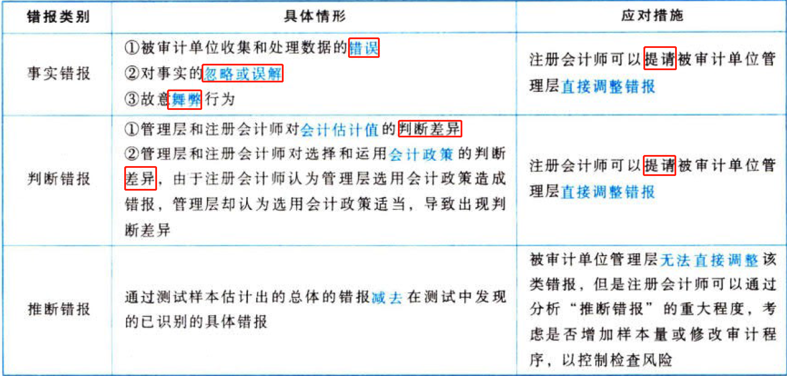

（3）明显微小错报（链接教材2.3）。

注册会计师需要在制定总体审计策略和具体审计计划时，确定一个明显微小错报的临界值，低于该临界值的错报视为明显微小的错报。低于明显微小错报临界值的错报可以不累积。

（4）未更正错报。

未更正错报是指注册会计师在审计过程中累积的（指不低于明显微小错报临界值的）且被审计单位未予更正的错报。

## 1.2. ［考点二］错报的沟通和更正:star: :star: 

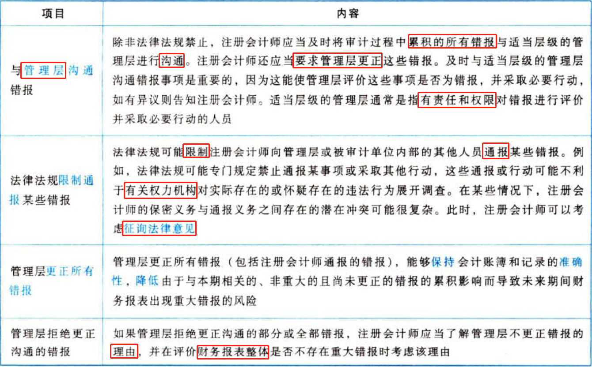

## 1.3. ［考点三］评价未更正错报的影响:star: :star: :star: 

### 1.3.1. 评价错报前可能需要对重要性作出修改

（1）注册会计师在确定重要性时，通常依据对被审计单位财务结果的估计，因为此时可能尚不知道实际的财务结果。因此，在评价未更正错报的影响之前，注册会计师可能有必要依据实际的财务结果对重要性作出修改。

（2）如果在审计过程中获知了某项信息，而该信息可能导致注册会计师确定与原来不同的财务报表整体重要性或者特定类别交易、账户余额或披露的一个或多个重要性水平（如适用），注册会计师应当予以修改。因此，在注册会计师评价未更正错报的影响之前，可能已经对重要性或重要性水平（如适用）作出重大修改。

（3）如果注册会计师对重要性或重要性水平（如适用）进行的重新评价导致需要确定较低的金额，则应重新考虑实际执行的重要性和进一步审计程序的性质、时间安排和范围的适当性，以获取充分、适当的审计证据，作为发表审计意见的基础。

### 1.3.2. 需要考虑每一单项错报对重要性的影响

注册会计师需要考虑每一单项错报，以评价其对相关类别的交易、账户余额或披露的影响，包括评价该项错报是否超过特定类别的交易、账户余额或披露的重要性水平（如适用）。

### 1.3.3. 某一单项错报的抵销是否恰当

（1）如果注册会计师认为某一单项错报是重大的，则该项错报不太可能被其他错报抵销。

例如，如果收入存在重大高估，即使这项错报对收益的影响完全可被相同金额的费用高估所抵销，注册会计师仍认为财务报表整体存在重大错报。

（2）对于同一账户余额或同一类别的交易内部的错报，这种抵销可能是适当的。然而，在得出抵销非重大错报是适当的这一结论之前，需要考虑可能存在其他未被发现的错报的风险。

### 1.3.4. 确定一项分类错报是否重大，需要进行定性评估

（1）确定一项分类错报是否重大，需要进行定性评估。例如，分类错报对负债或其他合同条款的影响，对单个财务报表项目或小计数的影响，以及对关键比率的影响。

（2）即使分类错报超过了在评价其他错报时运用的重要性水平，注册会计师可能仍然认为该分类错报对财务报表整体不产生重大影响。

### 1.3.5. 错报性质导致错报是重大的

在某些情况下，即使某些错报低于财务报表整体的重要性，但因与这些错报相关的某些情况，在将其单独或连同在审计过程中累积的其他错报一并考虑时，注册会计师也可能将这些错报评价为重大错报。

可能影响注册会计师对错报的评价的情况：

（1）错报对遵守监管要求的影响程度。

（2）错报对遵守债务合同或其他合同条款的影响程度。

（3）错报与会计政策的不正确选择或运用相关，这些会计政策的不正确选择或运用对当期财务报表不产生重大影响，但可能对未来期间财务报表产生重大影响。

（4）错报掩盖收益的变化或其他趋势的程度（尤其是在结合宏观经济背景和行业状况进行考虑时）。

（5）错报对用于评价被审计单位财务状况、经营成果或现金流量的有关比率的影响程度。

（6）错报对财务报表中列报的分部信息的影响程度。例如，错报事项对某一分部或对被审计单位的经营或盈利能力有重大影响的其他组成部分的重要程度。

（7）错报对增加管理层薪酬的影响程度。例如，管理层通过达到有关奖金或其他激励政策规定的要求以增加薪酬。

（8）相对于注册会计师所了解的以前向财务报表使用者传达的信息（如盈利预测），错报是重大的。

（9）错报对涉及特定机构成人员的项目的相关程度。例如，与被审计单位发生交易的外部机构或人员是否与管理层成员有关联关系。

（10）错报涉及对某些信息的遗漏，尽管适用的财务报告编制基础未对这些信息作出明确规定，但是注册会计师根据职业判断认为这些信息对财务报表使用者了解被审计单位的财务状况、经营成果或现金流量是重要的。

（11）错报对其他信息（如包含在“管理层讨论与分析”或“经营与财务回顾”中的信息）的影响程度，这些信息与已审计财务报表一同披露，并被合理预期可能影响财务报表使用者作出的经济决策。

除非法律法规禁止，注册会计师应当与治理层沟通未更正错报，以及这些错报单独或汇总起来可能对审计意见产生的影响。在沟通时，注册会计师应当逐项指明重大的未更正错报。注册会计师应当要求被审计单位更正未更正错报。

注册会计师应当与治理层沟通与以前期间相关的未更正错报对相关类别的交易、账户余额就披露以及财务报表整体的影响。

## 1.4. ［考点四］有关未更正错报的书面声明:star: :star: 

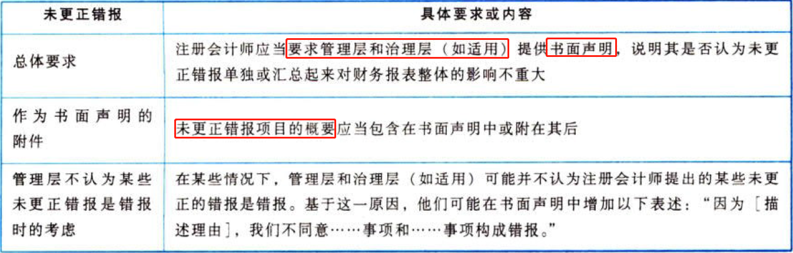

## 1.5. ［考点五］复核审计工作底稿:star: :star: 

审计工作底稿的复核分为项目组内部复核和项目组外部复核，其中项目质量控制复核（外部复核，链接教材21.5）跨章节关联，如图18-2所示。

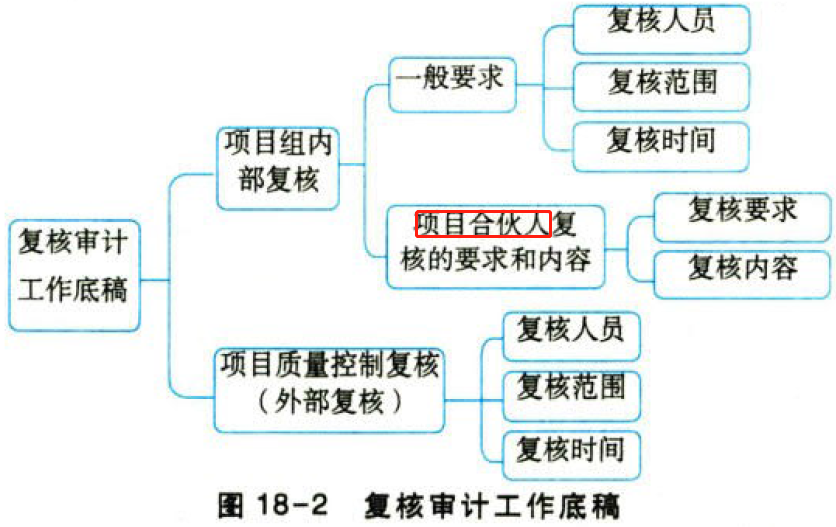

### 1.5.6. 项目组内部复核

（1）一般要求。

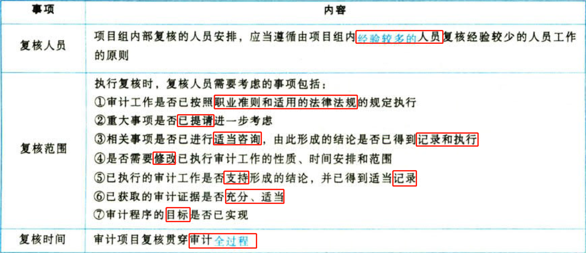

（2）项目合伙人复核的要求和内容。

关于“项目合伙人复核”的知识点，需要大家归纳总结并掌握。

（1）项目合伙人无须复核所有审计工作底稿；

（2）项目合伙人根据复核后的底稿得出结论；

（3）在审计报告日或审计报告日之前，项目合伙人应当通过复核审计工作底稿与项目组讨论，确信已获取充分、适当的审计证据，支持得出的结论和拟出具的审计报告。

### 1.5.7. 项目质量控制复核

会计师事务所应当制定政策和程序，要求对特定业务（包括所有上市实体财务报表审计）实施项目质量控制复核，以客观评价项目组作出的重大判断以及在编制报告时得出的结论。

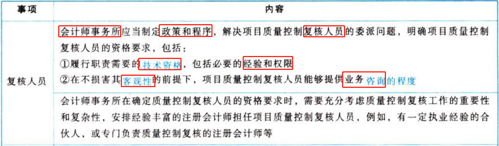

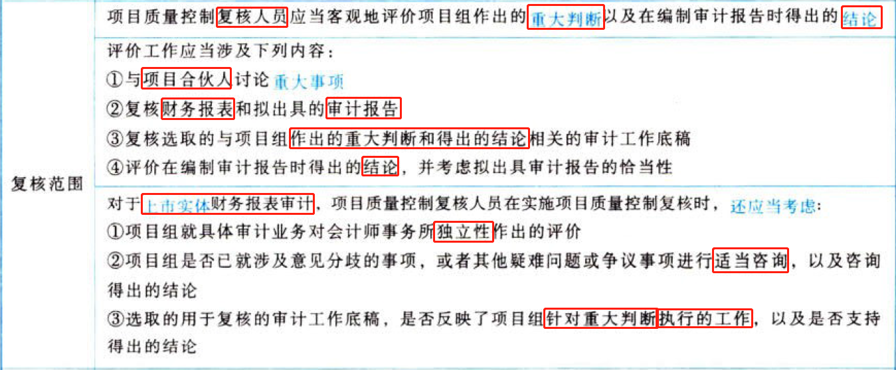

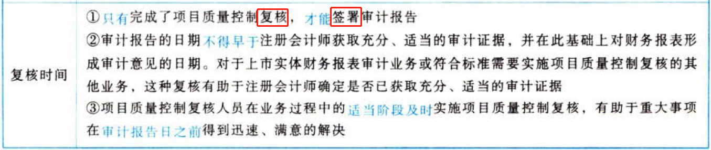

# 2. 期后事项

## 2.6. ［考点一］期后事项的定义与种类:star: :star: :star: 

### 2.6.8. 期后事项的定义

期后事项是指财务报表日至审计报告日之间发生的事项，以及注册会计师在审计报告日后知悉的事实。

如图18-4所示，“发生的事项”是指事项的“原因”在财务报表日前，“结果”在审计报告日前；“知悉的事实”是指审计报告日后（包括第二时段和第三时段）才发现的事项，这些事项的“原因”也在财务报表日前，“结果”也在审计报告日前。

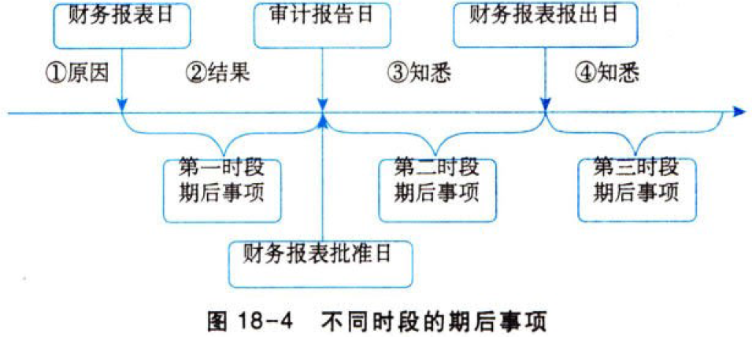

### 2.6.9. 期后事项的种类

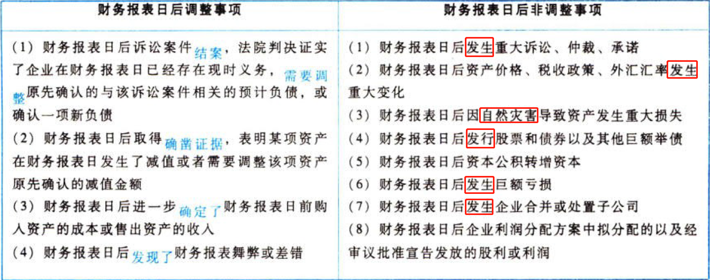

## 2.7. ［考点二］不同时段期后事顶及相关关责任举例:star: :star: :star: 

假设ABC会计师事务所审计甲公司2019年度财务报表，2020年3月5日为审计报告日，2020年3月10日为财务报表报出日，对不同时段期后事项的责任划分如下表所示。

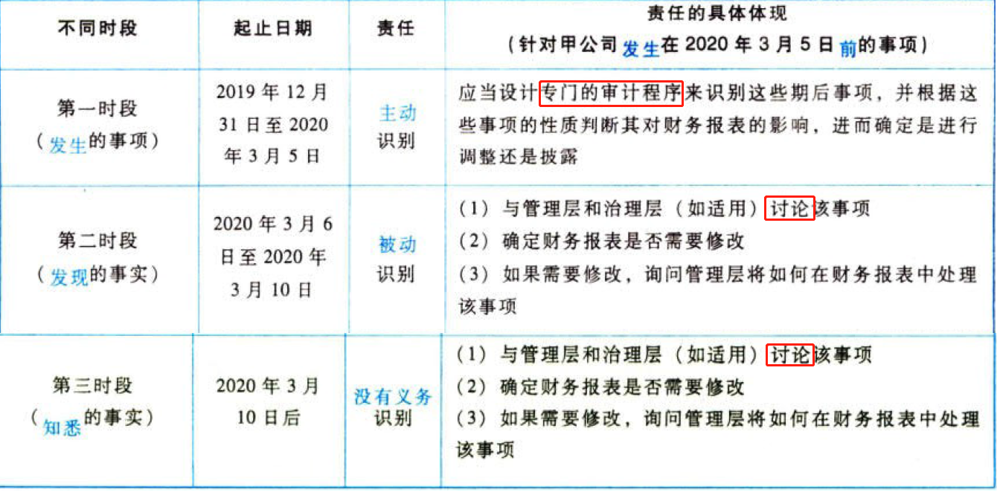

## 2.8. ［考点三］主动识别第一时段期后事顶:star: :star: :star: 

## 2.9. ［考点四］被动识别第二时段期后事项:star: :star: :star: 

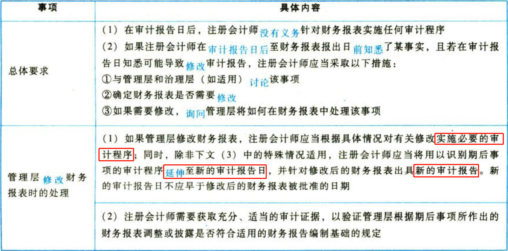

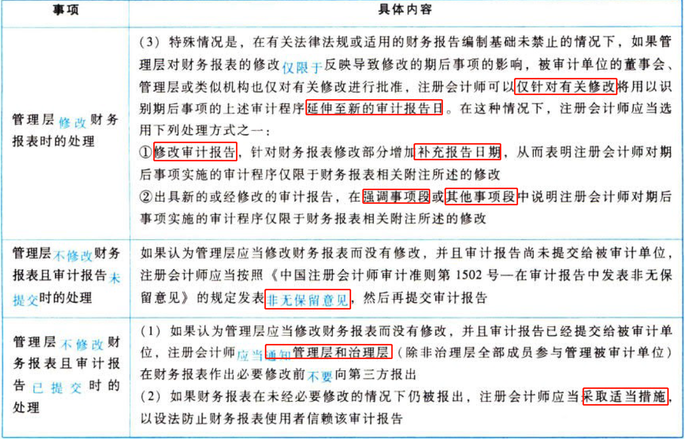

## 2.10. ［考点五］没有义务识别第三时段期后事项:star: :star: :star: 

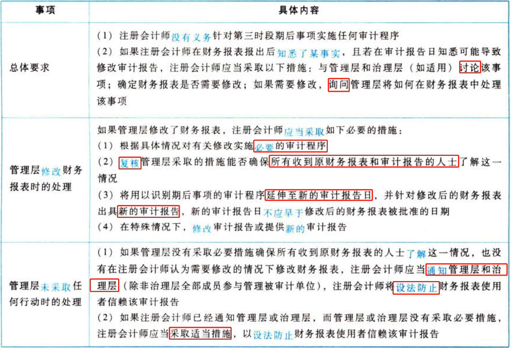

# 3. 书面声明

## 3.11. ［考点一］书面声明的含义:star: :star: :star: 

## 3.12. ［考点二］针对管理层责任的书面声明:star: 

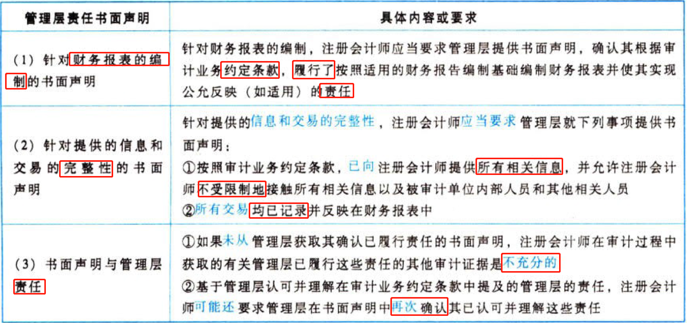

## 3.13. ［考点三］其他书面声明:star: :star: 

### 3.13.10. 基本书面声明与其他书面声明的关系

（1）基本书面声明主要是指审计准则要求的有关管理层责任的书面声明。

（2）其他书面声明可能是对基本书面声明的补充，但不构成其组成部分。

### 3.13.11. 关于财务报表的额外书面声明

（1）会计政策的选择和运用是否适当。

（2）是否按照适用的财务报告编制基础对下列事项（如相关）进行了确认、计量、列报或披露：

①可能影响资产和负债账面价值或分类的计划或意图；

②负债（包括实际负债和或有负债）；

③资产的所有权或控制权，资产的留置权或其他物权，用于担保的抵押资产；

④可能影响财务报表的法律法规及合同（包括违反法律法规及合同的行为）。

### 3.13.12. 与向注册会计师提供信息有关的额外书面声明

除了针对管理层提供的信息和交易的完整性的书面声明外，注册会计师可能认为有必要要求管理层提供书面声明，确认其已将注意到的所有内部控制缺陷向注册会计师通报。

### 3.13.13. 有关特定认定的书面声明

如果管理层的意图对投资的计价基础非常重要，但若不能从管理层获取有关该项投资意图的书面声明，注册会计师就不可能获取充分、适当的审计证据。

尽管书面声明能够提供必要的审计证据，但其本身并不能为财务报表特定认定提供充分、适当的审计证据。

## 3.14. ［考点四］书面声明的日期和涵盖的期间:star: :star: :star: 

### 3.14.14. 书面声明的日期

书面声明的日期应当尽量接近对财务报表出具审计报告的日期，但不得在审计报告日后。书面声明应当涵盖审计报告针对的所有财务报表和期间。

由于书面声明是必要的审计证据，在管理层签署书面声明前，注册会计师不能发表审计意见，也不能签署审计报告。

### 3.14.15. 书面声明涵盖的期间

（1）在某些情况下，管理层需要再次确认以前期间作出的书面声明是否依然适当，可能需要更新以前期间所作的书面声明。更新后的书面声明需要表明，以前期间所作的声明是否发生了变化，以及发生了什么变化（如有）。

（2）在审计实务中，可能会出现在审计报告中提及的所有期间内，现任管理层均尚未就任的情形，现任管理层可能由此声称无法就审计报告中提及的所有期间提供部分或全部书面声明。然而，这一事实并不能减轻现任管理层对财务报表整体的责任。相应地，注册会计师仍然需要向现任管理层获取涵盖整个相关期间的书面声明。

## 3.15. ［考点五］对书面声明可靠性的疑虑:star: :star: 

### 3.15.16. 对管理层的胜任能力、诚信、道德价值观或勤勉尽责存在疑虑

（1）如果对管理层的胜任能力、诚信、道德价值观或勤勉尽责存在疑虑，或者对管理层在这些方面的承诺或贯彻执行存在疑虑，注册会计师应当确定这些疑虑对书面或口头声明和审计证据总体的可靠性可能产生的影响。注册会计师可能认为，管理层在财务报表中作出不实陈述的风险很大，以至于审计工作无法进行。

（2）在上述情况下，除非治理层采取适当的纠正措施，否则注册会计师可能需要考虑解除业务约定（如果法律法规允许）。

（3）很多时候，治理层采取的纠正措施可能并不足以使注册会计师发表无保留意见。

### 3.15.17. 书面声明与其他审计证据不一致

（1）如果书面声明与其他审计证据不一致，注册会计师应当实施审计程序以设法解决这些问题。

（2）注册会计师可能需要考虑风险评估结果是否仍然适当。如果认为不适当，注册会计师需要修正风险评估结果，并确定进一步审计程序的性质、时间安排和范围，以应对评估的风险。

（3）如果问题仍未解决，注册会计师应当重新考虑对管理层的胜任能力、诚信、道德价值观或勤勉尽责的评估，或者重新考虑对管理层在这些方面的承诺或贯彻执行的评估，并确定书面声明与其他审计证据的不一致对书面或口头声明和审计证据总体的可靠性可能产生的影响。

（4）如果认为书面声明不可靠，注册会计师应当采取适当措施，包括确定其对审计意见可能产生的影响。

## 3.16. ［考点六］管理层不提供要求的书面声明:star: :star: :star: 

注册会计师应当对管理层不提供要求的书面声明采取措施并考虑对审计意见的影响，归纳如下表。

### 3.16.18. 注册会计师的措施

### 3.16.19. 发表无法表示意见的情形

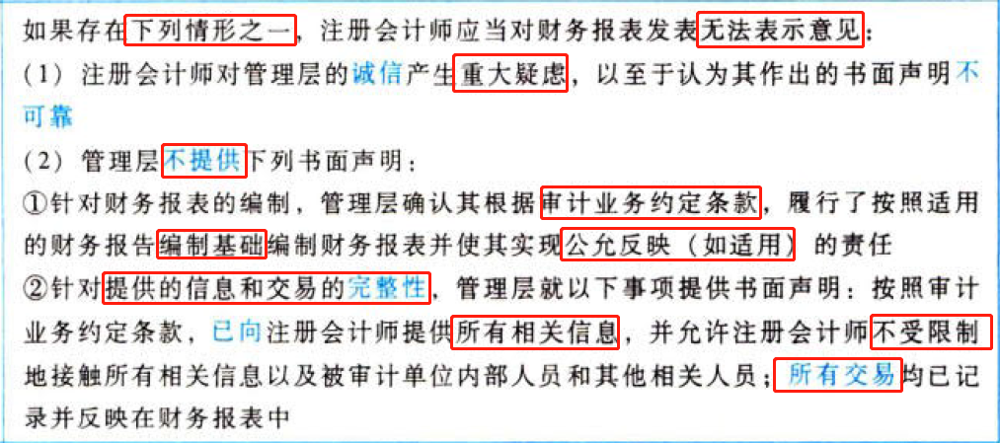

# 4. 总结

End。
