C23审计业务对独立性的要求

# 1. 基本概念和要求

## 1.1. ［考点一］网络事务所:star: 

### 1.1.1. 定义

网络事务所，是指属于某一网络的会计师事务所或实体。会计师事务所与其他会计师事务所或实体构成联合体，旨在增强提供专业服务的能力。

### 1.1.2. 原则要求

如果某一会计师事务所被视为网络事务所，则应当与网络中其他会计师事务所的审计客户保持独立。

### 1.1.3. 判断情形

如图23-1所示，提供了一个简单的决策图，以帮助事务所判断某实体是否属于网络事务所。

一个联合体通过合作，实现任何一个以下情况：

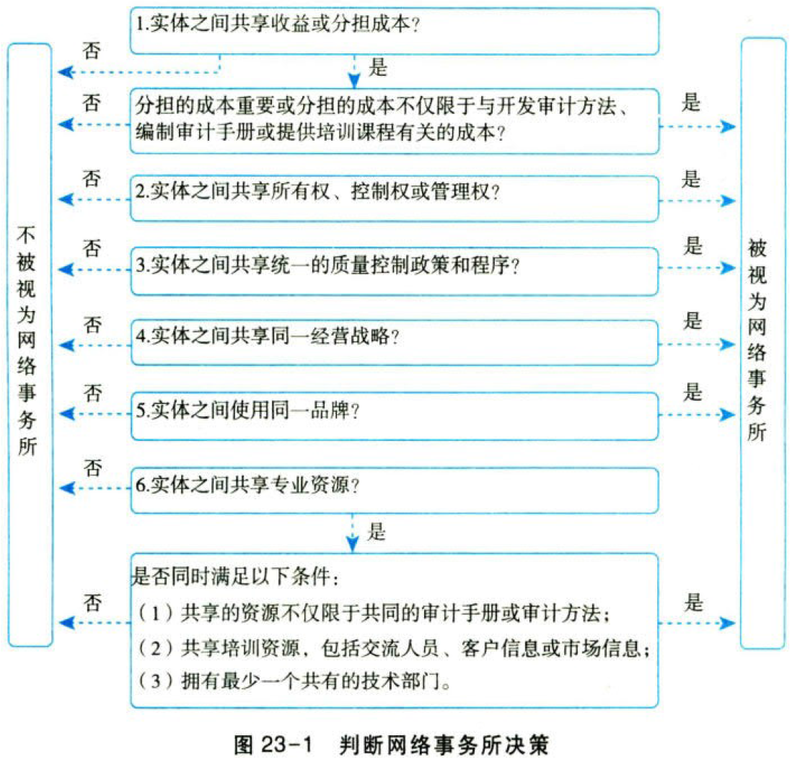

注册会计师可以按照以下六种情形判断一个联合体是否构成网络，具体表述归纳如下表。

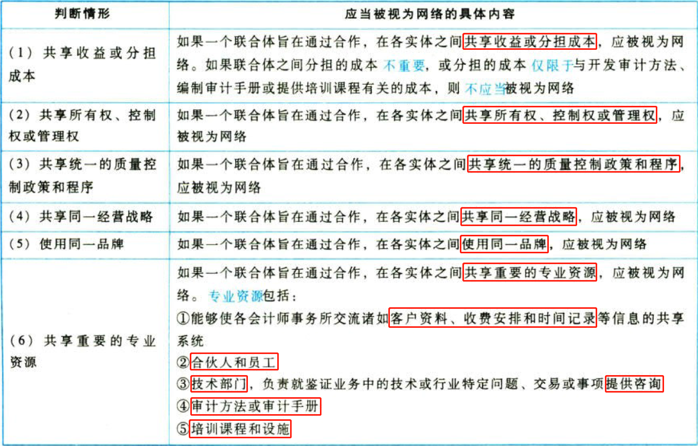

如，ABC会计师事务所连续多年审计甲银行（上市公司）财务报表。2019年10月1日，ABC会计师事务所与甲银行续签了2019年度财务报表审计业务约定书。XYZ公司和ABC会计师事务所使用同一品牌，共享统一的质量控制政策和程序。ABC会计师事务所发现XYZ公司于2019年1月25日接受甲银行委托，为甲银行提供内部控制设计服务。

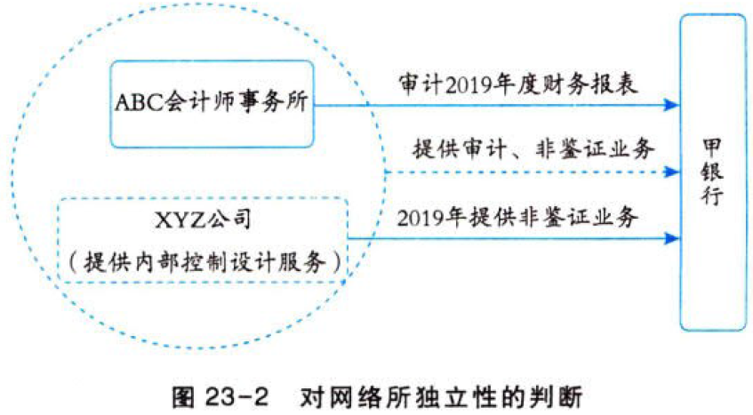

如图23-2，理解的关键有两个方面：第一，ABC会计师事务所和XYZ公司构成网络；第二，XYZ公司为甲银行提供非鉴证业务（内部控制设计服务）相当于ABC会计师事务所为其审计客户甲银行同时提供了禁止的非鉴证业务。所以ABC会计师事务所违反独立性，因为XYZ公司与ABC会计师事务所构成网络，XYZ公司在ABC会计师事务所审计甲银行财务报表涵盖期间（2019年1月1日至2019年12月31日）为甲银行提供的内部控制设计服务，承担了管理层职责，存在因自我评价、自身利益、密切关系对独立性的不利影响。

## 1.2. ［考点二］公众利益实体:star: :star: 

注册会计师判断公众利益实体的涵盖范围和判断因素，归纳如下表。

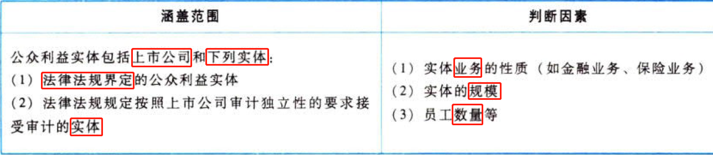

## 1.3. ［考点三］关联实体:star: :star: 

### 1.3.4. 关联实体与审计客户

（1）如果审计客户是上市公司，审计客户包括该客户所有的关联实体。

（2）如果审计客户不是上市公司，审计客户仅包括该客户直接或间接控制的关联实体。

### 1.3.5. 关联实体类别

如图23-3所示，甲公司是会计师事务所或其网络事务所正在审计或拟承接审计的上市实体，甲公司的关联实体包括以下具体情形：

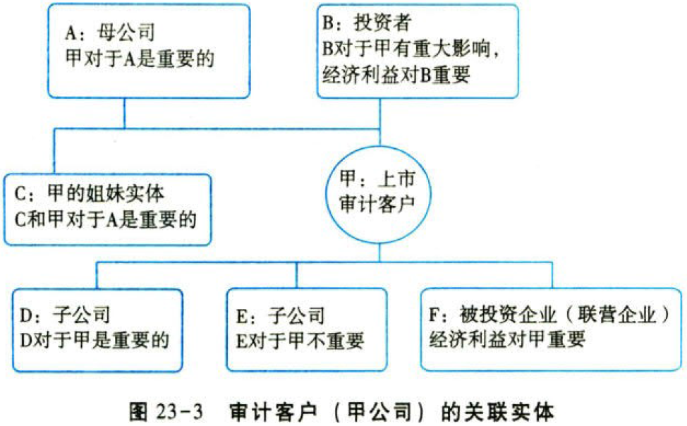

（1）母公司。

母公司是指直接或间接控制被审计单位的实体，且当被审计单位对其重要时，该母公司应当被包含在审计客户的定义中，图23-3中的A公司是甲公司的关联实体。

（2）子公司。

被审计单位的子公司是指由被审计单位直接或间接控制的实体，无论该实体对于被审计单位是否重要，应当被包括在审计客户的定义中，图23-3中的D、E公司均属于甲公司的关联实体。

（3）姐妹实体。

姐妹实体是指与被审计单位处在同一控制下的实体，当两者对其控制实体（母公司）均重要时，该姐妹实体应当被包含在审计客户的定义中，上图中的C公司是甲公司的关联实体。

（4）投资者。

当一个企业（投资者）在被审计单位拥有直接经济利益，并且该企业（投资者）对被审计单位具有重大影响，该投资对于企业（投资者）而言也重要时，该企业（投资者）应当被包括在审计客户的定义中，图23-3中的B公司是甲公司的关联实体。

（5）被投资企业。

当被审计单位在某企业（被投资企业）拥有直接经济利益，且对其具有重大影响，同时该投资对于被审计单位而言也重要时，该被授资企业应当被包括在审计客户的定义中，图23-3中的F公司是甲公司的关联实体。

## 1.4. ［考点四］业务期间:star: :star: :star: 

### 1.4.6. 定义

（1）业务期间，是指自审计项目组开始执行审计业务之日起，至出具审计报告之日止的期间。

（2）如果审计业务具有连续性，业务期间结束日应以其中一方通知解除业务关系或出具最终审计报告两者时间孰晚为准。

### 1.4.7. 独立性要求

注册会计师应当在业务期间和财务报表涵盖期间独立于审计客户。

如圄23-4所示，从2019年财务报表审计来看，注册会计师应当在2019年1月1日至2020年4月6日（业务期间和财务报表涵盖期间）独立于审计客户。

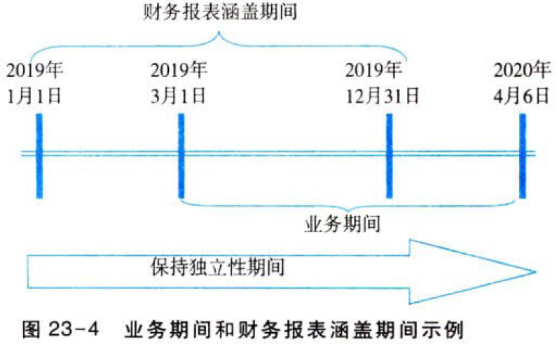

### 1.4.8. 向审计客户提供非鉴证服务的考虑

如果一个实体委托会计师事务所对其财务报表发表意见，并且在该财务报表涵盖的期间或之后成为审计客户，会计师事务所应当确定下列因素是否对独立性产生不利影响：

（1）在财务报表涵盖的期间或之后、接受审计业务委托之前，与审计客户之间存在的经济利益或商业关系。

（2）以往向审计客户提供的服务。

如果在财务报表涵盖的期间或之后，在审计项目组开始执行审计业务之前，会计师事务所向审计客户提供了非鉴证服务，并且该非鉴证服务在审计期间不允许提供，会计师事务所应当评价提供的非鉴证服务对独立性产生的不利影响。如果不利影响超出可接受的水平，会计师事务所只有在采取防范措施消除不利影响或将其降低至可接受的水平的情况下，才能接受审计业务。

如图23-5所示，如果会计师事务所在2019年1月1日至2019年3月1日期间为其审计客户提供了不被允许的非鉴证服务，则对独立性产生不利影响。

（3）防范措施主要包括：

①不允许提供非鉴证服务的人员担任审计项目组成员。

②必要时由其他的注册会计师复核审计和非鉴证工作。

③由其他会计师事务所评价非鉴证业务的结果，或由其他会计师事务所重新执行非鉴证业务，并且所执行工作的范围能够使其承担责任。

# 2. 经济利益

## 2.5. ［考点一］经济利益的种类:star: :star: 

直接经济利益和间接经济利益的判断原则及常见举例，归纳如下表。

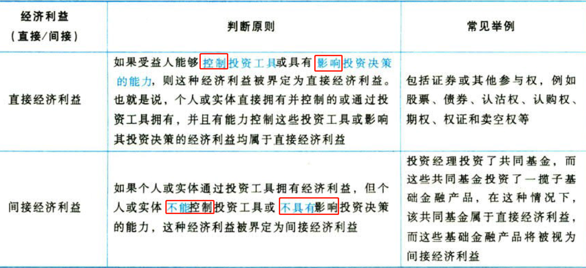

会计师事务所、审计项目组成员或其主要近亲属在审计客户中拥有直接经济利益或者重大间接经济利益对独立性具有不利影响，因此判断“直接经济利益或者重大间接经济利益”是“硬核”知识点。

## 2.6. ［考点二］在审计客户中不被允许拥有的经济利益（俞★★）

如果会计师事务所、项目组成员等主体在审计客户中拥有直接经济利益或者重大间接经济利益，将因自身利益产生非常严重的不利影响，导致没有防范措施能够将其降低至可接受的水平。以下四种情形均不被允许（即禁止），如下表所示。

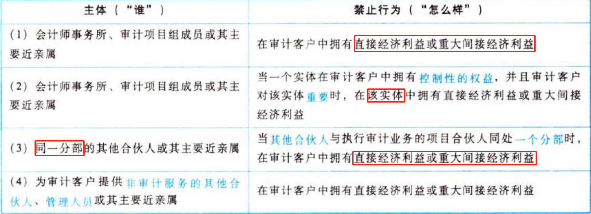

## 2.7. ［考点三］对审计项目组成员其他近亲属的要求:star: 

如果审计项目组某一成员的其他近亲属在审计客户中拥有直接经济利益或重大间接经济利益，将因自身利益产生非常严重的不利影响。评价不利影响的影响因素以及防范措施归纳如下表。

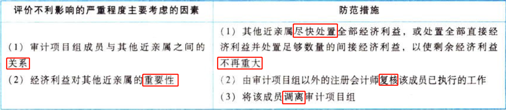

## 2.8. ［考点四］会计师事务所的退休金计划:star: :star: 

如果审计项目组成员通过会计师事务所的退休金计划，在审计客户中拥有直接经济利益或重大间接经济利益，将因自身利益产生不利影响。注册会计师应当评价不利影响的严重程度，并在必要时采取防范措施消除不利影响或将其降低至可接受的水平。

## 2.9. ［考点五］主要近亲属因受雇于审计客户而产生的经济利益:star: :star: 

### 2.9.9. 受雇于审计客户的主要近亲属

涵盖范围包括执行审计业务的项目合伙人所处分部的其他合伙人，或向审计客户提供非审计服务的合伙人或管理人员的主要近亲属。

### 2.9.10. 不被视为损害独立性

如果其主要近亲属在审计客户中拥有经济利益，只要其主要近亲属作为审计客户的员工有权（例如，通过退休金或股票期权计划）取得该经济利益，并且在必要时能够采取防范措施消除不利影响或将其降低至可接受的水平，则不被视为损害独立性。

### 2.9.11. 应当尽快处置经济利益

如果其主要近亲属拥有或取得处置该经济利益的权利，例如，按照股票期权方案有权行使期权，则应当尽快处置或放弃该经济利益。

## 2.10. ［考点六］通过继承、馈赠或因合并而获得经济利益:star: :star: 

### 2.10.12. 总体要求

如果会计师事务所、合伙人或其主要近亲属、员工或其主要近亲属通过继承、馈赠或因合并从审计客户获得直接经济利益或重大间接经济利益，在未采取防范措施前不能承接该审计业务。

### 2.10.13. 采取防范措施

（1）如果会计师事务所获得经济利益，应当立即处置全部经济利益，或处置全部直接经济利益并处置足够数量的间接经济利益，以便剩余经济利益不再重大。

（2）如果审计项目组成员或其主要近亲属获得经济利益，应当立即处置全部经济利益，或处置全部直接经济利益并处置足够数量的间接经济利益，以使剩余经济利益不再重大。

（3）如果审计项目组以外的人员或其主要近亲属获得经济利益，应当在合理期限内尽快处置全部经济利益，或处置全部直接经济利益并处置足够数量的间接经济利益，以使剩余经济利益不再重大。

# 3. 贷款和担保、商业关系、家庭和私人关系

在“贷款或担保”的主体中不考虑其他近亲属，需要考虑的主体包括会计师事务所、项目组成员或其主要近亲属。言外之意，如果考题涉及的是项目组成员的其他近亲属的贷款和担保，则往往不影响注册会计师的独立性。

## 3.11. ［考点一］贷款和担保:star: :star: 

按照取得贷款或获得担保的主体划分，包括会计师事务所、项目组成员或其主要近亲属。本考点不讨论审计项目组成员的其他近亲属。

### 3.11.14. 会计师事务所的贷款和担保对独立性的要求

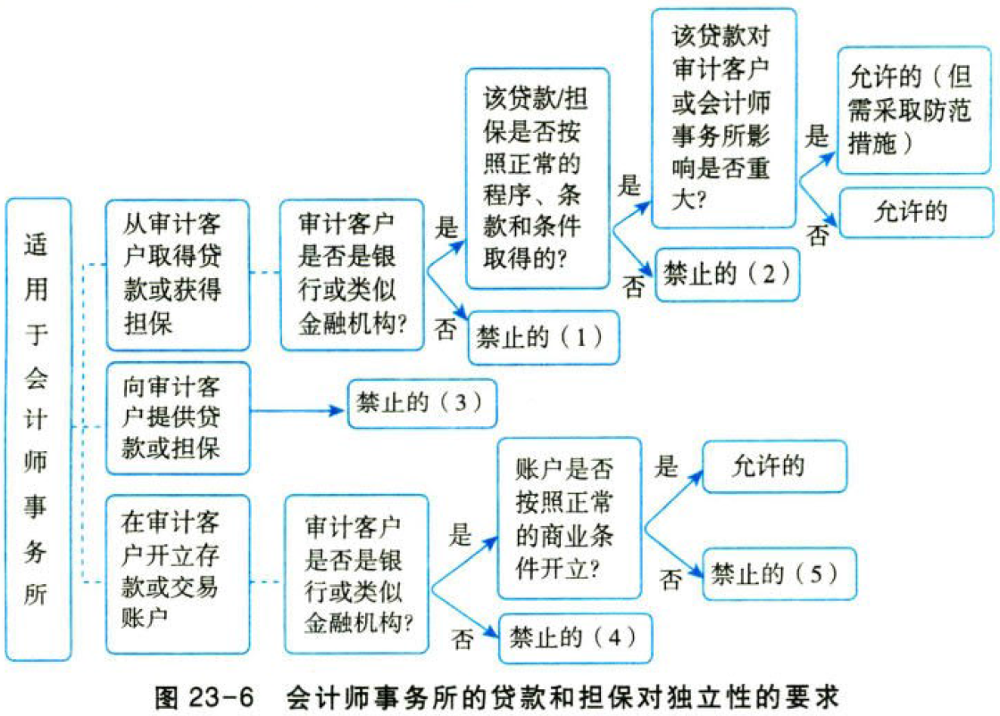

如图23-6所示，关于贷款或担保，会计师事务所与审计客户的以下前三种情形不被允许（即禁止）。具体内容归纳如下表。

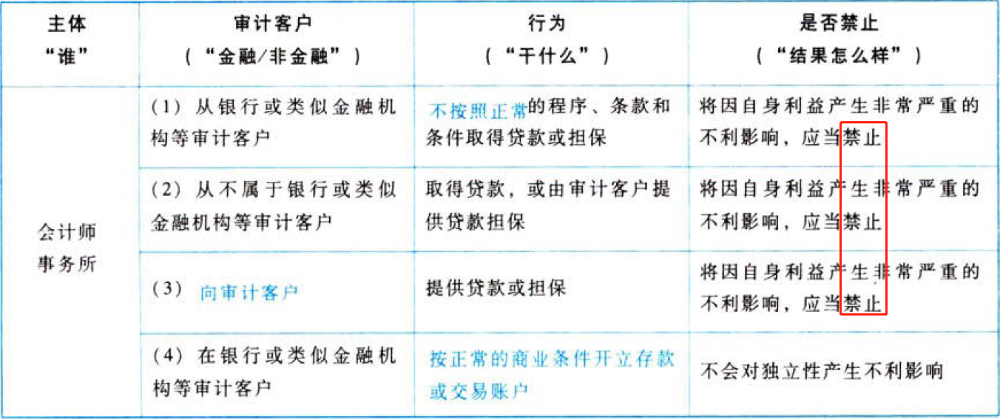

### 3.11.15. 审计项目组成员或其主要近亲属的贷款利担保对独立性的要求

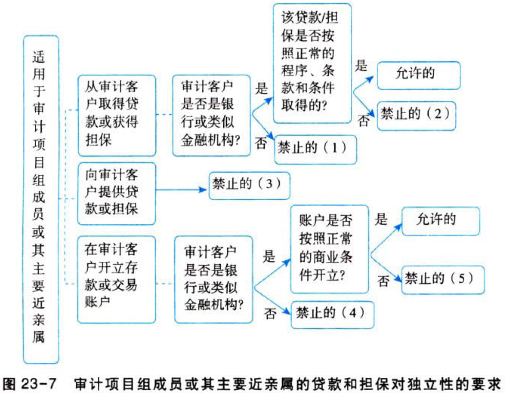

如阁23-7所示，关于贷款或组保，审计项目组成员或其主要近亲属的以下前三种情形不被允许（即禁止）。具体内容归纳如下表。

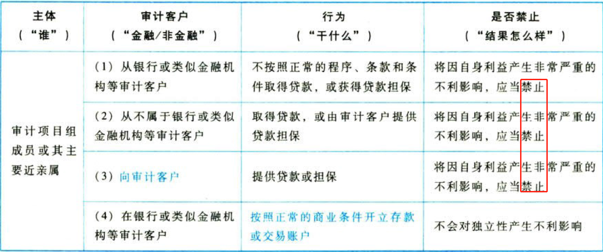

## 3.12. ［考点二］商业关系:star: :star: :star: 

在“商业关系”的主体中不考虑项目组成员的其他近亲属，需要考虑的主体包括会计师事务所、项目组成员或其主要近亲属。

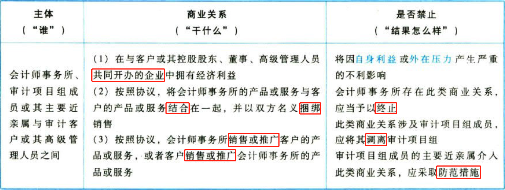

## 3.13. ［考点三］购买商品或服务:star: :star: 

会计师事务所、审计项目组成员或其主要近亲属从审计客户购买商品或服务可能对独立性产生不利影响，归纳如下表。

## 3.14. ［考点四］家庭和私人关系:star: :star: :star: 

如果审计项目组成员与审计客户的董事、高级管理人员，或所处职位能够对客户会计记录或被审计财务报表的编制施加重大影响的员工（董、高、特）存在家庭和私人关系，可能因自身利益、密切关系或外在压力产生不利影响，归纳如下表。

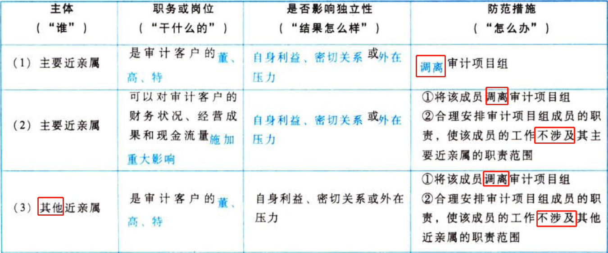

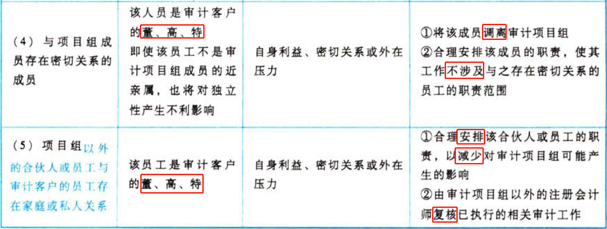

# 4. 与审计客户发生人员交流

## 4.15. ［考点一］与审计客户发生雇佣关系:star: :star: :star: 

如果审计客户的董事、高级管理人员或特定员工，曾是审计项目组的成员或会计师事务所的合伙人，可能因密切关系或外在压力产生不利影响，归纳如下表。

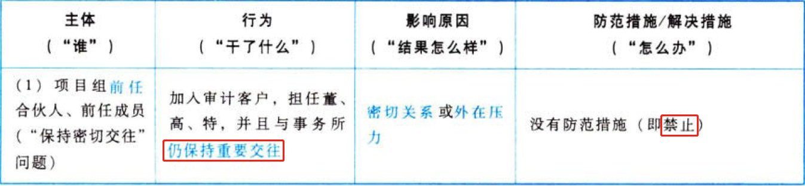

如果会计师事务所前任高级合伙人加入属于公众利益实体的审计客户，担任董、高、特，将因外在压力产生不利影响，除非该高级合伙人离职已超过12个月。

关键审计合伙人是指项目合伙人、实施项目质量控制复核的负责人，以及审计项目组中负责对财务报表审计所涉及的重大事项作出关键决策或判断的其他审计合伙人。

## 4.16. ［考点二］临时借调员工:star: :star: 

如果会计师事务所向审计客户借出员工，可能因自我评价产生不利影响，归纳如下表。

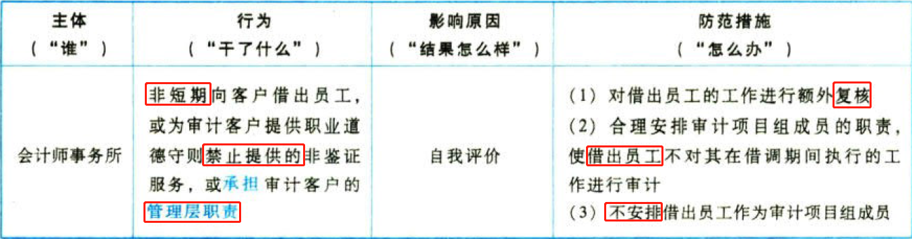

## 4.17. ［考点三］最近曾任审计客户的董、高、特:star: :star: :star: 

### 4.17.16. 可能产生的不利影响

如果审计项目组成员最近曾担任审计客户的董事、高级管理人员、特定员工，可能因自身利益、自我评价、密切关系产生不利影响。

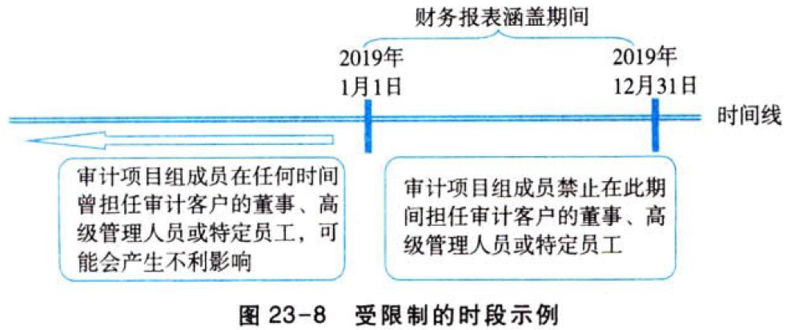

如图23-8所示，如果会计师事务所拟承接被审计单位2019年度财务报表审计业务，审计项目组成员在2019年度财务报表涵盖期间担任审计客户的董事、高级管理人员或特定员工是被禁止的，会计师事务所不得将此类人员分派到审计项目组。如果审计项目组成员在2019年1月1日之前担任上述职位，则可能因自身利益、自我评价、密切关系对独立性产生不利影响。

### 4.17.17. 在财务报表涵盖的期间之前曾任审计客户的董、高、特

评价不利影响存在与否及其严重程度主要取决于下列因素：

（1）该成员在客户中曾担任的职务。

（2）该成员离开客户的时间长短。

（3）该成员在审计项目组中的角色。

防范措施包括复核该成员已执行的工作等。

## 4.18. ［考点四］兼任审计客户的董事或高级管理人员（兼任问题）:star: :star: :star: 

如果会计师事务所的合伙人或员工兼任审计客户的董事或高级管理人员，或兼任公司秘书，可能对独立性产生不利影响，归纳如下表。

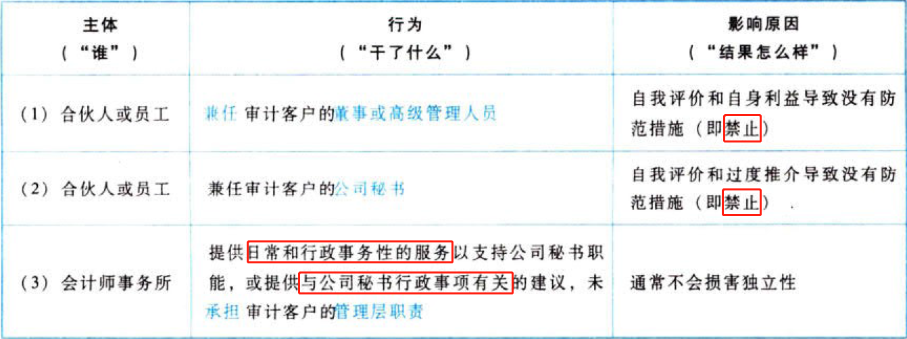

# 5. 与审计客户长期存在业务关系

## 5.19. ［考点一］定期轮换的一般规定:star: :star: :star: 

会计师事务所长期委派同一名合伙人或高级员工执行某一客户的审计业务，将因密切关系和自身利益产生不利影响。评价不利影响的考虑因素和防范措施，归纳如下表。

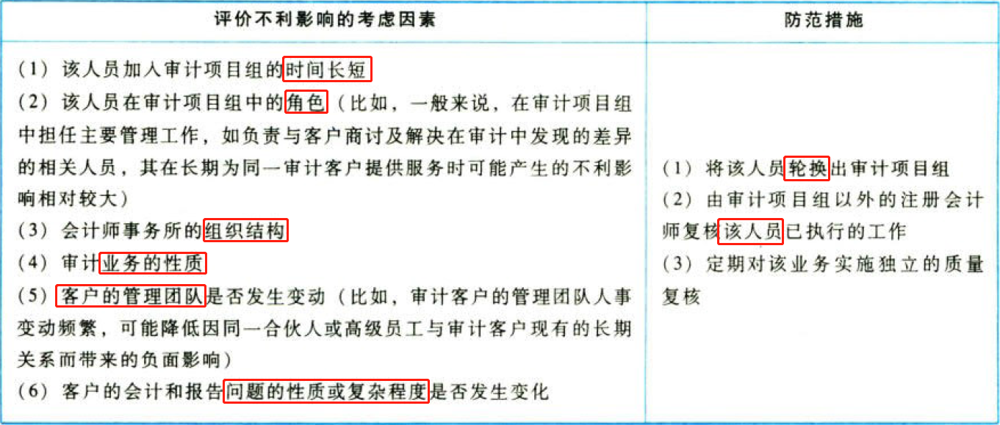

## 5.20. ［考点二］属于公众利益实体的审计客户的定期轮换:star: :star: :star: 

### 5.20.18. 关键审计合伙人定期轮换的一般要求（“5+2”问题）

如果审计客户属于公众利益实体，执行其审计业务的关键审计合伙人任职时间不得超过五年。在任期结束后的两年内，该关键审计合伙人不得再次成为该客户的审计项目组成员或关键审计合伙人。

在两年的冷却期内，该关键审计合伙人不得有下列行为：

①参与该客户的审计业务。

②为该客户的审计业务实施质量控制复核。

③就有关技术或行业特定问题、交易或事项向项目组或该客户提供咨询。

④以其他方式直接影响业务结果。

### 5.20.19. 关键审计合伙人定期轮换的特殊情况（“5+1+2”问题）

（1）在极其特殊的情况下，会计师事务所可能因无法预见和控制的情形而不能按时轮换关键审计合伙人。

（2）如果关键审计合伙人的连任对审计质量特别重要，并且通过采取防范措施能够消除对独立性产生的不利影响或将其降低至可接受的水平，则在法律法规允许的情况下，该关键审计合伙人在审计项目组的时限可以延长一年。

例如，ABC会计师事务所关键审计合伙人老王为一家上市公司甲公司提供审计服务已经五年，ABC会计师事务所已经决定由老张接任老王审计甲公司，但老张因意外或急病而未能如期上任。如果在法律法规允许及ABC会计师事务所对有关审计项目已实施独立的质量控制复核的情况下，在五可以在第六年继续审计甲公司财务报表，老王在出具了甲公司第六年财务报表审汁报告后，ABC会计师事务所必须轮换关键审计合伙人老王。

根据定期轮换要求，关键审计合伙人在一般公众利益实体的审计客户的轮换时间，如下表所示：

### 5.20.20. 审计客户成为公众利益实体时，关键审计合伙人的轮换要求

如果审计客户成为公众利益实体，在确定关键审计合伙人的轮换时间时，会计师事务所应当考虑，在该客户成为公众利益实体之前，该合伙人已为该客户提供服务的时间。

（1）在审计客户成为公众利益实体之前，如果关键审计合伙人已为该客户服务的时间不超过三年，则该合伙人还可以为该客户继续提供服务的年限为五年减去已经服务的年限（“5-X+2”问题）。

（2）如果关键审计合伙人为该客户服务了四年或更长的时间，在该客户成为公众利益实体之后，该合伙人还可以继续服务两年（“2+2”问题）。

（3）如果审计客户是首次公开发行证券的公司，关键审计合伙人在该公司上市后连续提供审计服务的期限，不得超过两个完整会计年度。

根据定期轮换要求，关键审计合伙人在审计客户成为公众利益实体后的轮换时间，如下表所示。

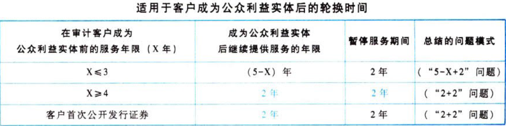

# 6. 为审计客户提供非鉴证服务

## 6.21. ［考点一］为审计客户提供非鉴证服务的一般规定:star: :star: 

### 6.21.21. 总体要求

会计师事务所向审计客户提供非鉴证服务，可能对独立性产生不利影响，包括因自我评价、自身利益和过度推介等产生的不利影响，如图23-9所示。

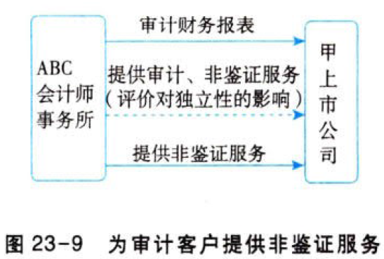

会计师事务所为审计客户提供非鉴证服务时，应当按照独立性概念框架的工作思路，评价对独立性的不利影响。

### 6.21.22. 向审计客户关联实体提供非鉴证服务

（1）会计师事务所通常不向审计客户的下列关联实体提供中国注册会计师职业道德守则限制的非鉴证服务，如图23-10所示。

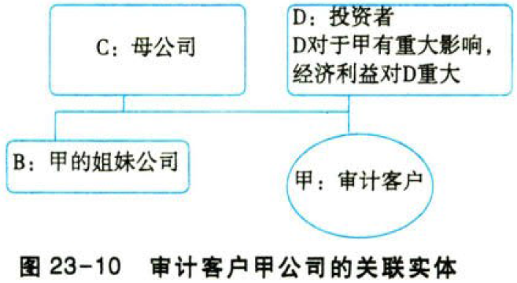

①不是会计师事务所的审计客户，但能够直接或间接控制审计客户的实体，即甲公司的母公司，即上图中的C公司。

②不是会计师事务所的审计客户，但在审计客户中拥有直接经济利益的实体，该实体能够对审计客户施加重大影响，并且经济利益对该实体重大，即上图中的投资者D。

③不是会计师事务所的审计客户，但与审计客户处于同一控制下的实体，即上图中的姐妹公司B公司。

可见，会计师事务所一般不得向甲公司的关联实体8、C、D公司提供受限制的非鉴证服务。

（2）如果有理由认为同时满足下列条件，会计师事务所可以向上述甲公司的关联实体B、C、D提供非鉴证服务。

①向上述B、C、D关联实体提供的非鉴证服务的结果不构成实施审计程序的对象，该服务不因自我评价产生不利影响。例如，ABC会计师事务所审计甲公司2019年度财务报表，同时为甲公司的关联公司B公司提供某一工程项目的可行性研究分析报告（该项非鉴证服务不构成对甲公司2019年度财务报表实施审计程序的审计对象）。

②已采取防范措施将非鉴证服务所产生的任何不利影响予以消除，或将其降低至可接受的水平。

## 6.22. ［考点二］管理层职责:star: :star: :star: 

会计师事务所承担审计客户的管理层职责，将对独立性产生非常严重的不利影响，归纳如下表。

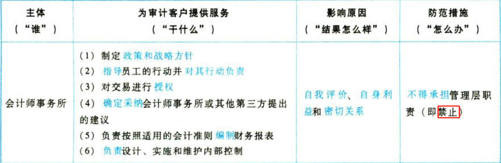

## 6.23. ［考点三］编制会计记录和财务报表:star: :star: :star: 

会计师事务所为公众利益实体的审计客户提供编制会计记录或财务报表等服务，将对独立性产生非常严重的不利影响，归纳如下表。

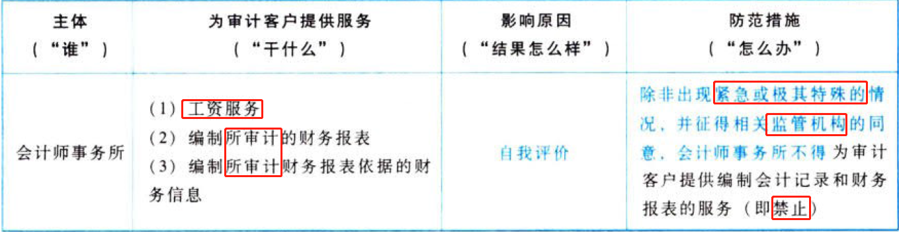

从考试的角度，题目背景强调的是公众利益实体的审计客户。

## 6.24. ［考点四］评估服务:star: :star: 

会计师事务所为公众利益实体的审计客户提供评估服务，将对独立性产生非常严重的不利影响，归纳如下表。

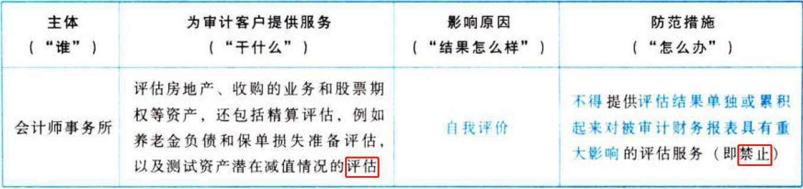

从考试的角度，题目背景强调的是公众利益实体的审计客户，同时注意细节，即“评估服务的评估结果单独或累积起来对被审计财务报表具有重大影响”。

## 6.25. ［考点五］税务服务:star: :star: 

会计师事务所为公众利益实体的审计客户提供解决税务纠纷服务，将对独立性产生非常严重的不利影响，归纳如下衰。

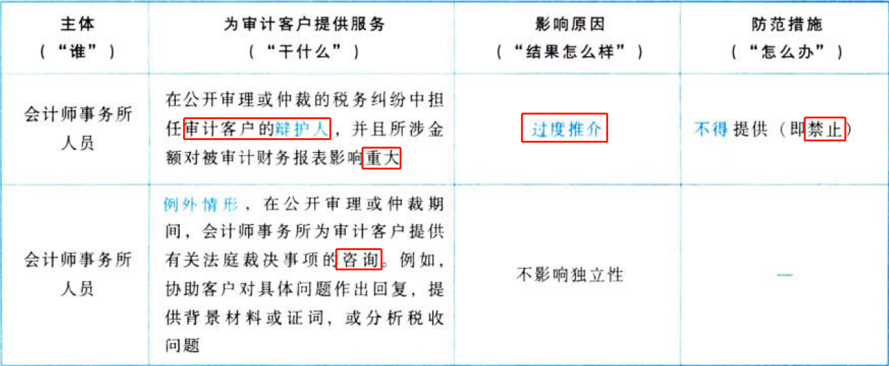

从考试的角度，题目背景强调的是公众利益实体的审计客户，同时注意细节，即“担任审计客户的辩护人、所涉金额重大”。

## 6.26. ［考点六］内部审计服务:star: :star: :star: 

会计师事务所为公众利益实体的审计客户提供内部审计服务，将对独立性产生非常严重的不利影响，归纳如下表。

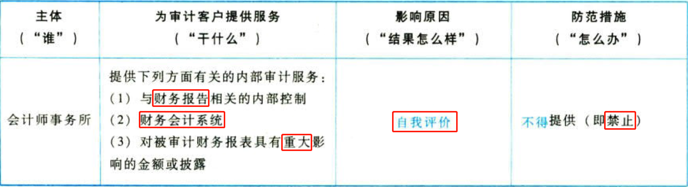

从考试的角度，题目背景强调的是公众利益实体的审计客户。

## 6.27. ［考点七］信息技术系统服务:star: :star: :star: 

会计师事务所为公众利益实体的审计客户提供信息技术系统服务，将对她立性产生非常严重的不利影响，归纳如下表。

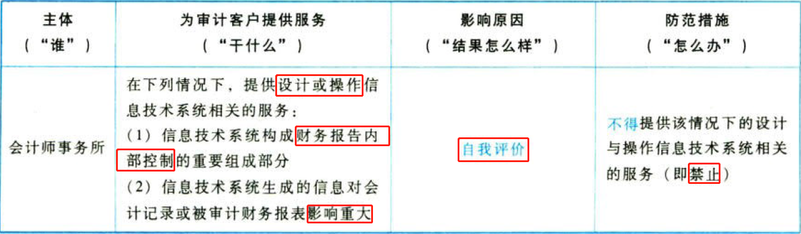

从考试的角度，题目背景强调的是公众利益实体的审计客户。

## 6.28. ［考点八］诉讼支持服务:star: :star: 

会计师事务所为公众利益实体的审计客户提供诉讼支持服务，将对独立性产生非常严重的不利影响，归纳如下表。

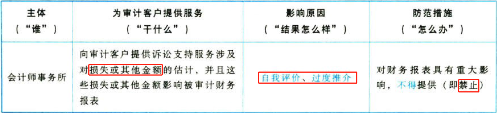

从考试的角度，题目背景强调的是公众利益实体的审计客户，同时注意细节，即“涉及对损失或其他金额的估计，并且这些损失或其他金额影响被审计财务报表”。

## 6.29. ［考点九］法律服务:star: 

会计师事务所为公众利益实体的审计客户提供法律服务，将对独立性产生非常严重的不利影响，归纳如下表。

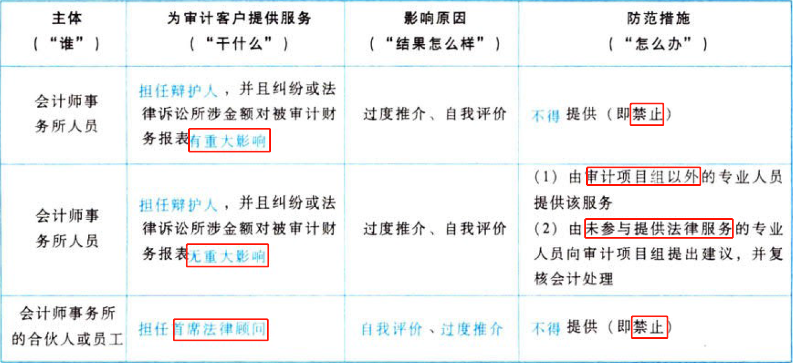

从考试的角度，题目背景强调的是公众利益实体的审计客户，同时注意细节，即“担任辩护人、单人首席法律顾问”。

## 6.30. ［考点十］招聘服务:star: :star: 

会计师事务所为公众利益实体的审计客户提供招聘服务，将对独立性产生非常严重的不利影响，归纳如下表。

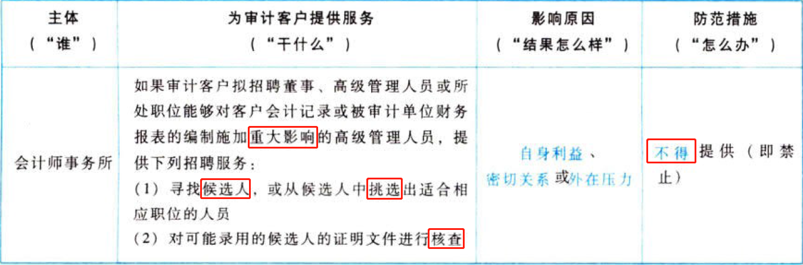

从考试的角度，题目背景强调的是公众利益实体的审计客户，同时沌意细节，即“拟招聘董事、高级管理人员，或所处职位能够对客户会计记录或被审计财务报表的编制施加重大影响的高级管理人员”。

## 6.31. ［考点十一］公司理财服务:star: :star: 

会计师事务所为公众利益实体的审计客户提供公司理财服务，将对独立性产生非常严重的不利影响，归纳如下表。

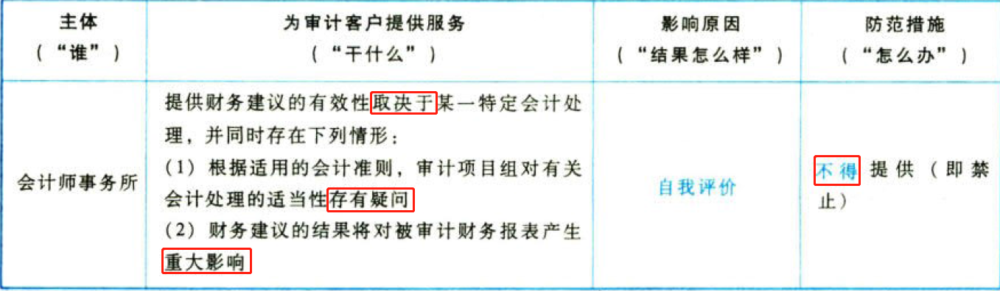

从考试的角度，题目背景强调的是公众利益实体的审计客户，同时注意细节，即“财务建议的有效性取决于某一特定会计处理”。

# 7. 收费

## 7.32. ［考点一］收费结构:star: :star: 

会计师事务所收费结构分为以下三种情形，归纳如下表。

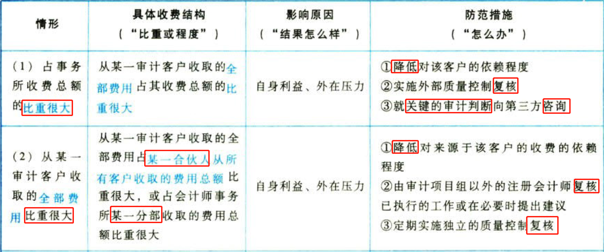

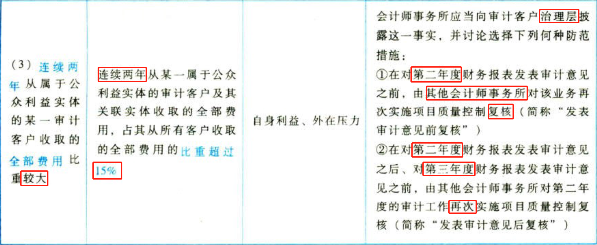

在第三种情形下，如果两年后每年收费比例继续超过15%，则会计师事务所应当每年向治理层披露这一事实，并讨论选择采取上述哪种防范措施。在收费比例明显超过15%的情况下，如果采用发表审计意见后复核无法将不利影响降低至可接受的水平，会计师事务所应当采用发表审计意见前复核。

## 7.33. ［考点二］逾期收费:star: :star: 

审计客户的逾期收费问题可能对独立性产生不利影响，具体情形，归纳如下表。

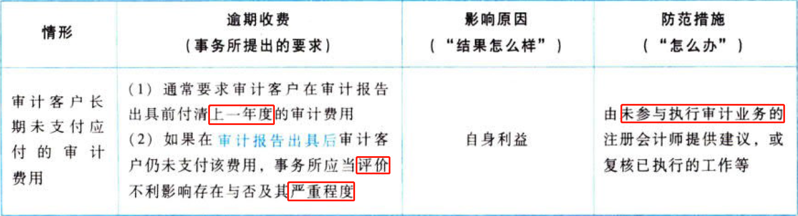

## 7.34. ［考点三］或有收费:star: :star: 

会计师事务所在提供审计服务时，以直接或间接形式取得或有收费，将因自身利益产生非常严重的不利影响。具体情形，归纳如下表。

如果一项收费是由法院或政府有关部门规定的，则该项收费不被视为或有收费。

# 8. 影响独立性的其他事项

## 8.35. ［考点一］薪酬和业绩评价政策:star: :star: 

如果某一审计项目组成员的薪酬或业绩评价与其向审计客户推销的非鉴证服务挂钩，将因自身利益产生不利影响。具体情形，归纳如下表。

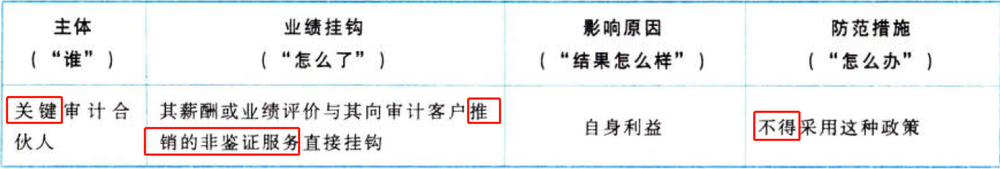

从考试的角度，题目背景强调的是公众利益实体的审计客户，同时注意细节，提供服务的是“关键审计合伙人”。

## 8.36. ［考点二］礼品和款待:star: :star: 

会计师事务所或审计项目组成员接受审计客户的礼品或款待，可能因自身利益和密切关系产生不利影响。具体情形，归纳如下表。

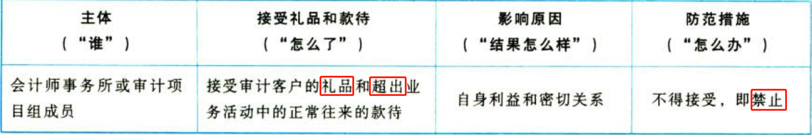

从考试的角度，“接受审计客户的礼品或超出业务活动中的正常往来的款待”属于禁止行为，影响“自身利益和密切关系”。

## 8.37. ［考点三］诉讼或诉讼威胁:star: :star: 

如果会计师事务所或审计项目组成员与审计客户发生诉讼或很可能发生诉讼，将因自身利益和外在压力产生不利影响。具体情形，归纳如下表。

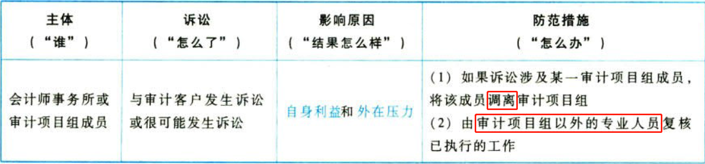

［阶段总结］如图23-11所示，本编两章是中国注册会计师协会（CICPA）的团体会员和个人会员的职业道德规范体系，属于一个知识模块的内容。重点是针对“会员”在执行审计业务时，将可能导致对独立性产生不利影响的事项进行识别、判断并采取相应的防范措施。

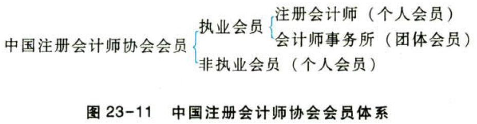

# 9. 总结

End。
