C06审计工作底稿

# 1. 审计工作底稿概述

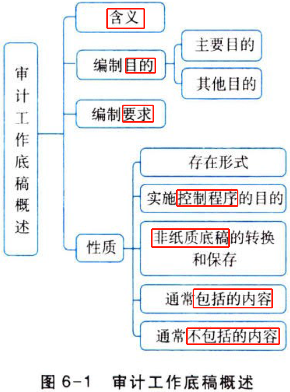

## 1.1. ［考点一］审计工作底稿的含义:star: 

审计工作底稿,是指注册会计师对制定的审计计划、实施的审计程序、获取的相关审计证据，以及得出的审计结论作出的记录。

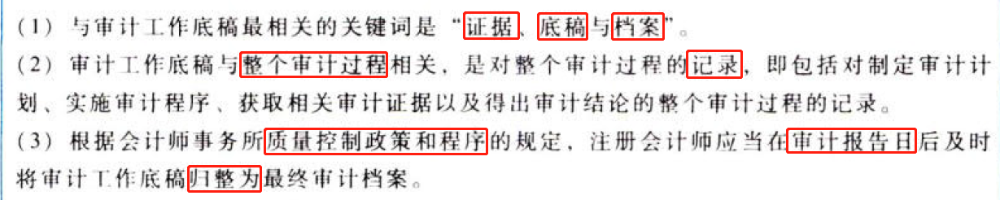

## 1.2. ［考点二］审计工作底稿的编制目的:star: 

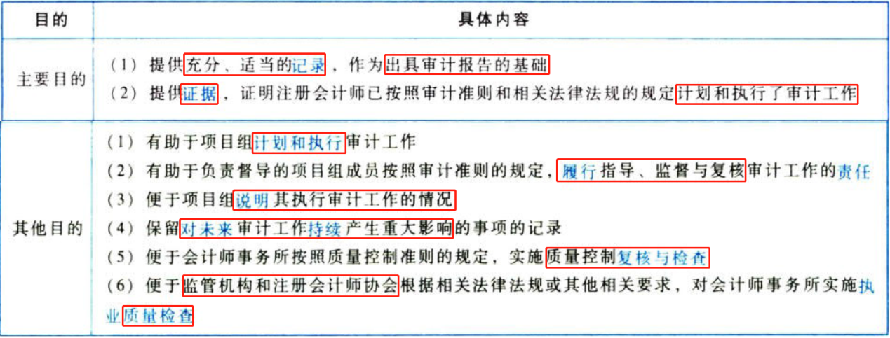

及时编制审计工作底稿有助于提高审计工作的质量，便于在出具审计报告之前，对取得的审计证据和得出的审计结论进行有效复核和评价。

## 1.3. ［考点三］审计工作底稿的编制要求:star: 

### 1.3.1. 编制要求

注册会计师编制的审计工作底稿，应当使未曾接触该项审计工作的有经验的专业人士清楚了解审计程序、审计证据、审计结论。具体包括：

（1）按照审计准则和相关法律法规的规定实施的审计程序的性质、时间安排和范围；

（2）实施审计程序的结果和获取的审计证据；

（3）审计中遇到的重大事项和得出的结论，以及在得出结论时作出的重大职业判断。

### 1.3.2. 有经验的专业人士

有经验的专业人士，是指会计师事务所内部或外部的具有审计实务经验，并且对下列方面有合理了解的人士：

（1）审计过程（链接教材1.6）。

（2）审计准则和相关法律法规的规定。

（3）被审计单位所处的经营环境（链接教材7.3）。

（4）与被审计单位所处行业相关的会计和审计问题。

## 1.4. ［考点四］审计工作底稿的性质:star: :star: 

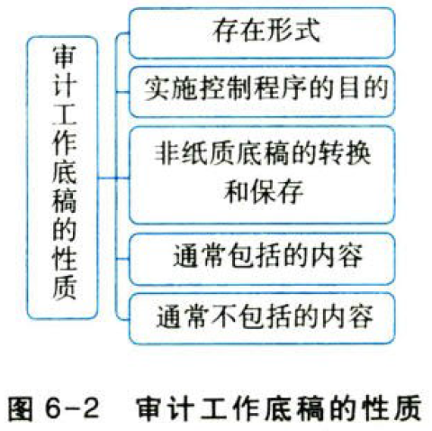

### 1.4.3. 存在形式

随着信息技术的广泛运用,审计工作底稿存在的形式有纸质、电子和其他介质形式。

### 1.4.4. 实施控制程序的目的

会计师事务所应当针对审计工作底稿（包括纸质、电子和其他介质形式）设计和实施适当的控制，以实现下列目的：

（1）清晰地显示审计工作底稿的生成、修改及复核的时间和人员；

（2）保护信息的完整性和安全性，包括审计业务的所有阶段,尤其是在项目组成员共享信息或通过互联网将信息传递给其他人员时；

（3）防止未经授权改动审计工作底稿；

（4）接触审计工作底稿的要求，即允许项目组和其他经授权的人员为适当履行职责而接触审计工作底稿。

### 1.4.5. 非纸质底稿的转换和保存

（1）转换要求。注册会计师可以将以非纸质形式（即电子或其他介质形式）存在的底稿通过打印等方式转换成纸质形式的底稿,并与其他纸质形式的底稿一并归挡；

（2）保存要求，单独保存非纸质形式的底稿。

### 1.4.6. 通常包括的内容

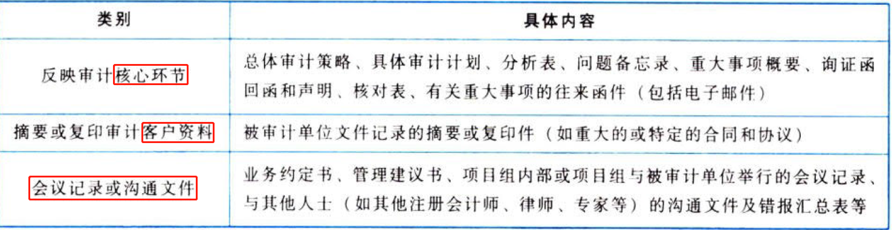

### 1.4.7. 通常不包括的内容

（1）已被取代的审计工作底稿的草稿或财务报表的草稿；

（2）反映不全面或初步思考的记录；

（3）存在印刷错误或其他错误而作废的文本；

（4）重复的文件记录等。

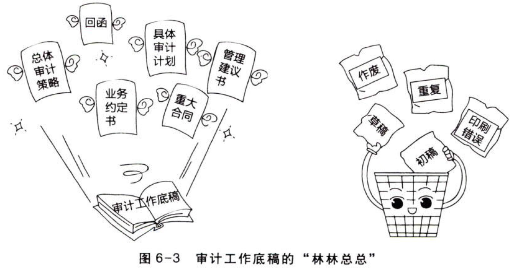

# 2. 审计工作底稿的格式、要素、范围

## 2.5. ［考点一］确定审计工作底稿的格式、要素、范围时考虑的因素:star: 

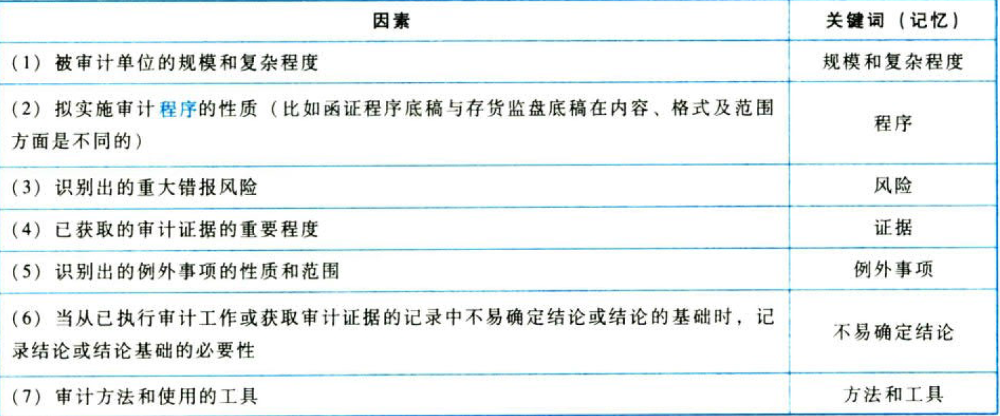

## 2.6. ［考点二］审计工作底稿的要素:star: :star: 

通常，审计工作底稿包含八个基本要素，如图6-4所示。

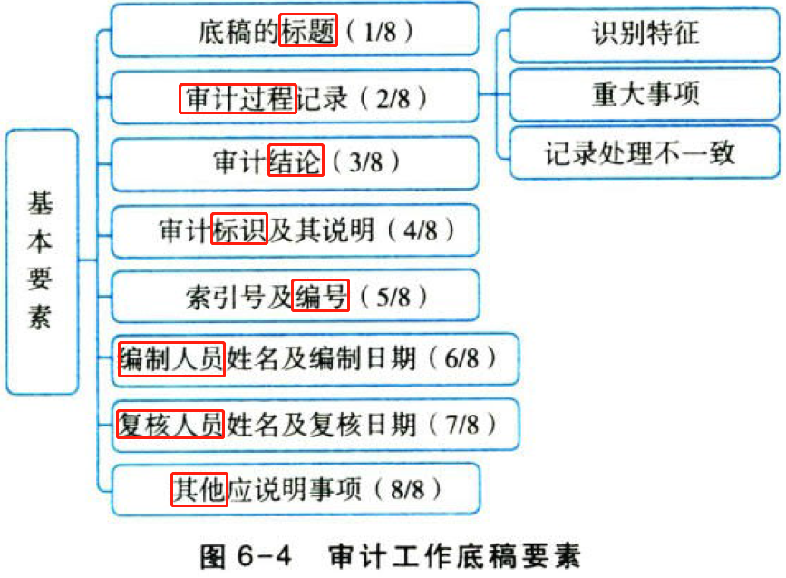

### 2.6.8. 底稿的标题(1/8)

底稿的标题是审计工作底稿的第一个要素，它包括被审计单位的名称、审计项目的名称以及资产负债表日或底稿覆盖的会计期间（如果与交易相关）。下列应收账款实质性程序底稿中“表头”部分的“甲公司”、“2019年12月31日”、“应收账款”就是底稿的标题”。

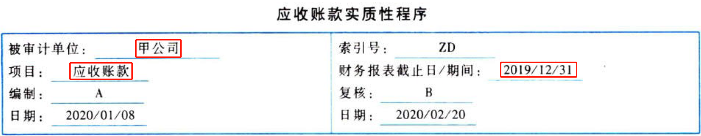

### 2.6.9. 审计过程记录(2/8)

审计过程记录是审计工作底稿的第二个要素。重点掌握：记录底稿的识别特征；重大事项及相关重大职业判断；针对重大事项如何处理不一致的情况。具体内容如下：

#### 2.6.9.1. 识别特征

识别特征，是指被测试的项目或事项表现出的征象或标志。举例如下：

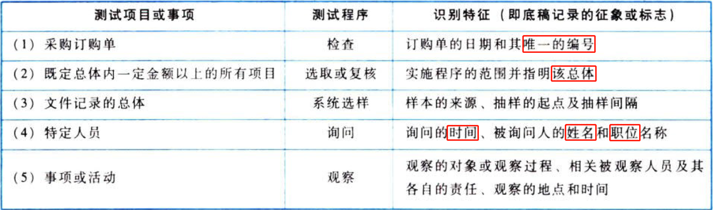

#### 2.6.9.2. 重大事项及相关重大职业判断

判断某一事项是否属于重大事项，需要对具体事实和情况进行客观分析。重大事项通常包括：

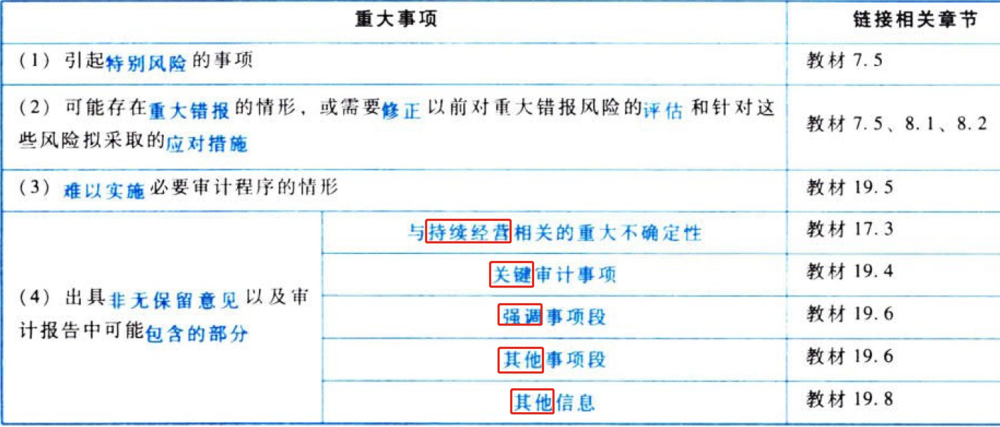

#### 2.6.9.3. 针对重大事项如何处理不一致的情况

如果注册会计师识别出的信息与针对某重大事项得出的最终结论不一致，则应当记录如何处理不一致的情况。该情况包括但不限于：

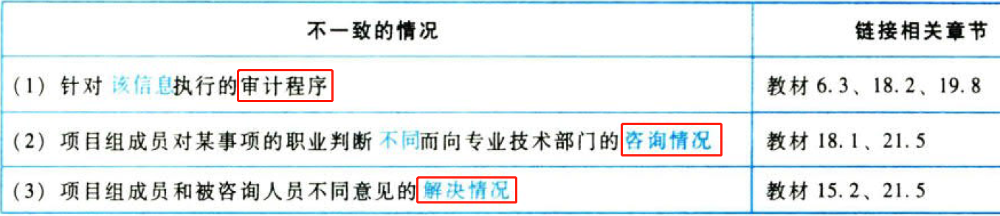

### 2.6.10. 审计结论(3/8)

审计结论是审计工作底稿的第三个要素。重点掌握：

（1）注册会计师需要根据所实施的审计程序及获取的审计证据得出结论，并以此作为对财务报表发表审计意见的基础。

（2）在记录审计结论时需注意，在审计工作底稿中记录的审计理序和审计证据是否足以支持所得出的审计结论。

### 2.6.11. 审计标识及其说明(4/8)

审计标识及其说明是审计工作底稿的第四个要素。审计工作底稿中可使用各种审计标识，但应说明其含义，并保持前后一致。

### 2.6.12. 索引号及编号(5/8)

索引号及编号是审计工作底稿的第五个要素。通常，审计工作底稿需要注明索引号及顺序编号，相关审计工作底稿之间需要保持清晰的勾稽关系。

### 2.6.13. 编制人员和复核人员及日期(6/8、7/8)

底稿中记录编制人员及日期、复核人员及日期是审计工作底稿的第六、第七个要素。底稿的编制人员主要是实施审计程序环节，复核人员包括项目组内部复核，特定情形下还需要实施项目质量控制复核，归纳如下表。

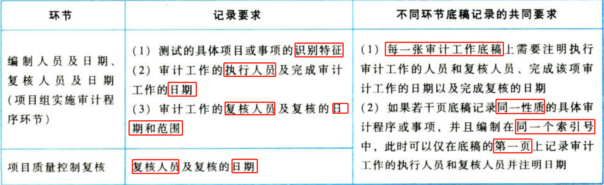

## 2.7. 示例

以下索引号CGL-3的审计工作底稿是以`控制测试审计抽样`的审计工作底稿为例，说明审计工作底稿的基本要素。

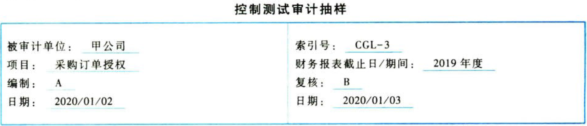

### 2.7.14. 样本设计

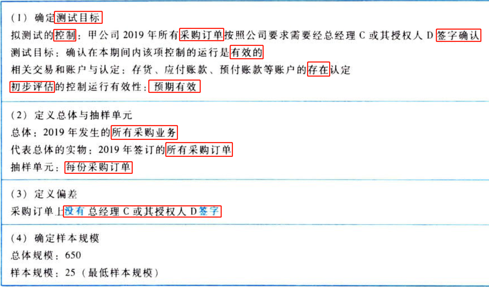

### 2.7.15. 选取样本并实施审计程序

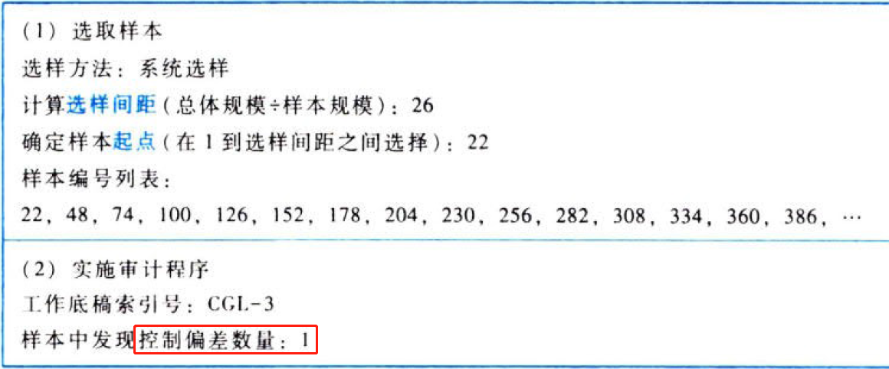

### 2.7.16. 评价样本结果

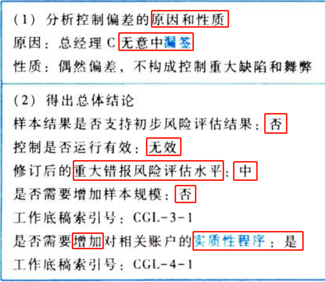

# 3. 审计工作底稿的归档

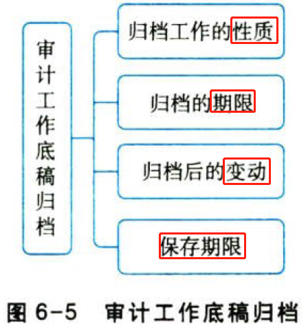

## 3.8. ［考点一］审计工作底稿归档工作的性质:star: :star: 

注册会计师在归档期间对审计工作底稿作出变动属于事务性的工作，这一阶段不涉及注册会计师实施新的审计程序或得出新的审计结论。归档期间对审计工作底稿作出的主要变动如下表所示。

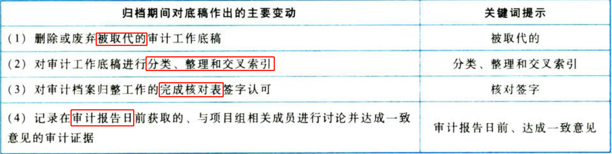

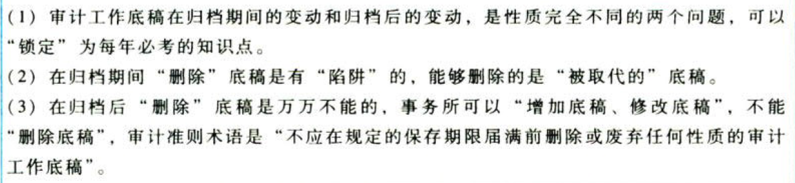

## 3.9. ［考点二］审计工作底稿归档的期限:star: :star: 

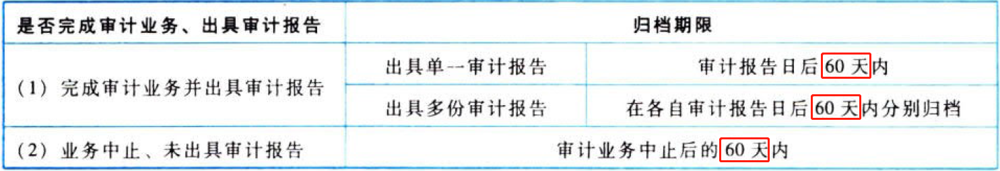

## 3.10. ［考点三］审计工作底稿归档后的变动:star: :star: :star: 

### 3.10.17. 归档后需要变动底稿的情形

一般情况下，在审计报告归档之后不需要对审计工作底稿进行修改或增加，有必要修改现有审计工作底稿或增加新的审计工作底稿的情形归纳如下表。

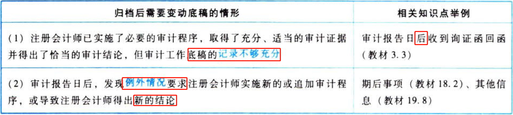

### 3.10.18. 底稿归档后变动的记录要求

审计工作底稿归档后，注册会计师按照要求可能需要修改或增加底稿，但不能删除底稿。如果修改或增加底稿，注册会计师应当记录的事项如下表。

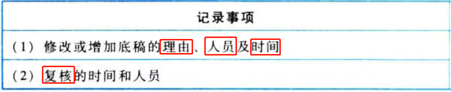

## 3.11. ［考点四］审计工作底稿的保存期限:star: :star: 

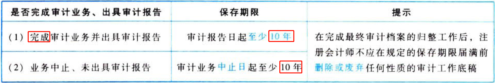

如果审计报告日是2020年3月5日，则底稿的归档期“最迟”是2020年5月4日，底稿保存期“至少”到2030年3月4日。

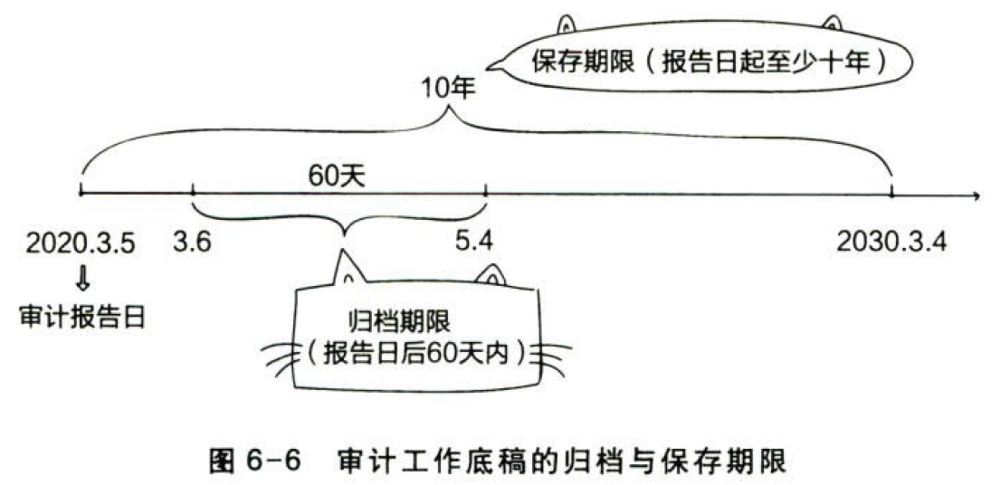

# 4. 总结

End。
