C19审计报告

# 1. 审计报告概述（略）

# 2. 审计意见的形成

## 2.1. ［考点］审计意见类型:star: 

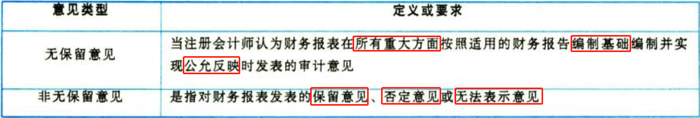

# 3. 审计报告的基本内容

## 3.2. ［考点一］审计报告要素:star: :star: 

### 3.2.1. 无保留意见审计报告的要素

无保留意见审计报告应当包括下列要素：

（1）标题。

（2）收件人。

（3）审计意见。

（4）形成审计意见的基础。

（5）管理层对财务报表的责任。

（6）注册会计师对财务报表审计的责任。

（7）按照相关法律法规的要求报告的事项（略）。

（8）注册会计师的签名和盖章。

（9）会计师事务所的名称、地址和盖章。

（10）报告日期。

### 3.2.2. 无保留意见审计报告的参考格式

[参见本文](../../../../CPA6in1/CPA6in1/4审计/无保留意见审计报告的参考格式.md)。

## 3.3. ［考点二］审计报告日期:star: :star: 

审计报告日期的原则要求、评价审计证据以及审计报告日的确定，归纳如下表。

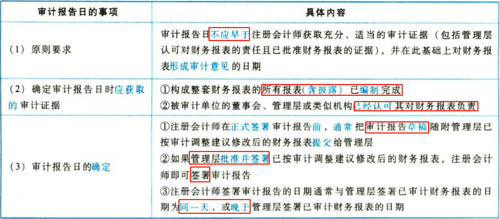

# 4. 在审计报告中沟通关键审计事项

## 4.4. ［考点一］关键审计事项的概念:star: :star: 

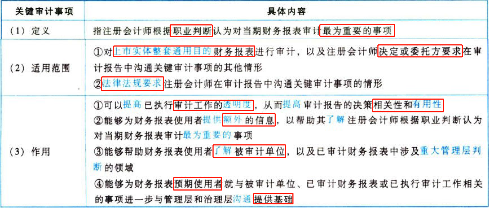

除非法律法规另有规定，当对财务报表发表无法表示意见时，注册会计师不得在审计报告中包含关键审计事项部分和其他信息部分。

## 4.5. ［考点二］确定关键审计事项的决策框架:star: :star: 

注册会计师确定关键审计事项时需要‘三步走”，具体步骤如下。

第一步：以“与治理层沟通的事项”，为起点。

注册会计师确定关键审计事项的决策过程，旨在从与治理层沟通过的事项中筛选出数量较少的事项，这基于注册会计师就哪些事项对本期财务报表审计最为重要作出的判断。

第二步：从“与治理层沟通的事项”中选出“在执行审计工作时重点关注过的事项”。

注册会计师确定“重点关注过的事项”时应当考虑“三大领域”，如图19-1所示。

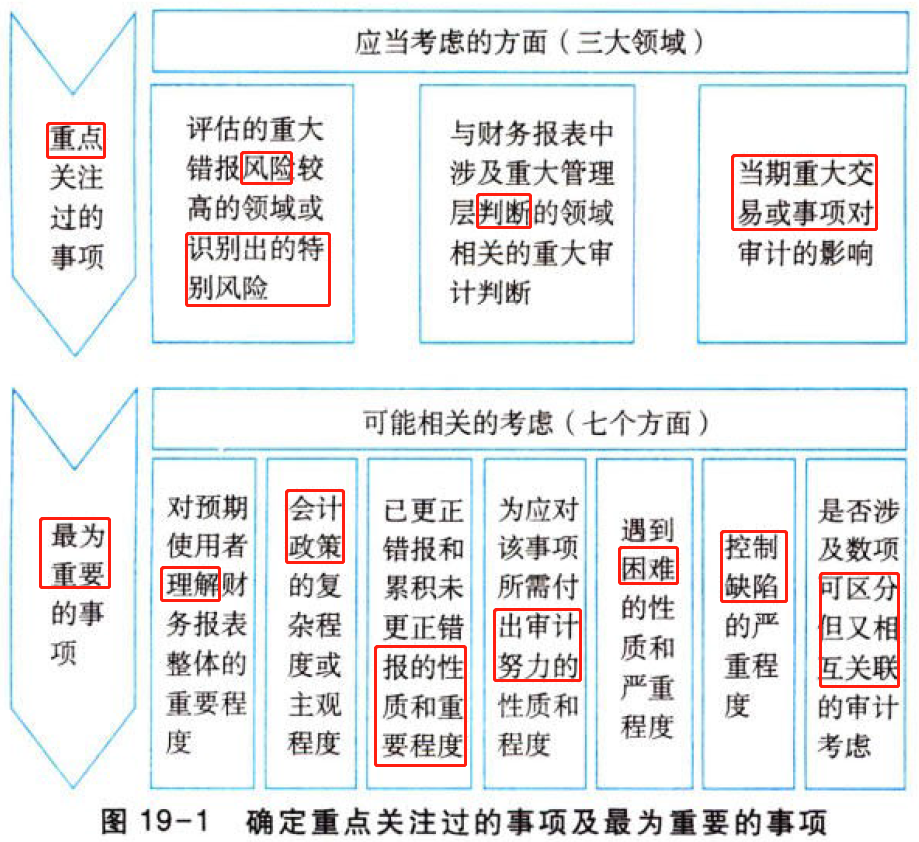

注册会计师在确定哪些事项属于重点关注过的事项时，应当特别考虑以下三个方面的内容，归纳如下表。

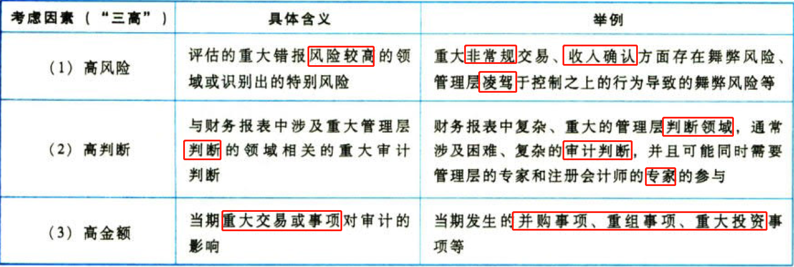

如图19-1中的“三大领域”事项主要围绕“高风险、高判断、高金额”。其中，“高凤险”指较高重大错报风险或特别风险、“高判断”指重大管理层判断或重大审计判断、“高金额”指重大交易和事项。

第三步：确定最为重要的事项（“七因素”）

如图19-1所示，注册会计师确定某一事项是否构成关键审计事项时，应当考虑以下七个因素，归纳如下袭。

## 4.6. ［考点三］在审计报告中单设关键审计事硕部分:star: :star: :star: 

### 4.6.3. 单设关键审计事项部分

为达到突出关键审计事项的目的，注册会计师应当在审计报告中单设一部分，以“关键审计事项”为标题，并在该部分使用恰当的子标题逐项描述关键审计事项。

### 4.6.4. 关键审计事项部分的引言

关键审计事项部分的引言应当同时说明下列事项：

（1）关键审计事项是注册会计师根据职业判断，认为对本期财务报表审计最为重要的事项。

（2）关键审计事项的应对以对财务报表整体进行审计并形成审计意见为背景，注册会计师对财务报表整体形成审计意见，而不对关键审计事项单独发表意见。

### 4.6.5. 不在关键审计事项部分披露

（1）导致非无保留意见的事项、可能导致对被审计单位持续经营能力产生重大疑虑的事项或情况存在重大不确定性等，虽然符合关键审计事项的定义，但这些事项在审计报告中专门的部分披露，不在关键审计事项部分披露。

（2）在关键审计事项部分披露的关键审计事项必须是已经得到满意解决的事项，即不存在审计范围受到限制，也不存在注册会计师与被审计单位管理层意见分歧的情况。

关于“不在关键审计事项部分披露”的情形，很多学员感觉非常抽象，难以理解，因此此处专门说明，导致发表非无保留意见（保留或否定）的事项、可能导致对被审计单位持续经营能力产生重大疑虑的事项或情况存在重大不确定性的内容，需要在形成保留（否定）意见的基础部分或与持续经营相关的重大不确定性部分中描述，不得列示在关键审计事项中，但需要在关键审计事项中提及形成保留（否定）意见的基础部分或与持续经营相关的重大不确定性部分。请见［例2］至［例4］中的“关键审计事项”部分。

［例2］导致保留意见的事项不在关键审计事项部分披露，但是需要在关键审计事项的引言中增加说明，请参考下面关键审计事项引言中的划线部分。

［例3］可能导致对被审计单位持续经营能力产生重大疑虑的事项或情况存在重大不确定性，不在关键审计事项部分披露，但是需要在关键审计事项的引言中增加说明，请参考下面关键审计事项引言中的划线部分。

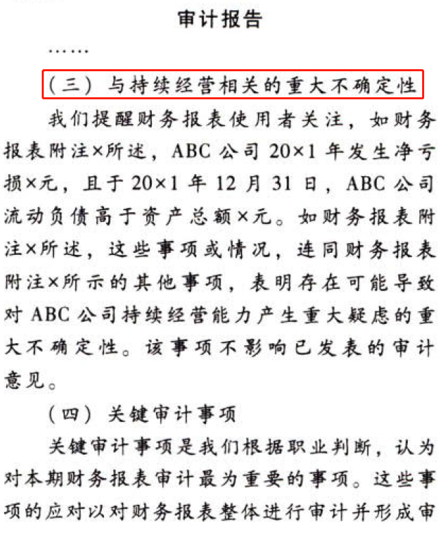

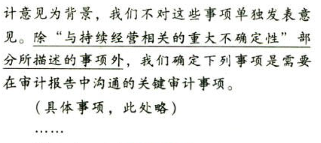

｛例4J导致否定意见的事项不在关键审计事项部分披露，但是需要在关键审计事项的引言中增加说明，请参考下面关键审计事项引言中的划线部分。

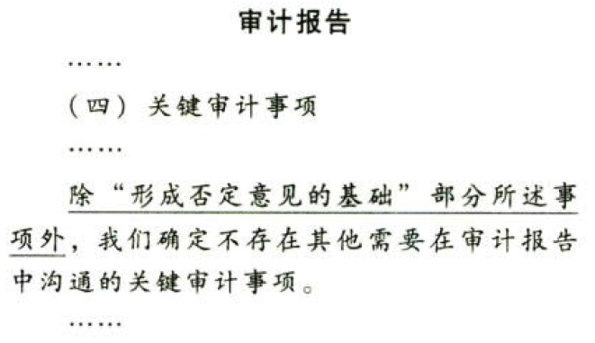

## 4.7. ［考点四］在审计报告中逐项描述每一关键审计事项:star: :star: :star: 

### 4.7.6. 逐项描述的内容

注册会计师应当在审计报告的关键审计事项部分逐项描述每一关键审计事项，在描述时，注册会计师还应当分别索引至财务报表的相关披露（如有），并同时说明下列方面：

（1）该事项被认定为审计中最为重要的事项之一，因而被确定为关键审计事项的原因；

（2）该事项在审计中是如何应对的。

### 4.7.7. 说明关键审计事项在审计中如何应对

注册会计师可以描述下列要素：

（1）审计应对措施或审计方案中，与该事项最为相关或对评估的重大错报风险最有针对性的方面；

（2）对已实施审计程序的简要概述；

（3）实施审计程序的结果；

（4）对该事项的主要看法。

### 4.7.8. 就关键审计事项与治理层沟通

注册会计师应当就下列方面与治理层沟通：

（1）注册会计师确定的关键审计事项；

（2）根据被审计单位和审计业务的具体情况，注册会计师确定不存在需要在审计报告中沟通的关键审计事项（如适用）。

审计准则并不要求注册会计师记录与治理层沟通过的事项不构成重点关注过的事项的原因。

［例5］[关键审计事项](../../../../CPA6in1/CPA6in1/4审计/例5.关键审计事项.md)

### 4.7.9. 不存在需要沟通关键审计事项时的表述

如果注册会计师确定不存在需要沟通的关键审计事项，可以在审计报告中作如下表述：

［例6］关键审计事项

除形成保留（否定）意见的基础部分或与持续经营相关的重大不确定性部分所描述的事项外，我们确定不存在其他需要在审计报告中沟通的关键审计事项。

［例7］关键审计事项

我们确定不存在需要在审计报告中沟通的关键审计事项。

## 4.8. ［考点五］不在审计报告中沟通关键审计事项的情形:star: :star: :star: 

（1）法律法规禁止公开披露某事项。例如，公开披露某事项可能妨碍相关机构对某项违法行为或疑似违法行为的调查。

（2）极少数情形下，注册会计师合理预期在审计报告中沟通某事项造成的负面后果超过在公众利益方面产生的益处。

## 4.9. ［考点六］沟通关键审计事项不能替代审计报告其他报告要素:star: :star: :star: 

（1）管理层按照适用的财务报告编制基础在财务报表中作出的披露，或为使财务报表实现公允反映而作出的披露（如适用）。

（2）注册会计师按照《中国注册会计师审计准则第1502号——在审计报告中发表非无保留意见》的规定，根据审计业务的具体情况发表非无保留意见。

（3）当可能导致对被审计单位持续经营能力产生重大疑虑的事项或情况存在重大不确定性时，注册会计师按照《中国注册会计师审计准则第1324号——持续经营》的规定进行报告。

# 5. 非无保留意见审计报告

## 5.10. ［考点一］发表非无保留意见的情形:star: :star: 

### 5.10.10. 非无保留意见的成因

当存在下列情形之一时，注册会计师应当在审计报告中发表非无保留意见：

（1）根据获取的审计证据，得出财务报表整体存在重大错报的结论（保留意见或否定意见）。

（2）无法获取充分、适当的审计证据，不能得出财务报表整体不存在重大错报的结论（保留意见或无法表示意见）。

### 5.10.11. 财务报表的重大错报的可能来源及具体情形

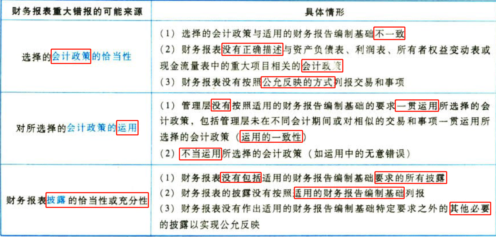

### 5.10.12. 可能导致审计范固受到限制的情形及举例

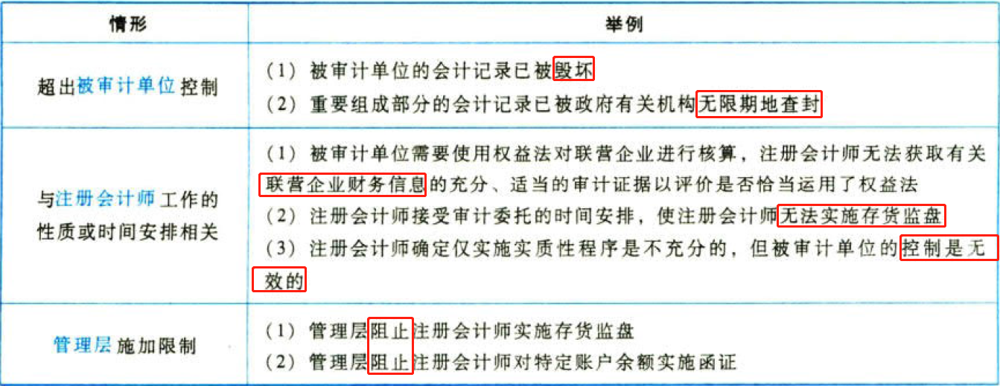

## 5.11. ［考点二］确定非无保留意见的类型:star: :star: :star: 

### 5.11.13. 影响非无保留意见类型的事项

（1）导致非无保留意见的事项的性质，是财务报表存在重大错报，还是在无法获取充分、适当的审计证据的悄况下，财务报表可能存在重大错报。

（2）注册会计师就导致非无保留意见的事项对财务报衷产生或可能产生影响的广泛性作出的判断。

### 5.11.14. 判断广泛性的情形

（1）不限于对财务报表的特定要素、账户或项目产生影响。

（2）虽然仅对财务报表的特定要素、账户或项目产生影响，但这些要求、账户或项目是或可能是财务报表的主要组成部分。

（3）当与披露相关时，产生的影响对财务报表使用者理解财务报表至关重要。

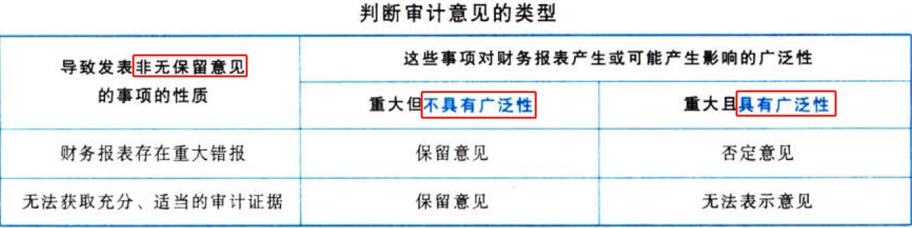

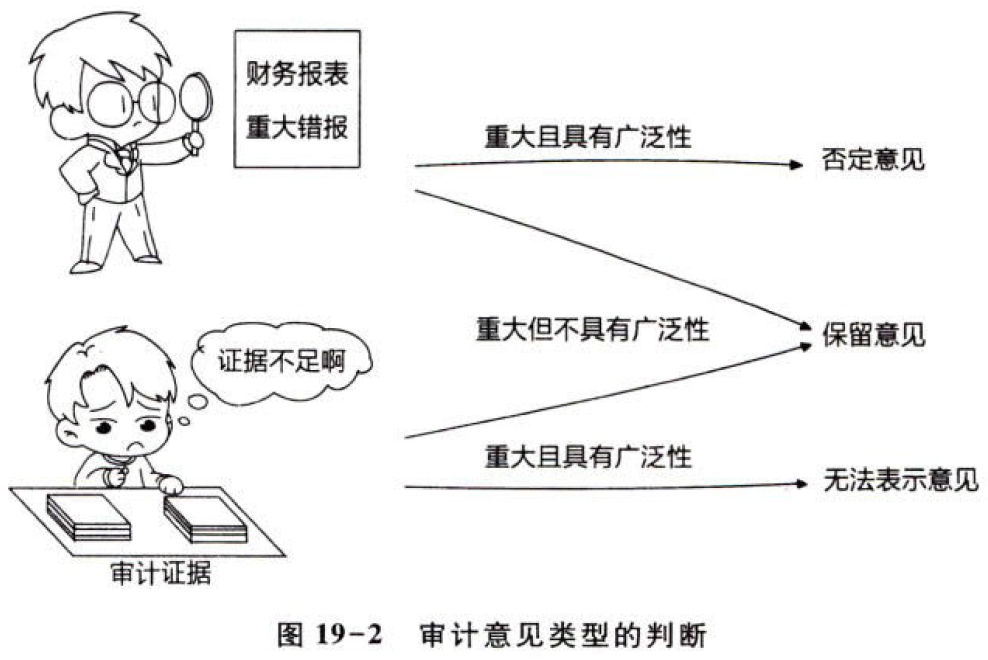

### 5.11.15. 保留意见审计报告参考格式

［例8］由于财务报表存在重大错报而发表[保留意见的审计报告](../../../../CPA6in1/CPA6in1/4审计/例8.保留意见的审计报告.md)（教材参考格式19-4）。

### 5.11.16. 无法表示意见审计报告参考格式

［例9］由于注册会计师无法针对财务报表多个要素获取充分、适当的审计证据而发表[无法表示意见的审计报告](../../../../CPA6in1/CPA6in1/4审计/例9.无法表示意见的审计报告.md)（教材参考格式19-5）。

# 6. 在审计报告中增加强调事项段和其他事项段

## 6.12. ［考点一］强调事项段:star: :star: 

### 6.12.17. 强调事项段的含义

强调事项段，是指审计报告中含有的一个段落，该段落提及已在财务报表中恰当列报或披露的事项，且根据注册会计师的职业判断，该事项对财务报表使用者理解财务报表至关重要。

### 6.12.18. 增加强调事项段的条件

在同时满足下列条件时，注册会计师应当在审计报告中增加强调事项段：

（1）按照《中国注册会计师审计准则第1502号——在审计报告中发表非无保留意见》的规定，该事项不会导致注册会计师发表非无保留意见；

（2）当《中国桂册会计师审计准则第1504号——在审计报告中沟通关键审计事项》适用时，该事项未被确定为在审计报告中沟通的关键审计事项。

### 6.12.19. 增加强调事项段的情形

某些审计原则对特定情况下在审计报告增加强调事项段提出具体要求。这些情形包括：

（1）法律法规规定的财务报告编制基础不可接受，但其是由法律或法规作出的规定。

（2）提醒财务报表使用者注意财务报表按照特殊目的编制基础编制。

（3）注册会计师在审计报告日后知悉了某些事实（即期后事项），并且出具了新的审计报告或修改了审计报告。

注册会计师可能认为需要增加强调事项段的情形举例如下：

（1）异常诉讼或监管行动的未来结果存在不确定性。

（2）提前应用（在允许的情况下）对财务报表有广泛影响的新会计准则。

（3）存在已经或持续对被审计单位财务状况产生重大影响的特大灾难。

### 6.12.20. 增加强调事项段时采取的措施

如果在审计报告中增加强调事项段，注册会计师应当采取下列措施：

（1）将强调事项段作为单独的一部分置于审计报告中，并使用包含“强调事项”这一术语的适当标题。

（2）明确提及被强调事项以及相关披露的位置，以便能够在财务报表中找到对该事项的详细描述。强调事项段应当仅提及巳在财务报表中列报或披露的信息。

（3）指出审计意见没有因该强调事项而改变。

### 6.12.21. 强调事项段不能代替的情形

在审计报告中包含强调事项段不影响审计意见。包含强调事项段不能代替下列情形：

（1）根据审计业务的具体情况，按照《中国汪册会计师审计准则第1502号——在审计报告中发表非无保留意见》的规定发表非无保留意见；

（2）适用的财务报告编制基础要求管理层在财务报表中作出的披露，或为实现公允列报所需的其他披露；

（3）按照《中国注册会计师审计准则第1324号——持续经营》的规定，当可能导致对被审计单位持续经营能力产生重大疑虑的事项或情况存在重大不确定性时作出的报告。

［例10］强调事项段（详见教材参考格式19-6）。

## 6.13. ［考点二］其他事项段:star: :star: 

### 6.13.22. 其他事项段的含义

其他事项段，是指审计报告中含有的一个段落，该段落提及未在财务报表中列报或披露的事项，且根据注册会计师的职业判断，该事项与财务报表使用者理解审计工作、注册会计师的责任或审计报告相关。

### 6.13.23. 增加其他事项段的条件

在同时满足下列条件时，注册会计师应当在审计报告中增加其他事项段：

（1）未被法律法规禁止。

（2）当《中国注册会计师审计准则第1504号——在审计报告中沟通关键审计事项》适用时，该事项未被确定为在审计报告中沟通的关键审计事项。

### 6.13.24. 增加其他事项段的情形

（1）与使用者理解审计工作相关的情形。

在极其特殊的情况下，即使由于管理层对审计范围施加的限制导致无法获取充分、适当的审汁证据可能产生的影响具有广泛性，注册会计师也不能解除业务约定。在这种情况下，注册会计师可能认为有必要在审计报告中增加其他事项段，解释为何不能解除业务约定。

（2）与使用者理解注册会计师的责任或审计报告相关的情形。

法律法规或得到广泛认可的惯例可能要求或允许注册会计师详细说明某些事项，以进一步解释注册会计师在财务报表审计中的责任或审计报告。

（3）对两套以上（包括两套）财务报表出具审计报告的情形。

如果注册会计师已确定两个财务报告编制基础在各自情形下是可接受的，可以在审计报告中增加其他事项段，说明该被审计单位根据另一个通用目的编制基础编制了另一套财务报表以及注册会计师对这些财务报表出具了审计报告。

（4）限制审计报告分发和使用的情形。

由于审计报告旨在提供给特定使用者，注册会计师可能认为在这种情况下需要增加其他事项段，说明审计报告只是提供给财务报表预期使用者，不应被分发给其他机构或人员或被其他机构或人员使用。

# 7. 比较信息

## 7.14. ［考点一］比较信息的含义:star: 

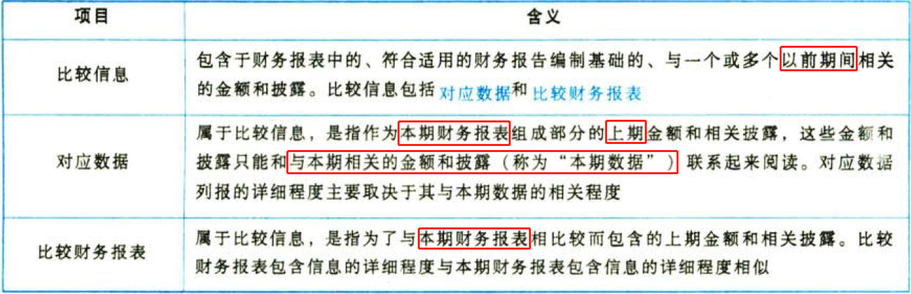

比较借息包括对应数据（本期报表中含有的上期信息）和比较财务报表（与本期报表比较的上期信息，不包含在本期报表中），其中对应数据指的是作为本期财务报表组成部分的上期金额和相关披露，而期初余额是指期初存在的账户余额，故对应数据中是包含期初余额的内容的。

## 7.15. ［考点二］对比较信息的审计责任:star: 

### 7.15.25. 对比较信息的审计目的

（1）获取充分、适当的审计证据，确定在财务报表中包含的比较信息是否在所有重大方面按照适用的财务报告编制基础有关比较信息的要求进行列报；

（2）按照注册会计师的报告责任出具审计报告。

### 7.15.26. 报告责任

（1）对于对应数据，审计意见仅提及本期；

（2）对于比较财务报表，审计意见提及列报的财务报表所属的各期。

## 7.16. ［考点三］对比较信息的审计程序:star: :star: 

### 7.16.27. 注意到比较信息可能存在重大错报时的审计要求

（1）在实施本期审计时，如果注意到比较信息可能存在重大错报，注册会计师应当根据实际情况追加必要的审计程序，获取充分、适当的审计证据，以确定是否存在重大错报。

本期财务报表中的比较信息出现重大错报的情形通常包括：

①上期财务报表存在重大错报，该财务报表虽经审计，但注册会计师因未发现而未在针对上期财务报表出具的审计报告中对该事项发表非无保留意见，本期财务报表中的比较信息未作更正。

②上期财务报表存在重大错报，该财务报表未经注册会计师审计，比较信息未作更正。

③上期财务报表不存在重大错报，但比较信息与上期财务报表存在重大不一致，由此导致重大错报。

④上期财务报表不存在重大错报，但在某些特殊情形下，比较信息未按照会计准则和相关会计制度的要求恰当重述。

（2）如果上期财务报表已经审计，注册会计师还应当遵守《中国注册会计师审计准则第1332号——期后事项》的相关规定，如果上期财务报表已经得到更正，注册会计师应当确定比较信息与更正后的财务报表是否一致。

注册会计师在对本期财务报表进行审计时，可能注意到影响上期财务报表的重大错报，而以前未就该重大错报出具非无保留意见的审计报告。注册会计师应当考虑是否需要修改上期财务报表，并与管理层讨论，同时根据具体情况采取适当措施：

①如果上期财务报表未经更正，也未重新出具审计报告，且比较数据未经恰当重述和充分披露，注册会计师应当对本期财务报表出具非无保留意见的审计报告，说明比较数据对本期财务报表的影响；

②如果上期财务报表已经更正，并己重新出具审计报告，注册会计师应当获取充分、适当的审计证据，以确定比较信息与更正的财务报表是否一致。

### 7.16.28. 获取书面声明

注册会计师应当获取与审计意见中提及的所有期间相关的书面声明。对于管理层作出的、更正上期财务报表中影响比较信息的重大错报的任何重述，注册会计师还应当获取特定书面声明。

（1）在比较财务报表的情形下，由于管理层需要再次确认其以前作出的与上期相关的书面声明仍然适当，注册会计师需要要求管理层提供与审计意见所提及的所有期间相关的书面声明；

（2）在对应数据的情形下，由于审计意见针对包括对应数据的本期财务报表，注册会计师需要要求管理层仅就本期财务报表提供书面声明。

## 7.17. ［考点四］对应数据:star: :star: 

### 7.17.29. 总体要求

当财务报表中列报对应数据时，由于审计意见是针对包括对应数据的本期财务报表整体的，审计意见通常不提及对应数据。只有在特定情形下，注册会计师才应当在审计报告中提及对应数据。

### 7.17.30. 需要提及时的特定情形

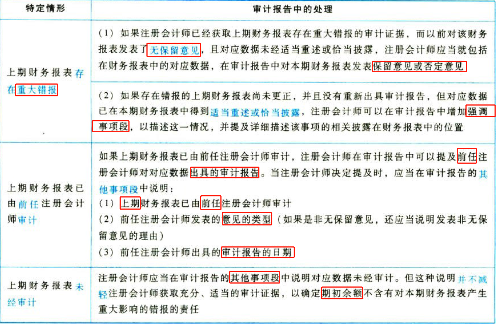

### 7.17.31. 审计报告：对应数据

［例11］[“对应数据”导致保留意见情形](../../../../CPA6in1/CPA6in1/4审计/例11.对应数据导致保留意见.md)（详见敬材参考格式19-7）。

［例12］“对应数据”的其他事项（详见教材参考格式19-9）。

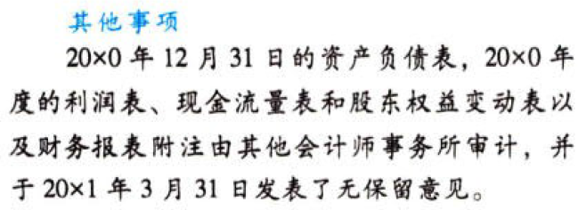

## 7.18. ［考点五］比较财务报表:star: :star: 

### 7.18.32. 总体要求

（1）当列报比较财务报表时，审计意见应当提及列报财务报表所属的各期，以及发表的审计意见涵盖的各期。

（2）由于对比较财务报表出具的审计报告涵盖所列报的每期财务报袭，注册会计师可以对一期或多期财务报表发表保留意见、否定意见或无法表示意见，或者在审计报告中增加强调事项段，而对其他期间的财务报表发表不同的审计意见。

### 7.18.33. 需要提及时的特定情形

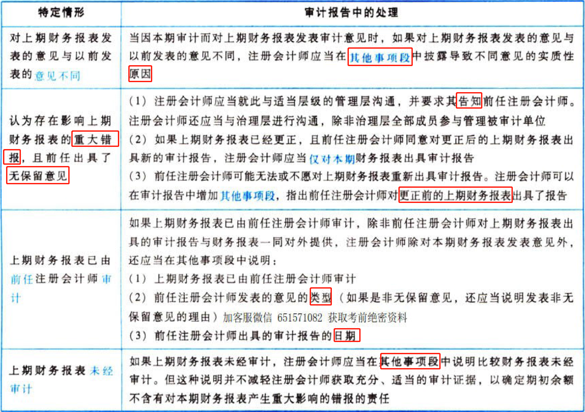

### 7.18.34. 审计报告：比较财务报表

［例13］[“比较财务报表”导致保留意见情形](../../../../CPA6in1/CPA6in1/4审计/例13.比较财务报表导致保留意见情形.md)（详见教材参考格式19-10）。

# 8. 注册会计师对其他信息的责任

## 8.19. ［考点一］与其他信息相关的概念:star: :star: 

### 8.19.35. 年度报告

年度报告，是指管理层或治理层根据法律法规的规定或惯例，一般以年度为基础编制的、旨在向所有者（或类似的利益相关方）提供实体经营情况和财务业绩及财务状况（财务业绩及财务状况反映于财务报表）信息的一个文件或系列文件组合。一份年度报告包含或随附财务报表和审计报告，通常还包括实体的发展，未来前景、风险和不确定事项，治理层声明，以及包含治理事项的报告等信息。

例如，根据法律法规或惯例，以下一项或多项文件时能构成年度报告：

（1）董事会报告。

（2）公司董事会、监事会及董事、监事、高级管理人员保证年度报告内容的真实、准确、完整，不存在虚假记载、误导性陈述或重大遗漏，并承担个别和连带法律责任的声明。

（3）公司治理情况说明。

（4）内部控制自我评价报告。

### 8.19.36. 对年度报告的考虑

注册会计师应当就及时获取组成年度报告的文件的最终版本与管理层作出适当安排。如果可能，在审计报告日之前获取。如果组成年度报告的部分或全部文件在审计报告日后才能取得，要求管理层提供书面声明，声明上述文件的最终版本将在可获取时并且在被审计单位公布前提供给注册会计师，以使注册会计师可以完成准则要求的程序。

### 8.19.37. 其他倩息

其他信息，是指在被审计单位年度报告中包含的除财务报友和审计报告以外的财务信息和非财务信息。

注册会计师对财务报表发表的审计意见不涵盖其他倩息，但注册会计师应当阅读和考虑其他倩息。

## 8.20. ［考点二］阅读并考虑其他信息:star: :star: 

注册会计师应当阅读并考虑其他信息。主要有以下三种类型，如下表。

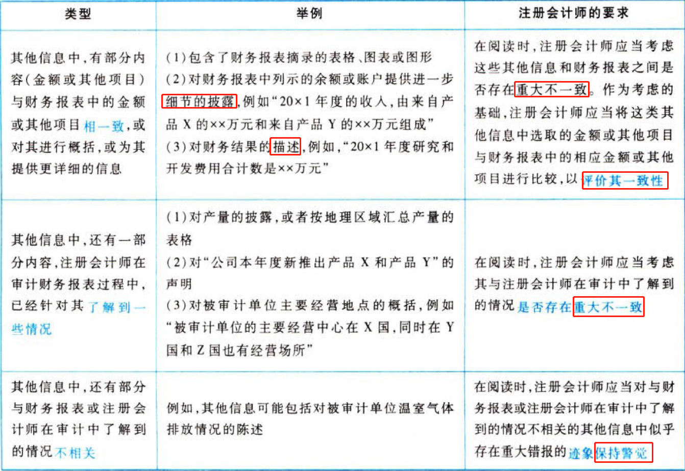

## 8.21. ［考点三］当似乎存在重大不一致或其他信息似乎存在重大错报时的应对:star: :star: :star: 

如果注册会计师识别出似乎存在重大不一致，或者知悉其他信息似乎存在重大错报，注册会计师应当与管理层讨论该事项，必要时，实施其他程序以确定：

（1）其他信息是否存在重大错报。

（2）财务报表是否存在重大错报。

（3）注册会计师对被审计单位及其环境的了解是否需要更新。

## 8.22. ［考点四］当注册会计师认为其他信息存在重大错报时的应对:star: :star: :star: 

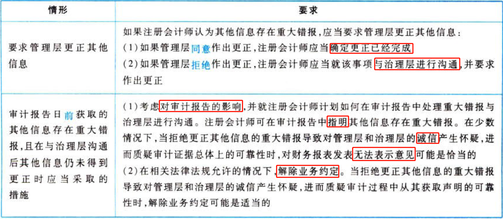

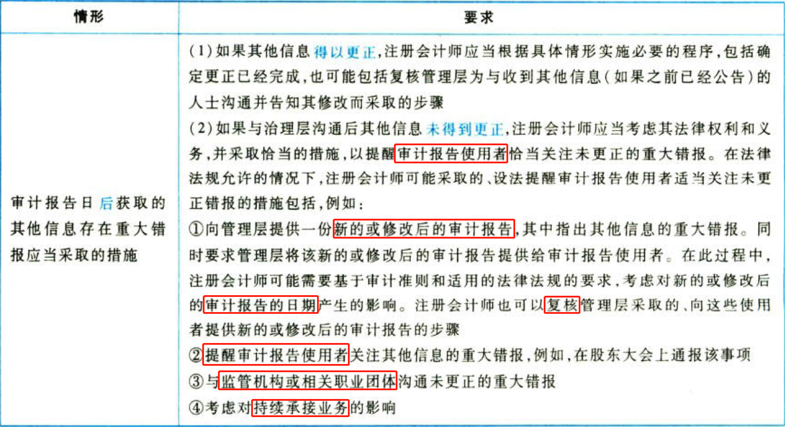

## 8.23. ［考点五］以“其他信息”为标题在审计报告中单独部分披露:star: :star: :star: 

### 8.23.38. 需要单独披露的情形

如果在审计报告臼存在下列两种情况之一，审计报告应当包括一个单独部分，以“其他信息”为标题：

（1）对于上市实体财务报表审计，注册会计师已获取或预期将获取其他信息；

（2）对于上市实体以外其他被审计单位的财务报表审计，注册会计师已获取部分或全部其他信息。

【提示】除非法律法规另有规定，对财务报表发表无法表示意见时，审计报告不包含其他信息部分（链接第四节考点一）。

### 8.23.39. 审计报告包含的其他信息部分的描述内容

审计报告包含的其他信息部分应当包括：

（1）管理层对其他信息负责的说明。

（2）指明：

①注册会计师于审计报告日前巳获取的其他信息（如有）；

②对于上市实体财务报表审计，预期将于审计报告日后获取的其他信息（如有）；

③说明注册会计师的审计意见未涵盖其他信息，因此，注册会计师对其他信息不发表（或不会发表）审计意见或任何形式的鉴证结论；

④描述注册会计师根据审计准则的要求，对其他信息进行阅读、考虑和报告的责任；

⑤如果审计报告日前已经获取其他信息，则选择下列两种做法之一进行说明：说明注册会计师无任何需要报告的事项；如果注册会计师认为其他信息存在未更正的重大错报，说明其他信息中的未更正重大错报。

### 8.23.40. 导致非无保留意见的事项对其他信息的影响

如果注册会计师根据《中国注册会计师审计准则第1502号——在审计报告中发表非无保留意见》的规定发表保留或否定意见，注册会计师应当考虑导致非无保留意见的事项对上述说明的影响。

### 8.23.41. 其他信息单独部分举例

［例14］

其他信息

管理层对其他信息负责。其他信息包括［X报告中涵盖的信息，但不包括财务报表和我们的审计报告］。

我们对财务报表发表的审计意见并不涵盖其他信息，我们也不对其他信息发表任何形式的鉴证结论。

综合我们对财务报表的审计，我们的责任是阅读其他信息，在此过程中，考虑其他信息是否与财务报表或我们在审计过程中了解到的情况存在重大不一致或者似乎存在重大错报。

基于我们已执行的工作，如果我们确定其他信息存在重大错报，我们应当报告该事实。在这方面，我们无任何事项需要报告。

［阶段总结］本编是财务报表审计工作的终结与报告部分。主要有两大环节：第一，汇总和评价错报，对审计工作底稿做审计结束前的复核、考虑期后事项，并获取管理层的书面声明。第二，注册会计师根据被审计单位管理层和治理层所接受的审计调整建议的情况，运用重要性进行职业判断，形成审计结论和出具审计报告。

# 9. 总结

End。
