C04审计抽样方法

# 1. 审计抽样的相关概念

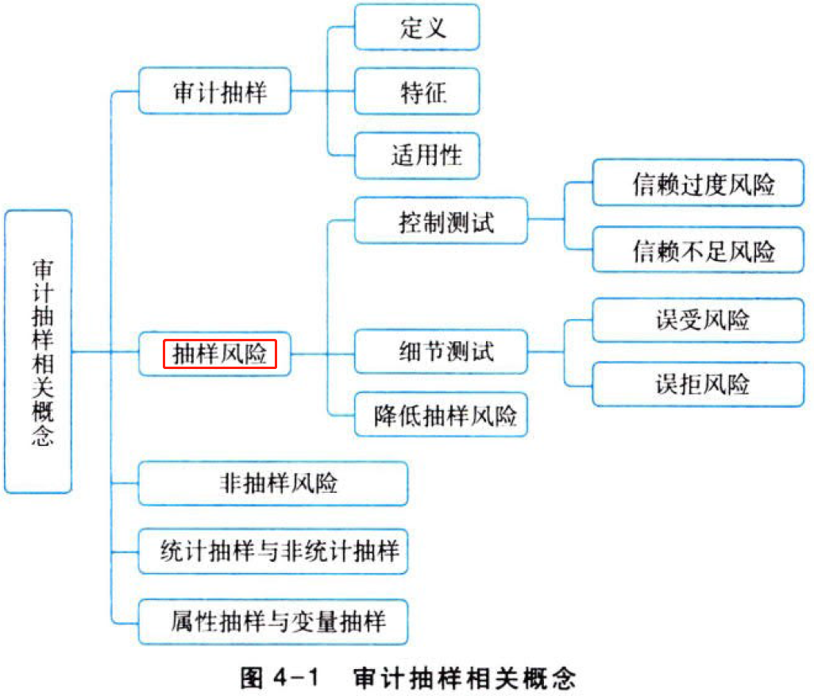

## 1.1. ［考点一］审计抽样:star: :star: :star: 

审计抽样的内涵，归纳如下表。

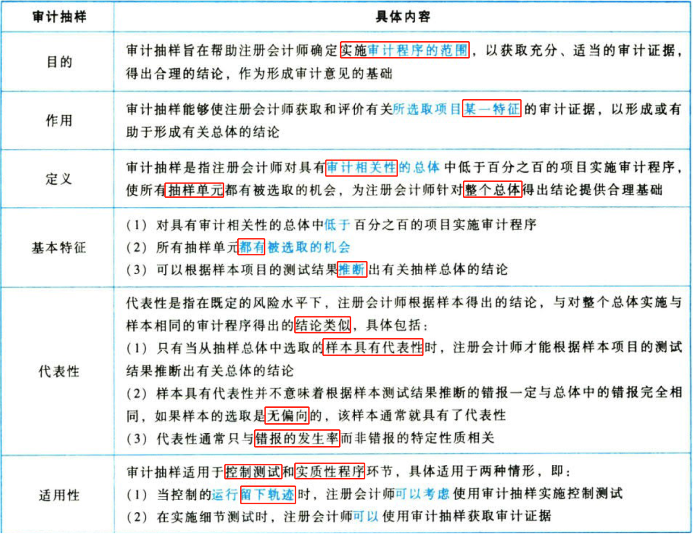

审计抽样不适用于风险评估程序，当然也不适用于“了解内部控制”；不能简单的说审计抽样适用或不适用于“实质性程序”，当然可以说审计抽样不适用于实质性分析程序，如图4-2所示。

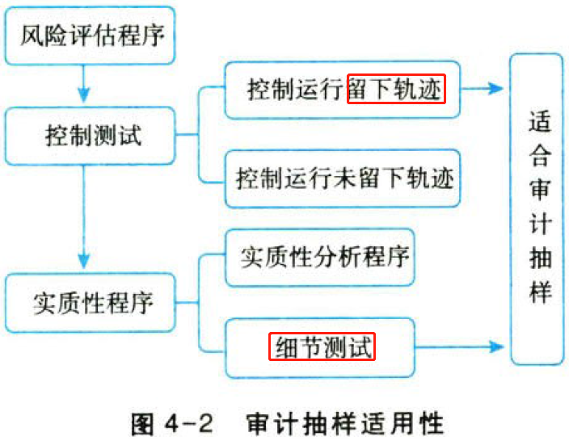

## 1.2. ［考点二］抽样风险:star: :star: :star: 

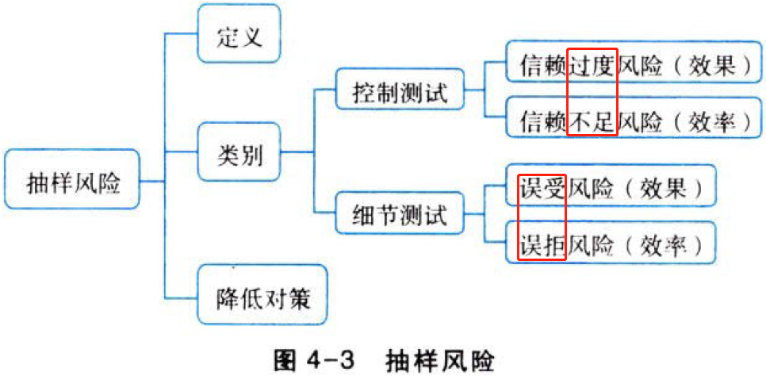

如罔4-3，抽样风险的三个方面内容归纳如下表。

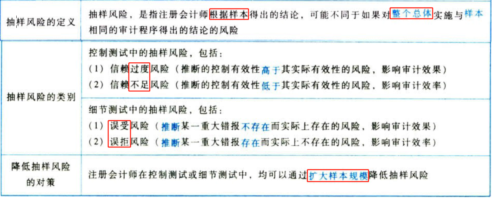

## 1.3. ［考点三］非抽样风险:star: :star: :star: 

### 1.3.1. 非抽样风险的定义

非抽样风险，是指注册会计师由于任何与抽样风险无关的原因而得出错误结论的风险。

抽样风险是由于注册会计师选取和测试低于百分之百的项目导致的，而非抽样风险与样本规模没有关系，是人为因素造成的。

### 1.3.2. 可能导致非抽样风险的原因

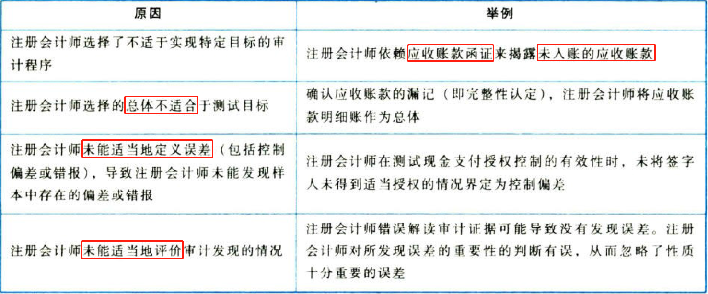

### 1.3.3. 降低非抽样风险的对策

通过采取适当的质量控制政策和程序，对审计了作进行适当的指导、监督和复核，仔细设计审计程序，以及对审计实务的适当改进，注册会计师可以将非抽样风险降至可接受的水平。

## 1.4. ［考点四］统计抽样vs非统计抽样:star: :star: 

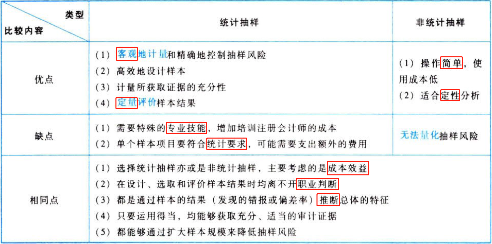

## 1.5. ［考点五］属性抽样vs变量抽样:star: :star: 

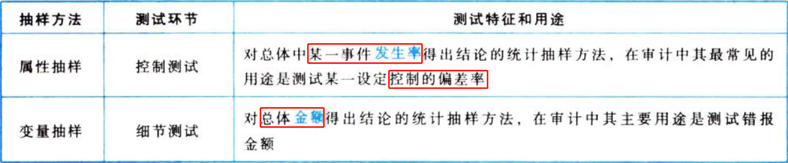

（1）在控制测试中，注册会计师采用审计抽样得出的结论是控制运行偏差率，是属性抽样的本质特征。

（2）在细节测试中，注册会计师采用审计抽样得出的结论是总体错报金额，是变量抽样的本质特征。

（3）货币单元抽样是运用属性抽样的原理，得出总体错报金额的结论，不是单纯的属性抽样也不是单纯的变量抽样，属于综合属性变量抽样。

# 2. 审计抽样在控制测试中的应用

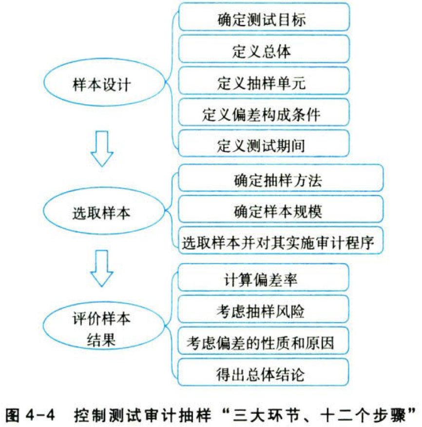

## 2.6. ［考点一］样本设计阶段:star: :star: 

控制测试中的样本设计解决的是“抽取什么样的样本’，需要从五个方面展开：

### 2.6.4. 确定测试目标

注册会计师实施控制测试的目标是提供关于控制运行`有效性`的审计证据，以支持计划的重大错报风险评估水平。

### 2.6.5. 定义总体

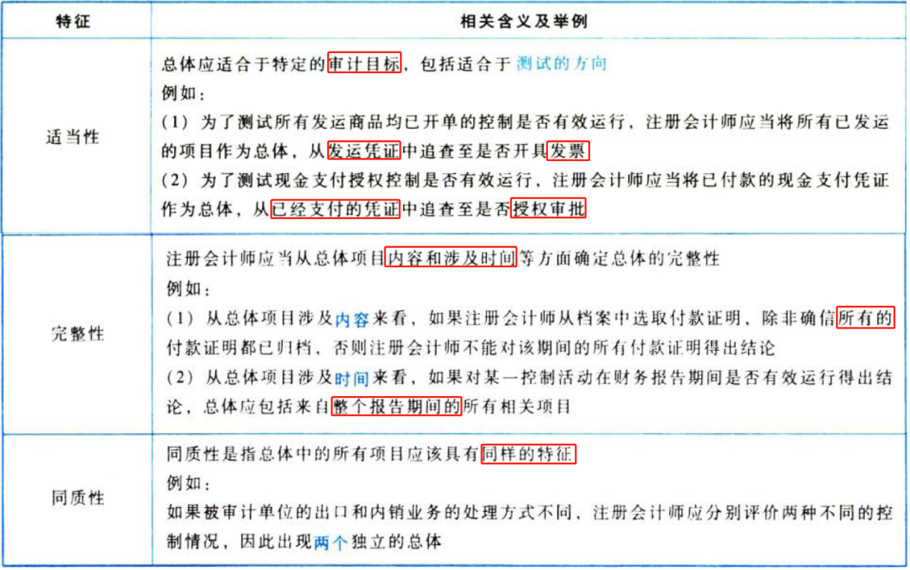

### 2.6.6. 定义抽样单元

在控制测试中，抽样单元通常是能够提供控制运行`证据`的一份文件资料、一个记录或其中一行，每个抽样单元构成了总体中的一个项目。

### 2.6.7. 定义偏差构成条件

在控制测试中，偏差是指偏离`对设定控制的预期`执行。在评估控制运行的有效性时，注册会计师应当考虑其认为必要的所有环节。

### 2.6.8. 定义测试期间

注册会计师通常在`期中`实施控制测试。由于期中测试获取的证据只与控制截至期中测试时点的运行有关，注册会计师需要确定如何获取关于剩余期间的证据。注册会计师可以有两种做法：

#### 2.6.8.1. 将测试扩展至在剩余期间发生的交易，以获取额外的证据

##### 2.6.8.1.1. （1）初始测试。

注册会计师可能将总体定义为包括整个被审计期间的交易，但在期中实施初始测试。在这种情况下，应册会计师可能估计总体中剩余期间将发生的交易的数量，并在期末审计时对所有发生在期中测试之后的被选取交易进行检查。例如，如果被审计单位在当年的前10个月开具了编号从1到10000的发票，注册会计师可能估计，根据企业的经营周期，剩下两个月中将开具2500张发票；因此注册会计师在选取所需的样本时用1到12500作为编号。所选取的发票中，编号小于或等于10000的样本项目在期中审计时进行检查，剩余的样本项目将在期末审计时进行检查。

##### 2.6.8.1.2. （2）估计总体的特征。

在估计总体规模时，注册会计师可能考虑上年同期的实际情况、变化趋势以及经营性质等因素。在审计实务中，注册会计师可能高估或低估剩余项目的数量，如下表所示。

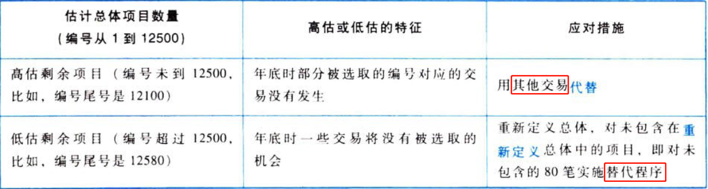

在许多情况下，注册会计师可能不需要等到被审计期间结束，就能得出关于控制的运行有效性是否支持其计划评估的重大错报风险水平的结论。在对选取的交易进行期中测试时，注册会计师发现的误差可能足以使其得出结论：即使在发生于期中测试以后的交易中未发现任何误差，控制也不能支持计划评估的重大错报风险水平。在这种情况下，注册会计师可能决定不将样本扩展至期中测试以后发生的交易，而是相应地修正计划的重大错报风险评估水平和实质性程序。

#### 2.6.8.2. 不将测试扩展至在剩余期间发生的交易

在这种情况下，总体只包括从年初到期中测试日为止的交易，测试结果也只能针对这个期间进行推断，注册会计师可以使用`替代方法`测试剩余期间的控制有效性。

在确定是否需要针对剩余期间获取额外证据以及获取哪些证据时，注册会计师通常考虑下列因素：

（1）评估的认定层次重大错报风险的重要程度；

（2）在期中测试的特定控制和测试结果，以及自期中测试后控制发生的重大变动；

（3）在期中对有关控制运行有效性获取的审计证据的程度；

（4）剩余期间的长度；

（5）在信赖控制的基础上拟缩小实质性程序的范围；

（6）控制环境。

注册会计师应当获取与`控制在剩余期间发生的所有重大变化的性质和程度`有关的证据，包括其人员的变化。如果发生了重大变化，注册会计师应修正其对内部控制的了解，并考虑对变化后的控制进行测试。或者，注册会计师也可以考虑对剩余期间实施实质性分析程序或细节测试。

## 2.7. ［考点二］选取样本阶段:star: :star: 

注册会计师主要从三个方面考虑解决选取样本问题：

### 2.7.9. 确定抽样方法

#### 2.7.9.3. 简单随机选样（适用于统计抽样和非统计抽样）

（1）使用这种方法，相同数量的抽样单元组成的每种组合被选取的概率都相等。

（2）注册会计师可以使用计算机或随机数表获得所需的随机数，选取匹配的随机样本。

#### 2.7.9.4. 系统选样（适用于统计抽样和非统计抽样）

##### 2.7.9.4.3. （1）系统选样的应用步骤。

①计算选样间隔：

$$选样间隔=\frac{总体规模}{样本规模}$$

②在第一个间隔中确定选样随机起点。

③根据间隔顺序选取样本。

##### 2.7.9.4.4. （2）系统选样的举例（见教材4.2）。

假设销售发票的总体范围是652～3151，设定的样本量是125，则：

①选样间距为(3151-652+1)/125=20；

②注册会计师在第一个间隔（652-671）中确定一个随机起点，如果随机起点是661；

③选取的发票号码：

起点661.选样间距20，则：

第1个样本项目的发票号码：$661$；

第2个样本项目的发票号码：$661+20\times{1}=681$；

……

第125个样本项目的发票号码：$661+20\times{124}=3141$

#### 2.7.9.5. 随意选样（仅适用于非统计抽样）

（1）注册会计师要避免任何有意识的偏向或可预见性，从而保证总体中的所有项目都有被选中的机会，使选择的样本具有代表性。

（2）在使用统计抽样时，运用随意选样是不恰当的，因为注册会计师无法量化选取样本的概率。

#### 2.7.9.6. 整群选样（通常不能在审计抽样中使用）

（1）使用这种方法，注册会计师从总体中选取一群（或多群）连续的项目。例如，总体为20x1年的所有付款单据，从中选取2月3日、5月17日和7月19日这三天的所有付款单据作为样本。

（2）整群选样通常不能在审计抽样中使用，因为大部分总体的结构都使连续的项目之间可能具有相同的特征，但与总体中其他项目的特征不同。虽然在有些情况下注册会计师检查一群项目可能是适当的审计程序，但当注册会计师希望根据样本作出有关整个总体的有效推断时，极少将整群选样作为适当的选样方法。

### 2.7.10. 确定样本规模

#### 2.7.10.7. 控制测试中影响样本规模的因素

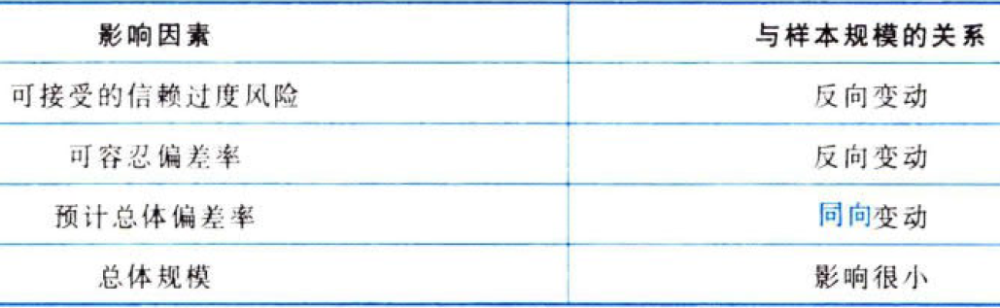

（1）可接受的信赖过度风险。

可接受的信赖过度风险与样本规模反向变功。注册会计师愿意接受的信赖过度风险越低，样本规模通常越大。反之，注册会计师愿意接受的信赖过度风险越高，样本规模越小。

（2）可容忍偏差率。

在控制测试中，可容忍偏差率是指注册会计师设定的偏离规定的内部控制的比率，注册会计师试阁对总体中的实际偏差率不超过该比率获取适当水平的保证。换言之，可容忍偏差率是注册会计师能够接受的最大偏差数量，如果偏差超过这一数量则减少或取消对内部控制的信赖。

（3）预计总体偏差。

对于控制测试，注册会计师在考虑总体特征时，需要根据对相关控制的了解或对总体中少量项目的检查来评估预期偏差率。

在既定的可容忍偏差率下，预计总体偏差率越大，所需的样本规模越大。预计总体偏差率不应超过可容忍偏差率，如果预期总体偏差率高得无法接受，意味着控制有效性很低，注册会计师通常决定不实施控制测试，而实施更多的实质性程序。

（4）总体规模。

除非总体非常小，一般而言，总体规模对样本规模的影响几乎为零。注册会计师通常将抽样单元超过2000个的总体视为大规模总体。对大规模总体而言，总体的实际容量对样本规模几于没有影响。对小规模总体而言，审计抽样比其他选择测试项目的方法的效率低。

（5）其他因素。

①控制运行的相关期间越长（年或季度），需要测试的样本越多，因为注册会计师需要对整个拟信赖期间控制的有效性获取证据。

②控制程序越复杂，测试的样本越多。

③样本规模还取决于所测试的控制的类型，通常对人工控制实施的测试要多过自动化投制，因为人工控制更容易发生错误和偶然的失败，而针对计算机系统的信息技术一般控制只要有效发挥作用，曾经测试过的自动化控制一般都能保持可靠运行。在确定被审计单位自动控制的测试范围时，如果支持其运行的信息技术一般控制有效，注册会计师测试一次应用程序控制便可能足以获得对控制有效运行的较高的保证水平（链接教材8.3，对自动化控制的测试范围的特别考虑）。

④如果所测试的控制包含人工监督和参与（如：偏差报告、分析、评估、数据输入、信息匹配等），则通常比自动控制需要测试更多的样本。

#### 2.7.10.8. 针对运行频率较低的内部控制的考虑

注册会计师在测试控制运行频率较低的内部控制时，所需测试的样本数量有一个经验值可以借鉴，如下表所示。

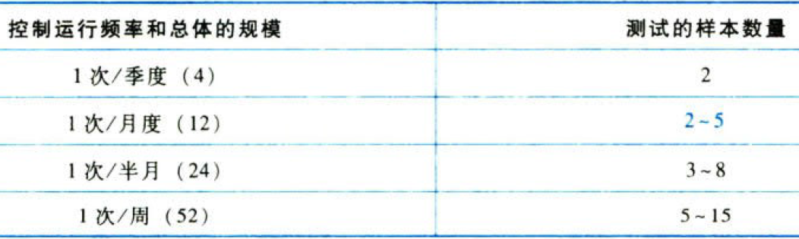

如上表所示：

（1）一般情况下，样本规模接近表中样本数量区间的下限是适当的。

（2）如果控制发生变化，或曾经发现控制缺陷，样本规模更可能接近甚至超过表中样本数量区间的上限。

（3）如果拟测试的控制是针对相关认定的唯一控制，注册会计师往往可能需要测试比表中所列更多的样本。

#### 2.7.10.9. 确定样本量

（1）实施控制测试时，注册会计师可能使用统计抽样，也可能使用非统计抽样。

（2）在非统计抽样中，注册会计师可以只对影响样本规模的因素进行定性的估计，并运用职业判断确定样本规模。

（3）使用统计抽样方法时，注册会计师必须对影响样本规模的因素进行量化，并利用根据统计公式开发的专门的计算机程序或专门的样本量表来确定样本规模。

### 2.7.11. 选取样本并对其实施审计程序

在对选取的样本项目实施审计程序时可能出现以下几种情况：

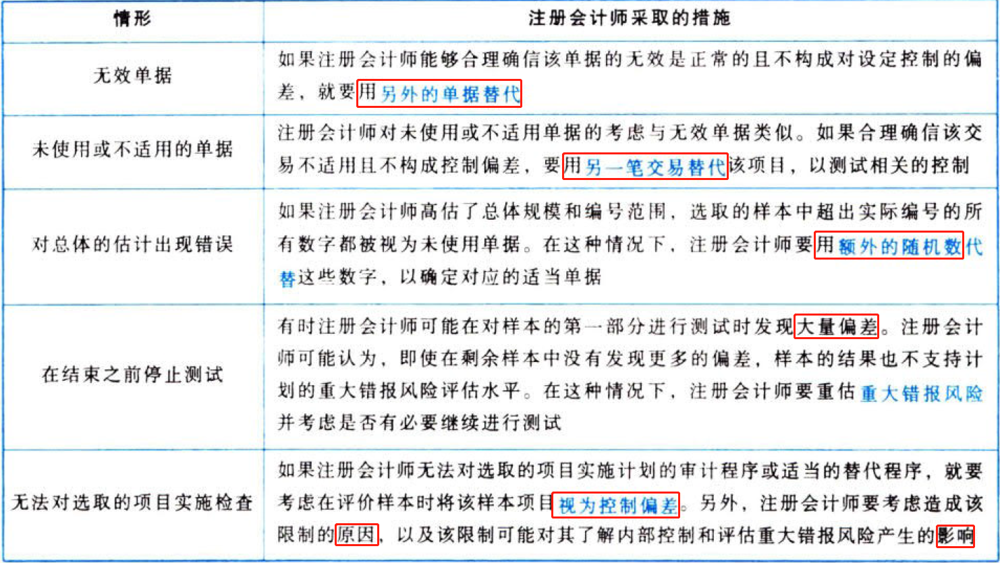

## 2.8. ［考点三］评价样本结果阶段:star: :star: :star: 

注册会计师主要从四个方面评价样本结果：

### 2.8.12. 计算偏差率

将样本中发现的偏差数量除以样本规模，就可以计算出样本偏差率。样本偏差率就是注册会计师对总体偏差率的最佳估计，因而在控制测试中无须另外推断总体偏差率，但注册会计师还必须考虑抽样风险。

### 2.8.13. 考虑抽样风险

#### 2.8.13.10. 使用统计抽样方法

（1）使用统计公式评价样本结果。

$$总体偏差率上限=\frac{风险系数R}{样本量n}$$

在统计抽样中，评价的标准是比较总体偏差率上限与可容忍偏差率的关系，如图4-5所示。

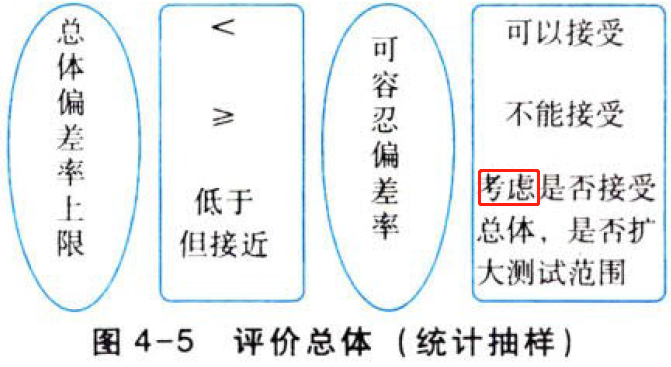

（2）控制测试时考虑抽样风险举例（统计抽样）。

情形一（结合教材举例的数据）：

注册会计师对55个样本项目实施了既定的审计程序，且未发现偏差，则在既定的可接受信赖过度风险（10%）下，根据样本结果计算总体偏差率上限如下：

$$总体偏差率上限=风险系数/样本量=2.3/55=4.18%$$

假设可容忍偏差率为7%，注册会计师根据以上公式的计算结果（4.18%\<7%）可以得出以下结论：

①总体实际偏差率超过4.18%的风险为10%，即有90%的把握保证总体实际偏差率不超过4.18%；

②总体的实际偏差率超过可容忍偏差率的风险很小，总体可以接受；

③样本结果（4.18%\<7%）证实注册会计师对控制运行有效性的估计和评估的重大错报风险水平是适当的，因此注册会计师无需扩大实质性程序的范围，无需修改审计计划。

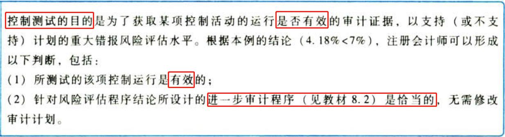

情形二（结合教材举例的数据）：

注册会计师对55个样本项目实施了既定的审计程序，发现2个偏差，则在既定的可接受信赖过度风险（10%）下，根据样本结果计算总体偏差率上限如下：

$$总体偏差率上限=风险系数/样本量=5.3/55=9.64%$$

假设可容忍偏差率为7%，注册会计师根据以上公式的计算结果（9.64\$\>7%）可以得出以下结论：

①总体实际偏差率超过9.64%的风险为10%;

②在可容忍偏差率为7%的情况下，总体的实际偏差率超过可容忍偏差率的风险很大，总体不能接受；

③样本结果（9.64%\>7%）不支持注册会计师了解内部控制时预期控制运行有效性的结论，需要扩大实质性程序的范围，修改审计计划。

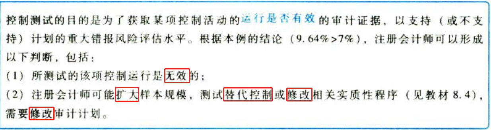

#### 2.8.13.11. 使用非统计抽样方法

在非统计抽样中，样本偏差率等于样本中发现的偏差数量除以样本规模，即“总体偏差率的最佳点估计”。

在非统计抽样中，评价的标准是比较估计的总体偏差率（即样本偏差率）与可容忍偏差率，如图4-6所示。

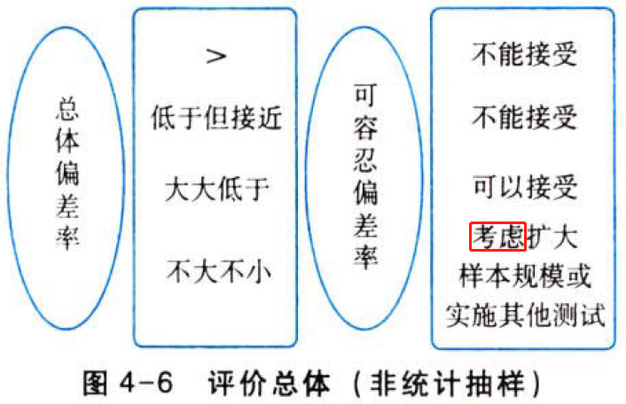

### 2.8.14. 考虑偏差的性质和原因

（1）除了关注偏差率和抽样风险之外，注册会计师还应当调查识别出的所有偏差的性质和原因，并评价其对审计程序的目的和审计的其他方面可能产生的影响。无论是统计抽样还是非统计抽样，对样本结果的定性评估和定量评估一样重要。即使样本的评价结果在可接受的范围内，注册会计师也应对样本中的所有控制偏差进行定性分析。

（2）如果注册会计师发现许多偏差具有`相同的特征`，如交易类型、地点、生产线或时期等，则应考虑该特征是不是引起偏差的原因，是否存在其他尚未发现的具有相同特征的偏差。此时，注册会计师应将具有该共同特征的全部项目划分为一层，并对层中的所有项目实施审计程序，以发现潜在的系统偏差。

（3）一般情况下，如果在样本中发现了控制偏差，注册会计师有两种处理办法：一是扩大样本规模，以进一步收集证据。二是认为控制没有有效运行，样本结果不支持计划的控制运行有效性和重大错报风险的评估水平，因而提高重大错报风险评估水平，增加对相关账户的实质性程序。

（4）分析偏差的性质和原因时，注册会计师还要考虑已识别的偏差对财务报表的直接影响。控制偏差虽然增加了金额错报的风险，但并不一定导致财务报表中的金额错报。如果某项控制偏差更容易导致金额错报，该项控制偏差就更加重要。

### 2.8.15. 得出总体结论

在计算偏差率，考虑抽样风险，分析偏差的性质和原因之后，注册会计师需要运用职业判断得出总体结论。如果样本结果及其他相关审计证据支持计划评估的控制有效性，从而支持计划的重大错报风险评估水平，注册会计师可能不需要修改计划的实质性程序。

如果样本结果不支持计划的控制运行有效性和重大错报风险的评估水平，注册会计师通常有两种选择：

（1）进一步测试其他控制（如补偿性控制），以支持计划的控制运行有效性和重大错报风险的评估水平；

（2）提高重大错报风险评估水平，并相应修改计划的实质性程序的性质、时间安排和范围。

# 3. 审计抽样在细节测试中的运用

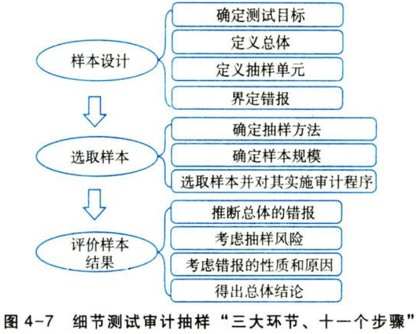

## 3.9. ［考点一］样本设计阶段:star: :star: 

细节测试的样本设计解决的是“抽取什么样的样本”，需要从四个方面展开：

### 3.9.16. 确定测试目标

审计抽样通常用来测试有关财务报表金额的一项或多项认定（如应收账款的存在）的合理性。如果该金额是合理正确的，注册会计师将接受与之相关的认定，认为财务报表金额不存在重大错报。

### 3.9.17. 定义总体

#### 3.9.17.12. 适当性

（1）注册会计师应确信抽样总体适合于特定的审计目标（认定）。

（2）不同性质的交易可能导致借方余额、贷方余额和零余额多种情况并存，注册会计师需要根据风险、相关认定和审计目标进行不同的考虑。

例如：

①测试应付账款的高估（与存在认定柑关），注册会计师应将应付账款明细表定义为总体。

②测试应付账款的低估（与完整性认定相关），注册会计师可以将期后付款记录、未付款的发票、供货商的对账单、没有销售发票对应的收货报告，或能提供低估应付账款的审计证据的其他项目定义为总体，而不应将应付账款明细表定义为总体。

#### 3.9.17.13. 完整性

（1）总体的完整性包括代表总体的实物的完整性。

（2）如果代表总体的实物和总体不一致，注册会计师可能对总体得出错误的结论。

（3）如果谊册会计师将选择的实物和总体比较之后，认为代表总体的实物遗漏了应包含在最终评价中的总体项目，注册会计师应选择新的实物，或对被排除在实物之外的项目实施替代程序，并询问遗漏的原因。

（4）在细节测试中，谊册会计师还应当运用职业判断，判断某账户余额或交易类型中是否存在及存在哪些应该单独测试而不能放在抽样总体中的项目。

（5）在审计抽样时，销售收入和销售成本通常被视为两个独立的总体。为了减少样本量而仅将毛利率作为一个总体是不恰当的，因为收入错报并非总能被成本错报抵销，反之亦然。

### 3.9.18. 定义抽样单元

在细节测试中，抽样单元可能是一个账户余额、一笔交易或交易中的一个记录（如销售发票中的单个项目），甚至是每个货币单元。

### 3.9.19. 界定错报

在细节测试中，注册会计师应根据审计目标界定错报。

## 3.10. ［考点二］选取样本阶段:star: :star: :star: 

### 3.10.20. 确定抽样方法

在细节测试中进行审计抽样，可能使用统计抽样，也可能使用非统计抽样。注册会计师在细节测试中常用的统计抽样方法包括货币单元抽样和传统变量抽样。

#### 3.10.20.14. 货币单元抽样

（1）货币单元抽样的定义。

货币单元抽样是一种运用属性抽样原理对货币金额而不是对发生率得出结论的统计抽样方法，它是概率比例规模抽样方法的分支，有时也被称为金额单元抽样、累计货币金额抽样以及综合属性变量抽样等。

［举例］假定被审计单位有12个应收账款明细账，如下表。

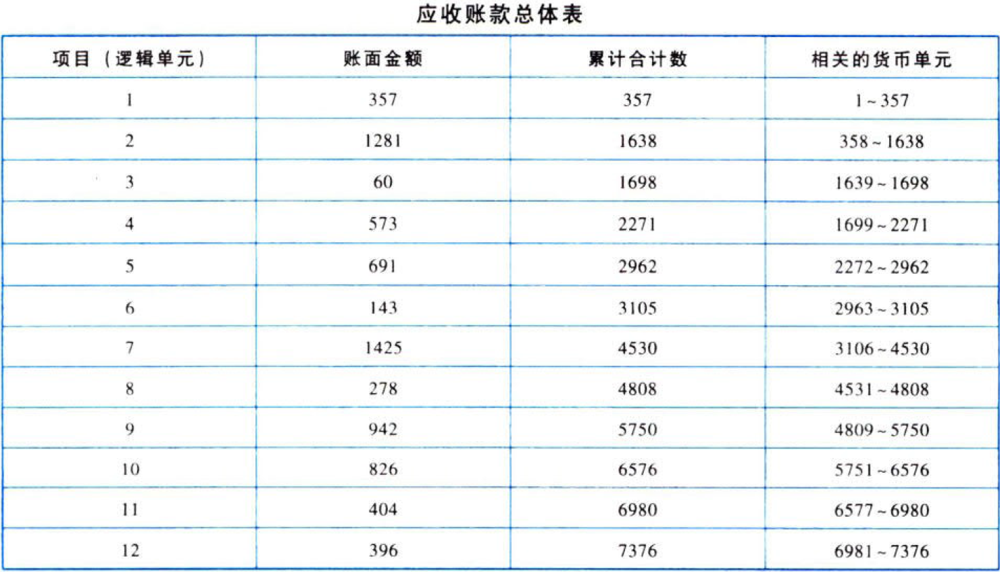

在货币单元抽样中，将“项目”称为“逻辑单元”，这12个逻辑单元账面金额累计为7376，我们将其称作“总体”。

假如注册会计师采用计算机程序随机生成的4个数字是：6586、1756、856、6799，则包含这些随机金额的总体中的逻辑单元省南累计合计数栏确定。它们分别是：

①项目11(6577～6980元）（包含随机数6586）；

②项目4(1699～2271元）（包含随机数1756）；

③项目2(358～1638元）（包含随机数856）；

④项目11(6577～6980元）（包含随机数6799）；

有2个随机数6586和6799对应的项目均为11，但在统计上仍视为2个样本项目（仅需审计一次），样本中的项目总数也仍然是4个。注册会计师将项目11、4、2、11对应的迈得单元进行审计，并将各逻辑单元的审计结果，应用到它们各自所在区间的货币金额上。

（2）货币单元抽样的优缺点。货币单元抽样的优缺点都是相比于传统变量抽样而言的。

#### 3.10.20.15. 传统变量抽样

（1）传统变量抽样的定义。

传统变量抽样运用正态分布理论，棍据样本结果推断总体的特征。传统变量抽样涉及难度较大、较为复杂的数学计算：注册会计师通常使用计算机程序确定样本规模，一般不需懂得这些方法所用的数学公式。

（2）传统变量抽样的优缺点。

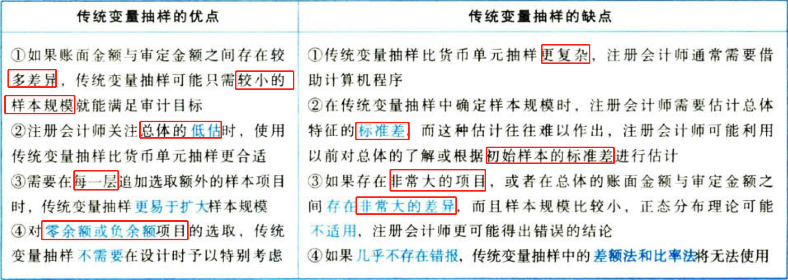

#### 3.10.20.16. 传统变量抽样常见的方法

##### 3.10.20.16.5. 均值法

$$样本审定金额的平均值=\frac{样本审定金额}{样本规模}$$

$$估计的总体金额=样本审定金额的平均值\times总体规模$$

$$推断的总体错报=总体账面金额-估计的总体金额$$

##### 3.10.20.16.6. 差额法

$$样本平均错报=\frac{(样本账面金额-样本审定金额)}{样本规模}$$

$$推断的总体错报=样本平均错报\times总体规模$$

$$估计的总体金额=总体账面金额-推断的总体错报$$

##### 3.10.20.16.7. 比率法

$$比率=\frac{样本审定金额}{样本账面金额}$$

$$估计的总体金额=总体账面金额\times比率$$

$$推断的总体错报=总体账面金额-估计的总体金额$$

#### 3.10.20.17. 提示

（1）如果未对总体进行分层，注册会计师通常不使用均值法。

（2）如果预计没有差异或只有少量差异，就不应使用差额法和比率法。

（3）如果发现错报金额与项目的金额紧密相关，注册会计师通常会选择比率法。

（4）如果发现错报金额与项目的数量紧密相关，注册会计师通常会选择差额法。

### 3.10.21. 确定样本规模

#### 3.10.21.18. 细节测试中影响样本规模的因素

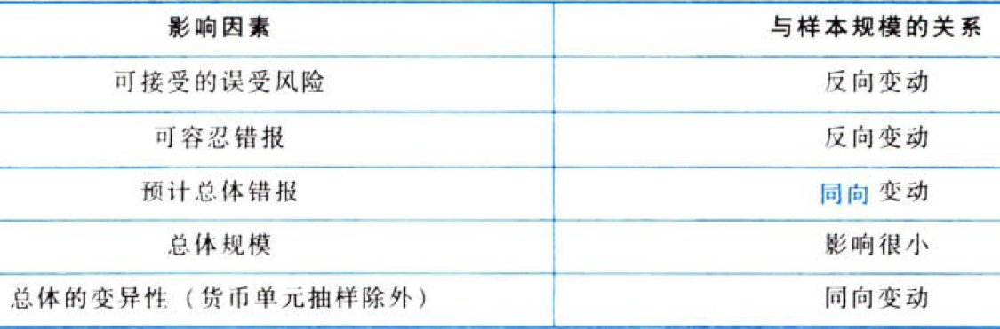

在货币单元抽样中，总体不具有变异性，因为每一个抽样单元是由每一元构成的。

#### 3.10.21.19. 确定样本量

（1）依据细节测试货币单元抽样样本规模表（教材表4-8）确定样本量。

（2）使用传统变量抽样方法时，注册会计师通常运用计算机程序确定适当的样本规模。

（3）注册会计师还可以使用下列公式确定样本规模：

样本规模＝总体账面金额／可容忍错报×保证系数

$样本规模=\frac{总体账面金额}{可容忍错报}\times保证系数$

### 3.10.22. 选取样本并对其实施审计程序

#### 3.10.22.20. 选样方法

注册会计师可以根据具体情况，从简单随机选样、系统选样或随意选样中挑选适当的选样方法选取样本，也可以使用计算机辅助审计技术提高选样的效果。

#### 3.10.22.21. 在货币单元抽样中以系统选样法选取样本

如果注册会计师在货币单元抽样中以系统选样法选取样本，可以分三步走：

第一，确定选样间隔，即用总体账面金额除以样本规模，得到选样间隔；

第二，在第一个间隔中确定一个随机起点，从这个随机起点开始，按照选样间隔，从总体中顺序选取样本；

第三，注册会计师对包含被选取货币单元的账户余额或交易（即逻辑单元）实施检查。

例如，在应收账款明细账户中，账户A1、A2、A3、A4、A5……的账面金额分别为200元、150元、350元、100元、700元……，则：

A1占的货币区间为1～200元；

A2占的货币区间为201～350元；

A3占的货币区间为351～700元；

A4占的货币区间为701～800元；

A5占的货币区间为801～1500元；

……

如果注册会计师确定的选样间隔为300元，然后从1～300元（含300元）之间选择一个随机起点，比如选第150元为随机起点，则随后挑选出来的样本依次为：第450元（150+300）、第750元（450+300）、第1050元（750+300）、第1350元（1050+300）……注册会计师将对其实施检查的逻辑单元分别为账户A1（包含第150元）、A3（包含第450元）、A4（包含第750元）、A5（包含第1050元）……，如下表所示。

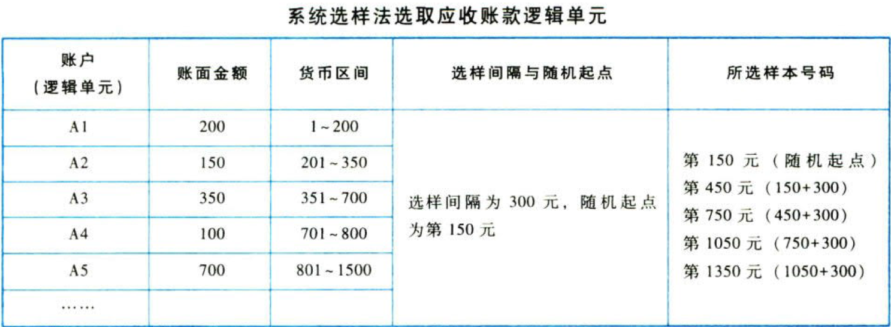

如上表所示，我们可以归纳总结如下：

（1）如果逻辑单元的账面金额大于或等于选样间隔，该项目一定会被挑选出来，比如逻辑单元A3和A5，就一定会被挑选出来；

（2）如果逻辑单元的账面金额是选样间隔的数倍，该项目将不止一次地被挑选出来，比如逻辑单元A5，就有两次被选取的机会，这种情况下，最终选取的逻辑单元数量小于确定的样本规模；

（3）为简化样本评价工作，注册会计师可能对账面金额大于或等于选样间隔的项目实施100%的检查，而不将其纳入抽样总体。

## 3.11. ［考点三］评价样本结果阶段:star: :star: :star: 

细节测试中的评价样本结果需要从4个方面展开：

### 3.11.23. 推断总体的错报

#### 3.11.23.22. 推断总体错报的方法

根据样本中发现的错报金额估计总体的错报金额时，注册会计师可以使用比率法、差额法及货币单元抽样法等。

教材重点介绍的是货币单元抽样法下如何推断总体的错报。

#### 3.11.23.23. 货币单元抽样法

（1）如果逻辑单元的账面金额大于或等于选样间隔，推断的错报就是该逻辑单元的实际错报金额；

（2）如果逻辑单元的账面金额小于选样间隔，注册会计师首先计算存在错报的所有逻辑单元的错报百分比，这个百分比就是整个选样间隔的错报百分比（因为每一个被选取的货币收元都代表了整个选样间隔中的所有货币单元），再用这个错报百分比乘以选样间隔，得出推断错报的金额；

（3）将所有这些推断错报汇总后，再加上在金额大于或等于选样间隔的逻辑单元中发现的实际错报，注册会计师就能计算出总体的错报金额。

［举例］假如注册会计师确定的选样间隔是3000元，如果在样本中发现了3个高估错报，项目的账面金额分别为100元、200元和5000元，审定金额分别为0元、150元和4000元，相关情况如下表：

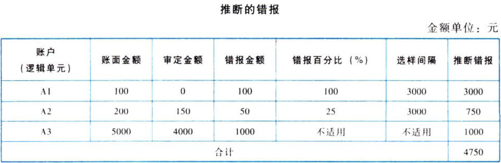

### 3.11.24. 考虑抽样风险

#### 3.11.24.24. 非统计抽样

在非统计抽样中，注册会汁师运用职业判断和经验考虑抽样风险。

例如，某账户的账面金额为1000000元，可容忍错报为50000元，根据适当的样本推断的总体错报为10000元，由于推断的总体错报远远低于可容忍错般，注册会计师可能合理确信，总体实际错报金额超过可容忍错报（50000元）的风险很低，因而总体可以接受，即该账户（审计前账面金额为1000000元）不存在重大错报。

#### 3.11.24.25. 货币单元抽样

在货币单元抽样中，注册会计师通常使用保证系数（教材表4-10），考虑抽样风险的影响，计算总体错报的上限。

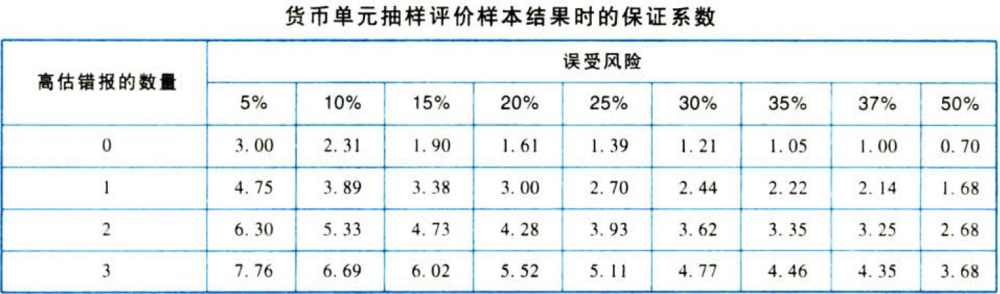

计算总体错报的上限的具体情形如下：

（1）如果在样本中没有发现错报，总体错报的上限＝保证系数×选样间隔。

例如，如果误受风险为5%，选样间隔为3000元，注册会计师没有在样本中发现错报，总体错报的上限为保证系数×选样间隔，即9000元（3×3000）。

如果在总体中没有发现错报，此时总体错报的上限也被称作“基本精确度”。

（2）如果在账面金额大于或等于选样间隔的逻辑单元中发现了错报、无论该错报的百分比是否为100%，总体错报的上限=事实错报+基本精确度。

例如，如果误受风险为5%，选样间隔为3000元，注册会计师在样本中发现1个错报，该项目的账面金额为5000元，审定金额为4000元，总体错报的上限=事实错报+基本精确度=10000元（1000+3x3000）。

如果某一个项目（即逻辑单元）审计前的账面金额大于或等于选样间隔，该项目（即逻辑单元）存在的错报为“事实错报”。

（3）如果在样本（排除账面金额大于或等于选样间隔的逻辑单元）中发现了错报百分比为100%的错报，总体错报的上限＝保证系数×选样间隔。

例如，如果误受风险为5%，选样间隔为3000元，注册会计师在样本中发现1个错报，该项目的账面金额为20元，审定金额为0元，此时错报百分比为100%，查表（教材表4-10）确定的保证系数为4.75，则总体错报的上限＝保证系数×选样间隔＝14250元（4.75×3000）。

（4）如果在样本（排除账面金额大于或等于选样间隔的逻辑单元）中发现了错报百分比低于100%的错报，注册会计师先计算推断错报，再将推断错报按金额降序排列后，分别乘以对应的保证系数增量（即在既定的误受风险水平下，特定数量的高估错报所对应的保证系数与上一行保证系数之间的差异），加上基本精确度之后，最终计算出总体错报的上限。

总体错报的上限＝推断错报×保证系敬的增量＋基本精确度。

例如，如果误受风险为5%，选样间隔为3000元，注册会计师在样本中发现2个错报，帐户A的账面金额为2000元，审定金额为1500元，推断错报为750元（500÷2000x3000）；账户B的账面金额为1000元，审定金额为200元，推断错报为2400元（800÷1000x3000）。

如下表所示：注册会计师将推断错报按金额降序排列后，在5%的误受风险水平下（源自教材表4-10），账户A对应的保证系数增量为1.55，账户B对应的保证系数增量为1.75。因此，总体错报的上限为：(500÷2000x3000)×1.55+(800÷1000x3000)×1.75+3×3000=14363（元）（保留了整数）。

注册会计师发现了错报百分比低于100%的错报时，推断总体错报如下表（保留整数）。

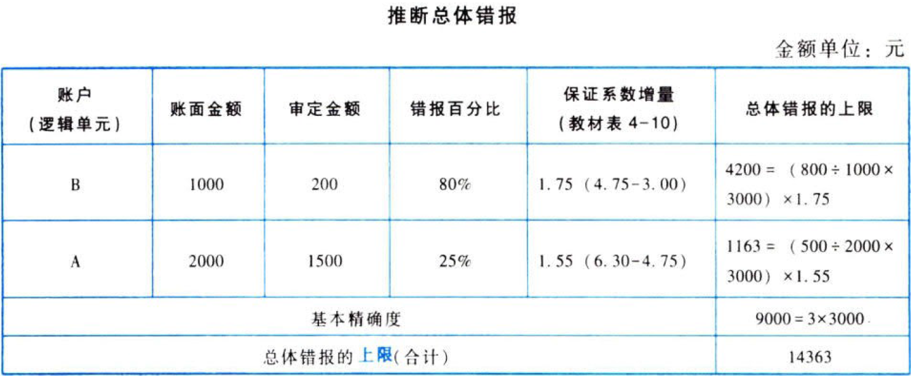

（5）如果样本中既有账面金额大于或等于选样间隔的逻辑单元，又有账面金额小于选样间隔的逻辑单元，而且在账面金额小于选样间隔的逻辑单元中，既发现了错报百分比为100%的错报，又发现了错报百分比低于100%的错报。注册会计师可以将所有样本项目分成两组：

第一组：账面金额大于或等于选样间隔的逻辑单元，注册会计师计算出该组项目的事实错报；

第二组：账面金额小于选样间隔的逻辑单元，无论该组项目的错报百分比是否为100%，注册会计师都先计算出各项目的推断错报，再将所有推断错报按金额降序排列后，分别乘以对应的保证系数增量，并将计算结果累计起来。用这个累计结果加上基本精确度，再加上第一组项目中的事实错报、就是最终总体错报的上限。

（6）评价总体是否可以接受。

在货币单元抽样中，注册会计师将总体错报的上限与可容忍错报进行比较。如果总体错报的上限小于可容忍错报，注册会计师可以初步得出结论，样本结果支持总体的账面金额。

### 3.11.25. 考虑错报的性质和原因

除了评价错报的金额和频率以及抽样风院之外，注册会计师还应当考虑：

（1）错报的性质和原因，是原则还是应用方面的差异？是错误还是舞弊导致？是误解指令还是粗心大意所致？

（2）错报与审计工作其他阶段之间可能存在的关系。

### 3.11.26. 得出总体结论

（1）总体要求。

在推断总体的错报，考虑抽样风险，分析错报的性质和原因之后，注册会计师需要运用职业判断得出总体结论。

（2）如果样本结果不支持总体账面金额，且注册会计师认为账面金额可能存在错报，注册会计师通常会建议被审计单位对错报进行调查，并在必要时调整账面记录。

（3）依据被审计单位已更正的错报对推断的总体错报额进行调整后，注册会计师应当将该类交易或账户余额中剩余的推断错报与其他交易或账户余额中的错报总额累计起来，以评价财务报表整体是否存在重大错报。

（4）无论样本结果是否表明错报总额超过了可容忍错报，注册会计师都应当要求被审计单位的管理层记录已发现的事实错报（除非明显微小）。

（5）如果样本结果表明注册会计师作出抽样计划时依据的假设有误，注册会计师应当采取适当的行动。例如，如果细节测试中发现的错报的金额或频率大于依据重大错报风险的评估水平作出的预期，注册会计师需要考虑重大错报风险的评估水平是否仍然适当。注册会计师也可能决定修改对重大错报风险评估水平低于最高水平的其他账户拟实施的审计程序。

### 3.11.27. 非统计抽样示例

背景资料：

A注册会计师负责审计甲公司20×9年度财务报表。截至20x9年12月31日，应收账款共有935个明细账户，其中：有期末借方余额的有905个明细账户，账面金额为4250000元；有期末贷方余额的有30个明细账户，账面金额为5000元。注册会计师计划采用非统计抽样方法，通过函证测试应收账款是否存在重大错报（与应收账款存在认定相关）。

#### 3.11.27.26. 抽样总体

对应收账款项目实施抽样的总体为900个明细账户，审计前金额为3750000元，如下表所示。

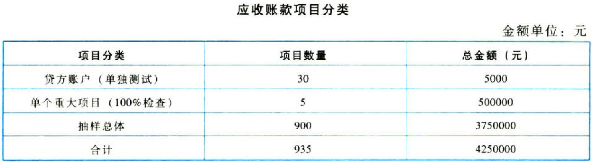

注：因为贷方账户涉及重分类调整，对应收账款的测试不需考虑，因此本表合计金额中不包含贷方账户金额。

#### 3.11.27.27. 抽样单元

应册会计师定义的抽样单元是每个应收账款明细账户。

#### 3.11.27.28. 分层

考虑到所测试的应收账款项目（即总体）的变异性，注册会计师根据应收账款各明细账账户的账面金额，将总体分成两层，如下表所示。

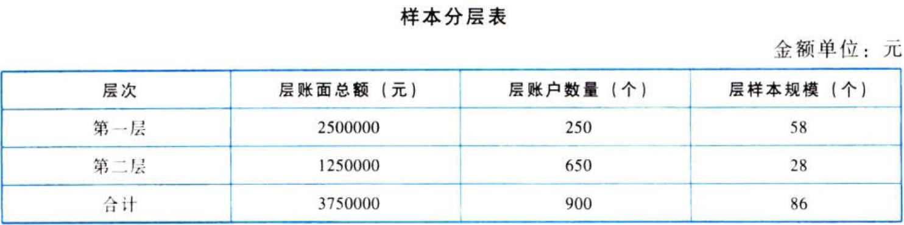

#### 3.11.27.29. 确定样本量（运用“查表法”）

假设可接受的误受风险为10%，可容忍的错报为150000元，预计的总体错报为30000元。根据教材表4-8.当可接受的误受风险为10%，可容忍的错报与总体账面金额之比为4%，预计总体错报与可容忍错报之比为20%时，样本量为86。

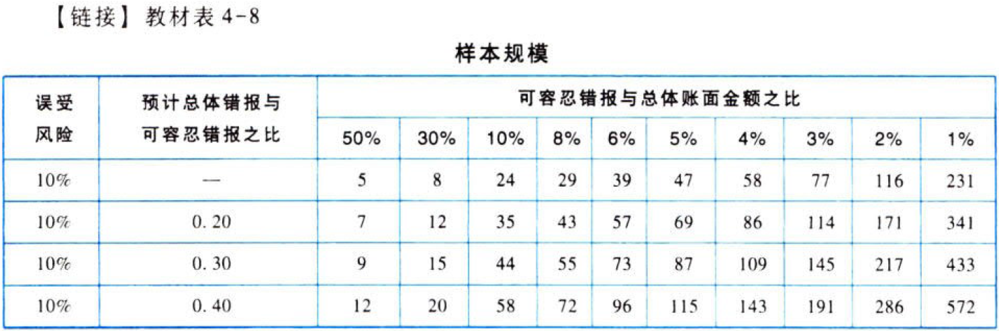

注册会计师运用职业判断和经验，认为86样本规模是适当的，不需要调整。注册会计师根据各层账面金额在总体账面金额中的占比大致分配样本，从第一层选取58个项目，从第二层选取28个项目。

#### 3.11.27.30. 对样本实施的函证

注册会计师对91个账户（86个样本+5个单个重大项目）逐一实施函证程序，收到了80个询证函回函。注册会计师对没有收到回函的11个账户实施了替代程序，认为能够合理保证这些账户不存错报。在收到回函的80个账户中，有4个存在高估，注册会计师对其作了进一步调查，确定只是笔误导致，不涉及舞弊等因素。错报情况如下在所示。

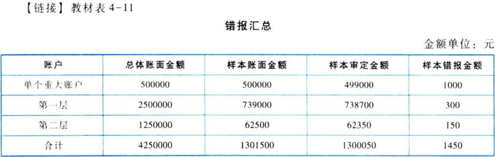

注：为方便汇总错报，此表将单个重大账户一并纳入。但实际上，注册会计师需要对单个重大账户实施100%的检查。

#### 3.11.27.31. 计算各层样本错报

根据各层的样本错报推断各层的错报金额，如下表所示（保留整数）。

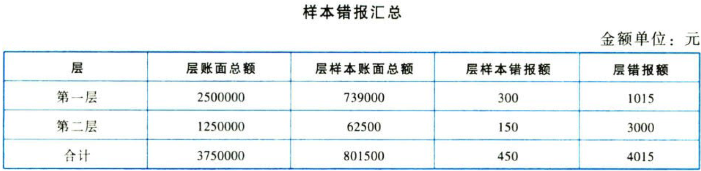

注：层错报额=层样本错报额÷层样本账面总额×层账面总额。

#### 3.11.27.32. 推断总体错报

分层推断的错报，再加上实施100%检查的单个重大账户中发现的错报，注册会计师推断的应收账款期末高估错报总额为5015元（1000+1015+3000）。

#### 3.11.27.33. 评价抽样结果

假设公司管理层同意更正1450元的事实错报，因此，剩余的推断错报为3565元(5015-1450）。剩余的推断错报（3565元）远远低于可容忍错报（150000元），注册会计师认为应收账款总体实际错报金额超过可容忍错报的抽样风险很低，因而总体可以接受。

注册会计师得出结论，样本结果支持应收账款账面金额。不过，注册会计师还应将剩余的推断错报与其他事实错报和推断错报汇总，以评价财务报表整体是否可能存在重大错报。

### 3.11.28. 统计抽样示例

背景资料：

A注册会计师负责审计甲公司20x9年度财务报表。截至20x9年12月31日，应收账款共有602个明细账户，其中：期末借方余额的有600个明细账户，账面金额为2300000元；期末货方余额的有2个明细账户，账面金额为3000元。注册会计师计划采用货币单元抽样法，通过函证测试应收账款是否存在重大错报（与应收账款存在认定相关）。

#### 3.11.28.34. 抽样总体

对应收账款项目实施抽样的总体为594个明细账户，审计前金额为2000000元，如下表所示。

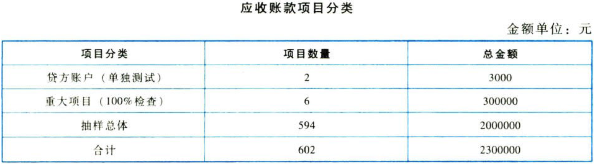

注：因为贷方账户涉及重分类调整，对应收账款测试不需考虑，因此本表合计金额中不包含贷方账户金额。

#### 3.11.28.35. 抽样单元

注册会计师定义的抽样单元是每个货币单元。

#### 3.11.28.36. 确定样本量（运用“查表法”）

假设可接受的误受风险为10%，可容忍的错报为40000元，预计的总体错报为8000元。根据教材表4-8，当可接受的误受风险为10%，可容忍的错报与总体账面金额之比为2%，预计总体错报与可容忍错报之比为20%时，样本量为171。

#### 3.11.28.37. 选取样本（系统选样法）

选样间隔为：2000000÷171≈11695

注册会计师对171个账户（上述6个单个重大项目和2个贷方账户已单独测试，未发现错报）逐一实施函证程序，收到了155个询证函回函。注册会计师对没有收到回函的16个账户实施了替代程序，认为能够合理保证这些账户不存在错报。在收到回函的155个账户中，有4个存在高估，注册会计师对其作了进一步调查，确定只是笔误导致，不涉及舞弊等因素。

#### 3.11.28.38. 推断错报

根据样本的错报，推断错报汇总，如下表所示（保留整数）。

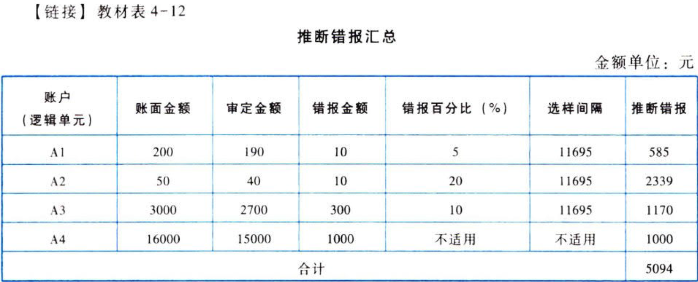

如果逻辑单元的账面金额大于或等于选样间隔，推断的错报就是该逻辑单元的实际错报金额，账户A4正是这种情况。

注册会计师使用教材表4-10中的保证系数，如下表所示。

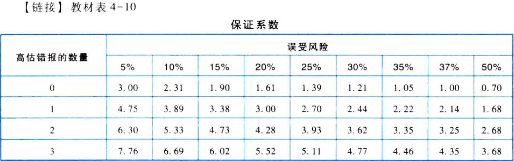

#### 3.11.28.39. 计算总体错报的上限

注册会计师考虑抽样风险的影响，计算总体错报的上限，如下表所示（保留整数）。

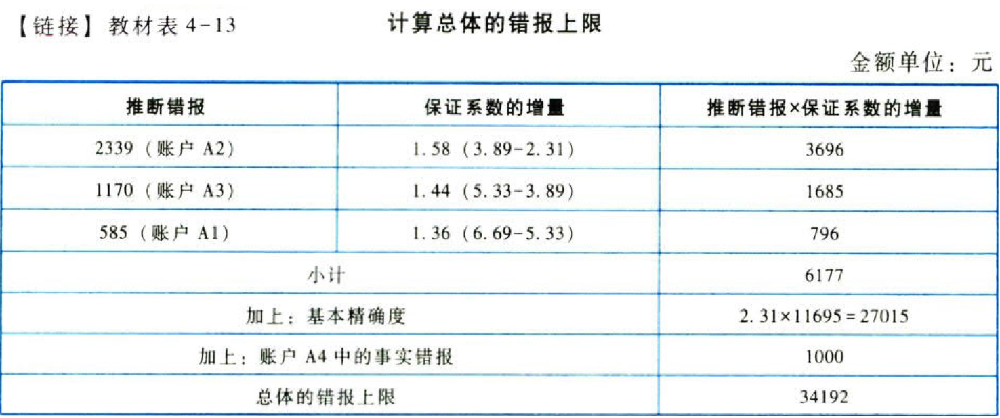

由于总体错报上限（34192元）小于可容忍错报（40000元），注册会计师得出结论，样本结果支出应收账款账面金额。

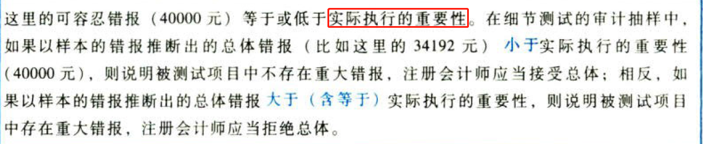

# 4. 总结

End。
