C01审计概述

# 1. 审计的概念与保证程度

## 1.1. ［考点一］财务报表审计的定义及理解要点:star: :star: :star: 

### 1.1.1. 财务报表审计的定义

财务报表审计，是指注册会计师对财务报表是否不存在重大错报提供合理保证，以积极方式提出意见，增强除管理层之外的预期使用者对财务报表信赖的程度。

### 1.1.2. 理解要点

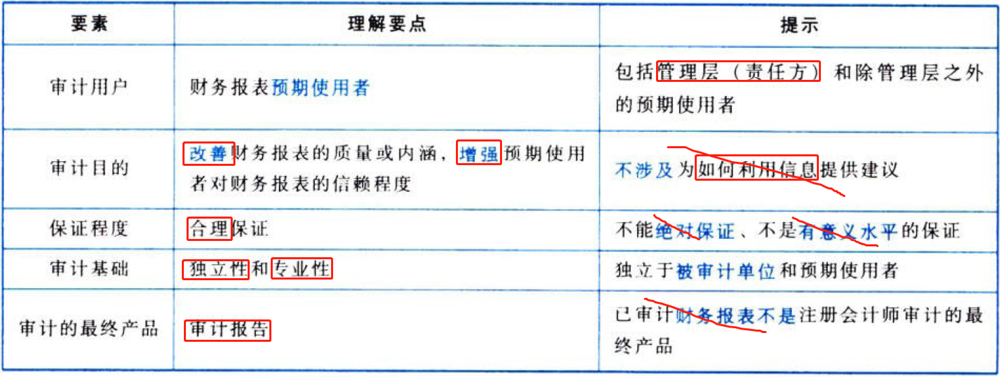

## 1.2. ［考点二］保证程度:star: :star: :star: 

### 1.2.3. 注册会计师的专业服务

“保证程度”与“专业服务”类型密切相关。注册会计师提供的专业服务包括鉴证业务和相关服务，如图1-1所示。

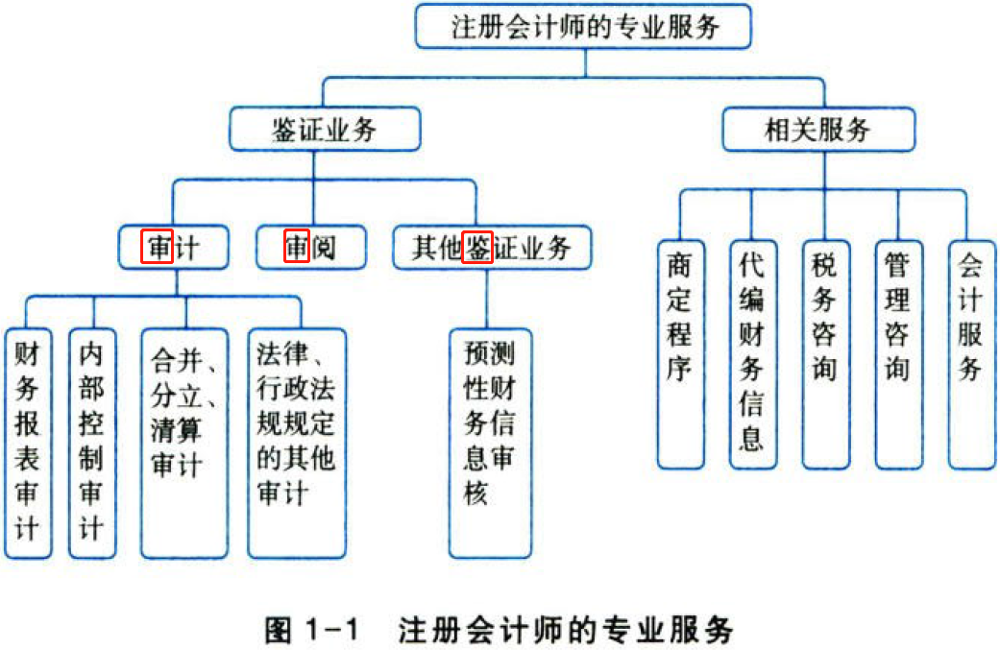

### 1.2.4. 专业服务与保证程度

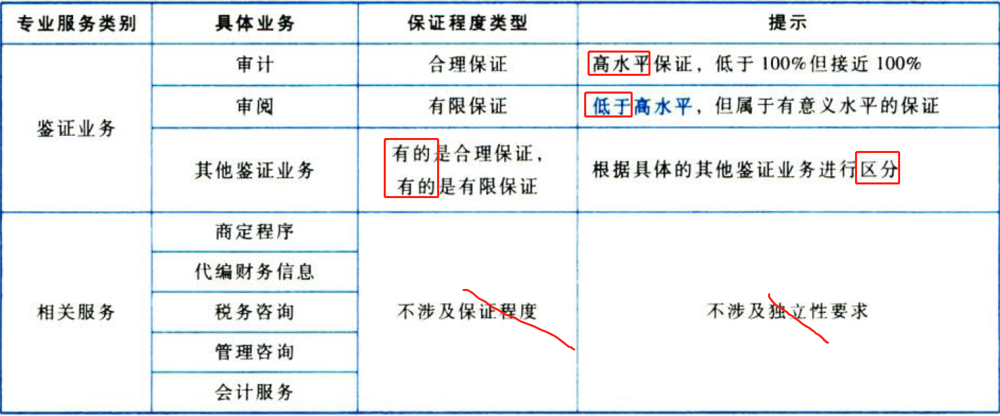

### 1.2.5. 合理保证vs有限保证

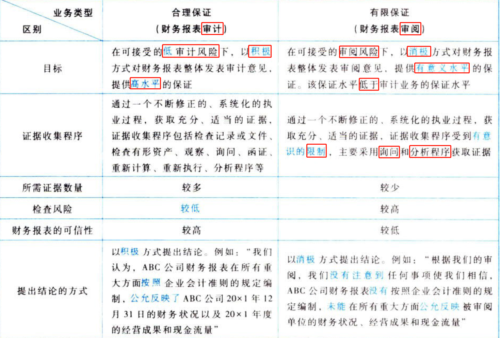

# 2. 审计要素

## 2.3. ［考点一］审计五要素:star: :star: 

在财务报表审计中，审计要素包括审计业务的三方关系人（1/5）、财务报表（2/5）、财务报表编制基础（3月）、审计证据（4/5）、审计计报告（5/5），如图1-2所示。

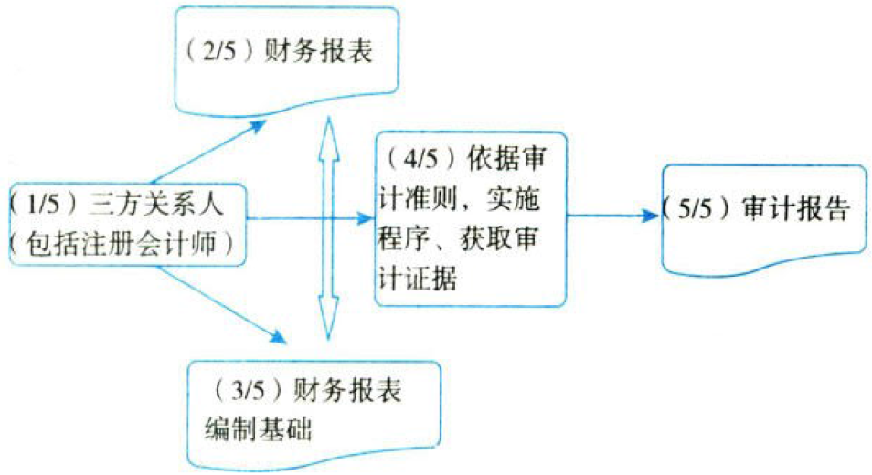

## 2.4. ［考点二］审计业务的三方关系人(1/5):star: :star: 

审计业务的三方关系人是指管理层（责任方）、注册会计师和除管理层之外的预期使用者，如图1-3所示。

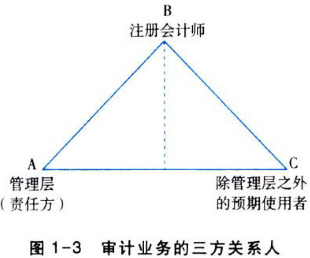

### 2.4.6. 管理层（责任方）

针对财务报表审计业务，责任方是指对财务报表负责的组织或人员，即被审计单位管理层。

### 2.4.7. 预期使用者

（1）预期使用者是指预期使用审计报告和财务报表的组织或人员。

（2）预期使用者分为管理层和除管理层之外的预期使用者。

（3）注册会计师的审计意见主要是向除管理层之外的预期使用者提供，但客观上可能对管理层有用，因此，管理层也会成为预期使用者之一。

### 2.4.8. 责任方与预期使用者

（1）责任方与预期使用者来自同一企业，但不是同一方。

例如，某上市实体同时设有董事会和监事会，监事会需要对董事会和管理层负责编制的财务报表进行监督。此时，责任方和预期使用者虽然来自同一企业，但不是同一方。

（2）责任方与预期使用者来自同一企业，是同一方。

例如，一家集团公司的集团管理层（预期使用者）可能聘请注册会计师对该集团全资子公司管理层直接负责的特定经营管理活动进行审计，但集团管理层（预期使用者）对全资子公司承担最终责任。此时，责任方与预期使用者不仅来自同一企业，也是同一方。

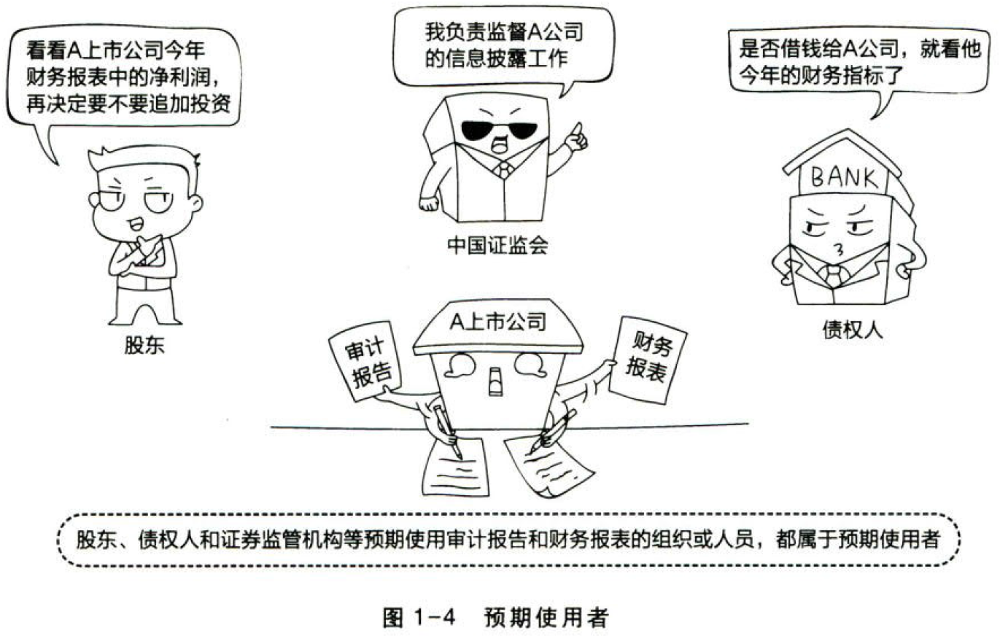

### 2.4.9. 管理层认可并理解的责任（即管理层责任）

与管理层和治理层责任相关的执行审计工作的前提（以下简称执行审计工作的前提），是指管理层和治理层（如适用）认可并理解其应承担下列责任，这些责任构成注册会计师按照审计准则的规定执行审计工作的基础：

（1）按照适用的财务报告编制基础编制财务报表，并使其实现公允反映（如适用）；

（2）设计、执行和维护必要的内部控制，以使财务报表不存在由于舞弊或错误导致的重大错报；

（3）向注册会计师提供必要的工作条件，包括允许注册会计师接触与编制财务报表相关的所有信息（如记录、文件和其他事项），向注册会计师提供审计所需的其他信息，允许在册会计师在获取审计证据时不受限制地接触其认为必要的内部人员和其他相关人员。

## 2.5. ［考点三］审计证据(4/5):star: :star: :star: 

### 2.5.10. 审计证据的定义

审计证据，是指注册会计师为了得出审计结论和形成审计意见而使用的必要信息。

在“审计要素”中讨论的“审计证据”是“大概念”，针对的是事务所承接与执行某一审计业务而言；教材3.1所讨论的审计证据是“小概念”，针对的是财务报表重大错报风险的“识别、评估与应对”范畴。

### 2.5.11. 审计证据的特征

（1）审计证据在性质上具有累积性，主要是在审计过程中通过实施审计程序获取的。

（2）审计证据还可能包括从其他来源获取的信息，如以前审计中获取的信息（前提是注册会计师已确定自上次审计后是否已发生变化，这些变化可能影响这些信息对本期审计的相关性）或会计师事务所接受与保持客户或业务时实施质量控制程序获取的信息。

（3）除从被审计单位内部其他来源和外部来源获取的信息外，会计记录也是重要的审计证据来源。同样，被审计单位雇用或聘请的专家编制的信息也可以作为审计证据。

（4）审计证据既包括支持和佐证管理层认定的信息，也包括与这些认定相矛盾的信息。

（5）在某些情况下，信息的缺乏（如管理层拒绝提供住册会计师要求的声明）本身也构成审计证据，可以被注册会计师利用。

# 3. 审计目标

## 3.6. ［考点一］审计的总体目标:star: 

财务报表审计中，注册会计师的总体目标是：

（1）对财务报表整体是否不存在由于舞弊或错误导致的重大错报获取合理保证，使得注册会计师能够对财务报表是否在所有重大方面按照适用的财务报表编制基础编制发表审计意见。

（2）按照审计准则的规定，根据审计结果对财务报表财务报表出具审计报告，并与管理层和治理层沟通。

## 3.7. ［考点二］认定:star: :star: :star: 

### 3.7.12. 认定的定义

认定，是指管理层在财务报表中作出的明确或隐含的表达，注册会计师将其（即明确或隐含的表达）用于考虑可能发生的不同类型的潜在错报。

### 3.7.13. 认定类别

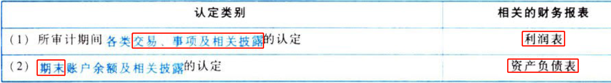

### 3.7.14. 关于所审计期间各类交易、事项及相关披露的认定

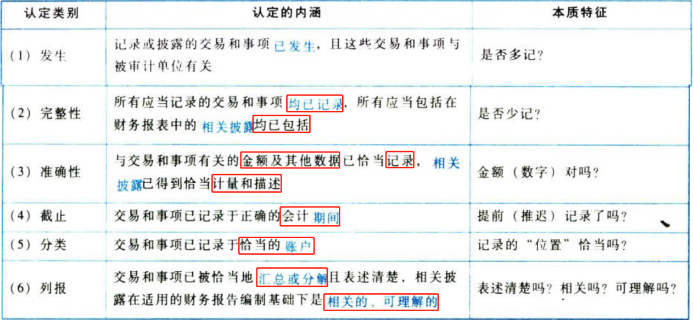

与利润表相关的认定类别包括：发生、完整性、准确性、截止、分类、列报，每年在“综合题”作答时需要“填写”。请大家依据上表逻辑，精准掌握“认定类别”和“内涵”。

### 3.7.15. 关于期末账户余额及相关披露的认定

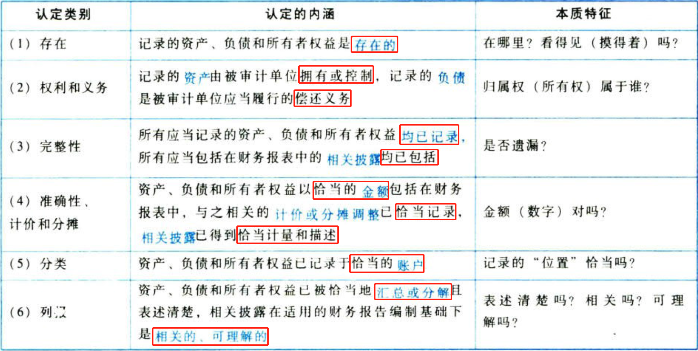

与资产负债表相关的认定类别包括：存在、权利和义务、完整性、准确性、计价和分摊、分类、列报。每年在“综合题”作答时需要“填写”。请大家依据上表逻辑，精准掌握“认定类别”和“内涵”。

## 3.8. ［考点三］具体审计目标:star: :star: 

“具体审计目标”针对的是管理层“认定”。“认定、目标、程序、证据”之间有明确的逻辑关系，如图1-5所示。

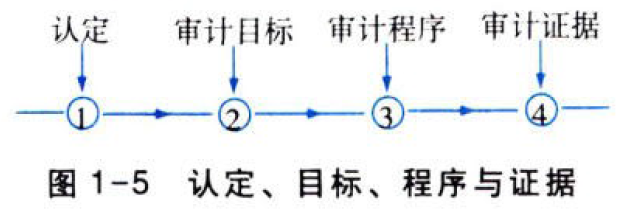

（1）认定与目标。

具体审计目标与（管理层）认定类别是严格的一一对应关系。

（2）目标与程序。

注册会计师需要根据其确定的具体审计目标设计和实施审计程序。

（3）程序与证据。

注册会计师实施审计程序获取其所需的充分、适当的审计证据，最终对所审计的财务报表提供合理保证。

### 3.8.16. 与所审计期间各类交易、事项及相关披露相关的认定与审计目标

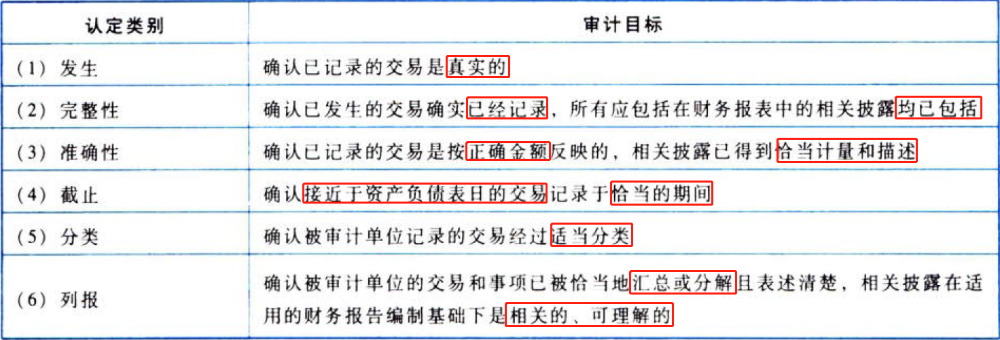

### 3.8.17. 与期末账户余额及相关披露相关的认定与审计目标

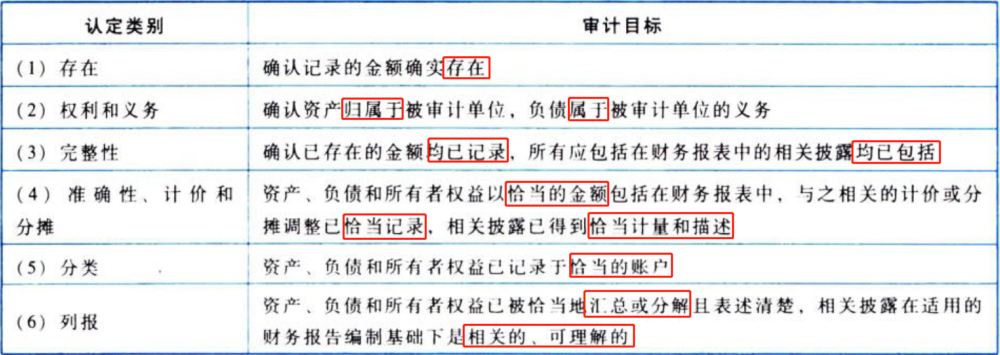

### 3.8.18. 认定、审计目标、审计程序之间的关系举例

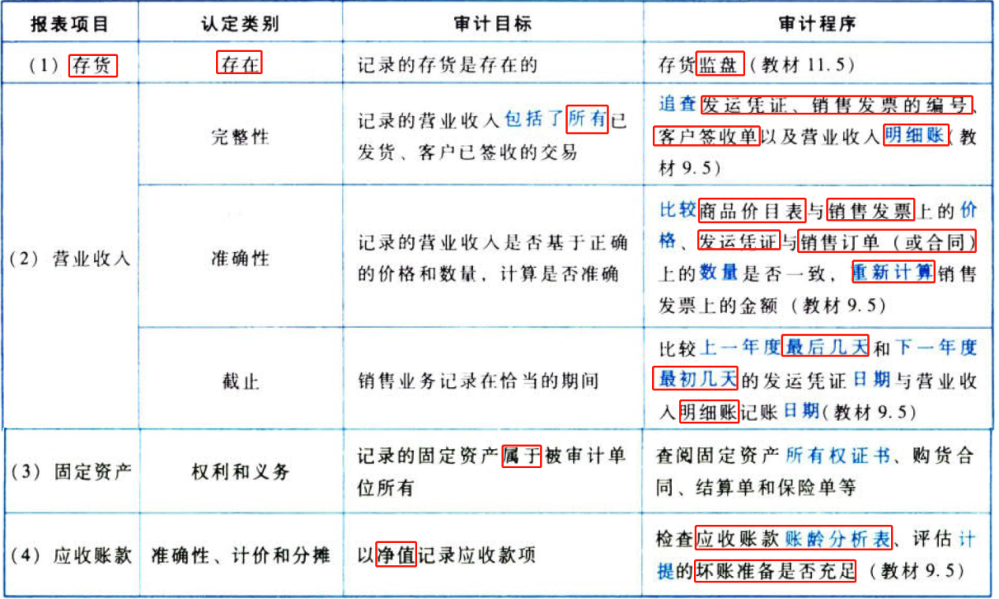

# 4. 审计基本要求

在财务报表审计中，注册会计师为了实现合理保证的审计目标应当遵守四项“基本要求”，如图1-6所示。

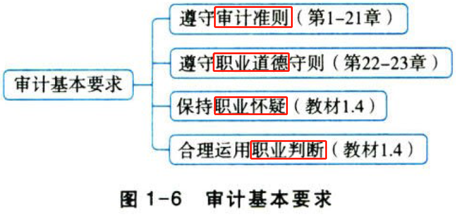

其中，“遵守审计准则”贯穿在教材前二十一章，“遵守职业道德守则”详见教材最后两章。本节需要重点掌握的是保持职业怀疑和合理运用职业判断这两项“基本要求”。

## 4.9. ［考点一］保持职业怀疑:star: :star: :star: 

建议大家结合修订后的《中国注册会计师审计准则问题解答第1号——职业怀疑》进行学习，如图1-7所示。

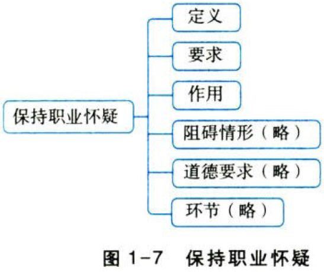

### 4.9.19. 职业怀疑的定义

职业怀疑，是指注册会计师执行审计业务的一种态度，包括采取质疑的思维方式，对可能表明由于错误或舞弊导致错报的迹象保持警觉，以及对审计证据进行审慎评价。

### 4.9.20. 职业怀疑的要求（四个要求）

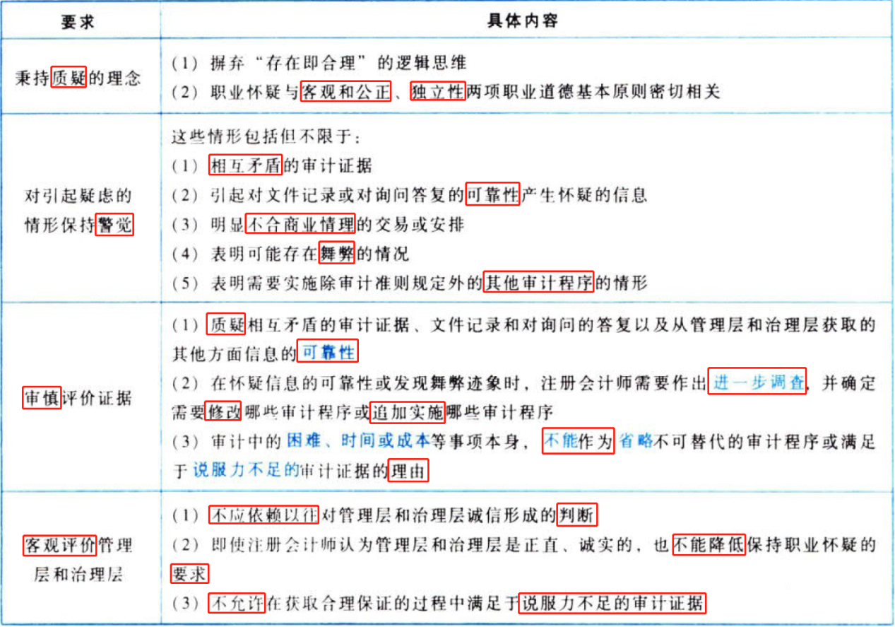

### 4.9.21. 保持职业怀疑的作用（“3+1”）

保持职业怀疑的作用是通过审计过程体现出米的，主要体现在三大环节，分别是风险评估程序、进一步审计程序、评价审计证据。同时，在这三大环节中，注册会计师应当特别考虑舞弊风险。

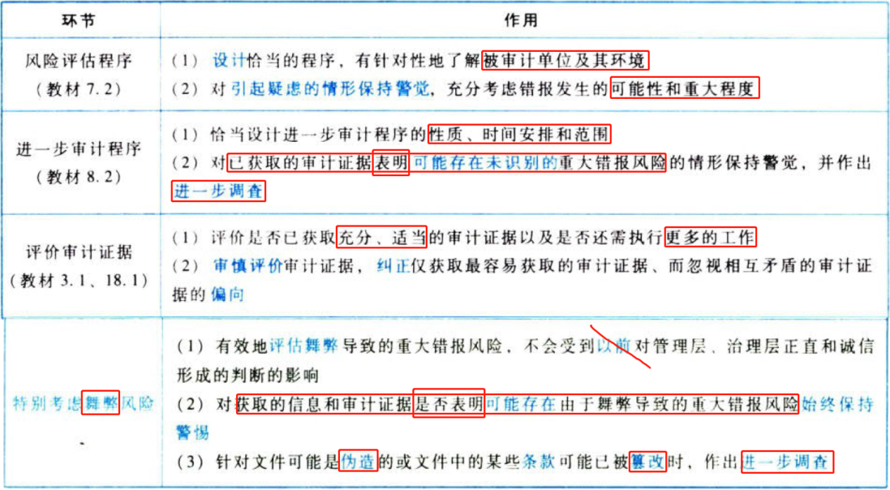

## 4.10. ［考点二］合理运用职业判断:star: :star: 

### 4.10.22. 职业判断的定义

职业判断，是指在审计准则、财务报告编制基础和职业道德要求的框架下，注册会计师综合运用相关知识、技能、经验，作出适合审计业务具体情况、有根据的行动决策。

### 4.10.23. 需要运用职业判断的重要领域（六大领域）

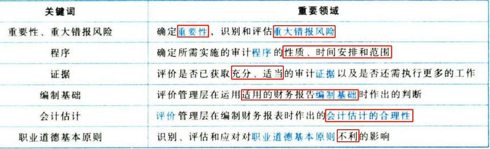

### 4.10.24. 衡量职业判断质量（三个特征）

### 4.10.25. 对职业判断作出适当书面记录

对职业判断作出以下适当书面记录，有利于提高职业判断的可辩护性：

（1）对职业判断问题和目标的描述；

（2）解决职业判断相关问题的思路；

（3）收集到的相关信息；

（4）得出的结论以及得出结论的理由；

（5）就决策结论与被审计单位进行沟通的方式和时间。

# 5. 审计风险

## 5.11. ［考点一］审计风险模型相关概念:star: :star: :star: 

与审计风险模型相关的风险可以划分两大类，与被审计单位有关的风险（独立于财务报表审计）和注册会计师控制的风险，如下表所示：

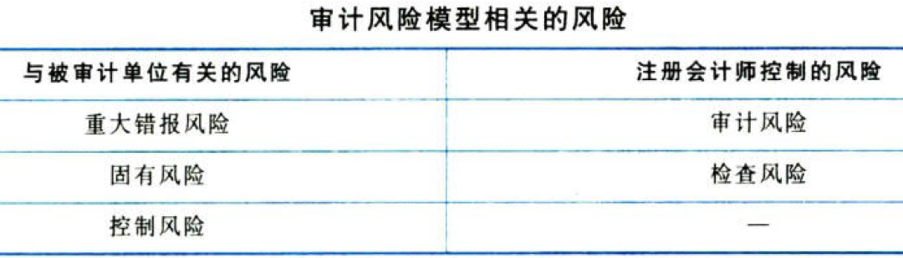

### 5.11.26. 审计风险模型

审计风险取决于重大错报风险和检查风险。

重大错报风险为认定层次的重大错报风险，包括固有风险和控制风险。

### 5.11.27. 两个层次的重大错报风险

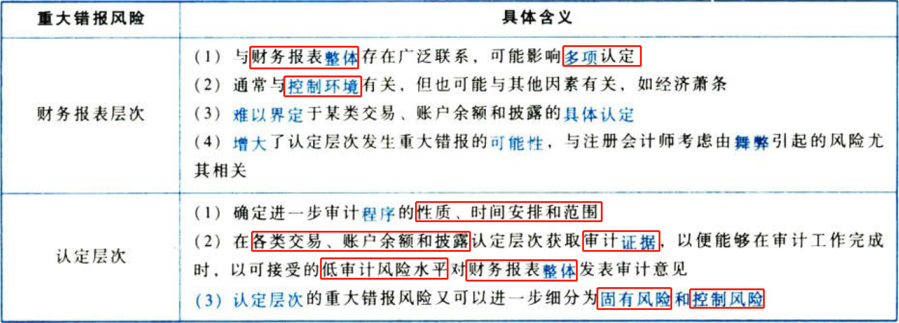

### 5.11.28. 固有风险（认定层次）

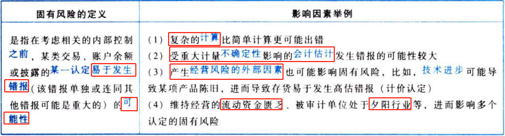

### 5.11.29. 控制风险（认定层次）

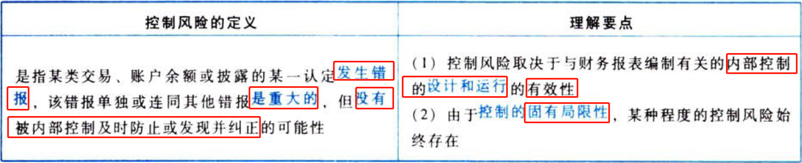

### 5.11.30. 检查风险

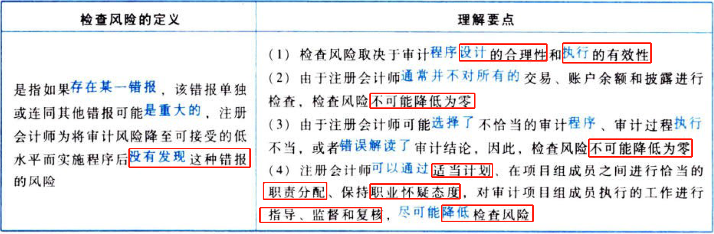

## 5.12. ［考点二］审计风险模型因素分析:star: :star: 

### 5.12.31. 检查风险与重大错报风险的反向关系

根据审计风险模型，审计风险＝重大错报风险×检查风险，注册会计师评估的认定层次重大错报风险用x表示，既定的审计风险水平用k表示，检查风险用y表示，三者之间关系如下：

$$审计风险k=重大错报风险x\times检查风险y$$

$$y=\frac{k（低水平）}{x}$$

可见，检查风险（y）与评估的认定层次重大错报风险（x）呈反向关系。

### 5.12.32. 检查风险的控制

根据审计风险模型（y=k／x），注册会计师应当合理涉及审计程序的性质、时间安排和范围，并有效执行审计程序，以控制检查风险。

## 5.13. ［考点三］审计的固有限制:star: :star: 

### 5.13.33. 审计固有限制带来的影响

（1）注册会计师据以得出结论和形成审计意见的大多数审计证据是说服性而非结论性的。

（2）注册会计师不能对财务报表不存在由于舞弊或错误导致的重大错报获取绝对保证。

（3）注册会计师不可能将审计风险降至零。

（4）审计的固有限制并不能作为注册会计师满足于说服力不足的审计证据的理由。

### 5.13.34. 影响审计固有限制的因素

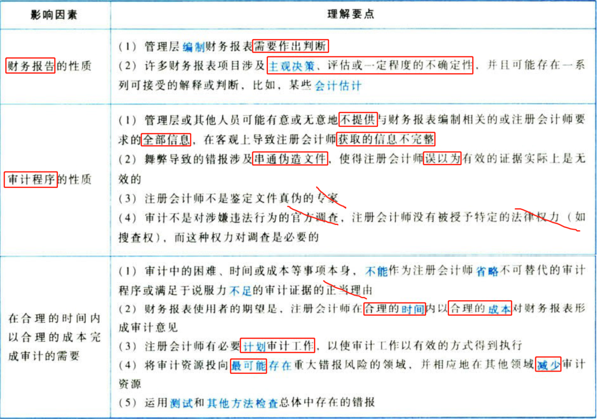

# 6. 审计过程（略）

# 7. 总结

End。
