C14审计沟通

# 1. 注册会计师与治理层的沟通

与治理层沟通的重点是“沟通的事项”和“沟通的过程”，如图14-1所示。

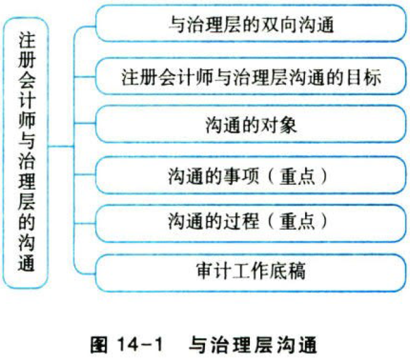

## 1.1. ［考点一］双向沟通:star: :star: 

下表以上市公司财务报表审计为背景，讨论注册会计师与治理层双向沟通的作用，需要大家注意的是，与治理层沟通的内容中包含与管理层沟通。

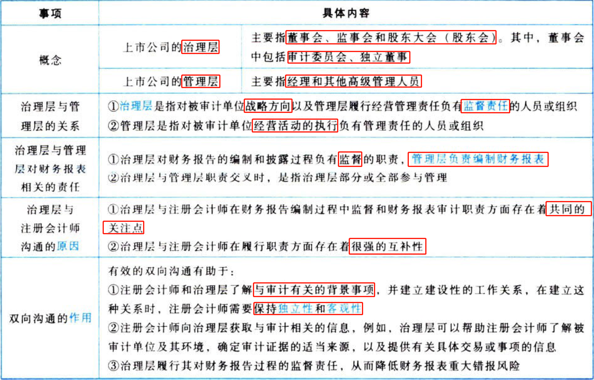

## 1.2. ［考点二］注册会计师与治理层沟通的目标:star: 

注册会计师与治理层沟通的目标包括：

（1）就注册会计师与财务报表审计相关的责任、计划的审计范围和时间安排的总体情况，与治理层进行清晰的沟通。

（2）向治理层获取与审计相关的信息。

（3）及时向治理层通报审计中发现的与治理层对财务报告过程的监督责任相关的重大事项。

（4）推动注册会计师和治理层之间有效的双向沟通。

## 1.3. ［考点三］沟通的对象:star: :star: 

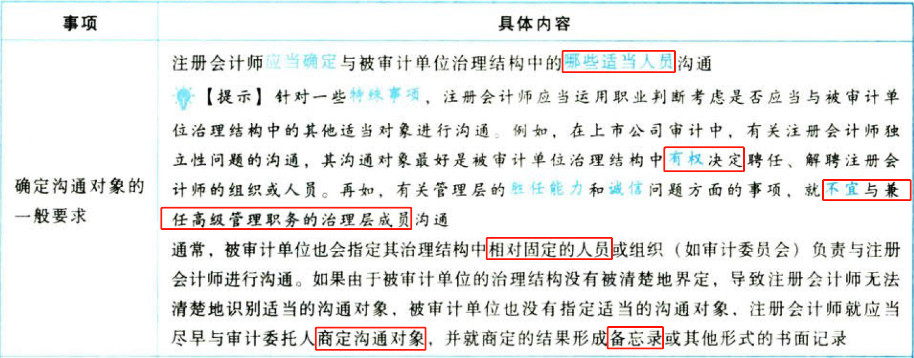

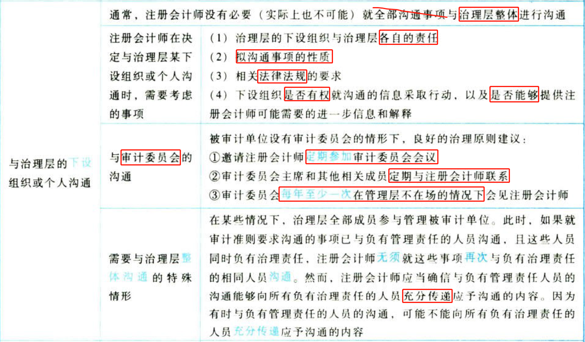

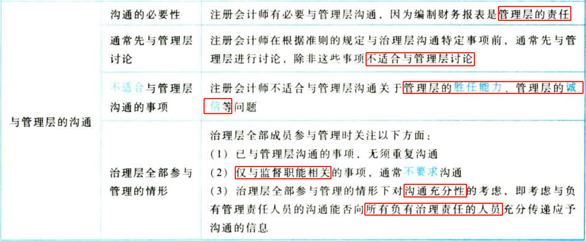

如果注册会计师审计的是集团组成邱分，除了与组成部分治理层沟通，还可能需要与集团治理层沟通。

## 1.4. ［考点四］沟通的事顶:star: :star: :star: 

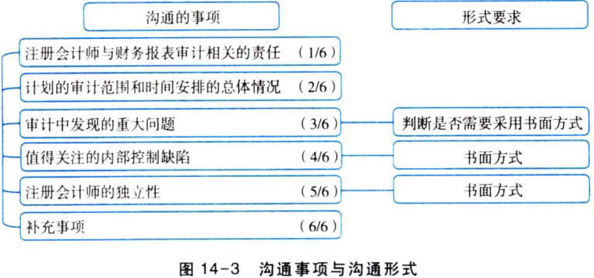

### 1.4.1. 注册会计师与财务报表审计相关的责任(1/6)

（1）注册会计师负责对在治理层监督下管理层编制的财务报表形成和发表意见。

（2）财务报表审计并不减轻管理层或治理层的责任。

### 1.4.2. （二）计划的审计范围和时间安排的总体情况(2/6)（重点）

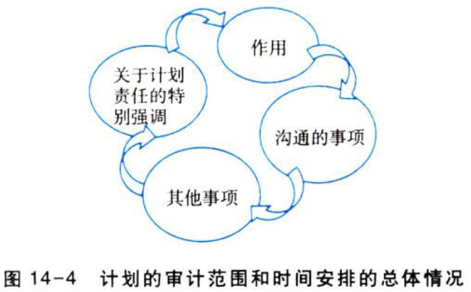

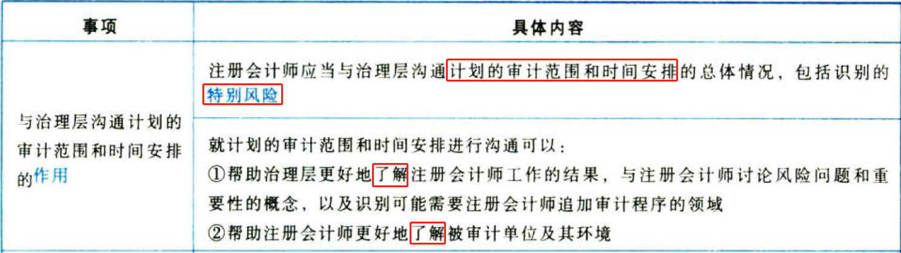

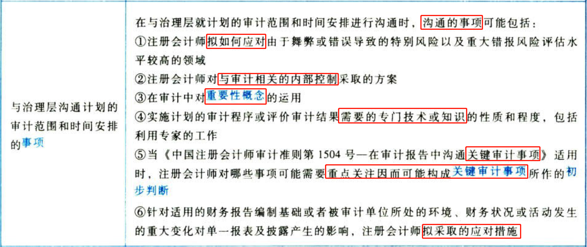

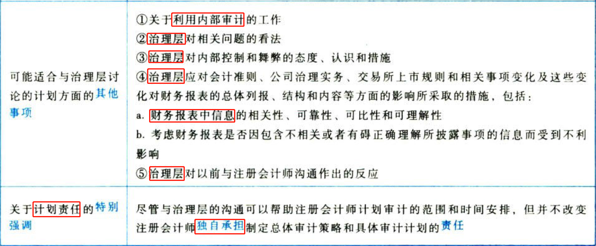

### 1.4.3. （三）审计中发现的重大问题（3/6，重点，跨章节知识点）

审计中发现的重大问题属于非常重要的考点，与注册会计师判断“关键审计事项”（教材19.4）密切相关，请大家跨章节学习，其内容包括以下五个方面，如图14-5所示。

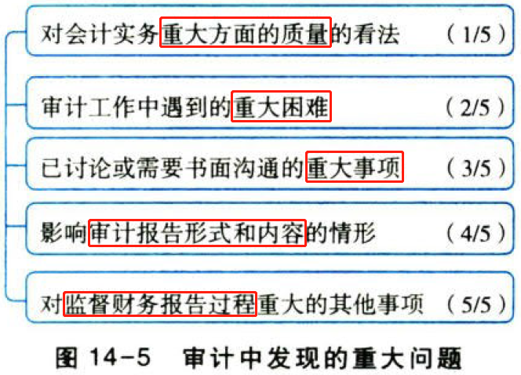

审计中发现的重大问题有五个层面，归纳如下表。

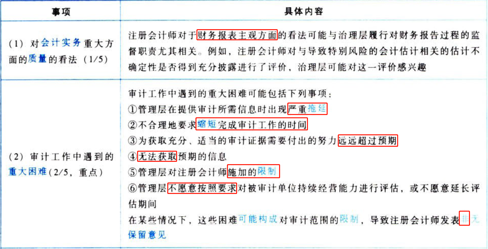

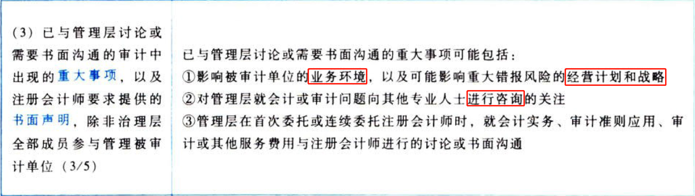

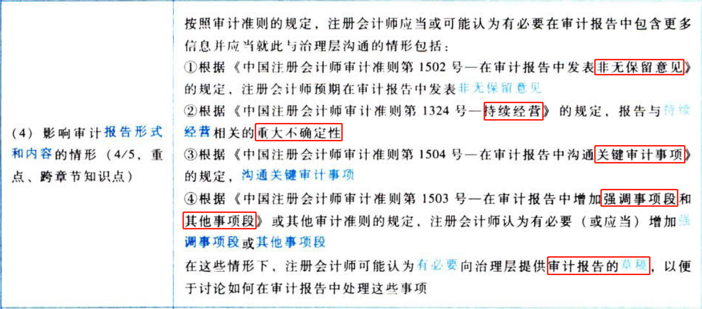

### 1.4.4. （四）值得关注的内部控制缺陷(4/6)

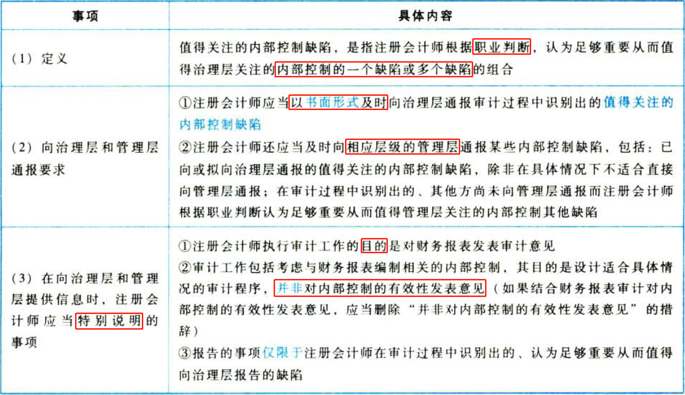

在财务报表审计中，注册会计师应当了解内部控制，即评价控制的设计是否有效，是存得到执行；针对预期有效的内部控制或者存在仅通过实质性程序无法应对的重大错报风险，注册会计师应当实施控制测试；注册会计师在了解内部控制和控制测试中，根据职业判断评价内部控制缺陷是否属于值得关注的内部控制缺陷，并且以书面形式与治理层沟通值得关注的内部控制缺陷。这里的“了解内部控制、控制测试、值得关注的内部控制缺陷”需要与《审计》教材第二十章的企业内部控制审计中的有关概念跨章节对比学习和理解掌握。

### 1.4.5. （五）注册会计师的独立性(5/6)

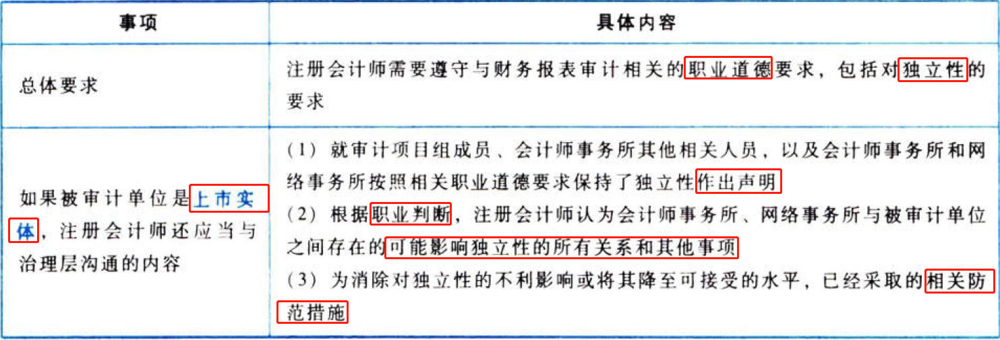

### 1.4.6. （六）补充事项(6/6)

注册会计师可能注意到一些补充事项，虽然这些事项不一定与监督财务报告流程有关，但对治理层监督被审计单位的战略方向或与被审计单位受托责任相关的义务很可能是重要的。

这些事项可能包括：

（1）与治理结构或过程有关的重大问题；

（2）缺乏适当授权的高级管理层作出的重大决策或行动。

## 1.5. ［考点五］沟通的过程:star: :star: :star: 

注册会计师与治理层沟通的过程包括以下四个方面，如图14-6所示。

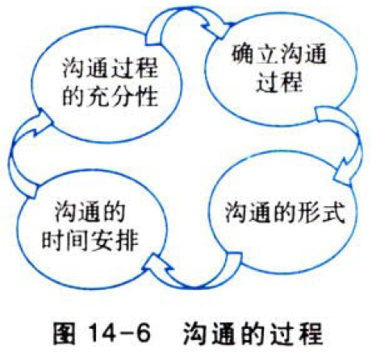

### 1.5.7. （一）确立沟通过程

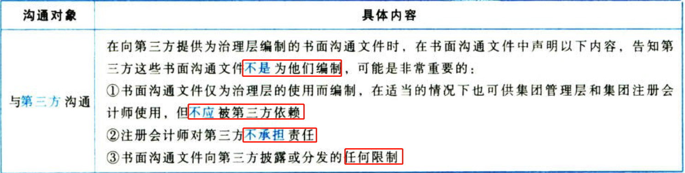

### 1.5.8. （二）沟通的形式

（1）对于审计准则要求的注册会计师的独立性，注册会计师应当以书面形式与治理层沟通。

（2）注册会计师应当以书面形式向治理层通报值得关注的内部控制缺陷。

（3）除上述事项外，对于其他事项，注册会计师可以采取口头或书面的方式沟通。书面沟通可能包括向治理层提供审计业务约定书。

（4）沟通形式的影响因素（除特定事项的重要程度外）：

①对该事项的讨论是否将包含在审计报告中。例如，在审计报告中沟通关键审计事项时，注册会计师可能认为有必要就确定为关键审计事项的事项进行书面沟通。

②特定事项是否已经得到满意的解决。

③管理层是否已事先就该事项进行沟通。

④被审计单位的规模、经营结构、控制环境和法律结构。

⑤在特殊目的财务报表审计中，注册会计师是否还审计被审计单位的通用目的财务报表。

⑥法律法规的要求。如果法律法规规定对某些特定事项的沟通必须采用书面、正式形式，应当从其规定。

⑦治理层的期望，包括与注册会计师定期会谈或沟通的安排。

⑧注册会计师与治理层持续接触和对话的次数。

⑨治理机构的成员是否发生了重大变化。

### 1.5.9. （三）沟通的时间安排

注册会计师应当及时与治理层沟通。适当的沟通时间安排因业务环境的不同而不同。例如：

（1）对于计划事项的沟通，通常在审计业务的早期阶段进行，如系首次接受委托，沟通可以随同就审计业务条款达成一致意见一并进行；

（2）对于审计中遇到的重大困难，如果治理层能够协助注册会计师克服这些困难，或者这些困难可能导致发表非无保留意见，可能需要尽快沟通；

（3）当《中国注册会计师审计准则第1504号——在审计报告中沟通关键审计事项》适用时，注册会计师可以在讨论审计工作的计划范围及时间安排时沟通对关键审计事项的初步看法，注册会计师在沟通重大审计发现时也可以与治理层进行更加频繁的沟通，以进一步讨论此类事项；

（4）无论何时（如承接一项非审计服务和在总结性讨论中）就对独立性的不利影响和相关防范措施作出了重要判断，就独立性进行沟通都可能是适当的；

（5）沟通审计中发现的问题，包括注册会计师对被审计单位会计实务质量的看法，也可能作为总结性讨论的一部分；

（6）当同时审计通用目的和特殊目的财务报表时，注册会计师协调沟通的时间安排可能是适当的。

### 1.5.10. （四）沟通过程的充分性

注册会计师应当评价其与治理层之间的双向沟通对实现审计目的是否充分。

如果注册会计师与治理层之间的双向沟通不充分，并且这种情况得不到解决，注册会计师可以采取下列措施：

（1）根据范围受到的限制发表非无保留意见；

（2）就采取不同措施的后果征询法律意见；

（3）与第三方（如监管机构）、被审计单位外部的在治理结构中拥有更高权力的组织或人员（如企业的业主、股东大会中的股东）或对公共部门负责的政府部门进行沟通；

（4）在法律法规允许的情况下解除业务约定。

## 1.6. ［考点六］审计工作底稿（＊）

（1）如果审计准则要求沟通的事项是以口头形式沟通的，注册会计师应当将其包括在审计工作底稿中，并记录沟通的时间和对象；

（2）如果审计准则要求沟通的事项是以书面形式沟通的，注册会计师应当保存一份沟通文件的副本，作为审计工作底稿的一部分；

（3）如果被审计单位编制的会议纪要是沟通的适当记录，注册会计师可以将其副本作为对口头沟通的记录，并作为审计工作底稿的一部分；

（4）如果发现这些会议纪要的记录不能恰当地反映向通的内容，且有差别的事项比较重大，注册会计师一般会另行编制能恰当记录沟通内容的纪要，将其副本连同被审计单位编制的纪要一起致送治理层，提示两者的差别，以免引起不必要的误解。

# 2. 前任注册会计师和后任注册会计师的沟通

前后任沟通的重点是对前后任注册会计师的识别以及对后任注册会计师接受委托前的沟通，如图14-7所示。

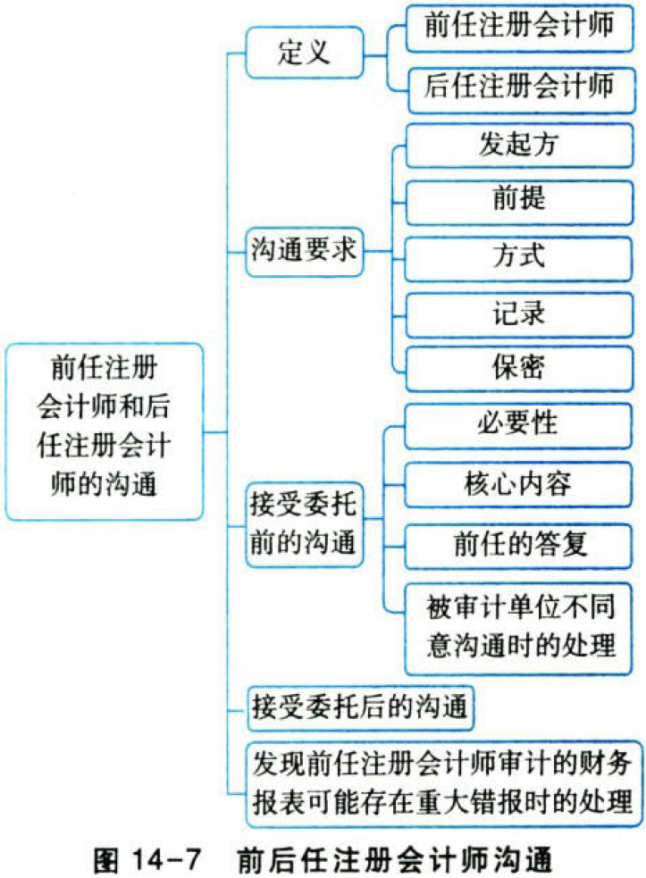

## 2.7. ［考点一］前后任注册会计师的定义（★★＊）

### 2.7.11. （一）前任注册会计师的定义

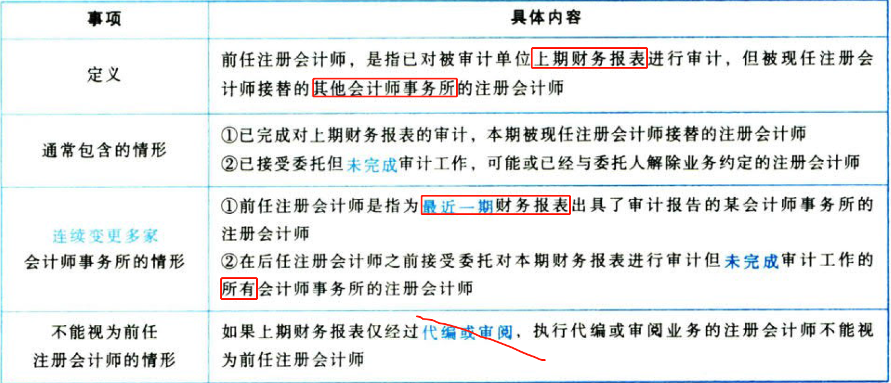

### 2.7.12. （二）后任注册会计师的定义

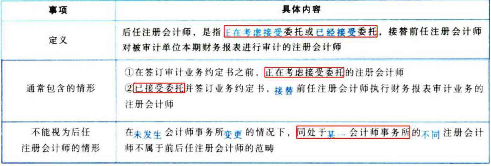

## 2.8. ［考点二］前后任注册会计师的沟通要求:star: 

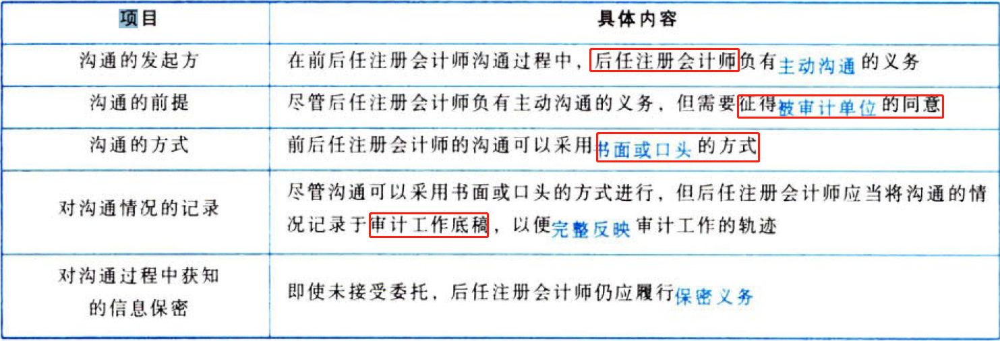

## 2.9. ［考点三］接受委托前的沟通:star: :star: :star: 

### 2.9.13. （一）接受委托前的必要沟通

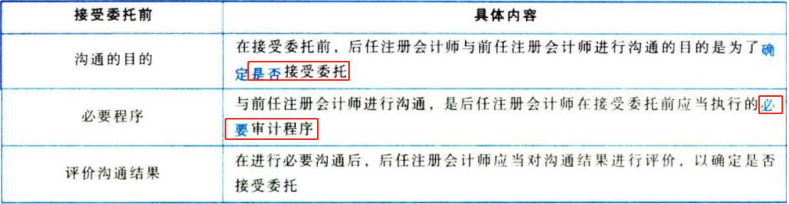

### 2.9.14. （二）接受委托前沟通的核心内容

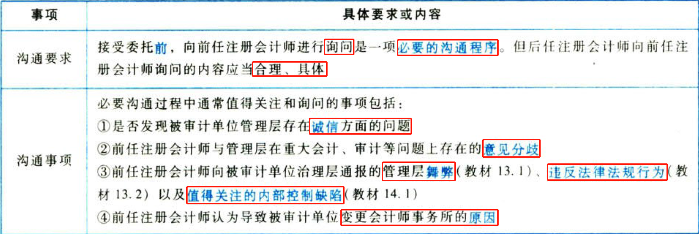

### 2.9.15. （三）前任注册会计师的答复

（1）在被审计单位允许前任注册会计师对后任注册会计师的询问作出充分答复的情况下，前任注册会计师应当根据所了解的事实，对后任注册会计师的合理询问及时作出充分答复。

当有多家会计师事务所正在考虑是否接受被审计单位的委托时，前任注册会计师应在被审计单位明确选定其中的一家会计师事务所作为后任注册会计师之后，才对该后任注册会计师的询问作出答复。例如，当会计师事务所以投标方式承接审计业务时，前任注册会计师只需对中标的会计师事务所（后任注册会计师）的询问作出答复，而无须对所有参与投标的会计师事务所的询问进行答复。

（2）如果受到被审计单位的限制或存在法律诉讼的顾虑，决定不向后任注册会计师作出充分答复，前任注册会计师应当向后任注册会计师表明其答复是有限的，并说明原因。

（3）如果从前任注册会计师得到的答复是有限的，或未得到答复，后任注册会计师应当考虑对接受委托的影响。对此，通常可以区分以下两种情况进行处理：

①如果得到的答复是有限的，后任注册会计师需要判断是否存在由被审计单位或潜在法律诉讼引起的答复限制，并考虑这一情况对接受业务委托的影响；

②如果未得到答复，且没有理由认为变更会计师事务所的原因异常，后任注册会计师需要设法以其他方式与前任注册会计师再次进行沟通，如仍得不到答复，后任注册会计师可以致函前任注册会计师，说明如果在适当的时间内得不到答复，将假设不存在专业方面的原因使其拒绝接受委托，并表明拟接受委托。

### 2.9.16. （四）被审计单位不同意沟通时的处理

后任注册会计师进行主动沟通的前提是征得被审计单位的同意。

后任注册会计师应当提请被审计单位以书面方式允许前任注册会计师对其询问作出充分答复。如果受到被审计单位的限制或存在法律诉讼的顾虑，决定不向后任注册会计师作出充分答复，前任注册会计师应当向后任注册会计师表明其答复是有限的，并说明原因。如果得到的答复是有限的，或未得到答复，后任注册会计师应当率是否接受委托。实际上，这种情况本身就向后任注册会计师传递出一种信号，即被审计单位可能与前任注册会计师在重大的会计、审计问题上存在意见分歧，或被审计单位管理层存在诚信方面的问题，后任注册会汁师应当对此提高警惕，慎重评估潜在的审计风险，并考虑是否接受委托。当这种情况出现时，后任注册会计师一般应当拒绝接受委托，除非可以通过其他方式获知必要的事实，或有充分的证据表明被审计单位财务报表的审计风险水平非常低。

## 2.10. ［考点四］接受委托后的沟通:star: :star: 

接受委托后，前后任注册会计师沟通要求、沟通前提等内容，归纳如下表。

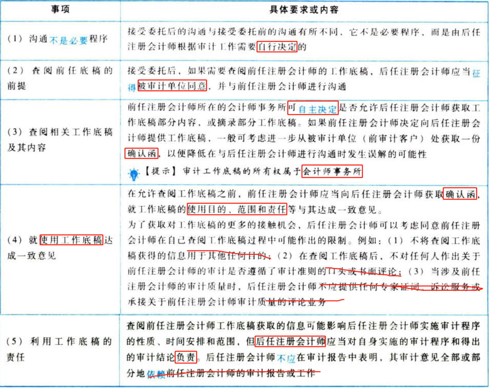

## 2.11. ［考点五］发现前任注册会计师审计的财务报表可能存在重大错报时的处理:star: :star: 

如果发现前任注册会计师审计的财务报表可能存在重大错报，后任注册会计师的应对措施，归纳如下表。

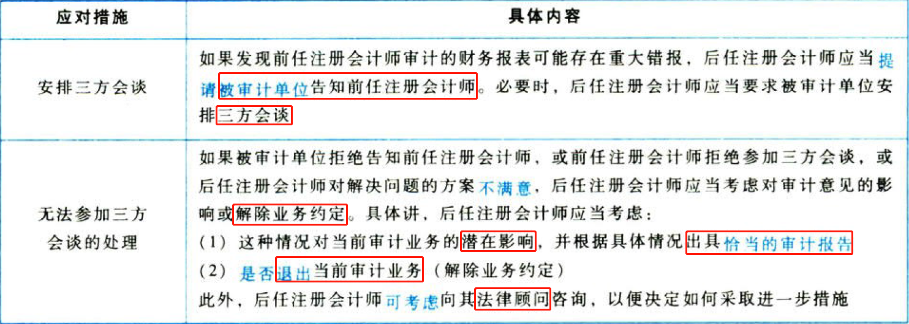

# 3. 总结

End。
