C02审计计划

# 1. 初步业务活动

## 1.1. ［考点一］计划审计工作:star: 

### 1.1.1. 计划审计工作的性质

计划审计工作是一项持续的过程，注册会计师通常在前一期审计工作结束后即开始开展本期的审计计划工作，并直到本期审计工作结束为止。

### 1.1.2. 计划审计工作的内容

在计划审计工作时，注册会计师需要进行初步业务活动、制定审计计划。其中，审计计划分为总体审计策略和具体审计计划两个层次，如图2-1所示。

## 1.2. ［考点二］初步业务活动:star: :star: 

在本期审计业务开始时，注册会计师需要开展初步业务活动（“how”），以实现初步业务活动的目的（“what"）。

“初步业务活动的目的和内容”的逻辑关系归纳如下表。

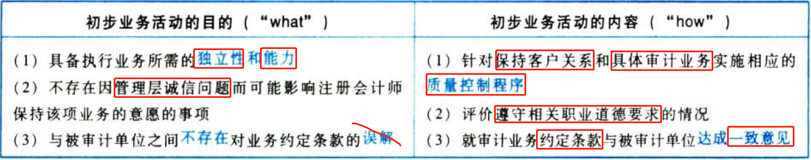

## 1.3. ［考点三］审计的前提条件:star: :star: 

### 1.3.3. 执行审计工作的前提

执行审计工作的前提是指管理层和治理层（如适用）认可并理解其对财务报表的责任。

### 1.3.4. 审计的前提条件

审计的前提条件包含两个必不可少的“条件”，即：

（1）管理层在编制财务报表时采用可接受的财务报告编制基础（简称条件A，后同）；

（2）就管理层的责任达成一致意见（简称条件B，后同）：

①按照适用的财务报告编制基础编制财务报表，并使其实现公允反映（如适用）；

②设计、执行、维护必要的内部控制，以使财务报表不存在由于舞弊或错误导致的重大错报；

③向注册会计师提供必要的工作条件，包括允许注册会计师接触与编制财务报表相关的所有信息（如记录、文件和其他事项），向注册会计师提供审计所需要的其他信息，允许注册会计师在获取审计证据时不受限制地接触其认为必要的内部人员和其他相关人员。

### 1.3.5. 确定审计的前提条件

“确定审计的前提条件”要求注册会计师明确“回答”审计的两个“前提条件”是否同时满足，如果不能同时满足，则注册会计师不能承接该业务。如图2-3的“条件A和条件B”。

## 1.4. ［考点四］审计业务约定书:star: :star: 

请从以下三个方面展开本知识点的学习，如图2-4所示。

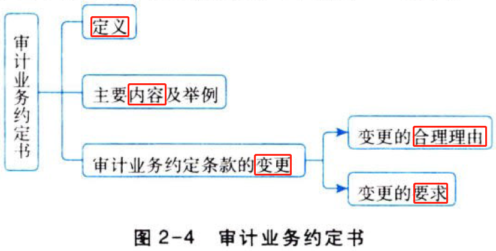

### 1.4.6. 定义

审计业务约定书是指会计师事务所与被审计单位签订的，用以记录和确认审计业务的委托与受托关系、审计目标和范围、双方的责任以及报告的格式等事项的书面协议。会计师事务所承接任何审计业务，都应与被审计单位签订审计业务约定书。

### 1.4.7. 主要内容及举例

审计业务约定书的主要内容包括：

（1）财务报表审计的目标与范围；

（2）注册会计师的责任；

（3）管理层的责任；

（4）指出用于编制财务报表所适用的财务报告编制基础；

（5）提及注册会计师拟出具的审计报告的预期形式和内容，以及对在特定情况下出具的审计报告可能不同于预期形式和内容的说明。

［举例］[假定××会计师事务所审计ABC股份有限公司20x1年度财务报表，针对审计业务约定书的主要内容，举例如下](../../../../CPA6in1/CPA6in1/4审计/举例.审计业务约定书.md)。

### 1.4.8. 审计业务约定条款的变更

# 2. 总体审计策略+具体审计计划

## 2.5. ［考点一］审计计划的两个层次:star: 

审计计划分为总体审计策略和具体审计计划两个层次，二者的内容与关系如图2-5所示。

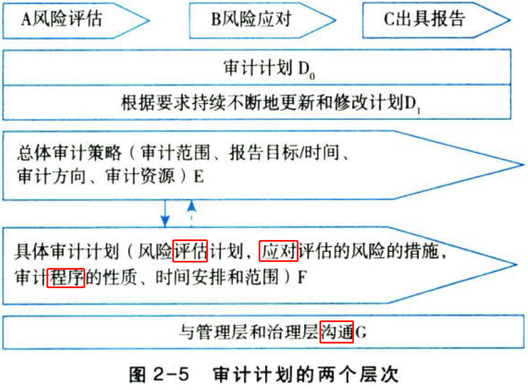

根据图2-5，审计计划两个层次的内容与关系归纳如下：

（1）注册会计师根据总体审计策略中所识别的不同事项，制定具体审计计划，并考虑通过有效利用审计资源以实现审计目标。

（2）制定总体审计策略的过程通常在具体审计计划之前，但二者不是孤立的而是具有内在紧密联系的，对其中一项的决定可能会影响、甚至改变对另外一项的决定。

## 2.6. ［考点二］总体审计策略:star: 

### 2.6.9. 总体审计策略的含义

总体审计策略用以确定审计范围、时间安排和方向，并指导具体审计计划的制定。

### 2.6.10. 制定总体审计策略考虑的事项

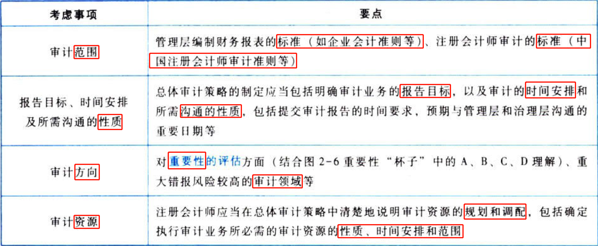

## 2.7. ［考点三］具体审计计划:star: 

### 2.7.11. 制定要求

具体审计计划比总体审计策略更加详细，其内容包括注册会计师为取充分、适当的审计证据以将审计风险降至可接受的低水平，项目组成员拟实施的审计程序的性质、时间安排和范围。

### 2.7.12. 具体审计计划的内容

具体审计计划包括风险评估程序、计划实施的进一步审计程序和其他审计程序，归纳如下表。

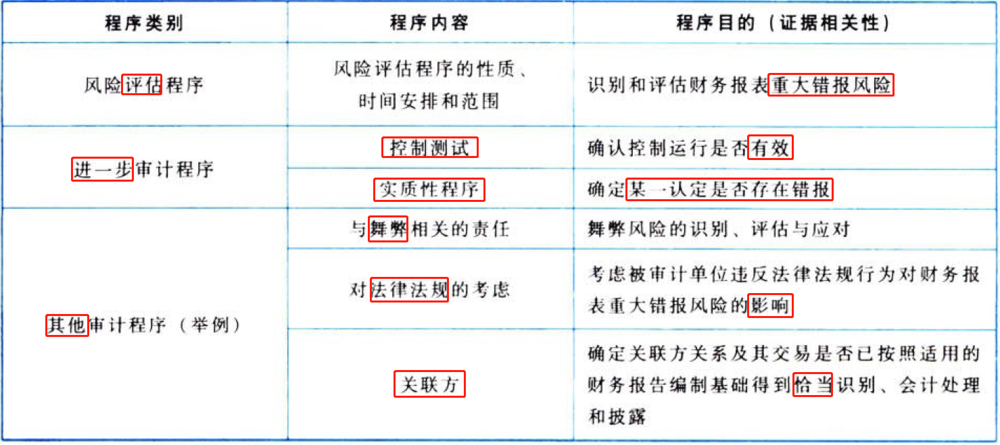

## 2.8. ［考点四］审计过程中对计划的更改:star: 

### 2.8.13. 总体要求

计划审计工作并非审计业务的一个孤立阶段，而是一个持续的、不断修正的过程，贯穿于整个审计业务的始终。

### 2.8.14. 导致审计计划更改的特别事项

以下事项的修改会直接导致修改审计计划，也会导致对审计工作作出适时调整：

（1）对重要性水平的修改。

（2）对某类交易、账户余额和披露的重大错报风险评估的更新和修改。

（3）对进一步审计程序的更新和修改等。

# 3. 重要性

## 3.9. ［考点一］重要性“杯子”:star: :star: 

开启本节内容学习之前，需要大家先认识重要性及重要性杯子所包含的要素，如阁2-6所示。

## 3.10. ［考点二］重要性概念:star: :star: 

重要性慨念可以从以下方而理解：

（1）如果合理预期错报（包括漏报）单独或汇总起来可能影响财务报表使用者依据财务报表作出的经济决策，则通常认为错报是重大的。

（2）对重要性的判断是根据具体环境作出的，并受错报的金额或性质的影响，或受两者共同作用的影响。

（3）判断某事项对财务报表使用者是否重大，是在考虑财务报表使用者整体共同的财务信息需求的基础上作出的。

## 3.11. ［考点三］财务报表整体的重要性:star: :star: :star: 

财务报表整体的重要性包含总体要求、含义和方法。其中，方法包括基准和百分比。如图2-7所示。

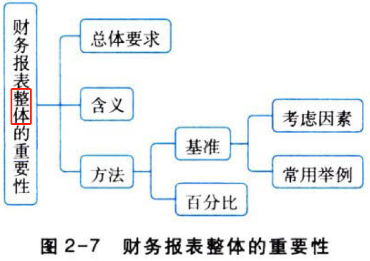

### 3.11.15. 总体要求

注册会计师在制定总体审计策略时，应当确定财务报表整体的重要性。

### 3.11.16. 含义

如果一项错报单独或连同其他错报可能影响财务报表使用者依据财务报表作出的经济决策，则该项错报是重大的。这里的判断标准即财务报表整体的重要性。

### 3.11.17. 方法

确定重要性需要运用职业判断。注册会计师通常先选定一个基准，再乘以某一百分比，得到一个恰当的金额，将其作为“财务报表整体的重要性”。如图2-8所示。

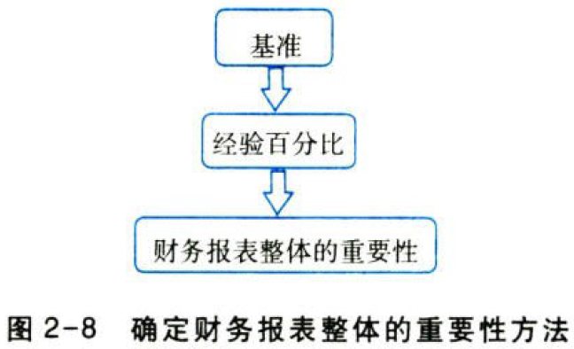

### 3.11.18. 基准

1.注册会计师选择基准时需要考虑的因素，如下表所示。

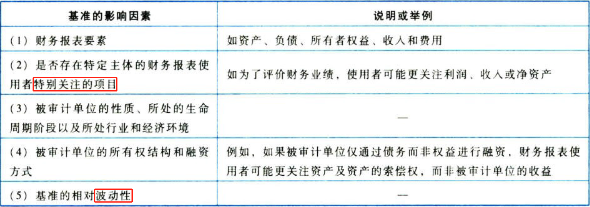

2.审计实务中较为常用的基准举例，如下表所示

### 3.11.19. 百分比

在确定百分比时，除了考虑被审计单位是否为上市公司或公众利益实体外，其他因素也会影响注册会计师对百分比的选择，这些因素包括但不限于：

（1）财务报表使用者的范围，是否分发给广大范围的使用者。

（2）被审计单位是否由集团内部关联方提供融资或是否有大额对外融资（如债券或银行贷款）。

（3）财务报表使用者是否对基准数据特别敏感（如具有特殊目的财务报表的使用者）。

## 3.12. ［考点四］实际执行的重要性:star: :star: :star: 

实际执行的重要性包含定义、考虑因素、选择经验值、在审计中的运用，如图2-9所示。

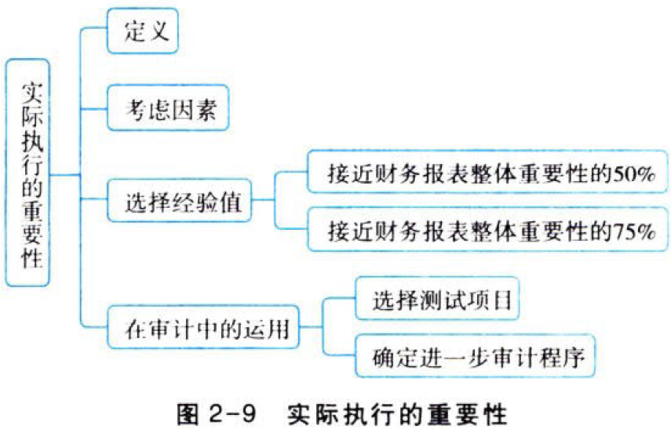

### 3.12.20. 定义

实际执行的重要性是指住册会计师确定的低于财务报表整体重要性的一个或多个金额，旨在将未更正和未发现错报的汇总数超过财务报表整体的重要性的可能性降至适当的低水平。如果适用，实际执行的重要性还指注册会计师确定的低于特定类别的交易、账户余额或披露的重要性水平的一个或多个金额。

### 3.12.21. 考虑因素

（1）对被审计单位的了解（这些了解在实施风险评估程序的过程中得到更新）；

（2）前期审计工作中识别出的错报的性质和范围；

（3）根据前期识别出的错报对本期错报作出的预期。

### 3.12.22. 选择经验值

通常而言，实际执行的重要性通常为财务报表整体重要性的50%～75%。经验值（较低或较高）的影响因素如下表所示。

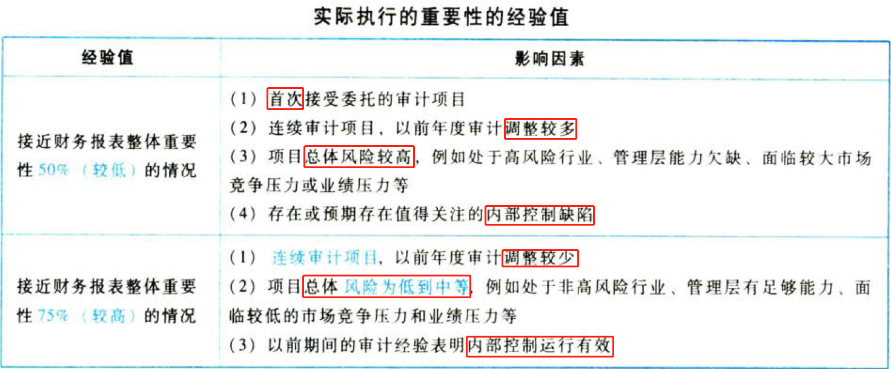

### 3.12.23. 在审计中的运用

实际执行的重要性在审计中的运用主要体现在两大环节，即选取测试项目时和确定进一步审计程序的性质、时间安排和范围时，归纳如下表。

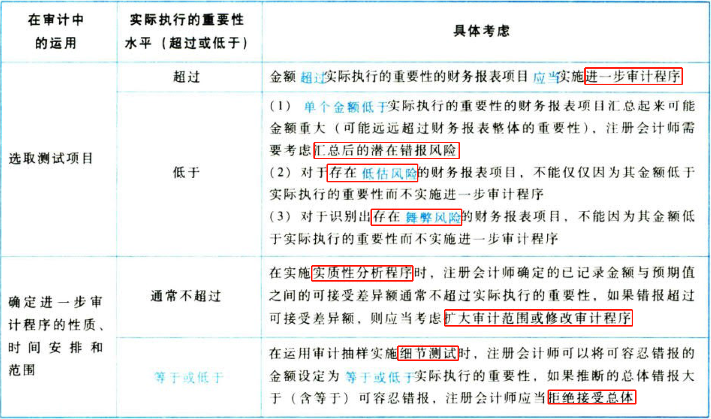

## 3.13. ［考点五］特定类别交易、账户余额或披露的重要性水平:star: 

### 3.13.24. 确定特定类别交易、账户余额或披露的重要性水平的要求

根据被审计单位的特定情况，如果存在一个或多个特定类别的交易、账户余额或披露，其发生的错报金额虽然低于财务报表整体的重要性，但合理预期可能影响财务报表使用者依据财务报表作出的经济决策，注册会计师还应当确定适用于这些交易、账户余额或披露的一个或多个重要性水平。

结合图2-6理解并掌握以下要点：

（1））“特定类别的”重要性是注册会计师根据被审计单位的特定情况判断的，在某次审计中可能存在，也可能不存在；

（2）注册会计师判断存在“特定类别的”重要性（如图2-6”杯子”左边的B),则存在对应的“特定类别的”实际执行的重要性（如图2-6“杯子”右边的b);

（3）从理论上说，“特定类别的”重要性可能不止一个。

### 3.13.25. 确定特定类别交易、账户余额或披露的重要性水平的影响因素

可能表明存在一个或多个特定类别的交易、账户余额或披露的影响因素，归纳如下表。

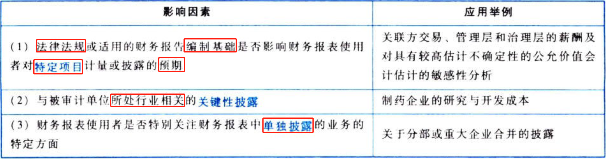

## 3.14. ［考点六］明显微小错报的临界值:star: :star: 

明显微小错报的临界值确定要求、考虑因素、“明显微小”与“不重大”的区别，如图2-10所示。

### 3.14.26. 确定要求

注册会计师需要在制定审计计划时，确定一个明显微小错报的临界值，低于该临界值的错报视为明显微小的错报，可以不累积。

### 3.14.27. 考虑因素

在确定明显微小错报的临界值时，注册会计师可能考虑的因素归纳如下表。

### 3.14.28. “明显微小”不等同于“不重大”

请结合图2-6“杯子”，通过下表的“一问一答”理解“明显微小”与“不重大”。

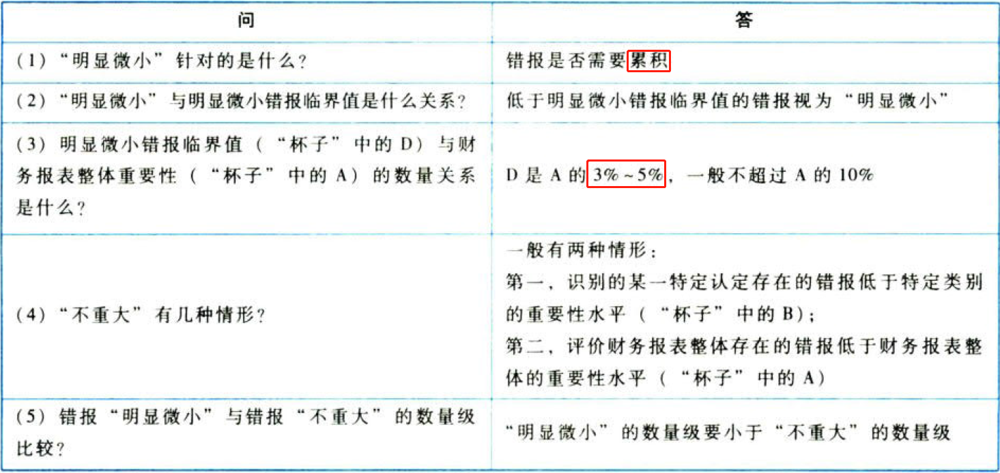

## 3.15. ［考点七］审计过程中修改重要性:star: 

导致修改财务报表整体的重要性和特定类别的交易、账户余额或披露的重要性水平的原因：

（1）审计过程中情况发生重大变化（如决定处置被审计单位的一个重要组成部分）。

（2）获取新信息。

（3）通过实施进一步审计程序，注册会计师对被审计单位及其经营所了解的情况发生变化。

## 3.16. ［考点八］错报:star: :star: :star: 

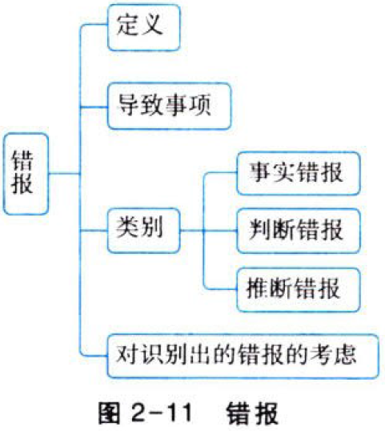

### 3.16.29. 错报的定义

错报，是指某一财务报表项目的金额、分类或列报，与按照适用的财务报告编制基础应当列示的金额、分类或列报之间存在的差异；或根据注册会计师的判断，为使财务报表在所有重大方面实现公允反映，需要对金额、分类或列报作出的必要调整。

### 3.16.30. 可能导致错报的事项

（1）收集或处理用以编制财务报表的数据时出现错误。

（2）遗漏某项金额或披露，包括不充分或不完整的披露，以及为满足特定财务报告编制基础的披露目标而被要求作出的披露（如适用）。

（3）由于疏忽或明显误解有关事实导致作出不正确的会计估计。

（4）注册会计师认为管理层对会计估计作出不合理的判断或对会计政策作出不恰当的选择和运用。

（5）信息的分类、汇总或分解不恰当。

### 3.16.31. 错报类别

### 3.16.32. 对审计过程识别出的错报的考虑

（1）错报可能不会孤立发生，一项错报的发生还可能表明存在其他错报。例如，注册会计师识别出由于内部控制失效而导致的错报，或被审计单位广泛运用不恰当的假设或评估方法而导致的错报，均可能表明还存在其他错报。

（2）抽样风险和非抽样风险可能导致某些错报未被发现。审计过程中累积错报的汇总数接近确定的重要性，则表明存在比可接受的低风险水平更大的风险，即可能未被发现的错报连同审计过程中累积错报的汇总数，可能超过重要性。

（3）注册会计师可能要求管理层检查某类交易、账户余额或披露，以使管理层了解注册会计师识别出的错报的产生原因，并要求管理层采取措施以确定这些交易、账户余额或披露实际发生错报的金额，以及对财务报表作出适当的调整。例如，在从审计样本中识别出的错报推断总体错报时，注册会计师可能提出这些要求。

# 4. 总结

End。
