C03审计证据

# 1. 审计证据的性质

“审计证据的性质”围绕审计证据的含义和特征展开，其中审计证据的特征包括充分性、适当性、充分性与适当性之间的关系，以及对充分性与适当性的特殊考虑，如阁3-1所示。

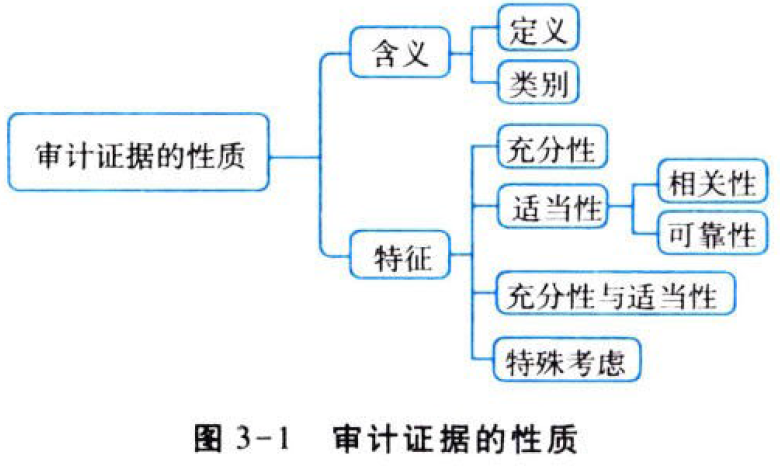

## 1.1. ［考点一］审计证据的含义:star: 

### 1.1.1. 审计证据的定义

审计证据是指注册会计师为了得出审计结论、形成审计意见而使用的所有信息。

在风险导向审计框架下，“所有信息”包含在审计全过程中。大家可以抓住获取审计证据的“主线条”来理解，比如，初步业务活动（教材2.1）、风险评估与应对的审计测试流程（教材第18章）、完成审计工作与出具审计报告（教材第18、19章）。

### 1.1.2. 审计证据的类别

审计证据包括构成财务报表基础的会计记录所含有的信息和其他的信息，如图3-2所示。

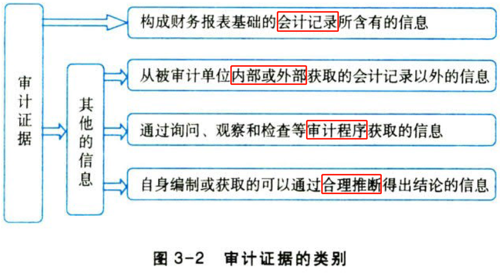

构成审计证据的“会计记录所含有的信息”和“其他的信息”及二者之间的关系，归纳如下表。

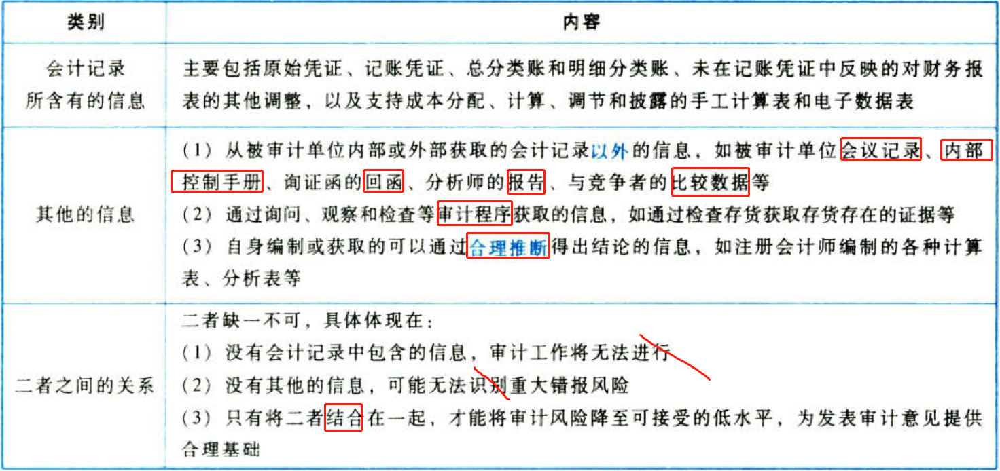

## 1.2. ［考点二］审计证据的特征:star: :star: :star: 

为了实现“合理保证”的审计目标，注册会计师获取的审计证据应当具有充分性（数量要求）和适当性（质量要求）的特征，如图3-3所示。

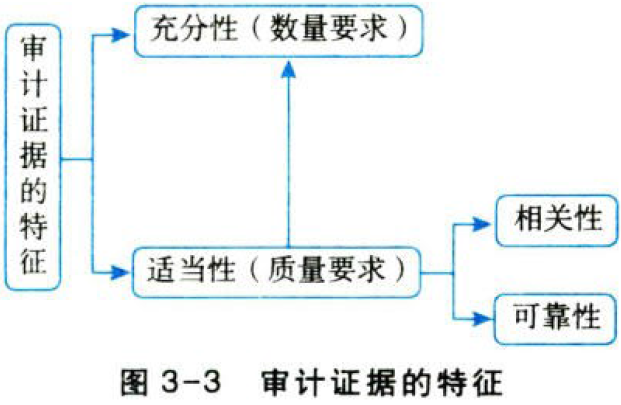

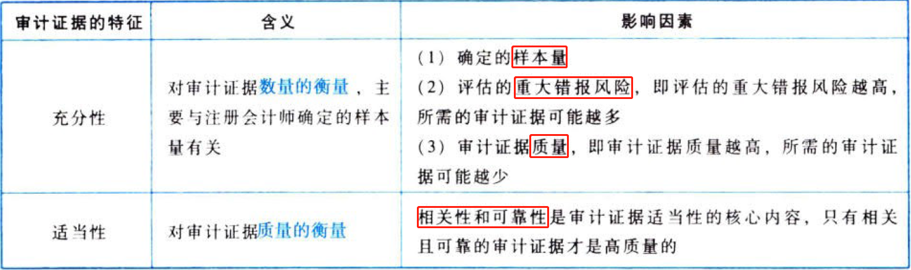

## 1.3. ［考点三］审计证据的相关性:star: :star: 

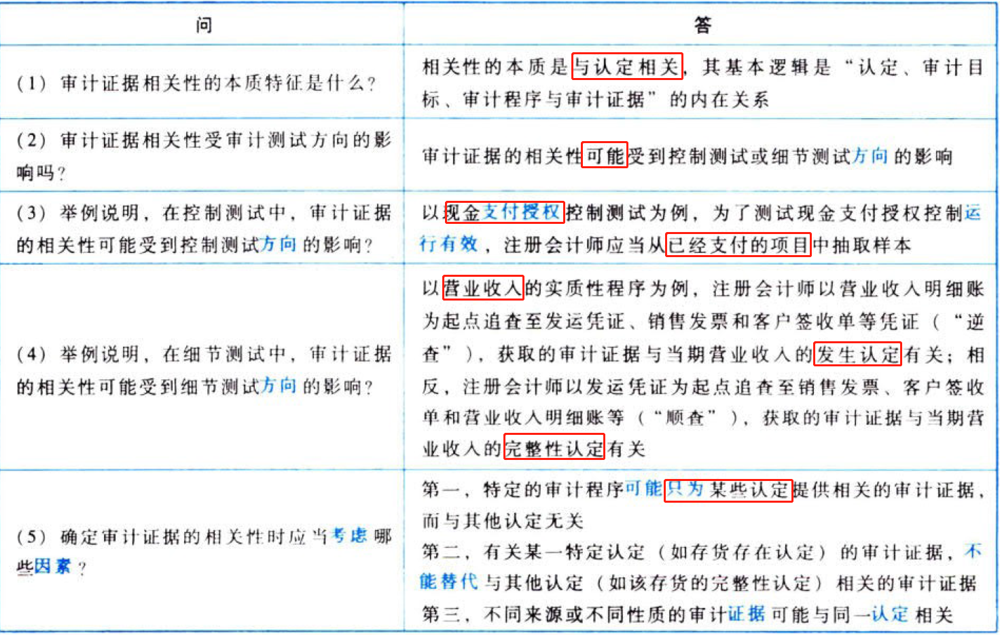

## 1.4. ［考点四］审计证据的可靠性:star: :star: 

审计证据的可靠性受其来源和性质的影响，并取决于获取审计证据的具体环境。注册会计师通常从五个方面考虑审计证据可靠性的原则，归纳如下表。

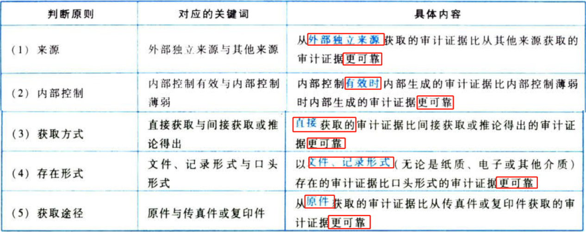

## 1.5. ［考点五］审计证据充分性与适当性:star: :star: 

注册会计师只有获取充分且适当的审计证据才能形成审计结论，充分性与适当性的关系，归纳如下表。

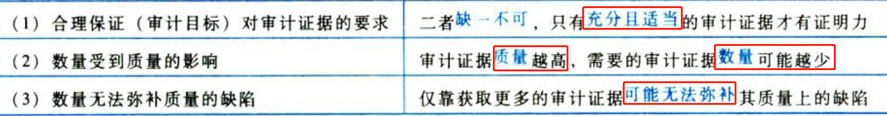

## 1.6. ［考点六］评价审计证据充分性和适当性的特殊考虑:star: :star: :star: 

注册会计师可以从四个方面特殊考虑审计证据的充分性和适当性，归纳如下表。

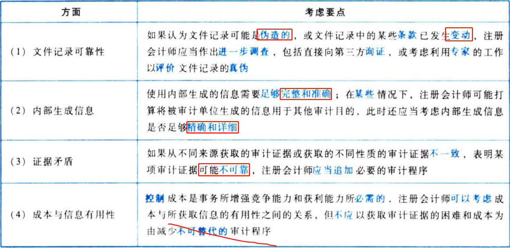

# 2. 审计程序

## 2.7. ［考点］审计程序:star: :star: 

### 2.7.3. 总体审计程序（补充知识点）

根据获取审计证据的目的，审计程序可以分为风险评估程序、控制测试（必要时）、实质性程序，这些程序可以称之为总体审计程序，如图3-4所示。

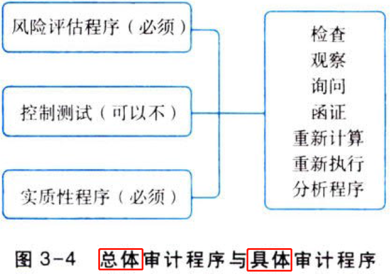

### 2.7.4. 具体审计程序

具体审计程序包括检查、观察、询问、函证、重新计算、重新执行以及分析程序，其含义和使用特征归纳如下表。

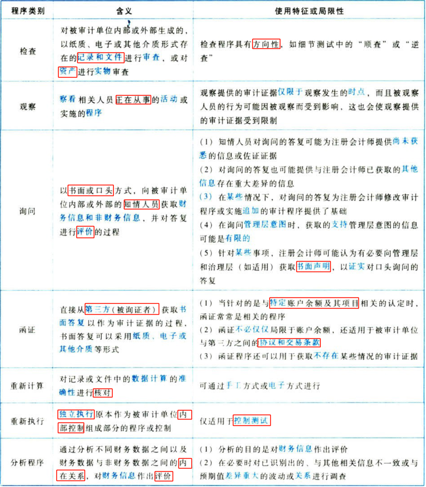

# 3. 函证

函证的体系包括函证决策、询证函发出、询证函收回与否、舞弊风险迹象的评估与应对措施，如图3-6所示。

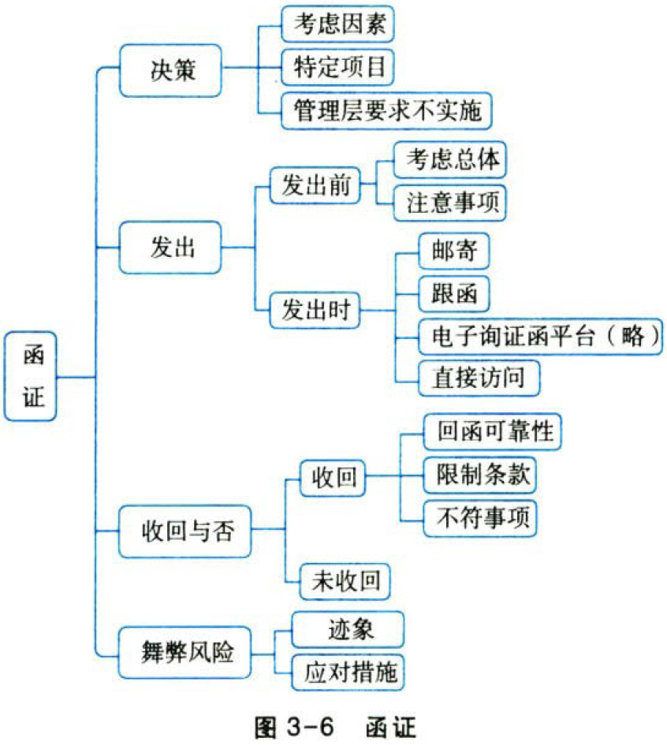

## 3.8. ［考点一］函证决策:star: :star: 

函证决策包括考虑因素和特定项目两个层面，同时管理层可能要求不实施函证，如图3-7所示。

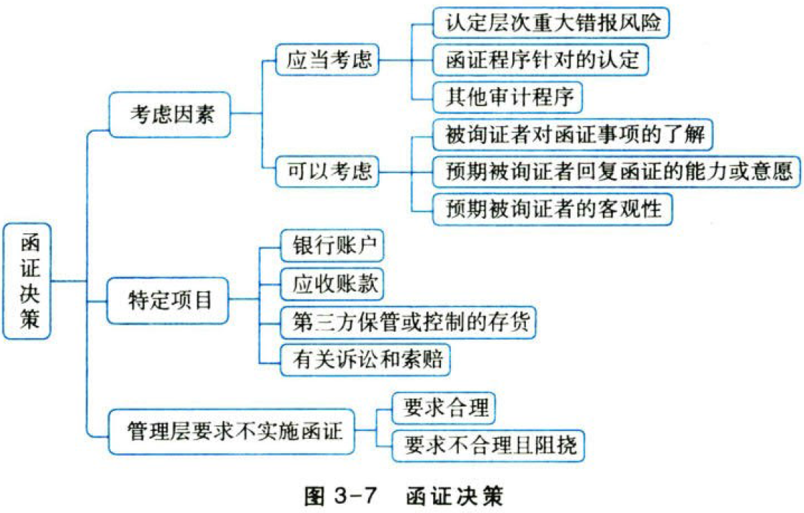

### 3.8.5. 考虑因素

#### 3.8.5.1. l应当考虑因素

注册会计师应当针对评估的认定层次重大错报风险、函证程序针对的认定、实施其他审计程序获取的审计证据决定是否实施函证，归纳如下表。

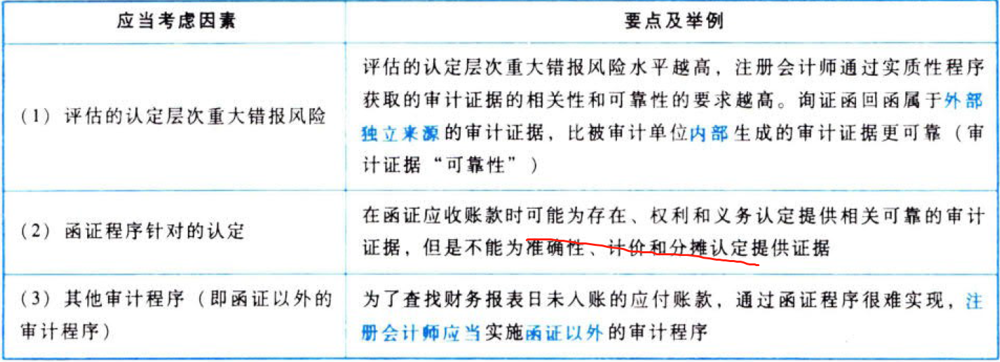

#### 3.8.5.2. 2.可以考虑因素

注册会计师时以考虑下列因素，以确定是否选择函证程序作为实质性程序，归纳如下表。

### 3.8.6. 特定项目

审计准则分别对银行存款、借款及与金融机构往来的其他重要信息，应收账款、存货等账户如何实施函证程序作出了具体规定，归纳如下表。

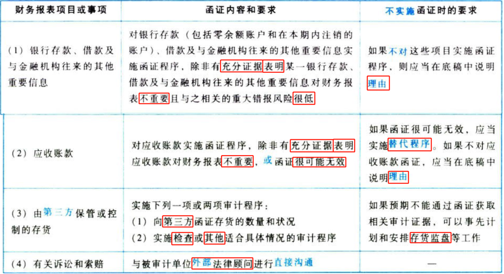

### 3.8.7. 管理层要求不实施函证时的考虑

当管理层要求对拟函证的某些账户余额或其他信息不实施函证时，注册会计师应当考虑该项要求是否合理，并获取审计证据予以支持，归纳如下表。

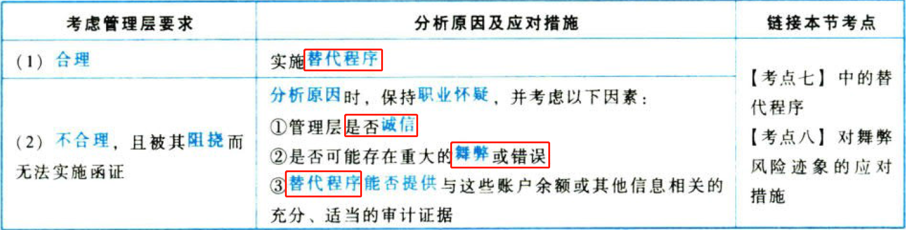

## 3.9. ［考点二］询证函发出前的控制措施:star: :star: 

在询证函发出前，注册会计师需要恰当地设计询证函，并对询证函上的各项信息进行充分核对，归纳如下表。

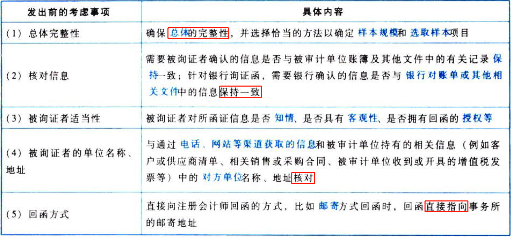

## 3.10. ［考点三］询证函发出时的控制措施:star: :star: 

注册会计师发出询证函的方式主要包括邮寄、跟函、电子询证函平台以及通过直接访问被询证者网站四种形式，其中，通过“电子询证函平台”属于信息技术环境下注册会计师实施函证程序的创新方式（此处不展开）。邮寄、跟函以及直接访问被询证者网站的要求归纳如下表。

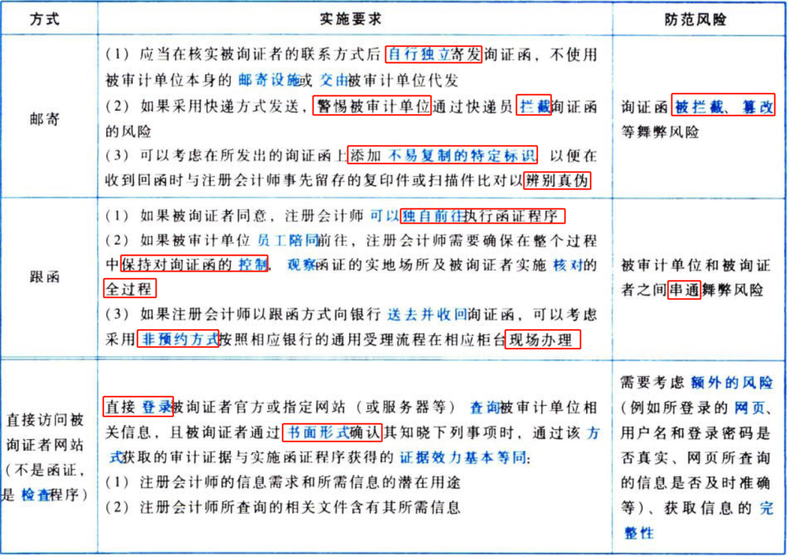

## 3.11. ［考点四］评价回函的可靠性:star: :star: :star: 

注册会计师需要保持职业怀疑验证不同方式下回函的可靠性，并加强对审计项目组成员所做工作的指导、监督和复核验证的内容和要求归纳如下表。

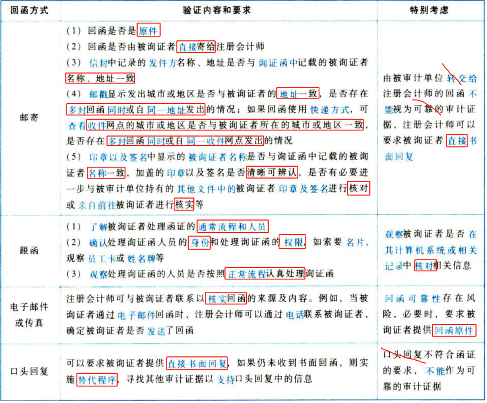

## 3.12. ［考点五］限制性条款:star: :star: 

一些限制性条款可能使注册会计师对回函中所包含信息的完整性、准确性或注册会计师能够信赖其所含信息的程度产生怀疑。实务中常见的对回函可靠性产生影响的限制性条款举例且应对措施，归纳如下表。

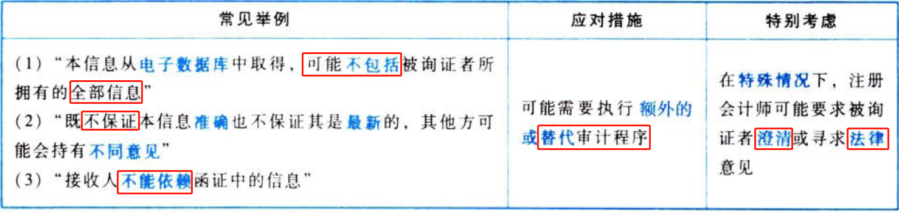

## 3.13. ［考点六］不符事项:star: :star: :star: 

注册会计师应当调查不符事项产生的原因，不符事项是否属于错报甚至是否属于舞弊；在审计抽样的情况下，注册会计师还应当考虑函证测试未覆盖的剩余部分，归纳如下表。

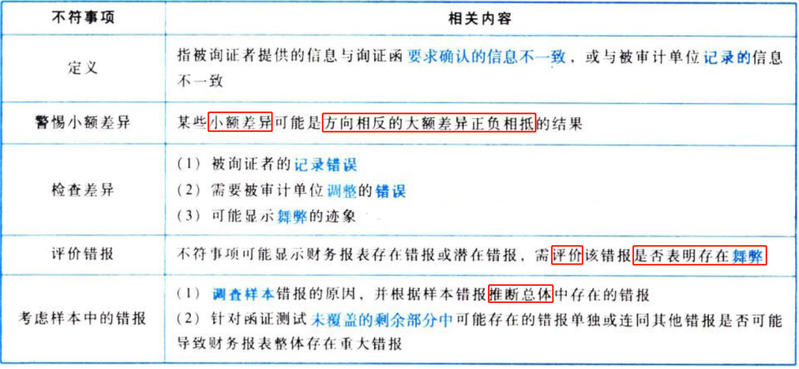

## 3.14. ［考点七］未收到回函:star: :star: :star: 

如果在合理的时间内未收到回函，注册会计师可以联系被询证者予以跟进，必要时再次发出询证函，以及可能实施替代程序，归纳如下表。

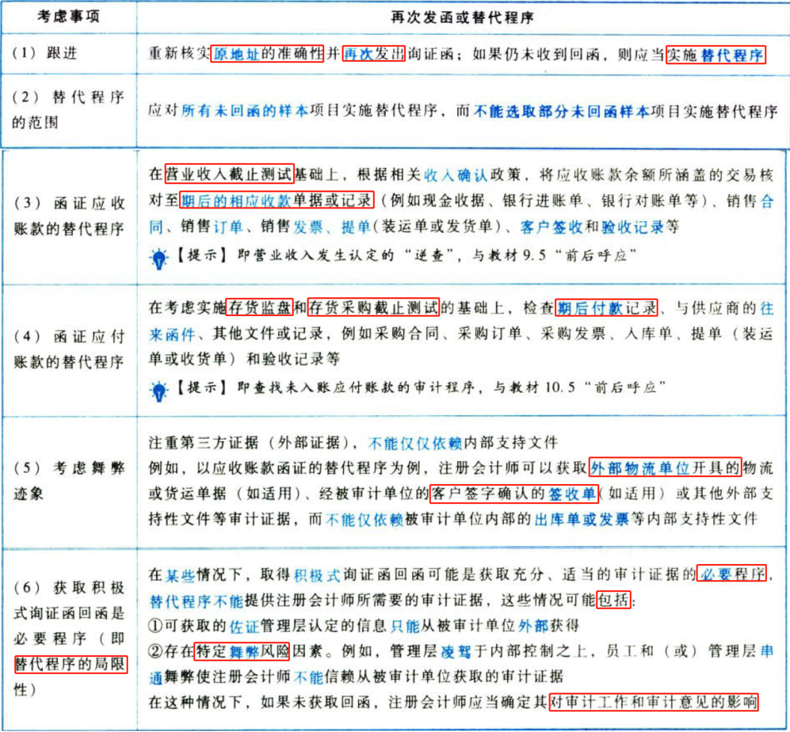

## 3.15. ［考点八］舞弊风险迹象及应对措施:star: :star: 

在函证过程中，注册会计师需要始终保持职业怀疑，对舞弊风险迹象保持警觉。具体内容归纳如下表。

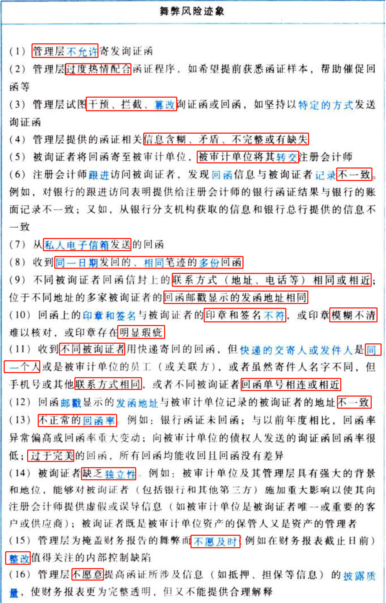

应对措施：

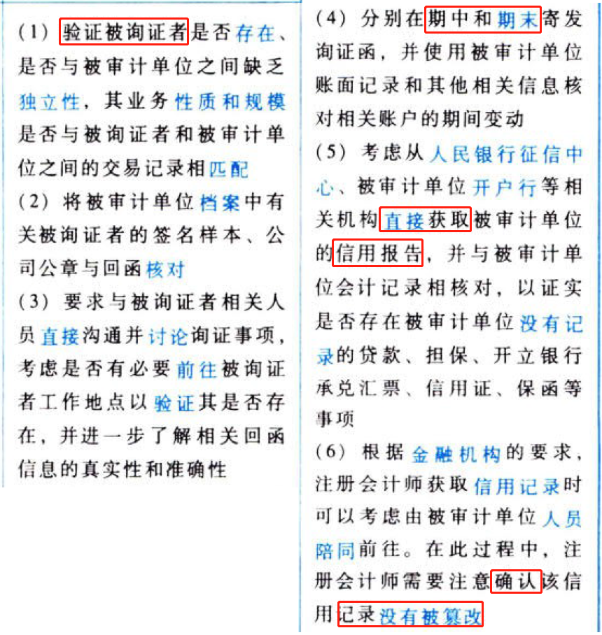

# 4. 分析程序

本节“分析程序”在明确其定义的基础上，围绕“目的”展开。分析程序的目的包括用作风险评估程序、用作实质性程序和用作总体复核三大环节，如图3-8所示。

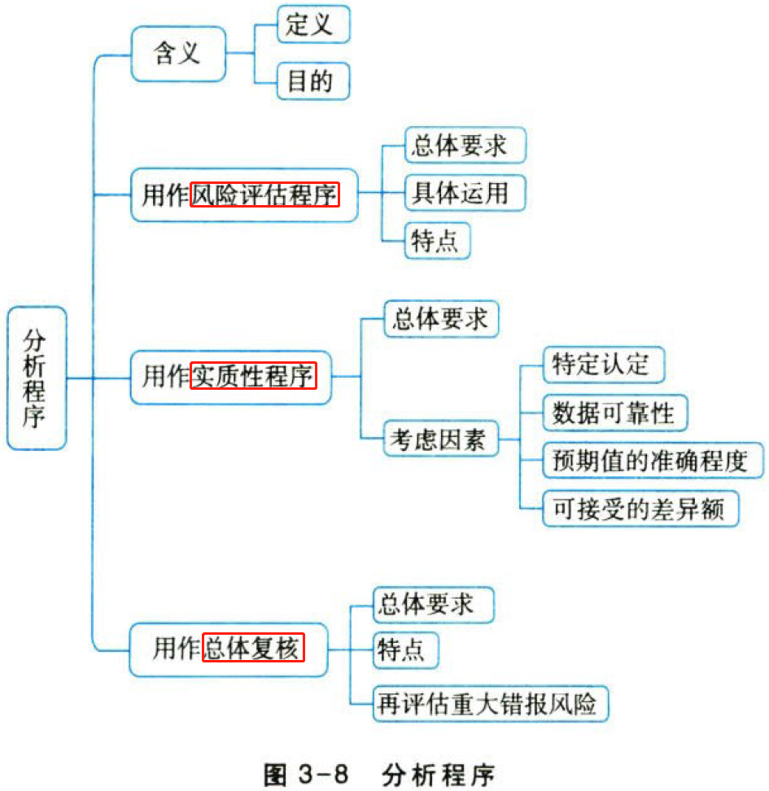

## 4.16. ［考点一］分析程序的含义:star: :star: 

### 4.16.8. 定义

分析程序是指注册会计师通过分析不同财务数据之间以及财务数据与非财务数据之间的内在关系，对财务信息作出评价。分析程序还包括在必要时对识别出的、与其他相关信息不一致或与预期值差异重大的波动或关系进行调查，如图3-9所示。

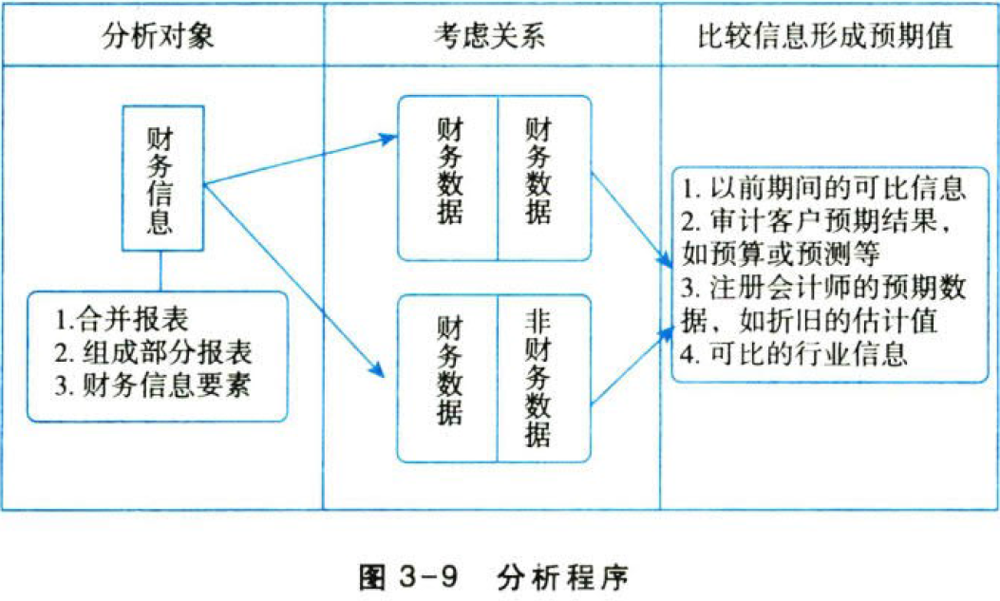

如回3-9所示，如果注册会计师识别到“财务数据与非财务数据”之间的不一致，即发现存在矛盾证据，则应当设计进一步审计程序，这个知识点常常在综合题中考查。

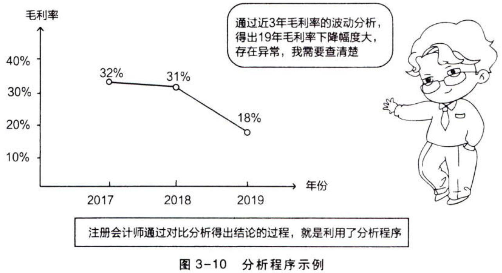

### 4.16.9. 目的

分析程序运用于三个环节，每一个环节获取的审计证据达到的目的不同，归纳如下表。

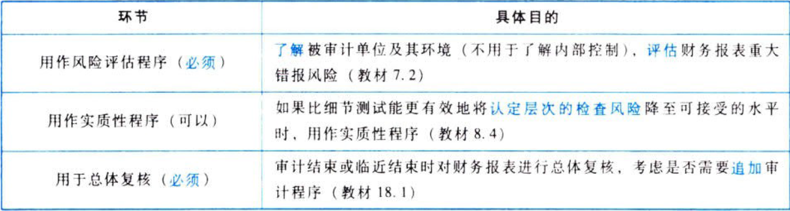

## 4.17. ［考点二］用作凤险评估程序:star: :star: 

分析程序用作风险评估程序的总体要求、具体运用和特点归纳如下表。

## 4.18. ［考点三］用作实质性程序:star: :star: :star: 

如图3-11所示，直观理解实质性分析程序：

（1）针对评估的认定层次重大错报风险；

（2）实质性分析程序对应于细节测试；

（3）用作实质性程序的“分析程序”需要考虑的四个因素

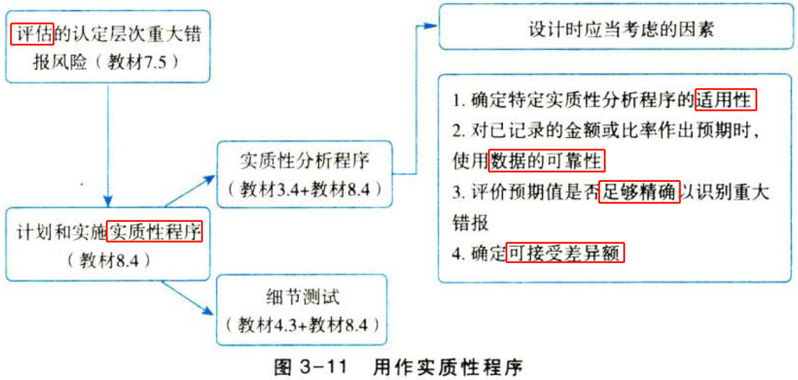

实质性分析程序的总体要求、运用条件、局限性、考虑因素等内容归纳如下表。

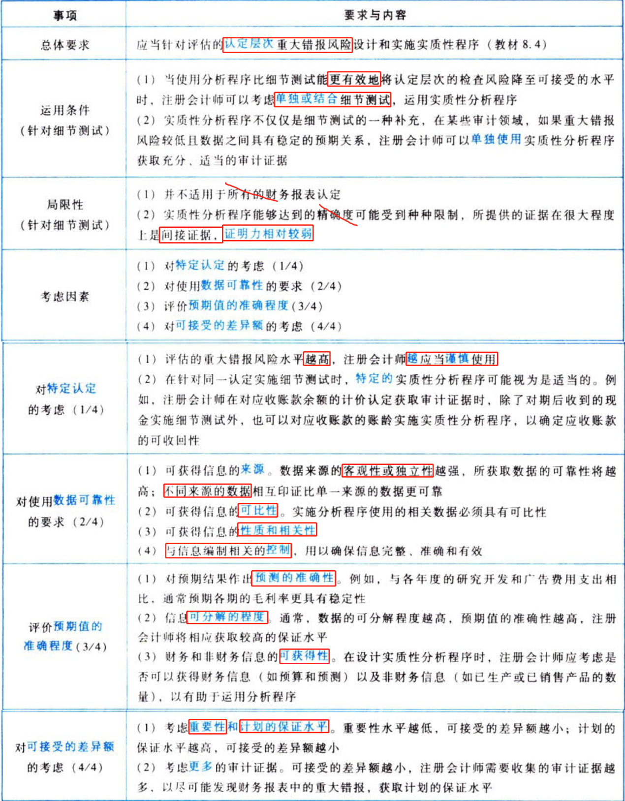

## 4.19. ［考点四］用作总体复核:star: :star: 

用作总体复核的分析程序的总体要求、特点、对重大错报风险的再评估归纳如下表。

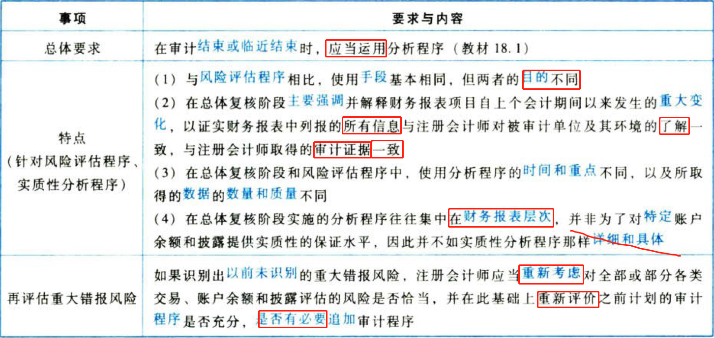

# 5. 总结

End。
