C13对舞弊和法律法规的考虑

# 1. 财务报表审计中与舞弊相关的责任

## 1.1. ［考点一］舞弊的含义和种类:star: 

### 1.1.1. 舞弊的含义

舞弊是指被审计单位的管理层、治理层、员工或第三方使用欺骗手段获取不当或非法利益的故意行为。

### 1.1.2. 舞弊与错误的区别

舞弊与错误均可能导致财务报表错报，二者的区别如图13-1所示。

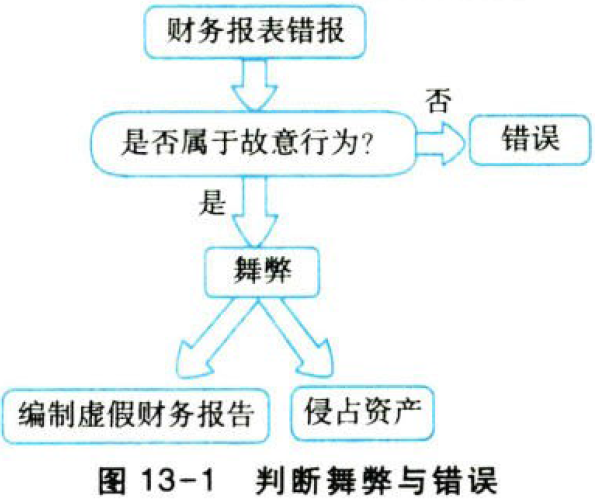

### 1.1.3. 舞弊的种类

舞弊是一种故意的行为，与财务报表审计相关的故意错报包括编制虚假财务报告导致的错报和侵占资产导致的错报，入土13-2所示。

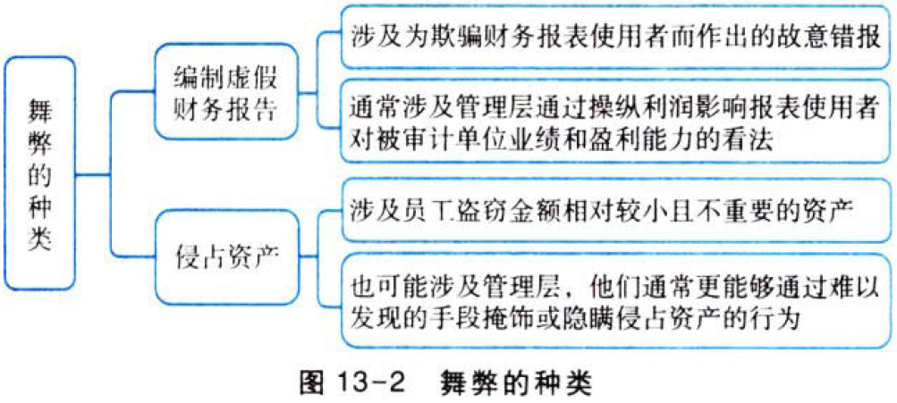

### 1.1.4. 舞弊方式

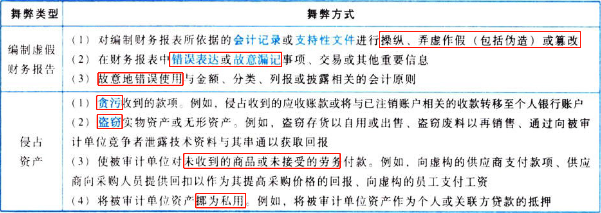

## 1.2. ［考点二］与舞弊相关的责任:star: :star: :star: 

### 1.2.5. 治理层和管理层对财务报表舞弊的责任

治理层和管理层对防止或发现财务报表舞弊负有主要责任，如图13-3所示。

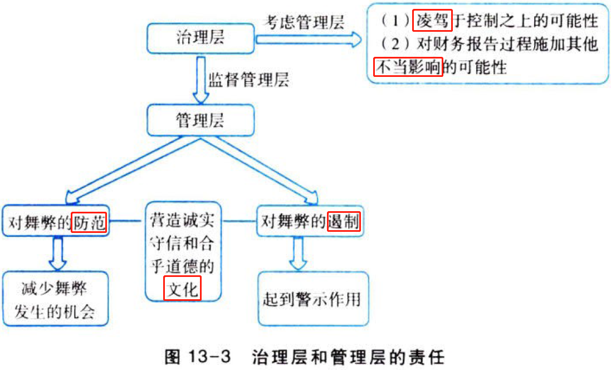

### 1.2.6. 注册会计师对财务报表舞弊的责任

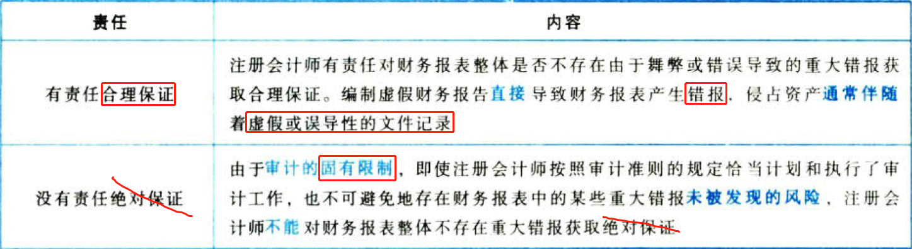

### 1.2.7. 舞弊导致的重大错报未被发现的风险，大于错误导致的重大错报未被发现的风险

（1）舞弊可能涉及精心策划和蓄意实施以进行隐瞒（如伪造证明或故意漏记交易），或者故意向注册会计师提供虚假陈述；

（2）如果涉及串通舞弊，注册会计师可能更加难以发现蓄意隐瞒的企图；

（3）串通舞弊可能导致原本虚假的审计证据被注册会计师误认为具有说服力。

### 1.2.8. 管理层舞弊导致的重大错报未被发现的风险，大于员工舞弊导致的重大错报未被发现的风险

管理层往往可以利用职务之便，直接或间接操纵会计记录，提供虚假的财务信息，或凌驾于为防止其他员工实施类似舞弊而建立的控制之上。

## 1.3. ［考点三］风险评估程序和相关活动:star: :star: :star: 

针对舞弊的风险评估程序和相关活动包括以下五个方面，如图13-4所示。

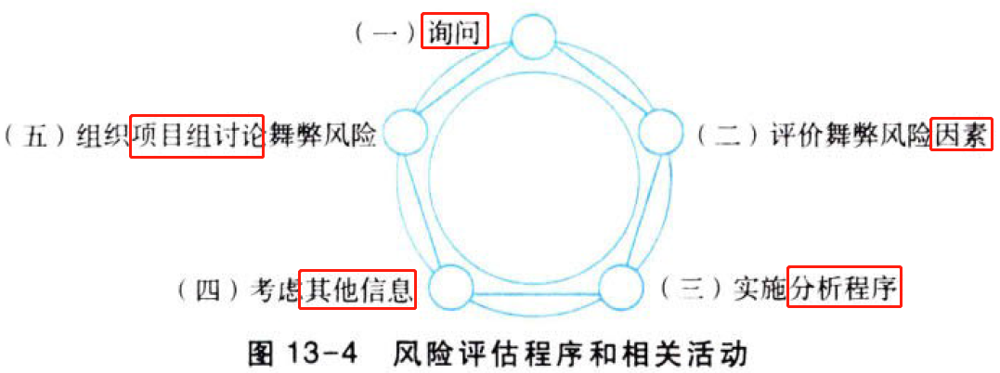

### 1.3.9. 询问

注册会汁师通过询问识别和评估舞弊风险，其询问的对象和内容如下表所示。

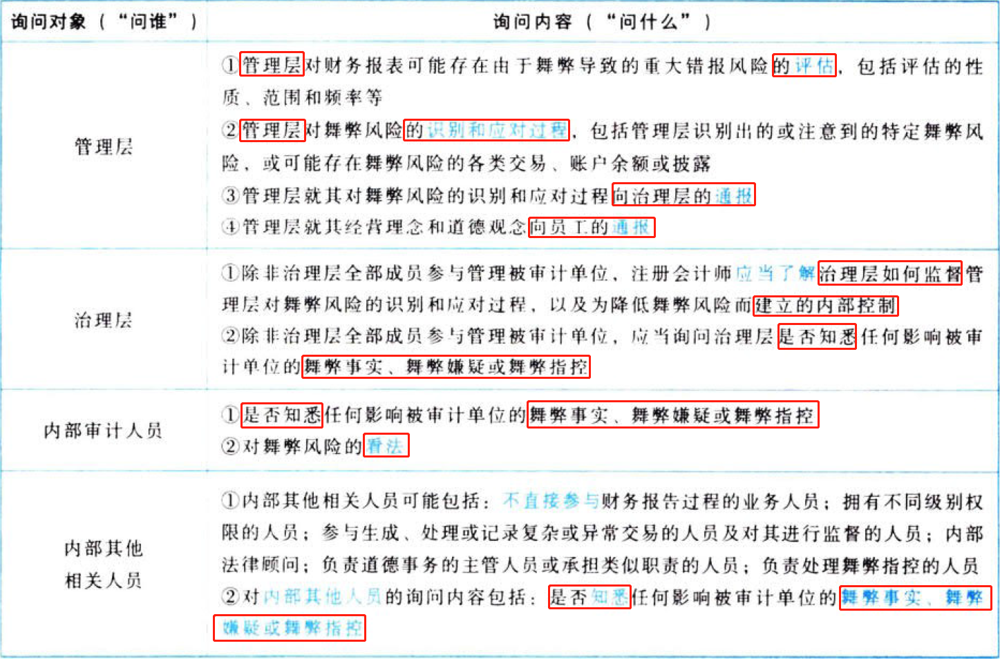

### 1.3.10. 评价舞弊风险因素

根据舞弊存在时通常伴随着的三种情况，这些风险因素可以分为以下三类：

（1）实施舞弊的动机或压力。

（2）实施舞弊的机会。

（3）为舞弊行为寻找借口的能力。

上述风险因素也被称为“舞弊三角”。这三个风险因素在两类舞弊行为中有不同的体现。

注册会计师应当运用职业判断，考虑被审计单位的规模、复杂程度、所有权结构及所处行业等，以确定舞弊风险因素的相关性和重要程度及其对重大错报风险评估可能产生的影响。

无论是编制虚假财务报告还是侵占资产，均涉及下列舞弊风险因素，如图13-5所示。

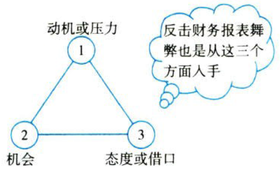

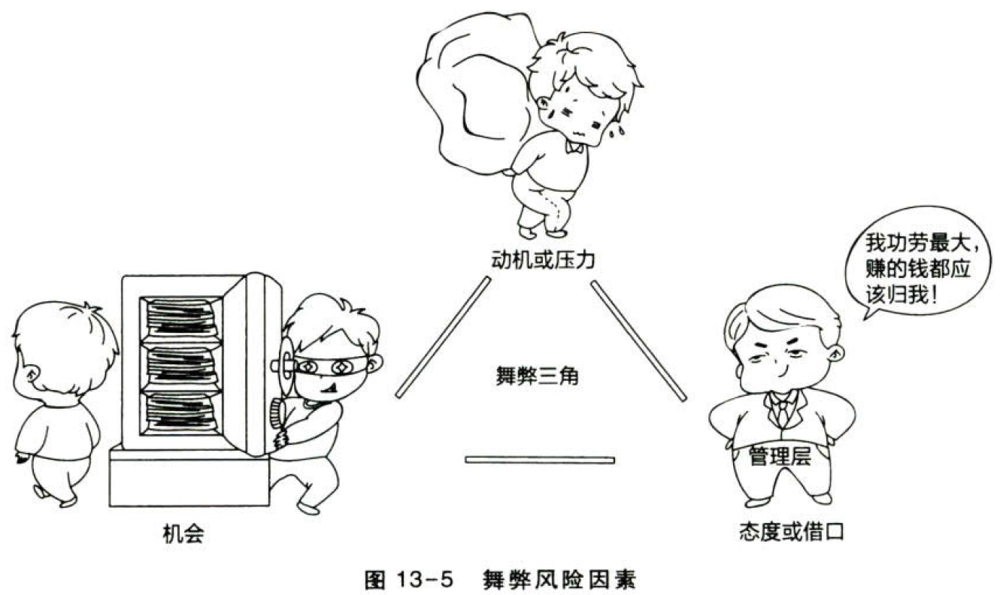

#### 1.3.10.1. 与编制虚假财务报告导致的错报相关的舞弊的动机或压力

在财务报表审计中，注册会计师识别的与编制虚假财务报告导致的错报相关的舞弊的动机或压力，如下表所示。

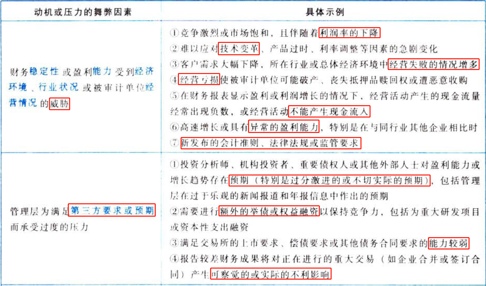

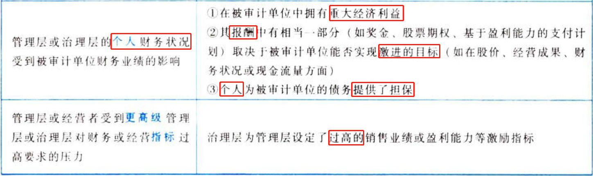

#### 1.3.10.2. 与编制虚假财务报告导致的错报相关的舞弊的机会

在财务报表审计中，注册会计师识别的与编制虚假财务损告导致的错报相关的舞弊的机会，如下表所示。

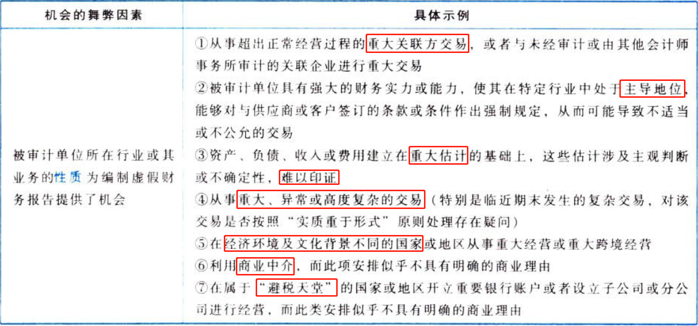

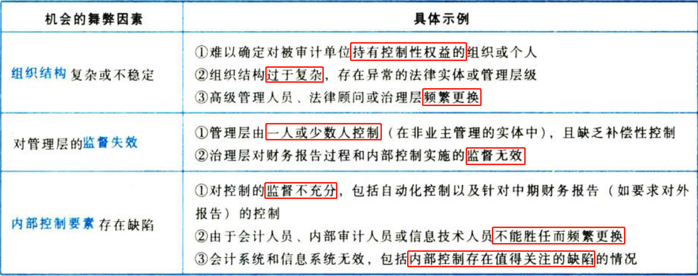

#### 1.3.10.3. 与编制虚假财务报告导致的错报相关的舞弊的态度或借口

在财务拙表审计中，注册会计师识别的与编制虚假财务报告导致的错报相关的舞弊的态度或借口，如下图所示。

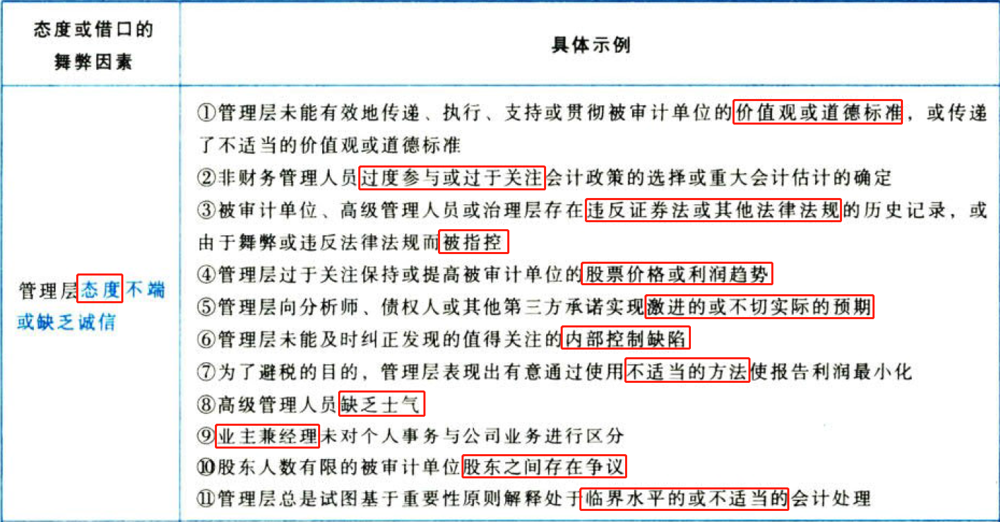

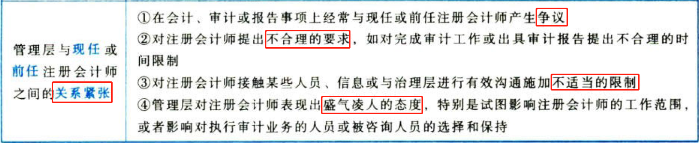

#### 1.3.10.4. 与侵占资产导致的错报相关的舞弊风险因素

##### 1.3.10.4.1. 动机或压力

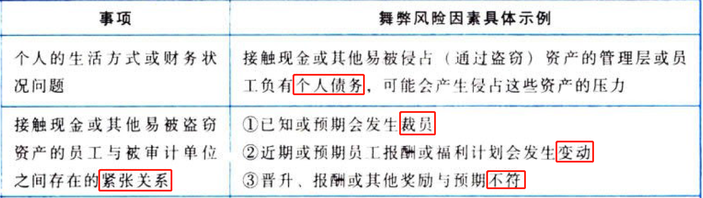

##### 1.3.10.4.2. 机会

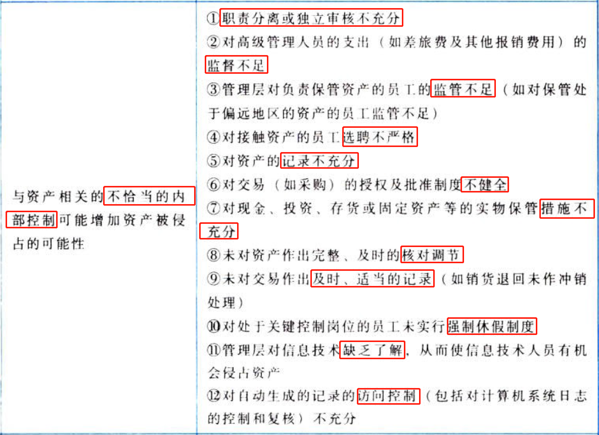

##### 1.3.10.4.3. 态度或借口

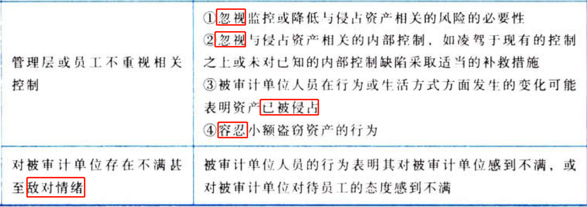

### 1.3.11. 实施分析程序

在实施分析程序以了解被审计单位及其环境时，注册会计师应当评价识别出的异常或偏离预期的关系（包括与收入账户有关的关系），是否表明存在由于舞弊导致的重大错报风险。

### 1.3.12. 考虑其他信息

（1）其他信息的来源。

①获取的有关被审计单位及其环境的信息（请结合教材7.3);

②项目组内部的讨论（请结合教材7.2);

③在客户接受和保持过程中获取的信息（请结合教材21.3);

④向被审计单位提供其他服务所获取的经验（如中期财务信息审阅）。

（2）注册会计师结合询问和分析程序的结果，综合评价所获取的信息。

①是否表明存在舞弊风险；

②各种信息是否相互佐证；

③如有不一致，应对此作出调查。

### 1.3.13. 组织项目组讨论舞弊风险

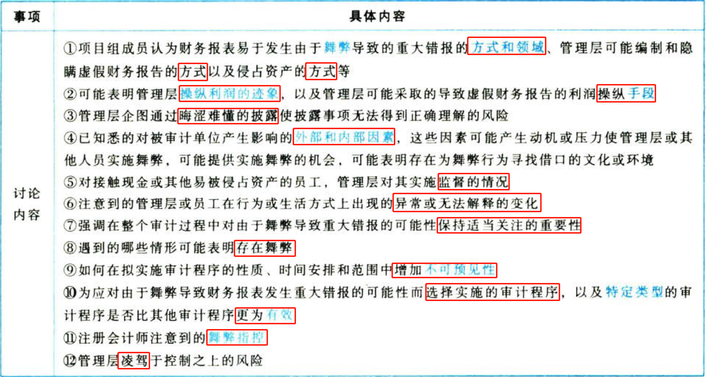

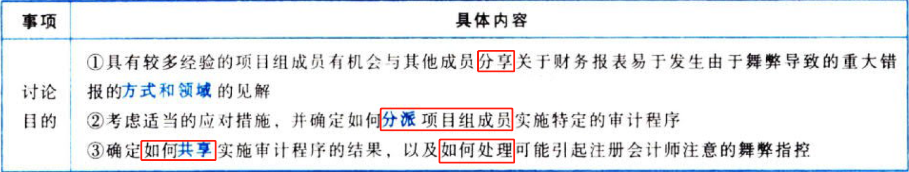

## 1.4. ［考点四］识别和评估舞弊导致的重大错报风险:star: :star: :star: 

注册会计师识别和评估舞弊风险的审计思路和要求，如图13-6所示。

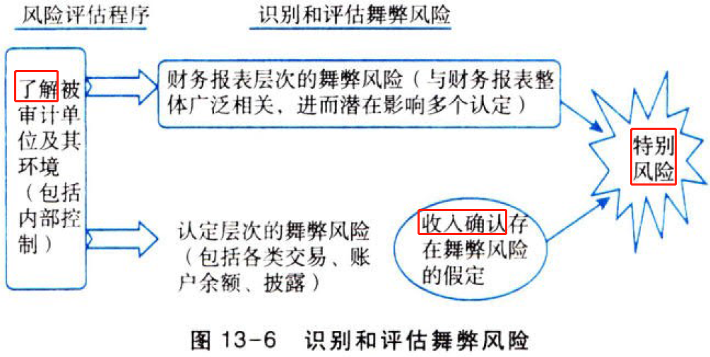

### 1.4.14. 评估要求

（1）舞弊导致的重大错报风险属于需要注册会计师特别考虑的重大错报风险，即特别凤险；

（2）在识别和评估财务报表层次以及各类交易、账户余额、披露的认定层次的重大错报风险时，注册会计师应当识别和评估舞弊导致的重大错报风险。

### 1.4.15. 基于收入确认存在舞弊风险的假定

（1）注册会计师在识别和评估由于舞弊导致的重大错报风险时，应当基于收入确认存在舞弊风险的假定，评价哪些类型的收入、收入交易或认定导致舞弊风险；

（2）如果认为收入确认存在舞弊风险的假定不适用于业务的具体情况，从而未将收入确认作为由于舞弊导致的重大错报风险领域，注册会计师应当在审计工作底稿中记录得出该结论的理由。

基于收入确认存在舞弊风险的假定，舞弊的情形可能包括：

（1）记录虚假收入。

（2）高估收入，包括：在客户取得相关商品控制权之前就确认销售收入。

（3）低估收入，包括：在已完成本期销售指标时，把实现的销售推迟到下一期确认；当期已实现的收入不确认营业收入汇入其他应付款，从而递延或减少税款的支付。

## 1.5. ［考点五］应对舞弊导致的重大错报凤险:star: :star: :star: 

注册会计师应对舞弊风险的思路和内容，如图13-7所示。

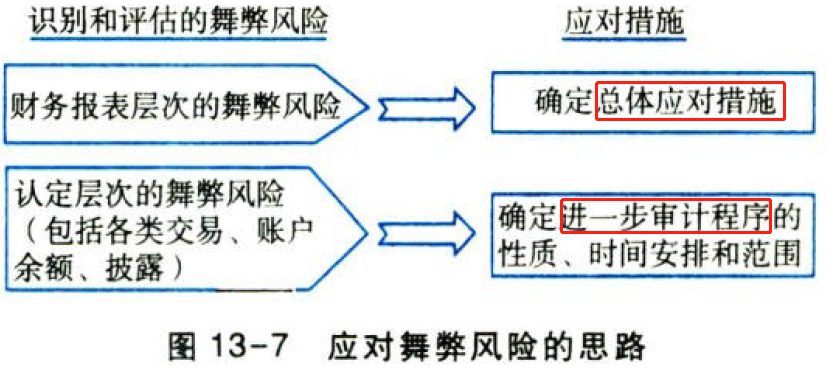

### 1.5.16. 总体应对措施

注册会计师应对舞弊导致的财务报表层次重大错报风险的总体应对措施，如图13-8所示。

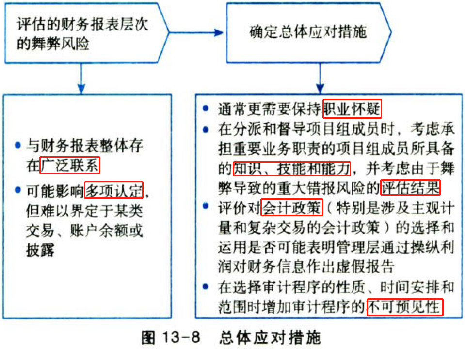

### 1.5.17. 针对舞弊导致的认定层次重大错报风险实施的审计程序

（1）总体思路。

针对舞弊导致的认定层次重大错报风险实施的审计程序的审计思路包括以下三个方面：

①改变拟实施审计程序的性质，以获取更为可靠、相关的审计证据，或获取其他佐证性信息。

②改变实质性程序的时间，包括在期末或接近期末实施实质性程序，或针对本期较早时间发生的交易事项或贯穿于本会计期间的交易事项实施测试。

③改变审计程序的范围，包括扩大样本规模、采用更详细的数据实施分析程序等。

（2）具体应对措施。

针对舞弊导致的认定层次重大错报风险所采取的具体应对措施，如下表所示。

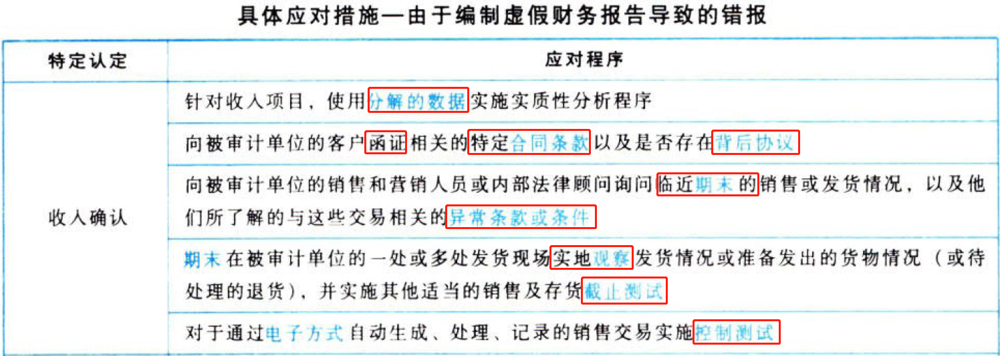

## 1.6. ［考点六］管理层凌驾的舞弊手段和审计程序:star: :star: :star: 

### 1.6.18. 了解管理层凌驾于控制之上实施舞弊的手段

①编制虚假的会计分录，特别是在临近会计期末时；

②滥用或随意变更会计政策；

③不恰当地调整会计估计所依据的假设及改变原先作出的判断；

④故意漏记、提前确认或推迟确认报告期内发生的交易或事项；

⑤隐瞒可能影响财务报表金额的事实；

⑥构造复杂或虚假的交易以歪曲财务状况或经营成果；

⑦篡改与重大或异常交易相关的会计记录和交易条款。

### 1.6.19. 针对管理层凌驾于控制之上的风险应当实施的审计程序

管理层凌驾于控制之上的风险属于特别风险。

无论对管理层凌驾于控制之上的风险的评估结果如何，注册会计师都应当设计和实施审计程序，用以：

（1）测试日常会计核算过程中作出的会计分录以及编制财务报表过程中作出的其他调整是否适当。

（2）复核会计估计是否存在偏向，并评价产生这种偏向的环境是否表明存在由于舞弊导致的重大错报风险。

（3）对于超出被审计单位正常经营过程的重大交易，或基于对被审计单位及其环境的了解以及在审计过程中获取的其他信息而显得异常的重大交易，评价其商业理由（或缺乏商业理由）是否表明被审计单位从事交易的目的是为了对财务信息作出虚假报告或掩盖侵占资产的行为。

## 1.7. ［考点七］了解被审计单位异常的重大交易迹象:star: 

以下迹象可能表明被审计单位从事超出其正常经营过程的重大交易，或虽然未超出其正常经营过程但显得异常的重大交易：

（1）交易的形式显得过于复杂（例如，交易涉及集团内部多个实体，或涉及多个非关联的第三方）；

（2）管理层未与治理层就此类交易的性质和会计处理进行过讨论，且缺乏充分的记录：

（3）管理层更强调采用某种特定的会计处理的需要，而不是交易的经济实质；

（4）对于涉及不纳入合并范围的关联方（包括特殊目的实体）的交易，治理层未进行适当的审核与批准；

（5）交易涉及以往未识别出的关联方，或涉及在没有被审计单位帮助的情况下不具备物质基础或财务能力完成交易的第三方。

## 1.8. ［考点八］会计分录测试（食食食）

### 1.8.20. 会计分录和其他调整的类型

基于会计分录测试的目的，注册会计师可将被审计单位的会计分录和其他调整分为下列二种类型：

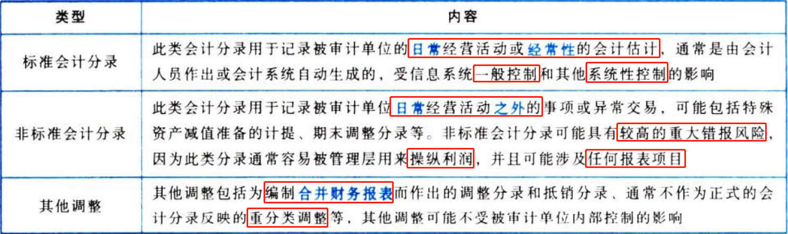

### 1.8.21. 会计分录测试的步骤

会计分录测试通常可包括下列步骤：

（1）了解被审计单位的财务报告流程，以及针对会计分录和其他调整已实施的控制，必要时，测试相关控制的运行有效性。

（2）确定待测试会计分录和其他调整的总体，并测试总体的完整性。

（3）从总体中选取待测试的会计分录及其他调整。

（4）测试选取的会计分录及其他调整，并记录测试结果。

### 1.8.22. 被审计单位内部控制系统中针对会计分录和其他调整的控制

在被审计单位的内部控制系统中，针对会计分录和其他调整，通常包括下列类型的控制措施：

（1）针对会计分录和其他调整的授权、过账、审核、核对等方面设置职责分离。

（2）在会计系统中设置系统访问权限，用以控制会计分录的记录权和审批权。

（3）用以防止并发现虚假会计分录或未经授权的更改的控制措施。

（4）由管理层、治理层或其他适当人员对会计分录记录和过入总账以及在编制财务报表过程中作出其他调整的过程进行监督。

（5）由被审计单位的内部审计人员（如有）定期测试控制运行的有效性。

### 1.8.23. 确定待测试会计分录和其他调整的总体并测试总体的完整性

（1）确定待测试会计分录和其他调整的总体。

注册会计师与虑下列情况，可能有助于其确定待测试会计分录和其他调整的总体：

①某些会计分录和其他调整可能并不过入被审计单位的总账，因此，注册会计师需要期末了解各总账账户，以及各明细账户与被审计单位财务报表项目之间的对应关系。

②注册会计师可以结合对被审计单位财务报告流程以及被审计单位针对会计分录和其他调整实施的控制的了解，来确定待测试会计分录和其他调整的总体。在这一过程中，注册会计师可以了解会计分录和其他调整的来源和特征，例如，会计分录是由会计信息系统自动生成的，还是以手工方式生成的。

③以手工方式生成的会计分录或其他调整通常于月末、季末或年末作出，主要用于记录会计调整或会计估计，或者用于编制合并财务报表。

④对于以手工方式生成的会计分录或其他调整，特别是在期末用于记录会计调整或会计估计，或者用于编制合并财务报表的调整分录，注册会计师可以了解这些分录的编制者、所需要的审批，以及这些分录以何种方式得以记录（例如，这些分录是以电子形式记录的，没有实物证据，还是以纸质形式记录的）。

（2）针对待测试会计分录和其他调整总体的审计程序。

确定待测试会计分录和其他调整的总体后，注册会计师需要针对该总体实施审计程序，以确定总体的完整性。

一套完整性测试的例子（假设注册会计师选择测试整个会计期间的会计分录和其他调整）吐下：

①从被审计单位会计信息系统中导出所有待测试会计分录和其他调整。

②加计从会计信息系统中导出的所有会计分录和其他调整中的本期发生额，与科目余额表（包括期初余额、本期借方累计发生额、本期贷方累计发生额、期末余额）中的各科目本期发生额核对相符。

③将系统生成的重要账户余额与明细账户和总账及科目余额表中的余额核对，测试计算准确性。

④检查所有结账后作出的与本期财务报表有关的会计分录和其他调整，测试其完整性。

⑤将总账与财务报表核对，以检查是否存在其他调整。

### 1.8.24. 选取并测试会计分录和其他调整时考虑的因素

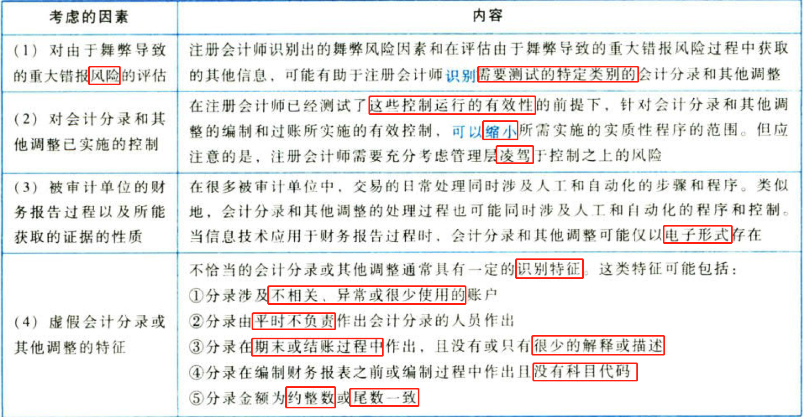

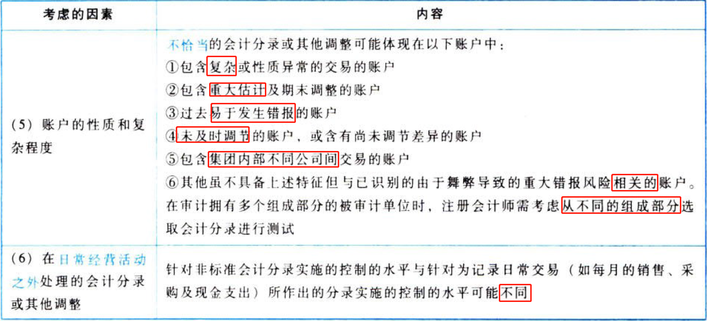

## 1.9. ［考点九］评价审计证据:star: :star: 

### 1.9.25. 临近审计结束时实施的分析程序

在就财务报表与所了解的被审计单位的情况是否一致形成总体结论时，注册会计师应当评价在临近审计结束时实施的分析程序，是否表明存在此前尚未识别的由于舞弊导致的重大错报风险。

### 1.9.26. 合理运用职业判断

确定哪些特定趋势和关系可能表明存在由于舞弊导致的重大错报风险，需要运用职业判断。

### 1.9.27. 特定的趋势和关系

涉及期末收入和利润的异常趋势和关系可能包括：

（1）在报告期的最后几周内记录了不寻常的大额收入或异常交易。

（2）收入与经营活动产生的现金流量趋势不一致。

### 1.9.28. 评价错报

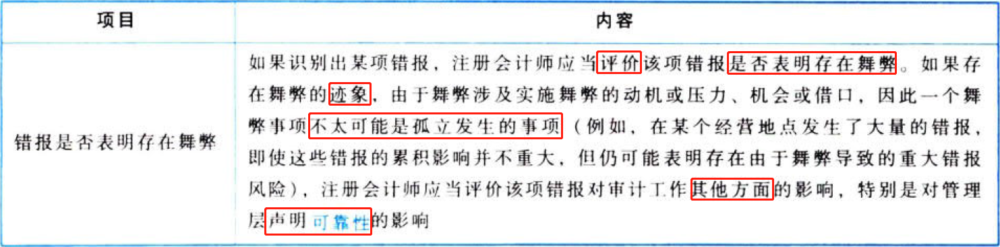

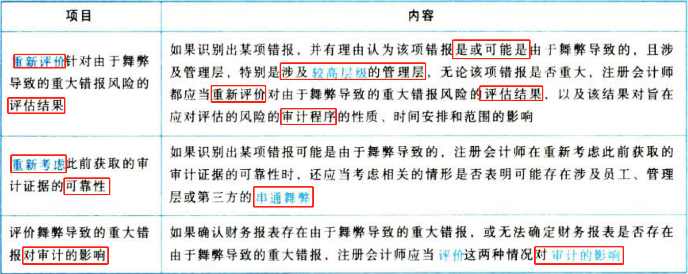

## 1.10. ［考点十］无法继续执行审计业务:star: :star: 

针对注册会计师可能无法继续执行审计业务的考虑事项和要求，归纳如下表。

## 1.11. ［考点十一］获取书面声明（食食）

### 1.11.29. 获取针对舞弊的书面声明

由于舞弊的性质以及注册会汁师在发现舞弊导致的财务报表重大错报时遇到的困难，注册会计师向管理层和治理层（如适用）获取书面声明，确认其已向注册会计师披露了下列信息是非常重要的：

（1）管理层对财务报表可能存在由于舞弊导致的重大错报风险的评估结果。

（2）对影响被审计单位的舞弊事实、舞弊现已或舞弊指控的了解程度。

### 1.11.30. 舞弊相关的书面声明的内容

注册会计师应当就下列事项向管理层和治理层（如适用）获取书面声明：

（1）管用层和治理层认可其设计，执行和维护内部控制以防止和发现舞弊的责任。

（2）管理层和治理层已向注册会计师披露了管理层对由于舞弊导致的财务报表重大错报风险的评估结果。

（3）管现层和治理层已向注册会计师披露了已知的涉及管理层、在内部控制中承担重要职责的员工以及其他人员（在舞弊行为导致财务报表出现重大错报的情况下）的舞弊或舞弊嫌疑。

（4）管理层和治理层已向注册会计师披露了从现任和前任员工、分析师、监管机构等方面获知的、影响财务报表的舞弊指控或舞弊嫌疑。

## 1.12. ［考点十二］与管理层、治理层和监管机构的沟通:star: :star: 

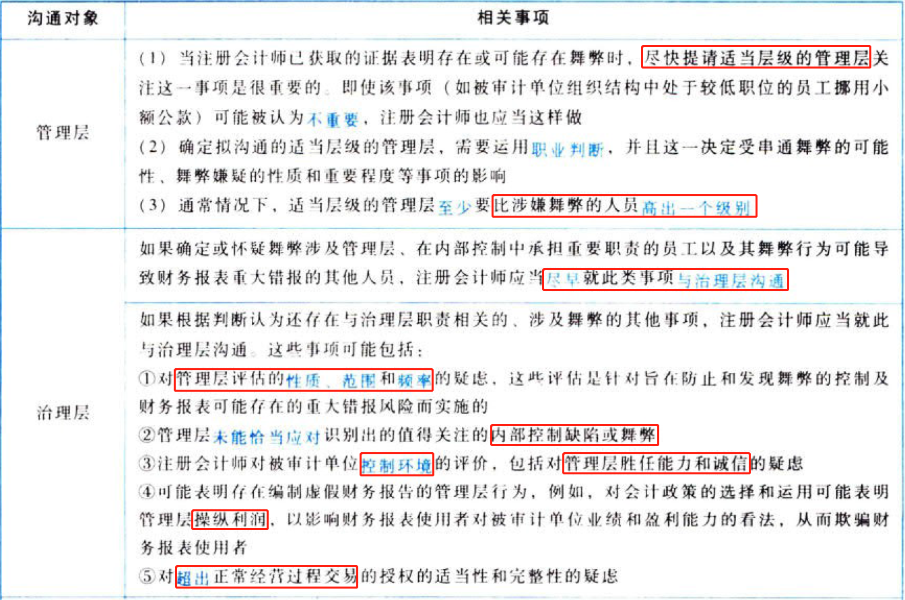

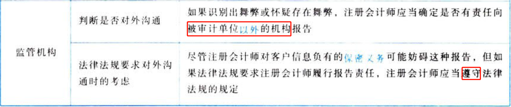

# 2. 财务报表审计中对法律法规的考虑

## 2.13. ［考点一］违反法律法规的定义和类别:star: :star: 

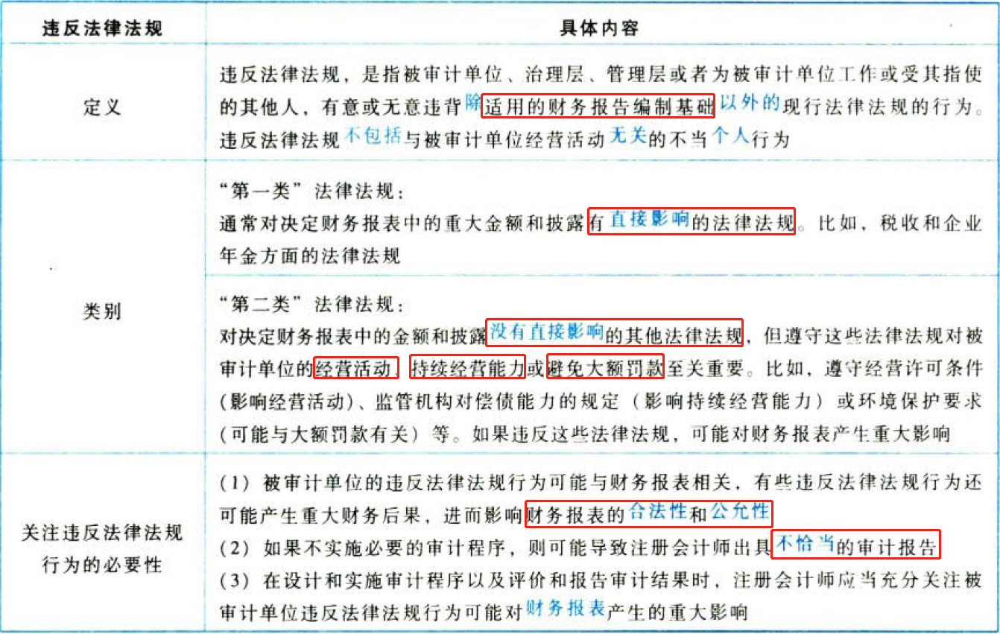

## 2.14. ［考点二］对被审计单位遵守法律法规的审计责任:star: :star: :star: 

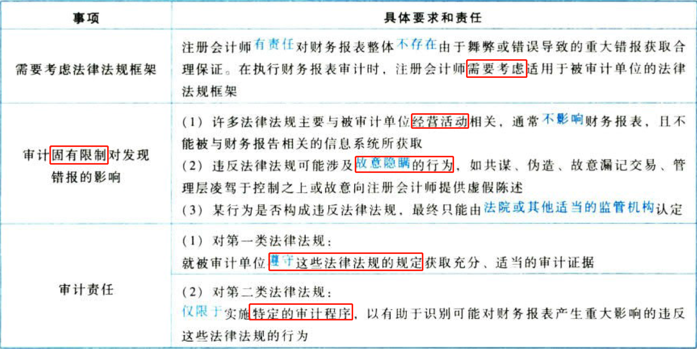

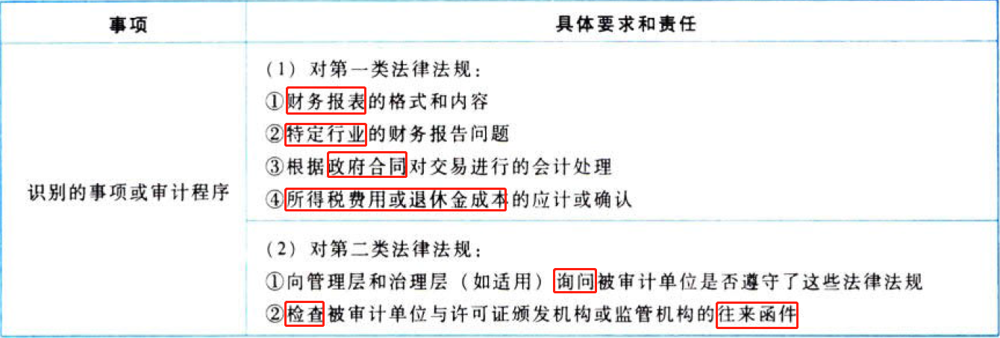

## 2.15. ［考点三］对被审计单位遵守法律法规的考虑:star: :star: :star: 

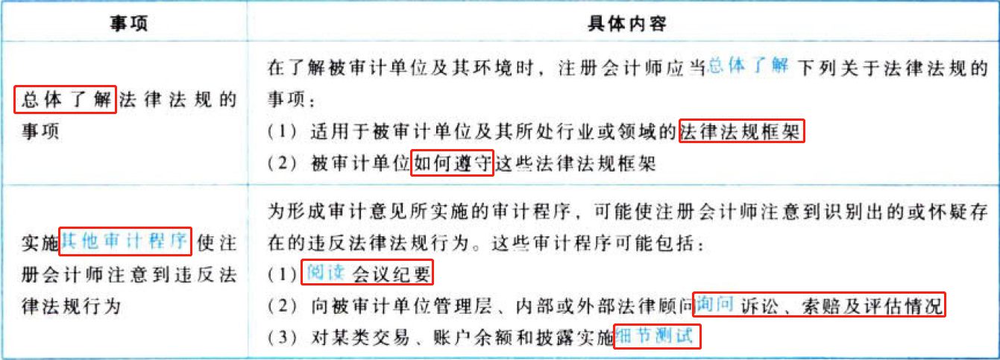

## 2.16. ［考点四］可能表明存在违反法律法规行为的信息及相关审计程序:star: 

注册会计师了解被审计单位可能表明被审计单位存在违反法律法规行为的信息以及相关审计程序，归纳如下表。

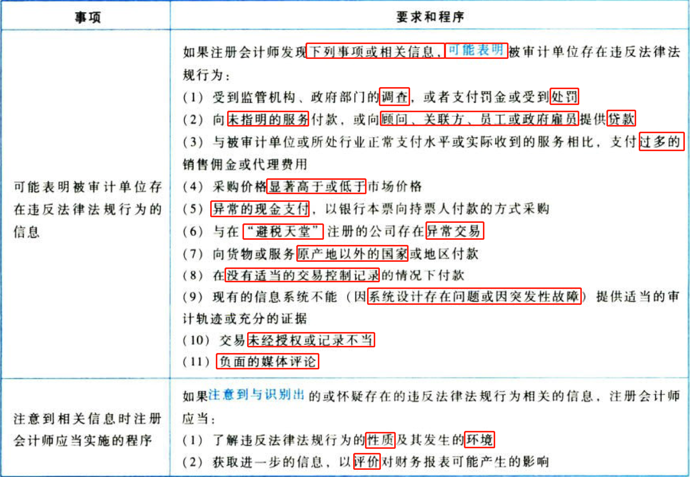

## 2.17. ［考点五］怀疑被审计单位存在违反法律法规行为时的审计程序:star: :star: :star: 

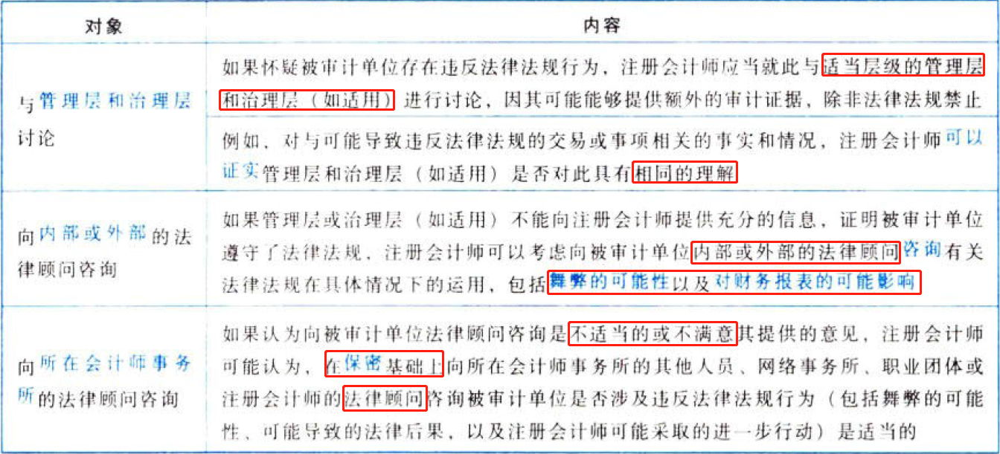

## 2.18. ［考点六］评价识别出的或怀疑存在的违反法律法规行为的影响:star: :star: :star: 

注册会计师评价识别出的或怀疑存在的无法法律法规行为的影响的要求与应对措施，归纳如下表：

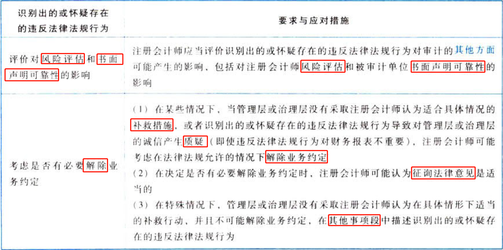

## 2.19. ［考点七］与治理层沟通识别出的或怀疑存在的违反法律法规行为:star: :star: 

与治理层沟通识别出的或怀疑存在的违反法律法规行为的要求和事项，归纳如下表。

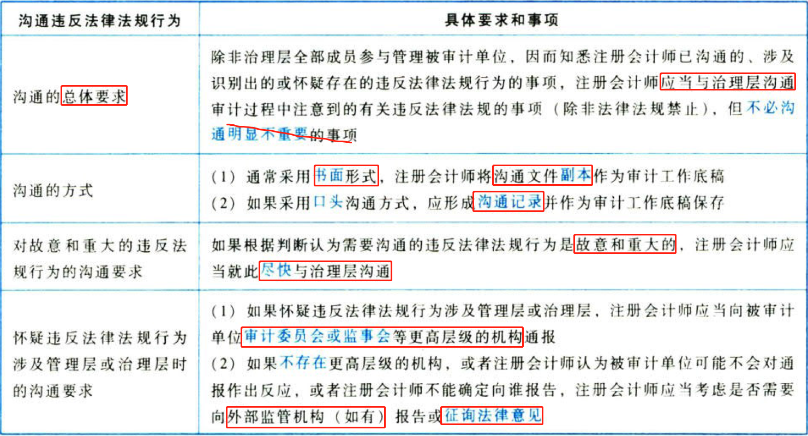

## 2.20. ［考点八］在审计报告中反映识别出的或怀疑存在的违反法律法规行为:star: :star: 

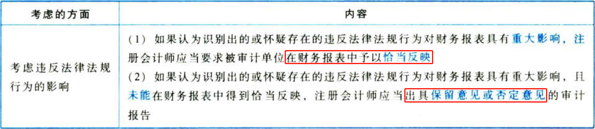

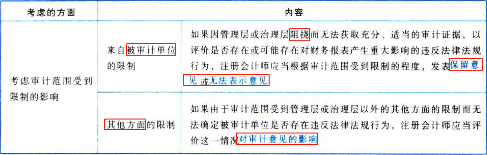

## 2.21. ［考点九］向被审计单位之外的适当机构报告识别出的或怀疑存在的违反法律法规行为:star: :star: 

### 2.21.31. 考虑是否有责任向被审计单位以外的适当机构报告

如果识别出或怀疑存在违反法律法规行为，注册会计师应当考虑是否有责任向被审计单位以外的适当机构报告。

### 2.21.32. 针对严重违反法律法规的行为的报告

（1）考虑是否报告严重违反法律法规的行为。

（2）考虑报告方式、时间和对象。

### 2.21.33. 考虑征询相关的法律意见

如果无法确定是否有相关法律法规要求向被审计单位之外的适当机构报告发现的被审计单位的违反法律法规行为，或者无法确定某项违反法律法规行为是否应该向被审计单位之外的适当机构报告，注册会计师通常可以考虑征询相关的法律意见，以了解注册会计师的可能选择，以及采取任何特定行动的职业及法律后果。

# 3. 总结

End。
