C16对集团财务报表审计的特殊考虑

# 1. 与集团财务报表审计有关的概念

## 1.1. ［考点一］与集团审计的相关概念:star: 

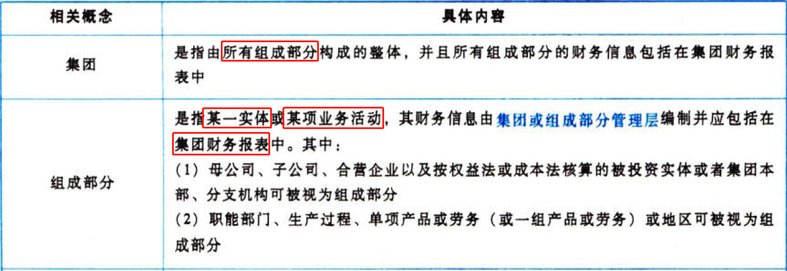

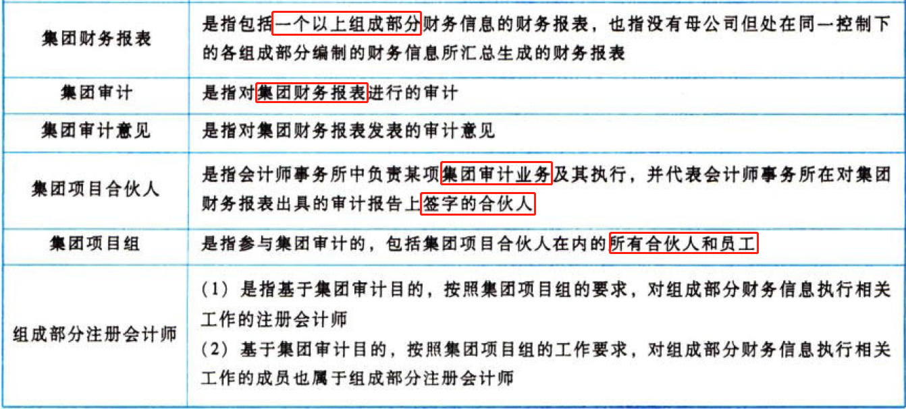

## 1.2. ［考点二］重要组成部分:star: :star: 

### 1.2.1. 定义

### 1.2.2. 判断重要组成部分的特征

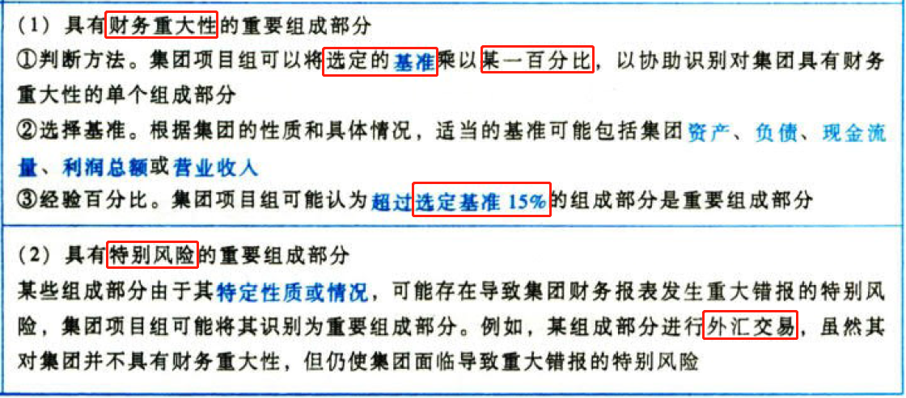

# 2. 集团财务报表审计中的责任设定和注册会计师的目标

## 2.3. ［考点一］集团财务报表审计中的责任设定:star: :star: 

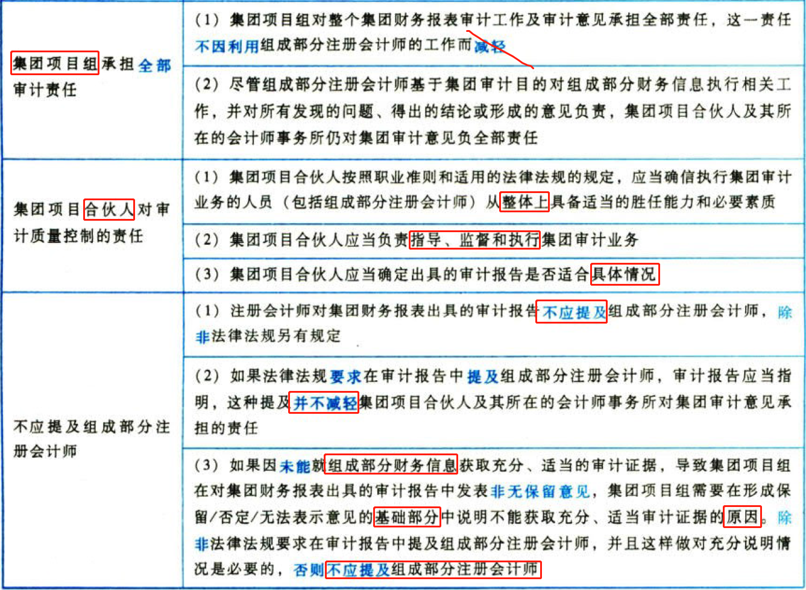

## 2.4. ［考点二］集团财务报表审计中注册会计师的目标:star: 

（1）就组成部分注册会计师对组成部分财务信息执行工作的范围、时间安排和发现的问题，与组成部分注册会计师进行清晰的沟通。

（2）针对组成部分财务信息和合并过程，获取充分、适当的审计证据，以对集团财务报表是否在所有重大方面按照适用的财务报告编制基础编制发表审计意见。

# 3. 集团审计业务的承接与保持

## 3.5. ［考点一］在承接与保持阶段获取了解:star: 

在承接与保持阶段获取了解，需要从以下三个方面分别考虑，归纳如下表。

### 3.5.3. 评估承接业务的前提基础

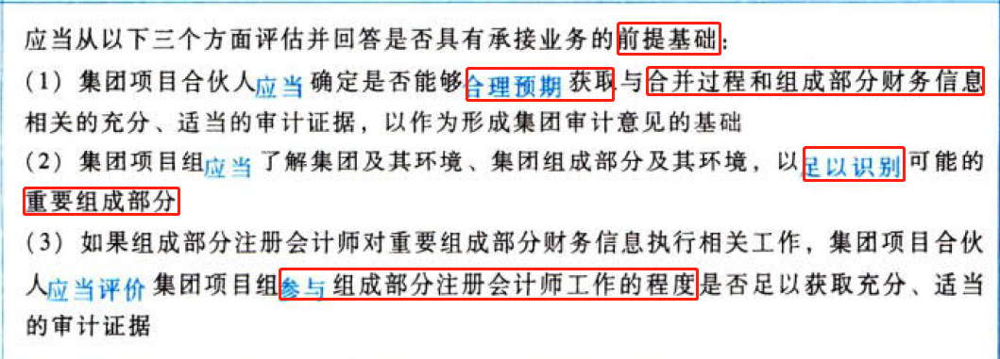

### 3.5.4. 拟承接新业务时的考虑

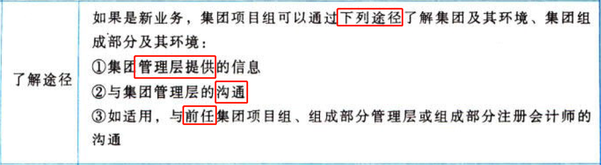

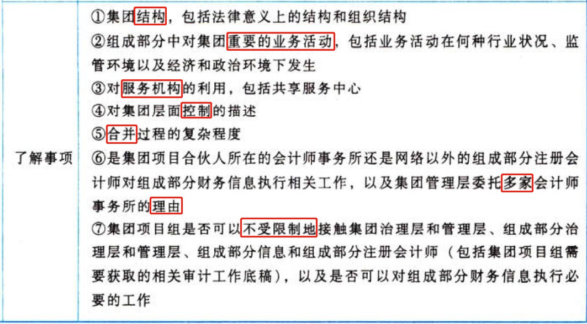

### 3.5.5. 连续审计时的考虑

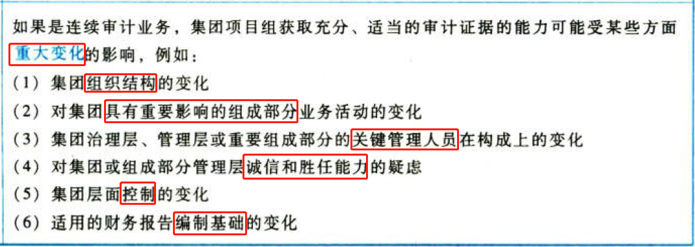

## 3.6. ［考点二］审计范围受到限制:star: 

### 3.6.6. 集团管理层施加限制时的考虑

如果集团项目合伙人认为由于集团管理层施加的限制，使集团项目组不能获取充分、适当的审计证据，由此产生的影响可能导致对集团财务报表发表无法表示意见，集团项目合伙人应当视具体情况采取下列措施：

（1）如果是新业务，拒绝接受业务委托，如果是连续审计业务，在法律法规允许的情况下，解除业务约定。

（2）如果法律法规禁止注册会计师拒绝接受业务委托，或者注册会计师不能解除业务约定，在可能的范围内对集团财务报表实施审计，并对集团财务报表发表无法表示意见。

### 3.6.7. 集团项目组考虑能否获取充分、适当的审计证据的情形

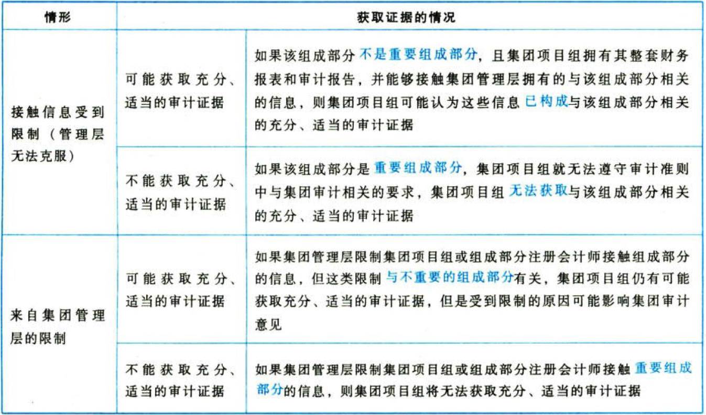

# 4. 了解集团及其环境、集团组成部分及其环境

## 4.7. ［考点］了解集团及其环境、集团组成部分及其环境:star: :star: 

### 4.7.8. 了解内容

#### 4.7.8.1. 目的

#### 4.7.8.2. 要求

#### 4.7.8.3. 事项

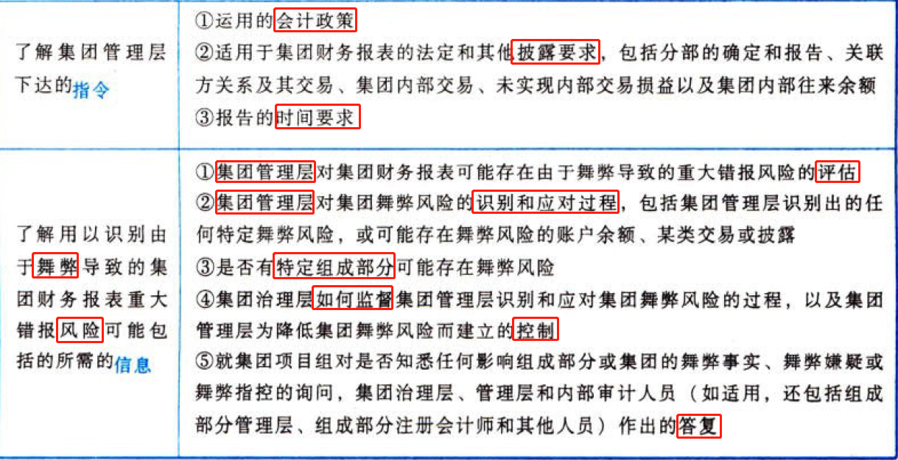

### 4.7.9. 集团项目组成员和组成部分注册会计师对集团财务报表重大错报风险的讨论

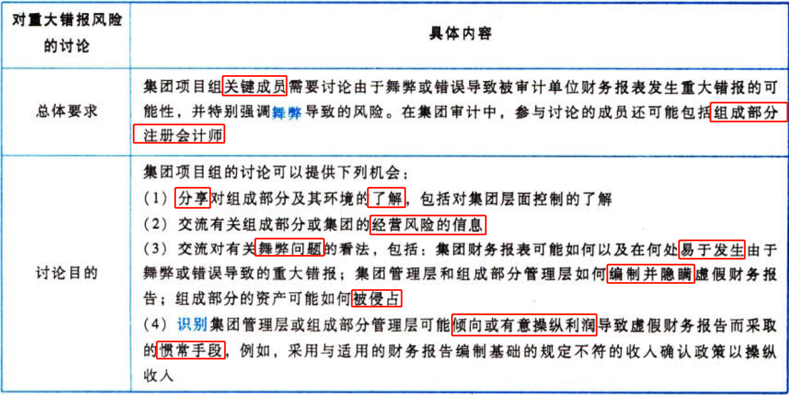

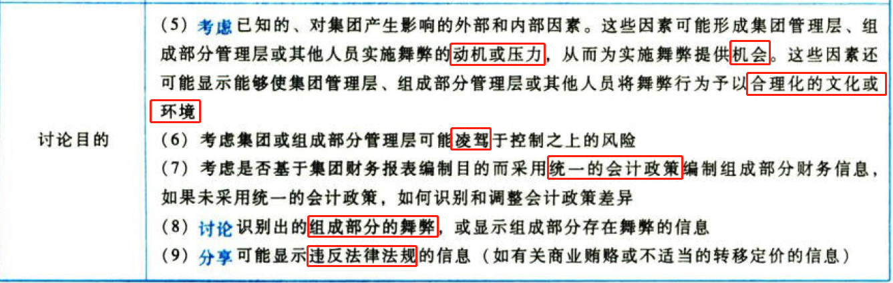

# 5. 了解组成部分注册会计师

## 5.8. ［考点］了解组成部份注册会计师:star: :star: :star: 

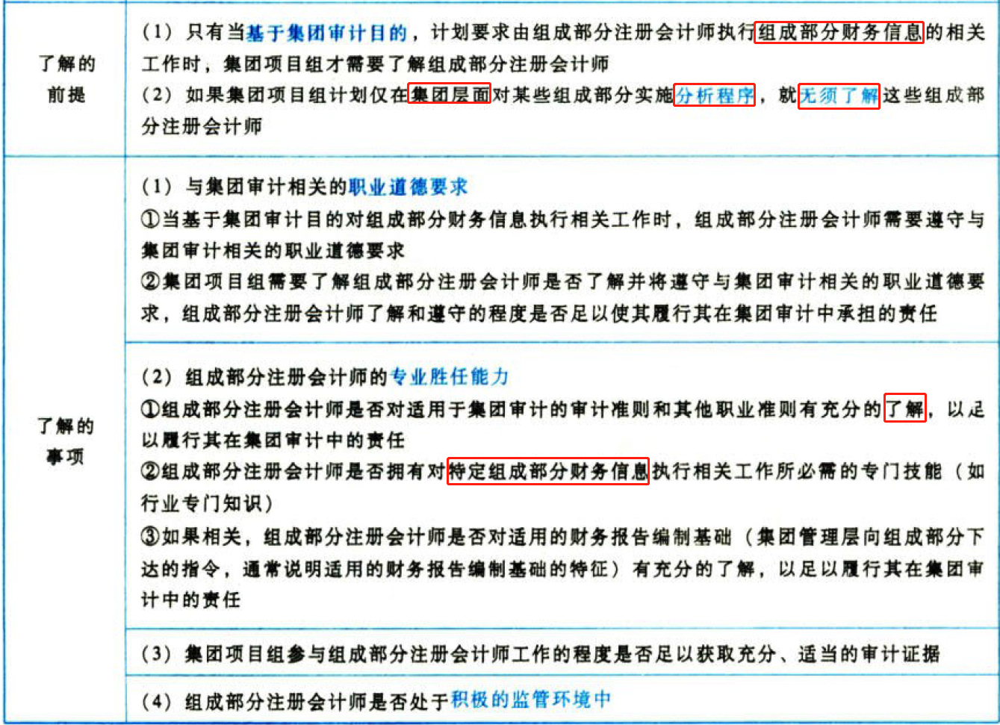

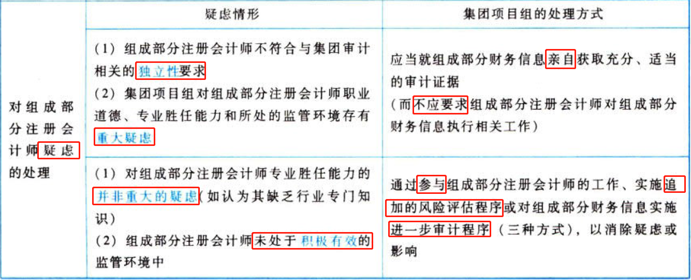

# 6. 重要性

## 6.9. ［考点］重要性:star: :star: :star: 

基于集团财务报表审计目的，集团财务报表整体的重要性、集团审计中适用于特定类别的交易、账户余额或披露的一个或多个重要性水平（如有）以及实际执行的重要性的关系如图16-1所示。

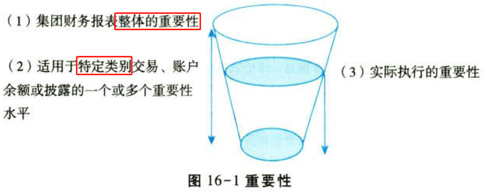

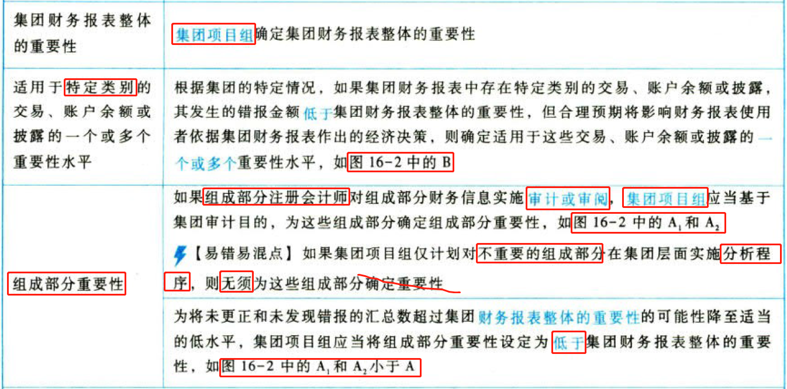

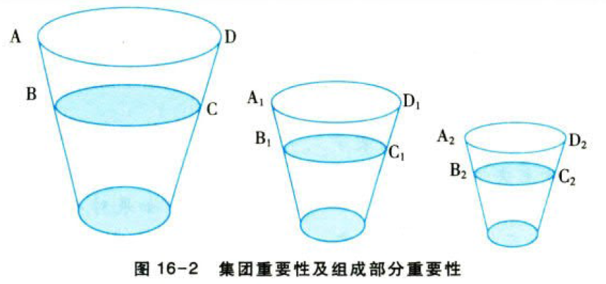

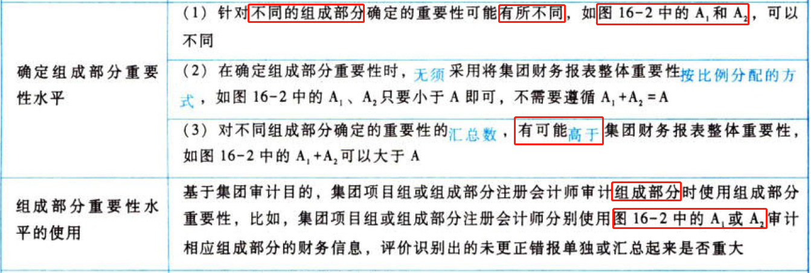

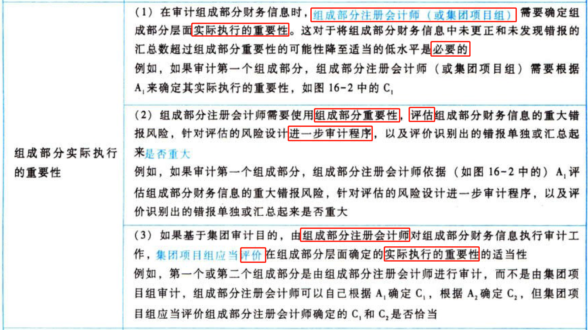

# 7. 针对评估的风险采取的应对措施

## 7.10. ［考点］针对评估的风险采取的应对措施:star: :star: :star: 

### 7.10.10. 对组成部分需执行的工作

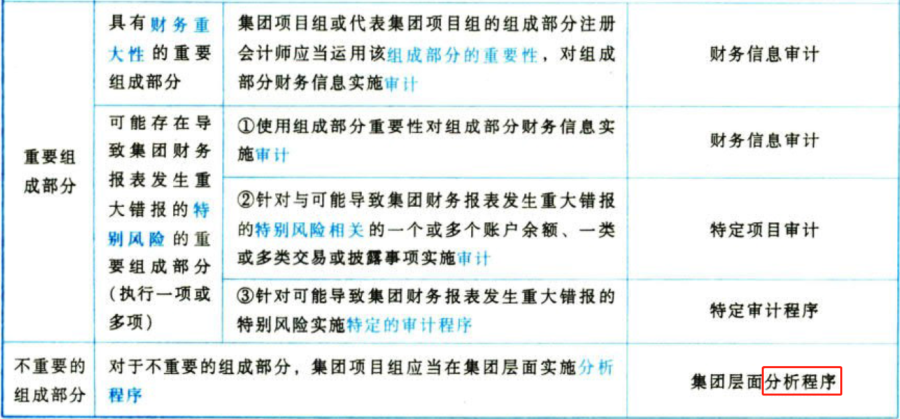

### 7.10.11. 已执行的工作仍不能提供充分、适当审计证据时的处理

如果集团项目组认为对重要组成部分财务信息执行的工作、对集团层面控制和合并过程执行的工作以及在集团层面实施的分析程序还不能获取形成集团审计意见所依据的充分、适当的审计证据，集团项目组应当选择某些不重要的组成部分，并对己选择的组成部分财务信息亲自执行或由代表集团项目组的组成部分注册会计师执行下列一项或多项工作：

（1）使用组成部分重要性对组成部分财务信息实施审计；

（2）对一个或多个账户余额、一类或多类交易或披露实施审计；

（3）使用组成部分重要性对组成部分财务信息实施审阅；

（4）实施特定程序。

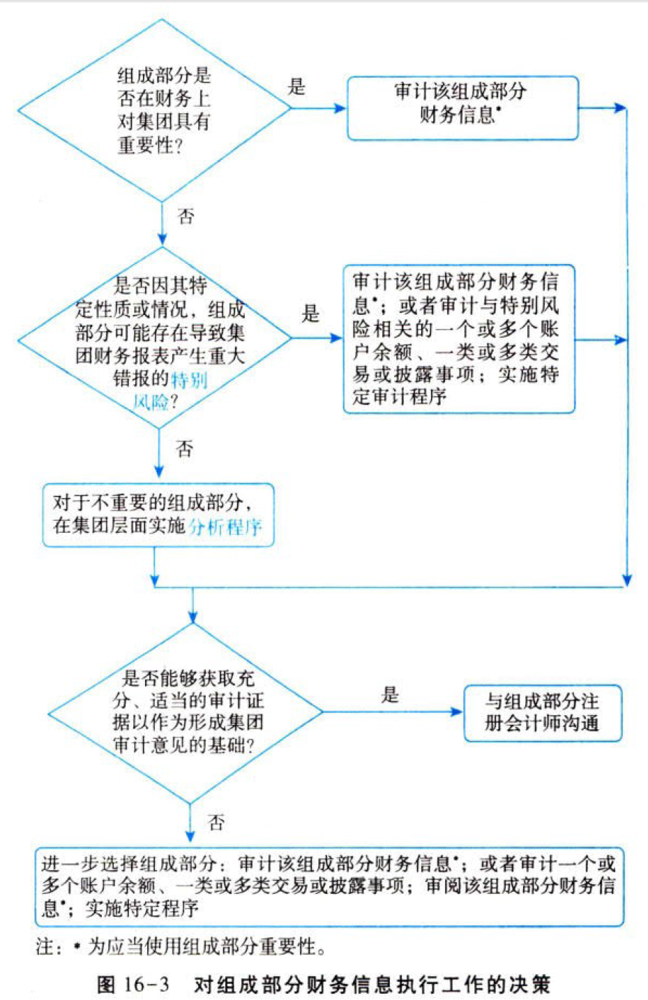

### 7.10.12. 参与组成部分注册会计师的工作

（1）参与组成部分注册会计师实施的风险评估程序。

如果组成部分注册会计师对重要组成部分财务信息执行审计，集团项目组应均参与组成部分注册会计师实施的风险评估程序，以识别导致集团财务报表发生重大错报的特别风险。

集团项目组参与的性质、时间安排和范围受其对组成部分注册会计师所了解情况的影响，但至少应当包括（两个讨论，一个复核）：

①与组成部分注册会计师或组成部分管理层讨论对集团而言重要的组成部分业务活动；

②与组成部分注册会计师讨论由于舞弊或错误导致组成部分财务信息发生重大错报的可能性；

③复核组成部分注册会计师对识别出的导致集团财务报表发生重大错报的特别风险形成的审计工作底稿。审计工作底稿可以采用备忘录的形式，反映组成部分注册会计师针对识别出的特别风险得出的结论。

（2）针对特别风险的进一步审计程序。

如果在由组成部分注册会计师执行相关工作的组成部分内，识别出导致集团财务报表发生重大错报的特别风险，集团项目组应当评价针对识别出的特别风险拟实施的进一步审计程序的恰当性。根据对组成部分注册会计师的了解，集团项目组应当确定是否有必要参与进一步审计程序。可能影响集团项目组参与组成部分注册会计师工作的因素包括：

①组成部分的重要程度；

②识别出的导致集团财务报表发生重大错报的特别风险；

③集团项目组对组成部分注册会计师的了解。

### 7.10.13. 参与组成部分注册会计师工作的方式

集团项目组参与组成部分注册会计师工作的方式，可能取决于集团项目组对组成部分注册会计师的了解。这些方式可能还包括：

（1）与组成部分管理层或组成部分注册会计师会谈，获取对组成部分及其环境的了解。

（2）复核组成部分注册会计师的总体审计策略和具体审计计划。

（3）实施风险评估程序，识别和评估组成部分层面的重大错报风险。集团项目组可以单独或与组成部分注册会计师共同实施这类程序。

（4）设计和实施进一步审计程序。集团项目组可以单独或与组成部分注册会计师共同设计和实施这类程序。

（5）参加组成部分注册会计师与组成部分管理层的总结会议和其他重要会议。

（6）符合组成部分注册会计师的审计工作底稿的其他相关部分。

# 8. 合并过程

## 8.11. ［考点］了解集团层面的控制和合并过程:star: 

### 8.11.14. 总体要求

集团项目组应当了解集团层面的控制和合并过程，包括集团管理层向组成部分下达的指令。

### 8.11.15. 测试集团层面控制

如果对合并过程执行工作的性质、时间安排和范围基于预期集团层面控制有效运行，，或者仅实施实质性程序不能提供认定层次的充分、适当的审计证据，集团项目组应当亲自测试或要求组成部分注册会计师代为测试集团层面控制运行的有效性。

### 8.11.16. 进一步审计程序

集团项目组应当针对合并过程设计和实施进一步审计程序，以应对评估的、由合并过程导致的集团财务报表发生重大错报的风险。设计和实施的进一步审计程序应当包括评价所有组成部分是否均已包括在集团财务报表中。

### 8.11.17. 评价合并调整和重分类事项

（1）评价要求。

集团项目组应当评价合并调整和重分类事项的适当性、完整性和准确性，并评价是否存在舞弊风险因素或可能存在管理层偏向的迹象。

（2）评价事项。

合并过程可能需要对集团财务报表中列报的金额作出调整，这类调整不经过常规交易处理系统，可能不会受到针对其他财务信息的控制的约束。集团项目组对这类调整的适当性、完整性和准确性的评价可能包括：

①评价重大调整是否恰当反映了相关事项和交易；

②确定重大调整是否得到集团管理层和组成部分管理层（如适用）的正确计算、处理和授权；

③确定重大调整是否有适当的证据支持并得到充分的记录；

④检查集团内部交易、未实现内部交易损益以及集团内部往来余额是否核对一致并抵销。

# 9. 与组成部分注册会计师的沟通

## 9.12. ［考点］与组成部分注册会计师的沟通:star: :star: 

### 9.12.18. 集团项目组向组成部分注册会计师的通报

### 9.12.19. 组成部分注册会计师向集团项目组沟通的事项

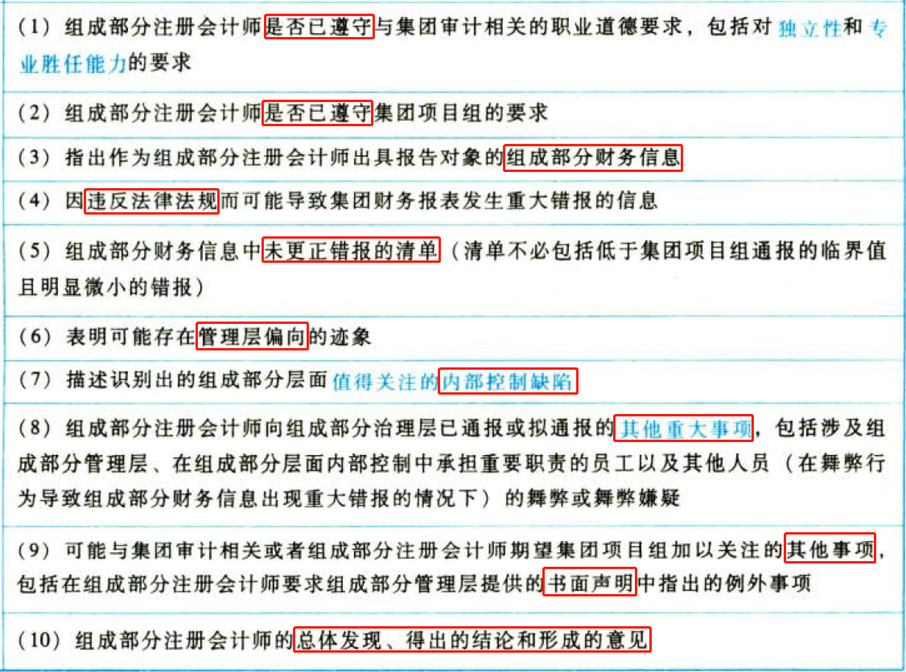

### 9.12.20. 集团项目组应当评价与组成部分注册会计师的沟通

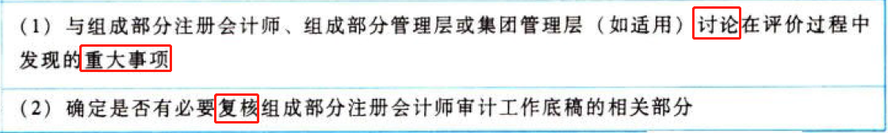

# 10. 评价审计证据的充分性和适当性

## 10.13. ［考点］评价审计证据:star: :star: 

### 10.13.21. 评价是否获取充分、适当的审计证据

集团项目组应当评价，通过对合并过程实施的审计程序以及由集团项目组和组成部分注册会计师对组成部分财务信息执行的工作，是否已获取充分、适当的审计证据，作为形成集团审计意见的基础。

### 10.13.22. 未能获取充分适当的审计证据应实施的程序

（1）组成部分注册会计师实施追加的程序。

如果认为未能获取充分、适当的审计证据作为形成集团审计意见的基础，集团项目组可以要求组成部分注册会计师对组成部分财务信息实施追加的程序。

（2）集团项目组可以直接对组成部分财务信息实施程序。

如果组成部分注册会计师对组成部分财务信息实施追加的程序不可行，集团项目组可以直接对组成部分财务信息实施程序。

### 10.13.23. 确定集团财务报表整体是否存在重大错报

（1）集团项目合伙人应当评价未更正错报（无论该错报是由集团项目组识别出的还是由组成部分注册会计师告知的）和未能获取充分、适当的审计证据的情况下对集团审计意见的影响。

（2）集团项目合伙人对错报（无论该错报是由集团项目组识别还是由组成部分注册会计师告知）的汇总影响的评价，能够使其确定集团财务报表整体是否存在重大错报。

# 11. 与集团管理层和集团治理层的沟通

## 11.14. ［考点］与集团管理层和集团治理层的沟通:star: :star: :star: 

### 11.14.24. 与集团管理层的沟通

（1）总体要求。

集团项目组应当按照《中国注册会计师审计准则第1152号——向治理层和管理层通报内部控制缺陷》的规定，确定哪些识别出的内部控制缺陷需要向集团治理层和集团管理层通报。

（2）确定通报内容。

集团项目组在确定向集团治理层和集团管理层通报的内容时，应当考虑：

①集团项目组识别出的集团层面内部控制缺陷。

②集团项目组识别出的组成部分层面内部控制缺陷。

③组成部分注册会计师提请集团项目组关注的内部控制缺陷。

### 11.14.25. 与集团治理层的沟通

（1）总体要求。

①与集团治理层的沟通可以在集团审计过程中的不同时点进行。

②集团项目组向集团治理层通报的事项，可能包括组成部分注册会计师提请集团项目组关注，并且集团项目组根据职业判断认为与集团治理层责任相关的重大事项。

（2）沟通的事项。

除《中国注册会计师审计准则第1151号——与治理层的沟通》和其他审计准则要求沟通的事项外，集团项目组还应当与集团治理层沟通的事项包括：

①对组成部分财务信息拟执行工作的类型的概述。

②在组成部分注册会计师对重要组成部分财务信息拟执行的工作中，集团项目组计划参与其工作的性质的概述。

③对组成部分注册会计师的工作作出的评价，引起集团项目组对其工作质量产生疑虑的情形。

④集团审计受到的限制，如集团项目组接触某些信息受到的限制。

⑤涉及集团管理层、组成部分管理层、在集团层面控制中承担重要职责的员工以及其他人员（在舞弊行为导致集团财务报表出现重大错报的情况下）的舞弊或舞弊嫌疑。

# 12. 总结

End。
