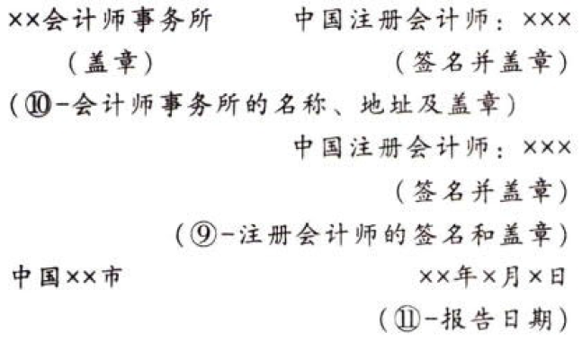

内部控制审计报告（①－标题）

xx股份有限公司全体股东：（②－收件人）

按照《企业内部控制审计指引》及中国注册会计师执业准则的相关要求，我们审计了xx股份有限公司（以下简称xx公司）xx年xx月xx日的财务报告内部控制的有效性。（③－引言段）

# 1. 一、企业对内部控制的责任

接照《企业内部控制基本规范》《企业内部控制应用指引》《企业内部控制评价指引》的规定，建立健全和有效实施内部控制，并评价其有效性是xx公司董事会的责任。（④－企业对内部控制的责任段）

# 2. 二、注册会计师的责任

我们的责任是在实施审计工作的基础上，对财务报告内部控制的有效性发表审计意见，并对注意到的非财务报告内部控制的重大缺陷进行披露。（⑤－注册会计师的责任段）

# 3. 三、内部控制的固有局限性

内部控制具有固有局限性，存在不能防止和发现错报的可能性。此外，由于情况的变化可能导致内部控制变得不恰当，或对控制政策和程序遵循的程度降低，根据内部控制审计结果推测未来内部控制的有效性具有一定风险。（⑥－内部控制固有局限性的说明段）

# 4. 四、财务报告内部控制审计意见

我们认为，xx公司于xx年xx月xx日按照《企业内部控制基本规范》和相关规定在所有重大方面保持了有效的财务报告内部控制。（⑦－财务报告内部控制审计意见段）

# 5. 五、非财务报告内部控制的重大缺陷（⑧－非财务报告内部控制重大缺陷描述段）

在内部控制审计过程中，我们注意到xx公司的非财务报告内部控制存在重大缺陷［描述该缺陷的性质及其对实现相关控制目标的影响程度］。由于存在上述重大缺陷，我们提醒本报告使用者注意相关风险。需要指出的是，我们并不对xx公司的非财务报告内部控制发表意见或提供保证。本段内容不影响对财务报告内部控制有效性发表的审计意见。

