C15注册会计师利用他人的工作

# 1. 利用内部审计工作

本节内容除了理解内部审计与注册会计师的关系外，重点是“利用内部的审计工作”和“注册会计师利用内部审计人员提供直接协助”，如图15-1所示。

## 1.1. ［考点一］内部审计与注册会计师的关系:star: :star: 

### 1.1.1. 相关概念

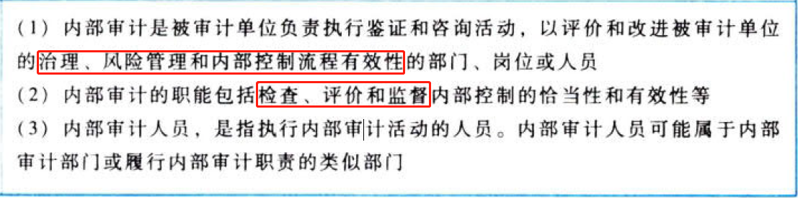

### 1.1.2. 内部审计的目标

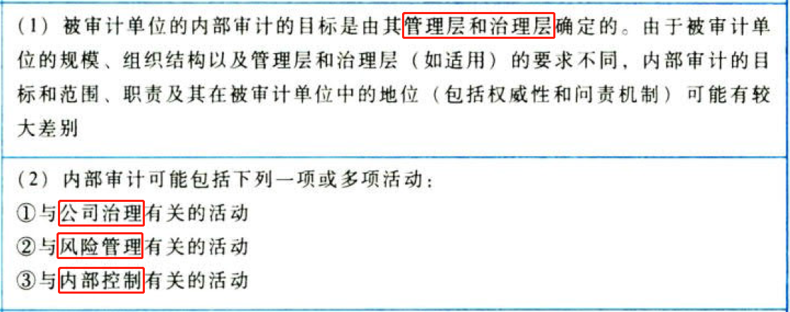

### 1.1.3. 利用内部审计工作的原因

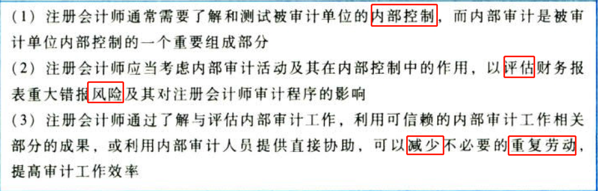

### 1.1.4. 利用内部审计工作的环节

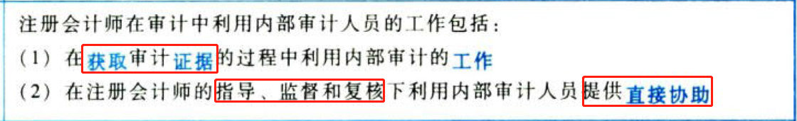

### 1.1.5. 内部审计与注册会计师审计的联系

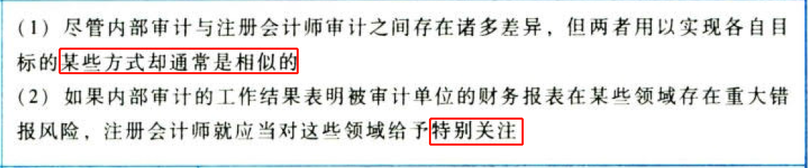

### 1.1.6. 利用内部审计工作与注册会计师的责任

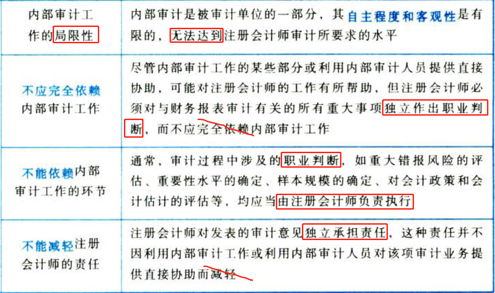

## 1.2. ［考点二］确定是否能够利用内部审计工作:star: :star: :star: 

本考点和［考点三］与后面的［考点五］是对应关系。本考点的结构如图15-2所示。

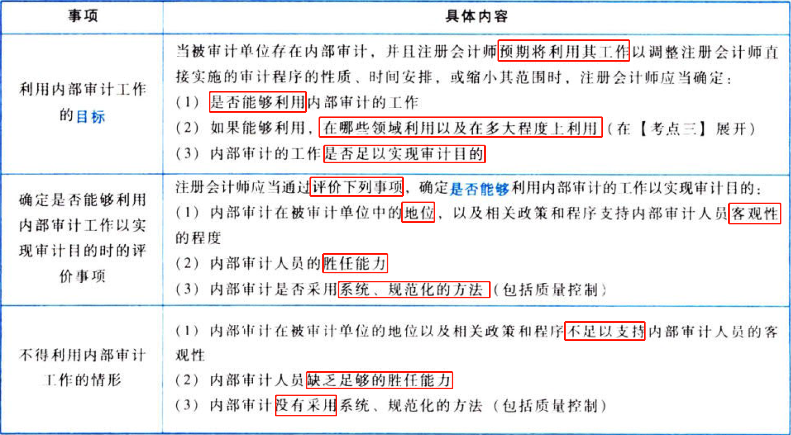

## 1.3. ［考点三］确定在哪些领域利用以及在多大程度上利用内部审计的工作:star: :star: :star: 

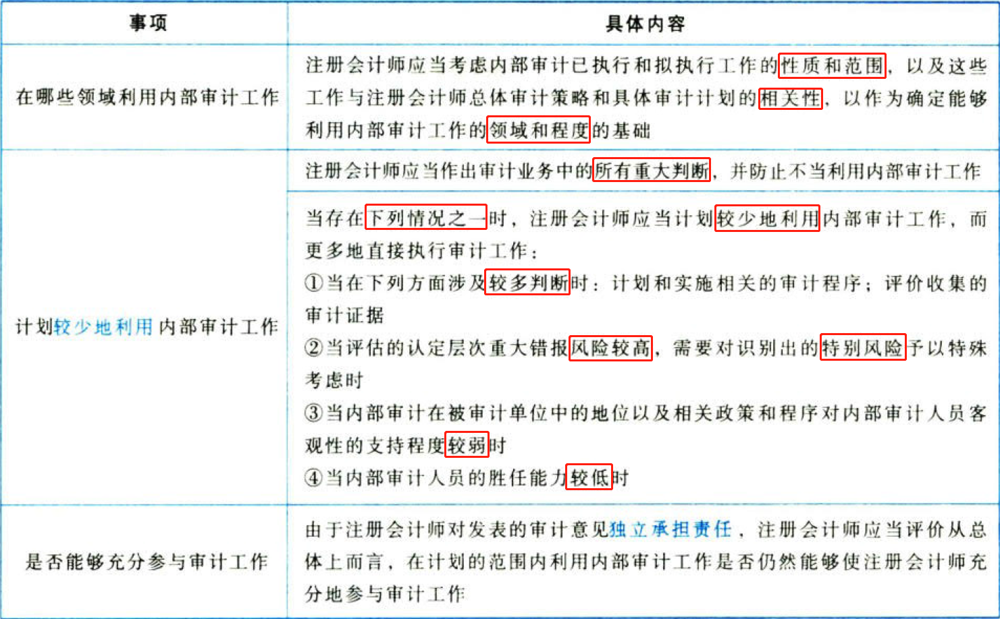

## 1.4. ［考点四］如何利用内部审计工作:star: :star: :star: 

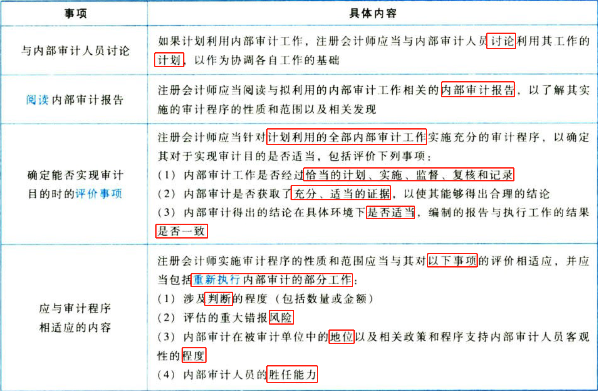

## 1.5. ［考点五］确定是否利用、在哪些领域利用以及在多大程度上利用内部审计人员提供直接协助:star: :star: :star: 

### 1.5.7. 利用内部审计人员提供直接协助的目标

当被审计单位存在内部审计，并且注册会计师预期将利用内部审计人员提供直接协助时，注册会计师应当：

（1）确定是否能够利用内部审计人员提供直接协助；

（2）如果能够利用，确定在哪些领域利用以及在多大程度上利用；

（3）如果拟利用内部审计人员提供直接协助，适当地指导、监督和复核其工作。

### 1.5.8. 确定是否利用内部审计人员提供直接协助时的评价事项

（1）如果法律法规不禁止利用内部审计人员提供直接协助，并且注册会计师计划利用内部审计人员在审计中提供直接协助，注册会计师应当评价是否存在对内部审计人员客观性的不利影响及其严重程度，以及提供直接协助的内部审计人员的胜任能力

（2）注册会计师在评价是否存在对内部审计人员客观性的不利影响及其严重程度时，应当包括询问内部审计人员可能对其客观性产生不利影响的利益和关系。

### 1.5.9. 不得利用内部审计人员提供直接协助的情形

当存在下列情形之一时，注册会计师不得利用内部审计人员提供直接协助：

（1）存在对内部审计人员客观性的重大不利影响；

（2）内部审计人员对拟执行的工作缺乏足够的胜任能力。

注册会计师不得利用内部审计人员提供直接协助以实施具有下列特征的程序：

（1）在审计中涉及作出重大判断；

（2）涉及较高的重大错报风险，在实施相关审计程序或评价收集的审计证据时需要作出较多的判断；

（3）涉及内部审计人员已经参与并且已经或将要由内部审计向管理层或治理层报告的工作；

（4）涉及注册会计师按照规定就内部审计，以及利用内部审计工作或利用内部审计人员提供直接协助作出的决策。

### 1.5.10. 对内部审计人员进行指导、监督和复核

在确定可能分配给内部审计人员的工作的性质和范围，以及根据具体情况对内部审计人员进行指导、监督和复核的性质、时间安排和范围时，注册会计师应当考虑下列方面：

（1）在计划和实施相关审计程序以及评价收集的审计证据时，涉及判断的程度（包括数量或金额）；

（2）评估的重大错报风险；

（3）针对拟提供直接协助的内部审计人员，注册会计师关于是否存在对其客观性的不利影响及其严重程度的评价结果，以及关于其胜任能力的评价结果。

### 1.5.11. 与治理层沟通

在恰当评价是否利用以及在多大程度上利用内部审计人员在审计中提供直接协助后，注册会计师在按照《中国注册会计师审计准则第1151号——与治理层的沟通》的规定与治理层沟通计划的审计范围和时间安排的总体情况时，应当沟通拟利用内部审计人员提供直接协助的性质和范围，以使双方就在业务的具体情形下并未过度利用内部审计人员提供直接协助达成共识。

### 1.5.12. 是否能够充分参与审计工作

由于注册会计师对发表的审计意见独立承担责任，注册会计师应当评价在计划的范围内利用内部审计人员提供直接协助，连同对内部审计工作的利用，从总体上而言，是否仍然能够使注册会计师充分地参与审计工作。

## 1.6. ［考点六］如何利用内部审计人员提供直接协助:star: :star: 

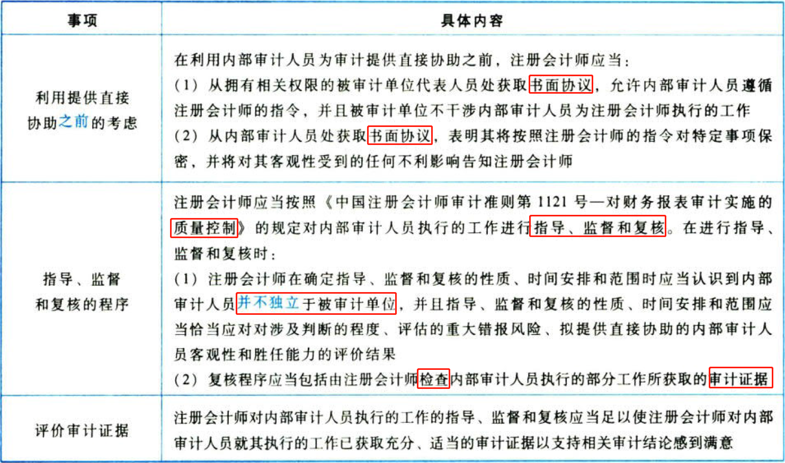

## 1.7. ［考点七］审计工作底稿记录要求:star: :star: 

注册会计师在审计过程中利用内部审计工作应当记录在审计工作底稿中，归纳如下表。

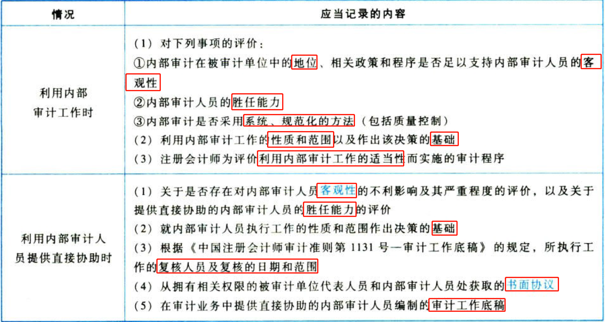

# 2. 利用专家的工作

本节内容的学习可以参考图15-3的内容框架，其中重点是评价专家工作的事项。

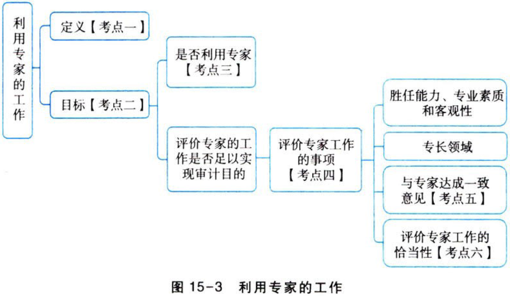

## 2.8. ［考点一］专家的定义:star: :star: 

专家包括注册会计师的专家和管理层的专家，归纳如下表。

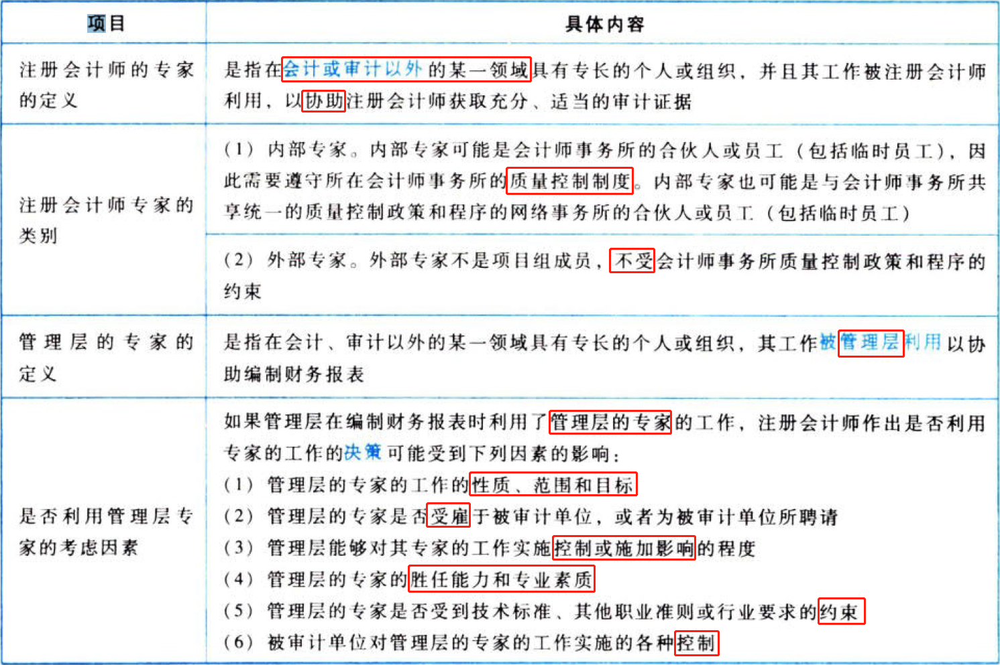

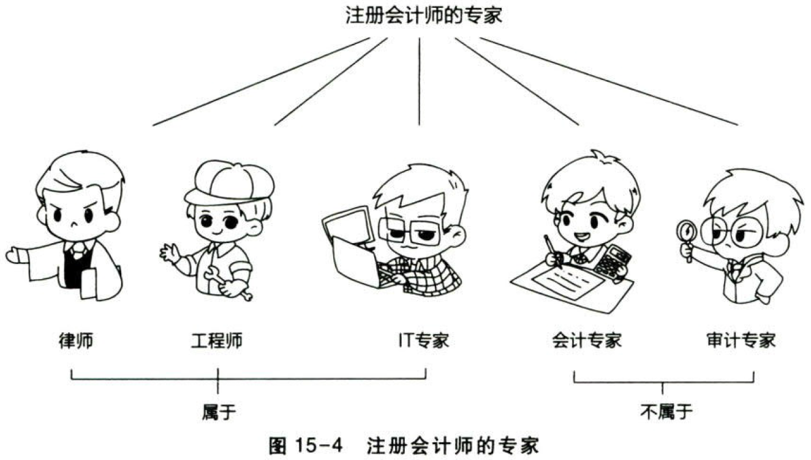

## 2.9. ［考点二］注册会计师（利用专家工作）的目标:star: 

注册会计师利用专家工作的目标是：

（1）确定是否利用专家的工作（目标之一，在［考点三］展开）。

（2）如果利用专家的工作，专家的工作是否足以实现审计目的（目标之二，在［考点四］、［考点五］、［考点六］展开）。

## 2.10. ［考点三］确定是否利用专家的工作:star: :star: 

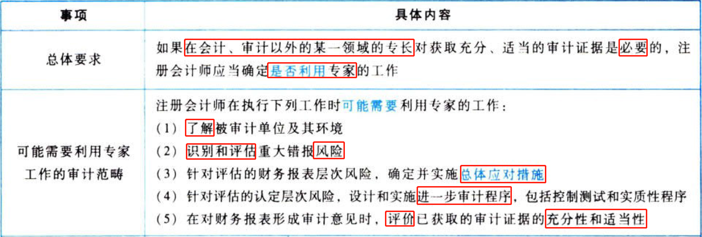

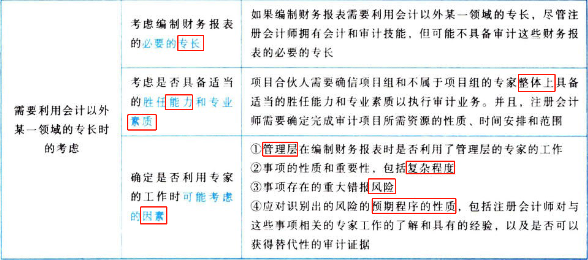

## 2.11. ［考点四］评价专家工作的事顶:star: :star: :star: 

如图15-5所示，注册会计师在某些领域利用专家的工作时，应当评价以上四个影响事项。具体包括：

### 2.11.13. 评价专家的胜任能力、专业素质和客观性(1/4)

注册会计师应当评价专家是否具有实现审计目的所必需的胜任能力、专业素质和客观性。

（1）专家的胜任能力与其专长的性质和水平有关。

（2）专家的专业素质与在业务的具体情况下对胜任能力的发挥相关。

（3）专家的客观性与其偏见、利益冲突及其他可能影响其职业判断或商业判断的因素相关。

（4）在评价外部专家的客观性时，注册会计师应当询问可能对外部专家客观性产生不利影响的利益和关系。

### 2.11.14. 了解专家的专长领域(2/4)

（1）总体要求。

①注册会计师应当充分了解专家的专长领域，以能够：为了实现审计目的，确定专家工作的性质、范围和目标；评价专家的工作是否足以实现审计目的。

②注册会计师可以凭借审计工作经验或通过与专家及其他有关人士进行讨论的方式，了解专家的专长领域。

（2）对专家的专长领域的了解事项。

注册会计师对专家的专长领域的了解可能包括下列方面：

①与审计相关的、管理层的专家专长领域的进一步细分信息。

②职业准则或其他准则以及法律法规是否适用。

③专家使用哪些假设和方法（包括专家使用的模型，如适用），及其在专家的专长领域是否得到普遍认可，对实现财务报告目的是否适当。

④专家使用的内外部数据或信息的性质。

## 2.12. ［考点五］与专家达成一致意见（★俞★）(3/4)

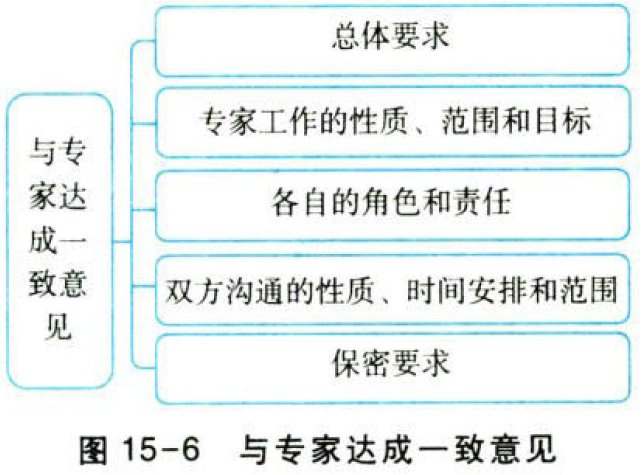

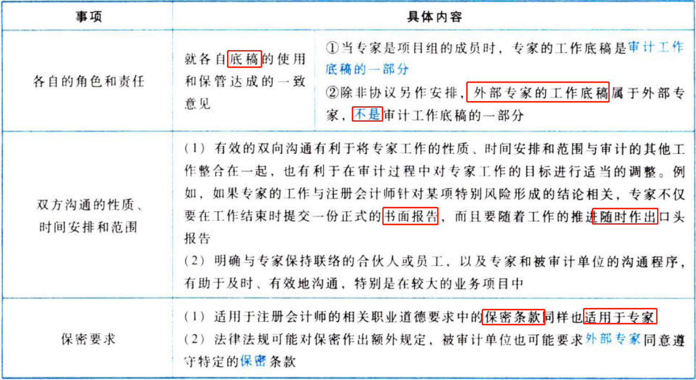

## 2.13. ［考点六］评价专家工作的恰当性:star: :star: :star: (4/4)

### 2.13.15. 特定程序

注册会计师评价专家工作是否足以实现审计目的所实施的可能包括的特定程序：

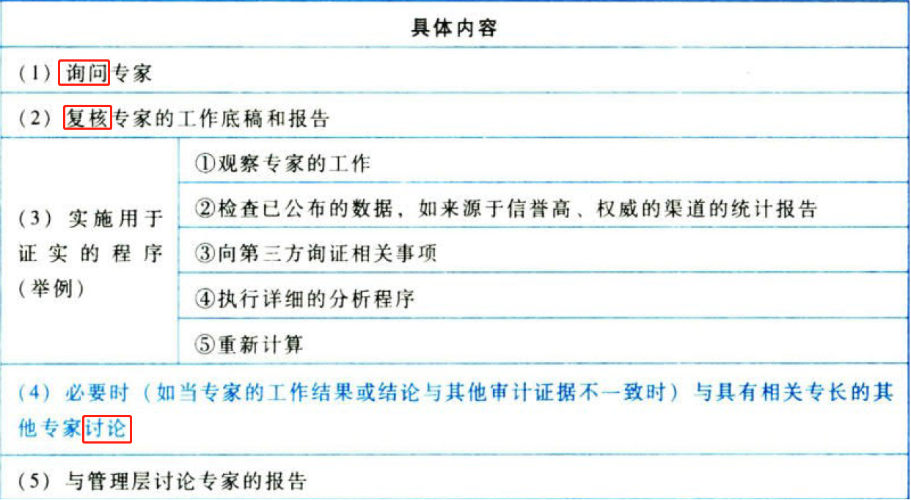

### 2.13.16. 评价事项

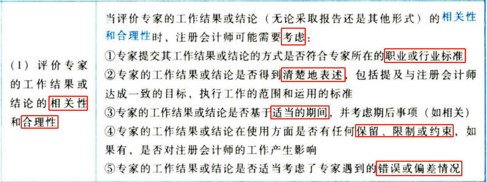

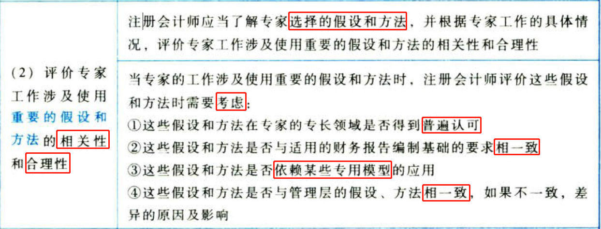

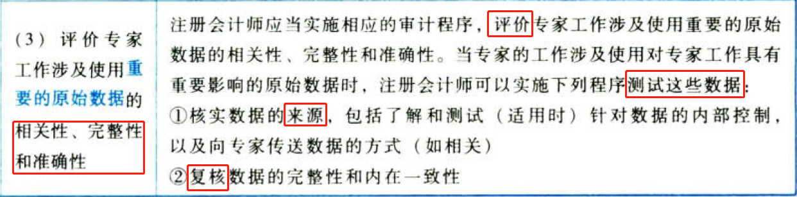

### 2.13.17. 评价专家工作结果为不恰当时的措施

### 2.13.18. 评价专家工作的审计程序

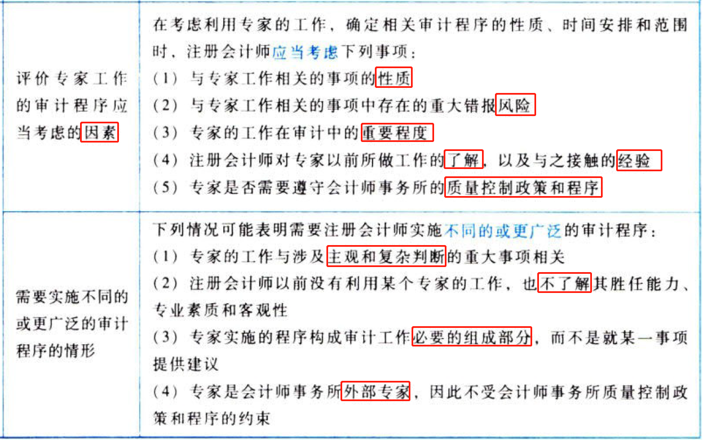

# 3. 总结

End。
