C22职业道德基本原则和概念框架

# 1. 职业道德基本原则

## 1.1. ［考点一］职业道德基本原则:star: :star: 

按照中国注册会计师职业道德守则，职业道德基本原则包括诚信、独立性、客观和公正、专业胜任能力和应有的关注、保密、良好职业行为。

## 1.2. ［考点二］独立性:star: :star: 

独立性是职业道德基本原则中最重要的原则，归纳如下表。

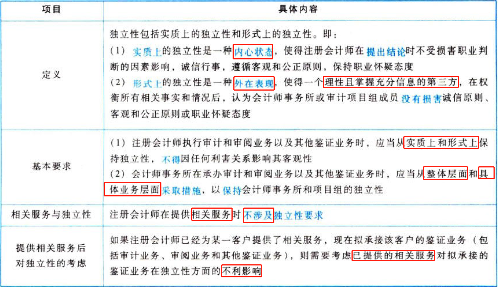

## 1.3. ［考点三］保密:star: :star: 

注册会计师在职业活动中应当对其获知的审计客户的涉密信息保密，警惕无意泄密，具体要求归纳如下表。

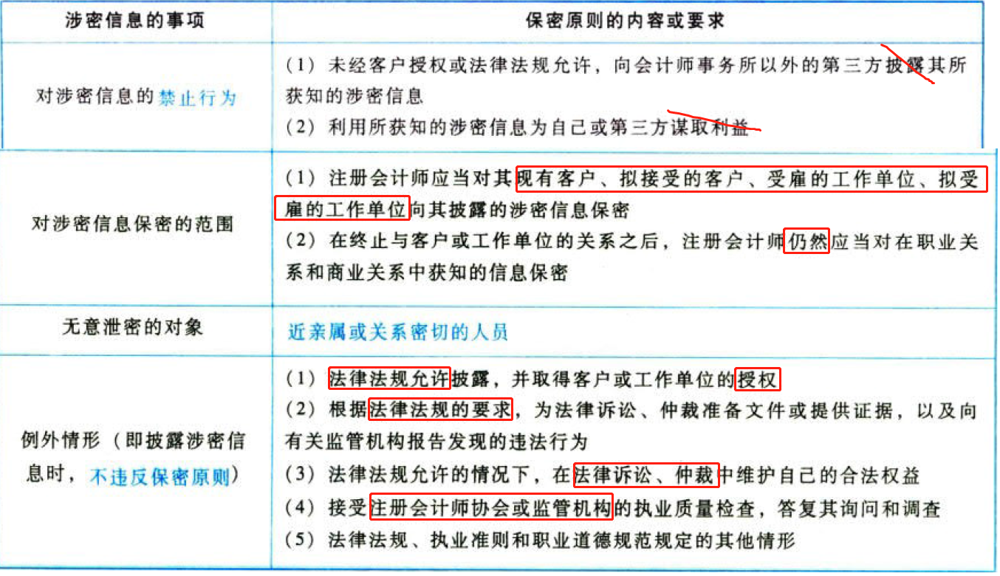

## 1.4. ［考点四］近亲属图解示例:star: :star: 

下面以ABC会计师事务所审计项目合伙人“老王”为例，结合注册会计师审计实务背景，明确注册会计师近亲属（主要近亲属和其他近亲属）的具体所指。主要近亲属用A表示，其他近亲属用B表示，如图22-1所示。

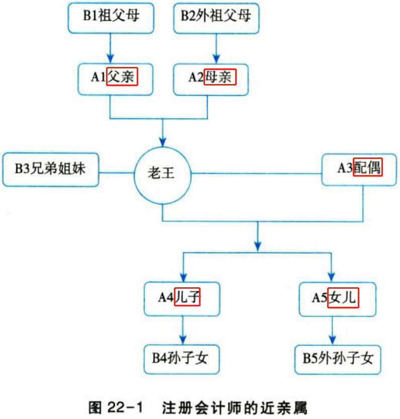

注册会计师的主要近亲属是指其父母、配偶或子女。

注册会计师的其他近亲属是指其祖父母、外祖父母、兄弟姐妹、孙子女、外孙子女。

关于职业道德（或者独立性）的简答题是每年“恒考点”，在题目描述事项当中不可能不涉及到注册会计师近亲属的各种类别，被“出题专家”提及最多的是注册会计师的“父亲、母亲、妻子”。

# 2. 职业道德概念框架

## 2.5. ［考点］职业道德概念框架图解:star: 

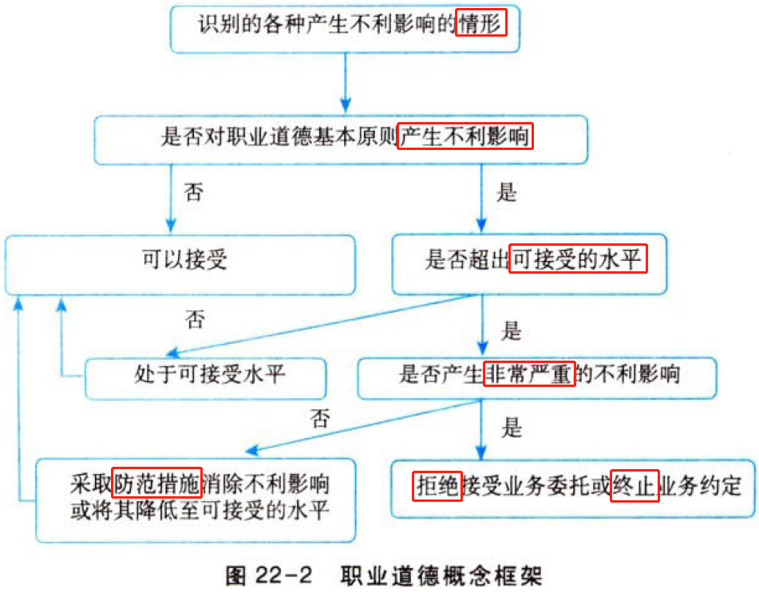

# 3. 注册会计师对职业道德概念框架的具体运用

## 3.6. ［考点一］可能对职业道德基本原则产生不利影响的因素:star: :star: :star: 

可能对职业道德基本原则产生不利影响的因素包括自身利益、自我评价、过度推介、密切关系、外在压力，具体情形归纳如下表。

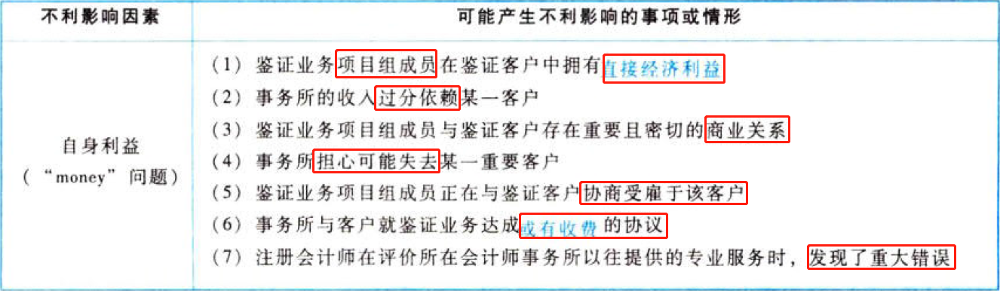

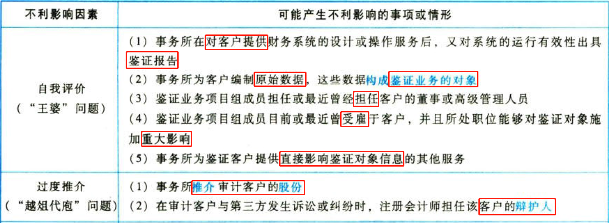

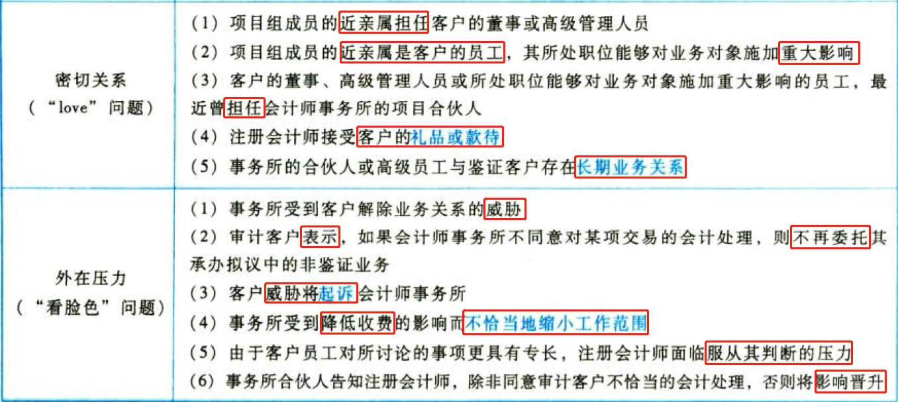

“自身利益、自我评价、过度推介、密切关系、外在压力”中的每一项由哪些具体情形导致，需要大家“死记硬背”并精准掌握，因为在每年关于“独立性”简答题答题时“无法回避”。

## 3.7. ［考点二］专业服务委托:star: 

专业服务委托包括接受客户关系、承接业务、客户变更委托三大不同环节，如下表所示。

### 3.7.1. 接受客户关系

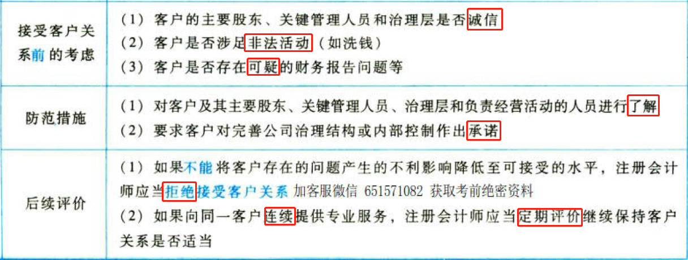

### 3.7.2. 承接业务

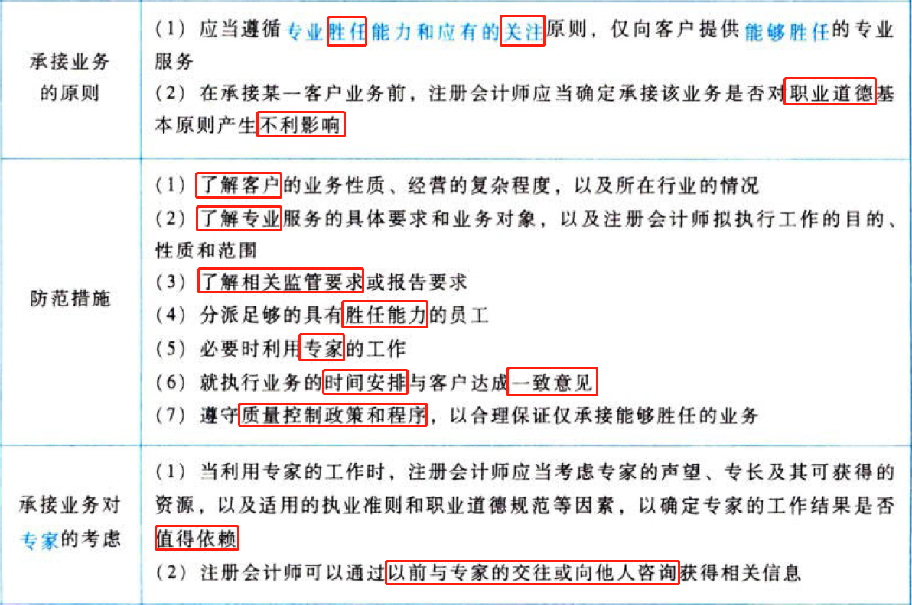

### 3.7.3. 客户变更委托

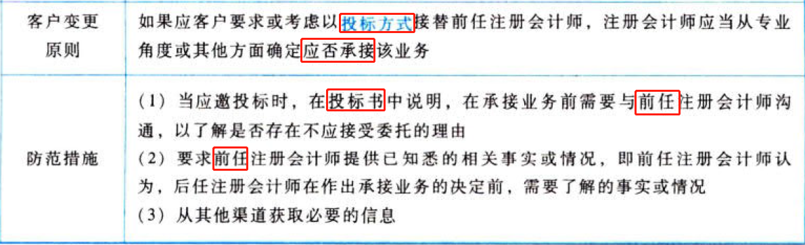

## 3.8. ［考点三］利益冲突:star: :star: 

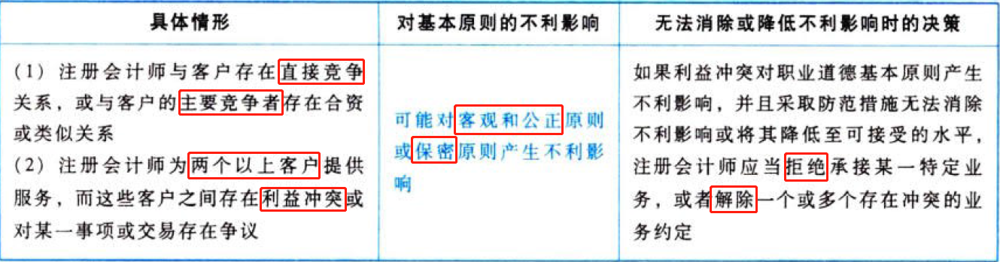

## 3.9. ［考点四］应客户的要求提供第二次意见:star: 

### 3.9.4. 定义

应客户要求提供第二次意见，是指某公司或实体不是注册会计师的现行客户，而该公司或实体要求注册会计师对前任注册会计师在运用会计、审计或其他准则或原则处理的有关情形和交易的情况提供第二次意见。

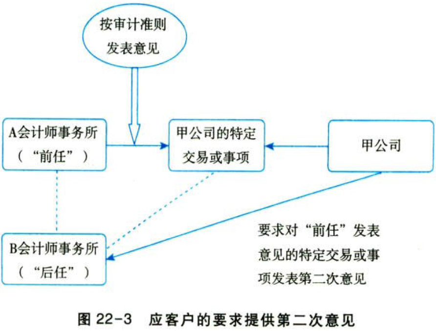

如图22-3所示，假设B会计师事务所（后任注册会计师）正在考虑是否承接对用公司特定交易或事项提供第二次意见，该特定交易或事项甲公司已经委托A会计师事务所（前任注册会计师）得出了结论，但是甲公司针对A会计师事务所提出的结论不满意。此时，作为提供第二次意见的B会计师事务所存在可能对专业胜任能力和应有的关注原则产生的不利影响，因为甲公司可能并没有将特定交易或事项的全部信息告诉8会计师事务所。

### 3.9.5. 评价不利影响以及防范措施

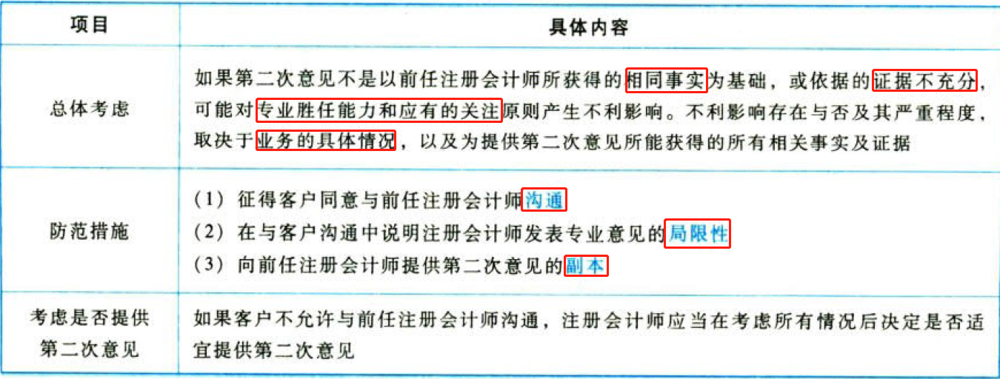

## 3.10. ［考点五］收费:star: :star: 

注册会计师行业中最主要的收费问题包括过低收费、或有收费、收取介绍费或佣金、支付介绍费，如下表所示。

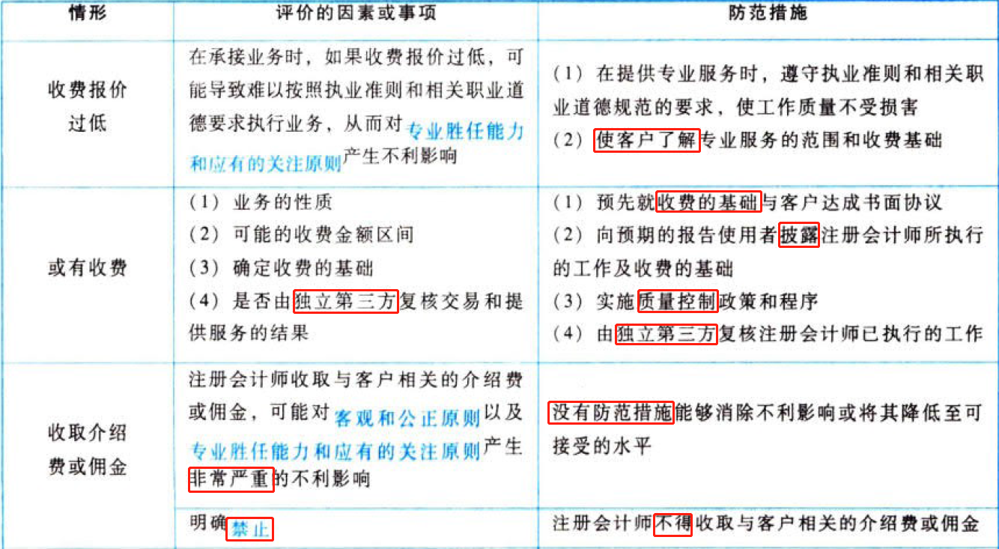

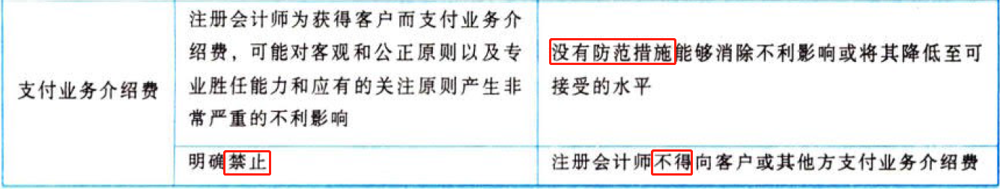

## 3.11. ［考点六］专业服务营销:star: 

注册会计师通过广告或其他营销方式招揽业务，可能对职业道德基本原则产生不利影响。职业道德守则明确了禁止行为，以及时招揽业务的考虑，如下表所示。

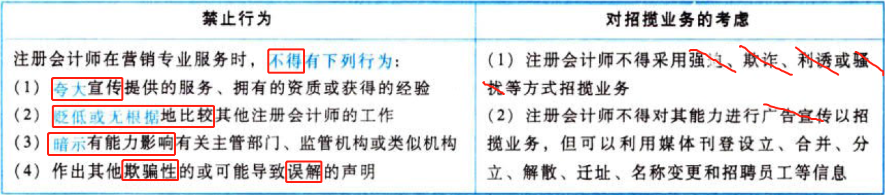

## 3.12. ［考点七］礼品和款待:star: :star: 

会计师事务所或审计项目组成员接受审计客户的礼品或款待，可能因自身利益和密切关系产生不利影响。具体情形，归纳如下表。

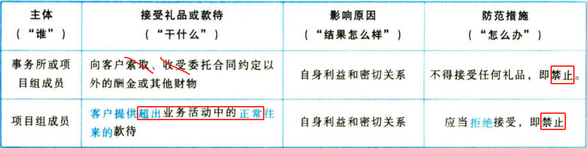

礼品和款待对独立性的不利影响，在教材23.8中再次明确规定。

# 4. 总结

End。
