C12货币资金的审计

# 1. 货币资金审计概述

## 1.1. ［考点一］了解货币资金的主要业务活动:star: :star: 

### 1.1.1. 现金管理

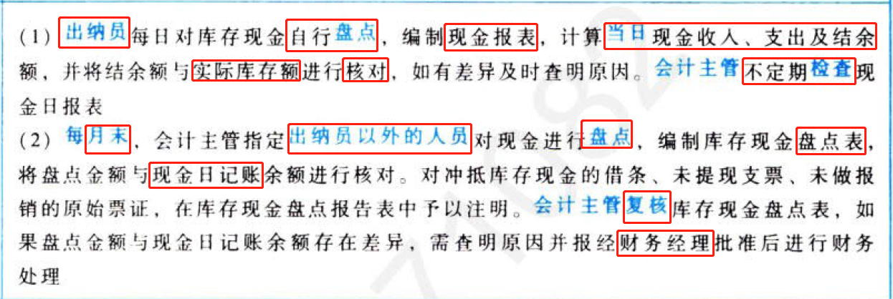

### 1.1.2. 银行存款管理

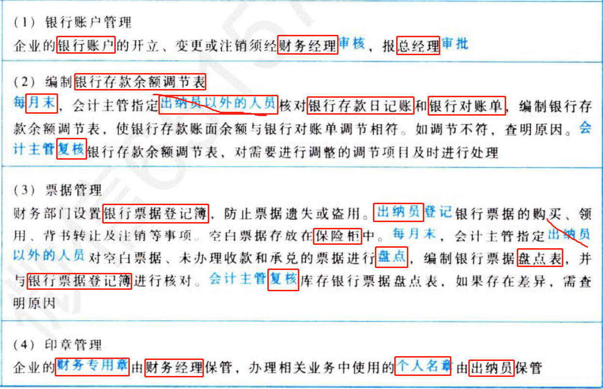

以上止务活动要点仅为列举，在实务中可能由于每个企业的货币资金管理方式或内部控制的不同而有所不同。

## 1.2. ［考点二］货币资金内部控制:star: :star: 

### 1.2.3. 岗位分工及授权批准

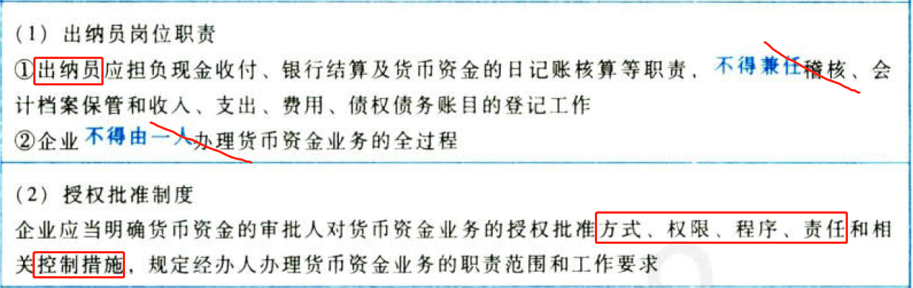

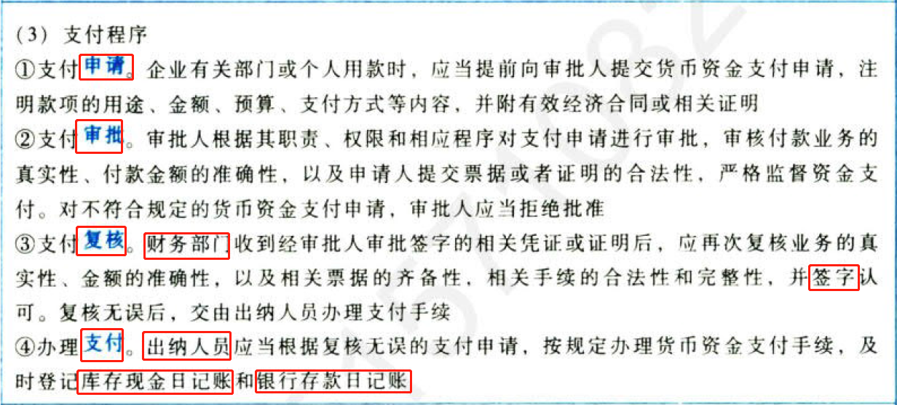

### 1.2.4. 现金和银行存款的管理

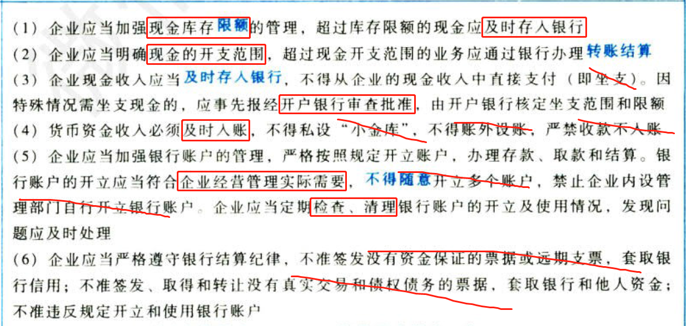

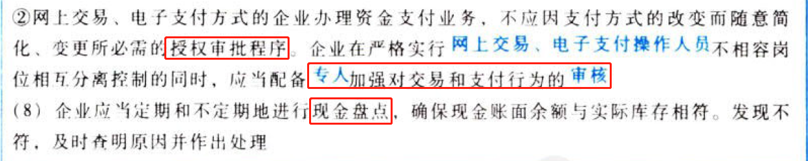

### 1.2.5. 票据管理

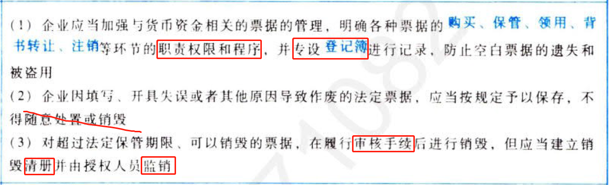

### 1.2.6. 印章管理

# 2. 货币资金的重大错报风险

## 2.3. ［考点］与货币资金相关的重大错报风险:star: 

货币资金业务交易、帐户余额和列报的认定层次的重大错报风险可能也括：

（1）被审计单位存在虚假的货币资金余额或交易，因而导致银行存款余额的存在或交易的发生存在重大错报风险。

（2）被审计单位存在大额的外币交易和余额，可能存在外币交易或余额未被准确记录的风险。例如，对于有外币现金或外币银行存款的被审计单位，企业有关外币交易的增减变动或年底余额可能因未采用正确的折算汇率而导致计价价错误（准确性、计价和分摊/准确性）。

（3）银行存款的期末收支存在大额的戳止性错误（截止）。例如，被审计单位期末存在金额重大且异常的银付企未付，企收银未收事项。

（4）被审计单位可能存在未能按照企业会计准则的规定对货币资金作出恰当披露的风险。例如，被审计单位期末持有使用受限制的大额银行存款，但在编制财务报表时未在财务报表附注中对其进行披露。

# 3. 测试货币资金的内部控制

## 3.4. ［考点一］库存现金的控制测试:star: :star: 

### 3.4.7. 现金付款的审批、复核与控制测试程序

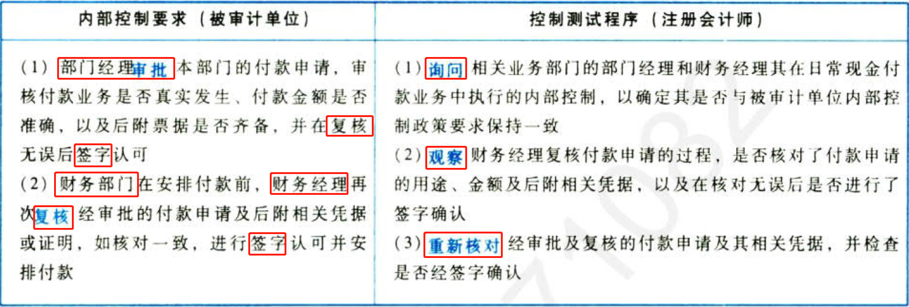

### 3.4.8. 现金盘点与控制测试程序

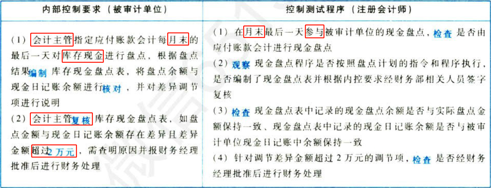

## 3.5. ［考点二］银行存款的控制测试:star: :star: 

### 3.5.9. 银行账户的开立、变更、注销与控制测试程序

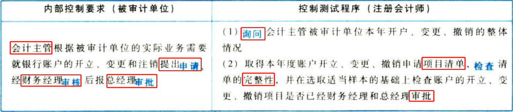

### 3.5.10. 银行付款的审批、复核与控制测试程序

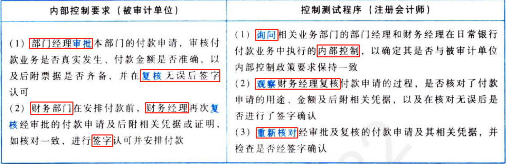

### 3.5.11. 编制银行存款余额调节表与控制测试程序

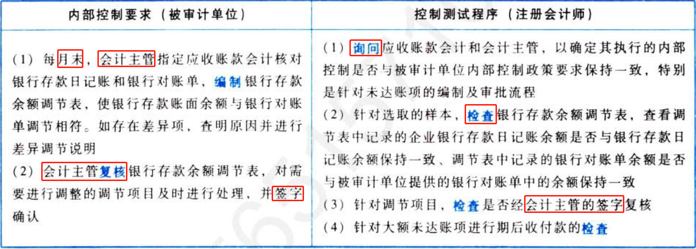

# 4. 货币资金的实质性程序

## 4.6. ［考点一］库存现金的审计目标与实质性程序:star: :star: 

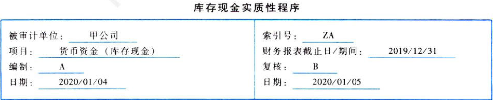

### 4.6.12. 审计目标与认定对应关系表

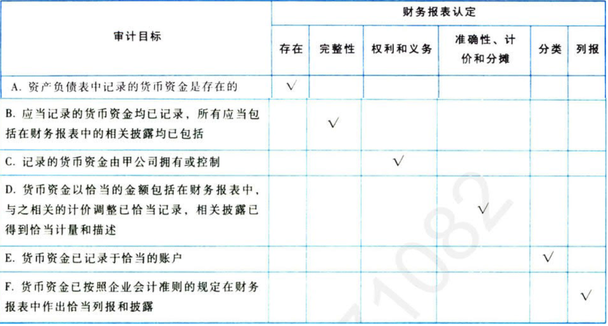

### 4.6.13. 审计目标与审计程序对应关系表

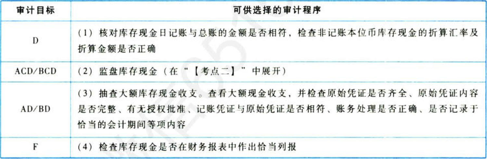

## 4.7. ［考点二］监盘库存现金:star: :star: :star: 

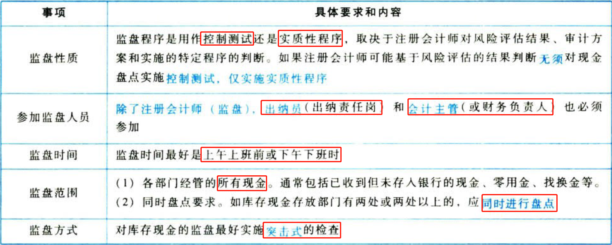

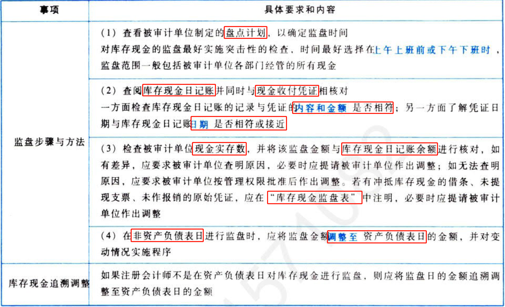

## 4.8. ［考点三］银行存款的审计目标与实质性程序:star: :star: 

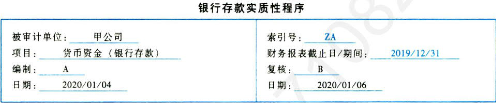

### 4.8.14. 审计目标与认定对应关系表

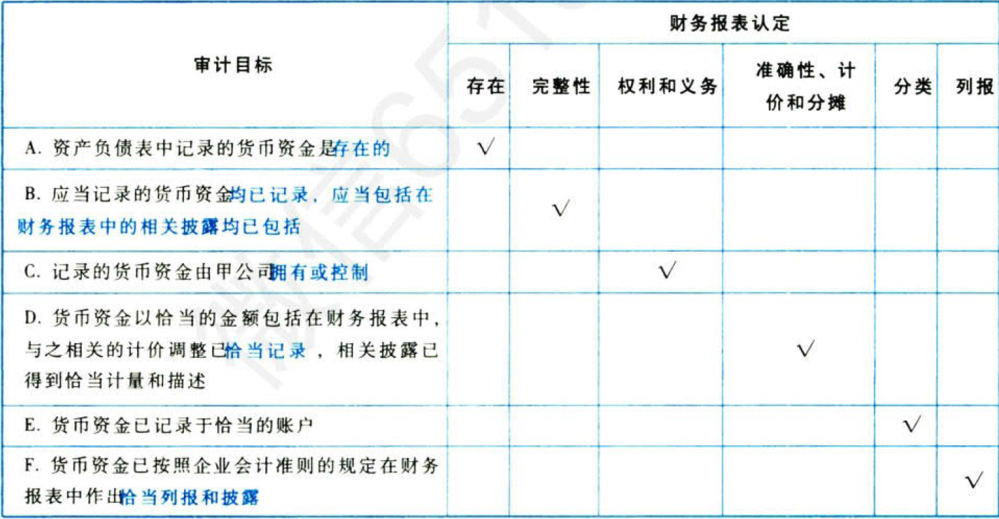

### 4.8.15. 审计目标与审计程序对应关系表

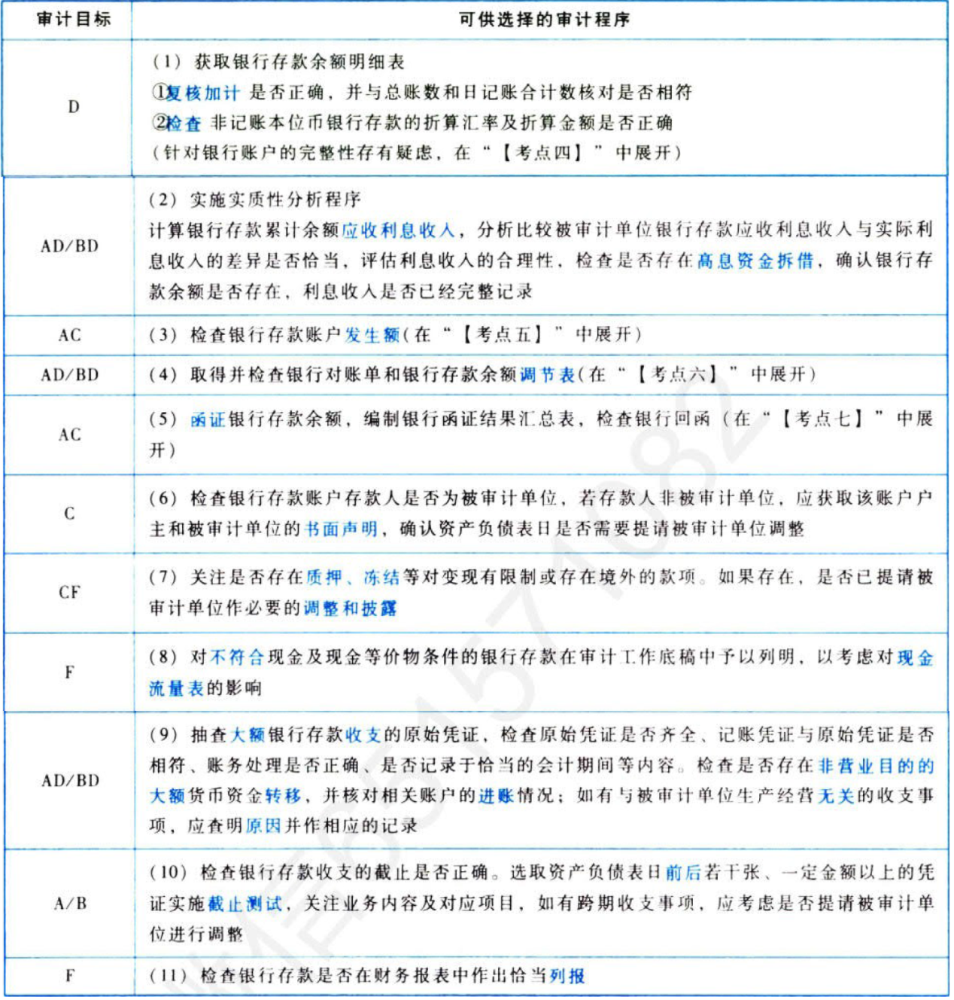

## 4.9. ［考点四］针对银行胀户的完整性存有题虑:star: :star: 

当被审计单位可能存在账外账或资金体外循环时，注册会计师可以考虑额外实施以下实质性程序：

（1）注册会计师亲自到中国人民银行或基本存款账户开户行查询并打印《已开立银行结算账户清单》，以确认被审计单位账面记录的银行人民币结算账户是否完整。

（2）结合其他相关细节测试，关注原始单据中被审计单位的收（付）款银行账户是否包含在注册会计师已获取的开立银行账户清单内。

## 4.10. ［考点五］检查银行存款账户发生额（通过“对账单”）:star: :star: 

除实施函证等审计程序外，在册会计师还可以考虑对银行存款账户的发生额实施以下程序：

（1）分析不同账户发生银行日记账漏记银行交易的可能性，获取相关账户相关期间的全部银行对账单。

（2）如果对被审计单位银行对账单的真实性存有疑虑，注册会计师可以在被审计单位的协助下亲自到银行获取银行对账单。在获取银行对账单时，注册会计师要全程关注银行对账单的打印过程。

（3）从银行对账单中选取交易的样本与被审计单位银行日记账记录进行核对；从被审计单位银行存款日记账上选取样本，核对至银行对账单（即“双向检查”）。

（4）浏览银行对账单，选取大额异常交易，如银行对账单上有一收一付相同金额，或分次转出相同金额等，检查被审计单位银行存款日记账上有无该项收付金额记录。

## 4.11. ［考点六］取得并检查银行对账单相银行存款余额调节表:star: :star: 

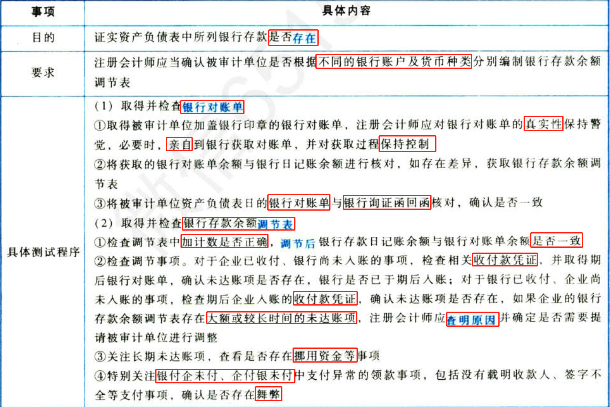

## 4.12. ［考点七］函证银行存款余额:star: :star: :star: 

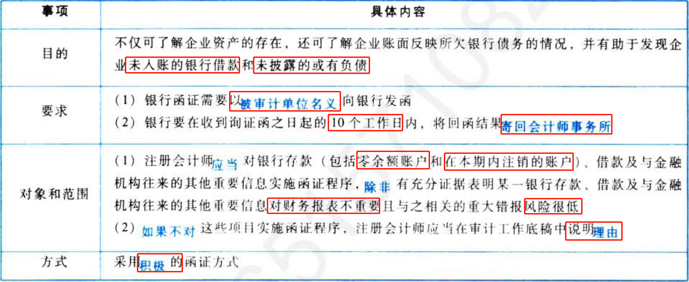

即使与银行存款相关的内部控制运行有效，也不能减少银行存款函证的测试量。

## 4.13. ［考点八］其他货币资金的实质性程序:star: :star: 

### 4.13.16. 针对定期存款的审计程序

如果被审计单位有定期存款，注册会计师可以考虑实施以下审计程序：

（1）向管理层询问定期存款存在的商业理由并评估其合理性。

（2）获取定期存款明细表，检查是否与账面记录金额一致，存款人是否为被审计单位，定期存款是否被质押或限制使用。

（3）在监盘库存现金的同时，监盘定期存款凭据。如果被审计单位在资产负债表日有大额定期存款，基于对风险的判断考虑选择在资产负债表日实施监盘。

（4）对未质押的定期存款，检查开户证实书原件，以防止被审计单位提供的复印件是未质押（或未提现）前原件的复印件。在检查时，还要认真核对相关信息，包括存款人、金额、期限等，如有异常，需实施进一必审计程序

（5）对巳质押的定期存款，检查定期存单复印件，并与相应的质押合同核对。对于质押借款的定期存单，关注定期存单对应的质押借款有无入账，对于超过借款期限但仍处于质押状态的定期存款，还应关注相关借款的偿还情况，了解相关质权是否已被行使：对于为他人担保的定期存单，关注担保是否逾期及相关质权是否已被行使。

（6）函证定期存款相关信息。

（7）结合财务费用审计测算利息收入的合理性，判断是否存在体外资金循环的情形。

（8）在资产负债表日后己提取的定期存款，核对相应的兑付凭证等。

（9）关注被审计单位是否在财务报表附注中对定期存款给予充分披露。

### 4.13.17. 针对其他货币资金，特别关注事项

除定期存款外，注册会计师对其他货币资金实施审计程序时，通常可能特别关注以下事项：

（1）保证金存款的检查，检查开立银行承兑汇票的协议或银行授信审批文件。可以将保证金账户对账单与相应的交易进行核对，根据被审计单位应付票据的规模合理推断保证金数额，检查保证金与相关债务的比例和合同约定是否一致，特别关注是否存在有保证金发生而被审计单位无对应保证事项的情形。

（2）对于存出投资款，跟踪资金流向，并获取董事会决议等批准文件、开户资料、授权操作资料等。如果投资于证券交易业务，通常结合相应金融资产项目审计，核对证券账户名称是否与被审计单位相符，获取证券公司证券交易结算资金账户的交易流水，抽查大额的资金收支，关注资金收支的财务账面记录与资金流水是否相符。

【阶段总结】本编是财务报表审计实务的核心内容，是以上市公司财务报表审计为背景，采用业务循环审计理念，依据会计准则和审计准则两把“尺子”，将审计基本原理（第一编）和审计测试流程（第二编）运用于销售与收款循环、采购与付款循环、生产与存货循环以及货币资金的审计实务中。以销售与收款循环审计为例，第一，注册会计师了解该业务循环的基本流程（教材9.2）；第二，评估重要财务报表项目（比如：营业收入）的认定（比如：发生认定），确定具体审计目标；第二，针对确定的具体审计目标设计和实施进一步审计程序（比如：针对营业收入的发生认定实施实质性分析程序、逆查等）。

# 5. 总结

End。
