C10采购与付款循环

# 1. 采购与付款循环的特点（略）

本节主要介绍了采购与付款循环涉及的主要单据与会计记录，具体内容结合第二节的“了解采购与付款循环的主要业务活动”进行掌握即可。

# 2. 采购与付款循环的主要业务活动和相关内部控制

本章学习以制造业企业采购业务为例，以请购单为起点，顺着业务流程各个关键节点进行展开，其中，订购单（或采购合同）和验收单是最关键的节点，如下图所示。

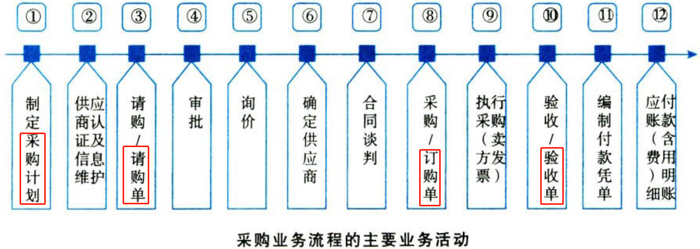

## 2.1. ［考点一］了解采购与付款循环的主要业务活动:star: :star: :star: 

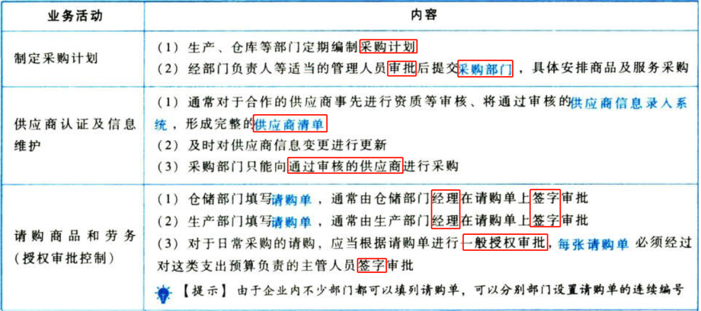

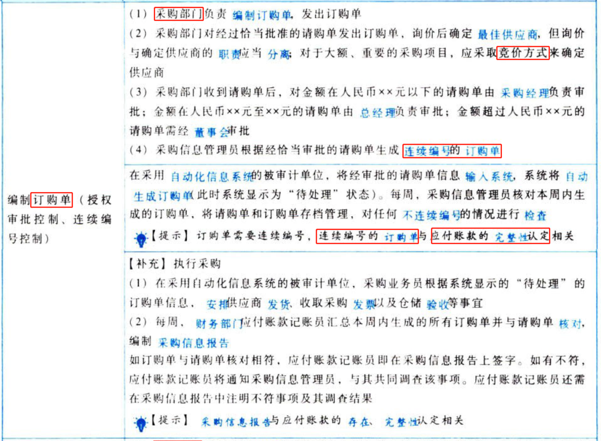

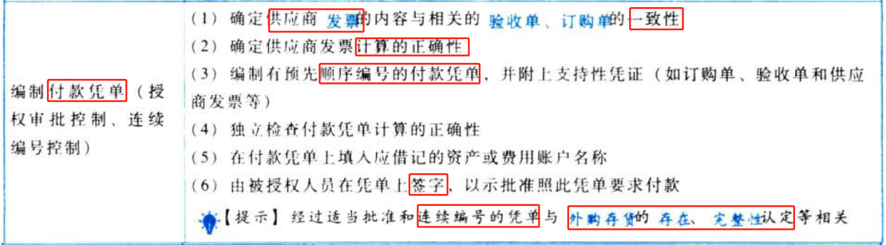

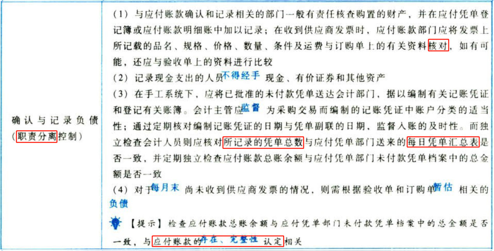

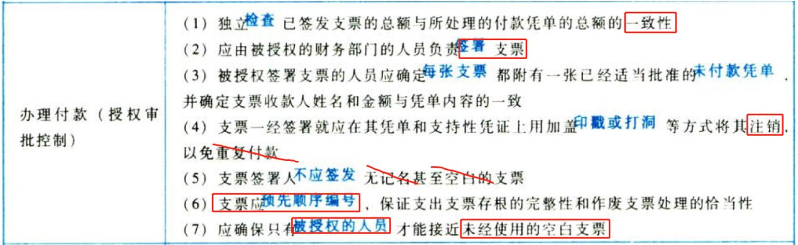

## 2.2. ［考点二］了解采购交易的内部控制:star: :star: 

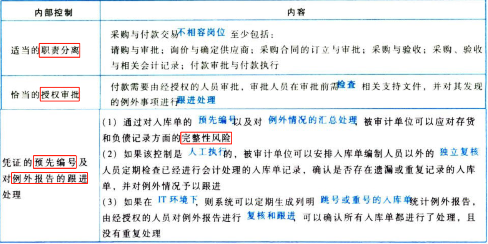

# 3. 采购与付款循环的重大错报风险（略）

# 4. 测试采购与付款循环的内部控制

## 4.3. ［考点］以风险为起点的控制测试:star: 

顺着重大错报风险的“识别、评估、应对”这根主线，注册会计师通常以识别的重大错报风险为起点，选取拟测试的控制并实施控制测试。

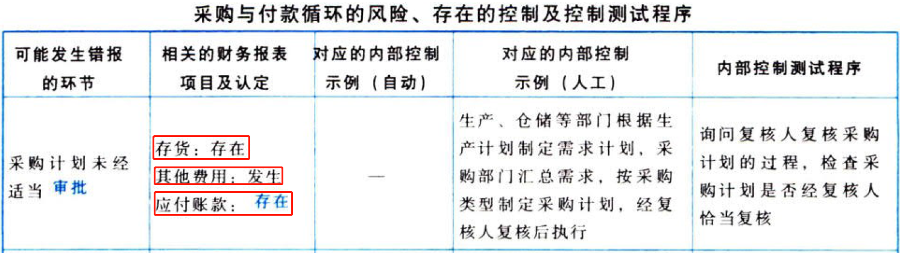

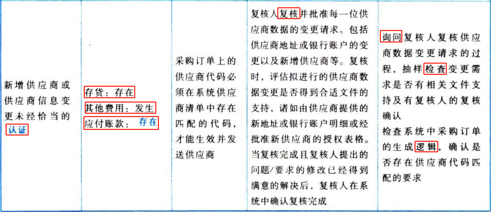

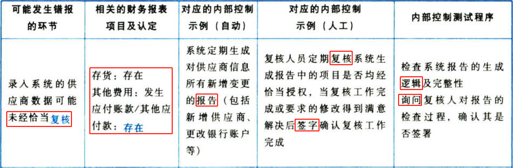

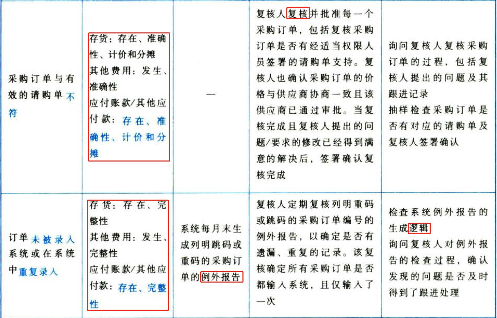

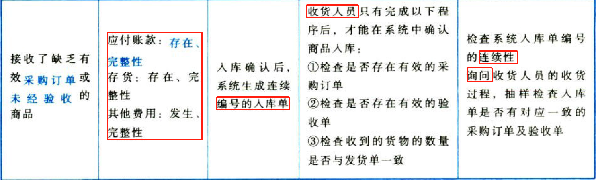

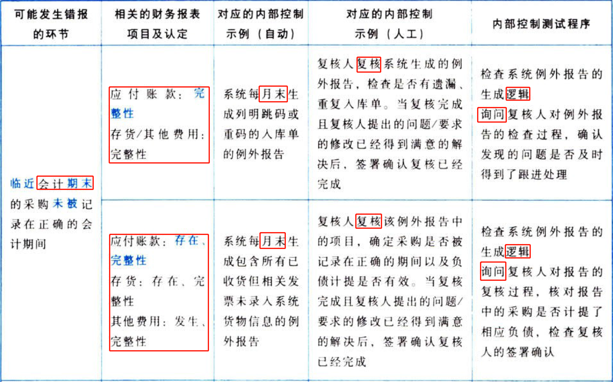

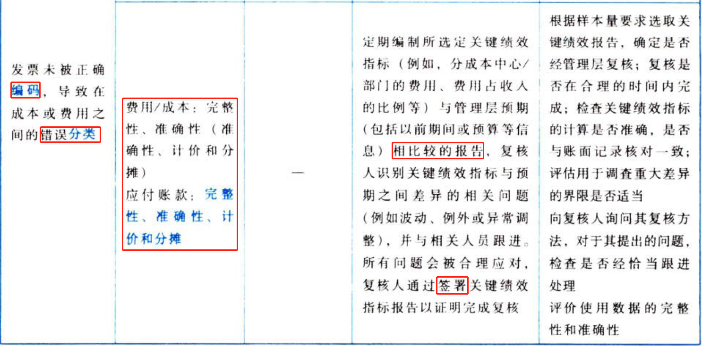

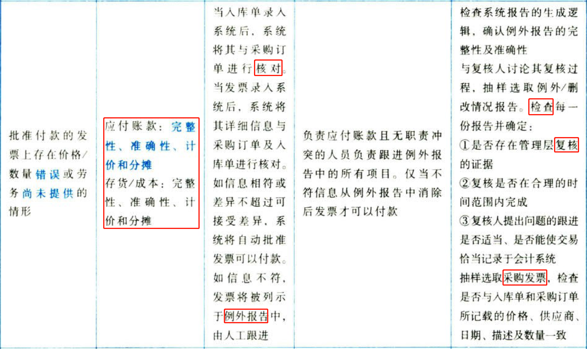

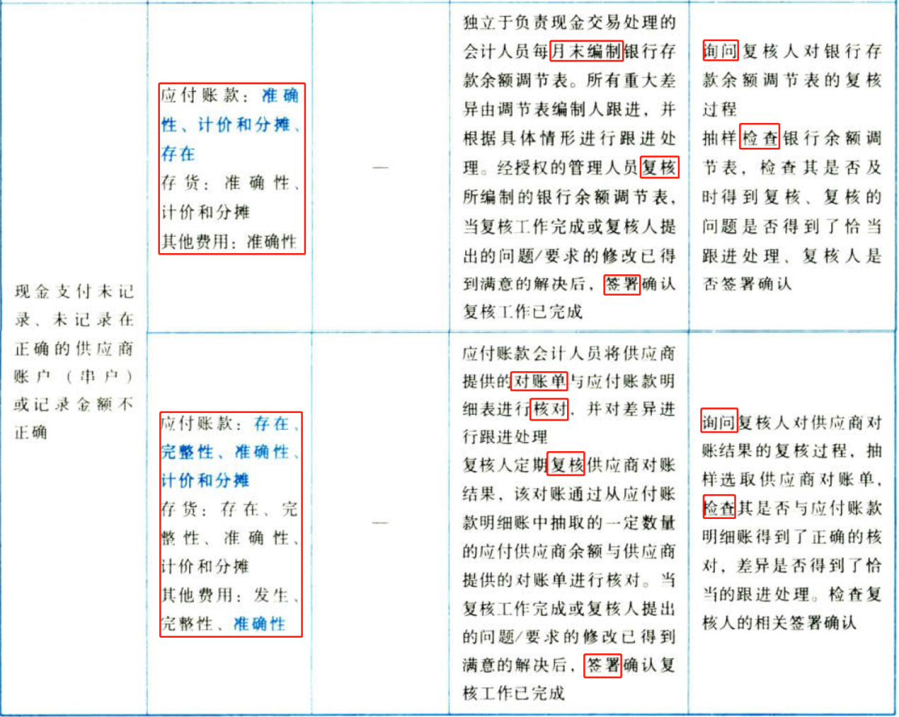

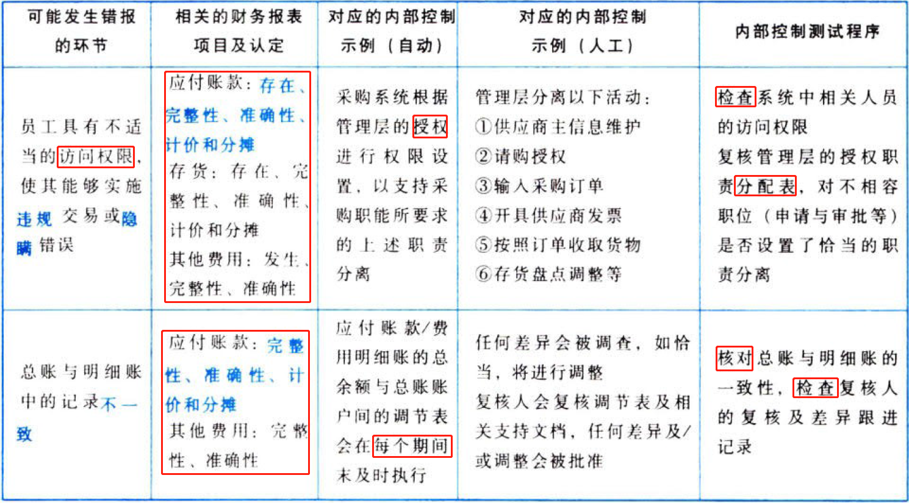

# 5. 采购与付款循环的实质性程序

我们借鉴CICPA财务报表审计工作底稿模板，将应付账款的实质性程序与审计目标对应起来，避免教材知识点“不接地气”。同时，大家熟悉底稿模板也可以在审计实务工作中很快“进入角色”，做到学有所用，将理论学习与实务工作对接。

## 5.4. ［考点一］应付账款的审计目标与实质性程序:star: 

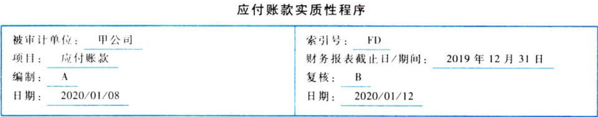

### 5.4.1. 审计目标与认定对应关系表

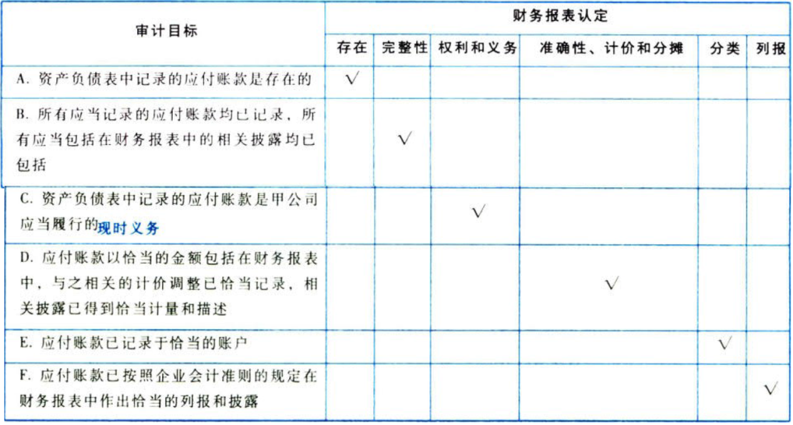

### 5.4.2. 审计目标与审计程序对应关系表

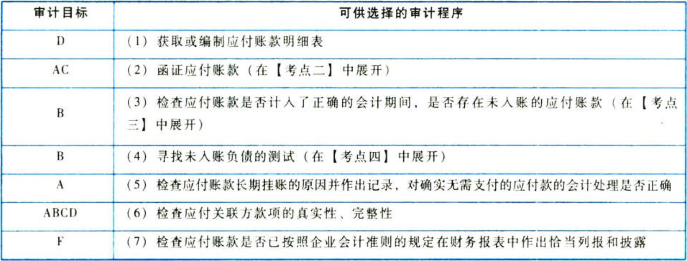

## 5.5. ［考点二］函证应付账款:star: :star: 

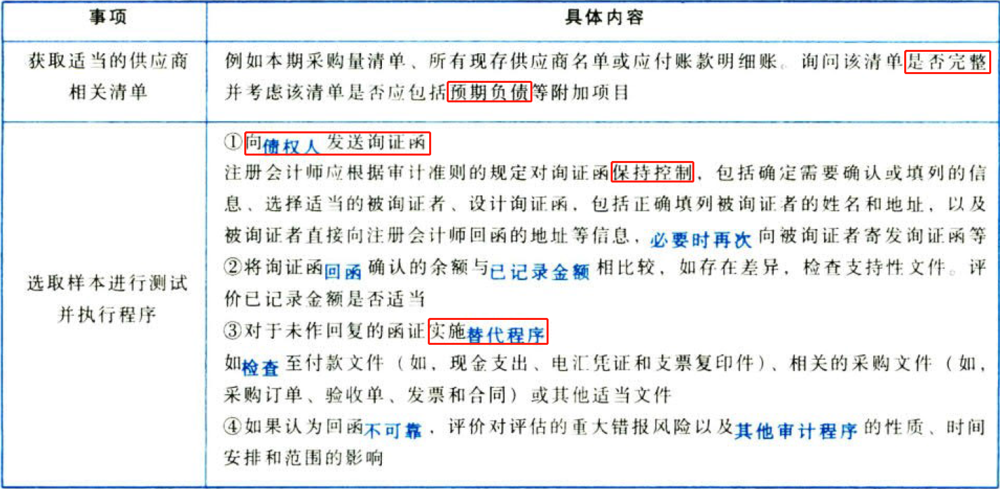

## 5.6. ［考点三］查找未入账的应付账款:star: :star: :star: 

注册会计师检查应付账款是否计入了正确的会计期间，是否存在未入账的应付账款，应当实施以下程序：

（1）对本期发生的应付账款增减变动，检查至相关支持性文件，确认会计处理是否正确。

（2）检查资产负债表日后应付账款明细账贷方发生额的相应凭证，关注其验收单、购货发票的日期，确认其入账时间是否合理。

（3）获取并检查被审计单位与其供应商之间的对账单以及被审计单位编制的差异调节表，确定应付账款金额的准确性。

（4）针对资产负债表日后付款项目，检查银行对账单及有关付款凭证（如银行汇款通知、供应商收据等），询问被审计单位内部或外部的知情人员，查找有无未及时入账的应付账款。

（5）结合存货监盘程序，检查被审计单位在资产负债表日前后的存货入库资料（验收报告或入库单），检查相关负债是否计入了正确的会计期间。

## 5.7. ［考点四］寻找未入账负债的测试:star: :star: :star: 

获取期后收取、记录或支付的发票明细，包括获取支票登记簿/电汇报告/银行对账单（根据被审计单位情况不同）以及入账的发票和未入账的发票。从中选取项目（尽量接近审计报告日）进行测试并实施以下程序：

（1）检查支持性文件，如相关的发票、采购合同/申请、收货文件以及接受劳务明细，以确定收到商品/接受劳务的日期及应在期末之前入账的日期。

（2）追踪已选取项目至应付账款明细账、货到票未到的暂估入账、预提费用明细表，并关注费用所计入的会计期间。调查并跟进所有己识别的差异。

（3）评价费用是否被记录于正确的会计期间，并相应确定是否存在期末未入账负债。

# 6. 总结

★★★

（1）

（2）

（3）

（4）

（5）

（6）

（7）

（8）

（9）

（10）

End。
