C09销售与收款循环的审计

# 1. 销售与收款循环的特定（略）

本节主要介绍了销售与收款循环、涉及的主要单据与会计记录，具体内容结合第二节的“了解销售与收款循环的主要业务活动”进行学习和掌握即可。

# 2. 销售与收款循环的业务活动和相关内部控制

本章学习以制造业企业销售业务为例，以客户订购单为起点，顺着业务流程各个关键节点展开，其中，发运凭证、客户签收单和收入明细账是最关键的节点，如图9-1所示。

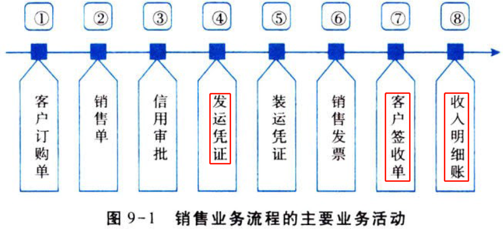

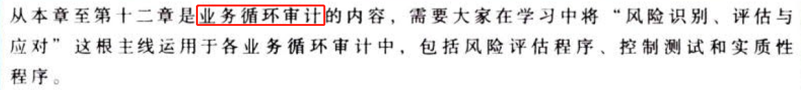

## 2.1. ［考点一］了解销售与收款循环的主要业务活动:star: :star: 

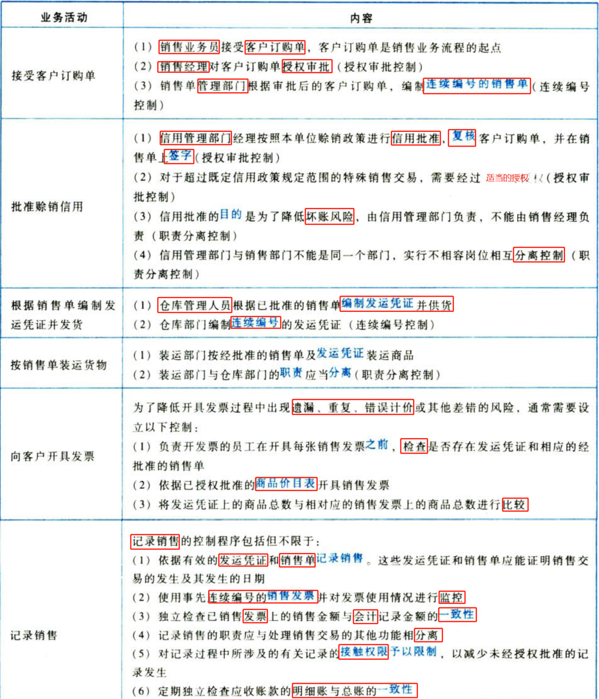

## 2.2. ［考点二］了解销售交易的控制活动:star: :star: 

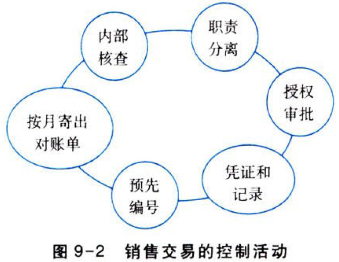

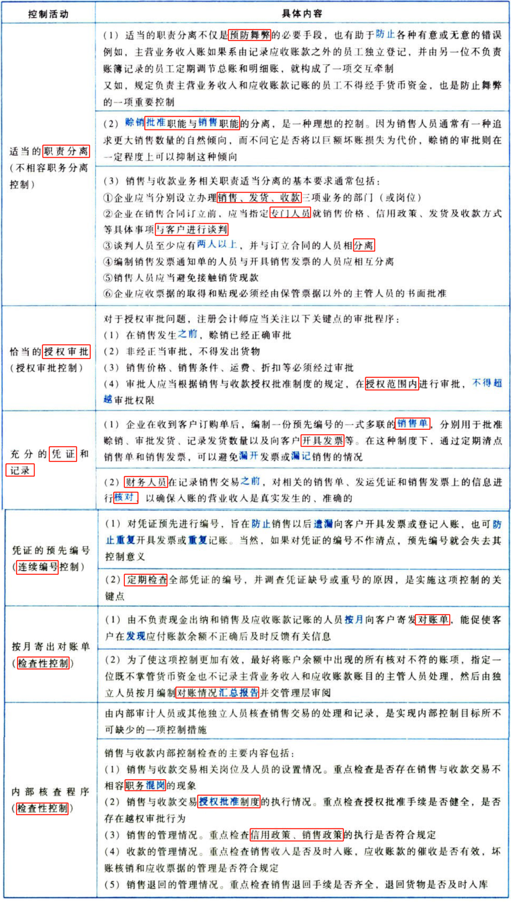

# 3. 销售与收款循环的重大错报风险的评估

## 3.3. ［考点一］识别与收入确认相关的舞弊风险:star: :star: 

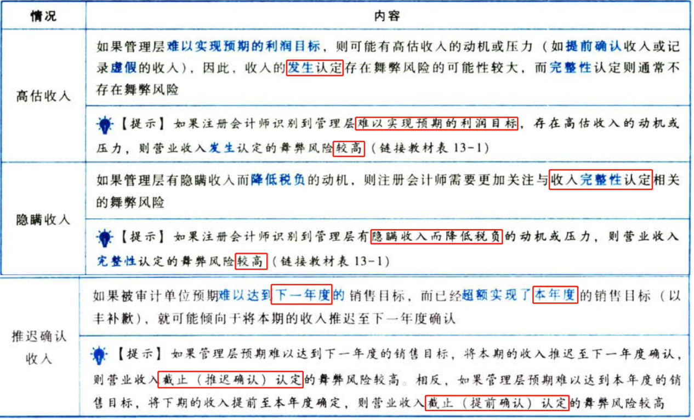

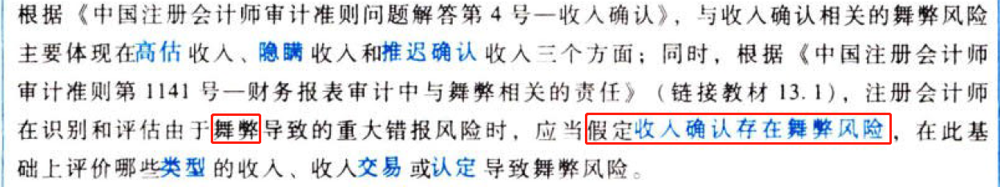

## 3.4. ［考点二］常用的收入确认舞弊手段:star: 

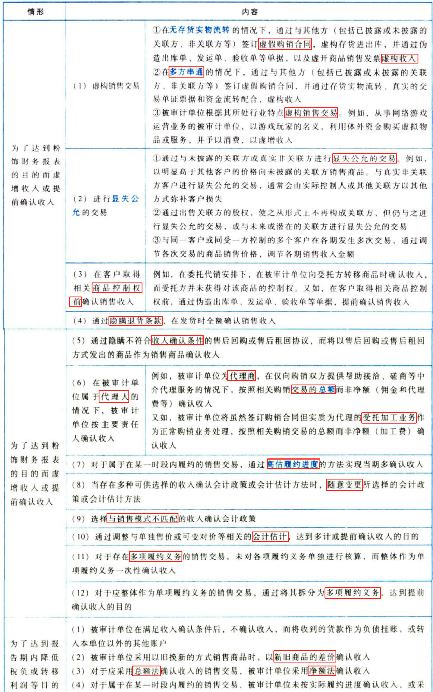

## 3.5. ［考点三］收入确认可能存在舞弊风险的迹象:star: 

舞弊风险迹象，是注册会计师在实施审计过程中发现的、需要引起对舞弊风险警觉的事实或情况。存在舞弊风险迹象并不必然表明发生了舞弊，但了解舞弊风险迹象，有助于注册会计师对审计过程中发现的异常情况产生警觉，从而更有针对性地采取应对措施。

注册会计师保持职业怀疑，充分了解被审计单位业务模式并理解业务逻辑，有助于识别舞弊风险迹象。例如，被审计单位的产品具有一定的销售半径，如果存在超出销售半径而没有合理商业理由的销售交易，则可能表明破审计单位存在收入舞弊风险。又如，被审计单位技术水平处于行业中端，但高端产品却占销售收入比重较大，可能表明被审计单位存在收入舞弊风险。

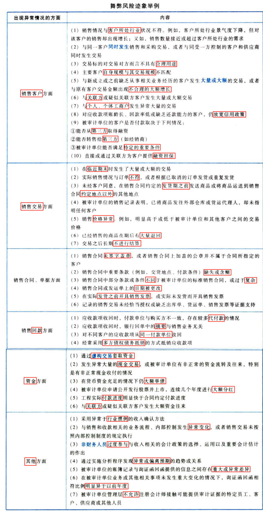

需要注意的是，以上情况并未穷尽实务中存在舞弊风险的迹象，被审计单位存在列举的某一迹象也并不意味着其在收入确认方面一定存在舞弊风险，注册会计师应当结合对被审计单位及其环境的了解，在审计过程中对异常情况保持高度警觉和职业怀疑，在此基础上运用职业判断确定被审计单位在收入确认方面是否可能存在舞弊风险。

## 3.6. ［考点四］对收入确认实施分析程序:star: :star: 

在设计分析程序时，注册会计师需要在充分了解被审计单位及其环境的基础上，识别与收入相关的财务数据和其他财务数据、非财务数据之间存在的关系，以提升实施分析程序的效果。基于被审计单位的业务性质，可以采用不同的数据指标分析。例如，餐饮业可以考虑翻台率，游戏直播行业可以考虑单客充值金额、实际在线时间等。

注册会计师通过实施分析程序，识别被审计单位收入确认舞弊风险的示例：

（1）将账面销售收入、销售清单和销售增值税销项清单进行核对；

（2）将本期销售收入金额与以前可比期间的对应数据或预算数进行比较；

（3）分析月度或季度销售量、销售单价、销售收入金额、毛利率变动趋势；

（4）将销售收入变动幅度与销售商品及提供劳务收到的现金、应收账款/合同资产、存货、税金等项目的变动幅度进行比较；

（5）将销售毛利率、应收账款/合同资产周转率、存货周转率等关键财务指标与可比期间数据、预算数或同行业其他企业数据进行比较；

（6）分析销售收入等财务信息与投入产出率、劳动生产率、产能、水电能耗、运输数量等非财务信息之间的关系；

（7）分析销售收入与销售费用之间的关系，包括销售人员的人均业绩指标、销售人员薪酬、广告费、差旅费，以及销售机构的设置、规模、数量、分布等。

## 3.7. ［考点五］针对舞弊风险的调查方法:star: :star: 

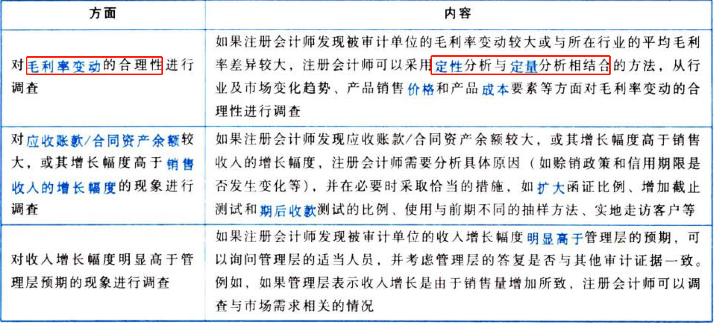

在收人确认领域，注册会计师可以借助数据分析技术。

# 4. 测试销售与收款循环的内部控制

## 4.8. ［考点］以风险为起点的控制测试:star: :star: 

顺着重大错报风险的“识别、评估、应对”这根主线，注册会计师通常以识别的重大错报风险为起点，选取拟测试的控制并实施控制测试。

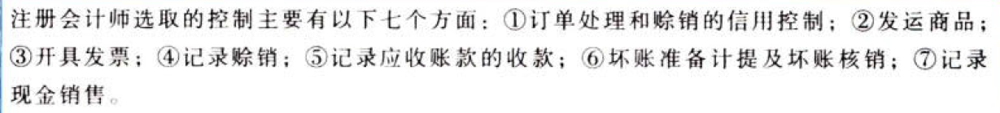

### 4.8.1. 订单处理和赊销的信用控制

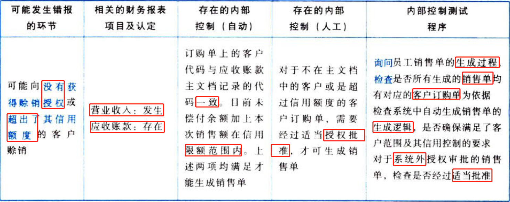

### 4.8.2. 发运商品

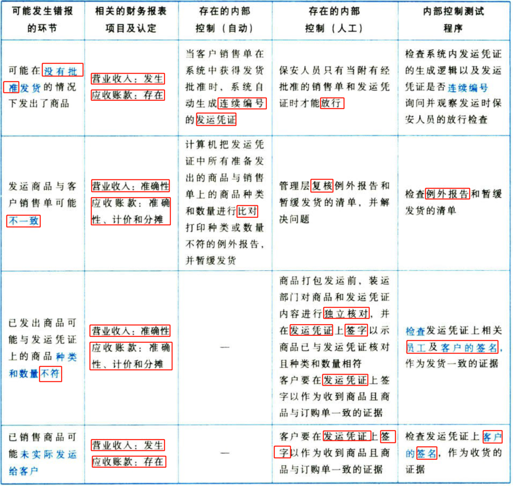

### 4.8.3. 开具发票

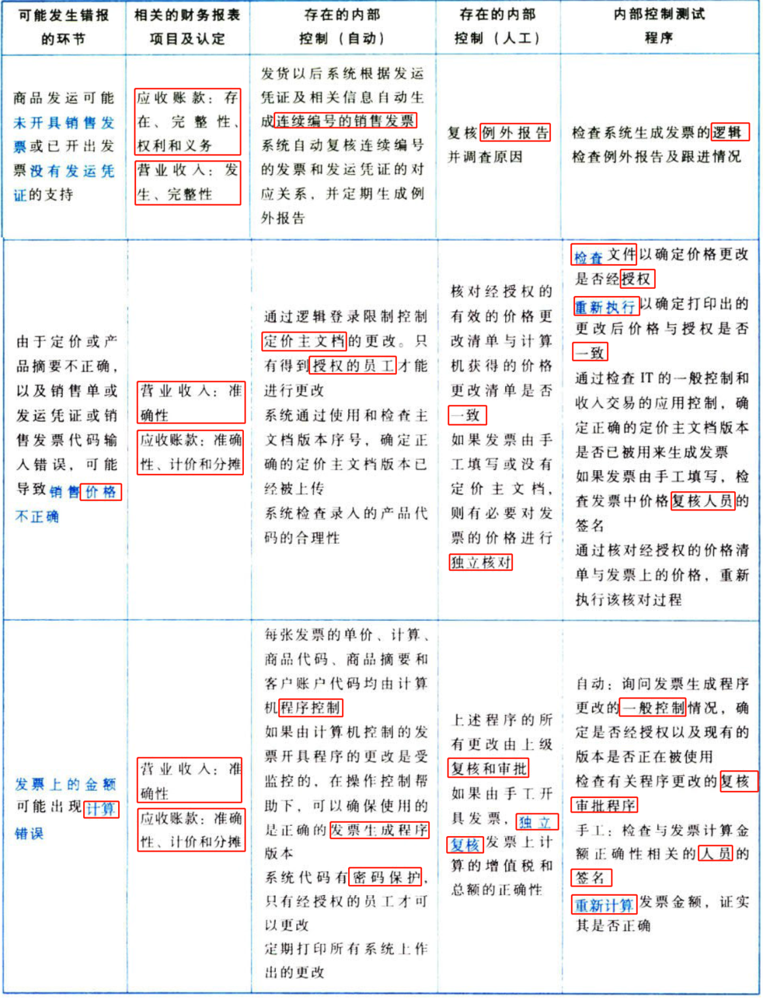

### 4.8.4. 记录赊销

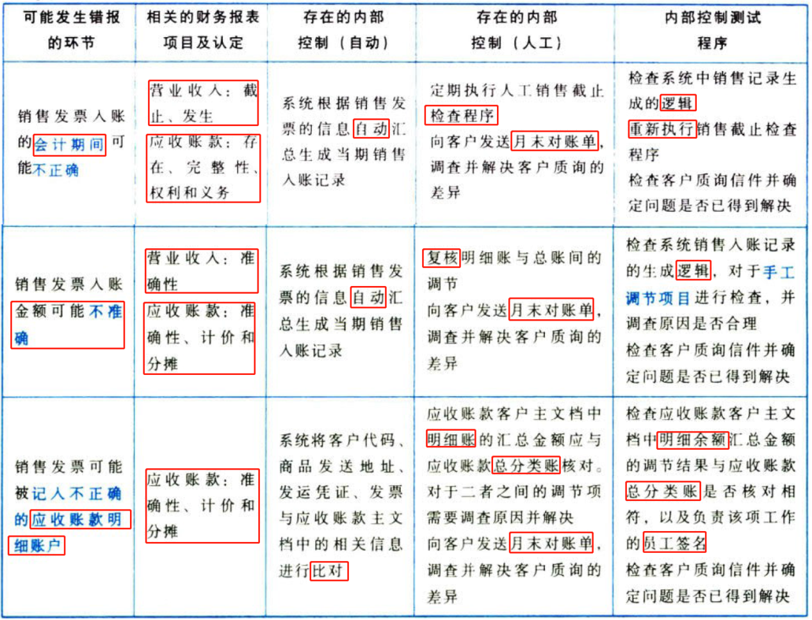

### 4.8.5. 记录应收账款的收款

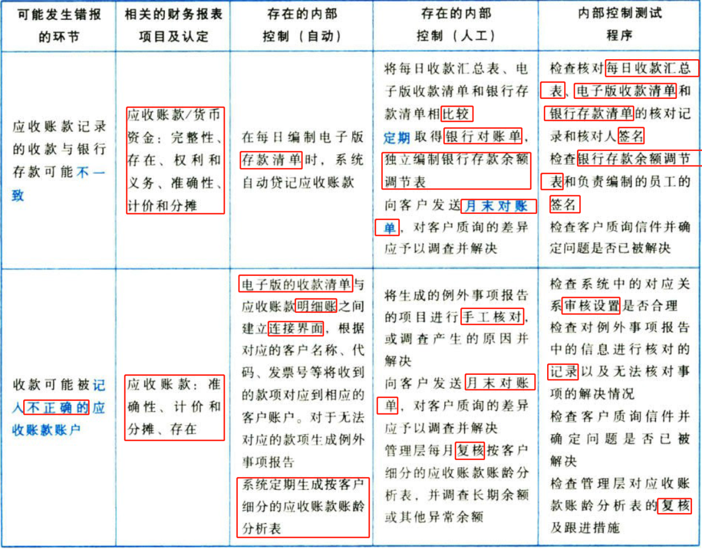

### 4.8.6. 坏账准备计提及坏账核销

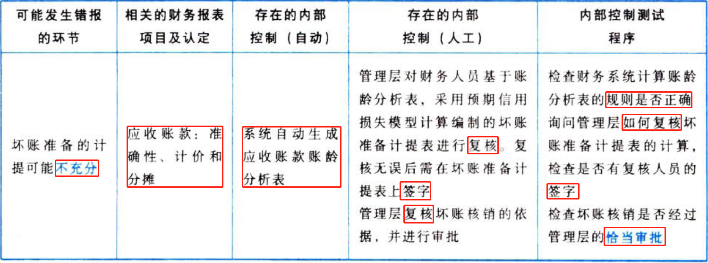

### 4.8.7. 记录现金销售

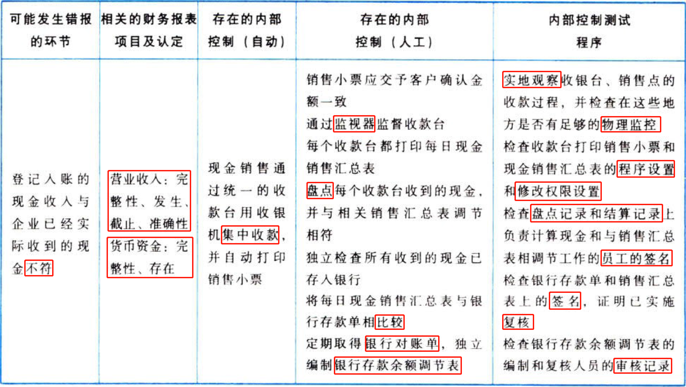

# 5. 销售与收款循环的实质性程序

我们借鉴CICPA财务报表审计工作底稿模板，将营业收入和应收账款的实质性程序与审计目标对应起来，避免教材知识点“不接地气”。同时，大家熟悉底稿模板也可以在审计实务工作中很快“进入角色”，做到学有所用，将理论学习与实务工作对接。

## 5.9. ［考点一］营业收入的审计目标与实质性程序:star: :star: :star: 

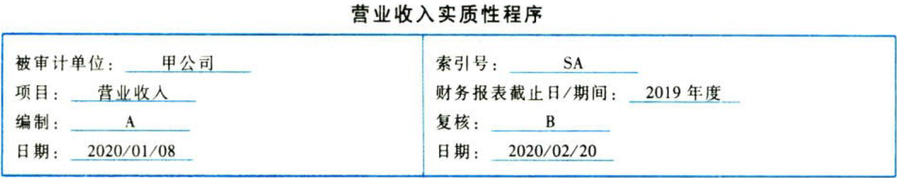

### 5.9.8. 审计目标与认定对应关系表

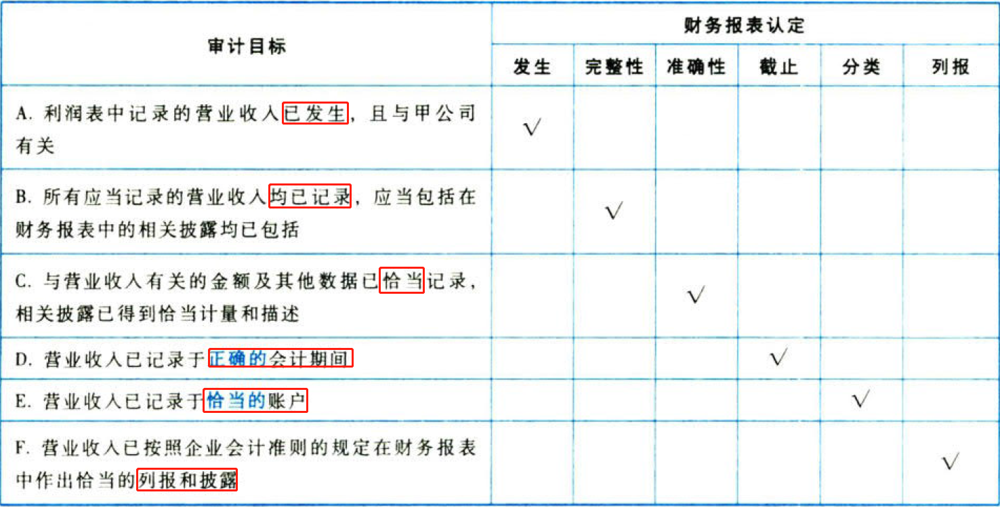

### 5.9.9. 审计目标与审计程序对应关系表

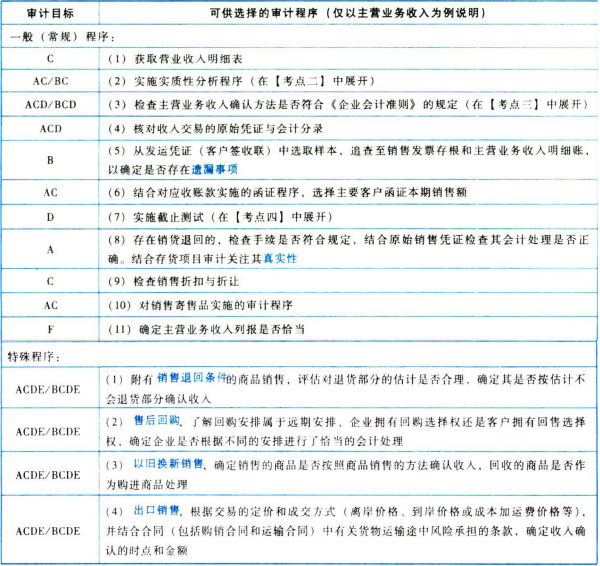

## 5.10. ［考点二］实施实质性分析程序:star: :star: :star: 

（一）针对已识别需要运用分析程序的有关项目，并基于对被审计单位及其环境的了解，通过进行以下比较，同时考虑有关数据间关系的影响，以建立有关数据的期望值

（1）将账面销售收入、销售清单和销售增值税销项清单进行核对。

（2）将本期销售收入金额与以前可比期间的对应数据或预算数进行比较。

（3）分析月度或季度销售量、销售单价、销售收入金额、毛利率变动趋势。

（4）将销售收入变动幅度与销售商品及提供劳务收到的现金、应收账款/合同资产、存货、税金等项目的变动幅度进行比较。

（5）将销售毛利率、应收账款/合同资产周转率、存货周转率等关键财务指标与可比期间数据、预算数或同行业其他企业数据进行比较。

（6）分析销售收入等财务信息与投入产出率、劳动生产率、产能、水电能耗、运输数量等非财务信息之间的关系。

（7）分析销售收入与销售费用之间的关系，包括销售人员的人均业绩指标、销售人员薪酬、广告费、差旅费，以及销售机构的设置、规模、数量、分布等。

（二）确定可接受的差异额

（三）将实际金额与期望值相比较，计算差异

（四）如果差异额超过确定的可接受差异额，调查并获取充分的解释和恰当的、佐证性质的审计证据（如通过检查相关的凭证等）。需要注意的是，如果差异超过可接受差异额，注册会计师需要对差异额的全额进行调查证实，而非仅针对超出可接受差异额的部分

（五）评估实质性分析程序的结果

## 5.11. ［考点三］检查主营业务收入确认方法是否符合《企业会计准则》的规定:star: :star: :star: 

（1）注册会计师需要基于对被审计单位商业模式和日常经营情况的了解，判断被审计单位的合同履约义务是在某一时段内履行峰是某一时点履行的，据以评估被审计单位确认产品销售收入的会计政策是否符合《企业会计准则》，并测试被审计单位是否按照某既定的会计政策确认产品销售收入。

（2）注册会计师通常对所选取的交易，追查至原始的销售合同及与履行合同相关的单据和文件记录，以评价收入确认方法是否符合《企业会计准则》的规定。

本章假定被审计单位在某一时点履行履约义务，在商品发运至客户并签收时确认收入（客户在该时点取得对商品的控制权）。

## 5.12. ［考点四］营业收入截止测试:star: :star: :star: 

（1）截止测试的前提。

实施截止测试的前提是注册会计师充分了解被审计单位收入确认会计实务，并识别能够证明某笔销售符合收入确认条件的关键单据。

例如，货物出库时，与货物所有权相关的主要风险和报酬可能尚未转移，即客户尚未取得对商品的控制权，不符合收入确认的条件，因此，仓储部门留存的发运凭证可能不是实现收入的充分证据，注册会计师需要检查有客户签署的那一联发运凭证。

又如，销售发票与收入相关，但是发票开具日期不一定与收入实现的日期一致。实务中由于增值税发票涉及企业的纳税和抵扣问题，开票日期滞后于收入可确认日期的情况并不少见，因此，通常不能将开票日期作为收入确认的日期。

（2）截止测试的审计路径。

假定某一般制造型企业在货物送达客户并由客户签收时确认收入，注册会计师可以考虑选择：

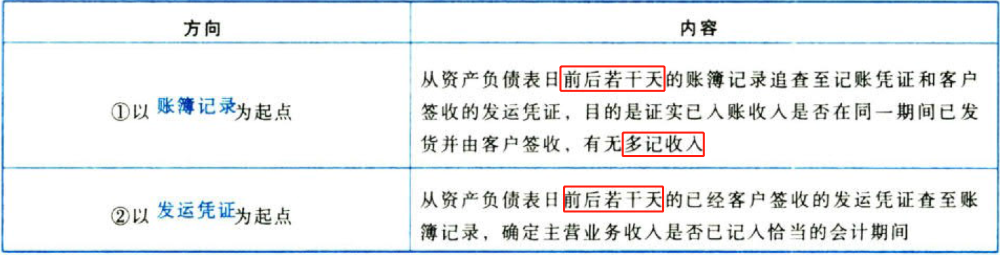

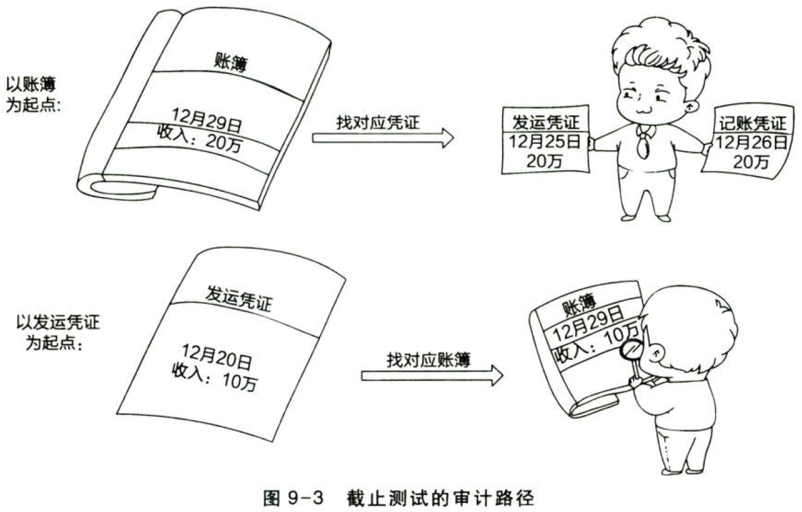

## 5.13. ［考点五］营业收入的特别审计程序:star: :star: 

营业收入的特别审计程序和延伸程序，归纳如下表。

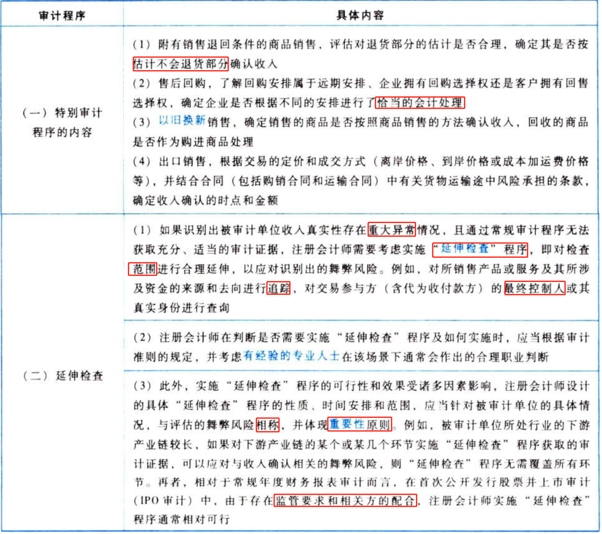

## 5.14. ［考点六］应收账款的审计目标与实质性程序:star: :star: 

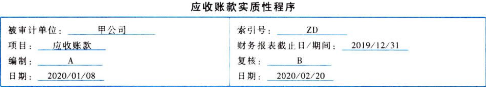

### 5.14.10. 审计目标与认定对应关系表

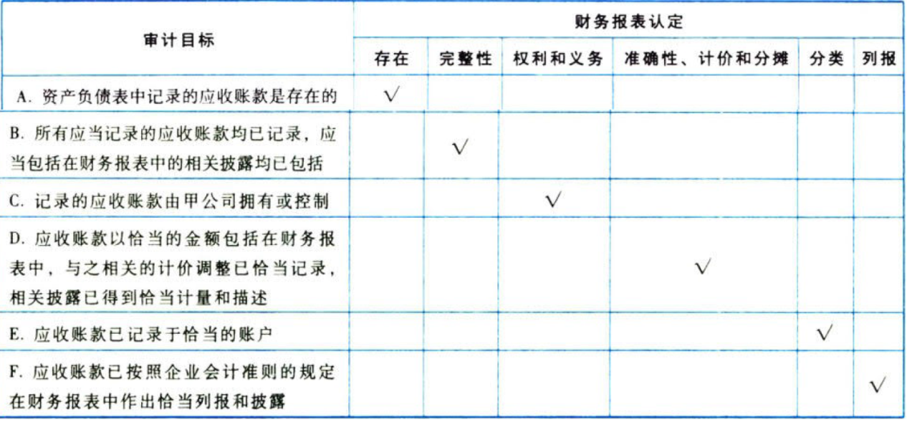

### 5.14.11. 审计目标与审计程序对应关系表

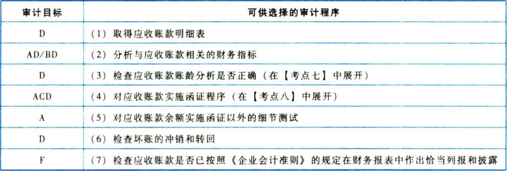

## 5.15. ［考点七］应收账款账龄分析:star: :star: 

检查应收账款账龄分析是否正确（请结合教材表9-6理解）。

（1）查看应收账款账龄分析表，以便了解和评估应收账款的信用风险。

（2）测试应收账款账龄分析表计算的准确性，并将应收账款账龄分析表中的合计数与应收账款总分类账余额相比较，并调查重大调节项目。

（3）从账龄分析表中抽取一定数量的项目，追查至相关销售原始凭证，测试账龄划分的准确性。

## 5.16. ［考点八］应收账款函证:star: :star: 

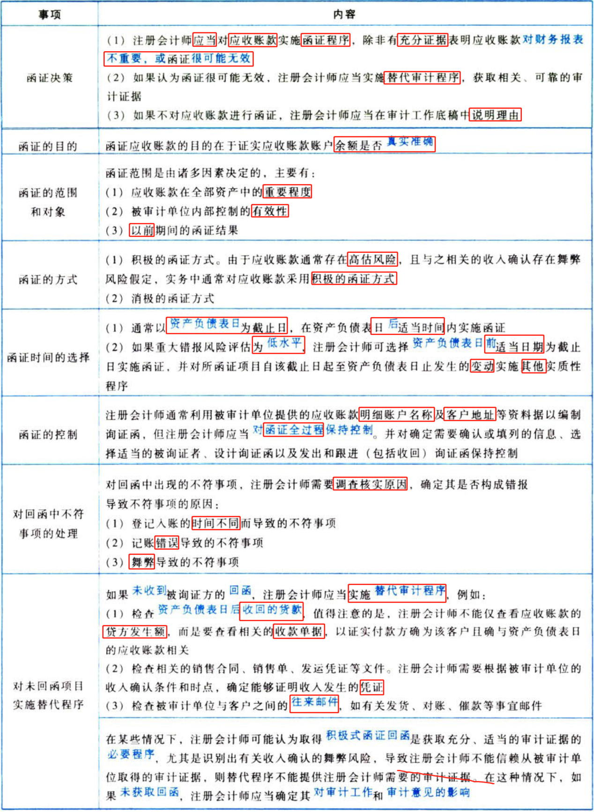

# 6. 总结

End。
