C08风险应对

# 1. 针对财务报表层次重大错报风险的总体应对措施

注册会计师针对评估的重大错报风险确定总体应对措施和进一步审计程序，如阁8-1所示：

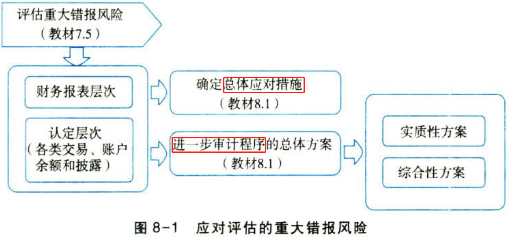

## 1.1. ［考点一］总体应对措施

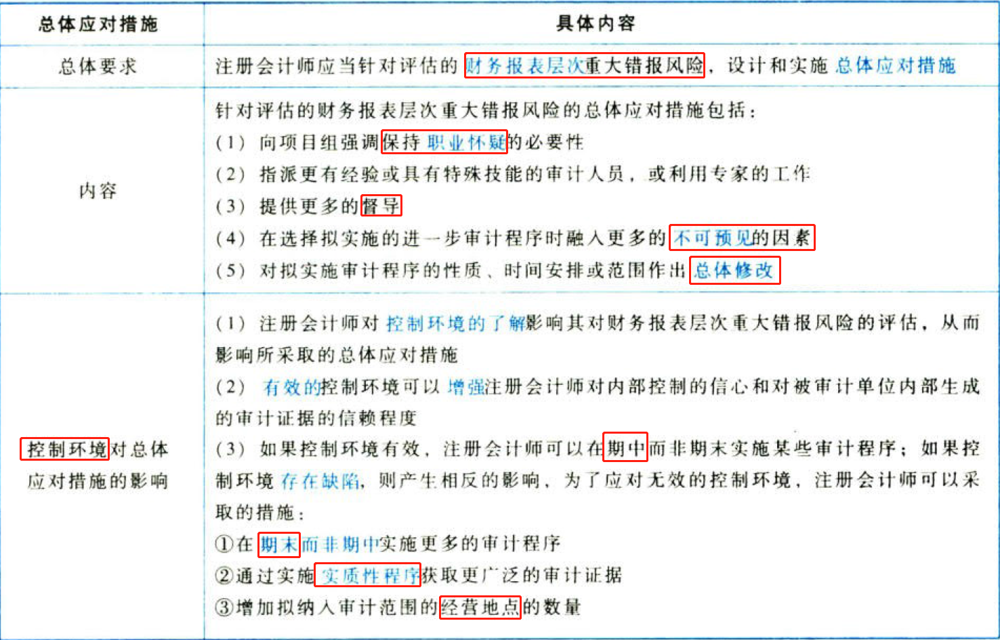

## 1.2. ［考点二］增加审计程序不可预见性的方法:star: :star: 

### 1.2.1. 增加审计程序不可预见性的思路

（1）对某些以前未测试的低于设定的重要性水平或风险较小的账户余额和认定实施实质性程序；

（2）调整实施审计程序的时间，使其超出被审计单位的预期；

（3）采取不同的审计抽样方法，使当年抽取的测试样本与以前有所不同；

（4）选取不同的地点实施审计程序，或预先不告知被审计单位所选定的测试地点。

### 1.2.2. 增加审计程序不可预见性的实施要点

（1）与被审计单位的管理层事先沟通，要求实施具有不可预见性的审计程序，但不能告知其具体内容。注册会计师可以在签订审计业务约定书时明确提出这一要求；

（2）虽然对于不可预见性程度没有量化的规定，但审计项目组可根据对舞弊风险的评估等确定具有不可预见性的审计程序；

（3）项目合伙人需要安排项目组成员有效地实施具有不可预见性的审计程序，但同时要避免使项目组成员处于困难境地。

### 1.2.3. 增加审计程序不可预见性的示例

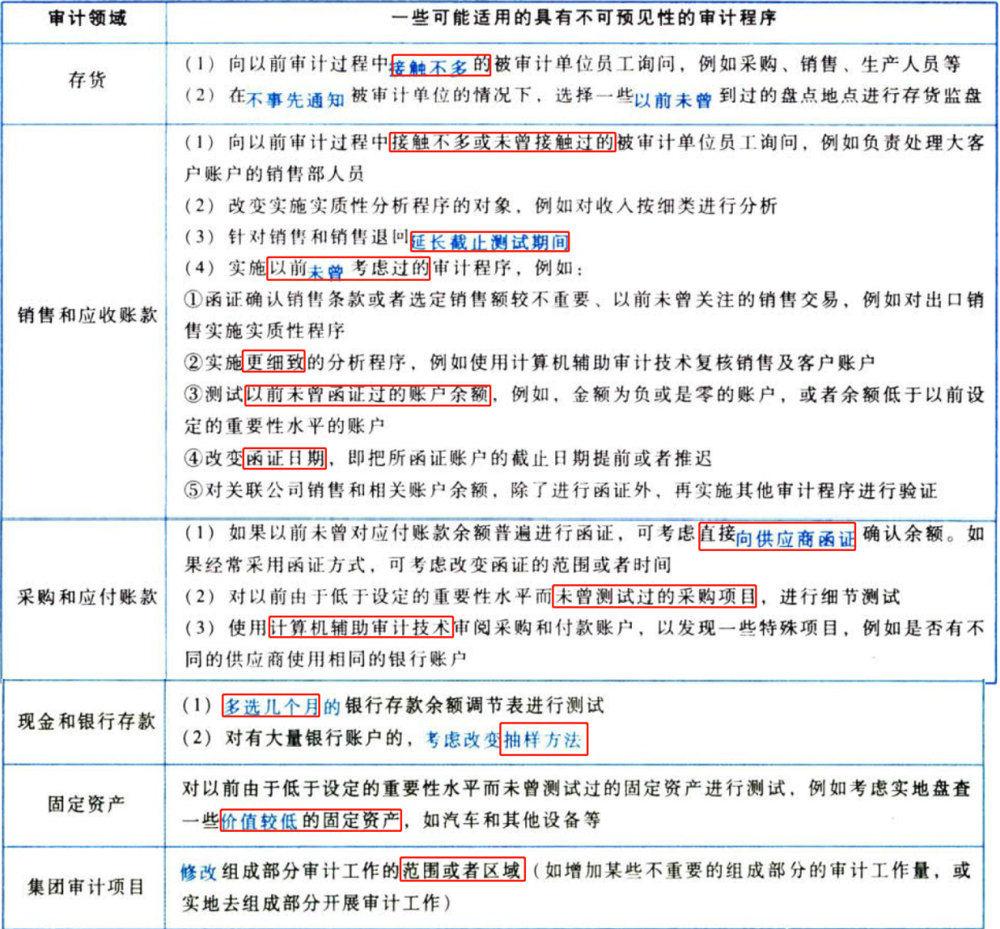

## 1.3. ［考点三］总体审计方案:star: :star: 

### 1.3.4. 总体审计方案的影响因素

（1）注册会计师评估的财务报表层次重大错报风险；

（2）采取的总体应对措施。

总体审计方案与总体应对措施是完全不同的概念，需要明确区分：

（1）总体审计方案针对的是拟实施进一步审计程序，属于认定层次的风险应对；

（2）总体应对措施是应对财务报表层次重大错报风险的措施，也可以理解为针对审计项目组审计思路的要求。

### 1.3.5. 总体审计方案的类型及举例

注册会计师拟实施进一步审计程序的总体审计方案包括实质性方案和综合性方案，如图8-2所示。

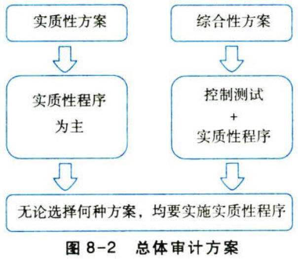

### 1.3.6. 财务报表层次重大错报风险水平与实质性方案的关系

评估的财务报表层次重大错报风险属于高水平时，注册会计师拟实施进一步审计程序的总体方案往往更倾向于实质性方案。

# 2. 针对认定层次重大错报风险的进一步审计程序

## 2.4. ［考点一］进一步审计程序的含义和要求:star: :star: 

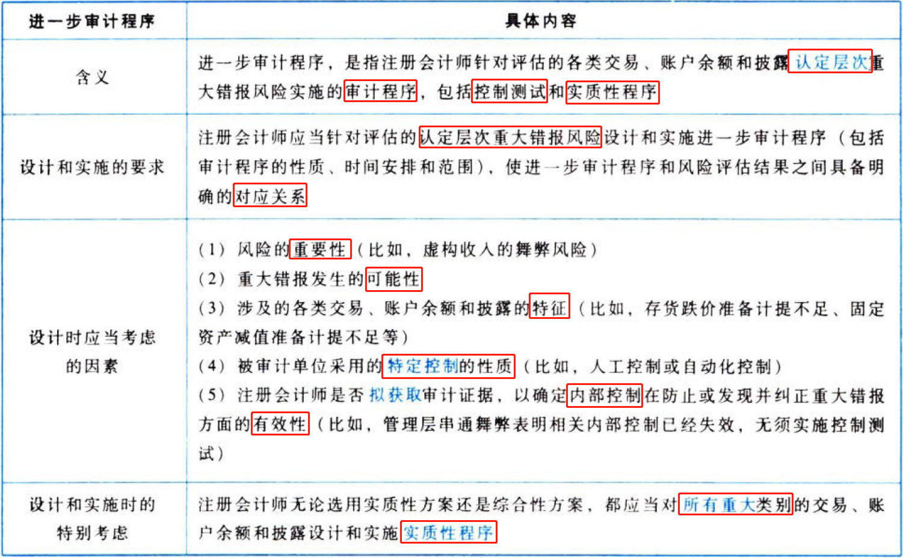

## 2.5. ［考点二］进一步审计程序的性质:star: :star: 

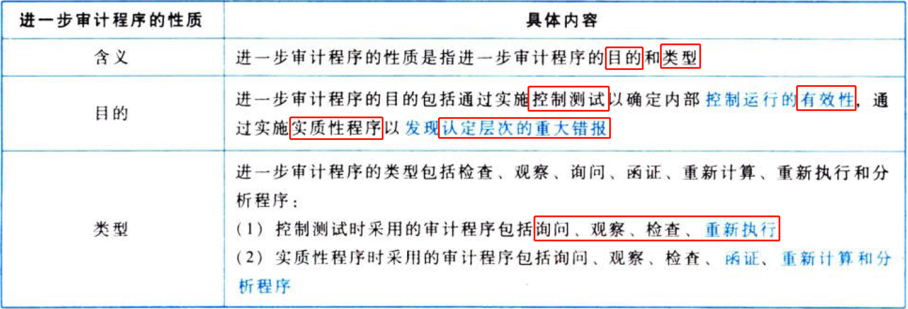

## 2.6. ［考点三］逝－步审计程序的时间:star: :star: 

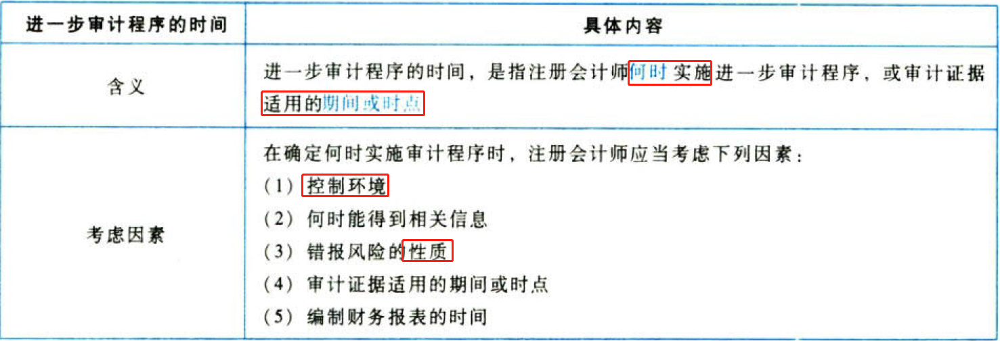

某些审计程序只能在期末或期末以后实施，包括将财务报表中的信息与其所依据会计记录相核对或调节，检查财务报表编制过程中所作的会计调整等。

## 2.7. ［考点四］逝－步审计程序的范围（食食）

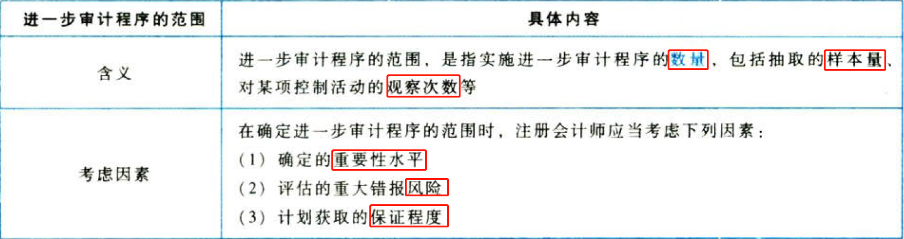

# 3. 控制测试

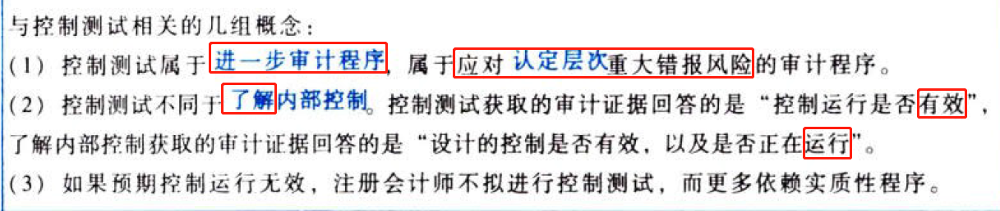

## 3.8. ［考点一］控制测试的含义和要求:star: :star: :star: 

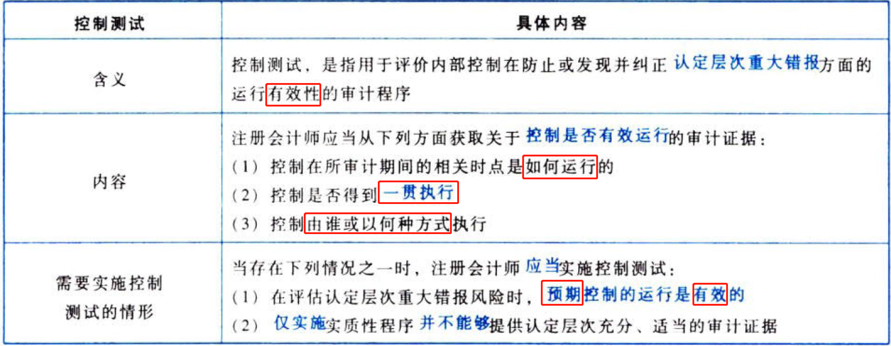

## 3.9. ［考点二］控制测试的性质:star: :star: :star: 

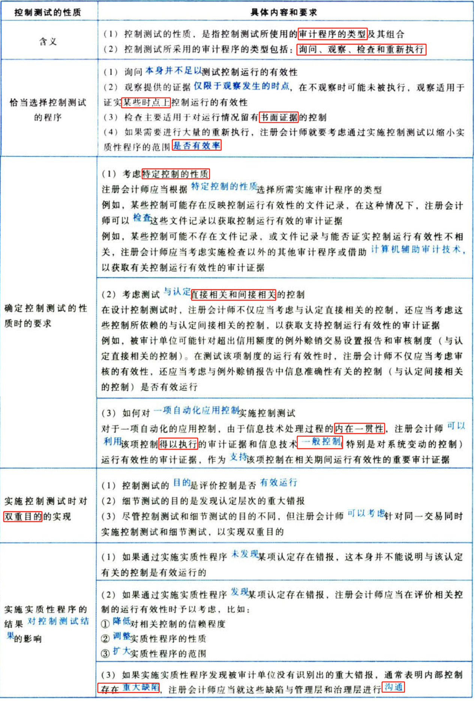

一般情况下，了解内部控制不能同时达到控制测试的目的，但是，如果了解某一项自动化应用控制，由于控制运行的内在一贯性，了解内部控制（即回答“评价控制的设计以及确定控制是否得到执行”）的同时可以得出“控制运行是否有效”的结论。

## 3.10. ［考点三］控制测试的时间:star: :star: :star: 

### 3.10.7. 控制测试的时间的含义

控制测试的时间包括以下两个方面的含义：

（1）何时实施控制测试（通常以财务报表日为测试的时间点，在财务报表日前的测试属于期中测试）。

（2）测试所针对的控制适用的时点或期间。

### 3.10.8. 剩余期间获取内部控制补充证据时应当考虑的因素

（1）评估的认定层次重大错报风险的重要程度。评估的重大错报风险对财务报表的影响越大，注册会计师需要获取的剩余期间的补充证据越多。

（2）在期中测试的特定控制，以及自期中测试后发生的重大变动。

（3）在期中对有关控制运行有效性获取的审计证据的程度。如果注册会计师在期中对有关控制运行有放性获取的审计证据比较充分，可以考虑适当减少需要获取的剩余期间的补充证据。

（4）剩余期间的长度。剩余期间越长，注册会计师需要获取的剩余期间的补充证据越多。

（5）在信赖控制的基础上拟缩小实质性程序的范围。注册会计师对相关控制的信赖程度越高，需要获取的剩余期间的补充证据越多。

（6）控制环境。在注册会计师总体上拟信赖控制的前提下，控制环境越薄弱，注册会计师需要获取的剩余期间的补充证据越多。

### 3.10.9. 如何考虑以前审计获取的审计证据

如果控制在本期发生变化，注册会计师应当考虑以前审计获取的有关控制运行有效性的审计证据是否与本期审计相关。如果拟信赖的控制自上次测试后已发生实质性变化，以致影响以前审计所获取证据的相关性，注册会计师应当在本期审计中测试这些控制的运行有效性。

如果控制在本期未发生变化，注册会计师在确定利用以前审计获取的有关控制运行有效性的审计证据是否适当以及再次测试控制的时间间隔时，应当考虑的因素或情况包括：

（1）内部控制其他要素的有效性。

（2）控制特征（人工控制还是自动化控制）产生的风险。

（3）信息技术一般控制的有效性。

（4）影响内部控制的重大人事变动。

（5）由于环境发生变化而特定控制缺乏相应变化导致的风险。

（6）重大错报风险和对控制的信赖程度。

注册会计师是否需要在本期测试某项控制的决策过程，如图8-3所示。

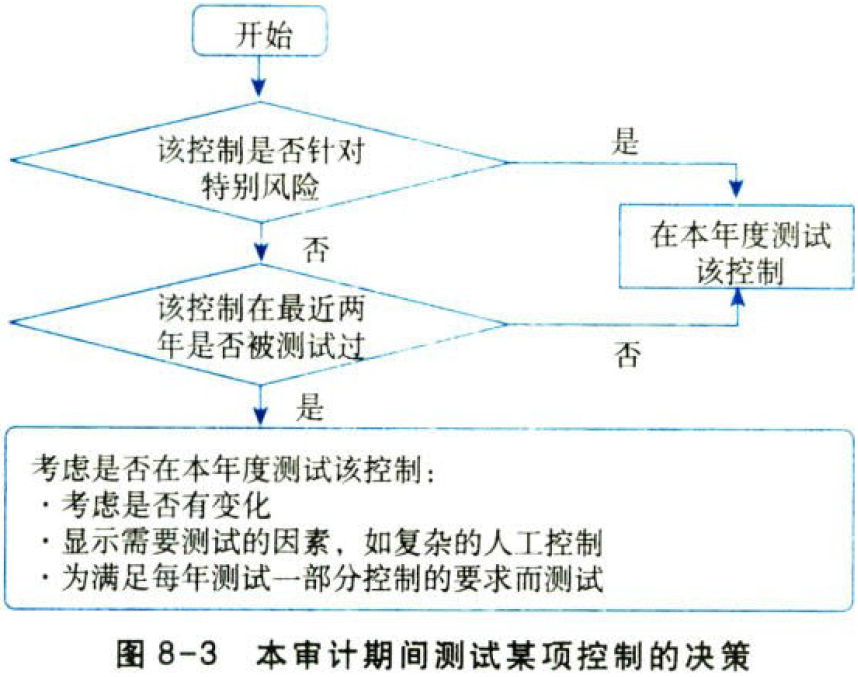

### 3.10.10. 旨在减轻特别风险的控制

（1）对于旨在减轻特别风险的控制，不论该控制在本期是否发生变化，注册会计师都不应依赖以前审计获取的证据。

（2）如果确定评估的认定层次重大错报风险是特别风险，且注册会计师拟信赖针对特别风险的控制，那么所有关于该控制运行有效性的审计证据必须来自当年的控制测试，注册会计师应当在每次审计中都测试这类控制。

## 3.11. ［考点四］控制测试的范围:star: :star: :star: 

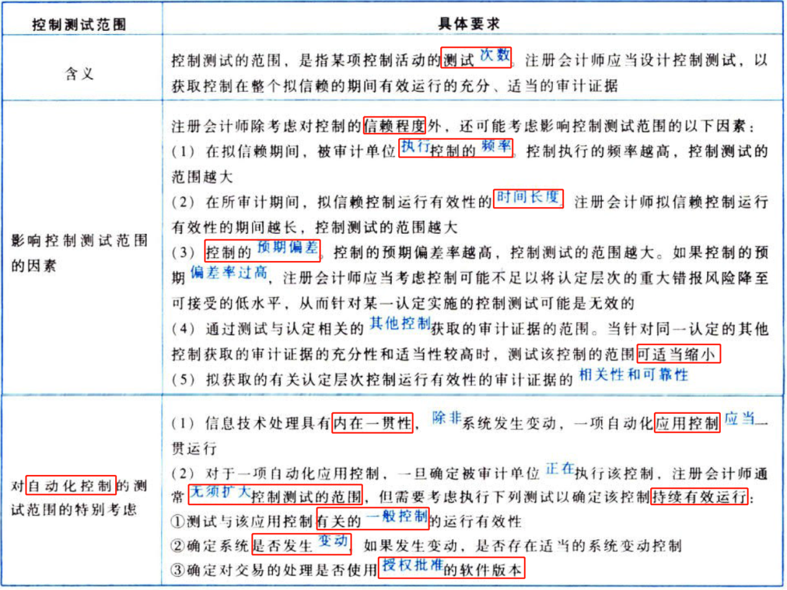

# 4. 实质性程序

## 4.12. ［考点一］实质性程序的含义和要求:star: :star: 

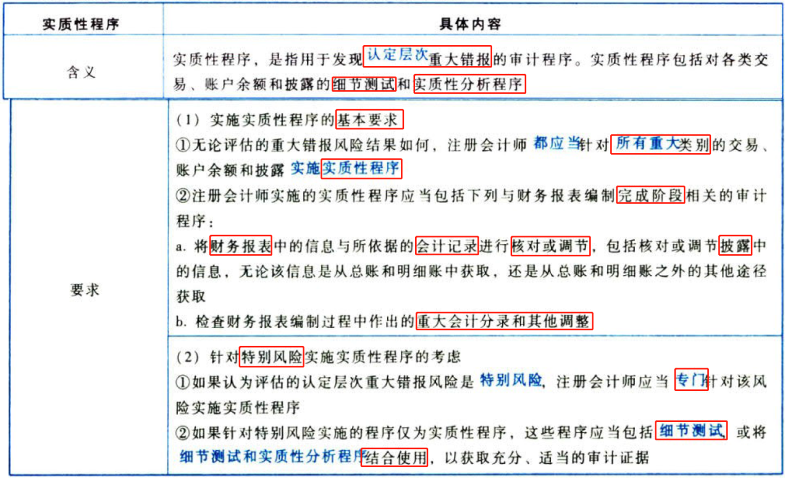

针对特别风险，可以实施的五种测试程序组合：

（1）细节测试；

（2）细节测试＋实质性分析程序；

（3）细节测试＋实质性分析程序＋控制测试；

（4）控制测试＋细节测试；

（5）控制测试＋实质性分析程序。

## 4.13. ［考点二］实质性程序的性质:star: :star: 

### 4.13.11. 实质性程序的性质的含义

实质性程序的性质，是指实质性程序的类型及其组合。

其中：

（1）细节测试是对各类交易、账户余额和披露的具体细节进行测试，目的在于直接识别财务报表认定是否存在错报。

（2）实质性分析程序从技术特征上讲仍然是分析程序，主要是通过研究数据间关系评价信息，只是将该技术方法用作实质性程序，，即用以识别各类交易、账户余额和披露及相关认定是否存在错报。

### 4.13.12. 细节测试和实质性分析程序的适用性

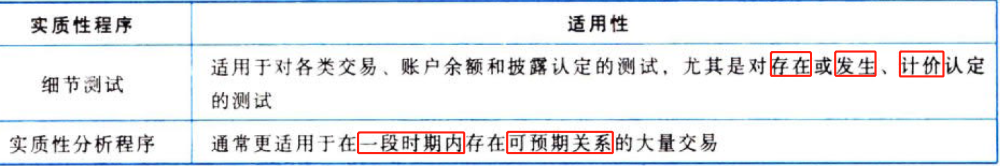

### 4.13.13. 细节测试的方向

### 4.13.14. 设计实质性分析程序时考虑的因素

（1）对特定认定使用实质性分析程序的适当性。

（2）对已记录的金额或比率作出预期时，所依据的内部或外部数据的可靠性。

（3）作出预期的准确程度是否足以在计划的保证水平上识别重大错报。

（4）已记录金额与预期值之间时接受的差异额。

## 4.14. ［考点三］实质性程序的时间:star: :star: 

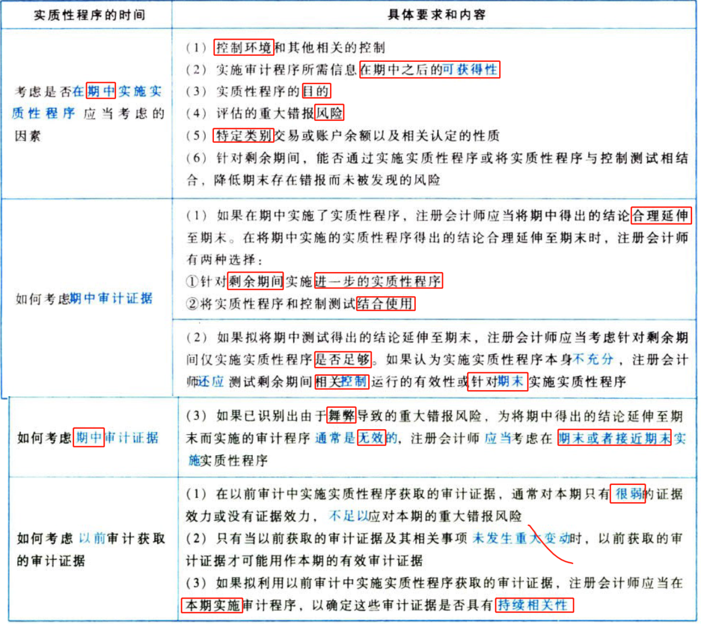

## 4.15. ［考点四］实质性程序的范围:star: 

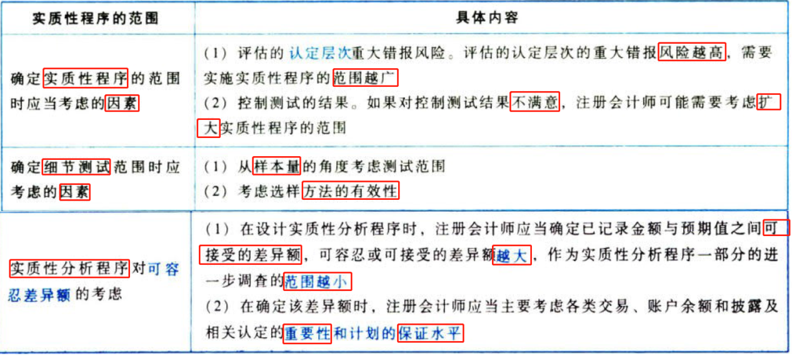

本编是财务报表审计的测试流程，其核心环节是重大错报风险的识别、评估与应对，如图8-5所示。

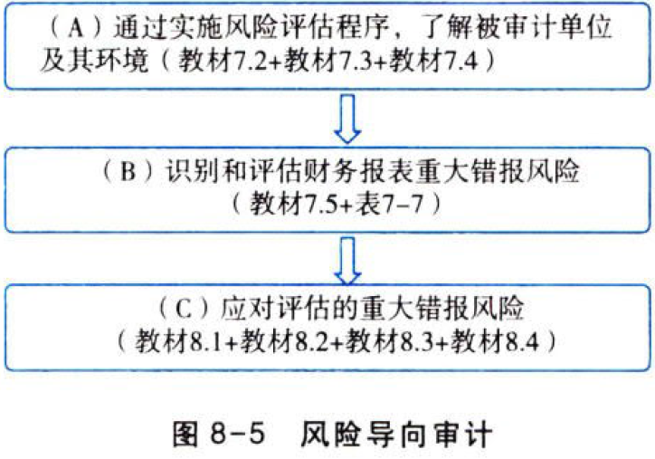

如图8-5所示，注册会计师通过实施风险评估程序（教材7.2），了解被审计单位及其环境（教材7.3、7.4），识别和评估财务报表重大错报风险（教材7.5）；针对评估的财务报表层次重大错报风险制定总体应对情施（教材8.1），针对评估的认定层次重大错报风险设计和实施进一步审计程序（教材8.2），包括实施控制测试（教材8.3）和实质性程序（教材8.4）。

# 5. 总结

End。
