C07风险评估

# 1. 风险识别和评估概述

## 1.1. ［考点一］风险识别和评估的概念:star: 

### 1.1.1. 风险识别和评估的含义

风险识别和评估，是指注册会计师通过实施风险评估程序，识别和评估财务报表层次和认定层次的重大错报风险。其中，风险识别是指找出财务报表层次和认定层次的重大错报风险；风险评估是指对重大错报发生的可能性和后果严重程度进行评估。

### 1.1.2. 风险识别和评估的框架

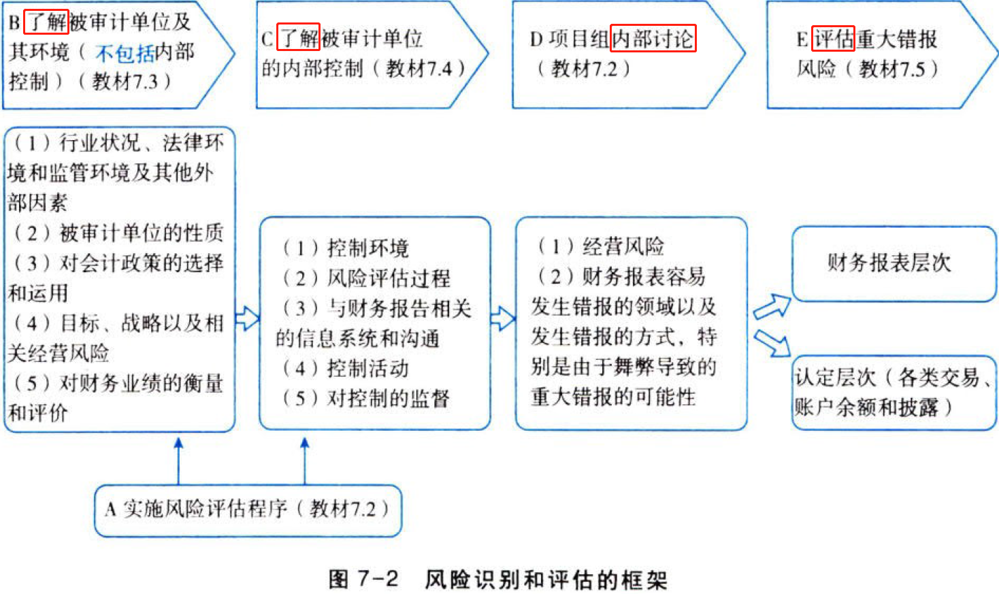

注册会计师通过实施风险评估程序（A），了解被审计单位及其环境（不包括内部控制，B）和了解被审计单位的内部控制（C）；同时，通过项目组内部讨论（D）.评估重大错报风险（E）。

## 1.2. ［考点二］风险识别和评估的作用和要求:star: :star: 

作用：

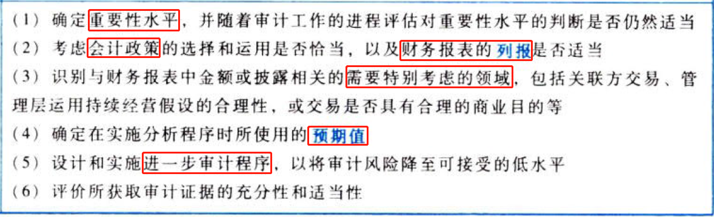

要求：

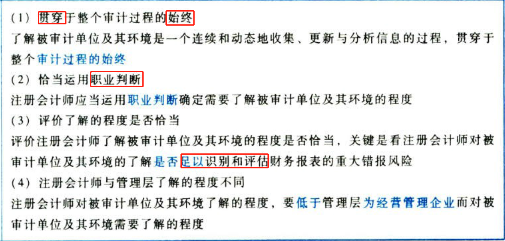

注册会计师通过了解被审计单位及其环境来“识别和评估”财务报表重大错报风险，了解被审计单位及其环境是注册会计师的必要程序。也就是说，如果注册会计师没有通过了解被审计单位及其环境（获取审计证据），则不能评价财务报表整体是否不存在重大错报，不能识别需要特别考虑的领域，不能确定在实施分析程序时所使用的预期值，不能设计和实施进一步审计程序，不能评价所获取审计证据的充分性和适当性等。

# 2. 风险评估程序、信息来源、项目组内部的讨论

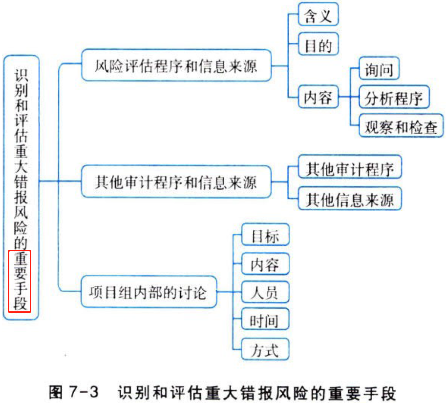

## 2.3. ［考点一］风险评估程序和信息来源:star: :star: 

### 2.3.3. 风险评估程序的含义

风险评估程序是指注册会计师为了解被审计单位及其环境而实施的审计程序。

风险评估程序强调从被审计单位内部获取信息，以了解被审计单位及其环境，识别和评估财务报表的重大错报风险。

### 2.3.4. 风险评估程序的目的

注册会计师实施风险评估程序的目的是为了识别和评估财务报表重大错报风险，包括财务报表层次的重大错报风险和认定层次的重大错报风险。

### 2.3.5. 风险评估程序的内容

#### 2.3.5.1. 询问被审计单位管理层和内部其他相关人员

询问被审计单位管理层和内部其他相关人元是注册会计师了解被审计单位及其环境的一个重要信息来源。具体内容如下表所示。

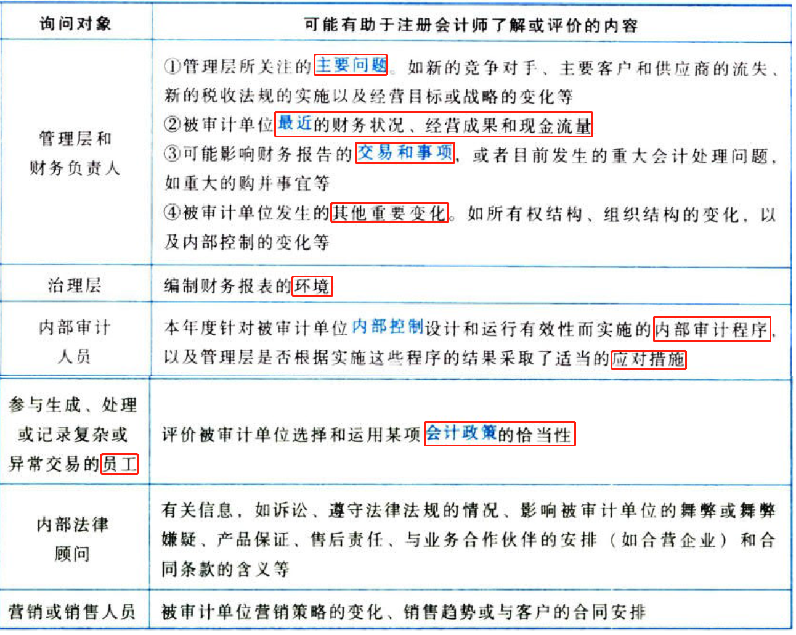

#### 2.3.5.2. 实施分析程序（详细内容链接教材3.4，此处不展开）

#### 2.3.5.3. 观察和检查

（1）观察被审计单位的经营活动。

（2）检查文件、记录和内部控制手册。

（3）阅读由管理层和治理层编制的报告。

（4）实地察看被审计单位的生产经营场所和厂房设备。

（5）追踪交易在财务报告信息系统中的处理过程（穿行测试）。通过追踪某笔或某几笔交易在业务流程中如何生成、记录、处理和报告，以及相关控制如何执行，注册会计师可以确定被审计单位的交易流程和相关控制是否与之前通过其他程序所获得的了解一致，并确定相关控制是否得到执行。

## 2.4. ［考点二］其他审计程序和信息来源:star: 

### 2.4.6. 其他审计程序

#### 2.4.6.4. 其他审计程序的含义

除了采用上述程序从被审计单位内部获取信息以外，如果根据职业判断认为从被审计单位外部获取的信息有助于识别重大错报风险，注册会计师应当实施其他审计程序以获取这些信息。

其他审计程序强调从被审计单位外部获取信息，以了解被审计单位及其环境，识别和评估财务报表的重大错报风险。

#### 2.4.6.5. 其他审计程序的内容

注册会计师应当实施其他审计程序以获取信息，比如：

（1）询问外部人员，包括被审计单位聘请的外部法律顾问、专业评估师、投资顾问和财务顾问等。

（2）阅读外部信息，包括证券分析师、银行、评级机构出具的有关被审计单位及其所处行业的经济或市场环境等状况的报告，贸易与经济方面的报纸期刊，法规或金融出版物，以及政府部门或民间组织发布的行业报告和统计数据等。

### 2.4.7. 其他信息来源

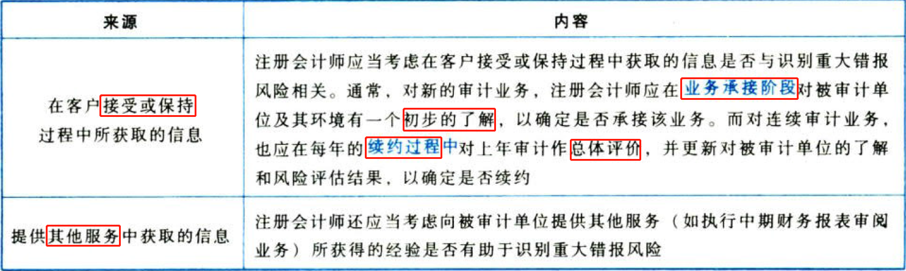

## 2.5. ［考点三］项目组内部的讨论:star: :star: 

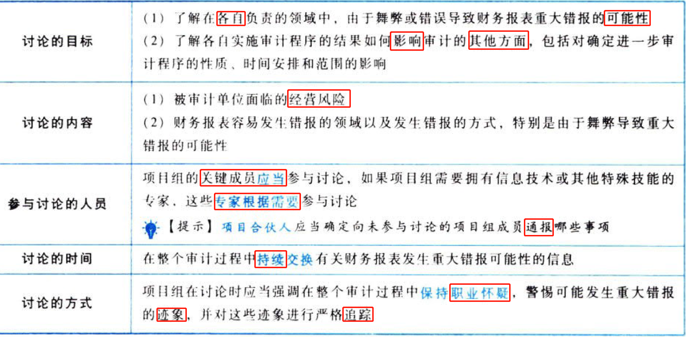

（1）注册会计师在了解被审计单位及其环境的过程中应当开展项目组内部讨论，同时，项目组内部讨论意在整合项目组内部的资源，保持项目组成员的职业谨慎，在确保审计报告质量的同时提高审计效率。

（2）作为项目组内部讨论的一部分，考虑适用的财务报告编制基础中的披露要求，有助于注册会计师在审计工作的早期识别可能存在的与披露相关的重大错报风险领域。

# 3. 了解被审计单位及其环境

## 3.6. ［考点一］了解被审计单位及其环境的内容:star: 

（1）图中的1/6部分，是被审计单位所处行业的外部环境，通常是注册会计师需要了解的关于财务报表重大错报风险识别与评估相关的非财务风险。

（2）图中的2/6至4/6，以及6/6部分，是被审计单位的内部因素。

（3）图中5/6部分，既有外部因素也有内部因素。

（4）图中1/6至6/6部分，它们可能会互相影响，注册会计师在对被审计单位及其环境的各个方面进行了解、识别和评估重大错报风险时，应当考虑各因素之间的相互关系。

## 3.7. ［考点二］行业状况、法律环境、监督环境、其他外部因素（1/6，★）

### 3.7.8. 相关行业状况

了解行业状况有助于注册会计师识别与被审计单位所处行业有关的重大错报风险。

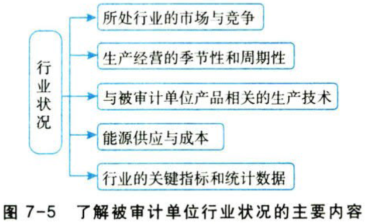

### 3.7.9. 相关法律环境与监管环境

注册会计师应当了解的被审计单位所处的法律环境与监管环境主要包括：

（1）会计原则和行业特定惯例；

（2）受管制行业的法规框架，包括披露要求；

（3）对被审计单位经营活动产生重大影响的法律法规，包括直接的监管活动；

（4）税收政策；

（5）目前对被审计单位开展经营活动产生影响的政府政策，如货币政策、财政政策、财政剌激措施、关税或贸易限制政策等；

（6）影响行业和被审计单位经营活动的环保要求。

### 3.7.10. 了解其他外部因素

注册会计师应当了解的影响被审计单位的其他外部因素主要包括：

（1）总体经济情况；

（2）利率；

（3）融资的可获得性；

（4）通货膨胀水平或币值变动等。

“行业状况、法律环境与监管环境及其他外部因素”是注册会计师应当了解的被审计单位及其环境的外部信息，更多属于“非财务信息”。注册会计师通过了解这些“非财务信息”对比被审计单位的财务数据，识别和评估二者之间是矛盾的还是一致的，以识别和评估财务报表的重大错报风险。该知识点常常在综合题中体现。请链接教材9.5“营业收入”实质性程序的举例。

## 3.8. ［考点三］被审计单位的性质（2/6，★）

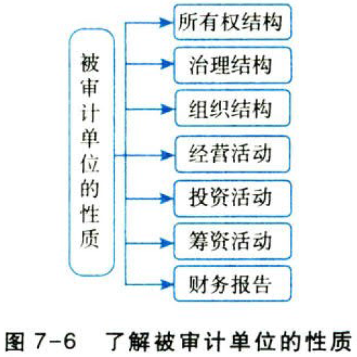

### 3.8.11. 了解所有权结构

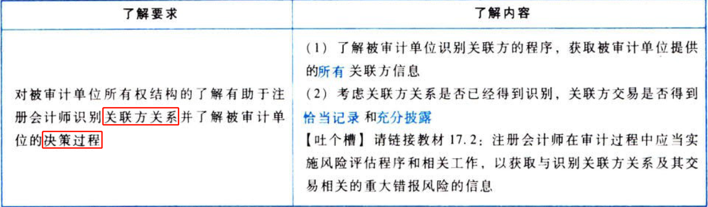

### 3.8.12. 了解治理结构

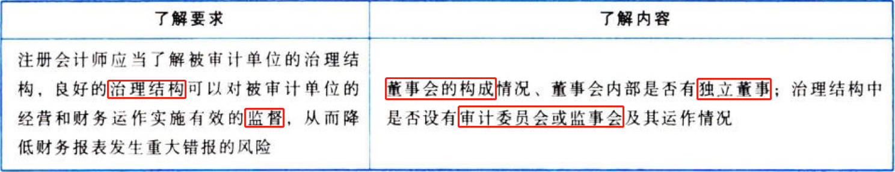

### 3.8.13. 了解组织结构

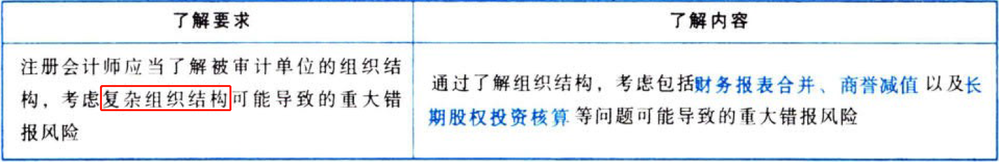

### 3.8.14. 了解经营活动

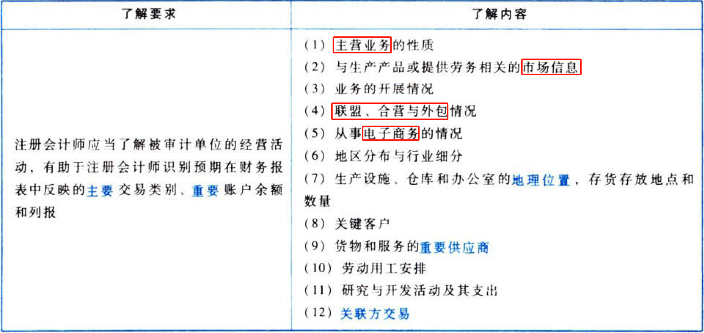

### 3.8.15. 了解投资活动

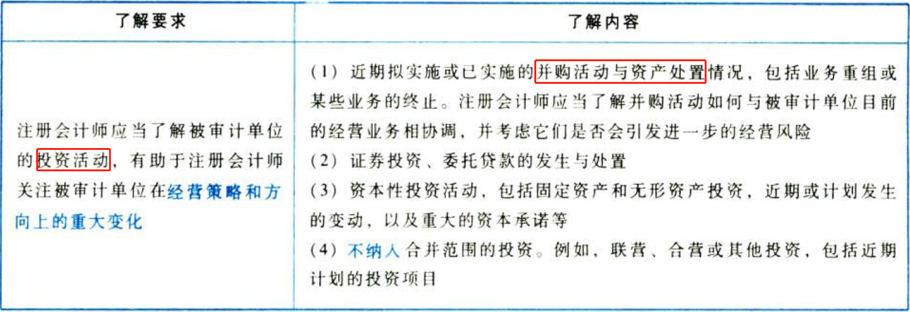

### 3.8.16. 了解筹资活动

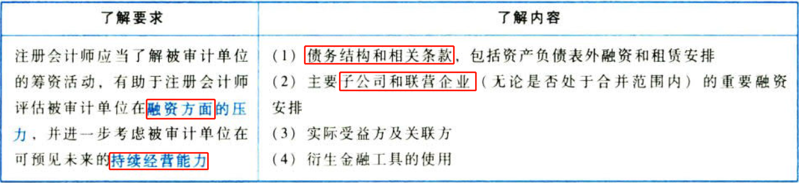

### 3.8.17. 了解财务报告

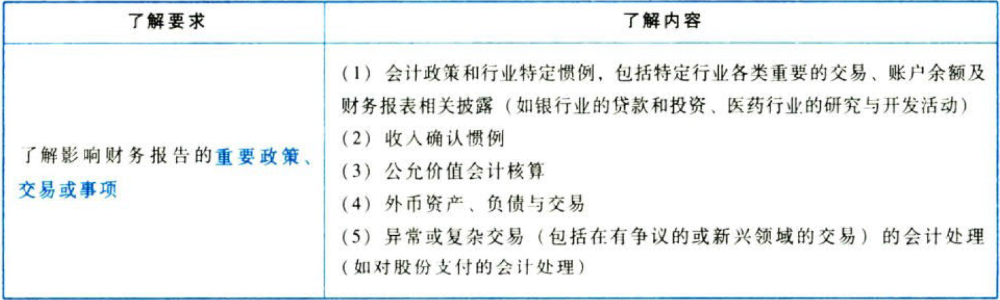

## 3.9. ［考点四］被审计单位对会计政策的选择和运用（3/6，★）

了解被审计单位对会计政策的选择和运用可能包括如下事项：

（1）被审计单位对重大和异常交易的会计处理方法；

（2）在缺乏权威性标准或共识、有争议的或新兴领域采用重要会计政策产生的影响；

（3）会计政策的变更；

（4）新颁布的财务报告准则、法律法规，以及被审计单位何时采用、如何采用这些规定。

除上述与会计政策的选挥和运用相关的事项外，注册会计师还应对被审计单位下列与会计政策运用相关的情况予以关注：

（1）是否采用激进的会计政策、方法、估计和判断；

（2）财会人员是否拥有足够的运用会计准则的知识、经验和能力；

（3）是否拥有足够的资源支持会计政策的运用，如人力资源及培训、信息技术的采用、数据和信息的采集等。

## 3.10. ［考点五］被审计单位的目标、战略以及相关经营风险（4/6，★）

### 3.10.18. 目标、战略与经营风险的含义

（1）目标是企业经营活动的指针。

（2）战略是管理层为实现经营目标采用的总体层面的策略和方法。

（3）经营风险是指可能对被审计单位实现目标和实施战略的能力产生不利影响的重要状况、事项、情况、作为（或不作为）所导致的风险，或由于制定不恰当的目标和战略而导致的风险。

### 3.10.19. 根据有关的目标和战略考虑相应的经营风险

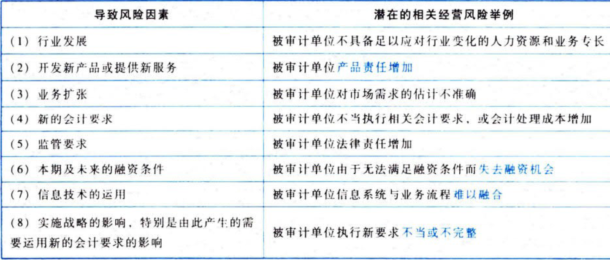

### 3.10.20. 经营风险对重大错报风险的影响

（1）多数经营风险最终都会产生财务后果，从而影响财务报表；

（2）并非所有的经营风险都与财务报表相关，注册会计师没有责任识别或评估对财务报表没有重大影响的经营风险；

（3）经营风险可能对某类交易、账户余额和披露的认定层次重大错报风险或财务报表层次重大错报风险产生直接影响。

## 3.11. ［考点六］对被审计单位财务业绩的衡量和评价（516，★）

### 3.11.21. 了解被审计单位财务业绩衡量和评价情况时，注册会计师应当关注的信息

（1）关键业绩指标（财务或非财务的）、关键比率、趋势和经营统计数据；

（2）同期财务业绩比较分析；

（3）预算、预测、差异分析，分部信息与分部、部门或其他不同层次的业绩报告；

（4）员工业绩考核与激励性报酬政策：

（5）被审计单位与竞争付手的业绩比较。

### 3.11.22. 关注内部财务业绩衡量的结果

（1）关注被审计单位内部财务业绩衡量所显示的未预期到的结果或趋势；

（2）关注管理层的调查结果和纠正措施；

（3）关注相关信息是否显示财务报表可能存在重大错报。

# 4. 了解被审计单位的内部控制

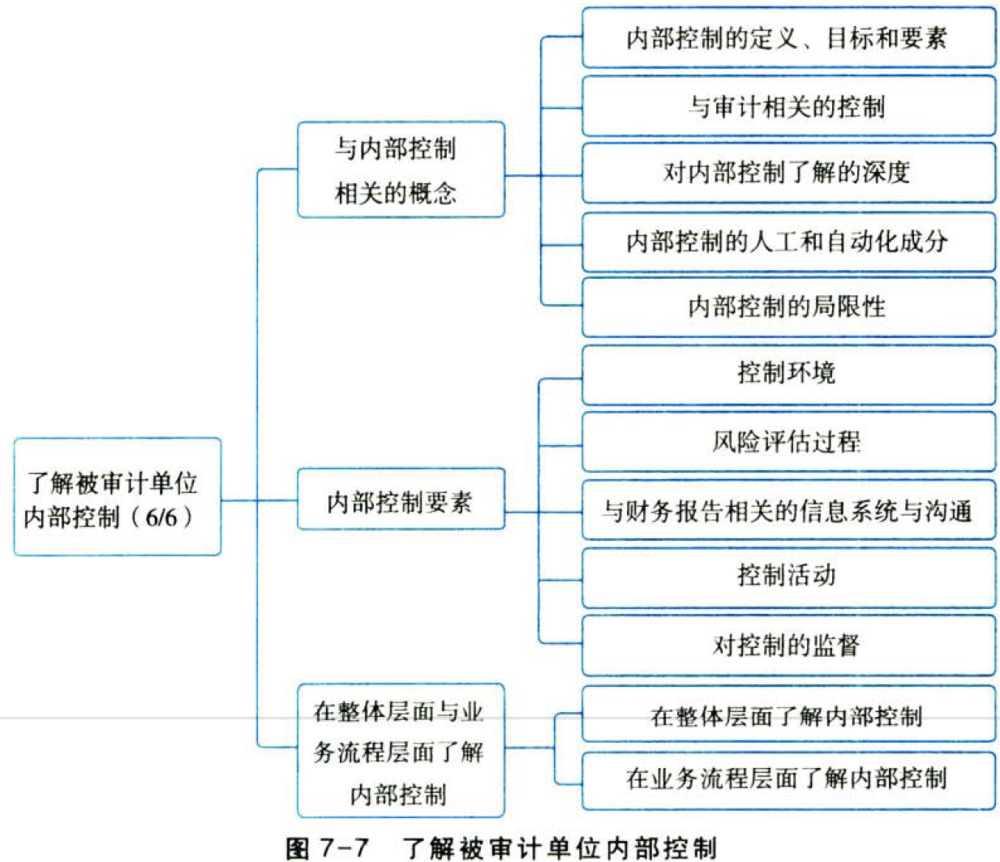

## 4.12. ［考点一］内部控制的定义、目标、要素:star: :star: 

根据审计准则的内部控制定义，内部控制的目标与要素（即“三目标、五要素”）如图7-8所示。

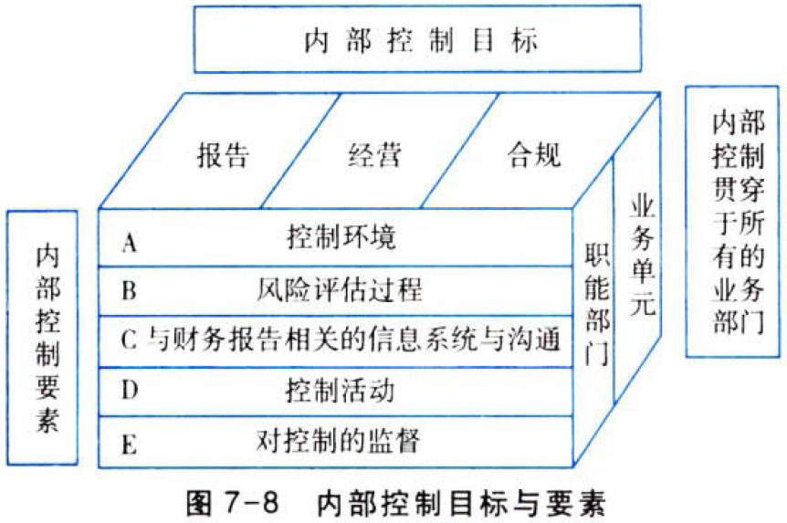

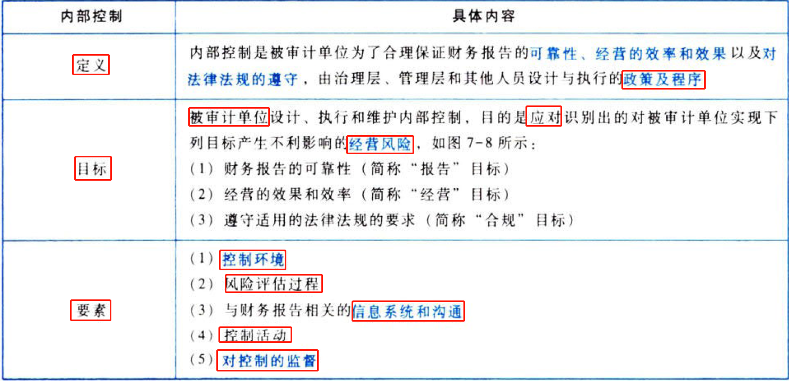

## 4.13. ［考点二］与审计相关的控制:star: :star: :star: 

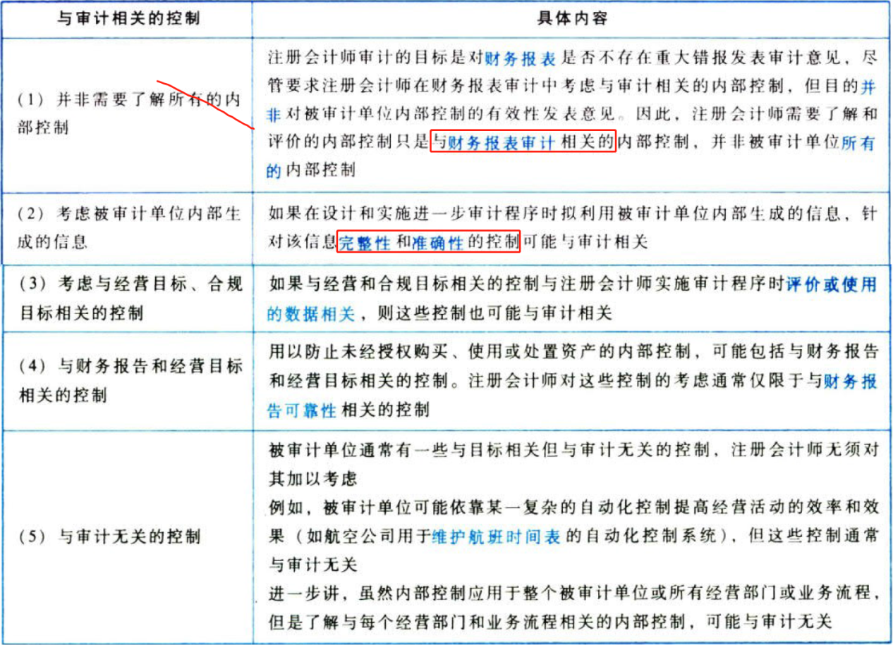

## 4.14. ［考点三］对内部控制了解的深度:star: :star: :star: 

对“内部控制了解的深度”有其特指的内涵，包括两个不可或缺的部分，即：第一，评价控制的设计，第二，确定己设计的内部控制是否得到执行，如图7-9所示。

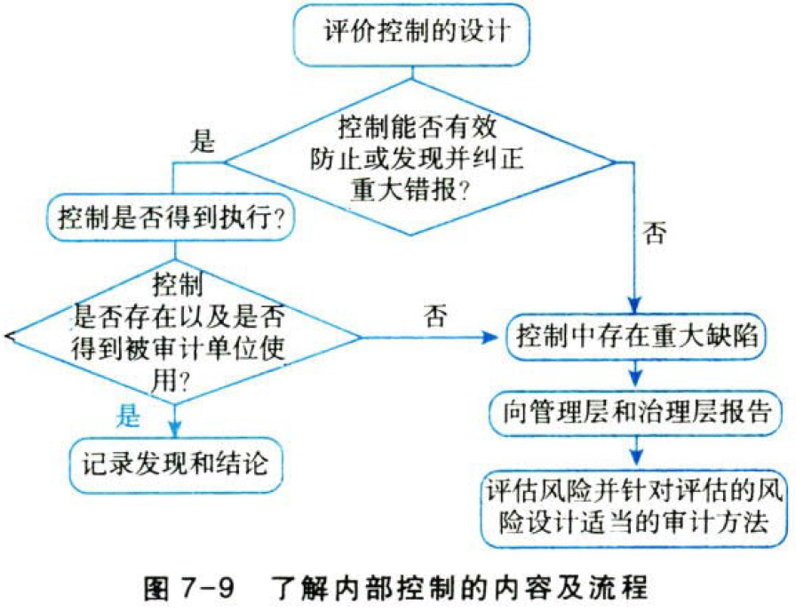

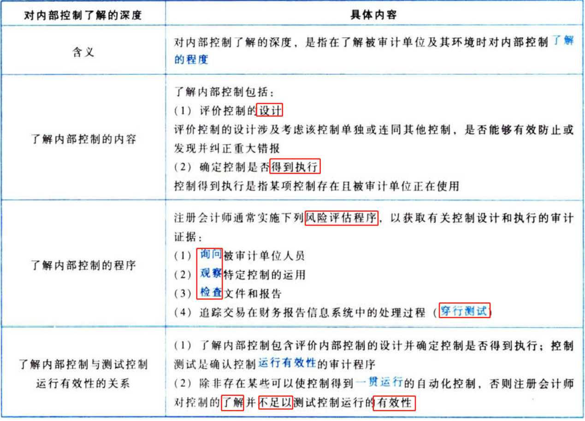

了解内部控制的程序不包括分析程序。

分析程序是通过分析不同财务数据之间以及财务数据与非财务数据之间的内在关系，从而对财务信息作出评价。了解内部控制的目的是评价控制的设计并确认控制是否得到执行，不涉及评价财务信息。

了解“一贯运行的自动化应用控制”有时可以同时达到控制测试的目标。

由于信息技术处理流程的内在一贯性，实施审计程序确定某项自动控制是否得到执行，也可能实现对控制运行有效性测试的目标，这取决于注册会计师对控制（如针对程序变更的控制）的评估和测试。

## 4.15. ［考点四］内部控制的人工和自动化成分:star: :star: 

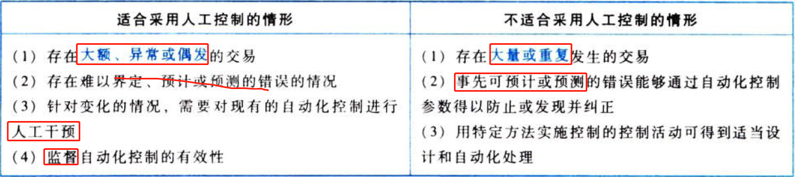

## 4.16. ［考点五］内部控制的局限性:star: :star: 

### 4.16.23. 内部控制的固有限制与合理保证

内部控制无论如何有效，都只能为被审计单位实现财务报告目标提供合理保证。

### 4.16.24. 内部控制的固有限制

内部控制实现目标的可能性受其固有限制的影响。这些限制包括：

（1）在决策时人为判断可能出现错误和因人为失误而导致内部控制失效（主要原因）；

（2）控制可能由于两个或更多的人员串通或管理层不当地凌驾于内部控制之上而被规避（主要原因）；

（3）被审计单位内部行使控制职能的人员素质不适应岗位要求，会影响内部控制功能的正常发挥（其他原因）；

（4）被审计单位实施内部控制的成本效益问题会影响其效能（其他原因）；

（5）内部控制一般都是针对经常而重复发生的业务设置的，如果出现不经常发生或未预计到的业务，原有控制就可能不适用（其他原因）。

## 4.17. ［考点六］控制环境（1/5，★★★）

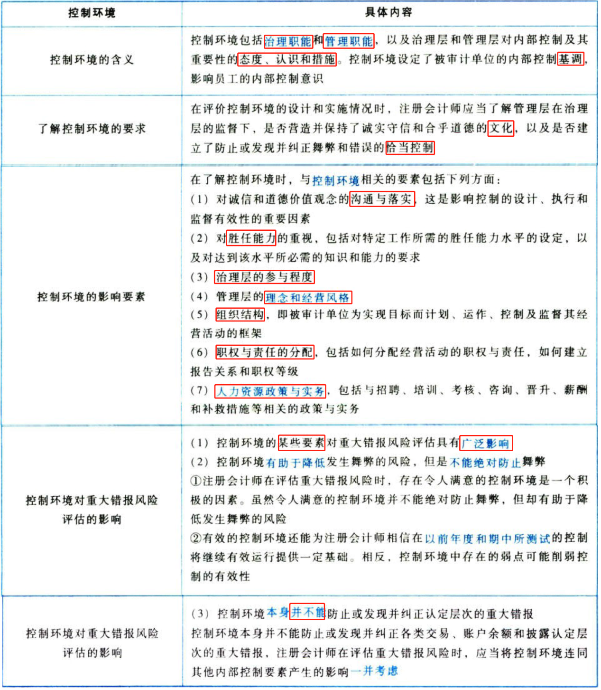

## 4.18. ［考点七］风险评估过程（2/5，★）

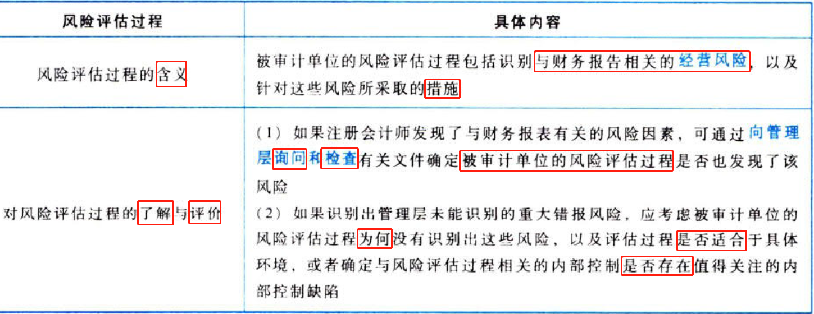

风险评估过程代表了被审计单位的风险意识，影响着管理层对风险的识别和防范。此处的风险评估过程是指被审计单位的，而不是注册会计师实施的风险评估程序。

## 4.19. ［考点八］与财务报告相关的信息系统与沟通（3/5，★）

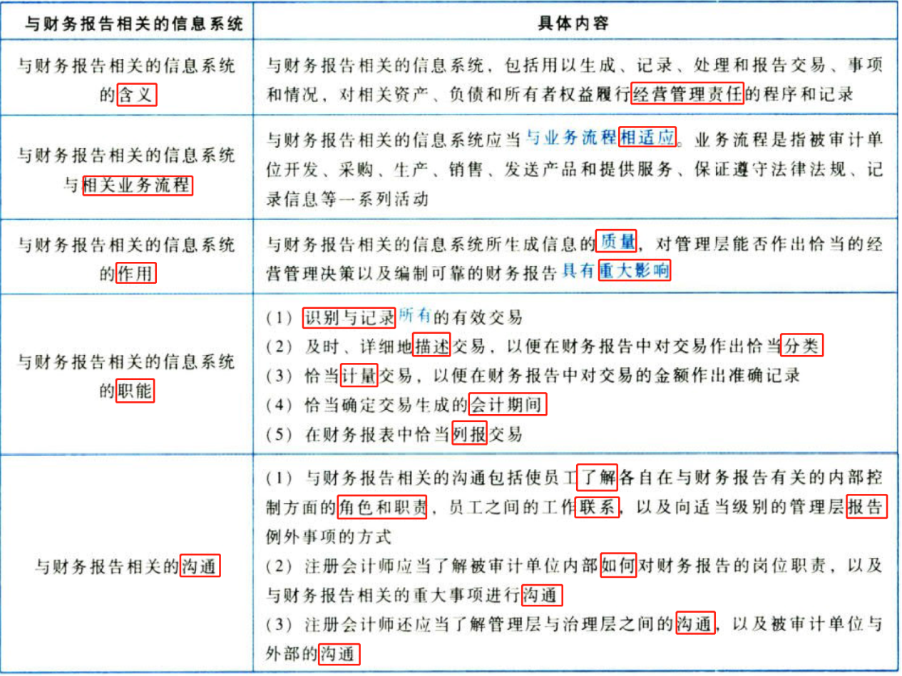

## 4.20. ［考点九］控制活动（4/5，★★）

### 4.20.25. 控制活动的定义

控制活动，是指有助于确保管理层的指令得以执行的政策和程序。包括与授权、业绩评价、信息处理、实物控制和职责分离等相关的活动。

### 4.20.26. 控制活动的要素

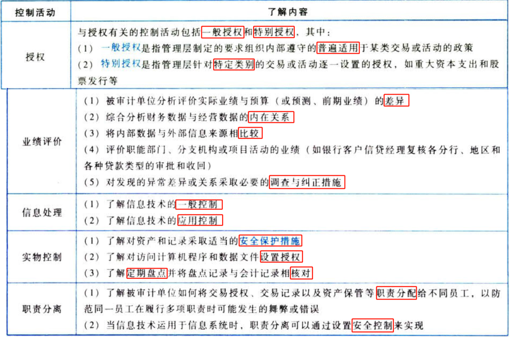

### 4.20.27. 了解控制活动的重点

在了解控制活动时，注册会计师应当重点考虑一项控制活动单独或连同其他控制活动，是否能够以及如何防止或发现并纠正各类交易、账户余额和披露存在的重大错报。

### 4.20.28. 不必了解所有的控制活动

注册会计师的工作重点是识别和了解针对重大错报更高的领域的控制活动。如果多项控制活动能够实现同一目标，注册会计师不必了解与该目标相关的每项控制活动。

## 4.21. ［考点十］对控制的监督（5/5,★）

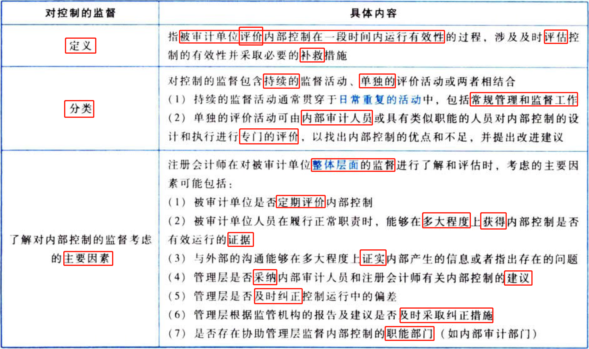

## 4.22. ［考点十一］在整体层面了解内部控制:star: :star: 

如图7-10所示，内部控制要索中，有的更多与整体层面控制相关，比如控制环境、风险评估过程；有的更多与特定业务流程层面相关，比如控制活动。

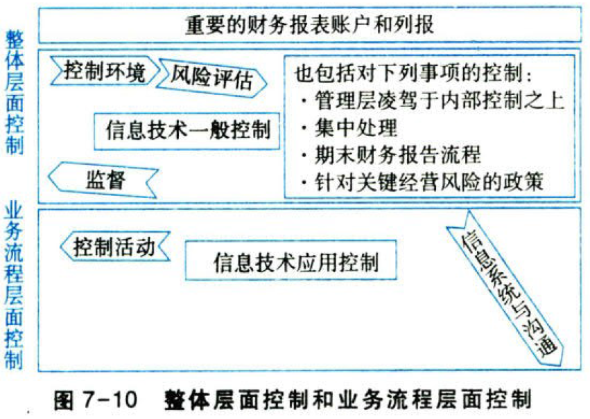

## 4.23. ［考点十二］在业务流程层面了解内部控制:star: :star: :star: 

### 4.23.29. 在业务流程层面了解内部控制的步骤

（1）确定被审计单位的重要业务流程和重要交易类别；

（2）了解重要交易流程，并记录获得的了解；

（3）确定可能发生错报的环节；

（4）识别和了解相关控制；

（5）执行穿行测试，证实对交易流程和相关控制的了解；

（6）进行初步评价和风险评估。

### 4.23.30. 预防性控制vs检查性控制

#### 4.23.30.6. 预防性控制

（1）预防性控制的目的。

预防性控制通常用于正常业务流程的每一项交易，以防止错报的发生。

（2）预防性控制的方式。

预防性控制可能是人工的，也可能是自动化的。

（3）预防性控制的举例。

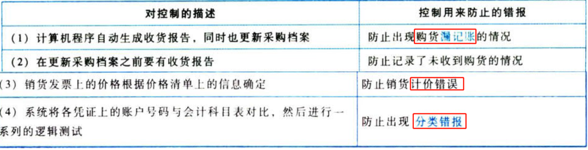

#### 4.23.30.7. 检查性控制

（1）检查性控制的目的。

建立检查性控制的目的是发现流程中可能发生的错报（尽管有预防性控制还是可能会发生错报）。

（2）检查性控制的方式。

检查性控制通常是管理层用来监督实现流程目标的控制，检查性控制可以由人工执行，也可以由信息系统自动执行。

（3）检查性控制的举例。

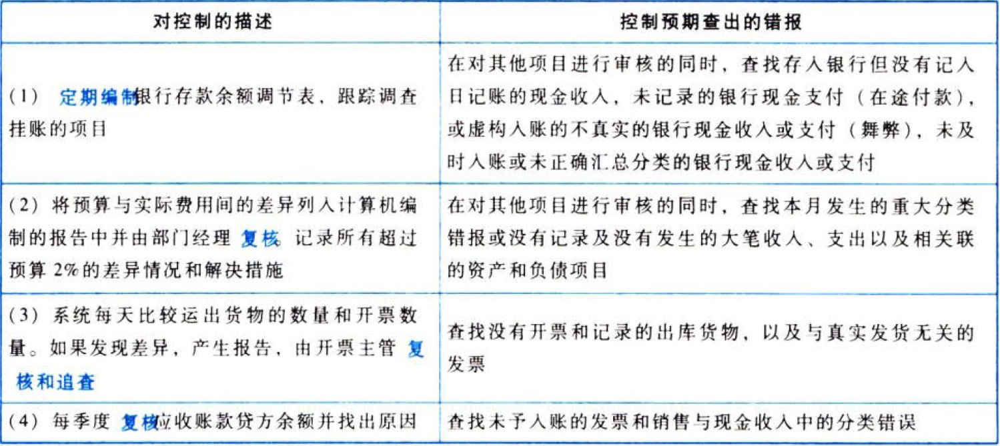

### 4.23.31. 初步评价内部控制

注册会计师通过风险评估程序了解内部控制，获取审计证据，评价控制设计的合理性并确定其是否得到执行。评价结论包括以下三种情形：

（1）所设计的控制单独或连同其他控制能够防止或发现并纠正重大错报，并得到执行；

（2）控制本身的设计是合理的，但没有得到执行；

（3）控制本身的设计就是无效的或缺乏必要的控制。

# 5. 评估重大错报风险

## 5.24. ［考点一］评估财务报表层次和认定层次的重大错报风险:star: :star: 

注册会计师了解被审计单位及其环境，识别和评估的重大错报风险包括财务报表层次和认定层次的重大错报风险，如图7-12所示。

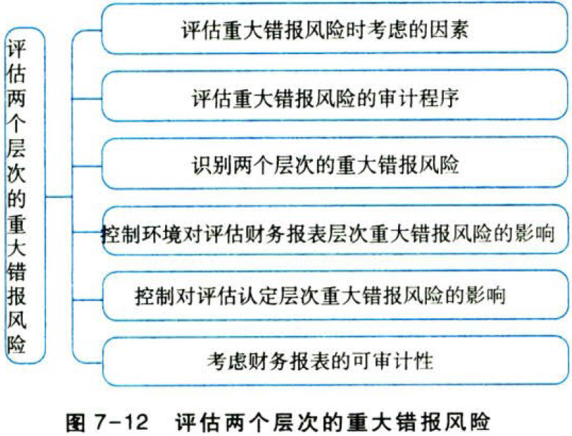

### 5.24.32. 评估重大错报风险时考虑的因素

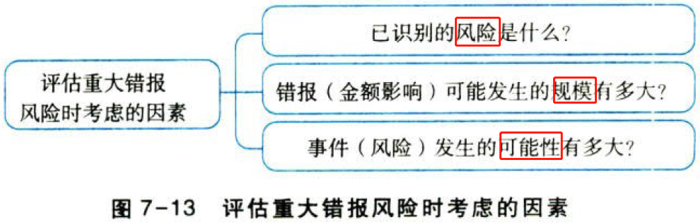

#### 5.24.32.8. 已识别的风险是什么？

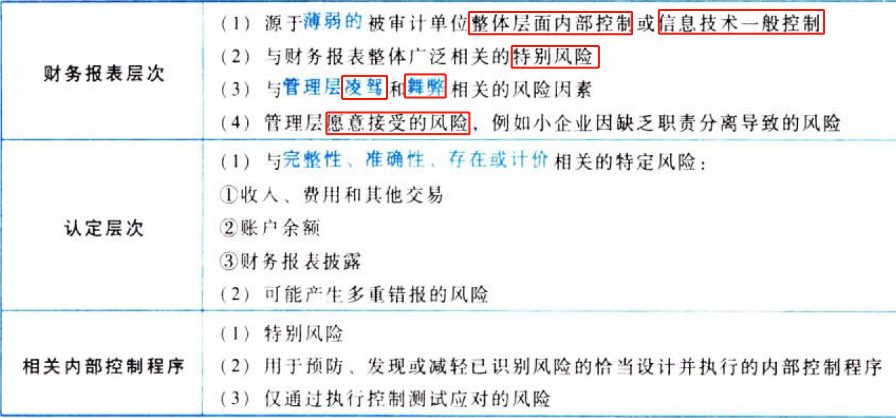

#### 5.24.32.9. 错报（金额影响）可能发生的规模有多大？

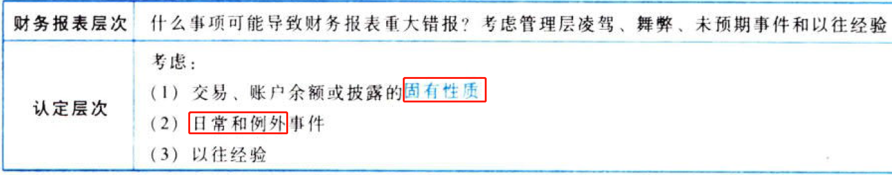

#### 5.24.32.10. 事件（风险）发生的可能性有多大？

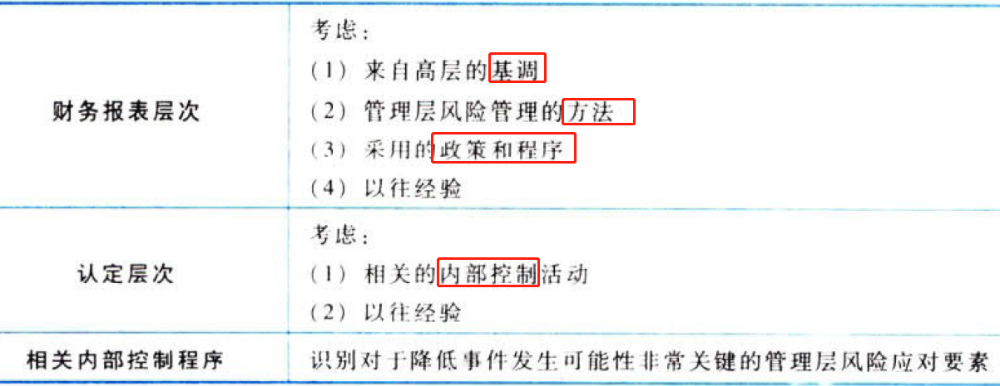

### 5.24.33. 评估重大错报风险的审计程序

在评估重大错报风险时，注册会计师应当实施下列审计程序：

（1）在了解被审计单位及其环境（包括与风险相关的控制）的整个过程中，结合对财务报表中各类交易、账户余额和披露（包括定量披露和定性披露）的考虑，识别风险。

（2）结合对拟测试的相关控制的考虑，将识别出的风险与认定层次可能发生错报的领域相联系。

（3）评估识别出的风险，并评价其是否更广泛地与财务报表整体相关，进而潜在地影响多项认定。

（4）考虑发生错报的可能性（包括发生多项错报的可能性），以及潜在错报的重大程度是否足以导致重大错报。

### 5.24.34. 识别两个层次的重大错报风险

（1）注册会计师应当识别和评估财务报表层次以及各类交易、账户余额和披露的认定层次的重大错报风险。

（2）某些重大错报风险可能与特定的某类交易、账户余额和披露的认定相关。

（3）某些重大错报风险可能与财务报表整体广泛相关，进而影响多项认定。

### 5.24.35. 控制环境对评估财务报表层次重大错报风险的影响

（1）财务报表层次的重大错报风险很可能源于薄弱的控制环境。

（2）薄弱的控制环境带来的风险可能对财务报表产生广泛影响，难以限于某类交易、账户余额和披露，注册会计师应当采取总体应对措施。

### 5.24.36. 控制对评估认定层次重大错报风险的影响

（1）在评估重大错报风险时，注册会计师应当将所了解的控制与特定认定相联系。

（2）控制可能与某一认定直接相关，也可能与某一认定间接相关。关系越间接，控制在防止或发现并纠正认定中错报的作用越小。

### 5.24.37. 考虑财务报表的可审计性

注册会计师在了解被审计单位内部控制后，可能对被审计单位财务报表的可审计性产生怀疑。如果通过对内部控制的了解发现下列情况，并对财务报表局部或整体的可审计性产生疑问，注册会计师应当考虑出具保留意见或无法表示意见的审计报告：

（1）被审计单位会计记录的状况和可靠性存在重大问题，不能获取充分、适当的审计证据以发表无保留意见。

（2）对管理层的诚信存在严重疑虑。

必要时，注册会计师应当考虑解除业务约定。

## 5.25. ［考点二］需要特别考虑的重大错报风险:star: :star: 

### 5.25.38. 特别风险的含义

特别风险，是指注册会计师识别和评估的、根据判断认为需要特别考虑的重大错报风险。

### 5.25.39. 定特别风险时至少应考虑的事项

（1）风险是否属于舞弊风险。

（2）风险是否与近期经济环境、会计处理方法或其他方面的重大变化相关，因而需要特别关注。

（3）交易的复杂程度。

（4）风险是否涉及重大的关联方交易。

（5）财务信息计量的主观程度，特别是计量结果是否具有高度不确定性。

（6）风险是否涉及异常或超出正常经营过程的重大交易。

在进行判断时，注册会计师不应考虑识别出的控制对相关风险的抵销效果。

### 5.25.40. 非常规交易和判断事项导致的特别风险

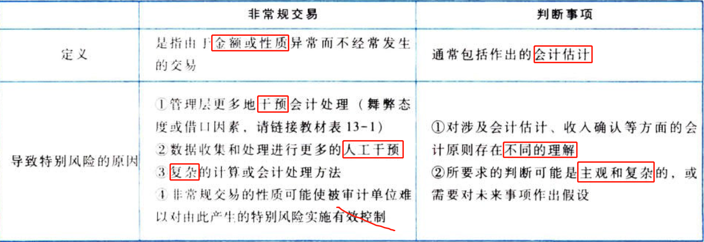

### 5.25.41. 考虑与特别风险相关的控制

（1）了解与特别风险相关的控制，有助于注册会计师制定有效的审计方案予以应对。

（2）对特别风险，注册会计师应当评价相关控制的设计情况，并确定其是否已经得到执行。

（3）由于与重大非常规交易或判断事项相关的风险很少日常控制的约束，注册会计师应当了解被审计单位是否针对该特别风险设计和实施了控制。

（4）如果管理层未能实施控制以恰当应对特别风险，注册会计师应当认为内部控制存在值得关注的内部控制缺陷，并考虑其对风险评估的影响。

## 5.26. ［考点三］仅通过实质性程序无法应对的重大错报风险:star: :star: 

（1）作为风险评估的一部分，如果认为仅通过实质性程序获取的审计证据无法应对认定层次的重大错报风险，注册会计师应当评价被审计单位针对这些风险设计的控制，并确定其执行情况。

（2）在被审计单位对日常交易采用高度自动化处理的情况下，审计证据可能仅以电子形式存在，其充分性和适当性通常取决于自动化信息系统相关控制的有效性，注册会计师应当考虑仅通过实施实质性程序不能获取充分、适当审计证据的可能性。

（3）如果认为仅通过实施实质性程序不能获取充分、适当的宿计证据，注册会计应当考虑依赖的相关控制的有效性，并对其进行了解、评估和测试。

## 5.27. ［考点四］对风险评估的修正:star: :star: 

（1）注册会计师对认定层次重大错报风险的评估，可能随着审计过程中对审计证据的不断获取而作出相应的变化。

（2）如果通过实施进一步审计程序获取的审计证据与初始评估获取的审计证据相矛盾，注册会计师应当修正风险评估结果，并相应修改原计划实施的进一步审计程序。

（3）评估重大错报风险是一个连续和动态地收集、更新与分析信息的过程，贯穿于整个审计过程的始终。

End。
