C01财务管理基本原理

# 1. 企业组织形式和财务管理内容

财务管理是对资金的管理，是经济管理的重要领域之一。

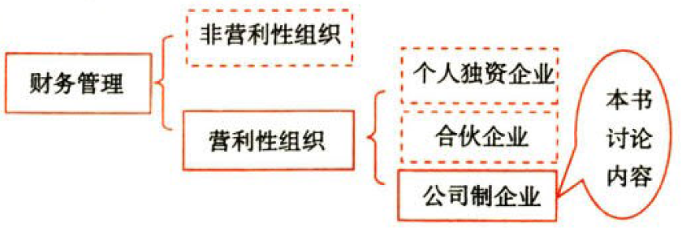

## 1.1. 企业的组织形式:star: 

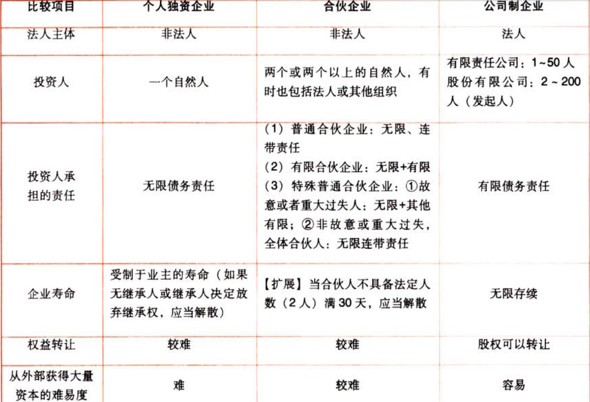

## 1.2. 财务管理的主要内容:star: 

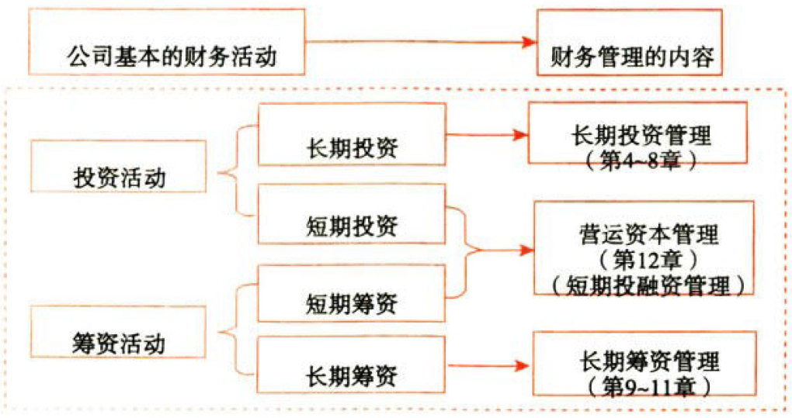

### 1.2.1. 长期投资

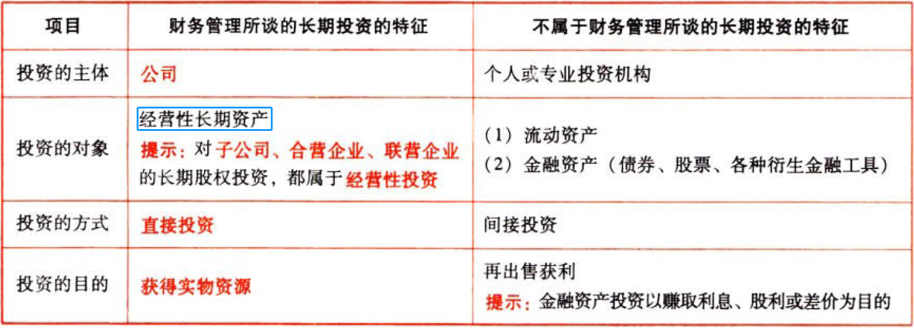

### 1.2.2. 长期筹资

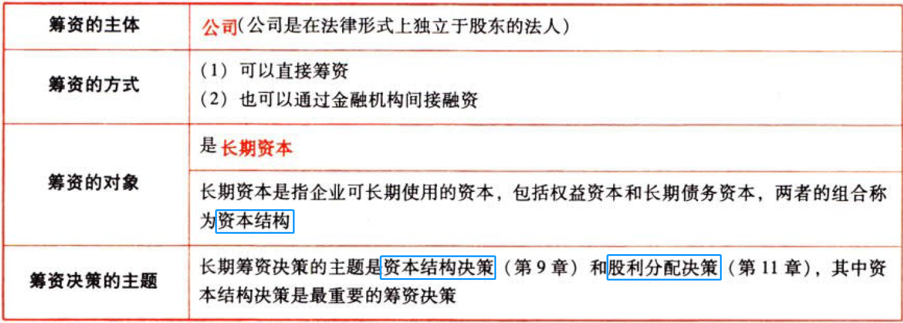

区分直接和间接：

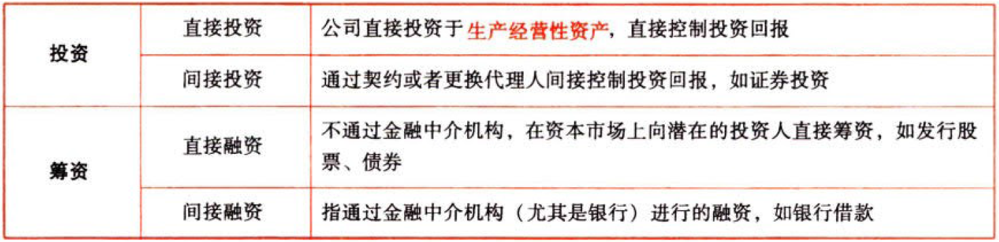

### 1.2.3. 营运资本管理

属于短期投融资决策，主要包括营运资本`投资`政策和营运资本`筹资`政策。将在教材的第

12章详细介绍。

# 2. 财务管理的目标与利益相关者的要求

## 2.3. 财务管理的目标:star: :star: :star: 

### 2.3.4. 影响因素


### 2.3.5. 主要的财务管理目标

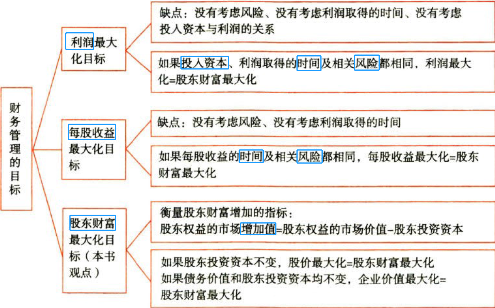

```
股东财富＝股权市场价值＝股价×股数
Δ股东财富＝Δ股权市场价值（股东权益的市场增加值）
＝股权市场价值－股东投资资本（1）
＝(企业价值－债务市场价值)－股东投资资本（2）
```
（1）只有在`股东投资资本`不变时，`股价上涨`才与`Δ股东财富`具有同等意义，即股东财富最大化可以表述为股价最大化

（2）在债务市场价值不变、股东投资资本不变的情况下，`企业价值`最大化与`Δ股东财富`具有同等意义

而股价受`未来收益`和`风险`的影响.即股东财富最大化考虑了利润的取得时间和风险

## 2.4. 利益相关者的要求:star: :star: :star: 

### 2.4.6. 经营者的利益要求与协调

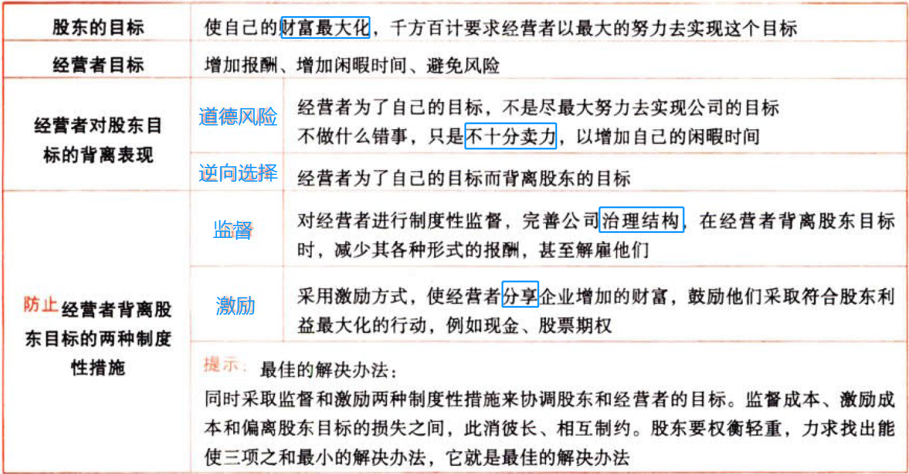

### 2.4.7. 债权人的利益要求与协调

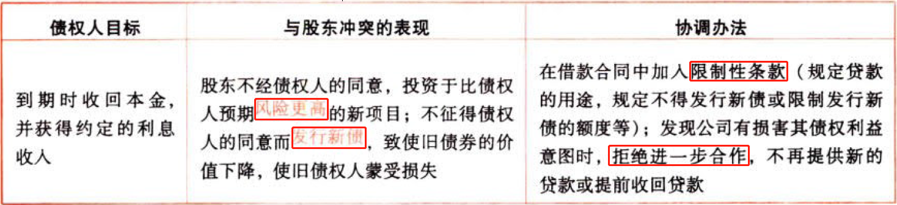

### 2.4.8. ）其他利益相关者的利益要求与协调

#### 2.4.8.1. 含义


#### 2.4.8.2. 利益相关者的分类

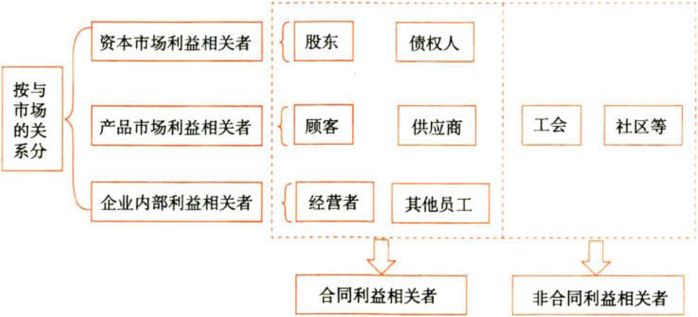

#### 2.4.8.3. 协调


# 3. 财务管理的核心概念和基本理论

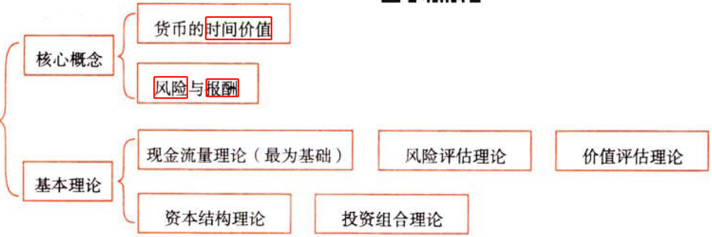

# 4. 金融工具与金融市场

## 4.5. 金融工具的类型:star: :star: 

金融工具，是指形成一方的金融资产并形成其他方的金融负债或权益工具的合同。

金融工具包括股票、债券、外汇、保单等。公司可以借助金融工具进行筹资和投资。

### 4.5.9. 金融工具的特征


### 4.5.10. 金融工具的种类

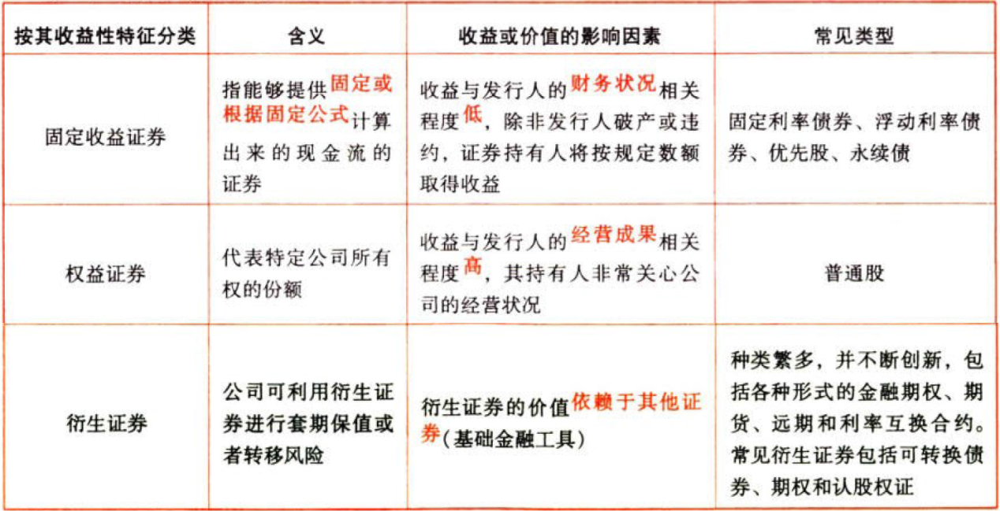

## 4.6. 金融市场的类型:star: :star: :star: 

### 4.6.11. 货币市场和资本市场

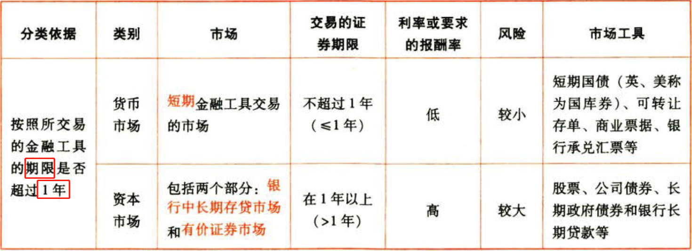

### 4.6.12. 其他分类


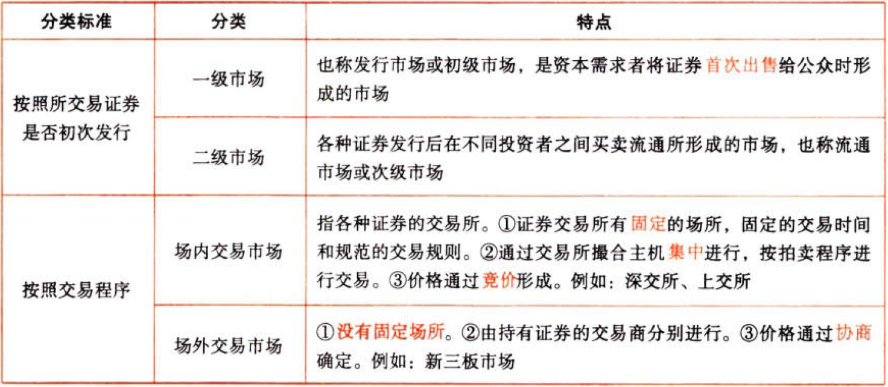

场外市场（例如纳斯达克）竞争充分，与有组织的交易所并无多大差别。

## 4.7. 资本市场效率:star: :star: :star: 

### 4.7.13. 资本市场效率的意义

#### 4.7.13.4. 有效资本市场的含义


#### 4.7.13.5. 资本市场有效的基础条件

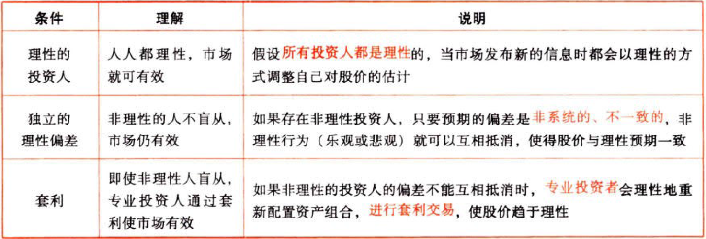

三个条件只要有一个存在，资本市场就会是有效的。

#### 4.7.13.6. 有效资本市场对财务管理的意义

（1）管理者改变会计方法不会提升企业的股票价值。

（2）金融投机不能使企业获利。

（3）关注自身股价对企业是有益的。

### 4.7.14. 资本市场的分类

这里的历史信息指历史交易信息，与证券价格、交易量等有关的历史信息。

这里的公开信息是指公司公布的财务报告等信息，以及政府和有关机构公布的相关政策信息。

这里的内幕信息是指没有发布的，只有大股东、董事会成员、监事会成员、公司高管成员以及有能力接触内部信息的人士知悉的信息。

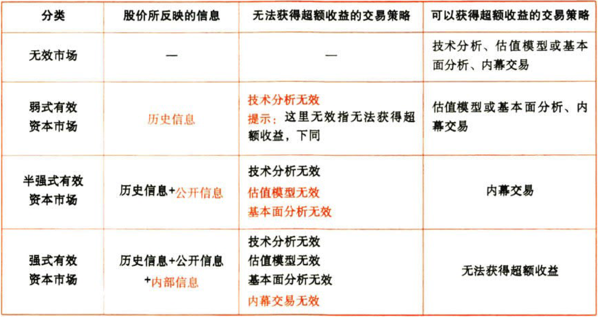

### 4.7.15. 资本市场有效性的检验

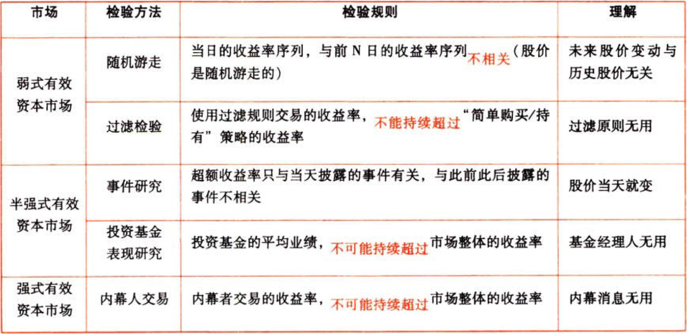

# 5. 总结

End。
