C02财务报表分析和财务预测

# 1. 财务报表分析的目的与方法

## 1.1. 财务报表分析的目的:star: 

将财务报表数据转换成对相关决策者`有用`的信息，以改善`决策`。

## 1.2. 财务报表分析的方法:star: :star: :star: 

### 1.2.1. 比较分析法

对两个或两个以上有关的`可比数据`进行对比，从而揭示趋势或差异的一种分析方法。

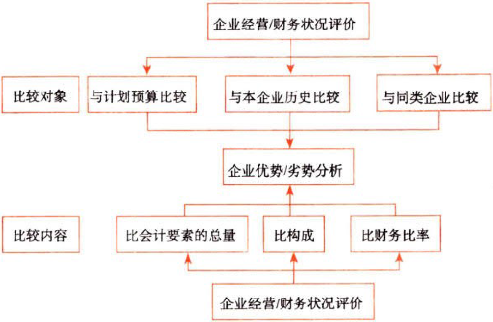

### 1.2.2. 因素分析法

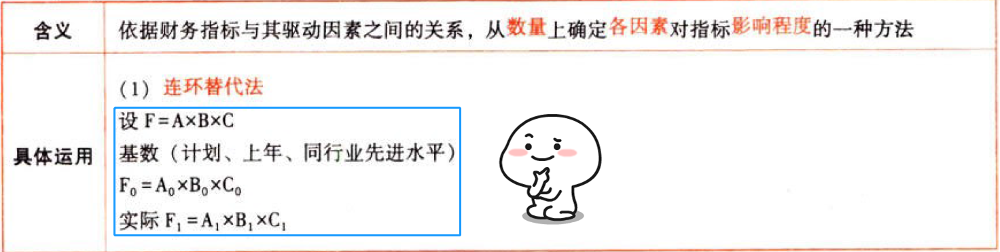

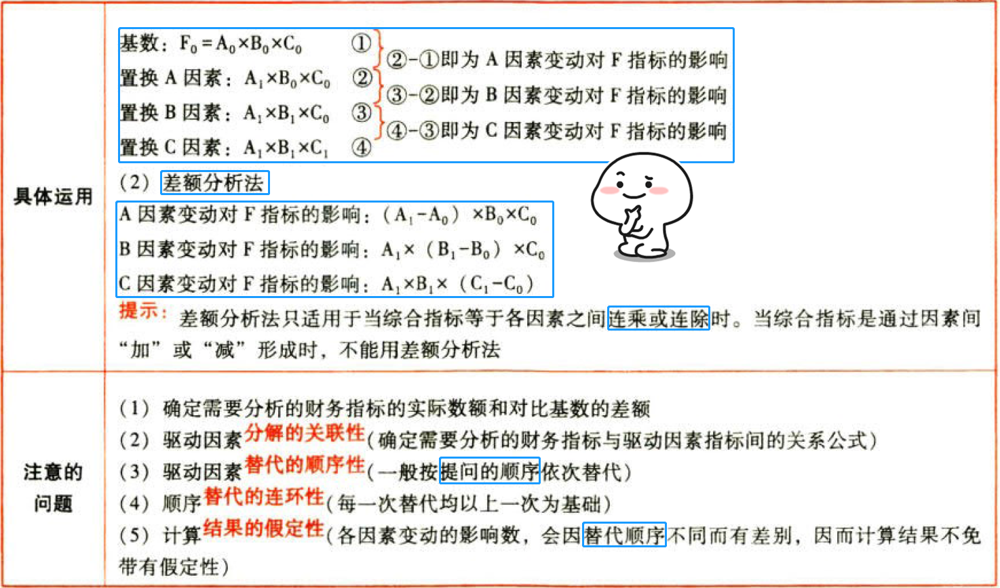

# 2. 财务比率分析

## 2.3. 提示

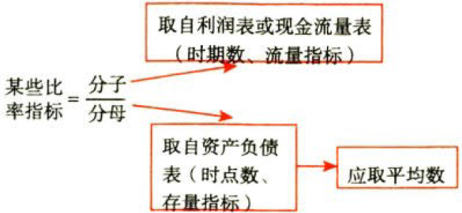

在指标计算中，分子、分母的时间特征必须一致。即同为时点指标，或者同为时期指标。

若一个为时期指标，另一个为时点指标，则按理说应该把时点指标调整为时期指标，调整的方法是计算时点指标的平均值，可以按月平均，也可按年平均即年初与年末的平均数。

此外，为了简便，也可以使用期末数。

教材均采取简化方法，通常情况下，考试时客观题都按`平均数`计算，特别是季节性经营的企业应按多个时点的平均数计算，如按月平均；主观题中会给出要求，如要求用平均数，就用平均数，要求周期末数，就用期末数，如果没有给出要求，原则上应按平均数计算。


凡指标中涉及的`现金流量`，均为`经营活动现金流量净额`。

## 2.4. 短期偿债能力比率:star: :star: :star: 【偿还／流动负债】

### 2.4.3. 表内指标

```
流动比率＝流动资产／流动负债
速动比率（酸性测试比率）＝速动资产／流动负债
现金比率＝货币资金／流动负债
```
速动资产：货币资金＋交易性金融资产＋应收款项等

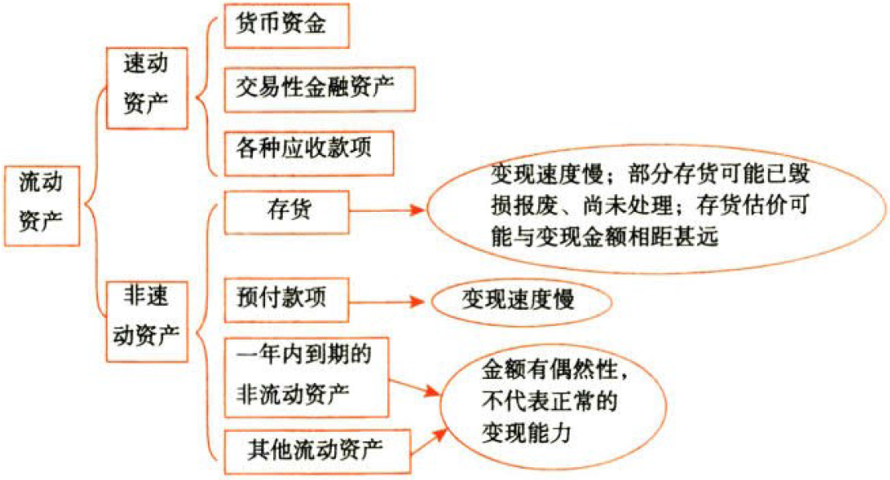

不存在统一、标准的流动比率数值，不同行业的指标没有可比性。

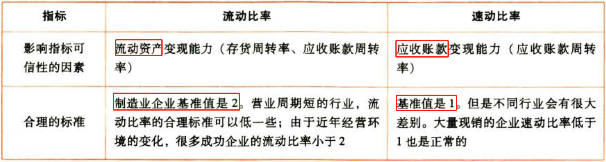

```
现金流量比率＝现金流量／流动负债
```
流动负债采用`期末数`，因为实际需要偿还的是期末金额，而非平均金额。

```
营运资本＝真·流动资产
＝流动资产－流动负债
＝长期资本－长期资产
营运资本配置比率＝营运资本／流动资产
```
1／流动比率＋营运资本配置比率＝1

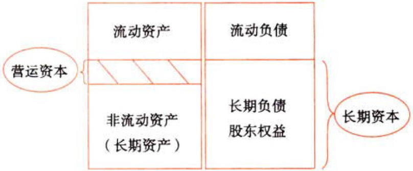

（1）营运资本的数额越大，财务状况越稳定

（2）营运资本是`绝对数`，不便于不同历史时期及不同企业之间的比较，而用`营运资本配置比率`、`流动比率`更加合理

营运资本配置比率与流动比率是同方向变化的。

### 2.4.4. 影响短期偿债能力的其他因素（表外因素）

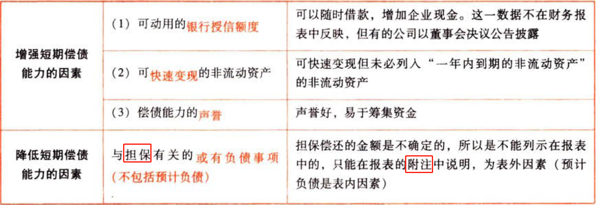

## 2.5. 长期偿债能力比率:star: :star: :star: 【负债占比】

### 2.5.5. 表内指标

```
资产负债率＝总负债／总资产
```
广义资本结构。资产负债率衡量企业清算时对债权人利益的保障程度。资产负债率越低，企业偿债越有保证，贷款越安全。

```
长期资本负债率＝非流动负债／(非流动负债＋股东权益)
```
狭义资本结构。长期资本负债率反映公司`资本结构`。

```
产权比率＝总负债／股东权益
权益乘数＝总资产／股东权益
现金流量与负债比率＝现金流量／总负债
利息保障倍数＝息税前利润／利息费用
＝(净利润＋利息费用＋所得税费用)／利息费用
＝(给股东＋给债主＋给政府)／利息费用
```
分子的利息费用＝利润表中财务费用里的利息费用【费用化】

分母的利息费用＝利润表中财务费用里的利息费用【费用化】＋计入资产负债表固定资产等成本的资本化利息【资本化】

利息保障倍数的基准是1。

利息保障倍数＜1，表明自身产生的经营收益不能支持现有规模的债务。

利息保障倍数等于1也很危险，因为息税前利润受经营风险的影响，是不稳定的，而支付利息却是固定的。

```
现金流量利息保障倍数＝现金流量／利息费用
```
分母的利息费用＝利润表中财务费用里的利息费用【费用化】＋计入资产负债表固定资产等成本的资本化利息【资本化】

与利润基础的利息保障倍数相比，其衡量利息偿付安全性`更可靠`。

### 2.5.6. 影响长期偿债能力的其他因素（表外因素）


## 2.6. 营运能力比率:star: :star: :star: 【利用资产创造收入的效率】

```
流动资产周转率＝营业收入／流动资产
```
通常，流动资产中`应收账款`和`存货`占绝大部分，因此它们的周转状况对流动资产周转具有决定性影响。

```
应收账款周转率＝营业收入／应收账款
```
计算时应使用`赊销额`而非营业收入。但是，外部分析人员无法在财务报表内取得公司的赊销数据，只好直接使用营业收入作为替代进行计算，导致了应收账款周转率被高估。

在用应收账款周转率进行业绩评价时，可以使用年初和年末的`平均数`、或者使用多个时点的平均数，以减少季节性、偶然性或人为因素的影响。

报表上的应收账款金额是扣除坏账准备后的金额。如果坏账准备的金额较大，就应进行调整，或者使用未计提坏账准备的应收账款计算周转天数、周转率。

应收账款是赊销引起的，如果赊销有可能比现金销售更有利，周转天数就不是越少越好。

应收账款日益增加，而现金日益减少，则可能是赊销出了比较严重的问题。

```
存货周转率＝营业收入（或营业成本）／存货
```
在短期偿债能力分析中，为了评估资产的`变现能力`以及`分解总资产`周转率时，应统一使用`“营业收入”`计算周转率。

如果是为了评估`存货管理的业绩`，应当使用`“营业成本”`计算存货周转率。

存货周转天数不是越少越好：存货必须满足`流转需要`。

应注意应付账款、存货和应收账款（或营业收入）之间的关系：企业接受`大的订单`时，通常要先地加存货，然后推动应付账款增加，最后才引起应收账款（营业收入）增加。

应关注构成存货的原材料、在产品、半成品、产成品和低值易耗品之间的比例关系：如果产成品大量增加，其他项目减少，很可能是销售不畅，生产放慢。

如果前端存货（原材料）占比地加，说明大额订单主动采购，预示着未来的销售增长；如果后端（产成品）占比增加，说明销路不畅，产品积压。

```
营运资本周转率＝营业收入／营运资本
非流动资产周转率＝营业收入／非流动资产
```
主要用于`投资预算`和`项目管理`，以确定投资与竞争战略是否一致，收购和剥离政策是否合理等。

```
总资产周转率＝营业收入／总资产
总资产与收入比＝总资产／营业收入
总资产周转天数＝365×总资产／营业收入
＝总资产全部变成收入，需要多久？
```
总资产是由各项资产组成，在营业收入既定的条件下，总资产周转率的驱动因素是各项资产。总资产周转率的驱动因素分析，通常使用“总资产周转天数”或“总资产与收入比”指标，不使用“总资产周转率”。

## 2.7. 盈利能力比率:star: :star: 

```
营业净利率＝净利润／营业收入
```
营业净利率的变动，是由利润表各个项目变动引起的。

驱动因素分析包括`金额`变动分析和`结构`变动分析。

```
总资产净利率＝净利润／总资产
＝(净利润／营业收入)×(营业收入／总资产)
＝营业净利率×总资产周转率
```
影响总资产净利率的驱动因素是营业净利率和总资产周转率

```
权益净利率＝净利润／股东权益
```
## 2.8. 市价比率:star: :star: :star: 

上市公司有两个特殊的财务数据，一是股数，二是市价。它们是一般企业所没有的。股数、市价与净收益、净资产、营业收入进行比较，可以提供有特殊意义的信息。

```
每股收益＝(净利润－优先股股息)／流通在外普通股加权平均数
市盈率＝每股市价／每股收益
每股净资产（每股账面价值）＝普通股股东权益／流通在外普通股股数
市净率＝每股市价／每股净资产
每股营业收入＝营业收入／流通在外普通股加权平均数
市销率＝每股市价／每股营业收入
```
净利润中要减去当年宣告或积累的优先股股息，但不要减普通股股利。

净资产要减去优先股权益（包括优先股清算价值和拖欠股利）。

每股收益因为分子净利润是时期数，因此教材公式分母要取加权平均数，按时间加权（了解），实践中，每股收益有`加权平均`和`全面摊薄`（按期末股份数来计算）两种口径。

每股净资产的分子普通股股东权益是账面价值，是一个时点数值，因此分母按期末股份数来计算。

市盈率反映了投资者对公司未来前景的预期。

市净率说明市场对公司净资产质量的评价。

市价比率指标将在第8章企业价值评估的相对价值评估模型中进一步应用。

## 2.9. 杜邦分析体系:star: :star: :star: 

### 2.9.7. 杜邦分析体系的核心比率

```
权益净利率＝总资产净利率×权益乘数
＝营业净利率×总资产周转率×权益乘数
＝盈利能力×营运能力×偿债能力
```
`权益净利率`是分析体系的核心比率。

本章第四节的`可持续增长率`的计算与应用要利用社邦分析体系的核心公式。

### 2.9.8. 杜邦分析体系的基本框架

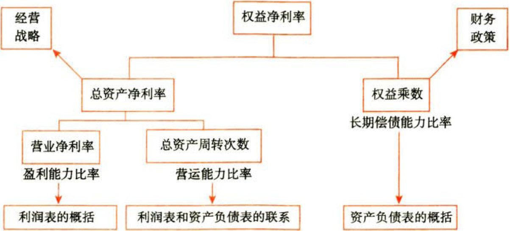


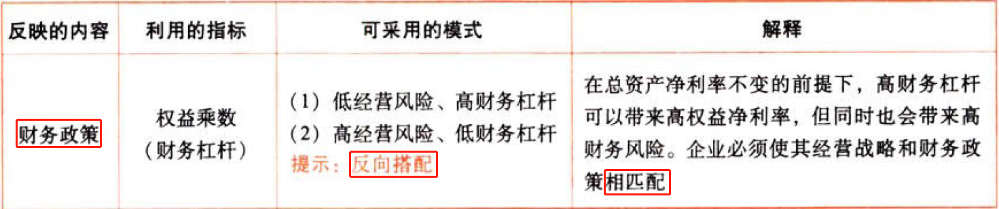

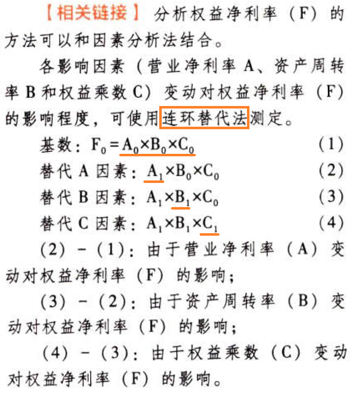

### 2.9.9. 杜邦分析体系的局限性

（1）计算总资产净利率的“总资产”与“净利润”不匹配。总资产为全部资产提供者享有，而净利润则专属于股东，两者`不匹配`。

（2）没有区分`经营`活动损益和`金融`活动损益。

（3）没有区分`金融资产`与`经营资产`。

（4）没有区分`金融负债`与`经营负债`。

## 2.10. 管理用财务报表体系:star: :star: :star: 

### 2.10.10. 总体思路

#### 2.10.10.1. 1.财务管理对企业活动的分类


#### 2.10.10.2. 2.基本框架


### 2.10.11. 管理用资产负债表【做事债主+股东】

#### 2.10.11.3. I.资产、负债的区分

经营资产，是指`销售商品或提供劳务`所涉及的资产。

经营负债，是指`销售商品或提供劳务`所涉及的负债。

金融资产，是利用经营活动多余资金进行`投资`所涉及的资产。

金融负债，是指债务`筹资`活动所涉及的负债。

##### 2.10.11.3.1. 货币资金

货币资金本身是金融资产，但是有一部分货币资金是经营活动所必需的。

以往考试有三种做法：第一种做法是将全部”货币资金”列为经营资产；第二种做法是根据行业或公司历史平均的`货币资金／营业收入`百分比以及本期`销售额`，推算经营活动需要的货币资金数额，多余部分列为金融资产；第三种做法是将其全部列为金融资产。

在编制管理用资产负债表时，考试会明确指明采用哪一种处理方法。

##### 2.10.11.3.2. 投资、股利、利息

`长期权益性投资`（长期股权投资）属于经营资产。

长期权益性投资的应收股利属于经营资产。

`其他应收款`中扣除应收股利、应收利息的部分属于经营资产。

短期权益性投资属于金融资产。

短期权益性投资（已经划分为金融项目）形成的应收股利，属于金融资产。

其他应收款中的应收利息属于金融资产。

债权投资、其他债权投资、其他权益工具投资、投资性房地产属于金融资产。

##### 2.10.11.3.3. 债务筹资

债务筹资活动所涉及的负债是金融负债，包括短期借款、长期借款、应付债券、一年内到期的非流动负债等。

除金融负债以外的其他所有负债，均属于经营负债。

##### 2.10.11.3.4. 优先股

从普通股股东角度看，优先股应属于金融负债。

##### 2.10.11.3.5. 其他应付款

其他应付款中的应付利息和应付股利（包括优先股的应付股利和普通股的应付股利），均为筹资活动的应计费用，因此属于金融负债。

`其他应付款`扣除应付利息、应付股利的部分属于经营负债。

##### 2.10.11.3.6. 租赁

租赁引起的租赁负债属于金融负债。

#### 2.10.11.4. 2.基本等式

```
净经营资产＝净负债＋股东权益
```
#### 2.10.11.5. 3.管理用资产负债表

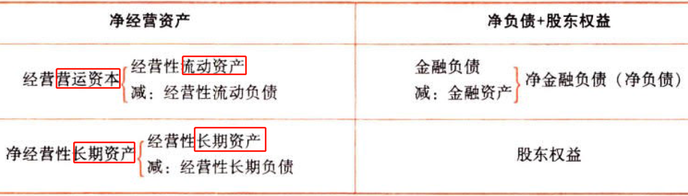

金融资产是超过实际生产经营需要的投资，可以抵消金融负债，被看成“负的金融负债”。

### 2.10.12. 管理用利润表【股东所得】

#### 2.10.12.6. 1.金融损益

```
金融损益＝金融资产收益－金融负债利息
＝金融资产.公允价值变动收益＋金融资产.投资收益－财务费用
管理用利润表.利息费用＝－金融损益
```
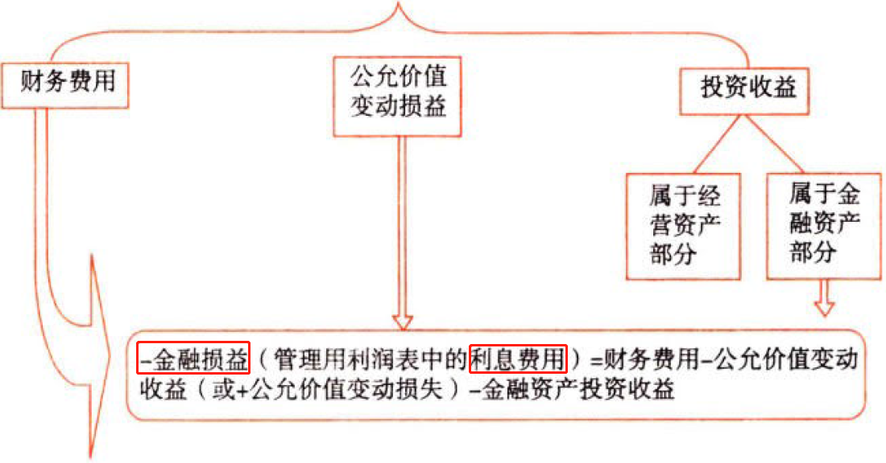

（1）投资收益要区分经营和金融：金融性要调整，经营性不调整

（2）公允价值变动要区分损失和收益：损失要调增，收益要调减

（3）本书例子仅为展示管理用财务报表体系，并不代表财务报表各项目的性质划分必然如此。编制管理用财务报表时，还需具体情况具体分析

#### 2.10.12.7. 2.管理用利润表基本公式

```
净利润（当期损益）＝经营损益＋金融损益
＝税前经营利润×(1－所得税税率)＋(－利息费用)×(1－所得税税率)
＝税后经营净利润－税后利息费用
＝剩余价值－给债权人
```
所得税税率为平均所得税税率时：

```
平均所得税税率＝所得税费用／利润总额
税后经营净利润＝税前经营利润×(1－平均所得税税率)
税后利息费用＝利息费用×(1－平均所得税税率)
```
所得税税率为适用所得税税率时：

```
税后经营净利润＝税前经营利润－∑(税前经营利润i×适用所得税税率i)
税后利息费用＝利息费用－∑(利息费用i×适用所得税税率i)
```
传统报表：

```
净利润＝利润总额－所得税费用
```
无论在管理用报表还是传统报表下，`净利润`的金额都是`一样`的。

### 2.10.13. 管理用现金流量表

#### 2.10.13.8. 经营现金流量vs金融现金流量

经营现金流量（实体现金流量）：［营业活动（销售商品、提供劳务等）、生产性资产投资活动］产生的现金流量。

```
金融现金流量＝债务现金流量＋股权现金流量
＝给债主＋给股东
```


#### 2.10.13.9. 现金流量确定

剩余流量法（从实体现金流量的`来源`分析）：【怎么赚的】

```
实体现金流量＝【赚的钱－Δ短期投入－Δ长期投入】
＝税后经营净利润－Δ经营营运资本－Δ净经营长期资产
＝税后经营净利润＋折旧摊销－Δ经营营运资本－Δ净经营长期资产－折旧摊销
＝营业现金毛流量－Δ经营营运资本－资本支出
＝营业现金净流量－资本支出
```
融资现金流量法（从实体现金流量的`去向`分析）：【给了谁了】

```
实体现金流量＝债务现金流量＋股权现金流量
债务现金流量＝税后利息费用－Δ净负债
股权现金流量＝股利分配－Δ股权资本
```
净投资扣除法：

```
实体现金流量＝税后经营净利润－实体净投资
＝税后经营净利润－Δ净经营资产
```
现金流量的计算公式与教材第8章公式一致。

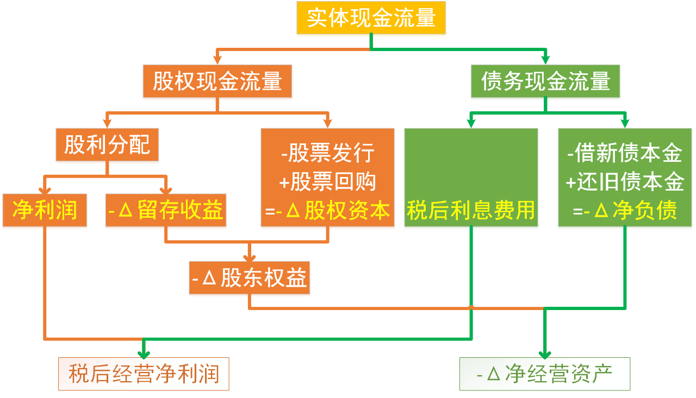

### 2.10.14. 管理用财务分析体系

指标计算规律：

```
权益净利率＝净利润／股东权益
净经营资产净利率A＝税后经营净利润／净经营资产
＝(净利润＋税后利息费用)／(股东权益＋净负债)
税后利息率B＝税后利息费用／净负债
净财务杠杆C＝净负债／股东权益
```
改进的财务分析体系的`核心公式`：【推导过程】

```
税后经营净利润／净经营资产＝A
税后经营净利润＝A×净经营资产
净利润＋税后利息费用＝A×(股东权益＋净负债)
净利润＝A×(股东权益＋净负债)－税后利息费用
净利润／股东权益＝A×(股东权益＋净负债)／股东权益－(税后利息费用／净负债)×(净负债／股东权益)
权益净利率＝A×(1＋C)－B×C
＝A＋(A－B)×C
```
(A－B)：经营差异率，是衡量借款是否合理的重要依据。

(A－B)×C：杠杆贡献率

#### 2.10.14.10. 分析框架

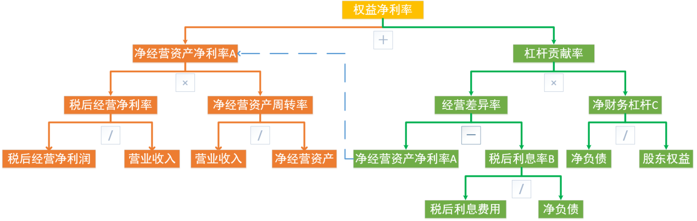

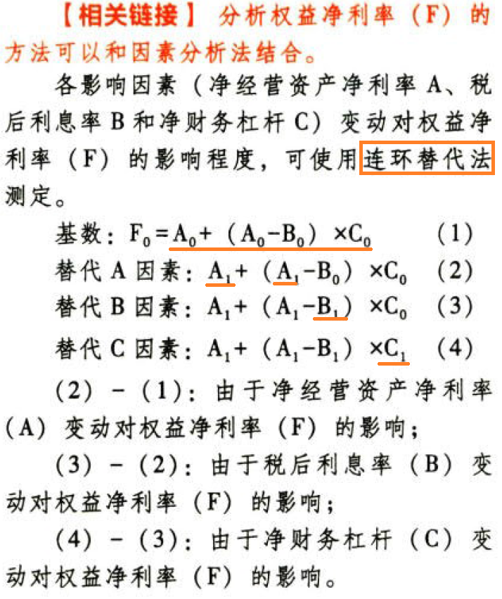

# 3. 财务预测的步骤和方法

## 3.11. 财务预测的意义:star: 

狭义的财务预测：融资需求的预测。

广义的财务预测：还包括编制全部的预计财务报表。

意义：

①是融资计划的`前提`；

②有助于改善投资`决策`；

③有助于`应变`。

## 3.12. 财务预测的方法:star: :star: :star: 

### 3.12.15. 销售百分比法

#### 3.12.15.11. 假设前提

假设某些资产、负债与营业收入存在稳定的百分比关系。根据`预计营业收入`和`相应的百分比`预计`资产`、`负债`，进而确定`筹资需求量`。

```
资产（或负债）＝k×预计营业收入
筹资需求量＝f(资产、负债)
```
以管理用报表为基础进行预测时，通常各项`经营资产`和`经营负债`与`营业收入`保待稳定的百分比关系。

```
经营资产（或经营负债）＝k×预计营业收入
```
#### 3.12.15.12. 筹资顺序

如何筹集资金取决于企业的筹资政策。通常，筹资的优先顺序如下：

（1）动用现存的金融资产

（2）增加留存收益

```
Δ留存收益＝预计营业收入×预计营业净利率×(1－股利支付率)
```
（3）增加金融负债

（4）增发股票

总额法：

```
融资总需求＝Δ净经营资产
＝预计净经营资产－基期净经营资产
＝(预计经营资产－预计经营负债)－(基期经营资产－基期经营负债)
```
增加额法：

```
融资总需求＝Δ净经营资产
＝Δ营业收入×净经营资产销售百分比
```
同比增长法：

```
融资总需求＝Δ净经营资产
＝基期净经营资产×营业收入增长率
```
分步法：

```
预计需要外部融资＝
＝Δ经营资产－Δ经营负债－Δ留存收益－可动用金融资产
```
公式法：

```
预计需要外部融资＝
＝Δ营业收入×(经营资产销售百分比－经营负债销售百分比)
－预计营业净利率×预计营业收入×(1－股利支付率)
－可动用金融资产
```
### 3.12.16. 财务预测的其他方法

（1）回归分析法

（2）运用信息技术预测

①使用“电子表格软件”。

②利用人工智能技术。

# 4. 增长率与资本需求的测算

## 4.13. 内含增长率的测算:star: :star: :star: 

### 4.13.17. 外部融资销售增长比

含义：可动用金融资产为0时，每增加`1元营业收入`需要追加的外部融资额。

```
外部融资销售增长比＝经营资产销售百分比－经营负债销售百分比
－[(1＋某增长率g)／某增长率g］×预计营业净利率×(1－预计股利支付率)
```
### 4.13.18. 内含增长率

含义：只靠内部积累（即Δ留存收益）来实现销售额的增长，其销售增长率被称为“内含增长率”。【没有钱+不借钱】【自力更生慢慢来】

方法1：根据`外部融资销售增长比`公式，设外部融资额为零，求销售增长率即可。

```
0＝经营资产销售百分比－经营负债销售百分比
－预计营业净利率×［(1＋g)／g］×(1－预计股利支付率)
```
方法2：公式法

```
留存收益＝利润留存率×净利润
内含增长率＝留存收益／(净经营资产－留存收益)
ABC＝利润留存率×营业净利率×净经营资产周转率
内含增长率＝ABC／(1－ABC)
```
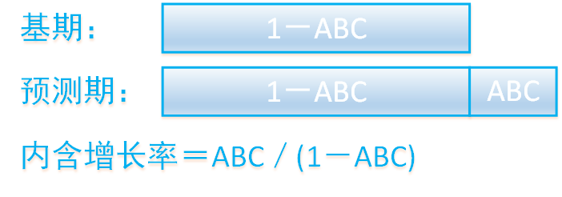

公式中使用的指标理论上应为`预测期`数据，若题中给出指标不变或沿用基期，则可以使用基期指标。


## 4.14. 可持续增长率的测算:star: :star: :star: 

### 4.14.19. 含义

可持续增长率是指`不增发新股或回购股票`，不改变`经营效率`（不改变营业净利率和资产周转率）和`财务政策`（不改变权益乘数和利润留存率）时，其销售所能达到的增长率。【三不变时的巨大化】

### 4.14.20. 假设条件

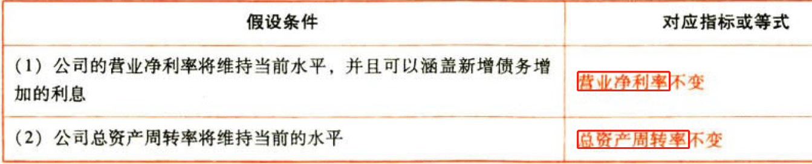

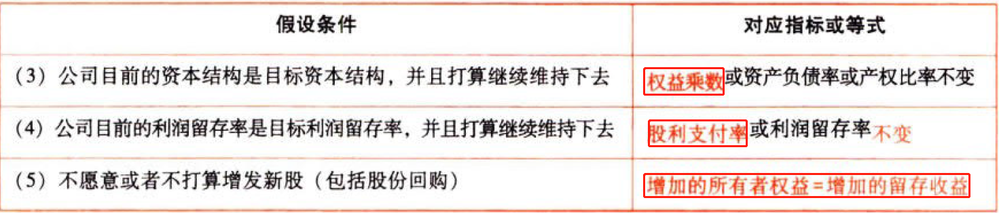

上述假设条件成立时，销售的实际增长率与可持续增长率相等。

### 4.14.21. 计算公式

根据期初股东权益计算：

```
可持续增长率＝本期留存收益／期初股东权益
＝利润留存率×净利润／期初股东权益
＝利润留存率×营业净利率×期末总资产周转率×期末总资产期初权益乘数
```
根据期末股东权益计算：

```
ABCD＝利润留存率×营业净利率×期末总资产周转率×期末总资产权益乘数
可持续增长率＝ABCD／(1－ABCD)
```
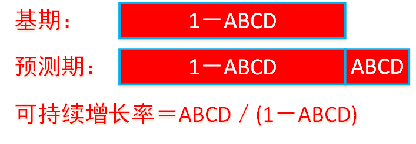

### 4.14.22. 可持续增长率与实际增长率的关系

可持续增长率是企业不增发新股或回购股票，当前经营效率和财务政策决定的未来内在增长能力。

```
本年实际增长率＝本年营业额／上年营业额－1
```
如果某一年的经营效率和财务政策与上年相同，在不增发新股或回购股票的情况下，则本年实际增长率率、上年的可持续增长率、本年的可持续增长率`三者相等`：

本年销售增长率＝本年可持续增长率＝上年可持续增长率＝本年股东权益增长率＝本年总资产增长率＝本年总负债增长率＝本年净利润增长率＝本年利润留存增长率＝本年股利增长率

#### 4.14.22.13. 高速增长

（1）如果某一年的公式中的ABCD有一个或多个提高，在不增发新股或回购股票的情况下，则本年实际增长率就会超过上年的可持续增长率，本年的可持续增长率也会超过上年的可持续增长率

（2）如果某一年的公式中的ABCD有一个或多个下降，在不增发新股或回购股票的情况下，则本年实际增长率就会低于上年的可持续糟长率，本年的可持续增长率也会低于上年的可持续增长率

（3）如果公式中的ABCD已经达到公司的`极限`，只有通过增发新股增加资金，才能提高销售增长率

（4）超常增长是指实际增长率超过可持续增长率的增长

#### 4.14.22.14. 提示

根据“总资产周转率”不变，可以得到：本年销售增长率＝总资产增长率

根据“资本结构”不变，可以得到：总资产增长率＝股东权益增长率

根据“不增发新股或回购股票”，可以得到：股东权益增长率＝本年可持续增长率

综上可以得到：本年销售增长率＝本年可持续增长率

因此，在确定高速增长时应改变的营业净利率或股利支付率，只有在资产周转率（C）、权益乘数（D）不变以及不增发新股或回购股票的前提下（本年可持续增长率＝本年销售增长率），可直接利用：

```
预计销售增长率＝预计利润留存率×预计营业净利率×预计期末总资产周转率×预计期末总资产权益乘数／(1－预计营业净利率×预计期末总资产周转率×预计期末总资产权益乘数×预计利润留存率)
预计销售增长率＝预计ABCD／(1－预计ABCD)
```
倒求股利支付率A或营业净利率B。

但在确定高速增长时改变的是资产周转率（C）、资产负债率（D）或增发/回购股票【违反合三不变的前提】，`本年可持续增长率≠本年销售增长率`，不能利用公式倒推，只能利用不变的其他相关比率推算

### 4.14.23. 基于管理用财务报表的可持续增长率

#### 4.14.23.15. 假设条件


#### 4.14.23.16. 计算公式

根据期初股东权益计算：

```
可持续增长率＝利润留存率×营业净利率×期末净经营资产周转率×期末净经营资产期初权益乘数
```
根据期末股东权益计算：

```
ABCD＝利润留存率×营业净利率×期末净经营资产周转率×期末净经营资产权益乘数
可持续增长率＝ABCD／(1－ABCD)
```


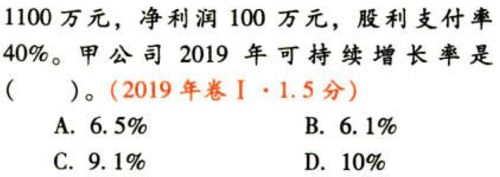

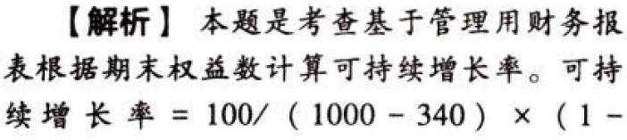

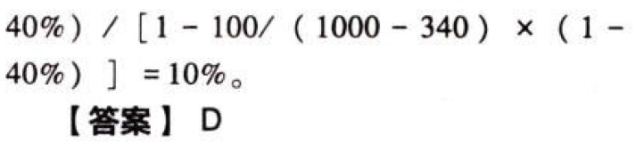

## 4.15. 可持续增长率vs内含增长率

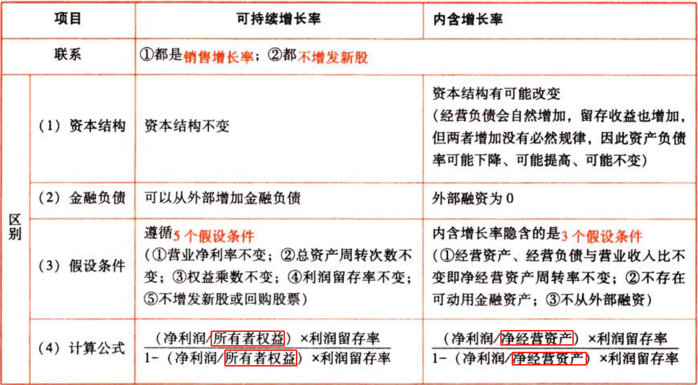

## 4.16. 外部资本需求的测算:star: :star: 

### 4.16.24. 外部融资销售增长比的运用

```
外部融资额＝外部融资销售增长比×销售增长额
```
外部融资销售增长比公式中的增长率是指营业收入增长率

```
含有通胀的营业收入增长率＝(1＋通货膨胀率)×(1＋销量精长率)－1
```
### 4.16.25. 外部融资需求的敏感分析

根据销售百分比预测法的`增加额法`的计算公式

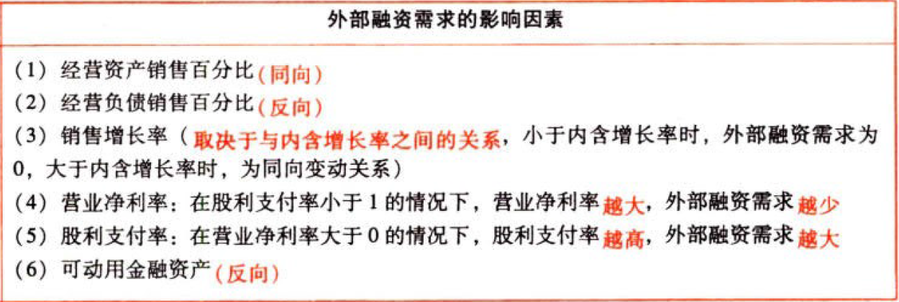

注意极端点：当股利支付率为100%时，营业净利率对外部融资无影响；当营业净利率为0时，股利支付率对外部融资无影响。

# 5. 总结

End。
