C03价值评估基础

# 1. 利率

## 1.1. 基准利率及其特征:star: 

### 1.1.1. 利率的含义及影响因素

利率表示一定时期内利息额与借贷本金的比率，通常用百分比表示


### 1.1.2. 基准利率

基准利率是金融市场上具有`普遍参照作用`的利率。

基准利率的基本特征：


在我国，以中国人民银行（央行）对国家专业银行和其他金融机构规定的存贷款利率为基准利率。

## 1.2. 利率的影响因素:star: :star: 

在市场经济条件下，利率的确定方法表达如下。

```
r＝纯粹利率r\*＋风险溢价RP
＝纯粹利率r\*＋通货膨胀溢价IP＋违约风险溢价DRP＋流动性风险溢价LRP＋期限风险溢价MRP
（名义）无风险利率＝rRF＝纯粹利率r\*＋通货膨胀溢价IP
```
纯粹利率r\*（pure-rate-of-interest），也称真实无风险利率，是指在没有通货膨胀、无风险情况下资金市场的平均利率。没有通货膨胀时，短期政府债券的利率可以视作纯粹利率。

通货膨胀溢价IP（inflation-premium），是指为了弥补预期通货膨胀造成的货币购买力下降的风险而给予证券投资人的补偿，也称为预期的平均通货膨胀率。

违约风险溢价（default-risk-premium），是指债券因存在发行者到期时不能按约定足额支付本金或利息的风险而给予债权人的补偿，该风险越大，债权人要求的利率越高。

流动性风险溢价（liquidity-risk-premium），是指债券因存在不能短期内以合理价格变现的风险而给予债权人的补偿。

期限风险溢价（maturity-risk-premium），是指为了弥补由于市场利率上升导致证券价格下跌的风险而给予投资人的补偿，因此也被称为“市场利率风险溢价”。

## 1.3. 利率的期限结构:star: :star: 

### 1.3.3. 含义

利率期限结构是指某一时点不同期限债券的到期收益率与期限之间的关系，反映的是长期利率和短期利率的关系。

利率期限结构表现在图像上就是收益率曲线。

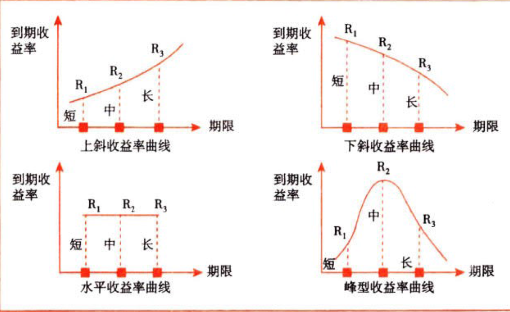

### 1.3.4. 利率期限结构的相关理论

#### 1.3.4.1. 各种理论观点的比较

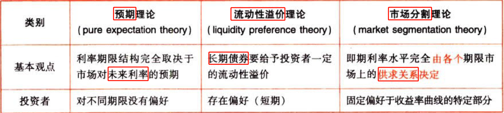

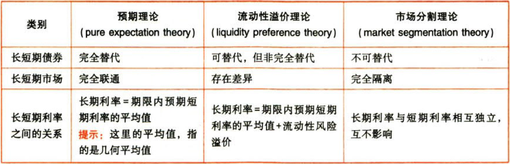

无偏预期理论和市场分割理论是两个极端，两者的结论相反；流动性溢价理论是折中的理论。预期理论是无偏预期理论的简称，而流动性溢价理论和市场分割理论属于有偏预期理论。

#### 1.3.4.2. 各种理论下的收益率曲线

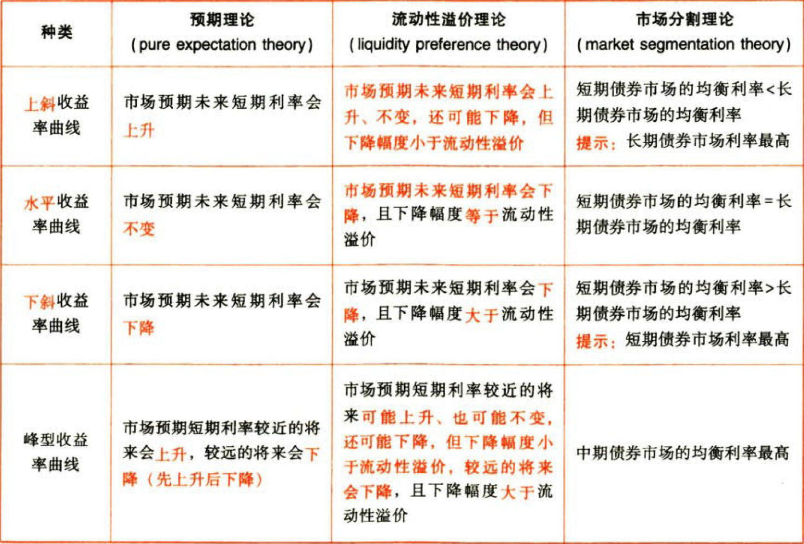

# 2. 货币时间价值

## 2.4. 货币时间价值的基本计算:star: :star: :star: 

### 2.4.5. 年金的含义与种类

定期、等额的系列收支。

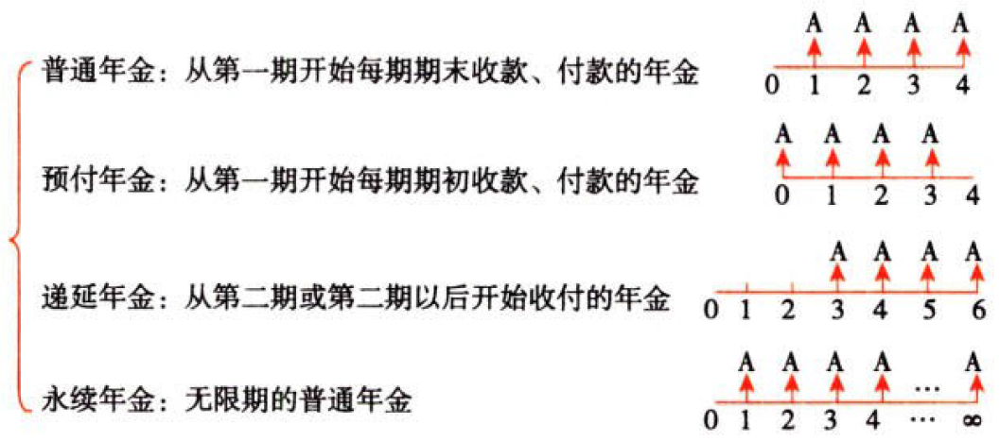

### 2.4.6. 货币时间价值的基本计算公式（终值与现值的计算）

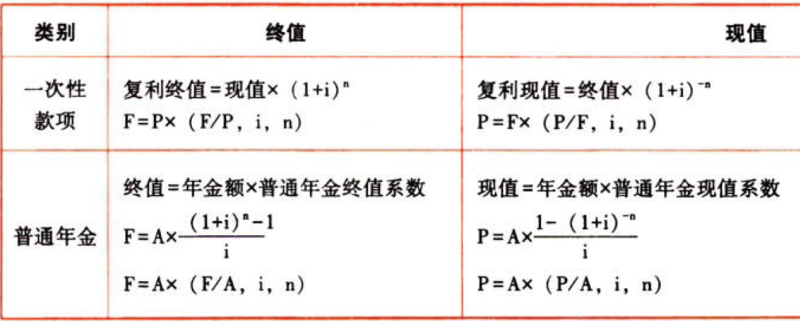

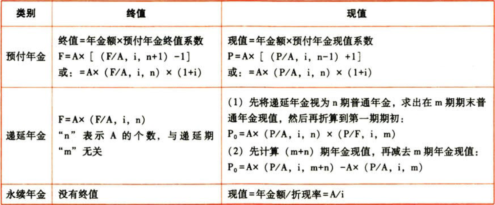

如果给定的是一个以预付年金形式表示的永续年金，其现值为：

```
P＝A＋A/i
```
如果给定的是一个以递延年金形式表示的永续年金，其现值为：

```
P＝A/i×(P/F,i,n)
```
预付年金求现值如下图所示：

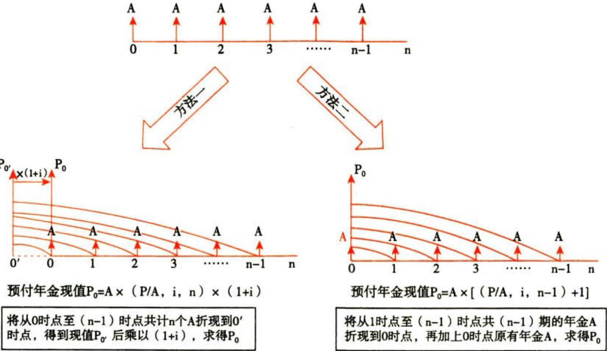

预付年金求终值如下图所示：

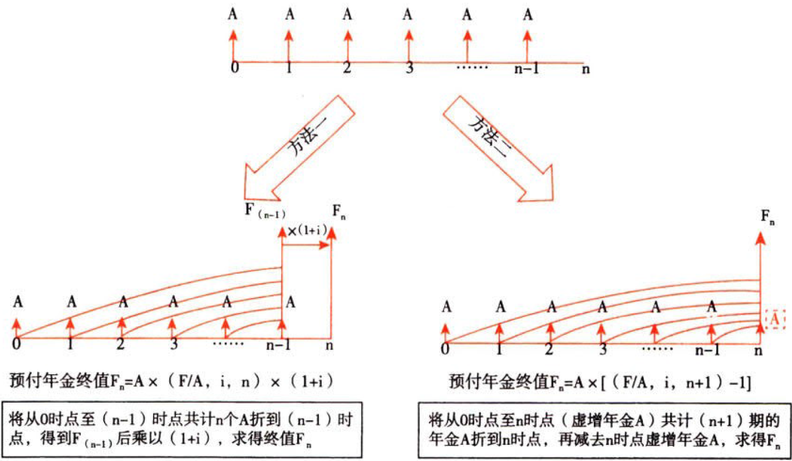

货币时间价值系数间的关系：


## 2.5. 货币时间价值计算的灵活运用:star: :star: 

### 2.5.7. 折现率和期间的推算（内插法的运用）

#### 2.5.7.3. 折现率的推算

内插法应用的前提是：将系数与利率之间的变动看成是线性变动。

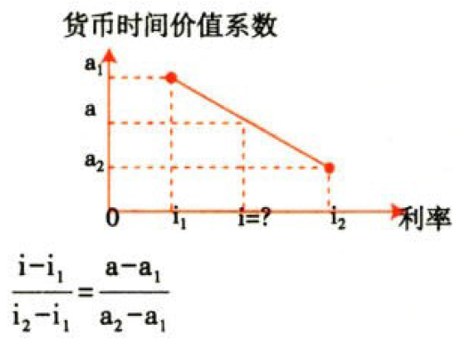

#### 2.5.7.4. 期间的推算

期间的推算，其原理和步骤与折现率的推算解法相同。

### 2.5.8. 报价利率与有效年利率

#### 2.5.8.5. 相关概念


#### 2.5.8.6. 利率间的关系


#### 2.5.8.7. 计算终值或现值

基本公式不变，只要将年利率调整为计息期利率（r/m），将年数调整为期数（nxm）即可。

# 3. 风险与报酬

## 3.6. 风险的含义:star: 

风险是预期结果的不确定性。风险不仅包括负面效应（危险）的不确定性，还包括正面效应（机会）的不确定性。

## 3.7. 单项投资的风险与报酬:star: :star: 

### 3.7.9. 风险的衡量方法（方差、标准差、变异系数）

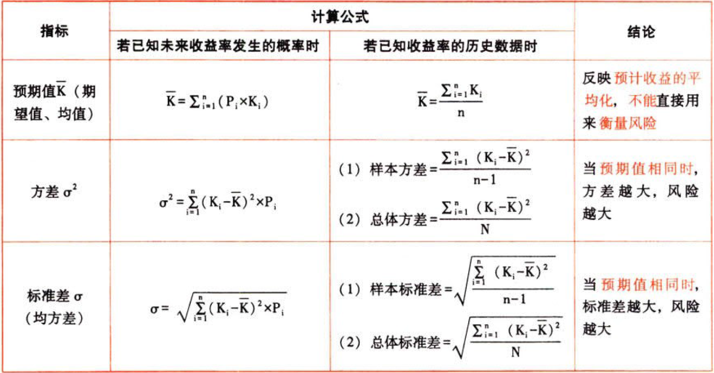


### 3.7.10. 风险与收益的关系


## 3.8. 投资组合的风险与报酬:star: :star: :star: 

### 3.8.11. 证券组合的期望报酬率

各种证券期望报酬率的加权平均数。

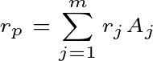

$$r_{p}=\sum_{j=1}^{m}r_{j}A_{j}$$

### 3.8.12. 投资组合的风险计量

#### 3.8.12.8. 基本公式

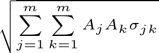

$$\sqrt{\sum_{j=1}^{m}\sum_{k=1}^{m}A_{j}A_{k}\sigma_{jk}}$$

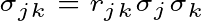

$$\sigma_{jk}=r_{jk}\sigma_{j}\sigma_{k}$$

其中：m是组合内证券种类总数；Aj是第j种证券在投资总额中的比例；Ak是第k种证券在投资总额中的比例；σjk是第j种证券与第k种证券报酬率的协方差；rjk是第j种证券与第k种证券报酬率之间的预期相关系数；σj是第j种证券的标准差；σk是第k种证券的标准差。

#### 3.8.12.9. 两种证券投资组合的风险衡量

投资组合的标准差：

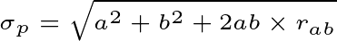

$$\sigma_{p}=\sqrt{a^{2}+b^{2}+2ab\times{r_{ab}}}$$

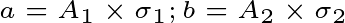

$$a=A_{1}\times\sigma_{1};b=A_{2}\times\sigma_{2}$$

a和b分别表示个别资产的比重A与标准差σ的乘积。

r{ab}表示两项资产报酬率之间的相关系数。

证券投资组合风险的影响因素为：投资比重、标准差、相关系数。

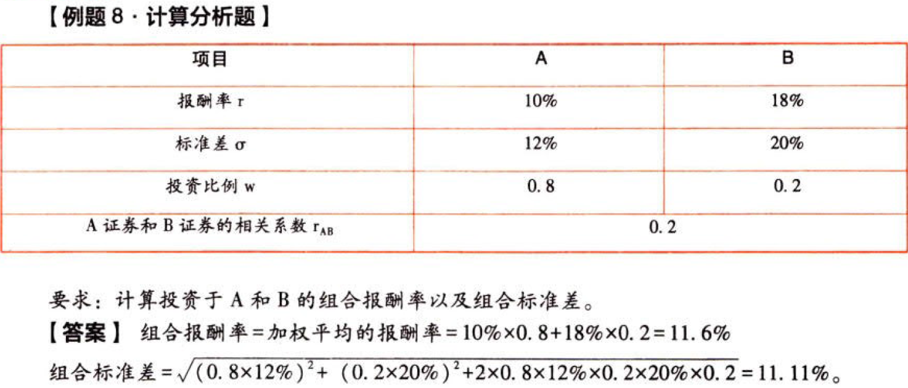

证券组合的风险与各证券之间报酬率的相关系数有关，相关系数越大，组合风险越大。

不论投资组合中两项资产之间的相关系数如何变化，只要投资比例不变，各项资产的期望报酬率不变，则该投资组合的期望报酬率就不变。

三种证券投资组合的风险衡量：

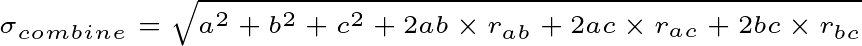

$$sigma_{combine}=\sqrt{a^{2}+b^{2}+c^{2}+2ab\times{r_{ab}}+2ac\times{r_{ac}}+2bc\times{r_{bc}}}$$

N个资产组合个数共有`N×N`个，其中方差个数为`N`个，协方差的个数为`N×N－N`个。充分投资组合的风险，只受证券之间协方差的影响，而与证券本身的方差无关。

### 3.8.13. 相关系数与组合风险之间的关系

#### 3.8.13.10. 相关系数的确定

相关系数：

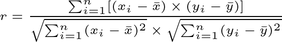

$$r=\frac{\sum_{i=1}^{n}[(x_{i}-\bar{x})\times(y_{i}-\bar{y})]}{\sqrt{\sum_{i=1}^{n}(x_{i}-\bar{x})^{2}}\times\sqrt{\sum_{i=1}^{n}(y_{i}-\bar{y})^{2}}}$$

协方差：

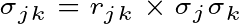

$$\sigma_{jk}=r_{jk}\times\sigma_{j}\sigma_{k}$$

相关系数＝协方差/两项资产标准差的乘积：

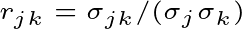

$$r_{jk}=\sigma_{jk}/(\sigma_{j}\sigma_{k})$$

相关系数介于区间［-1，1］内。拙系数为叫表示完全负相关表明两项资产的报酬率变化方向完全相反，变化幅度完全相同。当相关系数为＋1时，表示完全正相关，表明两项资产的报酬率变化方向和变化幅度完全相同。当相关系数为0时，表示不相关。

相关系数的正负与协方差的正负相同。相关系数为正值，表示两项资产报酬率呈同方向变化，组合抵消的风险较少；负值则意味着反方向变化，抵消的风险较多。

#### 3.8.13.11. 相关系数与组合风险之间的关系

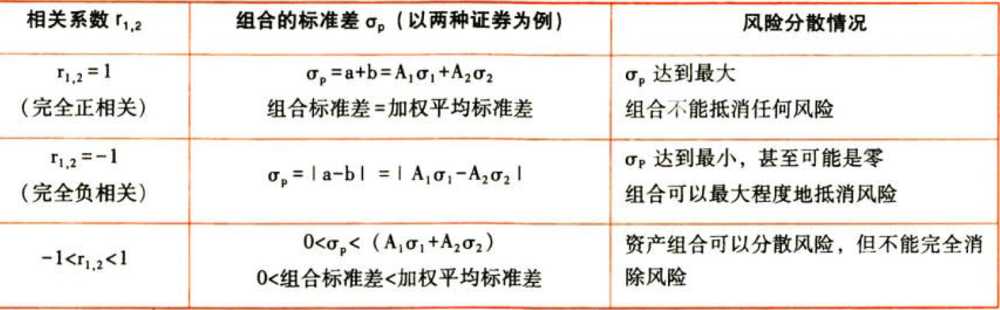

### 3.8.14. 投资组合的有效集与无效集

#### 3.8.14.12. 有效集

有效集又称有效边界，它位于机会集的顶部，从.小方差组合点起到最高期望报酬率点止。

集合内的投资组合在既定的风险水平上，期望报酬率是最高的，或者说在既定的期望报酬率下，风险是最低的。役资者应在有效集上寻找投资组合。

#### 3.8.14.13. 无效集

①相同的标准差和较低的期望报酬率；

②相同的期望报酬率和较高的标准差；

③较低的期望报酬率和较高的标准差。

### 3.8.15. 相关系数与机会集的关系


结论：曲线和直线之间的距离（向左弯幽的程度），代表了风险分散化效应的程度，证券报酬率之间的相关系数越小，机会集曲线就越弯曲，风险分散化效应也就越强。


（1）r=1，机会集是一条直线，不具有风险分散化效应

（2）r\<1，机会集会弯曲，有风险分散化效应

（3）r足够小，曲线向左凸出，风险分散化效应较强，会产生比最低风险证券标准经还低的最小方差组合，会出现无效集

### 3.8.16. 资本市场线

如果存在无风险证券（投资人可自由贷出或者借入），新的有效边界是从无风险资产的报酬率开始，并和机会集有效边界相切的直线，该直线称为资本市场线。

理解：存在无风险投资机会时的有效集。


（1）资本市场线与机会集有效边界相切的切点M是市场均衡点，它代表唯一最有效的风险资产组合，它是所有证券以各自的总市场价值为权数的加权平均组合。

（2）资本市场线揭示出持有不同比例的无风险资产和市场组合情况下风险和期望报酬率的权衡关系。在M点的左侧，将同时持有无风险资产和风险资产组合。在M点的右侧，将仅持有市场组合M，并且会借入资金以进一步投资于组合M。

（3）个人的效用偏好与最佳风险资产组合相独立（或称相分离）。

### 3.8.17. 组合风险的分类及特点


（1）可以通过增加组合中资产的数目而最终消除的风险被称为非系统风险，而那些反映资产之间相互关系、共同变动、无法最终消除的风险被称为系统风险

（2）在风险分散过程中，不应当过分夸大资产多样性和资产个数的作用。一般来讲，随着资产组合中资产个数的增加，资产组合的风险会逐渐降低，当资产的个数增加到一定程度时，资产组合风险的降低将非常缓慢直到不再降低

组合风险的分类如下图所示：

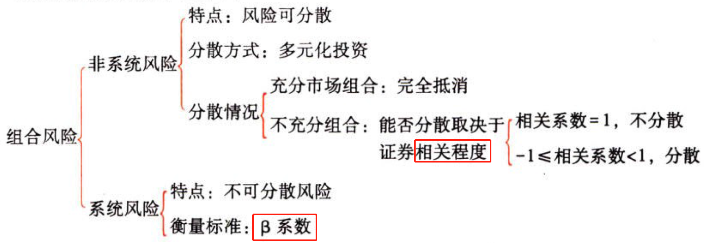

## 3.9. 资本资产定价横型:star: :star: :star: 

资本资产定价模型的研究对象，是充分组合情况下风险与必要报酬率之间的均衡关系。

### 3.9.18. 单项资产的β系数

#### 3.9.18.14. 计算方法

回归直线法：利用该股票报酬率与整个资本市场平均报酬率的线性关系，利用回归直线方程求斜率的公式，即可得到该股票的β值

定义法：

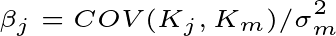

$$\beta_{j}=COV(K_{j},K_{m})/\sigma_{m}^{2}$$

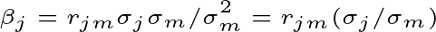

$$\beta_{j}=r_{jm}\sigma_{j}\sigma_{m}/\sigma_{m}^{2}=r_{jm}(\sigma_{j}/\sigma_{m})$$

#### 3.9.18.15. 影响因素


#### 3.9.18.16. 结论

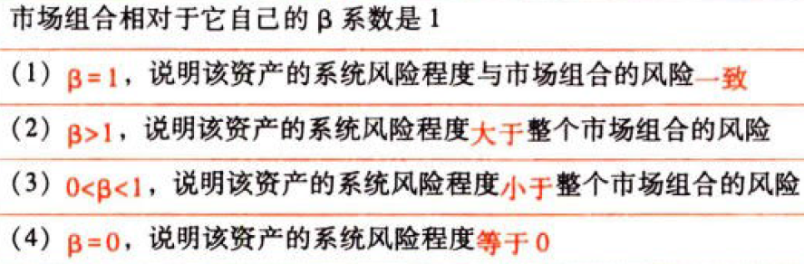

#### 3.9.18.17. 提示

（1）β系数反映了相对于市场组合的平均风险而言特定资产系统风险的大小

（2）绝大多数资产的β系数是大于零的。如果β系数是负数，表明这类资产报酬与市场平均报酬的变化方向相反

### 3.9.19. 投资组合的β系数

投资组合的β系数是组合内所有单项资产β系数的加权平均数，权数为种资产在投资组合中所占的比重：

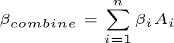

$$\beta_{combine}=\sum_{i=1}^{n}\beta_{i}A_{i}$$

（1）资产组合不能抵消系统风险，因此，证券组合的β系数是单项资产β系数的加权平均数

（2）由于单项资产的β系数不尽相同，因此通过替换资产组合中的资产，或改变不同资产在组合中的比重，可以改变证券组合的系统风险大小

### 3.9.20. 资本资产定价模型和证券市场线

#### 3.9.20.18. 资本资产定价模型的基本表达式

```
必要报酬率＝无风险报酬率＋风险附加率
```
资本资产定价模型的表达形式：


$$R_{i}=R_{f}+\beta\times(R_{m}-R_{f})$$

#### 3.9.20.19. 证券市场线

证券市场线就是上述关系式所代表的直线。


（1）单项资产或特定资产组合的必要报酬率受到无风险报酬率Rf、市场组合的平均必要报酬率Rm和β系数三个因素的影响，均为同向影响。

（2）某资产的风险附加率是市场风险溢价率（市场风险补偿程度）与该资产度量系统风险β系数的乘积。即：某资产的风险附加率＝β×(Rm－Rf)。

（3）市场风险溢价率(Rm－Rf)反映市场整体对风险的偏好，如果风险厌恶程度高，则证券市场线的斜率(Rm－Rf)的值就大。

（4）必要报酬率也称最低要求报酬率，是等风险投资的机会成本；期望报酬率则是使净现值为零的报酬率，是方案本身预期可以达到的报酬率。

当期望报酬率＞必要报酬率时，应进行投资。

当期望报酬率＜必要报酬率时，不应进行投资。

当期望报酬率＝必要报酬率时，可选择投资或不投资该项目。

#### 3.9.20.20. 证券市场线与资本市场线的区别

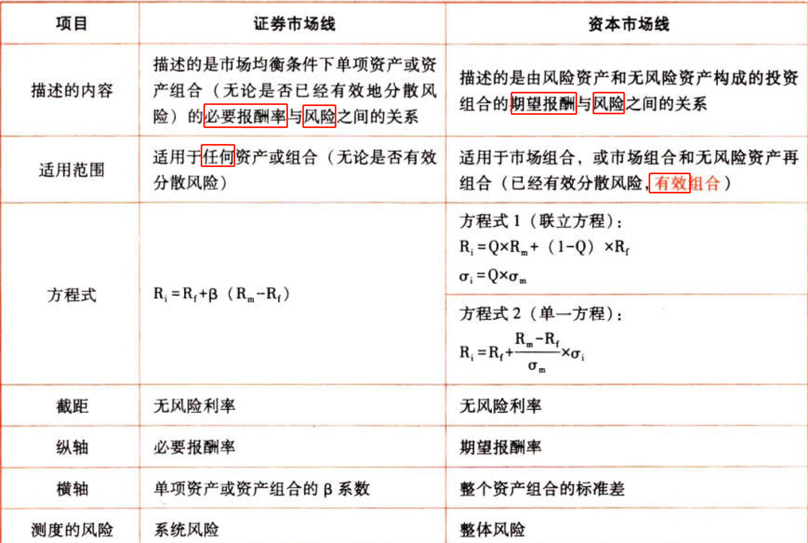

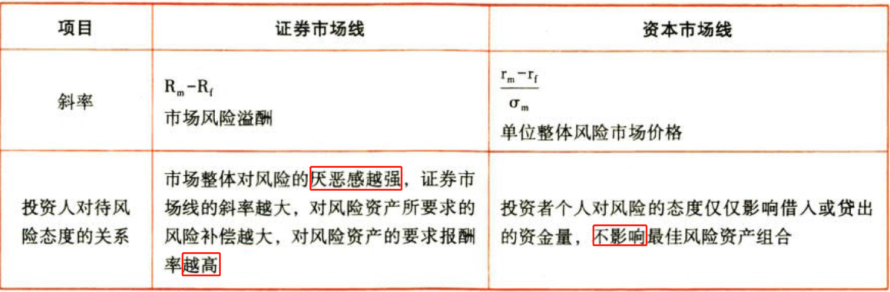

# 4. 总结

End。
