C04资本成本

# 1. 资本成本的概念和用途

## 1.1. 资本成本的概念:star: :star: 

### 1.1.1. 含义

资本成本是指投资资本的机会成本。这种成本不是实际支付的成本，而是一种失去的收益，是将资本用于本项目投资所放弃的其他投资机会的收益，因此被称为机会成本。资本成本也称为必要报酬率、投资项目的取舍率、最低可接受的报酬率。

### 1.1.2. 资本成本概念的两个方面

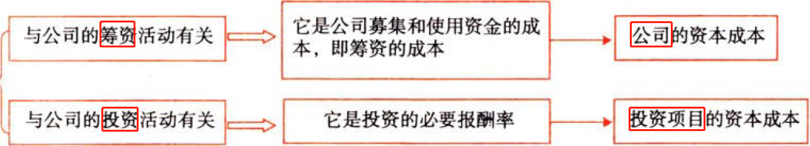

#### 1.1.2.1. 公司的资本成本

资本成本是公司取得和使用资本的代价，投资人从证券上所取得的报酬就是筹资的成本。公词资本成本是投资人针对整个公司要求的报酬率，或者说是投资人对于企业全部资产要求的加权平均的必要报酬率。

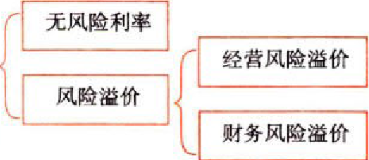

各公司的资本成本之所以不同是因为公司所经营的业务不同（经营风险不同），资本结构不同（财务风险不同）。

#### 1.1.2.2. 项目资本成本

项目资本成本是公司投资于资本支出项目所要求的报酬率。

项目资本成本与公司资本成本的关系取决于新项目的风险与企业现有资产平均凤险的关系。


## 1.2. 资本成本的用途:star: 

公司的资本成本主要用于投资决策（第5章）、筹资决策（第9章）、营运资本管理（第12章）、企业价值评估（第8章）和业绩评价（第20章）。

## 1.3. 资本成本的影响因素:star: :star: 

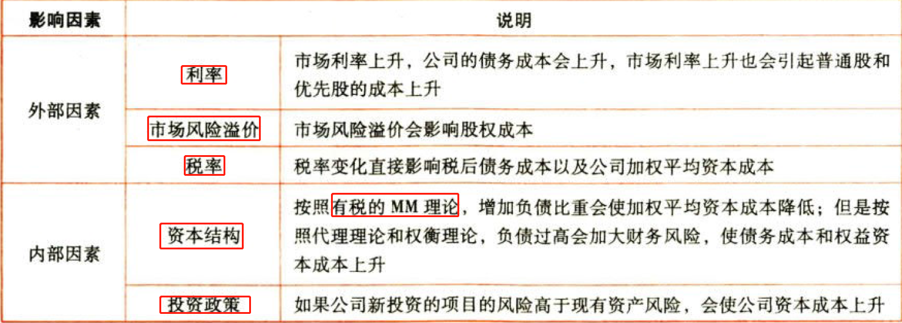

# 2. 债务资本成本的估计

## 2.4. 债务资本成本的概念:star: :star: 

估计债务资本成本就是确定债权人要求的收益率。

债务资本的提供者承担的风险显著低于股东，因此其期望报酬率低于股东，即债务的资本成本低于权益筹资的资本成本。

债务资本成本的因素分析：

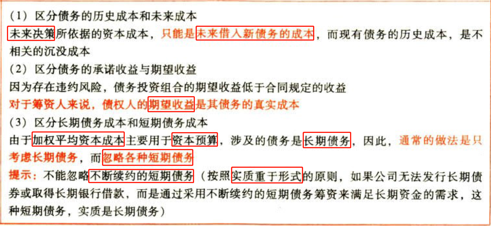

辨析

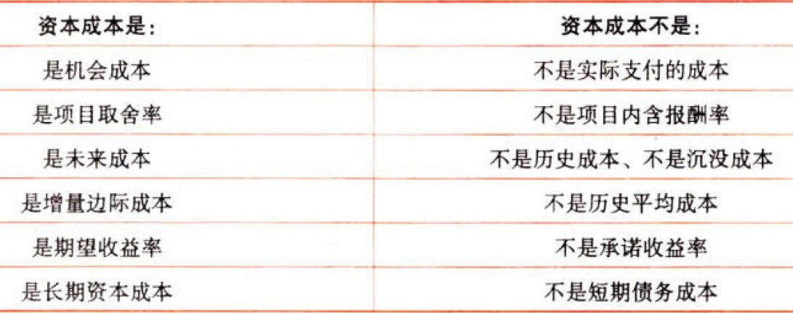

## 2.5. 税前债务资本成本的估计:star: :star: :star: 

### 2.5.3. 不考虑发行费用的税前债务资本成本的估计

#### 2.5.3.3. 债务资本成本估计方法的选择

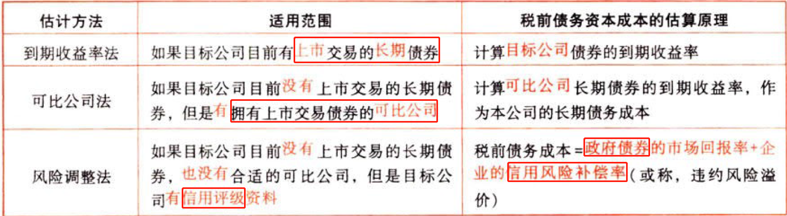


| 方法         | 关键                             |
|--------------|----------------------------------|
| 到期收益率法 | 上市交易的长期债券的到期收益率   |
| 可比公司法   | 类似公司                         |
| 风险调整法   | 信用评级风险补偿＋政府债券回报率 |
| 财务比率法   | 关键财务比率=\>信用级别          |

#### 2.5.3.4. 不同方法下税前资本成本的计算

##### 2.5.3.4.1. 到期收益率法

使用内插法求折现率，即找到使得未来现金流出的现值等于现金流入现值的那一个折现率。

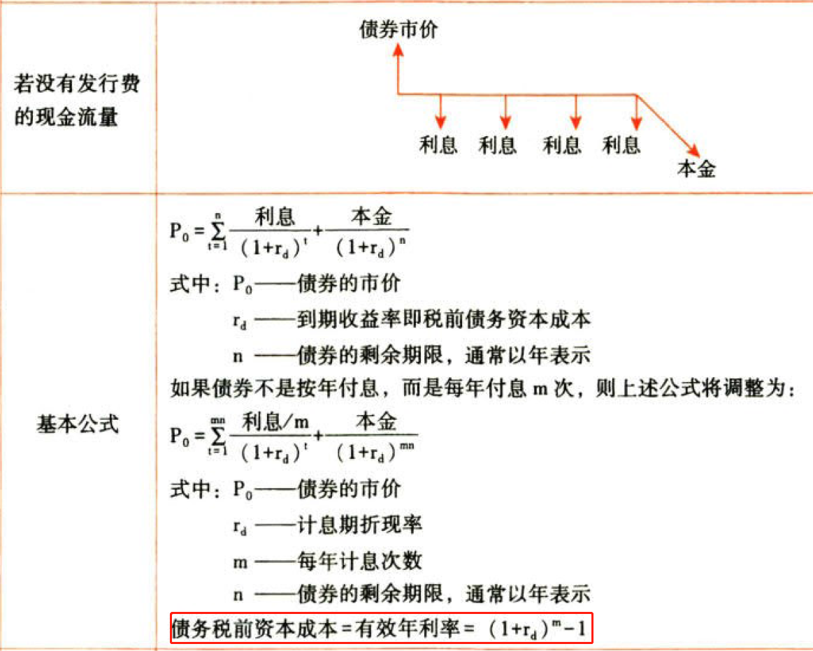

##### 2.5.3.4.2. 可比公司法


##### 2.5.3.4.3. 风险调整法

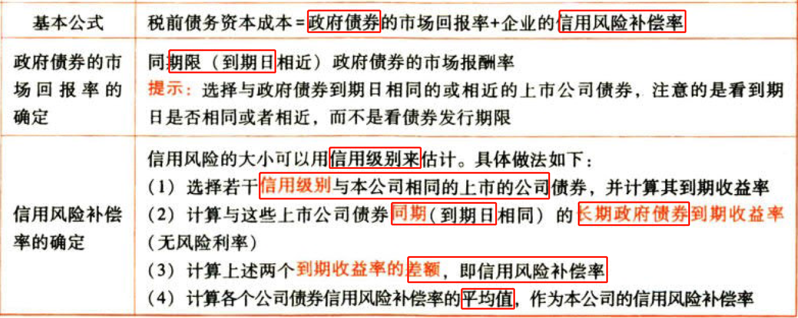

##### 2.5.3.4.4. 财务比率法


### 2.5.4. 考虑发行费用的税前债务资本成本估计

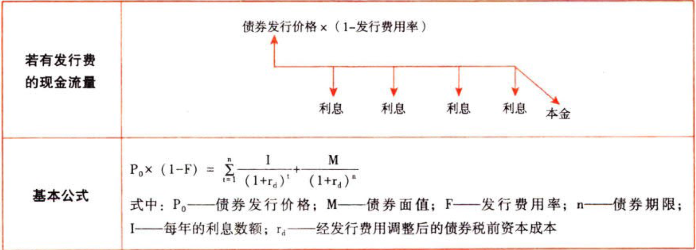

## 2.6. 税后债务资本成本的估计:star: :star: 

```
税后债务资本成本＝税前债务资本成本×(1－所得税税率)
```
（1）因为所得税的作用，利息可以抵税，减少了债务资本成本，债权人收到的是利息收入，而不是税后的利息，所以公司的债务资本成本小于债权人要求的报酬率。

（2）税前债务资本成本是指税前`年有效`债务资本成本。对于年内付息多次的债券计算资本成本时首先要确定税前年有效到期收益率作为税前债务资本成本，然后再确定税后年资本成本。

# 3. 普通股资本成本的估计

## 3.7. 不考虑发行费用的普通股资本成本的估计:star: :star: :star: 

普通股资本成本是指筹集普通股所需的成本，这里的筹资成本，是面向未来的，而不是过去的成本。

### 3.7.5. 资本资产定价模型

#### 3.7.5.5. 基本公式

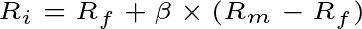

$$R_{i}=R_{f}+\beta\times(R_{m}-R_{f})$$

通常认为，政府债券没有违约风险，可以代表无风险利率。

#### 3.7.5.6. 无风险利率（Rf）的估计

##### 3.7.5.6.5. （1）选择短期政府债券利率还是长期政府债券利率？

通常选择长期政府债券的利率。

理由：

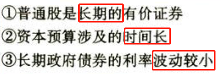

##### 3.7.5.6.6. （2）选择票面利率还是到期收益率？

通常选择上市交易的政府长期债券的到期收益率作为无风险利率的代表。

不选票面利率的理由：不同的付息方式，不同的发行时间，票面利率相差很大。

##### 3.7.5.6.7. （3）选择名义无风险利率还是真实无风险利率？

###### 3.7.5.6.7.1. ①通货膨胀的影响

名义利率是指包含了通货膨胀因素的利率。

实际利率是指排除了通货膨胀因素的利率。

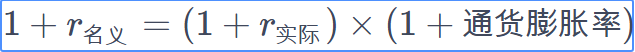

$$1+r_{名义}=(1+r_{实际})\times(1+通货膨胀率)$$

名义现金流量是指包含了通货膨胀因素的现金流量。

实际现金流量是指排除了通货膨胀因素的现金流量。

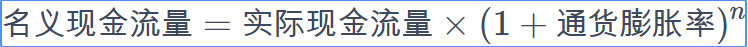

$$名义现金流量=实际现金流量\times(1+通货膨胀率)^{n}$$

n为相对于基期的期数

###### 3.7.5.6.7.2. ②决策分析的基本原则

名义现金流量要使用含有通货膨胀的折现率进行折现，实际的现金流量要使用实际的折现率进行折现。

###### 3.7.5.6.7.3. ③实务中的处理方式

通常做法：一般情况下使用含通货膨胀的名义货币编制预计财务报表并确定现金流量，与此同时，使用含通货膨胀的无风险利率计算资本成本。

使用实际利率和实际现金流量的情况：

a：存在恶性通货膨胀（通货膨胀达到两位数）

b：预测周期特别长，通货膨胀的累积影响巨大

#### 3.7.5.7. 股票贝塔系数（β）的估计

##### 3.7.5.7.8. 计算公式

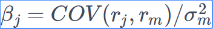

$$\beta_{j}=COV(r_{j},r_{m})/\sigma_{m}^{2}$$

分子为证券j的报酬率与市场组合报酬率的协方差。

分母为市场组合报酬率的方差。

##### 3.7.5.7.9. 关键变量的选择

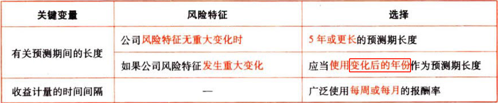

如果驱动β值的经营风险和财务风险没有发生重大变化，则可以用历史的β值估计股权成本。

#### 3.7.5.8. 市场风险溢价（Rm-Rf）的估计

##### 3.7.5.8.10. 市场风险溢价

是指在一个相当长的历史时期里，市场平均收益率与无风险资产平均收益率之间的差异。

##### 3.7.5.8.11. 市场平均收益率（Rm）的估计

选择时间跨度：应选择校长的时间跨度，既包括经济繁荣时期，也包括经济衰退时期。

###### 3.7.5.8.11.4. 几何平均法

考虑了复合平均，能更好地预测长期的平均风险溢价。

多数人倾向于采用几何平均数。

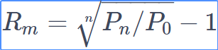

$$R_{m}=\sqrt[n]{P_{n}/P_{0}}-1$$

Pn：第n年的价格指数

###### 3.7.5.8.11.5. 算数平均法

更符合资本资产定价模型中的平均方差的结构，因而是下一阶段风险溢价的一个更好的预测指标。

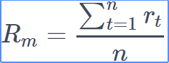

$$R_{m}=\frac{\sum_{t=1}^{n}r_t}{n}$$

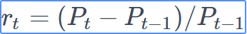

$$r_{t}=(P_{t}-P_{t-1})/P_{t-1}$$

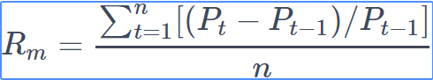

$$R_{m}=\frac{\sum_{t=1}^{n}[(P_{t}-P_{t-1})/P_{t-1}]}{n}$$

Pt：第t年的价格指数

rt：第t年的市场报酬率

### 3.7.6. 股利增长模型

#### 3.7.6.9. 基本公式

假定收益以固定的年增长率递增，则股权资本成本的计算公式为：

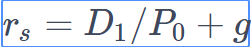

$$r_{s}=D_{1}/P_{0}+g$$

rs：普通股成本。

D1：预期下年现金股利率。

P0：普通股当前市价。

g：股利增长率。

与第6章普通股的期望报酬率的确定公式一致。

#### 3.7.6.10. 增长率（g）的估计


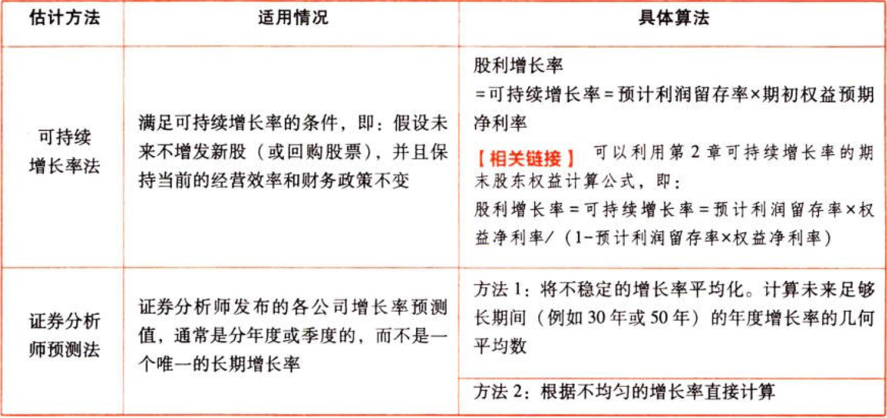

### 3.7.7. 债券收益率风险调整模型

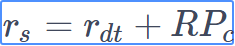

$$r_{s}=r_{dt}+RP_{c}$$

rdt：税后债务成本。

RPc：股东比债权人承担更大风险所要求的风险溢价。

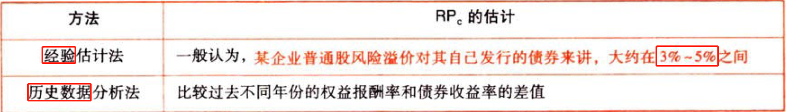

## 3.8. 考虑发行费用的普通股资本成本的估计:star: :star: 

### 3.8.8. 新发行普通股的资本成本

新发行普通股的资本成本，也被称为外部股权成本。新发行普通股会发生发行费用，因此它比留存收益进行再投资的内部股权成本要高一些。

如果将发行费用考虑在内，新发行普通股资本成本的计算公式则为：

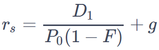

$$r_{s}=\frac{D_{1}}{P_{0}(1-F)}+g$$

F：发行费用率。

### 3.8.9. ）留存收益资本成本的估计

留存收益资本成本的估计与普通股资本成本相似，但无须考虑筹资费用。

# 4. 混合筹资资本成本的估计

## 4.9. 混合筹资的特征和内容:star: 

特征：兼具债权利股权筹资双重属性。

内容：优先股筹资、永续债筹资、可转换债券筹资、附认股权证债券筹资。

教材在第10 章介绍可转换债券筹资、附认股权证债券筹资。

## 4.10. 混合筹资资本成本的估计:star: :star: 

### 4.10.10. 优先股资本成本的估计

优先般资本成本是优先股股东要求的必要报酬率，包括股息和发行费用。

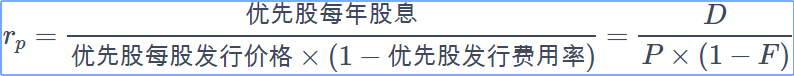

$$r_{p}=\frac{优先股每年股息}{优先股每股发行价格\times(1-优先股发行费用率)}=\frac{D}{P\times(1-F)}$$

优先般资本成本的佑汁方法与债务成本类似， 不同的只是其股利在税后支付，
其资本成本会高于债务的资本成本。

### 4.10.11. 永续债资本成本的估计

没有明确到期日或期限非常长的债券，债券发行方只需支付利息，没有还本义务。实际操作中会附加赎回及利率调整条款。

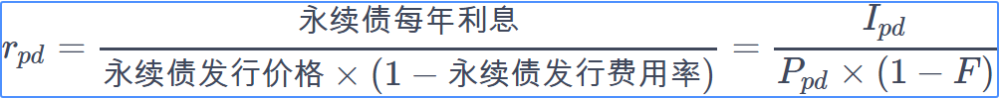

$$r_{pd}=\frac{永续债每年利息}{{永续债发行价格}\times(1-永续债发行费用率)}=\frac{I_{pd}}{P_{pd}\times(1-F)}$$

# 5. 加权平均资本成本的计算

## 5.11. 加权平均资本成本的意义:star: 

加权平均资本成本是以各项个别长期资本占企业总资本中的比重为权数，对各项个别长期资本成本率进行加权平均而得到的全部长期资本的平均成本。

## 5.12. 加权平均资本成本的计算方法（ ★★）


$$r_{w}=\sum_{j=1}^{n}({资本j的成本}\times{资本j的比重})=\sum_{j=1}^{n}(r_{j}\times{W_{j}})$$

权重的选择：

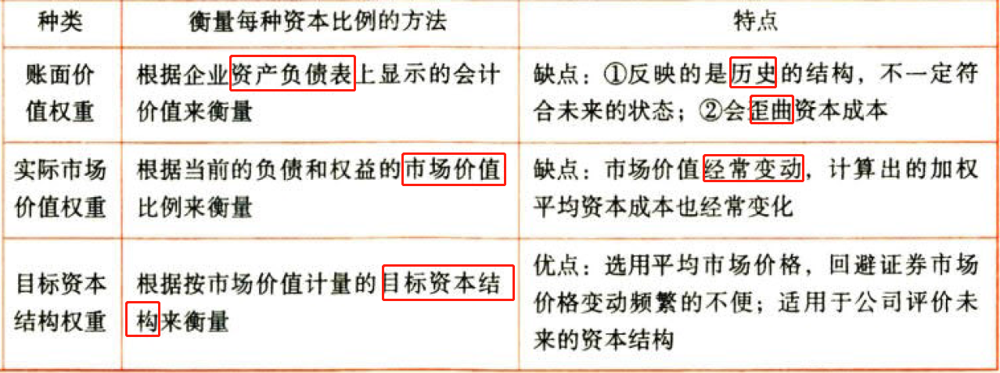

# 6. 总结

End。
