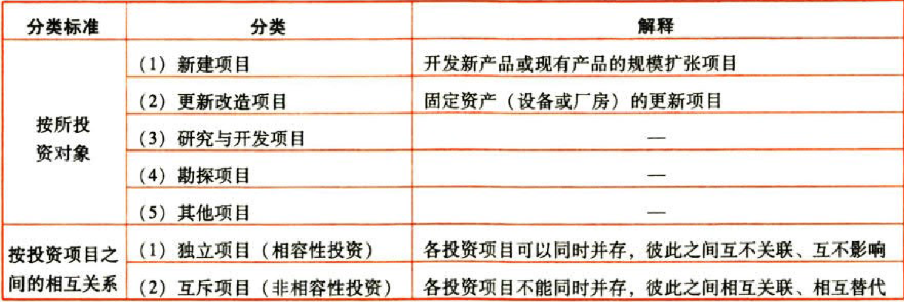
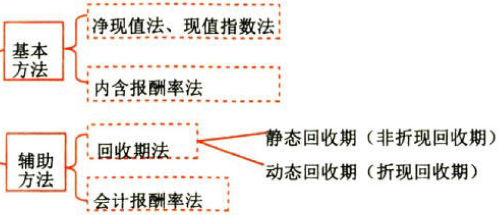
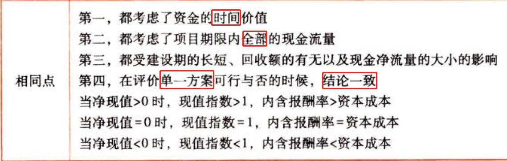
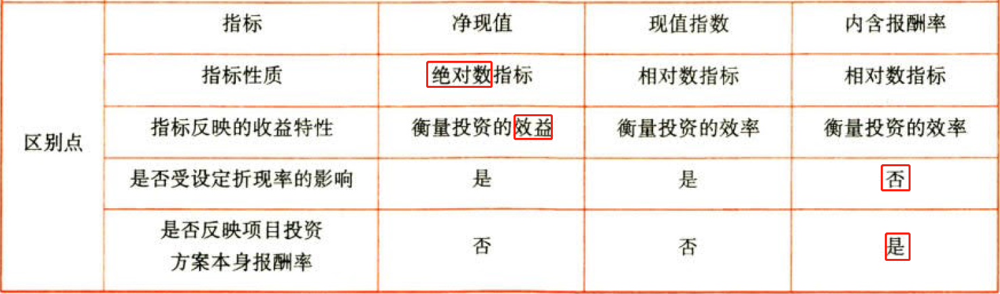
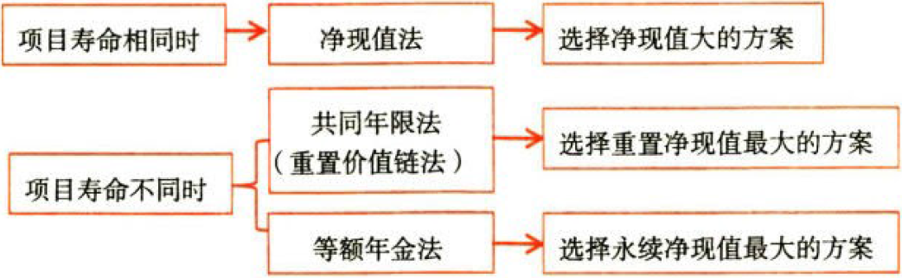
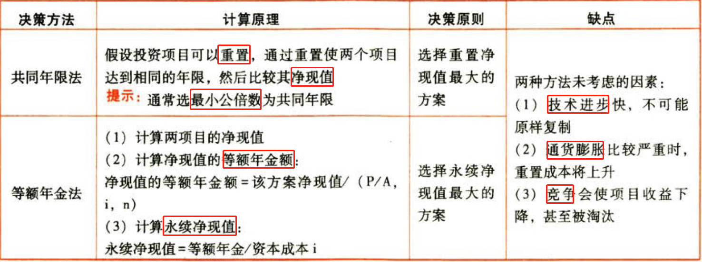
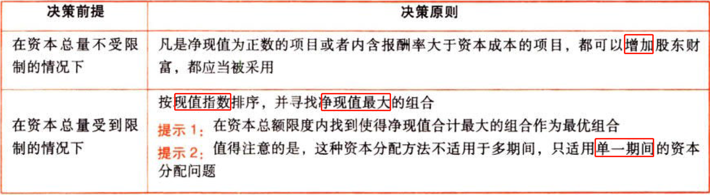
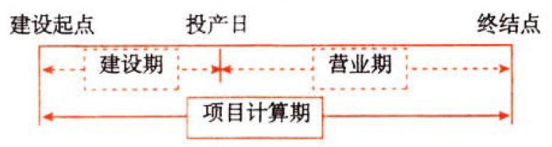
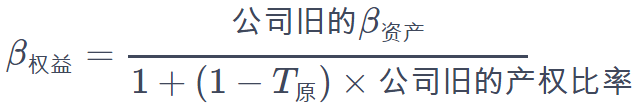
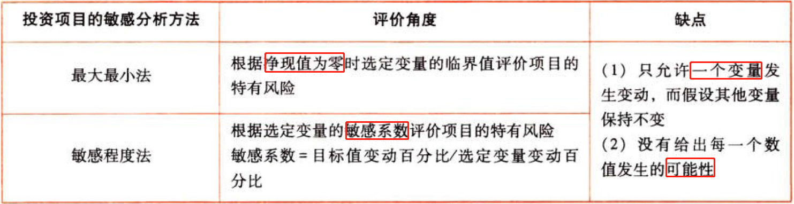

投资项目资本预算

# 1. 投资项目的类型和评价程序

## 1.1. 投资项目的类型:star: 



## 1.2. 投资项目的评价程序:star: 

①提出投资`方案`。

②估计相关`现金流量`。

③计算投资决策`指标`。

④`比较`决策指标与可接受标准。

⑤进行`风险分析`。

# 2. 投资项目的评价方法

## 2.3. 独立项目的评价方法:star: :star: :star: 



### 2.3.1. 净现值Net-present-value（NPV）法

```
净现值(NPV)＝未来现金净流量现值－原始投资额现值
```


为了比较`投资额不同`的项目，人们提出了现值指数（Profitability-index，简称PI），现值指数也称为获利指数或现值比率。

```
现值指数(Pl)＝未来现金净流量现值／原始投资额现值
```


### 2.3.2. 内含报酬率（Internal-rate-of-reurn，简称IRR）法

指能够使未来现金净流量现值等于原始投资额现值的折现率，或者说是使投资项目净现值为零的折现率。


### 2.3.3. 基本指标之间的联系与区别





（1）计算净现值和现值指数时，需要`预先设定`折现率，指标大小受折现率高低的影响，折现率的高低甚至会影响方案的优先次序；折现率的确定可根据`企业的资本成本`或投资者要求的`最低投资报酬率`来确定

（2）投资人想要的是实实在在的`投资回报金额`，而非报酬率，因此内含报酬率、现值指数不适用于`互斥项目`的投资决策

### 2.3.4. 回收期（Payback-period，简称PP）法

优点：回收期法计算`简便`，并且容易为决策人所正确`理解`；可以`大体上衡量`项目的流动性和风险。

缺点：静态回收期忽视了资金`时间价值`；没有考虑`回收期以后的`现金流量，即没有衡量`盈利性`；容易导致`短期化`行为，可能放弃有战略意义的长期项目。

#### 2.3.4.1. 非折现回收期（静态回收期）

非折现回收期是指不考虑资金时间价值，用未来现金净流量累计到原始投资额时所经历的时间。它代表收回投资所需要的年限。

（1）在原始投资额一次性支出，每年现金净流量相等时：

```
回收期＝原始投资额／每年现金净流量
```
若投产后前若干年的现金流量相等，而且相等的流量之和≥原始投资额：

```
回收期＝建设期＋原始投资额／每年相等的现金净流量
```
（2）如果现金净流量每年不等，或原始投资额是分几年投入的，其计算公式为（设M是收回原始投资额的前一年）：

```
回收期＝M＋第M年的尚未回收额／第（M+1）年的现金净流量
```
#### 2.3.4.2. 折现回收期（动态回收期）

折现回收期是指在考虑资金时间价值的情况下，未来现金净流量的现值等于原始投资额现值时所经历的时间。

设M是收回原始投资额现值的前一年：

```
回收期＝M＋第M年的尚未回收额的现值／第（M+1）年的现金净流量现值
```
在原始投资额一次性支出，每年现金净流量相等时，假定动态回收期为n年，则：

```
(P/A,i,n)＝原始投资额现值／每年现金净流量
```
计算出年金现值系数后，通过查年金现值系数表，利用插值法，即可推算出动态回收期n。

### 2.3.5. 会计报酬率（Accounting-rate-of-return，简称ARR）法

```
会计报酬率＝年平均净利润／原始投资额×100%
```
优点：数据容易获得、计算简便，易于理解；考虑了整个项目寿命期的全部利润，能衡量盈利性。

缺点：未使用现金利率，使用的是会汁的账面利润，忽视了折旧对现金流量的影响；没有考虑货币时间价值，忽视了净利润的时间分布的影响。

## 2.4. 互斥项目的优选问题:star: :star: :star: 



### 2.4.6. 项目寿命相同时

当利用净现值和内含报酬率进行选优有矛盾时，应以`净现值法`结论优先。

### 2.4.7. 项目寿命不相同时



（1）永续净现值是假设项目可以`无限重置`，并且每次都在该项目的终止期，等额年金的资本化就是项目的净现值。永续净现值的计算并非总是必要的。在`资本成本`相同时，等额年金大的项目永续净现值肯定大，直接根据等额年金大小判断项目的优劣

（2）只有重重概率很高的项目才适宜采用上述分析方法。对于预计项目`年限差别不大`的项目，可直接比较净现值，不需要做重重现金流的分析

（3）共同年限法下可以采用简便方法计算调整后净现值，即只需要将未来重置的各个时点的净现值进一步折现到0时点。进一步折现时，注意折现期的确定，因为是对净现值折现，而计算净现值时已经对项目本身期限内的现金流量进行了折现，所以，确定某个净现值的折现期时要扣除项目本身的期限

## 2.5. 总量受限时的资本分配:star: :star: 



# 3. 投资项目现金流量的估计

## 3.6. 投资项目现金流量的估计方法:star: :star: :star: 

### 3.6.8. 投资项目现金流量的影响因素

（1）区分`相关成本`与非相关成本

（2）不要忽视`机会成本`

（3）要考虑投资方案对公司`其他项目`的影响

（4）对`营运资本`的影响。所谓营运资本的需要，指增加的经营性流动资产与增加的经营性流动负债之间的差额。。

### 3.6.9. 投资项目现金流量的估计

#### 3.6.9.3. 新建项目现金流量的确定（不考虑所得税【所得税率=0】时）

在实务中更重视按`时间`划分现金流量：

项目计算期是指从`投资建设`开始到`最终清理`结束整个过程的全部时间。



建设期现金净流量：

```
建设期现金净流量＝0－长期资产投资（固定资产、无形资产、其他长期资产）
－垫支的营运资本
－原有资产的变现价值
－原有资产变现净损益对所得税的影响
```
营业现金毛流量：

```
营业现金毛流量＝税后经营净利润＋折旧
＝税前经营净利润×(1－所得税税率)＋［折旧×(1－所得税税率)＋折旧×所得税税率］
＝(税前经营净利润＋折旧)×(1－所得税税率)＋折旧×所得税税率
＝(收入－付现营业费用)×(1－所得税税率)＋折旧×所得税税率
```
终结期现金净流量：

```
终结期现金净流量＝回收垫支的营运资本
＋回收长期资产净残值
＋回收长期资产对所得税的影响
```
计算结果的时点设定：

为了简化，通常把计算结果的时点设在`第一年的年初`，其他流入和流出在各年的`年初和年末`。实际上，现金流出和流人的时间可能在任何时间。

（1）选定`时间轴`很重要。通常的做法：

①以`第一笔现金流出`的时间为“现在”时间，即“0”时点。不管它的日历时间是几月几日

②对于`原始投资`，如果没有特殊指明，均假设现金在每个`“计息期期初”`支付；如果特别指明支付日期，如3个月后支付100万元，则要考虑在此期间的时间价值

③对于`营业现金毛流量`，尽管其流入和流出都是陆续发生的，如果没有特殊指明，均假设营业现金毛流量在`“各个计息期期末”`取得

（2）`垫支营运资本`指的是`增加的营运资本`数额

#### 3.6.9.4. 固定资产更新项目的现金流量（不考虑所得税时）

##### 3.6.9.4.1. （1）更新决策现金流量的特点

更新决策的现金流量主要是`现金流出`。即使有少量的残值变价收入，也属于支出抵减，而非实质上的流入增加。

##### 3.6.9.4.2. （2）确定更新决策现金流量应注意的问题

①旧设备的初始投资额应按其`变现价值`考虑。


②设备的使用年限应按`尚可使用年限`考虑。

##### 3.6.9.4.3. （3）固定资产的平均年成本

指该资产引起的现金流出的`年平均值`。

①不考虑货币的时间价值：


$${固定资产平均年成本}=\frac{未来使用年限内的现金流出总量}{使用年限}$$

②如果考虑货币的时间价值：


$${固定资产平均年成本}=\frac{未来使用年限内的现金流出总量}{(P/A,i,n)}$$

应注意的问题：

##### 3.6.9.4.4. 应注意的问题

①平均年成本法是把`继续使用旧设备`和`购置新设备`看成是两个互斥的方案，而不是－个售旧购新的特定设备更换方案

②平均年成本法的假设前提是将来设备再更换时，可以按原来的平均年成本找到可代替的设备

##### 3.6.9.4.5. （4）固定资产的经济寿命

使得固定资产的`平均年成本最小`的那一个使用年限。

## 3.7. 所得税和折旧对现金流量的影响:star: :star: :star: 

### 3.7.10. 基本概念

```
税后费用＝费用×(1－所得税税率)
税后收入＝收入×(1－所得税税率)
折旧抵税＝折旧×所得税税率
```
这里的收入是指根据税法规定需要纳税的收入，不包括项目结束时收回垫支营运资本等现金流入。

这里的折旧包括固定资产折旧和长期资产摊销等非付现营业费用。

### 3.7.11. 税后现金流量的计算

建设期现金净流量：

```
建设期现金净流量＝0－长期资产投资（固定资产、无形资产、其他长期资产）
－垫支的营运资本
－原有资产的变现价值
－原有资产变现净损益对所得税的影响
```
营业现金毛流量：

```
营业现金毛流量＝税后经营净利润＋折旧
＝税前经营净利润×(1－所得税税率)＋［折旧×(1－所得税税率)＋折旧×所得税税率］
＝(税前经营净利润＋折旧)×(1－所得税税率)＋折旧×所得税税率
＝(收入－付现营业费用)×(1－所得税税率)＋折旧×所得税税率
```
终结期现金净流量：

```
终结期现金净流量＝回收垫支的营运资本
＋回收长期资产净残值
＋回收长期资产对所得税的影响
```
# 4. 投资项目折现率的估计

## 4.8. 加权平均资本成本:star: :star: 

使用企业当前加权平均资本成本作为投资项目的资本成本，应`同时具备`两个条件：

（1）项目的经营风险与企业当前资产的平均`经营风险`相同；

（2）公司继续采用相同的`资本结构`为新项目筹资。

【提示】满足等风险假设（`经营风险`和`财务风险`都没有变化）

## 4.9. 可比公司法:star: :star: :star: 

运用可比公司法估计投资顶目的资本成本。

### 4.9.12. 不满足等经营风险假设

如果新项目的经营风险与现有资产的平均经营风险显著不同（不满足等经营风险假设）：

调整方法：寻找一个与待评价项目具有类似经营业务的上市公司，以该上市公司的β值替代待评价项目的β值。

#### 4.9.12.5. ①卸载可比公司的财务杠杆：


$$\beta_{权益}=\frac{{可比公司}\beta_{资产}}{1+(1-T_{可比})\times{可比公司产权比率}}$$

#### 4.9.12.6. ②加载目标企业的财务杠杆：


$${目标公司}\beta_{资产}=\beta_{权益}\times[1+(1-T_{目标})\times{目标公司产权比率}]$$

#### 4.9.12.7. ③根据目标公司$\beta_{资产}$计算股东要求的报酬率（股东权益成本）：


$${股东要求的报酬率}={无风险报酬率}+{目标公司}\beta_{资产}\times{市场风险溢价}$$

#### 4.9.12.8. ④计算目标企业的加权平均资本成本：


$${加权平均资本成本}={税前债务成本}\times(1-T_{目标})\times{负债比重}+{股东权益成本}\times{权益比重}$$

负债权益比，即第2章的产权比率，或严谨来说是`净财务杠杆`。

### 4.9.13. 不满足等资本结构假设

如果新项目的经营风险与公司原有经营风险一致，但资本结构与公司原有资本结构不一致（满足等经营风险假设，但不满足等资本结构假设）

#### 4.9.13.9. ①卸载公司旧的财务杠杆：



$$\beta_{权益}=\frac{{公司旧的}\beta_{资产}}{1+(1-T_{原})\times{公司旧的产权比率}}$$

#### 4.9.13.10. ②加载投资新项目后公司新的财务杠杆：


$${公司新的}\beta_{资产}=\beta_{权益}\times[1+(1-T_{新})\times{公司新的产权比率}]$$

#### 4.9.13.11. ③根据新的$\beta_{资产}$计算股东要求的报酬率（股东权益成本）：


$${股东要求的报酬率}={无风险报酬率}+\beta_{资产}\times{市场风险溢价}$$

#### 4.9.13.12. ④计算企业新的加权平均资本成本：


$${加权平均资本成本}={税前债务成本}\times(1-T_{新})\times{新负债比重}+{股东权益成本}\times{新权益比重}$$

β权益不含财务风险，β资产既包含了项目的经营风险，也包含了目标企业的财务风险。

# 5. 投资项目的敏感分析

## 5.10. 敏感分析的含义:star: 

敏感分析是指在`确定性分析`的基础上，进一步分析`不确定性因素`对投资项目的最终经济效果指标的影响及`影响程度`。

若某参数的小幅度变化能导致经济效果指标的较大变化，则称此参数为`敏感因素`，反之则称其为非敏感因素。即敏感系数的`绝对值大于1`的参数为敏感因素，敏感系数的绝对值小于1的参数为非敏感因素。

## 5.11. 敏感分析的方法:star: :star: :star: 

敏感分析，通常是在假定其他变量不变的情况下，测定某一变量发生特定变化时对目标值的影响，在对投资项目做敏感分析时，这个目标值一般选择净现值（或内含报酬率）。



# 6. 总结

End。
