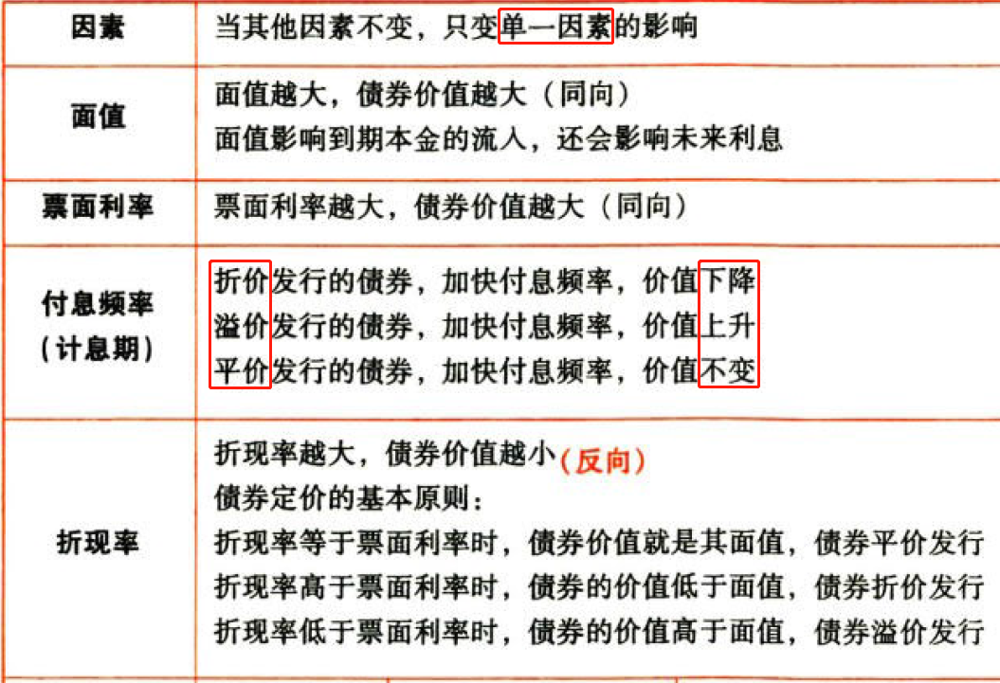
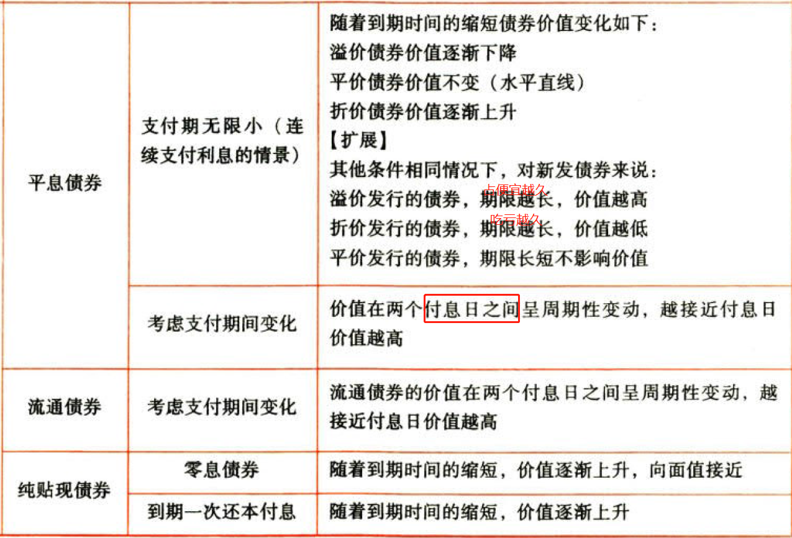
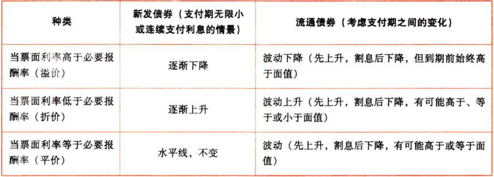
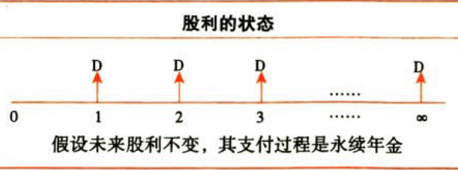
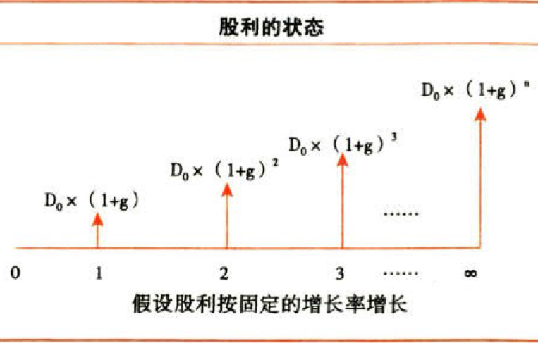

C06债券、股票价值评估

# 1. 债券价值评估

## 1.1. 债券价值的评估方法:star: :star: :star: 

### 1.1.1. 债券的估值模型

#### 1.1.1.1. 债券价值的含义

发行者按照合同规定从现在至债券到期日所支付的款项的现值。

#### 1.1.1.2. 计算

基本公式：

$${债券价值}={未来各期利息收入的现值合计}+{未来到期本金或售价的现值}$$

##### 1.1.1.2.1. ①平息债券

指利息在期间内`平均支付`的债券。支付的频率可能是一年一次、半年一次或每季度一次等。

$$V_{d}={利息}\times(P/A,r_{d},n)+{本金}\times(P/F,r_{d},n)$$

##### 1.1.1.2.2. ②纯贴现债券

指承诺在未来某一确定日期`按面值支付`的债券。

①到期一次还本付息债券（特殊的纯贴现债券，只不过在到期日按本利和支付）：

$$V_{d}=({本金}+{利息})\times(P/F,r_{d},n)$$

②零息债券（期内不付息，到期还本）：

$$V_{d}={本金}\times(P/F,r_{d},n)$$

##### 1.1.1.2.3. ③流通债券

指已发行并在`二级市场`上流通的债券。

###### 1.1.1.2.3.1. 特点

①到期时间短于债券发行在外的时间

②债券估值的时点可以是任何时点，不在发行日，会产生“非整数计息期”问题

###### 1.1.1.2.3.2. 计算公式

①若没有“非整数计息期”问题（估值的时点在付息日之后的第一天）时：

假设债券总发行期限是n，

第t时点的`平息`债券价值$V_{d}={本金}\times(P/F,r_{d},n-t)+{每期利息}\times(P/A,r_{d},n-t)$

第t时点的`零息`债券价值$V_{d}={本金}\times(P/F,r_{d},n-t)$

第t时点的`到期一次还本付息`债券价值$V_{d}=({本金}+{每期利息}\times{n})\times(P/F,r_{d},n-t)$

②若有“非整数计息期”问题时：

一般采用两次折现的方法，先把未来的现金流量折到`整数计息期`，再折到`估价时点`。

##### 1.1.1.2.4. 解读

（1）折现率$r_{d}$取决于当前`等风险投资`的市场利率。

（2）考试只要不特指，年折现率为按年计算的有效年利率，当年内计息多次时，应换算成`计息期`折现率进行计算。

（3）对于平息流通债券价值的计算，估价时点之前已经支付的利息是非相关流量，未来的现金流量是未来的利息和本金。

（4）对于到期一次还本付息流通债券，估价时点之前不会有利息支付，未来的现金流量是全部利息和本金。

#### 1.1.1.3. 决策原则

当债券价值高于购买价格时，可以购买。

### 1.1.2. 债券价值的影响因素

[关于付息频率对溢价、折价债券的价值的影响，参考这里](C06折价发行的债券-加快付息频率-价值下降.md)。

随着到期时间的缩短，折现率变动对债券价值的影响越来越小。

对于平息债券，随着到期时间的缩短债券价值变化如下：

## 1.2. 债券的期望报酬率:star: :star: 

指以特定价格购买债券并持有至到期日所能获得的报酬率，它是使未来现金流量现值等于债券购入价格的`折现率`，债券的期望报酬事通常用`到期收益率`来衡量。

### 1.2.3. 指标计算

①求解含有折现率的方程：

$$P_{0}=I\times(P/A,r_{d},n)+M\times(P/F,r_{d},n)$$

②查现值系数表，然后利用`内插法`即可求得$r_{d}$

### 1.2.4. 相关结论

（1）平价发行的债券，票面利率＝到期收益率

（2）溢价发行的债券，票面利率＞到期收益率

（3）折价发行的债券，票面利率＜到期收益率

### 1.2.5. 决策原则

如果到期收益率高于投资人要求的报酬率，则应买进该债券，否则就放弃。

债券的到期收益率的计算方法与第5章投资项目资本预算中计算内含报酬率的方法相同，因此债券的到期收益率可以理解为债券投资的内含报酬率。

# 2. 普通股价值评估

## 2.3. 普通股价值的评估方法:star: :star: :star: 

### 2.3.6. 零增长股票的价值

$$V_{0}=\frac{D}{r_{s}}$$

### 2.3.7. 固定增长股票的价值

$$V_{0}=\frac{最近刚支付的股利（当前股利）\times(1+股利规定增长率)}{年折现率-股利固定增长率}=\frac{预计第一年的股利}{年折现率-股利固定增长率}$$

$$V_{0}=\frac{D_{0}\times(1+g)}{r_{s}-g}=\frac{D_{1}}{r_{s}-g}$$

年折现率，一般采用资本成本率或投资的必要报酬率。

### 2.3.8. 解读

（1）注意区分$D_{0}$和$D_{1}$。$D_{0}$是估价时点已经支付的股利，它与$V_{0}$在同一会计期，$D_{1}$是固定增长第一期的股利。

（2）股利增长率可以结合第2章`可持续增长率`计算。在满足未来经营效率、财务政策不变（包括不增发新股或回购股票）的特定条件下，股利增长率可以用上年可持续增长率来确定。

（3）该公式具有通用性，第8章企业价值评估会用到此公式。只要未来现金流量逐年稳定增长，且期限趋于无穷，就可以利用此公式计算未来现金流量的现值。

### 2.3.9. 非固定增长股票的价值

在现实的生活中，有的公司股利是不固定的，应采用分段计算的方法。

## 2.4. 普通股的期望报酬率:star: :star: 

### 2.4.10. 零增长股票的期望报酬率

$$r_{s}=\frac{D}{P_{0}}$$

### 2.4.11. 固定增长股票的期望报酬率

$$r_{s}={股利收益率}+{股利增长率}=\frac{D_{1}}{P_{0}}+g$$

若资本市场有效，g可以理解为`股价增长率`或`资本利得收益率`。

### 2.4.12. 非固定增长股票的期望报酬率

类似于债券到期收益率的计算方法，利用逐步测试结合`内插法`来求解。

基本原理是计算使得未来现金流入现值等于购买价格凡的折现率。类似于债券到期收益率，也类似于第5章投资项目资本预算中的内含报酬率。

# 3. 混合筹资工具价值评估

## 3.5. 优先股的特殊性:star: 

### 3.5.13. 优先分配利润

优先股股东按照约定的票面股息率，优先于普通股股东分配公司利润

### 3.5.14. 优先分配剩余财产

公司进行消算时，应当优先于普通股股东向优先股股东支付未派发的股息和公司章程约定的清算金额，不足以支付的按照优先股股东持股比例分配

### 3.5.15. 表决权限制

一般事项：优先股股东不出席股东大会会议，所持股份没有表决权

特殊事项：

（1）修改公司章程中与优先股相关的内容

（2）发行优先股

（3）一次或累计减少公司注册资本超过10%

（4）公司合并、分立、解散或变更公司形式

（5）公司章程规定的其他情形

上述特殊事项的决议，需要双重绝对多数通过：

①出席会议的普通股股东（含表决权恢复的优先股股东）所持表决权的2/3以上通过；

②出席会议的优先股股东（不含表决权恢复的优先股股东）所持表决权的2/3以上通过

## 3.6. 优先股价值的评估方法:star: :star: 

### 3.6.16. 优先股的估值

当优先股存续期内采用相同的固定股息率时，优先股则相当于永久债券。其佑值公式如下：

$$V_{p}=\frac{优先股每股股息}{年折现率}=\frac{D_{p}}{r_{p}}$$

年折现率一般采用资本成本率或投资的必要报酬率。

### 3.6.17. 永续债的估值

$$V_{pd}=\frac{永续债每年利息}{年折现率}=\frac{I}{r_{pd}}$$

年折现率一般采用当期等风险投资的市场利率。

## 3.7. 优先股、永续债的期望报酬率:star: :star: 

### 3.7.18. 优先股的期望报酬率

$$r_{p}=\frac{优先股每股股息}{优先股当前股价}=\frac{D_{p}}{P_{p}}$$

### 3.7.19. 永续债的期望报酬率

$$r_{pd}=\frac{永续债每年利息}{永续债当前价格}=\frac{I}{P_{pd}}$$

# 4. 总结

End。
