C07期权价值评估

# 1. 期权的概念、类型和投资策略

## 1.1. 期权的概念:star: 

期权是指一种`合约`，该合约赋予持有人在某一特定日期或该日之前的任何时间以固定价格购进或售出一种资产的权利。

## 1.2. 期权的类型:star: 

### 1.2.1. 期权的分类

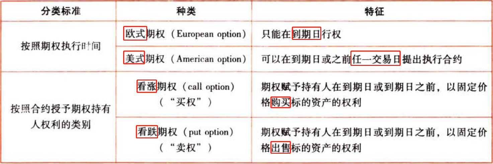

### 1.2.2. 期权到期日价值和净损益

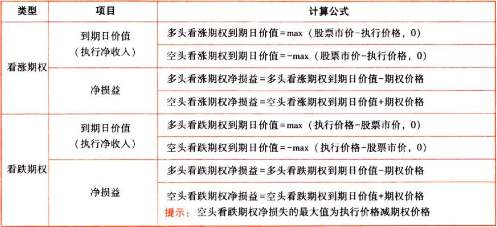

多头和空头彼此是零和博弈，即$空头期权到期日价值=-多头期权到期日价值$，$空头期权净损益=-多头期权净损益$。

多头是期权的购买者，其净损失有限（最大值为期权价格）；空头是期权的出售者，收取期权费，成为或有负债的持有人。

## 1.3. 期权的投资策略:star: :star: :star: 

### 1.3.3. 保护性看跌期权

#### 1.3.3.1. 含义【买股-怕跌】

股票加多头看跌期权组合，是指购买1股股票，同时购买该股票的1股看跌期权。

#### 1.3.3.2. 组合净收入与组合净损益的确定

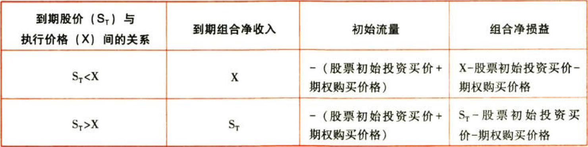


#### 1.3.3.3. 特点

（1）锁定了最低净收入和最低净损益：最低净收入＝X，最低净损益＝X－初始成本。

（2）净损益的预期降低了：当股价上涨时，比单一投资股票获得的收益低（少一个期权价格）。

### 1.3.4. 抛补性看涨期权

#### 1.3.4.4. 含义【不会涨-买股】

股票加空头看涨期权组合，是指购买1股股票，同时出售该股票的1股看涨期权。

#### 1.3.4.5. 组合净收入与组合净损益的确定

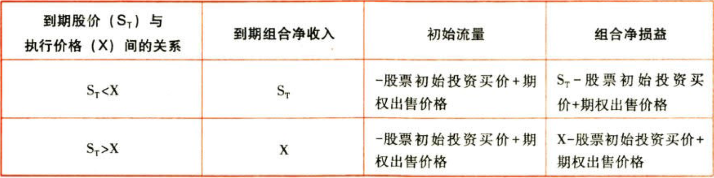

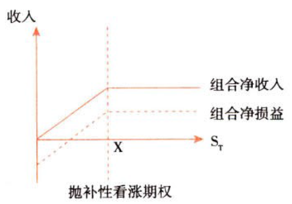

#### 1.3.4.6. 特征

将净损益限定在特定的区域内。

（1）锁定了最高净收入和最高净损益：最高净收入＝X，最高净损益＝X－股票初始投资买价＋期权出售价格。

（2）存在最低净收入和最低净损益：理论上当股价下降到0的时候，$最低净收入=0$，$最低净损益=-股票初始投资买价+期权出售价格=-S_0+C_0$。

### 1.3.5. 对敲

#### 1.3.5.7. 多头对敲

含义：同时买进一只股票的看涨期权和看跌期权，它们的执行价格、到期日都相同。

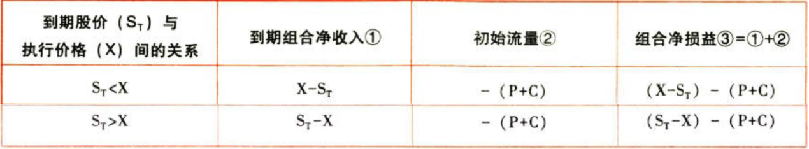

式中，C——看涨期权购买价格；P——看跌期权购买价格；X——执行价格；$S_T$——到期日股票价格。

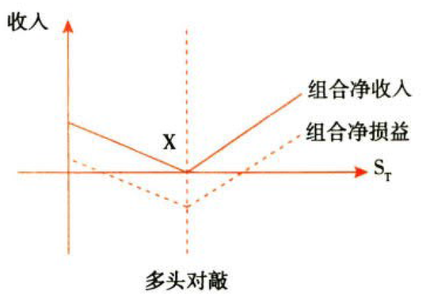

特征：多头对敲的最坏结果是到期股价与执行价格一致，白白损失了看涨期权和看跌期权的购买成本。股价偏离执行价格的差额必须超过期权购买成本，才能给投资者带来净收益。

适用范围：预计市场价格将发生剧烈变动，但是不知道变动的方向是升高还是降低。

#### 1.3.5.8. 空头对敲

含义：同时卖出一只股票的看涨期权和看跌期权，它们的执行价格、到期日都相同。

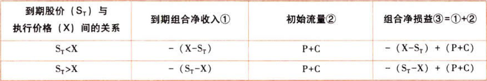

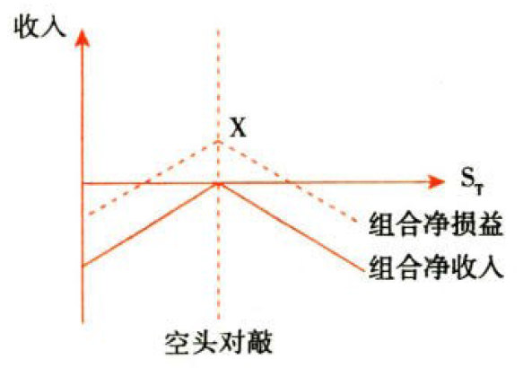

特征：最好的结果是到期股价与执行价格一致，投资者臼臼赚取出售看涨期权和看跌期权的收入。空头对敲的股价偏离执行价格的差额必须小于期权出售收入，才能给投资者带来净收益。

适用范围：预计市场价格将相对比较稳定。

# 2. 金融期权价值评估

## 2.4. 金融期权价值的影响因素:star: :star: :star: 

```
期权价值＝内在价值＋时间溢价
```
### 2.4.6. 期权的内在价值和时间溢价

#### 2.4.6.9. 期权的内在价值

期权的内在价值，是指期权`立即执行`产生的经济价值。内在价值的大小，取决于股票现行市价$S_0$与期权执行价格X的高低。

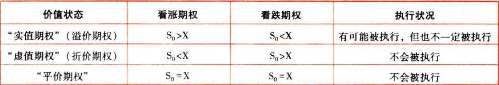

内在价值是从多头的角度考虑的，内在价值不存在负数情况，最低为0。

#### 2.4.6.10. 期权的时间溢价

期权的时间溢价是指期权价值超过内在价值的部分。

时间溢价是时间带来的拉动的价值飞是未来存在不确定性而产生的价值，不确定性越强，期权时间价值越大。

```
时间溢价＝期权价值－内在价值
```
在本章，题中没有明确说明的悄况下，期权价值等于期权价格，只有在套利的情况下，存在期权价值和期权价格不相等的情况。

### 2.4.7. 影响期权价值的主要因素

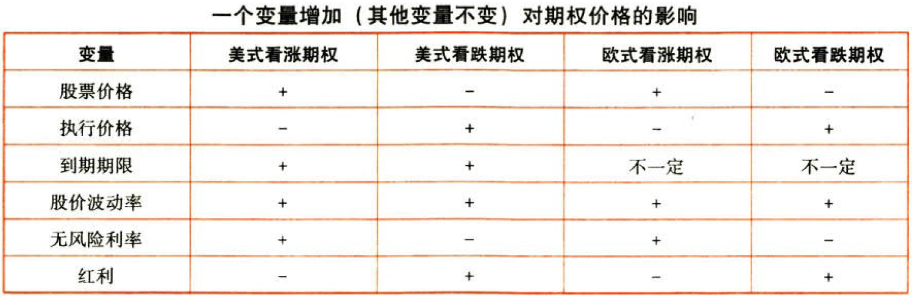

## 2.5. 金融期权价值的评估方法:star: :star: :star: 

### 2.5.8. 期权估值原理

#### 2.5.8.11. 复制原理和套期保值原理

##### 2.5.8.11.1. 基本思想

构造一个`借款买股票`的组合，使其到期收益与期权的到期收益一致，则该组合的投资成本就是期权的价值。

$$每份期权价值C_0=借款买若干股股票的投资组合成本=购买股票支出-借款数额=H\times{S}_0-B$$

##### 2.5.8.11.2. 计算步骤

（1）确定可能的到期日股票价格$S_u$和$S_d$：

$$上行股价S_u=股票现价S_0\times上行乘数u$$

$$下行股价S_d=股票现价S_0\times下行乘数d$$

（2）根据执行价格计算确定期权到期日价值$C_u$和$C_d$：

$$股价上行时期权到期日价值C_u=max(上行股价-执行价格,0)$$

$$股价下行时期权到期日价值C_d=max(0,下行股价-执行价格)$$

（3）计算套期保值比率（购买股票的股数）：

$$套期保值比率H=Δ期权价值/Δ股价=(C_u-C_d)/(S_u-S_d)$$

（4）计算投资组合的成本（期权价值）＝购买股票支出－借款数额

$$购买股票支出=套期保值比率H\times股票现价S_0＝H\times{S_0}$$

$$借款数额B=\frac{到期日下行股价\times套期保值比率-股价下行时期权到期日价值}{1+r}=\frac{H\times{S_d}-C_d}{1+r}$$

##### 2.5.8.11.3. 提示

如果由市场决定的期权价格和按照复制原理计算的朋权价值二者不一致，说明存在套利空间。套利就是对于不划算的做反向操作，划算的就可以投资。

①如果期权价格被高估（期权价格大于期权价值），说明购买期权不划算，借款买股票投资组合是划算的，应当是卖出期权，那么相应的，就要买组合，即买股票以及借入款项。

②如果期权价格被低估（期权价格小于期权价值），说明购买期权划算，借款买股票投资组合是不划算的，应当是买入期权，那么相应的，就要卖组合，即卖出股票以及贷出款项。

即期权的买卖和组合的买卖方向是相反的，实期权，就卖组合；卖期权，就买组合。

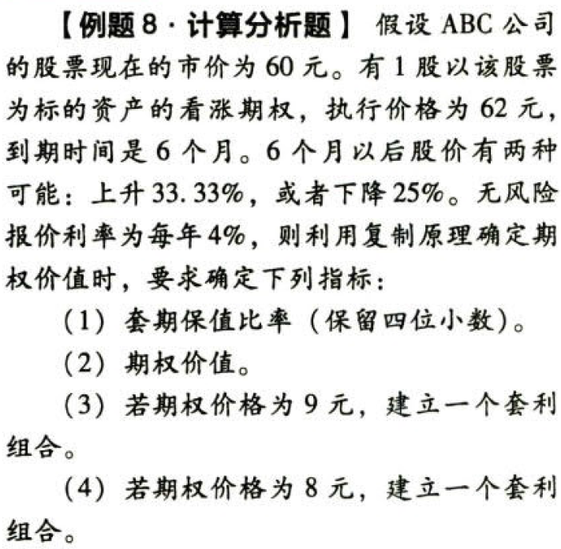

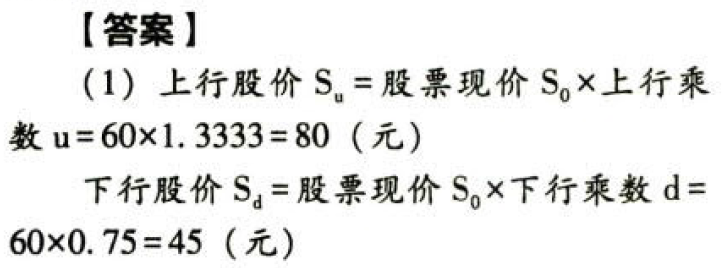

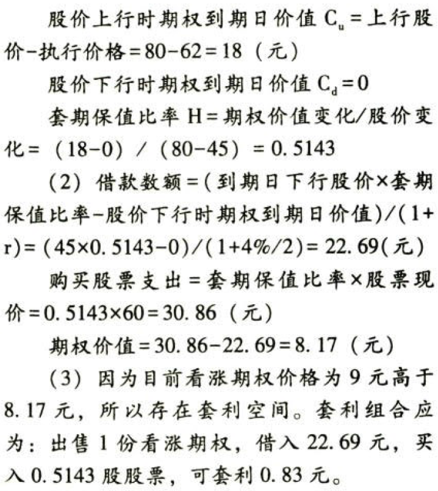

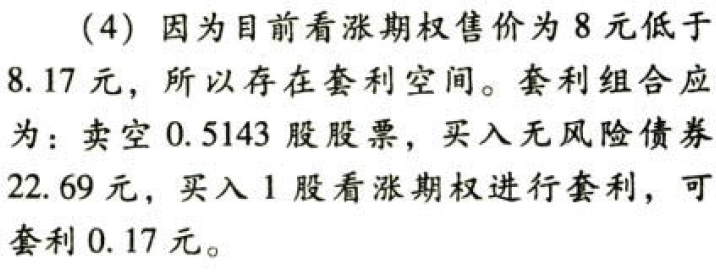

#### 2.5.8.12. 风险中性原理

##### 2.5.8.12.4. 基本思想

假设投资者对待风险的态度是中性的，所有证券的预期报酬率都应当是无风险利率。

若股票不派发红利，股票价格的变动百分比就是股票投资的报酬率。

因此：

```
期望报酬率（元风险利率）＝（上行概率×股价上升时股价变动百分比）＋下行概率×（－股价下降时股价变动百分比）
```
股价下降时股票投资收益率为负值。

##### 2.5.8.12.5. 计算步骤

（1）确定到期日可能的股票价格Su和Sd（同复制原理）

（2）根据执行价格计算期权到期日价值Cu和Cd（同复制原理）

（3）计算$上行概率P$和$下行概率(1-P)$：

$$无风险利率r=P\times股价上升百分比＋(1-P)\times(－股价下降百分比)$$

（4）计算期权价值：

$$C_0=\frac{P\times{C_u}+(1-P)\times{C_d}}{1+r}$$

### 2.5.9. 二叉树期权定价模型

#### 2.5.9.13. 单期二叉树定价模型

##### 2.5.9.13.6. 基本原理

风险中性原理的应用。

##### 2.5.9.13.7. 计算公式

①教材公式：

$$期权价格=\frac{1+r-d}{u-d}\times\frac{C_u}{1+r}+\frac{u-1-r}{u-d}\times\frac{C_d}{1+r}$$

$$u=股价上行乘数=1+股价上升百分比$$

$$d=股价下行乘数=1-股价下降百分比$$

##### 2.5.9.13.8. 解读公式

$$期权价格=\frac{上行概率\times{C_u}+下行概率\times{C_d}}{1+r}=\frac{{\frac{1+r-d}{u-d}}\times{C_u}+{\frac{u-1-r}{u-d}}\times{C_d}}{1+r}$$

#### 2.5.9.14. 两期二叉树模型

##### 2.5.9.14.9. 基本原理

到期时间分成两期，由单期模型向两期模型的扩展，实际上就是单期模型的两次应用。

##### 2.5.9.14.10. 计算公式

首先，利用单期定价模型，计算$C_{u}$和$C_{d}$：

$$C_u=P\times{\frac{C_{uu}}{1+r}}+(1-P)\times{\frac{C_{ud}}{1+r}}$$

$$C_d=P\times{\frac{C_{ud}}{1+r}}+(1-P)\times{\frac{C_{dd}}{1+r}}$$

然后，根据单期定价模型计算期权价值$C_{0}$：

$$C_{0}=P\times{\frac{C_u}{1+r}}+(1-P)\times{\frac{C_d}{1+r}}$$

这里r是指每期的期利率，例如无风险年报价利率是8%，期权的到期日时间是1年，利用4期二叉树模型计算，那么期利率r就是2%

#### 2.5.9.15. 多期二叉树模型

##### 2.5.9.15.11. 基本原理

与两期模型一样，从后向前逐级推进，只不过多了一个层次。

##### 2.5.9.15.12. 计算公式

需注意的问题：期数增加以后，要调整价格变化的升降幅度，以保证年报酬率的标准差不变。把年报酬率标准差和升降百分比联系起来的公式是：

$$u=1+上升百分比=e^{\sigma\sqrt{t}}$$

$$d=1-下降百分比=1/u$$

其中，

e：自然常数，约等于2.7183；

σ：标的资产连续复利报酬率的标准差；

t：以年表示的时段长度。

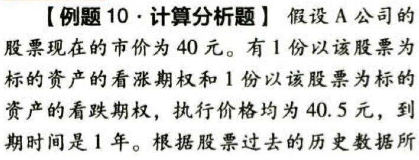

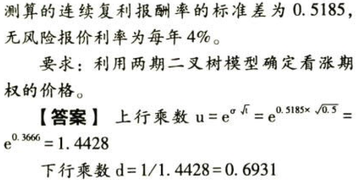


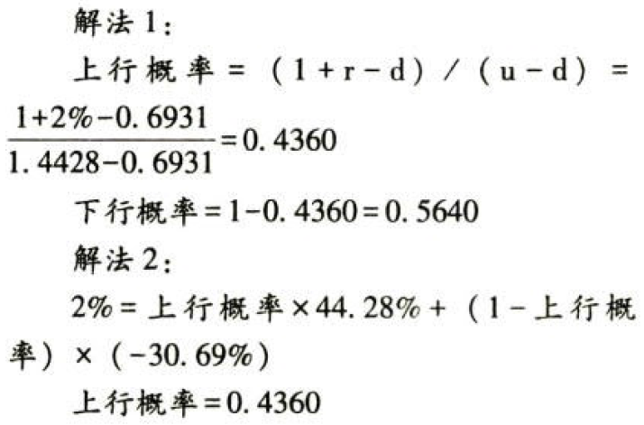

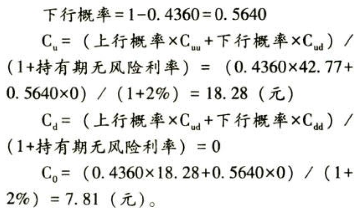

### 2.5.10. 布莱克——斯科尔斯（BS）期权定价模型

#### 2.5.10.16. 基本模型

$$C_0=S_0[N(d_1)]-Xe^{-{r_c}t}[N(d_2)]=S_0[N(d_1)]-PV(X)[N(d_2)]$$

$$d_1=\frac{\ln(S_0/X)+[r_c+(\sigma^2/2)]t}{\sigma\sqrt{t}}=\frac{\ln[S_0/PV(X)]}{\sigma\sqrt{t}}+\frac{\sigma\sqrt{t}}{2}$$

$$d_2=d_1-\sigma\sqrt{t}$$

其中，

$C_0$：看涨期权的当期价值；

$S_0$：标的股票的当期价格；

$N(d)$ ：标准正态分布中离差小于$d$的概率；

$X$：期权的执行价格；

$e$：自然对数的底数，约等于2.7183；

$r_c$：连续复利的年度无风险利率；

$t$：期权到期日前的时间（年）；

$\ln(S_0/X)$ ：$\S_0/X$的自然对数；

$\sigma^2$：连续复利的以年计的股票回报率的方差；

#### 2.5.10.17. 参数估计

##### 2.5.10.17.13. 无风险利率

（1）无风险利率应选择与期权到期日最接近的政府债券利率

（2）这里所说的政府债券利率是指其市场利率，而不是票面利率

（3）模型中的无风险利率是按连续复利计算的利率

如果用$F$表示终值，$P$表示现值，$r_c$表示连续复利率，$t$表示时间（年），则：

$$F=P\times{e^{r_{c}t}}$$

即$r_c=[\ln(F/P)]/t$

为了简便，手工计算时往往使用分期复利作为连续复利的近似替代。使用分期复利时，也有两种选择：

（1）按有效年利率折算。例如，假设有效年利率为$4%$，则半年利率为$\sqrt{1+4%}-1=1.98%$

（2）按报价利率折算。例如，假设年报价利率为$4%$，则半年利率为$4%/2=2%$

##### 2.5.10.17.14. 股票报酬率的标准差

股票报酬率的标准差可以使用历史报酬率来估计

$$\sigma=\sqrt{\frac{1}{n-1}\sum_{t=1}^{n}{(R_t-\bar{R})}^2}$$

其中：$R_t$指报酬率的连续复利值

分期复利的股票报酬率：

$$R_t=\frac{P_t-P_{t-1}+D_t}{P_{t-1}}$$

连续复利的股票报酬率：

$$R_t=\ln(\frac{P_t+D_t}{P_{t-1}})$$

其中：$R_t$指股票在t时期的报酬率；$P_t$指t期的价格；$P_{t-1}$指$t-1$期的价格；$D_t$指t期的股利

#### 2.5.10.18. 适用范围

（1）假设看涨期权只能在到期日执行，即模型仅适用于欧式看涨期权

（2）在期权寿命期内，不考虑股利派发

#### 2.5.10.19. 其他应用

（1）考虑股利派发：在期权估值时把所有到期日前预期发放的未来股利的现值从现行股票价格中扣除

（2）欧式看跌期权估值：利用看涨期权——看跌期权平价定理：

$$看涨期权价格C-看跌期权价格P=标的资产的价格S－执行价格的现值PV(X)$$

（3）美式期权估值：美式期权的价值至少等于相应欧式期权的价值，在某种情况下美式期权的价值更大

# 3. 总结

End。
