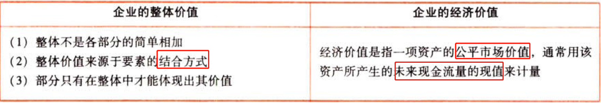
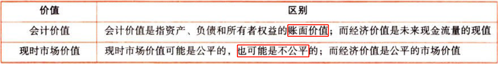
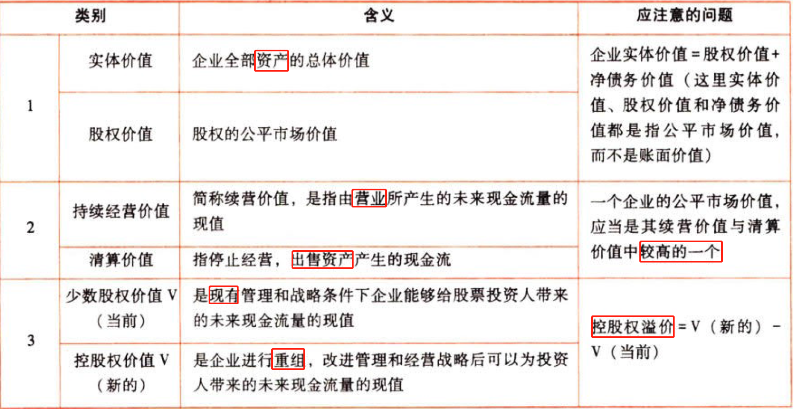
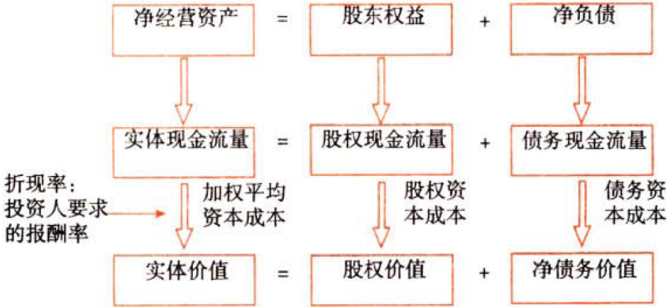
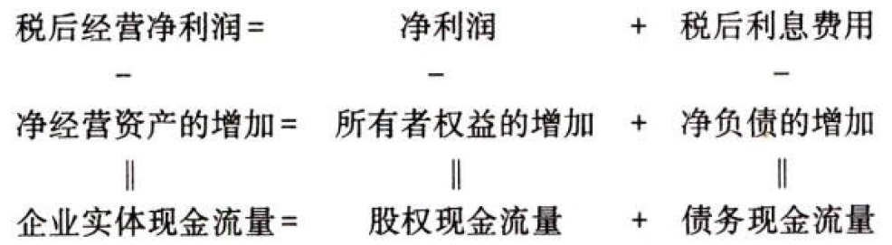
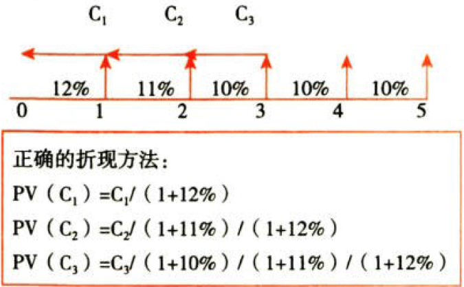

C08企业价值评估

# 1. 企业价值评估的目的和对象

## 1.1. 企业价值评估的目的:star: 

分析和衡量一个企业或一个经营单位的`公平市场价值`，并提供有关信息以帮助投资人和管理当局改善`决策`。

## 1.2. 企业价值评估的对象:star: :star: :star: 

### 1.2.1. 一般对象：企业整体的经济价值

### 1.2.2. 会计价值vs现时市场价值vs经济价值

### 1.2.3. 企业整体经济价值的类别

# 2. 企业价值评估方法

## 2.3. 现金流量折现模型:star: :star: :star: 

### 2.3.4. 现金流量折现模型的参数和种类

#### 2.3.4.1. 现金流量折现模型的参数

$$价值=\frac{\sum_{t=1}^{n}{现金流量_t}}{(1+资本成本)^t}$$

该模型有三个参数：现金流量、资本成本和时间序列$n$。

模型中的“资本成本”是计算现值使用的折现率。折现率是现金流量风险的函数，风险越大则折现率越大，因此，折现率和现金流量要相互匹配。股权现金流量只能用股权资本成本来折现，实体现金流量只能用企业的加权平均资本成本来折现。

#### 2.3.4.2. 现金流量折现模型的种类

##### 2.3.4.2.1. 股利现金流量折现模型

股利现金流量是企业分配给股权投资人的现金流量

$$股权价值=\sum_{t=1}^{\infty}{\frac{股利现金流量_t}{(1+股权资本成本)^t}}$$

##### 2.3.4.2.2. 股权现金流量折现模型

股权自由现金流量（简称股权现金流量）是一定期间企业可以提供给股权投资人的现金流量。

$$股权现金流量=实体现金流量-债务现金流量$$

$$股权价值=\sum_{t=1}^{\infty}{\frac{股权现金流量_t}{(1+股权资本成本)^t}}$$

##### 2.3.4.2.3. 实体现金流量折现模型

实体现金流量是企业全部现金流入扣除成本费用和必要的投资后的剩余部分，它是企业一定期间可以提供给所有投资人（包括股权投资人和债权投资人）的税后现金流量。

$$实体价值=\sum_{t=1}^{\infty}{\frac{实体现金流量_t}{(1+加权平均资本成本)^t}}$$

$$净债务价值=\sum_{t=1}^{\infty}{\frac{还债现金流量_t}{(1+等风险债务成本)^t}}$$

$$股权价值=实体价值-净债务价值$$

计算净债务价值的折现率是税后的，即等风险债务成本是税后的。

##### 2.3.4.2.4. 提示

如果把股权现金流量全部作为股利分配，股利现金流量模型和股权现金流量模型相同。为避免对股利政策进行估计的麻烦，大多数的企业估值使用股权现金流量模型或实体现金流量模型。

各种现金流量和价值之间的相互关系：

### 2.3.5. 现金流量折现模型参数的估计

#### 2.3.5.3. 资本成本的估计

利用第4章的相关知识确定资本成本。

#### 2.3.5.4. 预测期间

预测的时间范围涉及预测基期、详细预测期和后续期。

（1）预测基期：

确定基期数据的方法有两种：一种是以上年实际数据作为基期数据；另一种是以修正后的上年数据作为基期数据。

基期数据不仅包括各项财务数据的金额，还包括它们的增长率以及反映各项财务数据之间联系的财务比率。

（2）详细预测期和后续期。

### 2.3.6. 详细预测期的各年现金流量的确定

#### 2.3.6.5. 从实体现金流量的来源分析（第2章的公式）

$实体现金流量$

$=税后经营净利润+折旧摊销-\Delta经营营运资本-(\Delta净经营长期资产+折旧摊销)$

$=营业现金毛流量-\Delta经营营运资本-(\Delta净经营长期资产+折旧摊销)$

$=营业现金净流量-(\Delta净经营长期资产+折旧摊销)$

$=营业现金净流量-资本支出$

关键变量的确定：

（1）税后经营净利润：根据预计利润表直接获得

（2）折旧与摊销：预期计提的当期的数额，一般为已知条件

（3）\\Delta经营运营资本：根据预计资产负债表计算取得

（4）资本支出：根据预计资产负债表计算取得

#### 2.3.6.6. 从实体现金流量的去向分析（本章的公式）

$实体现金流量=股权现金流量+债务现金流量$

$债务现金流量=税后利息费用-\Delta净负债$

$股权现金流量=实体现金流量-债务现金流量$

#### 2.3.6.7. 净投资扣除法（本章公式）

$主体现金流量=归属于主体的收益-应当由主体承担的净投资$

$实体现金流量=税后经营净利润-实体净投资$

$=税后经营净利润-\Delta净经营资产$

$股权现金流量=净利润-股权净投资$

$=净利润-\Delta股东权益$

$=净利润-\Delta净经营资产\times(1-负债率)$

$债务现金利率=税后利息费用-债权净投资$

$=税后利息费用-\Delta净负债$

$=净利润-\Delta净经营资产\times负债率$

### 2.3.7. 现金流量折现模型的应用

#### 2.3.7.8. 永续增长模型

适用条件：企业处于永续增长状态，即企业的各种财务比率都是不变的，企业有永续的增长率和净投资资本报酬率。

$$企业价值=下期现金流量/(资本成本-永续增长率)$$

#### 2.3.7.9. 两阶段增长模型

适用条件：适用于增长呈现两个阶段的企业。通常，第二个阶段具有永续增长的特征。

$$企业价值=预测期现金流量现值+后续期现金流量现值$$

#### 2.3.7.10. 提示

（1）公式不需要专门记忆，主要是注意实体价值等于实体现金流量的现值，折现率为加权平均资本成本；股权价值等于股权现金流量的现值，折现率为股权资本成本

（2）利用实体现金流量模型时，如果题目要求计算股权价值，则分两步完成，第一步计算实体现金流量并以加权平均资本成本作为折解计算实体价值；第二步计算股权价值，其公式为：

$股权价值=实体价值-净债务价值$

（3）通常不同阶段有不同的折现率，折现时要注意

本章出现了多重折现率的问题，即各个期间的折现率可能不同

多重折现率下的现值计算：

## 2.4. 相对价值评估模型:star: :star: :star: 

### 2.4.8. 基本原理

这种方法是利用类似企业的市场定价来估计目标企业价值的一种方法。估算的结果是相对价值而不是内在价值。

### 2.4.9. 最常用的股票市价模型

#### 2.4.9.11. 市盈率模型

##### 2.4.9.11.5. 基本公式

$$目标企业每股价值=可比企业市盈率PE_{可比}\times目标企业每股收益EPS$$

##### 2.4.9.11.6. 市盈率的驱动因素

增长潜力、股利支付率和风险（股权成本的高低与其风险有关），其中关键因素是增长潜力。

可比企业应当是这一个比率类似的企业，同业企业不一定都具有这种类似性。

$$本期市盈率=股利支付率\times(1＋g)/(股权成本r-g)$$

$$内在市盈率（预期市盈率）=股利支付率/(股权成本r-g)$$

##### 2.4.9.11.7. 优点

（1）计算市盈率的数据容易取得，并且计算简单

（2）市盈率把价格和收益联系起来，直观地反映投入和产出的关系

（3）市盈率涵盖了风险、增长率、股利支付率的影响，具有很高的综合性

##### 2.4.9.11.8. 缺点

如果收益是负值，市盈率就失去了意义

##### 2.4.9.11.9. 适用范围

最适合连续盈利的企业

##### 2.4.9.11.10. 模型的修正

###### 2.4.9.11.10.1. 修正平均市盈率法

计算技巧：先用$\overline{PE_{可比}}$计算后用$\overline{g}$修正

计算步骤：

$$可比企业平均市盈率\overline{PE_{可比}}=\frac{\sum各可比企业市盈率}{n}$$

$$可比企业平均预期增长率\overline{g}=\frac{\sum各可比企业预期增长率}{n}$$

$$目标企业每股股权价值V=\overline{PE_{可比}}\times{EPS}\times{g}/\overline{g}$$

修正市盈率：

$$可比企业修正平均市盈率PE_{修}=\frac{\overline{PE_{可比}}}{\overline{g}\times{100}}$$

$$目标企业每股股权价值=PE_{修}\times{100}\times{g}\times{EPS}$$

###### 2.4.9.11.10.2. 股价平均法

计算技巧：先修正后平均

计算步骤：

$$可比企业_i修正市盈率PE_{修i}=\frac{市盈率_i}{预期增长率_i\times{100}}=\frac{PE_i}{g_i\times{100}},i\in[1,n]$$

$$目标企业每股股权价值V_i=\frac{PE_i}{g_i}\times{g}\times{EPS},i\in[1,n]$$

$$目标企业每股股权价值V=(\sum{V_i})/n=(\sum{\frac{PE_i}{g_i}})\times{g}\times{EPS}/n$$

#### 2.4.9.12. 市净率模型

##### 2.4.9.12.11. 基本公式

$目标企业每股价值V=可比企业市净率PB_{可比}\times目标企业每股净资产BPS$

##### 2.4.9.12.12. 市净率的驱动因素

权益净利率、股利支付率、增长潜力和风险，其中关键因素是权益净利率。

$$本期市净率=\frac{股价P}{净资产B}=\frac{股利支付率\times净利润\times(1+g)}{净资产B\times(股权成本r-g)}=\frac{股利支付率\times权益净利率ROE\times(1+g)}{股权成本r-g}$$

$$内在市净率（预期市净率）=\frac{股价P}{净资产B_1}=\frac{股利支付率\times净利润\times(1+g)}{净资产B_1\times(股权成本r-g)}=\frac{股利支付率\times净利润_1}{净资产B_1\times(股权成本r-g)}=\frac{股利支付率\times权益净利率_1ROE_1}{股权成本r-g}$$

可比企业应当是这四个比率类似的企业，同业企业不一定都具有这种类似性

##### 2.4.9.12.13. 优点

（1）市净率极少为负值，可用于大多数企业

（2）净资产账面价值的数据容易取得，并且容易理解

（3）净资产账面价值比净利稳定，也不像利润那样经常被人为操纵

（4）如果会计标准合理并且各企业会计政策一致，市净率的变化可以反映企业价值的变化

##### 2.4.9.12.14. 缺点

（1）账面价值受会计政策选择的影响，如果各企业执行不同的会计标准或会计政策，市净率会失去可比性

（2）规定资产很少的服务性企业和高科技企业，净资产与企业价值的关系不大，其市净率比较没有什么实际意义

（3）少数企业的净资产是负值，市净率没有意义，无法用于比较

##### 2.4.9.12.15. 适用范围

主要适用于简要拥有大量资产、净资产为正值的企业

##### 2.4.9.12.16. 模型的修正

###### 2.4.9.12.16.3. 修正平均市盈率法

计算技巧：先平均后修正

计算步骤：

$$可比企业平均市净率\overline{PB}=(\sum各可比企业市净率PB_i)/n$$

$$可比企业平均预期权益净利率\overline{ROE}=(\sum各可比企业预期权益净利率ROE_i)/n$$

$$目标企业每股股权价值V=\overline{PB}\times{BPS}\times{ROE}/\overline{ROE}$$

修正市净率：

$$可比企业修正平均市净率PB_修=\frac{\overline{PB}}{\overline{ROE}\times{100}}$$

$$目标企业每股股权价值V=PB_修\times{ROE}\times{100}\times{BPS}$$

###### 2.4.9.12.16.4. 股价平均法

计算技巧：先修正后平均

计算步骤：

$$可比企业_i修正市净率PB_{修i}=\frac{市净率_i}{预期权益净利率_i\times{100}}=\frac{PB_i}{ROE_i\times{100}},i\in[1,n]$$

$$目标企业每股股权价值V_i=可比企业_i修正市净率\times目标企业预期权益净利率\times{100}\times目标企业每股净资产=\frac{PB_i}{ROE_i}\times{ROE}\times{BPS},i\in[1,n]$$

$$目标企业每股股权价值V=(\sum{V_i})/n=(\sum\frac{PB_i}{ROE_i})\times{ROE}\times{BPS}/n$$

#### 2.4.9.13. 市销率模型

##### 2.4.9.13.17. 基本公式

$$目标企业每股价值V=可比企业市销率PS_{可比}\times目标企业每股营业收入SPS$$

##### 2.4.9.13.18. 市销率的驱动因素

营业净利率、股利支付率、增长潜力和风险，其中关键因素是营业净利率

$$本期市销率PS=\frac{股价P}{营业收入S}=\frac{股利支付率\times净利润\times(1+g)}{营业收入S(股权成本r-g)}=\frac{股利支付率\times营业净利率\times(1+g)}{股权成本r-g}$$

$$内在市销率PS_1=\frac{股价P}{营业收入S_1}=\frac{股利支付率\times净利润\times(1+g)}{营业收入S_1(股权成本r-g)}=\frac{股利支付率\times营业净利率_1}{股权资本r-g}$$

可比企业应当是这四个比率类似的企业，同业企业不一定都具有这种类似性

##### 2.4.9.13.19. 优点

（1）它不会出现负债，对于亏损企业和资不抵债的企业，也可以计算出一个有意义的市销率

（2）它比较稳定、可靠，不容易被操纵

（3）市销率对价格政策和企业战略变化敏感，可以反映这种变化的后果

##### 2.4.9.13.20. 缺点

不能反映成本的变化，而成本是影响企业现金流量和价值的重要因素之一

##### 2.4.9.13.21. 适用范围

主要适用于销售成本率较低的服务类企业，或者销售成本率趋同的传统行业的企业

##### 2.4.9.13.22. 模型的修正

###### 2.4.9.13.22.5. 修正平均市销率法

计算技巧：先平均后修正

计算步骤：

$$可比企业平均市销率\overline{PS}=(\sum各可比企业市销率PS_i)/n$$

$$可比企业平均预期营业净利率\overline{营业净利率}=(\sum各可比企业预期营业净利率_i)/n$$

$$目标企业每股股权价值V=\overline{PS}\times{SPS}\times营业净利率/\overline{营业净利率}$$

修正市销率：

$$可比企业修正平均市销率PS_修=\frac{\overline{PS}}{\overline{营业净利率}\times{100}}$$

$$目标企业每股股权价值V=PS_修\times营业净利率\times{100}\times{SPS}$$

###### 2.4.9.13.22.6. 股价平均法

计算技巧：先修正后平均

计算步骤：

$$可比企业_i修正市销率PS_{修i}=\frac{PS_i}{预期营业净利率_i\times{100}},i\in[1,n]$$

$$目标企业每股股权价值V_i=PS_{修i}\times预期营业净利率\times{100}\times{SPS}=\frac{PS_i}{预期营业净利率_i}\times{预期营业净利率}\times{SPS},i\in[1,n]$$

$$目标企业每股股权价值=(\sum{V_i})/n=(\sum\frac{PS_i}{预期营业净利率_i})\times{预期营业净利率}\times{SPS}/n$$

# 3. 总结

End。
