C09资本结构

# 1. 资本结构理论

资本结构有广义和狭义之分。广义的资本结构是指`全部债务与股东权益`的构成比例；狭义的资本结构则是指$长期负债/股东权益$的构成比例。

本书所指的资本结构是指狭义的资本结构。

## 1.1. 资本结构的MM理论:star: :star: 

### 1.1.1. 无税MM理论

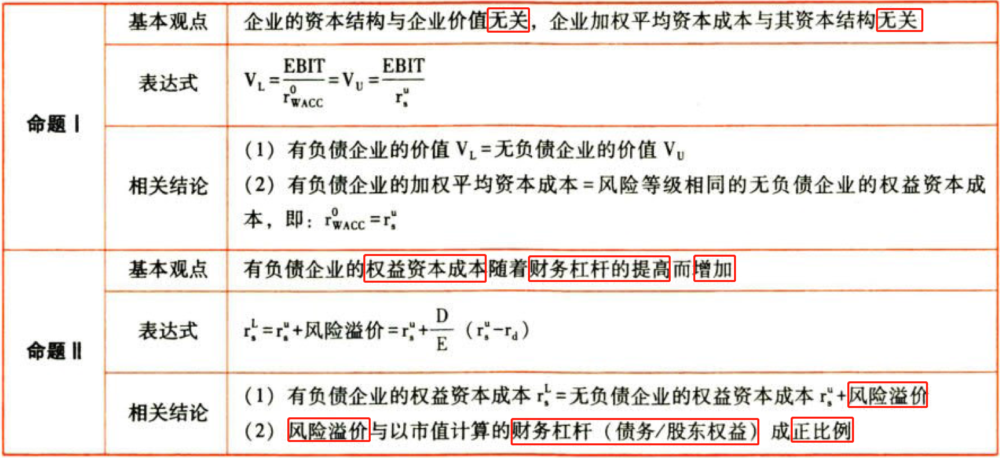

### 1.1.2. 有税MM理论

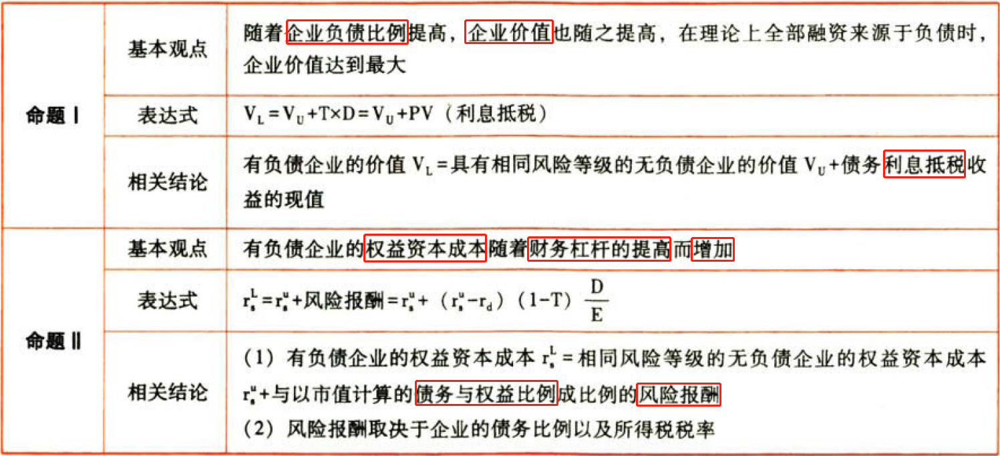

### 1.1.3. 辨析

随着负债比重增大：

| 资本结构对？的影响       | 有税MM理论 | 无税MM理论 |
|--------------------------|------------|------------|
| 企业价值                 | ↑          | 不影响     |
| 加权平均资本成本         | ↓          | 不影响     |
| 负债资本成本             | 不影响     | 不影响     |
| 权益资本成本（债台高筑） | ↑          | ↑          |

债台高筑则权益资本成本高。

无税MM理论认为大家很淡定。

有税MM理论认为利息抵税，因此企业价值高，加权平均资本成本低，而负债资本成本不变。

## 1.2. 资本结构的其他理论:star: :star: 

### 1.2.4. 权衡理论

强调在平衡债务`利息抵税`收益与`财务困境`成本的基础上，实现企业价值最大化时的最佳资本结构。

最优资本结构：“债务抵税收益的边际价值等于增加的财务困境成本的现值”时的那一个债务比率。

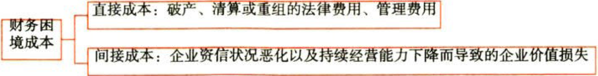

$$V_L=V_U+PV(利息抵税)-PV(财务困境成本)$$

### 1.2.5. 代理理论

以权衡理论为基础，进一步考虑企业债务的`代理成本`和`代理收益`的权衡。

最优资本结构：“债务抵税收益的边际价值＋代理收益的边际价值＝增加的财务困境成本的现值＋增加的代理成本的现值”时的那一个债务比率。

代理成本：

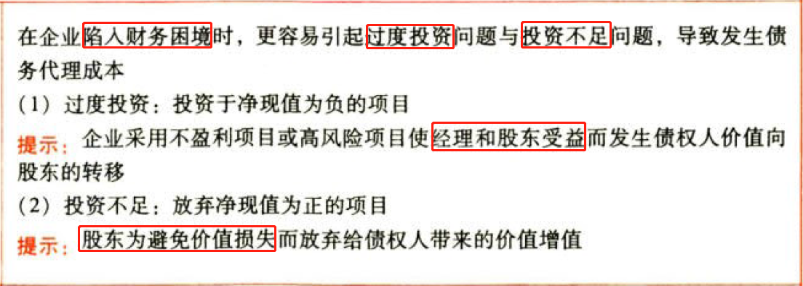

代理收益：

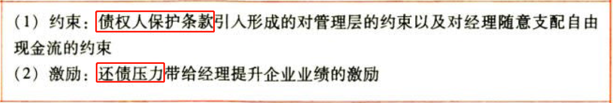

$$V_L=V_U+PV(利息抵税)-PV(财务困境成本)-PV(债务的代理成本)+PV(债务的代理收益)$$

### 1.2.6. 优序融资理论

考虑的因素：信息不对称；逆向选择行为。

最优资本结构：首先选择内源融资，其次会选择债务融资，最后选择股权融资。首先是内部筹资，其后依次是借款、发行债券、可转换债券、优先股，最后是发行普通股筹资。

# 2. 资本结构决策分析

## 2.3. 资本结构的影响因素:star: 

### 2.3.7. 影响因素

### 2.3.8. 具体影响

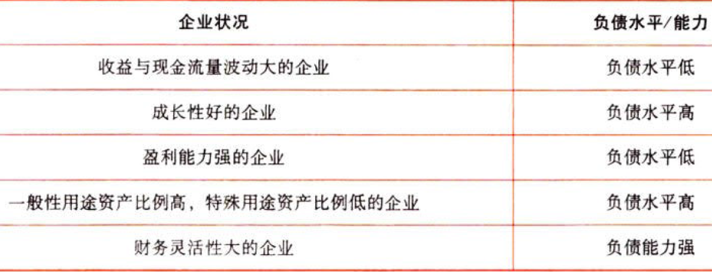

## 2.4. 资本结构决策的分析方法:star: :star: :star: 

### 2.4.9. 资本成本比较法

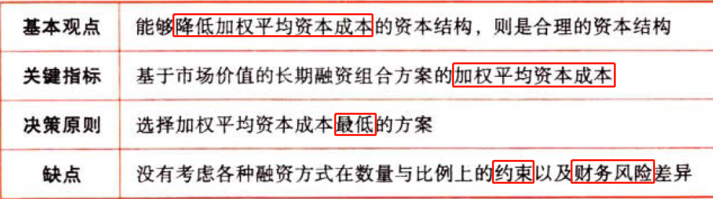

### 2.4.10. 每股收益无差别点法

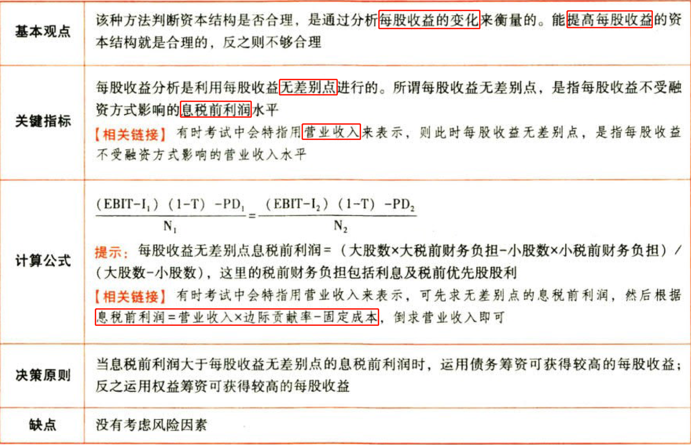

$$\frac{(EBIT-I_1)(1-T)-PD_1}{N_1}=\frac{(EBIT-I_2)(1-T)-PD_2}{N_2}$$

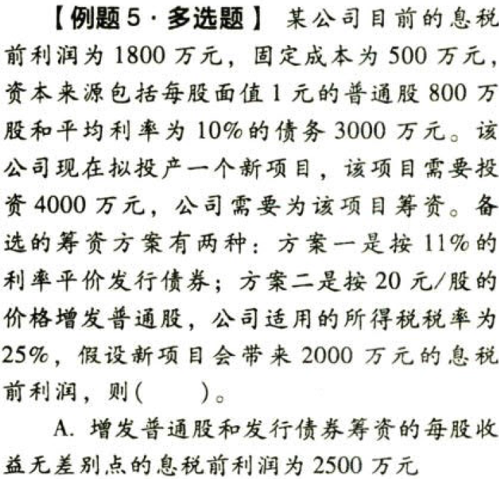

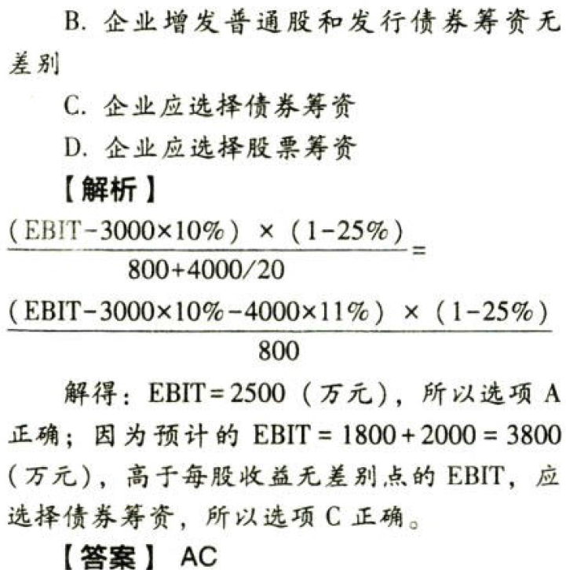

### 2.4.11. 企业价值比较法

判断标准：最佳资本结构是使企业的`总价值最大`的资本结构。在最佳资本结构下，公司的加权平均资本成本也是最低的。

确定方法：

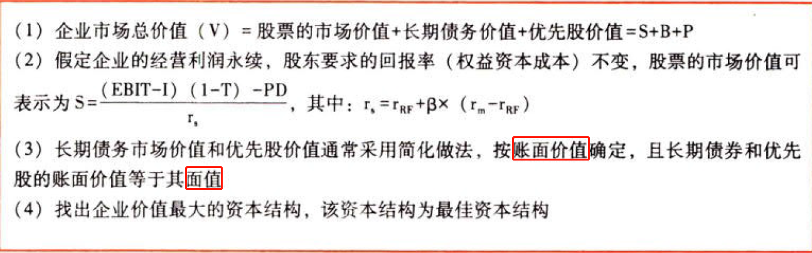

$$企业总价值V=股票价值S+长期债务价值B+优先股价值P$$

$$S=\frac{(EBIT-I)(1-T)-PD}{r_{RF}+\beta\times(r_m-r_{RF})}$$

# 3. 杠杆系数的衡量

## 3.5. 经营风险与财务风险:star: 

## 3.6. 杠杆效应:star: :star: :star: 

### 3.6.12. 含义及种类

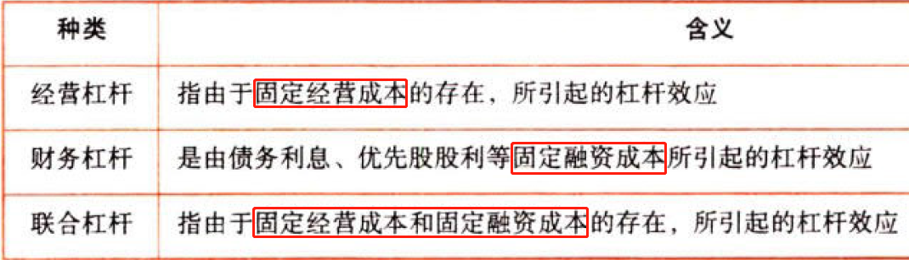

### 3.6.13. 杠杆效应的衡量——杠杆系数

#### 3.6.13.1. 经营杠杆系数（Degree-of-Operating-Leverage）

在一定销售量范围内，固定成本总额不变的情况下，经营杠杆系数说明了$营业收入S（销售量Q）$增长（减少）所引起$EBIT$增长（减少）的幅度

定义公式：

$$DOL=\frac{\Delta{EBIT}/EBIT}{\Delta{S}/S}$$

当产品单价不变时，分母营业收入变化百分比也可以用销售量变化百分比代替，即：

$$DOL=\frac{\Delta{EBIT}/EBIT}{\Delta{Q}/Q}$$

这也是第16章销售量的`敏感系数`的计算方法。

用销量表示：

$$DOL_q=\frac{Q(P-V)}{Q(P-V)-F}$$

可用于计算单一产品的经营杠杆系数

用营业收入表示：

$$DOL_s=\frac{ S-VC }{ S-VC -F}=\frac{EBIT+F }{EBIT}$$

可用于计算多种产品的经营杠杆系数

与第16章安全边际率的关系：

$$DOL_q=\frac{Q}{Q-Q_{盈亏平衡}}=\frac{1}{安全边际率}$$

#### 3.6.13.2. 财务杠杆系数（Degree-of-Financial-Leverage）

财务杠杆系数表明$EBIT$增长（减少）引起的$每股收益EPS$的增长（减少）幅度

定义公式：

$$DFL=\frac{\Delta{EPS}/{EPS}}{\Delta{EBIT}/{EBIT}}$$

简化公式：

$$DFL=\frac{EBIT}{EBIT-I-PD/(1-T)}$$

$$DFL=\frac{Q(P-V)-F}{Q(P-V)-F-I-PD/(1-T)}$$

#### 3.6.13.3. 联合杠杆系数（Degree-of-Total-Leverage）

联合杠杆系数能够估计$营业收入S$变动对$每股收益EPS$造成的影响。

定义公式：

$$DTL=\frac{\Delta{EPS}/{EPS}}{\Delta{S}/S}$$

简化公式：

$$DTL=\frac{Q(P-V)}{Q(P-V)-FI-PD/(1-T)}$$

$$DTL=\frac{EBIT+F}{EBIT-I-PD/(1-T)}$$

关系公式：

$$DTL=DOL\times{DFL}$$

#### 3.6.13.4. 提示

（1）

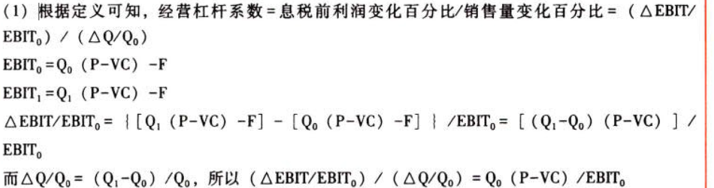

根据上面的公式推导，可以发现在计算本年的经营杠拧系数时，必须采用上一年的数据

（2）

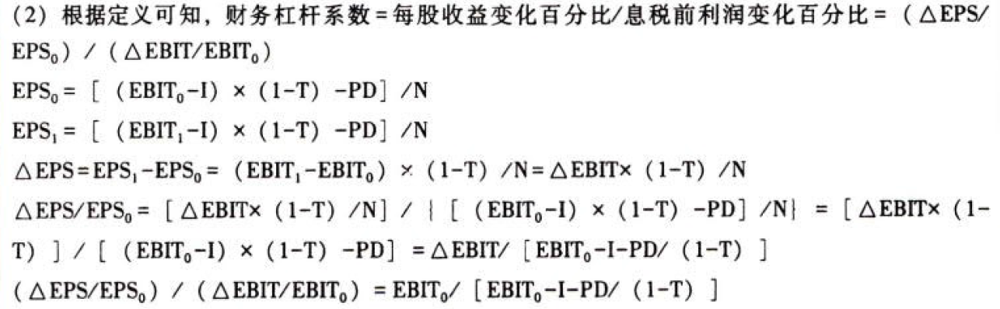

根据上面的公式推导，可以发现在计算本年的财务杠杆系数时，必须采用上一年的数据

#### 3.6.13.5. 定义公式——用于预测

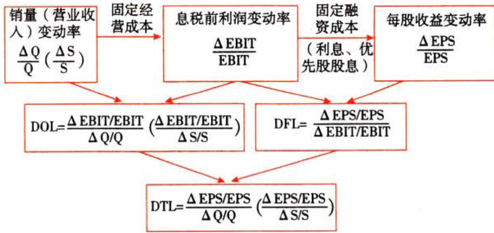

#### 3.6.13.6. 简化计算公式——用于计算

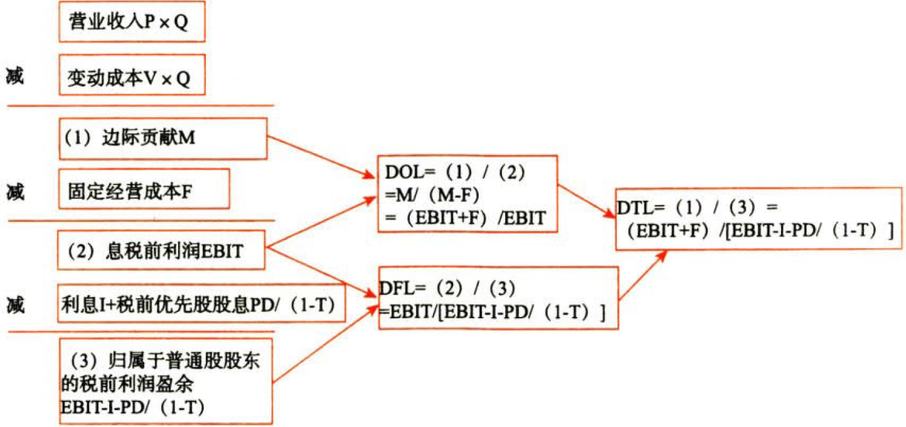

#### 3.6.13.7. 小结

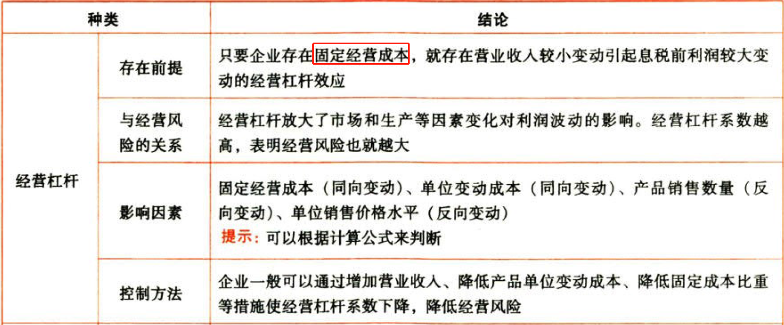

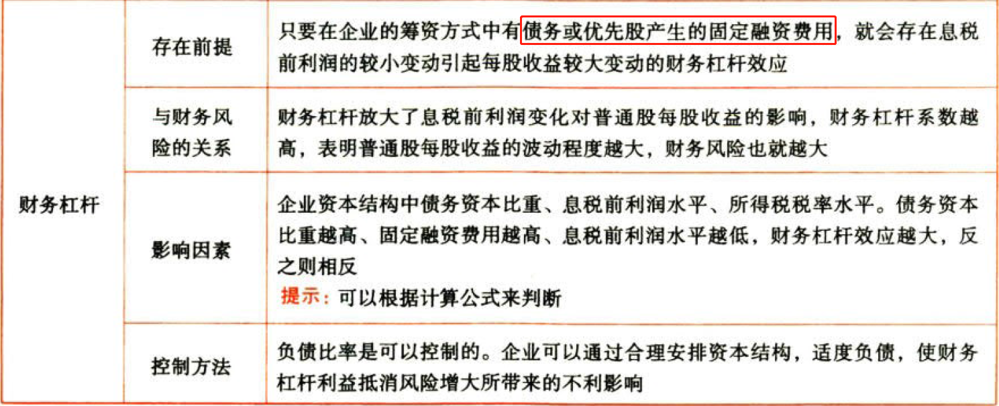

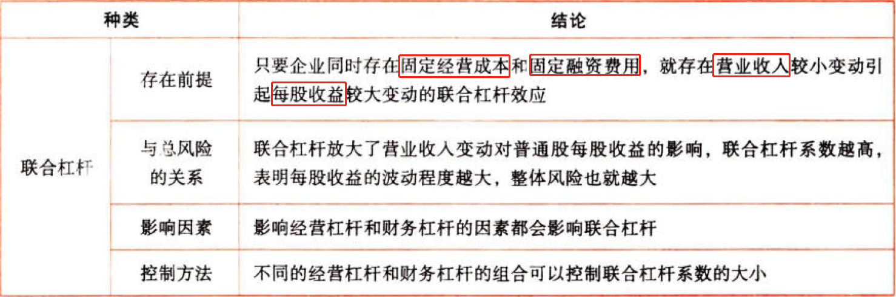

# 4. 总结

End。
